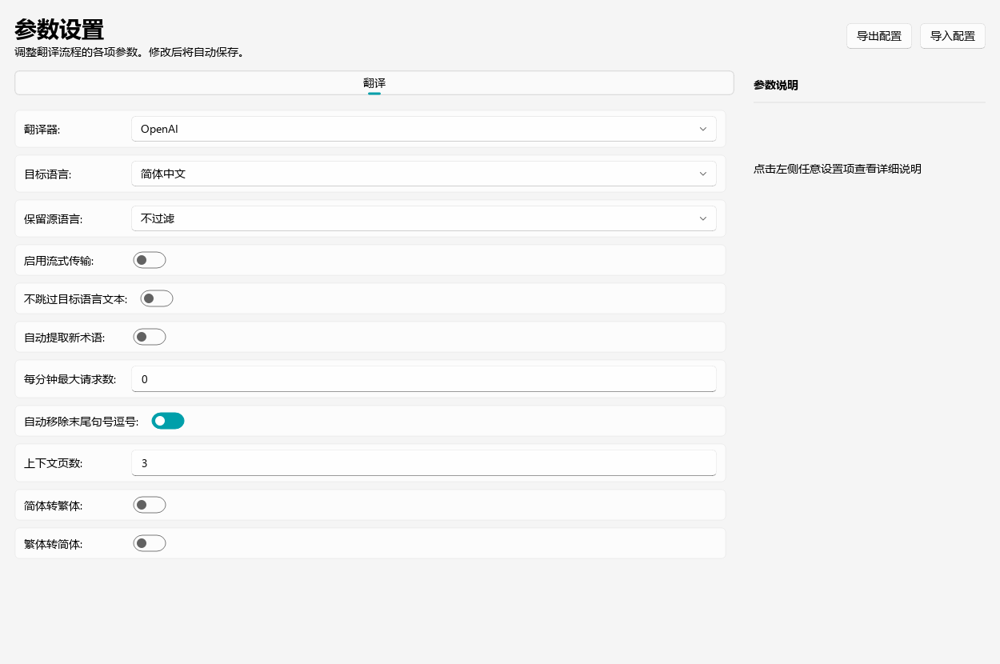
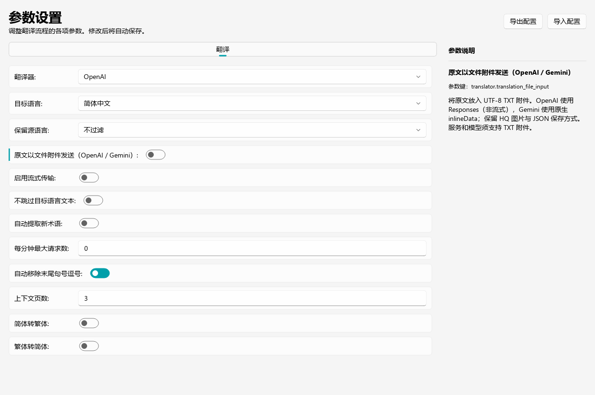

# 原文文件附件输入

OpenAI 和 Gemini 的普通与 HQ 翻译器支持 `translator.translation_file_input`
（默认关闭）。桌面“参数设置 → 翻译”中的“原文以文件附件发送
（OpenAI / Gemini）”可以切换它。关闭后继续使用原有文本输入。
Sakura 等其他翻译器不受此设置影响。

设置界面对比（使用默认示例配置离屏渲染）：

| 修改前 | 修改后（默认关闭） |
| --- | --- |
|  |  |

开启后，每次请求把当前批次的原文条目编码为 UTF-8 `source.txt` 附件。
文件内容为 JSON 数组，保留 `id`、`text`，HQ 增加 `image_index`，AI 断句
启用时保留 `original_region_count`。附件使用 Base64 随请求传输，不需要
额外的文件上传接口，也不产生本地临时文件。

当前 user 的文字部分仅含读取附件、翻译和输出格式要求，不重复原文。
HQ 图片、自定义 system prompt、术语规则和历史文字上下文继续使用。
历史上下文仍以原来的 user/assistant 文字消息发送。

OpenAI 请求发送至配置地址的 `/responses`，服务和模型必须支持 TXT `input_file`。
只支持 `/chat/completions` 的兼容服务不能使用此模式；失败会明确报错，
不会暗中把附件改回原文字符串。关闭开关可恢复原有请求路径。

Gemini 使用原来的 `generateContent` / `streamGenerateContent` 接口，原文文件
作为 `inlineData`（`mimeType=text/plain`）随请求发送，不需要额外 Files API。
继续遵循现有流式开关；HQ 图片作为独立的图片 part 同时发送。日志包含
`source.txt attachment via Gemini inlineData (text/plain)` 时表示走附件输入。
当前服务和模型必须支持 `text/plain` 文件输入，不会静默退回文本输入。

OpenAI 第一版附件模式采用非流式请求，不改变保存流程。模型仍返回
`{"translations": [{"id": 1, "translation": "译文"}]}`，适配层把响应
交给现有解析、数量检查、质量检查和工程 JSON 保存流程。
不会自动改变导出路径或覆盖策略，仍需遵循既有的“覆盖已存在文件”设置。

验证：`python -m unittest discover -s test -p test_translation_file_input.py -v`
或 `uv run --no-sync pytest test/test_translation_file_input.py -q`。
此检查只使用离线模拟响应，不读取 API 密钥或调用模型。
