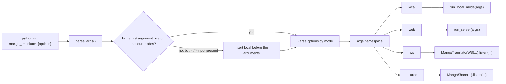
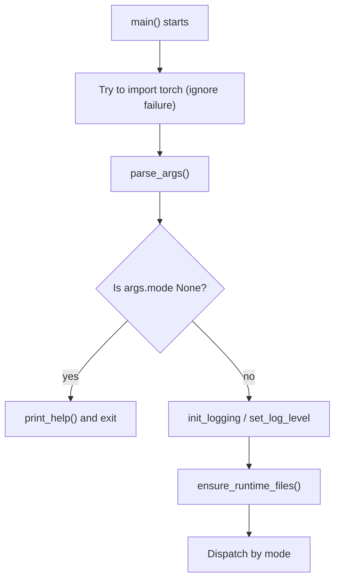

# Command Structure

Use this page when you run the tool directly from a terminal instead of the desktop UI and need to know the official entry point and subcommands. There is exactly one official CLI entry point: `python -m manga_translator <mode> [options]`; `parse_args()` parses the command line into a single `args` namespace and dispatches it to one of the `local`, `web`, `ws`, and `shared` execution chains. `--help` is provided by `argparse`: the top-level help lists only the modes, so use `<mode> --help` to inspect options.

This page fixes the entry point, subcommands, and `--help` contract only. Input/output, configuration overrides, workflows, subprocess memory, debug artifacts, and the internal protocols of the three service modes are covered by [Local input and output](./local-input-output.md), [Configuration overrides](./configuration-overrides.md), [Workflows and file modes](./workflow-and-file-modes.md), [Subprocess memory and recovery](./subprocess-memory-and-recovery.md), [Output, debugging, and exit codes](./output-debugging-and-exit-codes.md), and [web/ws/shared modes](./web-ws-and-shared-modes.md).

## Feature boundary {#feature-boundary}

- The only official entry point is `python -m manga_translator <mode> [options]`; in this repository the equivalent invocation under the managed runtime is `uv run --no-sync python -m manga_translator <mode> [options]`.
- The top level registers exactly four subcommands: `local`, `web`, `ws`, and `shared`; `local` is the only one that supports the implicit-mode shortcut.
- `local` is the only subcommand with a required option (`-i/--input`); all options of the other three modes have defaults.
- There are no top-level business options that apply to all four modes; `python -m manga_translator --help` lists only the modes and the help option.
- This page does not treat standalone module entries (for example `python -m manga_translator.mode.local`) or the parser in `manga_translator/server/args.py` as part of the official top-level contract.

## Terminal operations {#terminal-operations}

### View the top-level help {#top-level-help}

Run the following from the repository root:

```powershell
uv run --no-sync python -m manga_translator --help
```

The usage line reads `__main__.py [-h] {web,local,ws,shared} ...`; the positional arguments list the four modes and options contains only `-h, --help`. The top level uses the default `argparse` formatter, so subcommand options are not expanded into the root help and parsed defaults are not printed automatically.

### View subcommand help {#subcommand-help}

Every subcommand provides `-h/--help`:

```powershell
uv run --no-sync python -m manga_translator local --help
uv run --no-sync python -m manga_translator web --help
uv run --no-sync python -m manga_translator ws --help
uv run --no-sync python -m manga_translator shared --help
```

`local` also supports the implicit-mode shortcut: when the first user argument is not one of the four modes and the argument list contains `-i` or `--input`, the parser inserts `local` before parsing. For example, `uv run --no-sync python -m manga_translator -i placeholder.png --help` shows a usage line of `__main__.py local ...`. A bare positional argument never triggers this fallback.

### CLI group in desktop settings {#cli-settings-group}

CLI options are not graphical controls, and the `--help` text is fixed Chinese in the source, not i18n-driven. However, the configuration keys overridden by the CLI map one-to-one to the rows of the “Basic Settings” (`Basic Settings`) group in desktop settings. That group renders labels through the `label_*` and `desc_cli_*` key families. The following table records the actual display values:

| UI call key | English actual value | Simplified Chinese actual value |
| --- | --- | --- |
| `label_verbose` | Verbose Logging | 详细日志 |
| `label_attempts` | Retry Attempts | 重试次数 |
| `label_ignore_errors` | Ignore Errors | 忽略错误 |
| `label_use_gpu` | Use GPU | 使用 GPU |
| `label_disable_onnx_gpu` | Disable ONNX GPU Acceleration | 禁用 ONNX GPU 加速 |
| `label_context_size` | Context Pages | 上下文页数 |
| `label_format` | Output Format | 输出格式 |
| `label_overwrite` | Overwrite Existing Files | 覆盖已存在文件 |
| `label_skip_no_text` | Skip Images Without Text | 跳过无文本图像 |
| `label_save_text` | Editable Image | 图片可编辑 |
| `label_load_text` | Import Translation | 导入翻译 |
| `label_translate_json_only` | Translate JSON Only | 仅翻译（JSON） |
| `label_template` | Export Original Text | 导出原文 |
| `label_save_quality` | Image Save Quality | 图像保存质量 |
| `label_batch_size` | Batch Size | 批量大小 |
| `label_batch_concurrent` | Concurrent Batch Processing | 并发批量处理 |
| `label_generate_and_export` | Export Translation | 导出翻译 |
| `label_export_editable_psd` | Export Editable PSD | 导出可编辑PSD |
| `label_save_to_source_dir` | Save to Source Directory | 输出到原图目录 |
| `label_psd_script_only` | Generate PSD Script Only | 仅生成PSD脚本 |

Row descriptions use the call key `desc_cli_<name>` (the settings row key is `cli.<name>` with dots replaced by underscores); for example `desc_cli_attempts` (EN=“Retry count when an API call fails. Set to -1 for unlimited retries.”, ZH=“调用 API 出错时的重试次数。设为 -1 表示无限重试。”). The remaining `desc_cli_*` keys can be checked under the same names in both locales.

## Subcommands and options {#subcommands-and-options}

### Top-level subcommands {#subcommand-overview}

The top-level parser registers exactly the following four subcommands. After parsing, `__main__.py` dispatches the same `args` namespace to the corresponding execution chain.

| Subcommand | Purpose | Top-level dispatch target | Default network endpoint (if any) |
| --- | --- | --- | --- |
| `local` | Translate local images/folders | `mode.local.run_local_mode(args)` | No listening port |
| `web` | HTTP API and web UI server | `server.run_server(args)` | `0.0.0.0:8000`, overridable via `MT_WEB_HOST` / `MT_WEB_PORT` |
| `ws` | Internal WebSocket backend | `MangaTranslatorWS(...).listen(...)` | Listens on `127.0.0.1:5003`; upstream URL `ws://localhost:5000` |
| `shared` | Internal shared/API instance | `MangaShare(...).listen(...)` | `127.0.0.1:5003` |



### local options {#local-options}

| Option | Type / default | Actual `--help` and parsing semantics |
| --- | --- | --- |
| `-i INPUT [INPUT ...]`, `--input INPUT [INPUT ...]` | Required, one or more strings | Input image or folder paths |
| `-o OUTPUT`, `--output OUTPUT` | String; `None` | Output directory (default: source directory plus `-translated` suffix) |
| `--config CONFIG` | String; `None` | Config file path (default: `config/config.json`) |
| `-v`, `--verbose` | Flag; `False` | Show detailed logs |
| `--overwrite` | Flag; `False` | Overwrite existing files |
| `--use-gpu` | Flag; `None` | Use GPU acceleration (overrides the config file) |
| `--disable-onnx-gpu` | Flag; `None` | Disable ONNX Runtime GPU acceleration (overrides the config file) |
| `--format FORMAT` | String; `None` | Output format: `png/jpg/jpeg/jfif/webp/avif/bmp/tiff/tif/heic/heif` (overrides the config file); no `choices` is set at parse time |
| `--batch-size BATCH_SIZE` | Integer; `None` | Batch processing size (overrides the config file) |
| `--attempts ATTEMPTS` | Integer; `None` | Retry count on translation failure; `-1` means unlimited (overrides the config file) |
| `--subprocess` | Flag; `False` | Enable subprocess mode (memory management and resume) |
| `--memory-limit MEMORY_LIMIT` | Integer; `0` | Absolute memory limit (MB); restart the subprocess above it; `0` means unlimited |
| `--memory-percent MEMORY_PERCENT` | Integer; `0` | Memory percentage limit; restart above this share of system memory; `0` means unlimited |
| `--batch-per-restart BATCH_PER_RESTART` | Integer; `0` | Restart the subprocess after every N images to release memory; `0` means unlimited |

The non-subprocess path writes explicit `--use-gpu`, `--disable-onnx-gpu`, `--format`, `--batch-size`, and `--attempts` into `cli_config` (the corresponding `cli.*` configuration keys); `--memory-limit`, `--memory-percent`, and `--batch-per-restart` are passed to `translate_with_subprocess` only in the `--subprocess` path.

### web options {#web-options}

| Option | Type / default | Actual `--help` and parsing semantics |
| --- | --- | --- |
| `--host HOST` | String; `MT_WEB_HOST` or `0.0.0.0` | Server host (env: `MT_WEB_HOST`) |
| `--port PORT` | Integer; `MT_WEB_PORT` or `8000` | Server port (env: `MT_WEB_PORT`) |
| `--use-gpu` | Flag; true when `MT_USE_GPU` is `true`, `1`, `yes`, or `on` | Use GPU (env: `MT_USE_GPU=true`) |
| `--disable-onnx-gpu` | Flag; `MT_DISABLE_ONNX_GPU` uses the same truthiness rule | Disable ONNX Runtime GPU acceleration (env: `MT_DISABLE_ONNX_GPU=true`) |
| `--models-ttl MODELS_TTL` | Integer; `MT_MODELS_TTL` or `0` | Seconds to keep models in memory after last use; `0` means forever (env: `MT_MODELS_TTL`) |
| `--retry-attempts RETRY_ATTEMPTS` | Integer; `None` when `MT_RETRY_ATTEMPTS` is unset | Retry count on translation failure; `-1` means unlimited, `None` uses the API-provided config (env: `MT_RETRY_ATTEMPTS`) |
| `-v`, `--verbose` | Flag; true when `MT_VERBOSE` is `true`, `1`, or `yes` | Show detailed logs (env: `MT_VERBOSE=true`) |

### ws options {#ws-options}

| Option | Type / default | Actual `--help` and parsing semantics |
| --- | --- | --- |
| `--host HOST` | String; `127.0.0.1` | WebSocket service host |
| `--port PORT` | Integer; `5003` | WebSocket service port |
| `--nonce NONCE` | String; `None` | Nonce protecting internal WebSocket communication |
| `--ws-url WS_URL` | String; `ws://localhost:5000` | Upstream WebSocket server URL |
| `--models-ttl MODELS_TTL` | Integer; `0` | Seconds to keep models in memory after last use; `0` means forever |
| `--retry-attempts RETRY_ATTEMPTS` | Integer; `None` | Retry count on translation failure; `-1` means unlimited, `None` uses the API-provided config |
| `-v`, `--verbose` | Flag; `False` | Show detailed logs |
| `--use-gpu` | Flag; `False` | Use GPU |
| `--disable-onnx-gpu` | Flag; `MT_DISABLE_ONNX_GPU` uses the top-level truthiness rule | Disable ONNX Runtime GPU acceleration |

### shared options {#shared-options}

| Option | Type / default | Actual `--help` and parsing semantics |
| --- | --- | --- |
| `--host HOST` | String; `127.0.0.1` | Internal API service host |
| `--port PORT` | Integer; `5003` | Internal API service port |
| `--nonce NONCE` | String; `None` | Nonce protecting internal API server communication |
| `--models-ttl MODELS_TTL` | Integer; `0` | Model in-memory TTL in seconds; `0` means forever |
| `--retry-attempts RETRY_ATTEMPTS` | Integer; `None` | Retry count on translation failure; `-1` means unlimited, `None` uses the API-provided config |
| `-v`, `--verbose` | Flag; `False` | Show detailed logs |
| `--use-gpu` | Flag; `False` | Use GPU |
| `--disable-onnx-gpu` | Flag; `MT_DISABLE_ONNX_GPU` uses the top-level truthiness rule | Disable ONNX Runtime GPU acceleration |

## Runtime behavior {#runtime-behavior}

### Parsing and the implicit local mode {#parse-and-implicit-local}

`args.py#parse_args()` first creates the top-level parser with four subparsers, then inspects `sys.argv`: when the first argument is not one of the four modes and the argument list contains `-i` or `--input`, it inserts `local` before the first argument. After parsing, if `args.mode` is still `None`, it prints the top-level help and exits; otherwise it returns `args`. `__main__.py` tries to import `torch` before parsing (ignoring an `ImportError`), so in environments where PyTorch is missing or has incompatible DLLs, even `--help` can fail before parsing.



### Dispatch and shared initialization {#dispatch-and-shared-init}

After parsing, `__main__.py` exports `args.disable_onnx_gpu` to the environment as `MT_DISABLE_ONNX_GPU=1`, initializes logging (DEBUG with `-v`, otherwise INFO), and calls `ensure_runtime_files()` before dispatching to release the external config tables and AI prompt tables uniformly. Then it dispatches on `args.mode`: `local` runs `asyncio.run(run_local_mode(args))`; `web` runs `run_server(args)`; `ws` constructs `MangaTranslatorWS(vars(args))` and calls `listen`; `shared` constructs `MangaShare(vars(args))` and calls `listen`. The host, port, nonce, and connection fields of `ws`/`shared` are passed to the constructors through `vars(args)`; see [Top-level subcommands](#subcommand-overview) for the default endpoints. The `web` option defaults come from `MT_*` environment variables and are evaluated at process startup, so the baseline values printed by `--help` (for example `0.0.0.0`, `8000`) are not guaranteed to be the effective values of a given run.

## Dependencies and conflicts {#dependencies-and-conflicts}

- `python -m manga_translator.mode.local --help` returns `0`, but it is a standalone module entry, not part of the official top-level contract: its parser additionally exposes `--resume` and `--concurrent`, lacks the top-level `local` options for GPU, ONNX, format, batch size, and attempts, and its memory parameters default to `8000`, `80`, `50` instead of `0`, `0`, `0`. `__main__.py` never calls this parser.
- `manga_translator/server/args.py` defines a separate `parse_arguments()` that is not wired into the top-level dispatch; the direct module guard of `server/main.py` also imports the nonexistent `manga_translator.args.parse_arguments` (the official top level defines `parse_args`). It cannot replace the official `web` command.
- The subprocess path of `local` writes only `--use-gpu` and `--disable-onnx-gpu` into `cli_config` and hands the original config to `translate_with_subprocess`; combined with `--subprocess`, the “overrides the config file” behavior of `--format`, `--batch-size`, or `--attempts` is not present in that branch. This is a source-level difference, not a completed runtime verification.
- The `--resume` declared by the standalone `local.py` parser is not forwarded from `run_local_mode()` to `translate_with_subprocess(..., resume=...)`; its help text does not mean the resume behavior is wired up.
- `--memory-limit`, `--memory-percent`, and `--batch-per-restart` are consumed only in the `--subprocess` path; they do not participate in translation when subprocess mode is off.
- The `web` option help text shows the source baseline values; the real defaults can be overridden by `MT_*` environment variables at startup, so effective values cannot be inferred from help text alone.
- Full service startup, real input translation, model/API dependencies, port occupation, and internal protocols are outside this page's verification scope; they are handled by the corresponding feature pages and runtime verification.

## Related files and formats {#related-files-and-formats}

| File | Actual role on this page | Manual-edit and compatibility note |
| --- | --- | --- |
| `manga_translator/args.py` | Top-level subparsers, all official options, defaults, and the implicit-`local` rule | Re-run every `<mode> --help` after any change |
| `manga_translator/__main__.py` | Pre-parse torch import, logging init, `ensure_runtime_files()`, and four-mode dispatch | New modes require updating `args.py` and the dispatch together |
| `manga_translator/image_formats.py` | Single source of the `local --format` help list via `OUTPUT_IMAGE_FORMATS` | Update this file when supported formats change |
| `manga_translator/mode/local.py` | `run_local_mode()` and CLI override writes | Non-subprocess and subprocess branches override differently |
| `manga_translator/mode/subprocess_manager.py` | Memory parameters and the `resume` interface of `translate_with_subprocess` | The official `local` never passes `resume` |
| `manga_translator/server/main.py` | `run_server` for the `web` dispatch | The direct module-guard import difference is described under dependencies and conflicts |
| `manga_translator/mode/ws.py`, `manga_translator/mode/share.py` | `ws`/`shared` constructors and `listen` | Port/protocol details are covered by [web/ws/shared modes](./web-ws-and-shared-modes.md) |
| `config/config-example.json` and other config templates | Source of the `cli.*` defaults overridden by the CLI | See `doc/wiki/research/default-sources.md` for three-layer default differences |

## Mermaid data-flow limits {#mermaid-limits}

The two diagrams above describe real parsing branches and dispatch order in the source; they do not claim that this verification started a server, translated an image, or made a network request. `args.mode` being `None`, a missing `-i`, standalone module entries, and `server/args.py` all take their documented bypasses; the verification record covers only the `--help` phase and does not fabricate runtime screenshots or private task artifacts.

## Source evidence {#source-evidence}

| Layer | File | What was checked |
| --- | --- | --- |
| Entry and dispatch | `manga_translator/__main__.py` | Pre-parse torch import, `parse_args()` call, `ensure_runtime_files()`, and four-mode dispatch |
| Argument parsing | `manga_translator/args.py` | Four subparsers, all official options, defaults, the `_env_true` truthiness rule, and implicit `local` |
| local execution | `manga_translator/mode/local.py` | `run_local_mode()`, CLI override writes, and standalone parser differences |
| Subprocess | `manga_translator/mode/subprocess_manager.py` | Memory parameters and the `resume` interface of `translate_with_subprocess` |
| web dispatch | `manga_translator/server/main.py` | `run_server` and the direct module guard |
| ws/shared | `manga_translator/mode/ws.py`, `manga_translator/mode/share.py` | Constructors, `listen`, and connection fields |
| Format source | `manga_translator/image_formats.py` | `OUTPUT_IMAGE_FORMATS` builds the `local --format` help list |

## Verification {#verification}

| Check | Status | Notes |
| --- | --- | --- |
| BLUEPRINT, PAGE_GUIDELINES, TODO | Complete | Read in full and followed the page contract |
| Actual `--help` output | Complete | Ran `uv run --no-sync python -m manga_translator --help` plus `local`/`web`/`ws`/`shared --help` and `-i placeholder.png --help` locally; all exited `0` and match `research/cli-command-inventory.md`; no arguments prints the top-level help |
| Source check | Complete | Statically checked `args.py`, `__main__.py`, `mode/local.py`, `mode/subprocess_manager.py`, `server/main.py`, `mode/ws.py`, `mode/share.py`, and `image_formats.py` |
| i18n copy | Complete | `label_*` and `desc_cli_*` keys checked against the actual `en_US.json` and `zh_CN.json` values |
| Sanitized runtime verification | Deferred | No server started, no real image translated, and no `.env`, API key/token, user file, or private prompt was read |
| VitePress | Deferred | Coordinator should run `npm run docs:build --prefix doc/wiki` plus mirror/source checks before merge |
