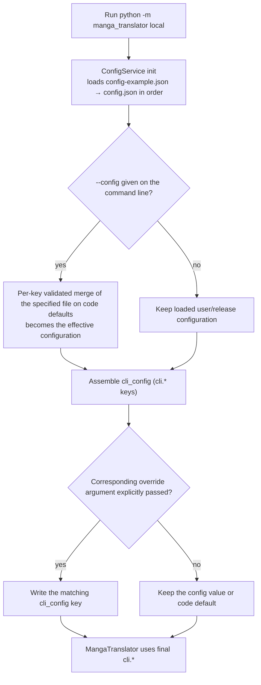
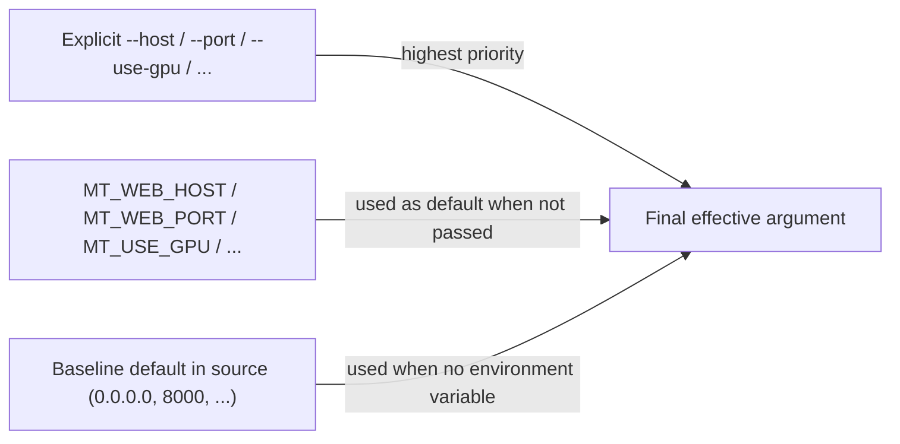
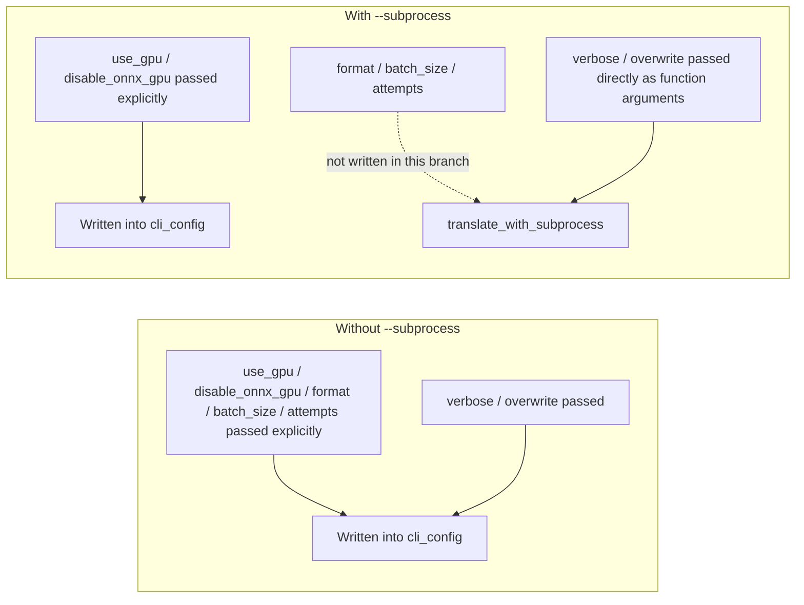

# CLI Configuration Overrides

Use this page when you run `local` from the command line and want that run to use a different configuration file, or to adjust a few settings without editing `config/config.json`. There are three paths: `--config` selects the configuration file, explicit CLI arguments override `cli.*` values from the file, and `MT_*` environment variables provide argument defaults for `web`, `ws`, and `shared`.

This page only explains where configuration comes from and what overrides what. Command structure is covered in [Command structure](./command-structure.md), inputs and outputs in [Local input and output](./local-input-output.md), subprocess and memory arguments in [Subprocess, memory, and recovery](./subprocess-memory-and-recovery.md), and service-mode startup in [Web/WS/Shared modes](./web-ws-and-shared-modes.md).

## Feature boundary {#feature-boundary}

- `--config` exists only on the `local` subcommand; `web`, `ws`, and `shared` have no configuration-file option.
- Explicit CLI arguments override only `cli.*` keys from the configuration file; when a value is not passed, the file value or default is kept. The help text's “overrides the configuration file” holds only when the argument is explicitly provided.
- `MT_*` environment variables only feed default values for `web`/`ws`/`shared`; `local` has no `MT_*` argument defaults.
- CLI overrides affect the current run only and never write values back to a configuration file.
- Credentials such as API keys are resolved through `.env` and the API-management pages; they are outside this page's scope.

## Using --config to select a configuration file {#config-flag}

`local` uses `--config` to select the configuration file for the current run:

```powershell
uv run --no-sync python -m manga_translator local -i input.png --config path/to/my-config.json
```

The option's help text is hardcoded Chinese in the source; its meaning is: configuration-file path, defaulting to `config/config.json`. When `--config` is provided, `run_local_mode` calls `load_config_file()`; on failure it prints a “cannot load configuration file” message and exits with code `1`.

### Configuration loading chain {#config-load-chain}

`ConfigService` initialization loads, validates, and deep-merges in this order:

| Order | Source | Notes |
| --- | --- | --- |
| 1 | User config `config/config.json` | Loaded first and overrides the defaults below |
| 2 | Release template `config/config-example.json` | Used as the base when the user config is absent |
| 3 | Qt code defaults `AppSettings()` | Fallback when files are missing or keys are invalid |

When `--config` is provided, the specified file is loaded as a whole on top of code defaults and becomes the effective configuration; the previously loaded user `config/config.json` is not merged on top of it. Each file is validated per key; invalid keys fall back to defaults and are logged (at most the first 5 keys).

### When the specified file fails {#config-load-failure}

| Failure cause | Command-line behavior |
| --- | --- |
| File does not exist | `load_config_file` returns failure; a “cannot load configuration file” message is printed and the process exits with code `1` |
| JSON parse error | Same as above |
| Final model validation fails | Falls back to the default config and returns failure; command-line behavior is the same |

## Argument override priority {#override-priority}

Effective priority, from highest to lowest:

1. Explicit CLI arguments (override only when explicitly passed).
2. Configuration file: the `--config` file > user `config/config.json` > release `config/config-example.json`.
3. Code defaults: Qt `AppSettings()` / core `Config()`.

CLI overrides happen while assembling `cli_config` before translation starts; they do not change file contents.

### Which arguments override configuration {#overridable-options}

| CLI argument | Config key written | Parser default | Override condition |
| --- | --- | --- | --- |
| `--use-gpu` | `cli.use_gpu` | `None` | Overrides when explicitly passed |
| `--disable-onnx-gpu` | `cli.disable_onnx_gpu` | `None` | Overrides when explicitly passed |
| `--format` | `cli.format` | `None` | Overrides when explicitly passed |
| `--batch-size` | `cli.batch_size` | `None` | Overrides when explicitly passed |
| `--attempts` | `cli.attempts` | `None` | Overrides when explicitly passed; `-1` means infinite retries |
| `-v` / `--verbose` | `cli.verbose` | `False` | Passing forces it on; not passing keeps the config value |
| `--overwrite` | `cli.overwrite` | `False` | Passing forces it on; not passing keeps the config value |

`-i/--input`, `-o/--output`, `--config`, `--subprocess`, `--memory-limit`, `--memory-percent`, and `--batch-per-restart` are run-level arguments, not `cli.*` overrides.

### No value passed means no override {#explicit-only}

- `--use-gpu`, `--disable-onnx-gpu`, `--format`, `--batch-size`, and `--attempts` default to `None`; they write into `cli_config` only when explicitly passed, otherwise the file value or default is kept.
- `-v` and `--overwrite` are `store_true` switches; passing them only enables. If `cli.verbose` or `cli.overwrite` is `true` in the file, it takes effect even without the flag; the CLI cannot “turn off” an enabled config value by omitting the flag.
- The `--format` help lists `png/jpg/jpeg/jfif/webp/avif/bmp/tiff/tif/heic/heif`, but the parser does not set `choices`; a value outside the list fails later at save time, not at parse time.

### Subprocess-mode differences {#subprocess-difference}

With `--subprocess`, `run_local_mode` writes only explicitly passed `--use-gpu` and `--disable-onnx-gpu` into `cli_config` and hands the configuration to `translate_with_subprocess`; the “overrides the configuration file” behavior of `--format`, `--batch-size`, and `--attempts` does not enter that branch. `-v`/`--overwrite` are passed as function arguments. This is a source-level discrepancy and has not been verified at runtime; the five override arguments take effect per the help semantics only without `--subprocess`.

## Environment variables {#environment-variables}

`args.py` reads process environment variables as argument defaults when creating the parser; argparse uses them only when the argument is not passed explicitly:

| Environment variable | Affected option | Default | Modes |
| --- | --- | --- | --- |
| `MT_WEB_HOST` | `--host` | `0.0.0.0` | `web` |
| `MT_WEB_PORT` | `--port` | `8000` | `web` |
| `MT_USE_GPU` | `--use-gpu` | `false` | `web` |
| `MT_DISABLE_ONNX_GPU` | `--disable-onnx-gpu` | `false` | `web`/`ws`/`shared` |
| `MT_MODELS_TTL` | `--models-ttl` | `0` (keep forever) | `web` |
| `MT_RETRY_ATTEMPTS` | `--retry-attempts` | `None` when unset (use API-provided config) | `web` |
| `MT_VERBOSE` | `-v` / `--verbose` | `false` | `web` |

Priority is: explicit CLI argument > environment variable > baseline default in help/source. `MT_WEB_PORT`, `MT_MODELS_TTL`, and `MT_RETRY_ATTEMPTS` are parsed with `int()`; invalid values raise an error while creating the parser. After `--disable-onnx-gpu` is passed in any mode, `__main__.py` exports `MT_DISABLE_ONNX_GPU=1` before dispatch so runtime code sees it.

### Environment-variable truth rule {#env-truth-rule}

- `MT_USE_GPU` and `MT_DISABLE_ONNX_GPU` use the shared `_env_true` rule: the lowercased value is truthy when in `true`, `1`, `yes`, `on`.
- `MT_VERBOSE` uses an inline check that accepts only `true`, `1`, `yes` — **not `on`**. This is a source-level discrepancy and must be kept.

### Environment variables and the .env boundary {#env-dotenv-boundary}

- `local`: `ConfigService` reads the project-root `.env` (next to the executable when packaged) with `override=True` during initialization, mainly for credentials such as API keys; it does not participate in `cli.*` overrides.
- `web`: `.env` is loaded with `override=False` when the `server` package is imported, which is later than `parse_args()` computes `MT_*` defaults. Therefore `MT_WEB_HOST`/`MT_WEB_PORT` written only into `.env` do not change the already-computed `--host`/`--port` defaults; set them in the process environment or pass explicit flags. (Source-level conclusion; not runtime-verified.)
- `MT_WEB_NONCE` is not a top-level `args.py` default; the server reads it at startup. See [Web/WS/Shared modes](./web-ws-and-shared-modes.md).

## Parameters and options {#parameters-and-options}

CLI arguments have no i18n entries; the `--help` text is hardcoded Chinese in the source. The table lists the desktop-settings labels (UI call keys `label_*`) for the `cli.*` storage keys these arguments write. Controls, effective stages, and final consumers of each `cli.*` parameter are in [CLI batch and output parameters](../desktop/settings/cli-batch-and-output.md).

### Stored value / English / Simplified Chinese {#option-matrix}

| Stored value | English actual value | Simplified Chinese actual value |
| --- | --- | --- |
| `cli.use_gpu` | Use GPU | 使用 GPU |
| `cli.disable_onnx_gpu` | Disable ONNX GPU Acceleration | 禁用 ONNX GPU 加速 |
| `cli.format` | Output Format | 输出格式 |
| `cli.batch_size` | Batch Size | 批量大小 |
| `cli.attempts` | Retry Attempts | 重试次数 |
| `cli.verbose` | Verbose Logging | 详细日志 |
| `cli.overwrite` | Overwrite Existing Files | 覆盖已存在文件 |
| `cli.batch_concurrent` | Concurrent Batch Processing | 并发批量处理 |
| `cli.context_size` | Context Pages | 上下文页数 |
| `cli.save_quality` | Image Save Quality | 图像保存质量 |

### Three-layer defaults {#default-layers}

| Stored key | Core `Config()` | Qt `AppSettings()` | Release `config/config-example.json` |
| --- | --- | --- | --- |
| `cli.use_gpu` | `true` | `true` | `true` |
| `cli.disable_onnx_gpu` | `false` | `false` | `false` |
| `cli.format` | `None` | `"不指定"` | `"不指定"` |
| `cli.batch_size` | `1` | `1` | `3` |
| `cli.attempts` | `-1` | `-1` | `3` |
| `cli.verbose` | `false` | `false` | `false` |
| `cli.overwrite` | `false` | `true` | `true` |

## Override-priority diagrams {#priority-diagram}

The following diagram answers “what `cli.*` value the user sees when an argument is or is not passed, and when `--config` is or is not given” (`local`, non-subprocess path):



Limitation: this diagram describes only the non-subprocess `local` path; the `--subprocess` branch is covered below. `-i`, `-o`, `--config`, and the memory arguments are not `cli.*` overrides.

Argument-default priority for `web`/`ws`/`shared`:



Limitation: environment-variable defaults are computed once in `parse_args()` from the process environment; `.env` loading happens at server import, later than that stage.

Override difference between subprocess and non-subprocess paths:



Limitation: this diagram comes from static source. Whether `--format`/`--batch-size`/`--attempts` really do not take effect in the subprocess branch is not runtime-verified; the help text and source differ.

## Dependencies and conflicts {#dependencies-and-conflicts}

- `--config` exists only on `local`; `web`, `ws`, and `shared` have no configuration-file argument.
- CLI overrides affect the current run only and never write back to `config/config.json`; the next run loads from the file again.
- When `cli.verbose`/`cli.overwrite` is `true`, it takes effect even without `-v`/`--overwrite`; a switch argument cannot turn off an enabled config value.
- `--use-gpu`/`--disable-onnx-gpu` default to `None` on `local` (no override), which differs from `web`, where environment variables provide defaults.
- `--attempts` (`local`) and `--retry-attempts` (`web`) both accept `-1` for infinite retries but belong to different subcommands with different default sources.
- `cli.batch_concurrent` from the file is force-disabled under special workflows (see [Workflow and file modes](./workflow-and-file-modes.md)); the formal `local` parser has no `--concurrent` argument, so the CLI cannot override it.
- This page does not cover API keys, `.env` credential resolution, or candidate rotation; see the API-management pages and [Translator selection](../desktop/translator/selection-and-languages.md).

## Related files and formats {#related-files-and-formats}

| File/format | Actual role on this page | Manual-edit and compatibility note |
| --- | --- | --- |
| `config/config.json` | Default user-config path when `--config` is absent | Never read or display a real user file; no private absolute paths in committed docs |
| `config/config-example.json` | Release default template used as the base when no user config exists | Reference sanitized defaults only |
| `.env` | Credentials and some `MT_*` runtime reads | Never show real keys; `local` `cli.*` overrides do not pass through `.env` |
| `config/custom_api_params.json` | Custom API request parameters | Unrelated to this page's overrides; see the API-management pages |

## Source evidence {#source-evidence}

| Layer | File | What was checked |
| --- | --- | --- |
| Argument parsing | `manga_translator/args.py` | Four subcommands; `local --config` and `None` override defaults; `web` `MT_*` environment defaults and truth rule |
| Entry dispatch | `manga_translator/__main__.py` | `torch` import before parsing, mode dispatch, `MT_DISABLE_ONNX_GPU` export |
| Configuration loading | `desktop_qt_ui/services/config_service.py` | `.env` loading, user/release/code-default priority, per-key validated `load_config_file` and failure paths |
| Override application | `manga_translator/mode/local.py` | Override writes in non-subprocess and subprocess branches; `--config` failure exit code `1` |
| Config models | `manga_translator/config.py`, `desktop_qt_ui/core/config_models.py` | `cli.*` core and Qt defaults |
| Release template | `config/config-example.json` | `cli.*` release defaults |
| UI/i18n | `desktop_qt_ui/locales/en_US.json`, `zh_CN.json` | Actual `label_*` display values |
| Help verification | `python -m manga_translator local --help`, `web --help` | Measured 2026-08-07, exit code `0`, output matches the parser definitions |

## Verification {#verification}

| Check | Status | Notes |
| --- | --- | --- |
| BLUEPRINT, PAGE_GUIDELINES, TODO | Complete | Read in full and followed the page contract |
| Argument parsing and defaults | Complete | Statically checked `args.py` and re-verified with actual `local --help` / `web --help` |
| Config loading chain and override application | Complete | Statically checked `config_service.py` and both branches of `mode/local.py` |
| `en_US` / `zh_CN` actual locales | Complete | Recorded actual English and Simplified Chinese values for each `label_*` key |
| Sanitized runtime verification | Deferred | No real `.env`, user `config.json`, API key/token, username, user image, or private prompt read; no actual translation or subprocess run |
| VitePress | Deferred | Coordinator should run `npm run docs:build --prefix doc/wiki` plus mirror/source checks before merge |
