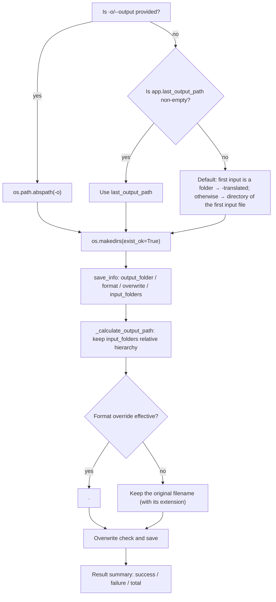

# Local Input and Output

This page documents the input and output of the `local` mode (translating local images/folders): which paths `-i/--input` accepts, how `-o/--output` determines the output directory, where each image is finally written, and how the console summarizes results. It does not cover the internal pipeline algorithms (see the detection, OCR, translator, inpainting, and rendering pages), `--config` and explicit parameter overrides (see [Configuration overrides](./configuration-overrides.md)), or batch concurrency and subprocess memory management (see the corresponding CLI pages). The structure of the four top-level subcommands is in [Command structure](./command-structure.md). The desktop file list and output-directory controls are in [File list and input](../desktop/translation/file-list-and-input.md) and [Output directory and workflow](../desktop/translation/output-directory-and-workflow.md).

## Feature boundary {#feature-boundary}

- `-i/--input` is required and accepts one or more image files or folders; folders are scanned recursively for images, skipping the `manga_translator_work` working directory.
- `-o/--output` is an optional output directory; when omitted it falls back through “`-o` → `app.last_output_path` → default rule”.
- This page covers only `local` input/output and the result summary; explicit overrides such as GPU/ONNX, `--format`, `--batch-size`, and `--attempts` are in [Configuration overrides](./configuration-overrides.md).
- The console summary lines (success/failure/total) are hardcoded in `manga_translator/mode/local.py`, not i18n strings; the three-column tables on this page record only UI call keys that share the input/output concepts.

## UI operations {#ui-operations}

### Run the local command {#run-local-command}

Formal entry point (project-managed runtime):

```powershell
uv run --no-sync python -m manga_translator local -i <input image or folder>... [-o <output directory>] [options]
```

1. Pass one or more paths after `-i`: image files or folders. Folders are scanned recursively for supported image extensions.
2. Use `-o` to set the output directory when needed; when omitted, it is derived by the default rules (see [Output-directory resolution](#output-directory-resolution)).
3. Add `--overwrite` to re-translate existing output files; with the default (per configuration `cli.overwrite`) existing files are skipped.
4. When the first argument is not one of `local/web/ws/shared` and the argument list contains `-i`/`--input`, the parser inserts `local` implicitly, so `python -m manga_translator -i page.png` is equivalent to an explicit `local`.

### Input/output copy shared with the desktop UI {#shared-input-output-copy}

The `local` console lines themselves (for example `📤 输出目录: ...`) are hardcoded and do not go through locales; the keys below come from the desktop UI and cover the same concepts, listed as three-column evidence:

| UI call key | Actual English value | Actual Simplified Chinese value |
| --- | --- | --- |
| `Add Files` | Add Files | 添加文件 |
| `Add Folder` | Add Folder | 添加文件夹 |
| `Input Files` | Input Files | 输入文件 |
| `Output Directory:` | Output Directory: | 输出目录: |
| `Select Output Directory` | Select Output Directory | 选择输出目录 |
| `Invalid Output Directory` | Invalid Output Directory | 输出目录不合法 |
| `label_last_output_path` | Last Output Path | 最后输出路径 |
| `label_format` | Output Format | 输出格式 |
| `label_overwrite` | Overwrite Existing Files | 覆盖已存在文件 |
| `label_batch_size` | Batch Size | 批量大小 |
| `label_verbose` | Verbose Logging | 详细日志 |
| `📁 Output directory: {dir}` | 📁 Output directory: {dir} | 📁 输出目录：{dir} |
| `💾 Files saved to: {dir}` | 💾 Files saved to: {dir} | 💾 文件已保存到：{dir} |

## Input and output options {#input-output-options}

| Option | Type/default | Stored/actual value | Behavior |
| --- | --- | --- | --- |
| `-i INPUT [INPUT ...]` | required, 1+ strings | CLI argument | Input image or folder paths; folders are recursive and naturally sorted |
| `-o OUTPUT` | string; `None` | CLI argument | Output directory; falls back through three levels when omitted |
| `--format FORMAT` | string; `None` | `png/jpg/jpeg/jfif/webp/avif/bmp/tiff/tif/heic/heif` | Output-format override; `不指定`/empty/`none` preserves the original extension |
| `--overwrite` | flag; `False` | `True`/`False` | Overwrite existing files; when off, existing outputs are skipped |
| `-v`/`--verbose` | flag; `False` | `True`/`False` | Verbose logging (DEBUG) |

Supported input extensions (single source `manga_translator/image_formats.py`):

| Category | Extensions |
| --- | --- |
| Bitmap | `.png` `.jpg` `.jpeg` `.jfif` `.bmp` `.tiff` `.tif` |
| Web/modern | `.webp` `.avif` `.heic` `.heif` |

The `local` folder scan collects image extensions only; archives/documents (`.pdf/.epub/.cbz/.cbr/.zip`) are not auto-extracted as `local` input, unlike the desktop file list.

## Runtime behavior {#runtime-behavior}

### Input collection {#input-collection}

1. Each `-i` path is converted to an absolute path: files join the individual-file list, directories join the folder list.
2. Folders are naturally sorted and scanned one by one with `get_image_files_from_folder(folder, recursive=True)`; the scan skips directories named `manga_translator_work` and sorts both directories and files naturally (`file2` precedes `file10`).
3. Individual files are naturally sorted and appended after folder files, so with mixed `-i` inputs all folder images come before the individual files.
4. Each path is validated as existing and a file; when no image is found the run prints “未找到图片文件” and exits (non-zero in subprocess mode).

### Output-directory resolution {#output-directory-resolution}



This diagram expresses the source-confirmed three-level output fallback and per-image output-path calculation, not a generic “config → algorithm → output” placeholder. `-o` always wins; `app.last_output_path` is the desktop “Last Output Path” and is also used by the CLI when `-o` is omitted and the value is non-empty. For a folder input the default creates `<folder name>-translated` next to the first input folder; for a file input it writes to that file’s directory. Inside the output directory, the relative hierarchy of the input folders is preserved (`<output>/<folder name>/<relative path>/<filename>`).

### Results and summary {#results-and-summary}

- Each image prints `✅ 完成: <filename>` or `❌ 翻译失败: <filename>`; with `-v` the error detail is printed too.
- At the end it prints `✅ 成功: N`, `❌ 失败: M`, `📊 总计: T` and the output directory; the non-subprocess path also lists the output-directory file count (with `-v`, the first 10 filenames and sizes).
- The non-subprocess path writes `result/log_<timestamp>.txt`; with `-v` the log level is DEBUG.
- Exit code is 0 on success/cancellation and 1 on configuration-load failure or an uncaught exception.

## Dependencies and conflicts {#dependencies-and-conflicts}

- Input files must exist and be readable, and their extensions must be in the supported set. Recursive folder scanning skips `manga_translator_work`; do not treat a working directory as an ordinary input directory.
- With overwrite disabled, images whose output file already exists are skipped (counted as “success (skipped)”); only `--overwrite` or configuration `cli.overwrite=true` re-translates them.
- Multiple input folders write into the same output directory under their own relative hierarchy; `input_folders` records only directory-type inputs.
- `cli.save_to_source_dir` is passed through the `save_info` built by desktop `app_logic.py`; the `local` `save_info` contains only `output_folder/format/overwrite/input_folders`, so CLI output always goes to the resolved output directory and never jumps to `manga_translator_work/result` beside the source image.
- Special workflows (translate JSON only, export original/translation, replace translation, etc.) change the input/output file types, but per-image output paths still go through `_calculate_output_path`; see the [workflow](../workflows/translate-json-only.md) pages.

## Related files and formats {#related-files-and-formats}

| File/directory | Role on this page | Notes |
| --- | --- | --- |
| `config/config.json` | Source of `app.last_output_path`, `cli.format`, `cli.overwrite` | Never expose real user configuration or private absolute paths |
| `config/config-example.json` | Release-default reference | Differs from core/Qt defaults (`format`/`overwrite`, etc.) |
| `result/log_<timestamp>.txt` | Runtime log for the non-subprocess path | DEBUG with `-v`; sanitize before sharing |
| `manga_translator_work/json/*_translations.json` | Project data when `cli.save_text` is enabled | Do not copy user content |
| `manga_translator_work/originals/` and `translations/` | Export original/translation sidecars | Written by special workflows; filenames must match the input `<stem>` |

## Source evidence {#source-evidence}

| Layer | File | What was checked |
| --- | --- | --- |
| Parser | `manga_translator/args.py` | `local` subparser, required `-i`, `-o` default `None`, implicit `local` fallback |
| CLI execution | `manga_translator/mode/local.py` | Input classification and natural sort, three-level output fallback, `save_info`, overwrite pre-check, result summary |
| Input scanning | `desktop_qt_ui/services/file_service.py` | Supported extensions, recursion, natural sort, `manga_translator_work` exclusion |
| Output path | `manga_translator/manga_translator.py` | `_calculate_output_path` relative hierarchy and format override |
| Format/save | `manga_translator/image_formats.py`, `manga_translator/save.py` | Single source of extensions, format resolution, save quality |
| Paths | `manga_translator/utils/path_manager.py`, `manga_translator/runtime_paths.py` | Working directory and sidecar paths |
| i18n | `desktop_qt_ui/locales/en_US.json`, `zh_CN.json` | Actual English/Simplified Chinese values for input/output UI keys |

## Verification {#verification}

| Check | Status | Notes |
| --- | --- | --- |
| BLUEPRINT, PAGE_GUIDELINES, TODO | Complete | Read in full and followed the page contract |
| `local --help` | Complete | Ran `uv run --no-sync python -m manga_translator local --help`; options match this page |
| i18n three columns | Complete | Checked actual `en_US.json`/`zh_CN.json` values one by one |
| Input/output runtime chain | Complete | Statically checked `args.py`, `mode/local.py`, `manga_translator.py`, `file_service.py`, `image_formats.py` |
| Sanitized runtime verification | Deferred | No real translation run; no user images, configuration, keys, or private paths read |
| Static checks | Complete | `verify-route-mirror.mjs` PASS, `verify-source-evidence.mjs` PASS |
