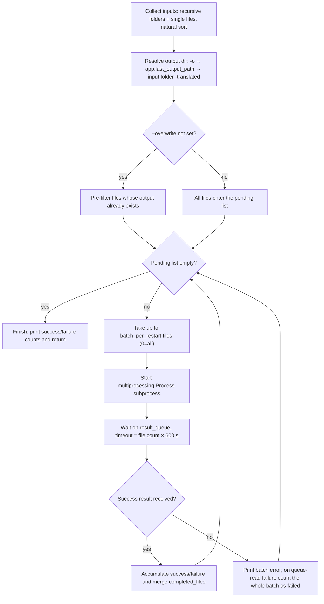
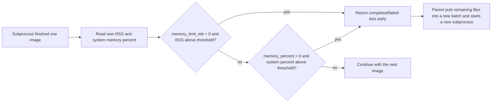

# CLI Subprocess, Memory, and Recovery

Use this page when translating a large batch at once and memory consumed by models and intermediate results keeps growing during a long run. The `local` subprocess mode runs each batch in an independent subprocess while the parent process only collects files, assigns batches, and gathers results. When `--memory-limit`, `--memory-percent`, or `--batch-per-restart` is reached, the current subprocess exits early and a new subprocess continues with the remaining files; files that already completed are not translated again.

This page covers only the `local --subprocess` subprocess, memory-limit, and recovery mechanics. Ordinary (non-subprocess) local translation is in [Local input and output](./local-input-output.md); command structure and the official entry point are in [Command structure](./command-structure.md); configuration overrides are in [Configuration overrides](./configuration-overrides.md); output and exit codes are in [Output, debugging, and exit codes](./output-debugging-and-exit-codes.md).

## Feature boundary {#feature-boundary}

- `--subprocess` changes only the `local` execution path: file collection, output directory, and skip-existing logic match the normal mode, but translation runs batch by batch inside a `multiprocessing.Process` subprocess.
- `--memory-limit`, `--memory-percent`, and `--batch-per-restart` are consumed only when `--subprocess` is enabled; the plain `local` path ignores all three.
- “Recovery” has three layers here: after an in-run memory limit is hit, a new subprocess continues; after a subprocess exception, the same batch is retried automatically; re-running without `--overwrite` skips files whose output already exists. The official top-level `local` has no usable cross-run `--resume` option; see the [`--resume` parameter](#resume).
- This page does not cover `cli.attempts` (API-call retries), API candidate-slot rotation (see the API-management pages), `cli.batch_size`/`cli.batch_concurrent` (batch concurrency, see [CLI batch and output](../desktop/settings/cli-batch-and-output.md)), or the `web`/`ws`/`shared` service modes (see [Web, WS, and shared modes](./web-ws-and-shared-modes.md)).

## Command-line operations {#command-line-operations}

### Enable subprocess mode

From the repository root, call with the project-managed runtime:

```powershell
uv run --no-sync python -m manga_translator local -i ./manga_folder/ --subprocess
```

- `-i`/`--input` is required and may be given multiple times; folders are scanned recursively for images and individual files are processed in natural name order.
- `-o`/`--output` sets the output directory; when omitted, the parent uses `app.last_output_path` from configuration, then the input folder plus a `-translated` suffix, then the directory of the first input file.
- `--config` selects a configuration file; a load failure prints an error and exits (code 1).
- Without `--overwrite`, the parent first pre-filters files whose output already exists; only the remaining files enter subprocesses.

### Set memory and restart thresholds

- Limit only the subprocess's own memory and restart above 4000 MB: `--memory-limit 4000`.
- Limit only the system-memory share and restart above 85%: `--memory-percent 85`.
- Restart a subprocess every 20 images to release memory: `--batch-per-restart 20`.
- Set an absolute memory limit and a per-batch count together: `--memory-limit 6000 --batch-per-restart 30`.

```powershell
uv run --no-sync python -m manga_translator local -i ./manga_folder/ --subprocess --memory-limit 4000
uv run --no-sync python -m manga_translator local -i ./manga_folder/ --subprocess --memory-percent 85
uv run --no-sync python -m manga_translator local -i ./manga_folder/ --subprocess --batch-per-restart 20
uv run --no-sync python -m manga_translator local -i ./manga_folder/ --subprocess --memory-limit 6000 --batch-per-restart 30
```

See [Parameters and options](#parameters-and-options) for threshold semantics and official defaults. The absolute and percent limits can be set at the same time and both are checked; they are not the same metric.

### Console output and UI strings

The subprocess progress output is printed directly by `manga_translator/mode/subprocess_manager.py`; the strings are hard-coded Chinese and do not go through `en_US.json`/`zh_CN.json` localization. For example, startup prints `🚀 子进程翻译模式` and `📊 总文件数: N`, each batch prints `🔄 批次 k: 处理 N 个文件`, and after each image it prints `📊 进程内存: ... | 系统内存: ...%` (only when psutil is available). These logs are not UI strings and should not be translated or rewritten as interface text.

The four options on this page are CLI-only parameters: the Qt settings page has no controls for them, and `en_US.json`/`zh_CN.json` contain no `subprocess`/`memory` UI keys. The settings strings that do relate to batch, memory, and model unloading and have real locale keys are listed below; their full parameter documentation is in [CLI batch and output](../desktop/settings/cli-batch-and-output.md):

| UI call key | English actual value | Simplified Chinese actual value |
| --- | --- | --- |
| `label_batch_size` | Batch Size | 批量大小 |
| `label_batch_concurrent` | Concurrent Batch Processing | 并发批量处理 |
| `label_unload_models_after_translation` | Unload Models After Translation | 翻译完成后卸载模型 |
| `desc_app_unload_models_after_translation` | Unload all models after translation to free VRAM and memory. Good for low VRAM, but requires reloading for next translation. | 翻译完成后卸载所有模型以释放显存和内存。适合显存不足的场景，但下次翻译需要重新加载。 |
| `🚀 Starting translation (loading images in batches to save memory)...` | 🚀 Starting translation (loading images in batches to save memory)... | 🚀 开始翻译（按批次加载图片以节省内存）... |

## Parameters and options {#parameters-and-options}

#### `--subprocess` — 子进程模式 / Subprocess mode {#subprocess}

- Control: CLI flag (`local` subcommand).
- Location: `python -m manga_translator local --help`.
- Stored value: boolean flag; help text is “启用子进程模式（支持内存管理和断点续传）”.
- Options: `--subprocess` (enabled) or omitted (disabled, default).
- Defaults: `False` in the official `args.py`; `run_local_mode()` reads it with `getattr(args, 'subprocess', False)`.
- Effective stage: after `local` dispatches to `run_local_mode()` and before translation, the execution branch switches.
- Mechanism: the parent collects and batches files, then hands each batch of files, configuration, memory thresholds, and a result queue to a `multiprocessing.Process` running `worker_translate_batch`; the subprocess reloads `MangaTranslator` and calls `translate_batch` per image, see [Runtime behavior](#runtime-behavior).
- Dependencies/conflicts: Windows frozen (PyInstaller) builds rely on `multiprocessing.freeze_support()`; `--format`/`--batch-size`/`--attempts` are not written into configuration in the subprocess branch (source discrepancy, see [Dependencies and conflicts](#dependencies-and-conflicts)).
- Related files and debug artifacts: no extra files; progress and statistics are printed to the console.
- Source evidence: definition `manga_translator/args.py`; dispatch `manga_translator/mode/local.py`; implementation `manga_translator/mode/subprocess_manager.py`.
- Verification: complete (static check of `--help` and source).

#### `--memory-limit MEMORY_LIMIT` — 绝对内存限制（MB）/ Absolute memory limit (MB) {#memory-limit}

- Control: CLI integer input (`local` subcommand).
- Location: `python -m manga_translator local --help`.
- Stored value: integer (MB).
- Options: positive integers; `0` means unlimited.
- Defaults: `0` in the official `args.py`; `DEFAULT_MEMORY_THRESHOLD_MB` in the `subprocess_manager.py` function signature is `0`; the standalone parser in `manga_translator/mode/local.py` uses `8000` (not part of the official top-level contract, do not mix).
- Effective stage: in the subprocess, after every processed image.
- Mechanism: the worker reads the **subprocess's own** RSS with psutil and returns early with the completed list when `RSS > threshold`, leaving remaining files to a new subprocess. The check is `> 0`, so a negative value behaves like `0` (unlimited).
- Dependencies/conflicts: requires psutil; when missing the read returns `0` and the check is skipped; it can be active together with `--memory-percent`, but the metrics differ (own RSS vs whole-system memory).
- Related files and debug artifacts: no extra files; before exiting it prints `⚠️ 进程内存超过限制`.
- Source evidence: definition `manga_translator/args.py`; check `manga_translator/mode/subprocess_manager.py`.
- Verification: complete (static check; no real OOM runtime verification).

#### `--memory-percent MEMORY_PERCENT` — 系统内存百分比限制 / System memory percent limit {#memory-percent}

- Control: CLI integer input (`local` subcommand).
- Location: `python -m manga_translator local --help`.
- Stored value: integer (percent).
- Options: positive integers; `0` means unlimited.
- Defaults: `0` in the official `args.py`; `DEFAULT_MEMORY_THRESHOLD_PERCENT` in `subprocess_manager.py` is `80`; the standalone parser in `manga_translator/mode/local.py` uses `80` (not part of the official top-level contract).
- Effective stage: in the subprocess, after every processed image.
- Mechanism: the worker reads the **whole-machine** `psutil.virtual_memory().percent` and returns early when it exceeds the threshold. System memory usage above 100 is impossible, so values `> 100` effectively never trigger.
- Dependencies/conflicts: requires psutil; useful on machines where memory is shared with other programs; it does not reflect the subprocess's own usage and cannot replace `--memory-limit`.
- Related files and debug artifacts: no extra files; before exiting it prints `⚠️ 系统内存超过限制`.
- Source evidence: definition `manga_translator/args.py`; check `manga_translator/mode/subprocess_manager.py`.
- Verification: complete (static check; no real runtime verification).

#### `--batch-per-restart BATCH_PER_RESTART` — 每批重启张数 / Images per restart {#batch-per-restart}

- Control: CLI integer input (`local` subcommand).
- Location: `python -m manga_translator local --help`.
- Stored value: integer (images).
- Options: positive integers; `0` means no restart by image count (all pending files in one process).
- Defaults: `0` in the official `args.py`; `DEFAULT_BATCH_SIZE_PER_RESTART` in `subprocess_manager.py` is `50`; the standalone parser in `manga_translator/mode/local.py` uses `50` (not part of the official top-level contract).
- Effective stage: when the parent takes a batch from the pending list.
- Mechanism: the parent hands at most `N` files to one subprocess per round; after the subprocess finishes normally or exits early on a memory limit, the remaining files go to the next round. This value is unrelated to `cli.batch_size`, which is the number of images in a single translation request (see [CLI batch and output](../desktop/settings/cli-batch-and-output.md)).
- Dependencies/conflicts: with `0` and many files, one subprocess handles everything and the parent's result-queue timeout is “file count × 600 seconds”, which can be very long.
- Related files and debug artifacts: no extra files; before each batch it prints `🔄 批次 k: 处理 N 个文件`.
- Source evidence: definition `manga_translator/args.py`; scheduling loop `manga_translator/mode/subprocess_manager.py`.
- Verification: complete (static check).

#### `--resume` — 断点续传 / Resume {#resume}

- Control: CLI flag, **present only** in the standalone module parser of `manga_translator/mode/local.py`.
- Location: `python -m manga_translator.mode.local --help` (not the official top-level entry).
- Stored value: boolean flag; help text is “从上次中断的位置继续（需要配合 --subprocess 使用）”.
- Options: `--resume` (declared) or omitted.
- Defaults: `False`; the official `local` parser in `args.py` has no such option at all.
- Effective stage: none. `run_local_mode()` never passes `resume` to `translate_with_subprocess(..., resume=...)`; the help text existing does not mean the behavior is wired up.
- Mechanism: cross-run recovery for the official top-level `local` actually relies on the pre-filter that skips files whose output already exists when `--overwrite` is not set; the in-run checkpoint is guaranteed by the `completed_files` set.
- Dependencies/conflicts: do not rely on `--resume` for cross-run continuation; use `--overwrite` to re-translate files that already exist.
- Related files and debug artifacts: none.
- Source evidence: declared `manga_translator/mode/local.py:78`; not forwarded `manga_translator/mode/local.py:761`; downstream interface `manga_translator/mode/subprocess_manager.py`.
- Verification: complete (static check; matches `research/cli-command-inventory.md`).

## Runtime behavior {#runtime-behavior}

### Parent scheduling loop

The subprocess branch of `run_local_mode()` hands all inputs to `translate_with_subprocess()`. It keeps a `completed_files` set as the in-run “checkpoint”: each round it takes up to `batch_per_restart` files from the pending list (`0` means all), starts a subprocess, waits for the result queue, merges completed files into the set, and loops until no pending files remain.



Inside the subprocess, each image goes through `translate_batch`: `Config` is built only from the explicit keys `render`/`upscale`/`translator`/`detector`/`colorizer`/`inpainter`/`ocr` plus `kernel_size`, `mask_dilation_offset`, and `force_simple_sort`; `cli.verbose`/`cli.overwrite` are written back into configuration and `font_family` is copied to the top level; each image handle is closed immediately after processing.

### Memory check and early exit

After each image, the worker reads “own RSS” and “system memory percent” (both via psutil) and independently checks the two thresholds; if either is exceeded it returns the completed list early without processing the remaining files. The parent hands the remaining files to a new subprocess in the next round and increments `restart_count`.



- Display rule: when `--memory-limit > 0` only the absolute threshold is shown; otherwise when `--memory-percent > 0` the percent and its approximate MB value are shown; when `--batch-per-restart > 0` the per-batch count is shown.
- When both limits are set they are both enforced: `--memory-limit` watches the subprocess's own RSS while `--memory-percent` watches whole-machine memory usage; they are not the same metric.
- When psutil is unavailable both readers return `0`, the memory checks are skipped entirely, and only the image-count restart remains.

### Failure and recovery

Results travel between the subprocess and the parent over a `multiprocessing.Queue`. Recovery behavior per failure location is below (all are static source-review conclusions, not real-failure runtime verification):

| Event | Parent behavior | Effect on results |
| --- | --- | --- |
| Top-level subprocess exception (returns an error result) | Prints “批次错误” plus a traceback (with `-v`) | Not counted as failed; the same batch stays in the pending list and is retried in the next round |
| Result-queue read timeout or exception | Prints “无法获取子进程结果” and adds this batch's file count to `failed_count` | The batch is both counted as failed and, because it never entered `completed_files`, retried in the next round, risking double counting |
| A single image fails inside the subprocess | Counted in `failed_count`, not added to `completed_files` | The file stays pending and re-enters later batches; a reproducible failure can loop indefinitely |
| Subprocess does not exit within 30 seconds | `terminate()`, then `kill()` if still alive after 5 seconds | Completed files survive; unfinished files re-enter the next round per the rules above |
| Memory limit hit, early return | Receives the `success` result normally | Completed files survive; remaining files enter a new subprocess (batch count +1) |
| User presses Ctrl+C | Terminates the current subprocess and exits with code 0 | Output already written survives; re-running without `--overwrite` skips existing files |

What “checkpoint resume” actually means:

- Within one run: `completed_files` guarantees that files already completed never re-enter a new batch after a memory-limit restart.
- Across runs: the official top-level `local` has no usable `--resume`; cross-run recovery actually relies on the pre-filter that skips files whose output already exists when `--overwrite` is not set.
- The worker also contains a torch/CUDA check block that runs every 5 images; in the current source it is a no-op (it does not free VRAM). Recorded as a static observation only.

## Dependencies and conflicts {#dependencies-and-conflicts}

- psutil is optional: when missing, both RSS and system-memory reads return `0`, memory limits silently stop working, and only the image-count restart remains.
- The three default layers must not be mixed: the official `local` defaults for `--memory-limit`/`--memory-percent`/`--batch-per-restart` are `0/0/0`; the `subprocess_manager.py` function-signature constants are `0/80/50`; the standalone parser in `manga_translator/mode/local.py` uses `8000/80/50`. Only `0/0/0` from the official `args.py` belongs to the top-level `local --help` contract.
- The help text of `--format`, `--batch-size`, and `--attempts` says “覆盖配置文件”, but in the subprocess branch only the GPU/ONNX overrides are written into `cli_config`; those three values never reach `translate_with_subprocess`. This is a source discrepancy, not a completed runtime verification.
- Subprocess mode runs exactly one subprocess at a time with no parallelism; `cli.batch_concurrent` does not participate in subprocess scheduling.
- The memory limits target RAM (subprocess RSS / whole-machine memory), not GPU VRAM; VRAM exhaustion is covered by [Models, GPU, and memory](../troubleshooting/model-gpu-and-memory.md).
- `app.unload_models_after_translation` (“Unload Models After Translation”) is a desktop-side unload switch for after a translation finishes, different from the runtime thresholds here.
- The parent's result-queue timeout is “this batch's file count × 600 seconds”; with `--batch-per-restart 0` and many files the wait can be extremely long.

## Related files and formats {#related-files-and-formats}

| File/format | Actual role on this page | Manual-edit and compatibility note |
| --- | --- | --- |
| `manga_translator/args.py` | Defines the official `local` `--subprocess` flag and the three threshold options | Defaults `0/0/0`; changing the parser changes the `--help` contract |
| `manga_translator/mode/local.py` | Subprocess branch: file collection, output directory, skip pre-filter, call to `translate_with_subprocess` | The standalone parser's `--resume`/`--concurrent` and `8000/80/50` defaults are not part of the official entry |
| `manga_translator/mode/subprocess_manager.py` | Worker function, memory checks, batch loop, queue timeout, terminate/kill, `completed_files` | Module constants are function-signature defaults, not argparse defaults |
| `manga_translator/__main__.py` | Top-level dispatch and Ctrl+C/exception exit codes | Tries to import `torch` before parsing |
| `config/config.json` and the `--config` file | Configuration source for subprocess translation | Record sanitized structure only; never show real user files or private paths |
| `result/log_*.txt` | CLI file logs (shared with local mode) | Logs may contain paths and request information; clean before sharing |
| `psutil` | Reads RSS and system memory percent | When missing, memory checks are silently skipped without an error |

## Source evidence {#source-evidence}

| Layer | File | What was checked |
| --- | --- | --- |
| Parameter definitions | `manga_translator/args.py` | The four `local` subprocess/memory options, official defaults `0/0/0`, and help text |
| Top-level dispatch | `manga_translator/__main__.py` | Mode dispatch, `torch` import before `--help`, Ctrl+C/exception exit codes |
| Subprocess implementation | `manga_translator/mode/subprocess_manager.py` | Worker function, memory checks, batch loop, queue timeout, terminate/kill, `completed_files` checkpoint |
| Local mode | `manga_translator/mode/local.py` | File collection/natural sort, output directory, skip pre-filter, GPU/ONNX overrides, `--format` not entering the subprocess branch |
| Standalone parser | `manga_translator/mode/local.py` | `--resume`/`--concurrent` and `8000/80/50` exist only in the standalone entry |
| i18n | `desktop_qt_ui/locales/en_US.json`, `zh_CN.json` | Related settings strings key→English→Simplified Chinese; subprocess options have no UI key |
| Research artifact | `doc/wiki/research/cli-command-inventory.md` | Official `--help` inventory and recorded actual-help verification |

## Verification {#verification}

| Check | Status | Notes |
| --- | --- | --- |
| BLUEPRINT, PAGE_GUIDELINES, TODO | Complete | Read in full and followed the page contract; only this page's TODO was handled |
| Official `--help` check | Complete | `uv run --no-sync python -m manga_translator local --help` matches the parameter table |
| Subprocess/memory/recovery static trace | Complete | Parent scheduling, memory checks, failure branches, and recovery paths checked line by line |
| i18n three-column strings | Complete | Only related settings strings have real keys; subprocess options are honestly marked as having no UI key |
| Sanitized runtime verification | Deferred | No real batch translation was run; OOM restart, real-failure recovery, and long-run behavior are not runtime-verified |
| VitePress | Deferred | Coordinator should run `npm run docs:build --prefix doc/wiki` plus mirror/source checks before merge |