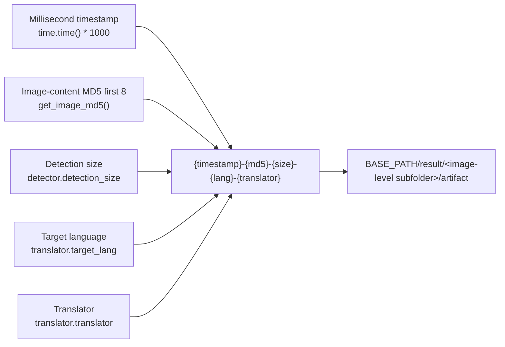
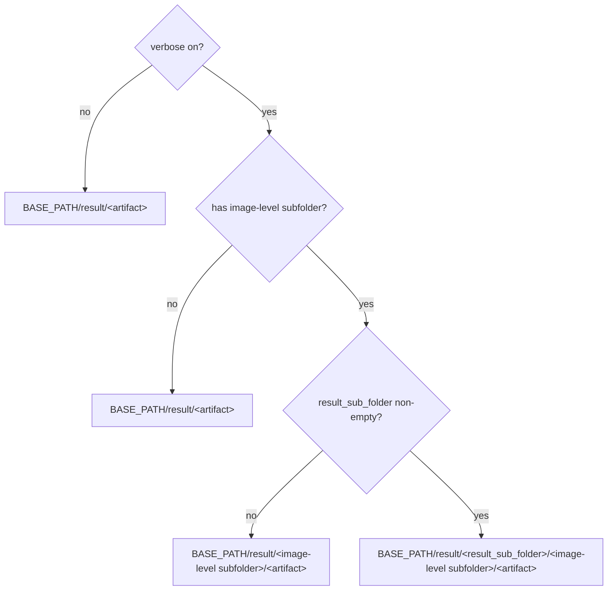

# Debug Folder Naming and Overview

When you enable “Verbose Logging” (`Verbose Logging`), the app creates one debug subfolder per input image under `result/` and writes intermediate files for detection, OCR, masks, inpainting, and rendering. This page explains the subfolder naming rule, the layout of `result/`, and the stage and trigger condition of each debug artifact, so you can locate a specific run from its folder name and tell which files always appear from those that only appear under specific settings or workflows.

This page does not dig into each artifact: detection and rearrangement are covered in [Input detection and rearrangement](./input-detection-and-rearrangement.md), OCR and text regions in [OCR and text regions](./ocr-and-text-regions.md), masks, inpainting and rendering in [Mask, inpainting and rendering](./mask-inpainting-and-rendering.md), and special workflows in [Special workflows and WebSocket](./special-workflows-and-websocket.md). Cleanup, sanitization, and sharing of debug artifacts are covered in [How to read and share a debug run](./how-to-read-and-share-a-debug-run.md).

## Feature boundary

- `cli.verbose` (UI: “Verbose Logging” / `Verbose Logging`) decides whether per-image debug subfolders are generated; when off, no timestamped image-level subfolder is created.
- The image-level debug subfolder name is fixed as `{timestamp_ms}-{image_md5_8}-{detection_size}-{target_lang}-{translator}`, built by `_set_image_context()` when each input image starts processing.
- Debug directories live under `BASE_PATH/result/`; `BASE_PATH` is the executable directory in frozen (packaged) runs and the repository root in source runs.
- This page only covers naming and the artifact overview; each artifact is handled in depth by its own debugging page.

## UI operations

### Enable verbose logging in Settings

1. Open “Settings” (`Settings`) and select the “General” (`General`) group.
2. Turn on the “Verbose Logging” (`Verbose Logging`) switch. The switch stores `cli.verbose`; the description panel on the right shows the `desc_cli_verbose` text.
3. After starting a translation, intermediate artifacts are written to the image-level subfolder under `BASE_PATH/result/`, named per the rule below.
4. When a translation fails, the “Translation Error” dialog offers an “Open log folder” (`Open log folder`) button that opens `result/` directly.

The CLI `local` mode supports the same behavior through `-v/--verbose`; see the CLI documentation.

### UI call keys and bilingual text

| UI call key | English actual value | Simplified Chinese actual value |
| --- | --- | --- |
| `General` | General | 通用 |
| `label_verbose` | Verbose Logging | 详细日志 |
| `Open log folder` | Open log folder | 打开日志文件夹 |

The `desc_cli_verbose` description panel text is as follows (English):

> Output detailed debug info to logs for troubleshooting.
>
> When enabled, Qt UI writes these items under result/:
> - log_timestamp.txt: Qt UI runtime log
> - timestamp-image-target-translator/: debug intermediate files for a single task
>
> Cleanup: close Qt UI first, then delete the unneeded log_*.txt files and matching timestamp debug folders under result/.

The Simplified Chinese text is as follows:

> 输出详细的调试信息到日志，方便排查问题。
>
> 开启后会在 result/ 目录生成：
> - log_时间戳.txt：Qt UI 运行日志
> - 时间戳-图片名-目标语言-翻译器/：单次任务的调试中间文件
>
> 清理方法：先关闭 Qt UI，再到 result/ 目录删除不需要的 log_*.txt 和对应的时间戳调试文件夹即可。

Note: the description panel writes the subfolder as “timestamp-image-target-translator”, but the actual code generates “timestamp-image-MD5-detection size-target language-translator”. This page follows the code (see “Runtime behavior” below); this is a known UI-text vs implementation mismatch and does not affect how the directory is used.

## Option matrix

| Stored value | English | Simplified Chinese |
| --- | --- | --- |
| `cli.verbose` | Verbose Logging | 详细日志 |
| `detector.detection_size` | Detection Size | 检测大小 |
| `translator.target_lang` | Target Language | 目标语言 |
| `translator.translator` | Translator | 翻译器 |

- `cli.verbose`: boolean switch. The core code falls back to `False` when reading parameters in `manga_translator/config.py`, the Qt model defaults to `False`, and the release config `config/config-example.json` is `false`. It decides whether image-level debug subfolders are generated and affects the console log level.
- `detector.detection_size`: image scaling size for detection, default `2048`. It appears directly in the folder name; `_set_image_context()` falls back via `getattr(config.detector, 'detection_size', 1024)`.
- `translator.target_lang`: target-language code (for example `CHS`, `ENG`). The folder-name value comes from `config.translator.target_lang` and falls back to `unknown`.
- `translator.translator`: translator identifier (for example `openai`). The folder-name value comes from `config.translator.translator` and falls back to `unknown`.

## Runtime behavior

### Image-level subfolder naming

`MangaTranslator._set_image_context()` (`manga_translator/manga_translator.py`) builds the debug subfolder name when each input image starts processing:

```text
{timestamp_ms}-{input_md5}-{detection_size}-{target_lang}-{translator}
```

| Field | Source | Example | Description |
| --- | --- | --- | --- |
| `timestamp_ms` | `str(int(time.time() * 1000))` | `1785860417472` | Millisecond timestamp; keeps folder names unique |
| `input_md5` | `get_image_md5(image)` | `3415b69c` | First 8 characters of the image-content MD5; identical content yields the same value |
| `detection_size` | `config.detector.detection_size` | `2048` | Detection size; fallback `1024` |
| `target_lang` | `config.translator.target_lang` | `CHS` | Target-language code; fallback `unknown` when missing |
| `translator` | `config.translator.translator` | `openai` | Translator identifier; fallback `unknown` when missing |

`get_image_md5()` (`manga_translator/utils/generic.py`) first normalizes the image to RGB, encodes it to PNG bytes, computes the MD5, and keeps only the first 8 hexadecimal characters to avoid overly long folder names; on failure it falls back to `fallback_{timestamp_ms}`. When no image is passed, the MD5 field is `unknown`.

The sample `result/1785860417472-3415b69c-2048-CHS-openai/` cited in TODO matches exactly these five fields: millisecond timestamp `1785860417472`, image MD5 `3415b69c`, detection size `2048`, target language `CHS`, and translator `openai`. The folder name itself only contains a hash and configuration values, never user text; files inside it are user content and must be sanitized before sharing.



### Debug path composition

`_result_path()` (`manga_translator/manga_translator.py`) picks the final path from verbose, the image context, and `result_sub_folder`, and creates parent directories:

| Condition | Returned path |
| --- | --- |
| `verbose=True`, image context present, `result_sub_folder` non-empty | `BASE_PATH/result/<result_sub_folder>/<image-level subfolder>/<artifact>` |
| `verbose=True`, image context present, `result_sub_folder` empty | `BASE_PATH/result/<image-level subfolder>/<artifact>` |
| Non-verbose (or no image-level path), `result_sub_folder` empty | `BASE_PATH/result/<artifact>` |
| Non-verbose, `result_sub_folder` non-empty | `BASE_PATH/result/<result_sub_folder>/<artifact>` |

`result_sub_folder` defaults to an empty string in the constructor, and a static search found no later assignment in the repository, so real runs usually fall on the second or third row.



`_run_detection()` passes `self._result_path` as a callback to the detection dispatcher even when verbose is off (`manga_translator/manga_translator.py:1744`), but every write is guarded by a `verbose` branch, so image-level debug subfolders are not produced when verbose is off.

### Directory overview

```text
BASE_PATH/result/
├─ log_20260807120000.txt          # Qt UI / CLI run log (timestamp is yyyyMMddHHmmss)
└─ 1785860417472-3415b69c-2048-CHS-openai/   # verbose per-image debug folder
   ├─ input.png                     # input image before processing
   ├─ bboxes.png                    # merged text-block visualization
   ├─ mask_raw.png                  # raw detection confidence heatmap
   ├─ inpaint_input.png             # inpainting input preview
   ├─ mask_final.png                # final mask used for inpainting
   ├─ inpainted.png                 # inpainting result
   ├─ final.png                     # final output (after size revert)
   ├─ ocrs/                         # perspective-cropped OCR inputs per region
   │  ├─ 0.png
   │  └─ 1.png
   └─ ...                           # conditional artifacts below
```

### Artifact overview: core artifacts

The following artifacts are the most common in a normal verbose run; whether each one is actually written still depends on detection/OCR results and translation progress:

| Artifact | Stage and write point | Trigger condition | Content and use |
| --- | --- | --- | --- |
| `input.png` | `_translate_until_translation()` (`manga_translator.py:4255`) | `verbose=True` | Input image before processing; detection/OCR troubleshooting |
| `mask_raw.png` | after detection (`manga_translator.py:4551`) | `verbose=True` and detection returns `ctx.mask_raw` | Raw detection confidence heatmap with color bar; detection-threshold troubleshooting |
| `bboxes_unfiltered.png` | after detection (`manga_translator.py:4566`) | `verbose=True` and text lines remain after detection | Unfiltered text-line boxes on the image; detection/OCR filtering troubleshooting |
| `bboxes.png` | after OCR and text-line merge (`manga_translator.py:4607`) | `verbose=True` and `ctx.text_regions` exists | Final text-block visualization; merge/sort troubleshooting |
| `inpaint_input.png` | before inpainting (`manga_translator.py:5247`) | `verbose=True` and `ctx.mask` exists after translation | Inpainting input preview |
| `mask_final.png` | before inpainting (`manga_translator.py:5251`) | same as above | Final mask used for inpainting |
| `inpainted.png` | after inpainting (`manga_translator.py:5277`) | normal verbose flow | Inpainted image |
| `final.png` | `_revert_upscale()` (`manga_translator.py:1547`) | size revert called, `ctx.result` exists, and verbose | Final (or size-reverted) PIL output |
| `ocrs/<index>.png` | OCR implementations (`manga_translator/ocr/*.py`) | `verbose=True` and region not filtered beforehand | Perspective-cropped OCR inputs; vertical text is rotated; 48px/Manga OCR/PaddleOCR compress to 200px |

### Artifact overview: conditional artifacts

The following artifacts are only generated under specific settings, detectors, workflows, or modes; they must not be described as present in every verbose run:

| Artifact | Trigger condition | Content and use |
| --- | --- | --- |
| `bboxes_unfiltered_labeled.png` | `ocr.merge_special_require_full_wrap=True` and the label drawer receives non-empty text lines | Text-line boxes with index/labels; model-assisted merge troubleshooting |
| `bboxes_with_scores.png`, `mask_binary.png` | detector third return value is a score-box/binary-mask debug tuple | Detection score boxes and the paired binary mask |
| `hybrid_detection_boxes.png` | detector third return value is an image and `detector.use_yolo_obb=True` | Combined main-detection and YOLO OBB boxes |
| `rearrange_<index>.png` | default/DBConvNext/CTD detector triggers a long-image rearrange plan | Square padded batches sent to the detection network; long-image rearrange troubleshooting |
| `yolo_rearrange_<index>.png` | `use_yolo_obb=True` and YOLO OBB gets a rearrange plan | Single YOLO OBB rearrange patch |
| `mask_bubble_clip_debug.png` | `limit_mask_dilation_to_bubble_mask=True` and a non-empty bubble mask is obtained | Overlay of bubble clip and protected areas |
| `balloon_fill_boxes.png` | `layout_mode='balloon_fill'` and the renderer returns a non-empty debug image | Balloon-fill layout debug image |
| `chinese_linebreak_debug.json` | same as above and non-empty line-break records accumulated | Chinese line-break records; may contain source/translation text; sanitize before sharing |
| `replace_debug_match.jpg`, `debug_extracted_text.png`, `inpainted.png` | replace-translation workflow and verbose | Match boxes/overlap info, extracted text, and the replace-flow inpainted image |
| `ws_final.png`, `ws_render_in.png`, `ws_render_out.png`, `ws_mask.png`, `ws_inmask.png`, `ws_output.png` | WebSocket mode and verbose | WS rendering intermediates and final images |
| `<input-stem>_photoshop_script.jsx` | editable PSD export and verbose or `psd_script_only` | Photoshop automation script; may contain layer text and file paths; sanitize before sharing |
| `log_<yyyyMMddHHmmss>.txt` | Qt UI startup or CLI local log initialization | App-level run log; not part of a per-image debug subfolder |

### Actual artifacts vs conditional artifacts

- The tables above list the complete set that the current source **may** produce across modes, settings, and workflows, not the set that a single run necessarily generates.
- Pages without text, early exits, failures/cancellations, and special workflows (replace translation, WebSocket, JSON-only, and so on) skip different stages and therefore skip the corresponding artifacts.
- A static search found no read-back of these debug file names in the repository; they are terminal diagnostic writes for operators or bug-report readers that enable verbose.
- To determine which artifacts a run “actually contains”, locate its subfolder under `result/` using the naming rule above and cross-check the runtime settings and workflow; do not treat conditional artifacts as always present.

## Dependencies and conflicts

- Image-level subfolders depend on the verbose switch, the image context, and `result_sub_folder`; missing any of them falls back to a path without an image-level subfolder.
- The `ocrs/` subfolder is produced by `_run_ocr()` in verbose mode via a temporary `MANGA_OCR_RESULT_DIR` pointing at the image-level `ocrs/`; direct OCR calls without that environment variable fall back to `result/ocrs/`.
- `BASE_PATH` points to different locations in frozen packaged runs versus source runs (executable directory vs repository root); keep this in mind when comparing folders across machines.
- Qt UI creates the `result/log_*.txt` file log at startup and the file handler is always DEBUG level, so it exists even with verbose off; verbose mainly affects the console log level and image-level debug subfolders.
- Debug folders may contain full page images, recognized text, box coordinates, translation results, or local paths inside JSX; never package them for upload or publish them directly.

## Related files and formats

| File/directory | Format and naming | Description |
| --- | --- | --- |
| `BASE_PATH/result/` | directory | Root of verbose debug artifacts |
| `BASE_PATH/result/<image-level subfolder>/` | directory | One per input image; naming rule in “Runtime behavior” |
| `BASE_PATH/result/<image-level subfolder>/ocrs/` | directory | OCR cropped inputs, `<index>.png` |
| `BASE_PATH/result/log_<yyyyMMddHHmmss>.txt` | UTF-8 text log | Qt UI / CLI run log, app level |
| Image-level artifacts (`input.png`, `bboxes.png`, `mask_raw.png`, `inpaint_input.png`, `mask_final.png`, `inpainted.png`, `final.png`, etc.) | PNG | Terminal diagnostic writes for manual troubleshooting |
| Conditional artifacts (JSON/JSX/JPG, etc.) | see “Artifact overview” | Trigger conditions in the corresponding tables |

## Source evidence {#source-evidence}

| Layer | File | What was checked |
| --- | --- | --- |
| Naming rule | `manga_translator/manga_translator.py` `_set_image_context()` (about L457) | Five fields of the subfolder name and fallbacks |
| Image hash | `manga_translator/utils/generic.py` `get_image_md5()` | RGB normalization, PNG bytes, first-8 MD5 and fallback |
| Path composition | `manga_translator/manga_translator.py` `_result_path()` (about L3315) | Four branches over verbose/image context/`result_sub_folder` |
| Detection callback | `manga_translator/manga_translator.py` `_run_detection()` (about L1744) | Callback passed even with verbose off, writes guarded |
| OCR directory | `manga_translator/manga_translator.py` `_run_ocr()` (about L2406-2415) | `MANGA_OCR_RESULT_DIR` and the `ocrs/` path |
| Artifact write points | `manga_translator/manga_translator.py`, `manga_translator/ocr/*.py`, `manga_translator/mask_refinement/__init__.py`, `manga_translator/utils/replace_translation.py`, `manga_translator/mode/ws.py`, `manga_translator/utils/photoshop_export.py` | Write points and trigger conditions in both artifact tables |
| UI/i18n | `desktop_qt_ui/ui/main_page/settings_tab_layout.json`, `desktop_qt_ui/ui/main_page/dynamic_settings.py`, `desktop_qt_ui/app_logic.py`, `desktop_qt_ui/locales/en_US.json`, `desktop_qt_ui/locales/zh_CN.json` | Actual values for `General`, `label_verbose`, `desc_cli_verbose` |
| Log file | `desktop_qt_ui/main.py` (about L208-222), `manga_translator/mode/local.py` (about L162-167) | Generation of `log_<yyyyMMddHHmmss>.txt` |
| Research baseline | `doc/wiki/research/phase0-debug-artifact-path-trace.md`, `doc/wiki/research/phase0-related-files-formats-debug-safety.md`, `doc/wiki/research/phase0-page-coverage-matrix.md` | Artifact inventory, path contract, and coverage matrix |

## Verification {#verification}

| Check | Status | Notes |
| --- | --- | --- |
| BLUEPRINT, PAGE_GUIDELINES, TODO | Complete | Read section 1.3, 5.15, and 6.3 in full and followed the page contract |
| Folder naming rule | Complete | Statically checked `_set_image_context()`, `get_image_md5()`, and the TODO sample |
| Path composition | Complete | Statically checked the four `_result_path()` branches and the `result_sub_folder` default |
| Artifact overview and triggers | Complete | Statically checked direct `_result_path()` writes, `result_path_fn`/`debug_path_fn` callbacks, and manual paths |
| UI and i18n | Complete | Recorded actual values for `General`, `label_verbose`, `desc_cli_verbose`, etc.; noted the description-panel vs code naming difference |
| Sanitized runtime verification | Deferred | No GUI started, no real translation run; the actual set of core files, early exits, and conditional artifacts needs a sanitized run |
| VitePress | Deferred | Coordinator should run `npm run docs:build --prefix doc/wiki` plus mirror/source checks before merge |
