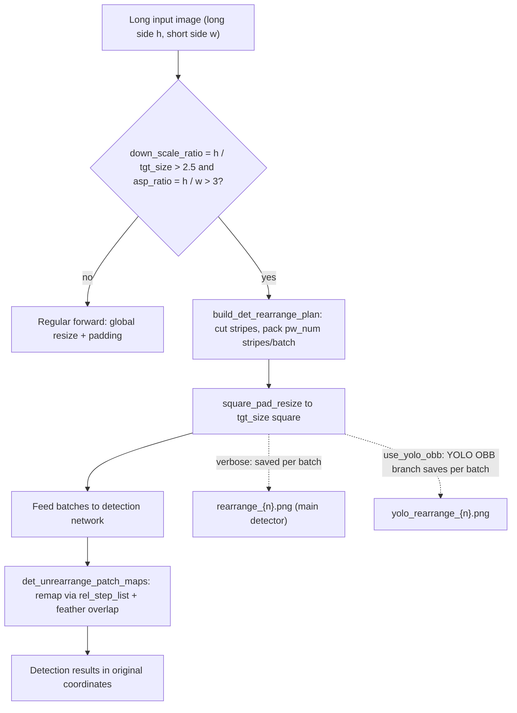
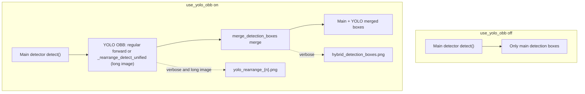

# Input, Detection, and Rearrangement Debug Artifacts

When an image "detects no text", "boxes are misplaced", or "a long image is split oddly", enable "Settings → General → Verbose Logging" (`cli.verbose`), run again, and inspect the input image, detection-box debug images, and long-image rearrangement batches in the per-image debug folder under `result/`. This page documents when these artifacts are generated, what they show, and how to use them for troubleshooting, with emphasis on the difference between input/detection artifacts and the two long-image rearrangement branches `rearrange_{n}.png` and `yolo_rearrange_{n}.png`.

For the overall debug-folder naming and structure, see [Debug folder naming and overview](./folder-naming-and-overview.md); for OCR and text-region artifacts, see [OCR and text regions](./ocr-and-text-regions.md); for mask, inpainting, and rendering artifacts, see [Mask, inpainting, and rendering](./mask-inpainting-and-rendering.md). This page never shows real `.env` files, user images, private absolute paths, or real API keys; sanitize debug images and paths before sharing.

## Feature boundary {#feature-boundary}

- Every artifact on this page is gated by `verbose=True`: when disabled, `_result_path()` does not create a per-image subfolder and detection writes no debug image.
- `input.png`, `mask_raw.png`, `bboxes_with_scores.png`, `mask_binary.png`, `hybrid_detection_boxes.png`, `bboxes_unfiltered.png`, `bboxes_unfiltered_labeled.png`, and `bboxes.png` are the "input/detection-stage" debug artifacts.
- `rearrange_{n}.png` and `yolo_rearrange_{n}.png` are produced only when the image satisfies the long-image rearrangement condition; they are conditional artifacts, not files every run must contain.
- The two rearrangement artifacts belong to different branches: the main detectors (default/DBConvNext/CTD) call `det_rearrange_forward()` to produce `rearrange_{n}.png`; the YOLO OBB auxiliary detector goes through `_rearrange_detect_unified()` with `use_yolo_obb=True` to produce `yolo_rearrange_{n}.png`.
- These files are terminal diagnostics: a static search found no later read-back of these filenames inside the repository; the consumers are operators troubleshooting a run or recipients of an issue report.

## UI operations {#ui-operations}

### Enable verbose logging and collect input/detection artifacts {#enable-verbose-and-collect}

1. Open “Settings” (`Settings`) and select the “General” (`General`) group.
2. Enable “Verbose Logging” (`Verbose Logging`); the switch is stored as `cli.verbose`.
3. Start translating. With verbose enabled, each input image creates a `{timestamp}-{image-md5}-{detection-size}-{target-lang}-{translator}` subfolder under `result/`, and the detection stage writes `input.png` and detection-box debug images.
4. When troubleshooting, open the files in the order "input image → detection boxes → rearrangement batches" and compare them with the tables on this page to locate the failing stage.

### Tune detection and long-image rearrangement parameters {#tune-detection-parameters}

Open “Settings” (`Settings`) → “Detection” (`Detection`). “Detection Size” (`Detection Size`) is both the regular detection scaling size and the target size of long-image rearrangement; “Long Image Rearrange Min Short Side” (`Long Image Rearrange Min Short Side`) controls the effective short-side resolution preserved when packing batches; “Enable YOLO Detection” (`Enable YOLO Detection`) decides whether `yolo_rearrange_{n}.png` and `hybrid_detection_boxes.png` are produced.

| UI call key | English actual value | Simplified Chinese actual value |
| --- | --- | --- |
| `Settings` | Settings | 设置 |
| `General` | General | 通用 |
| `Detection` | Detection | 检测 |
| `label_verbose` | Verbose Logging | 详细日志 |
| `label_detector` | Text Detector | 文本检测器 |
| `label_detection_size` | Detection Size | 检测大小 |
| `label_det_rearrange_min_effective_short_side` | Long Image Rearrange Min Short Side | 长图重排最低有效短边 |
| `label_use_yolo_obb` | Enable YOLO Detection | 启用YOLO辅助检测 |
| `label_yolo_obb_conf` | YOLO Confidence Threshold | YOLO置信度阈值 |
| `label_yolo_obb_overlap_threshold` | YOLO Overlap Removal Threshold | YOLO辅助检测重叠率删除阈值 |
| `label_import_yolo_labels` | Import Fixed YOLO Boxes | 导入固定YOLO框 |

The settings description panel uses the `desc_cli_verbose` and `desc_detector_det_rearrange_min_effective_short_side` texts. Note that `desc_cli_verbose` still describes the debug folder as "timestamp-image-target-translator", which lags behind the current source naming `_set_image_context()` ("timestamp-md5-detection-size-target-lang-translator"); trust the source naming (see [Debug folder naming and overview](./folder-naming-and-overview.md)).

## Input and detection-box debug artifacts {#input-and-detection-artifacts}

The table below lists, in detection-stage order, the debug artifacts owned by this page. Filenames, write points, and trigger conditions come from the static check in `research/phase0-debug-artifact-path-trace.md`.

| Artifact | Write point | Trigger | What it shows | Troubleshooting use |
| --- | --- | --- | --- | --- |
| `input.png` | `manga_translator/manga_translator.py` `_translate_until_translation()` | `verbose=True` | The input image before processing (converted RGB→BGR when saved) | Confirm the image fed to the pipeline; check it first when detection/OCR looks wrong |
| `mask_raw.png` | `manga_translator/manga_translator.py` (after detection returns `ctx.mask_raw`) | `verbose=True` and detection returned a raw mask | Confidence heatmap with color mapping and a "Confidence" color bar (`_create_confidence_heatmap`) | Detection-threshold and missed-text troubleshooting |
| `bboxes_with_scores.png` | `manga_translator/manga_translator.py` (when the detector's third return is a debug tuple or image) | `verbose=True`, detector returned a scored-box debug image | Scored detection boxes overlaid by the detector | Detector-internal debug output |
| `mask_binary.png` | Same as above (binary/triple debug tuple) | Same as above | Binary mask paired with the scored-box image | Detection-output troubleshooting |
| `hybrid_detection_boxes.png` | Same as above (third return is an image and `use_yolo_obb=True`) | `verbose=True`, `use_yolo_obb=True` | Boxes after merging main detection with YOLO OBB (from the dispatch's `draw_detection_debug_image`) | Hybrid-detection merge troubleshooting |
| `bboxes_unfiltered.png` | `manga_translator/manga_translator.py` (after detection, before OCR) | `verbose=True` and text lines remain after detection | Unfiltered text-line boxes on the image (boxes labeled `other` are skipped) | Detection/OCR filtering troubleshooting |
| `bboxes_unfiltered_labeled.png` | `manga_translator/manga_translator.py` → `_save_labeled_textline_debug_image()` | Previous condition, `ocr.merge_special_require_full_wrap=True`, and non-empty text lines | Colored text-line boxes with `index:label` captions (colored per label) | Model-assisted merge / label-routing troubleshooting |
| `bboxes.png` | `manga_translator/manga_translator.py` (after textline merge) | `verbose=True` and `ctx.text_regions` exists | Final text-block visualization (whether panels are shown depends on `force_simple_sort`) | Merge/sort troubleshooting |

## Long-image rearrangement: trigger and splitting {#rearrange-trigger-and-splitting}

`build_det_rearrange_plan()` first normalizes along the long side: if `h < w` it transposes so that `h` is the long side. It computes `down_scale_ratio = h / tgt_size` (`tgt_size` is `detector.detection_size`, default `2048`) and `asp_ratio = h / w`; rearrangement is required only when `down_scale_ratio > 2.5` and `asp_ratio > 3`; otherwise it returns `None` and the regular forward path is used.

When rearranging, the long strip is cut into stripes and packed by `pw_num`: `pw_num` is derived from the "no-downscale stripe count `floor(tgt_size / w)`", the "resolution cap computed from `det_rearrange_min_effective_short_side`", and the "legacy cap `floor(2 * tgt_size / w)`"; each composed batch packs `pw_num` stripes side by side. Each batch is then padded and resized to a `tgt_size × tgt_size` square by `square_pad_resize()` before entering the network. Detection outputs are mapped back to original-image coordinates by `det_unrearrange_patch_maps()` using `rel_step_list`, and overlapping stripe regions are merged with feather weighting based on distance from the stripe cut edges, so text cut at a seam does not lose boxes.

Rearrangement avoids shrinking an extremely long image down to the detection size, which would make text too small; packing batches also bounds the VRAM used by each network call. A higher `det_rearrange_min_effective_short_side` packs fewer stripes per batch and preserves a higher effective short-side resolution, making text clearer but detection slower (matching the settings description).

## Rearrangement artifact branches {#rearrange-artifact-branches}

### `rearrange_{n}.png`: square padded batches of the main detector {#rearrange-artifact-main}

The write point is `det_rearrange_forward()` → `_patch2batches()` in `manga_translator/utils/generic.py`. Triggers: the default, DBConvNext, or CTD detector calls `det_rearrange_forward()`, the image satisfies the `build_det_rearrange_plan()` condition, and `verbose=True`. Content: the square padded batches fed to the detection network — each `{n}` is one composed batch (`pw_num` stripes side by side, padded to `tgt_size`), used to troubleshoot long-image rearrangement: check whether cutting/packing is correct, stripes are complete, and the padding direction is as expected. With verbose, the console prints an "Input image will be rearranged to square batches..." notice.

### `yolo_rearrange_{n}.png`: single YOLO OBB rearrange patch {#rearrange-artifact-yolo}

The write point is `_rearrange_detect_unified()` in `manga_translator/detection/yolo_obb.py`. Triggers: `use_yolo_obb=True`, YOLO OBB also receives a long-image rearrangement plan, the current patch is valid (not an all-zero padding patch and not empty), and `verbose=True`. Content: a single YOLO OBB rearrange patch — YOLO OBB uses the same `build_det_rearrange_plan()` splitting logic as the main detector, so its cuts should match `rearrange_{n}.png`, helping hybrid-detection long-image troubleshooting. All-zero padding patches are skipped, so the indices `{n}` may be non-contiguous.

## Paths and fallbacks {#paths-and-fallbacks}

- The regular detection dispatch passes `self._result_path` as `result_path_fn` to detectors in `_run_detection()`, so both rearrangement artifacts land in the per-image debug folder by default: `result/<timestamp>-<md5>-<detection-size>-<target-lang>-<translator>/rearrange_{n}.png` and `yolo_rearrange_{n}.png` in the same folder.
- When no callback is provided, `det_rearrange_forward()` falls back to `result/rearrange_{n}.png` at the repository root (`generic.py`), and YOLO OBB falls back to `result/yolo_rearrange_{n}.png` (`yolo_obb.py`). In the current source, the call in `manga_translator/utils/ctd_replace.py` does not pass the callback; the regular detection dispatch does.
- The debug-folder name contains the input image MD5; do not put a path containing a user-image MD5 into a public report. Debug PNGs can directly contain pixels of the user image; check every file before sharing.

## Parameters and options {#parameters-and-options}

#### `detector.detection_size` — Detection Size / 检测大小 {#detection-size}

- Control: integer input.
- Location: Settings → Detection; UI call key `label_detection_size`.
- Stored value: integer pixels (detection scaling size).
- Defaults: core `manga_translator/config.py#DetectorConfig.detection_size` is `2048`; Qt model and release config follow their own settings, see [Detection settings](../desktop/settings/detection.md).
- Effective stages: detection; also serves as the `tgt_size` of long-image rearrangement.
- Mechanism: regular detection scales the image near this size; `build_det_rearrange_plan()` uses it to compute `down_scale_ratio = h / tgt_size` and `pw_num`, so it directly decides whether rearrangement triggers and how many `rearrange_{n}.png`/`yolo_rearrange_{n}.png` batches there are.
- Diagram: not needed: the value is only an input to the rearrangement decision and splitting; the branch and visual changes are expressed by the Mermaid diagram in "Long-image rearrangement: trigger and splitting".
- Source evidence: `manga_translator/config.py` (definition), `desktop_qt_ui/locales/en_US.json`, `zh_CN.json` (`label_detection_size`), `manga_translator/utils/generic.py` (consumer).

#### `detector.det_rearrange_min_effective_short_side` — Long Image Rearrange Min Short Side / 长图重排最低有效短边 {#det-rearrange-min-effective-short-side}

- Control: integer input.
- Location: Settings → Detection; UI call key `label_det_rearrange_min_effective_short_side`.
- Stored value: integer pixels.
- Defaults: core `DetectorConfig.det_rearrange_min_effective_short_side` is `341`; Qt model and release config, see [Detection settings](../desktop/settings/detection.md).
- Effective stages: detection (rearrangement path only).
- Mechanism: participates in `max_pw_num_by_resolution = floor(tgt_size / min_effective_short_side)`. Higher values pack fewer stripes per batch and preserve a higher effective short-side resolution, making text clearer but detection slower; too-low values squash the stripe width of very narrow long images.
- Diagram: not needed: it only changes `pw_num` and batch content, not the rearrangement branch itself; the branches are in "Long-image rearrangement: trigger and splitting".
- Source evidence: `manga_translator/config.py` (definition), `manga_translator/utils/generic.py#build_det_rearrange_plan` (consumer), `desktop_qt_ui/locales/*.json` (UI).

#### `detector.use_yolo_obb` — Enable YOLO Detection / 启用YOLO辅助检测 {#use-yolo-obb}

- Control: switch.
- Location: Settings → Detection; UI call key `label_use_yolo_obb`.
- Stored value: boolean; off by default.
- Effective stages: detection (YOLO OBB auxiliary detection and merge after the main detector).
- Mechanism: when off, only the main detector runs and its result is returned; when on, the detection dispatch additionally runs YOLO OBB detection and merges the boxes with the main detector via `merge_detection_boxes()`. On long images satisfying the rearrangement condition, YOLO OBB goes through `_rearrange_detect_unified()`, producing `yolo_rearrange_{n}.png`; with verbose it also produces `hybrid_detection_boxes.png`.
- Diagram: on/off comparison (below), showing "off produces only main boxes; on adds the YOLO branch and two debug artifacts".

- Limitation: enabling it does not change OCR, translation, inpainting, or rendering; if YOLO detection fails, the dispatch falls back to the main-detector result. Full parameter documentation is in [Detection settings](../desktop/settings/detection.md).

#### `cli.verbose` — Verbose Logging / 详细日志 {#cli-verbose}

- Control: switch.
- Location: Settings → General; UI call key `label_verbose`.
- Stored value: boolean; core default `False`.
- Effective stages: debug artifacts and log level across the whole translation pipeline.
- Mechanism: `MangaTranslator.parse_init_params()` reads the `verbose` parameter; when enabled, `_result_path()` uses the per-image subfolder and every write point on this page is guarded by `self.verbose`. It only adds debug artifacts and logs; it does not change the translation result itself.
- Diagram: not needed: it is the master switch for all debug artifacts and introduces no new processing branch; the concrete artifacts are in "Input and detection-box debug artifacts".
- Source evidence: `manga_translator/config.py#CliConfig.verbose`, `manga_translator/manga_translator.py#parse_init_params`, `desktop_qt_ui/locales/*.json` (`label_verbose`/`desc_cli_verbose`).

## Dependencies and conflicts {#dependencies-and-conflicts}

- Every artifact depends on `verbose=True`; when disabled, `result/` gets no per-image debug folder.
- Early exit on no text (no text lines after detection) skips `bboxes_unfiltered*.png` and the later `bboxes.png`; `bboxes_unfiltered_labeled.png` additionally depends on `ocr.merge_special_require_full_wrap`.
- `hybrid_detection_boxes.png` and `yolo_rearrange_{n}.png` depend on `use_yolo_obb`; `import_yolo_labels` replaces the final detection boxes, but the detection dispatch still runs first (rearrangement artifacts may still exist with verbose).
- Long-image rearrangement artifacts are conditional: they do not appear for ordinary images, a large enough `detection_size`, or non-extreme aspect ratios.
- Do not present "artifacts that actually exist in one run" as "always produced"; do not zip and upload a debug folder directly, and note that the `mask_raw` heatmap and rearrangement batches may contain user-image content.

## Related files and formats {#related-files-and-formats}

| File/directory | Role on this page | Note |
| --- | --- | --- |
| `result/<timestamp>-<md5>-<detection-size>-<target-lang>-<translator>/` | Per-image verbose debug folder (where this page's artifacts live) | Name fields come from `_set_image_context()`; contains the user-image MD5 |
| `input.png`, `mask_raw.png`, `bboxes*.png`, `mask_binary.png`, `hybrid_detection_boxes.png` | Input/detection-stage debug images | All PNG; sanitize before sharing |
| `rearrange_{n}.png`, `yolo_rearrange_{n}.png` | Long-image rearrangement debug images | Conditional artifacts; `{n}` is the batch/patch index |
| `result/rearrange_{n}.png`, `result/yolo_rearrange_{n}.png` | Fallback paths when no callback is passed | The regular detection dispatch passes the callback; fallbacks serve standalone/abnormal call paths |
| `config/config.json`, `config/config-example.json` | Source of `cli.verbose`, `detector.*` | Never show real user configuration or private absolute paths |
| `manga_translator_work/yolo_labels/` | Annotation directory read by `import_yolo_labels` | See [Detection settings](../desktop/settings/detection.md) |

## Mermaid data-flow limits {#mermaid-limits}

The diagrams describe source-confirmed trigger decisions, stripe packing, coordinate remapping, and the two rearrangement artifact branches; they do not claim that every run produces all files. `verbose=False`, early exit on no text, unsatisfied rearrangement conditions, `use_yolo_obb=False`, and YOLO inference failure each take their documented bypasses. No runtime screenshot or private task artifact has been fabricated.

## Source evidence {#source-evidence}

| Layer | File | What was checked |
| --- | --- | --- |
| Orchestration | `manga_translator/manga_translator.py` | `_set_image_context()`, `_get_image_subfolder()`, `_result_path()`, `_run_detection()`, `input.png`/`mask_raw.png`/`bboxes*.png` write points, `_save_labeled_textline_debug_image()`, `_create_confidence_heatmap()` |
| Detection | `manga_translator/detection/__init__.py`, `default.py`, `dbnet_convnext.py`, `ctd.py`, `yolo_obb.py` | `dispatch()`/`detect()` callback passing, `det_rearrange_forward()` forward points, `_rearrange_detect_unified()`, `yolo_rearrange_{n}.png` write |
| Rearrangement | `manga_translator/utils/generic.py` | `build_det_rearrange_plan()`, `det_rearrange_patch_array()`, `square_pad_resize()`, `_patch2batches()`, `det_unrearrange_patch_maps()` |
| Config | `manga_translator/config.py` | `DetectorConfig.detection_size`, `det_rearrange_min_effective_short_side`, `use_yolo_obb`; `CliConfig.verbose` |
| UI/i18n | `desktop_qt_ui/locales/en_US.json`, `zh_CN.json` | Three-column actual values and `desc_*` texts |
| Research | `doc/wiki/research/phase0-debug-artifact-path-trace.md`, `phase0-related-files-formats-debug-safety.md` | Path contract, trigger conditions, and sanitization rules |

## Verification {#verification}

| Check | Status | Notes |
| --- | --- | --- |
| BLUEPRINT, PAGE_GUIDELINES, TODO | Complete | Read in full and followed the page contract; covers TODO 6.3 long-image rearrangement item |
| Paths and write points | Complete | Statically checked `_result_path()`/`_set_image_context()` and `research/phase0-debug-artifact-path-trace.md` |
| Rearrangement mechanism | Complete | Statically checked `build_det_rearrange_plan()`, stripe packing, `det_unrearrange_patch_maps()` remapping and feathering |
| `rearrange_{n}.png`/`yolo_rearrange_{n}.png` branches | Complete | Checked the two write chains in main-detector `generic.py` and YOLO OBB `yolo_obb.py` separately |
| UI and i18n copy | Complete | Verified `label_*` three-column values and `desc_*` texts; `desc_cli_verbose` folder naming lag vs source recorded |
| Sanitized runtime verification | Deferred | No real translation was run; no real `.env`, user `config.json`, API key, user image, or private path was read |
| Static checks | Complete | `verify-route-mirror.mjs` PASS, `verify-source-evidence.mjs` PASS |
