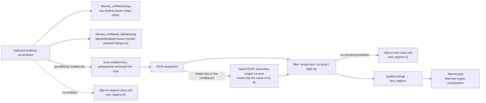

# OCR and Text Region Debug Artifacts

Use this page when OCR misrecognizes or misses text, merges multiple lines into one, or when text-region merging and ordering do not follow the reading order. It explains the OCR input crops, text-region boxes, and the `ocrs/` subdirectory written under `result/` when verbose logging is enabled. These are conditionally written static debug files: they are triggered only by `verbose=True`, do not participate in the final result, and are not generated on every run.

This page covers only the OCR-input and text-region visual artifacts. Detection thresholds and `mask_raw.png`, `bboxes_with_scores.png`, `mask_binary.png`, `hybrid_detection_boxes.png` are covered in [Detection and rearrangement](./input-detection-and-rearrangement.md); OCR engines, hybrid OCR, filtering, and merge parameters are covered in [OCR, filtering, and textline merge](../desktop/settings/ocr-filter-and-merge.md); debug folder naming and global cleanup are covered in [Debug folder naming and overview](./folder-naming-and-overview.md).

## Feature boundary {#feature-boundary}

- Artifacts covered here: `ocrs/<index>.png` (per-line OCR input crops), `bboxes_unfiltered.png` and `bboxes_unfiltered_labeled.png` (textline boxes before OCR), `bboxes.png` (final text-region boxes after merging), plus the path, trigger conditions, visual meaning, and troubleshooting use of the `ocrs/` subdirectory.
- The artifacts are written only when `verbose=True`; the desktop “Verbose Logging” toggle writes `cli.verbose`, and the CLI uses `-v/--verbose`. Full details of the toggle are in [CLI, batch, and output](../desktop/settings/cli-batch-and-output.md).
- Mask, inpainting, rendering, replacement-translation, and WebSocket debug artifacts are covered elsewhere (e.g. [Mask, inpainting, and rendering](./mask-inpainting-and-rendering.md)); conditional artifacts are never described as present on every run.

## UI operations {#ui-operations}

### Enable verbose logging {#enable-verbose}

1. Open “Settings” (`Settings`), select the “General” (`General`) group, and enable “Verbose Logging” (`Verbose Logging`). The toggle is stored as `cli.verbose`.
2. Alternatively, pass `-v/--verbose` when using the CLI, e.g. `python -m manga_translator local -i <input path> -v`.
3. Re-run the image you want to investigate. Debug files are written under `result/<image debug subfolder>/`, and `ocrs/` is one of its subdirectories.
4. Before finishing and sharing, close the application first, then delete unneeded log files and debug folders under `result/`.

### UI call keys and actual labels {#ui-i18n-keys}

The table below records the UI texts involved in the operations and trigger conditions on this page. The UI description names the debug folder “timestamp-image-target-translator”; the actual code-generated subfolder name is `{millisecond timestamp}-{image MD5}-{detection size}-{target language}-{translator}`, and the code takes precedence.

| UI call key | English actual value | Simplified Chinese actual value |
| --- | --- | --- |
| `label_verbose` | Verbose Logging | 详细日志 |
| `desc_cli_verbose` | Output detailed debug info to logs for troubleshooting.  When enabled, Qt UI writes these items under result/: - log_timestamp.txt: Qt UI runtime log - timestamp-image-target-translator/: debug intermediate files for a single task  Cleanup: close Qt UI first, then delete the unneeded log_*.txt files and matching timestamp debug folders under result/. | 输出详细的调试信息到日志，方便排查问题。  开启后会在 result/ 目录生成： - log_时间戳.txt：Qt UI 运行日志 - 时间戳-图片名-目标语言-翻译器/：单次任务的调试中间文件  清理方法：先关闭 Qt UI，再到 result/ 目录删除不需要的 log_*.txt 和对应的时间戳调试文件夹即可。 |
| `label_ocr` | OCR Model | OCR模型 |
| `label_secondary_ocr` | Secondary OCR | 备用OCR |
| `label_use_hybrid_ocr` | Enable Hybrid OCR | 启用混合OCR |
| `label_prob` | Text Region Min Probability | 文本区域最低概率 (prob) |
| `label_filter_text_enabled` | Enable Filter List | 启用过滤列表 |
| `label_min_text_length` | Minimum Text Length | 最小文本长度 |
| `label_skip_no_text` | Skip Images Without Text | 跳过无文本图像 |

## Debug artifacts and trigger conditions {#debug-artifacts-and-triggers}

Debug files are located under `result/<image debug subfolder>/` (`result/` beside the executable in packaged builds). `_run_ocr()` creates `ocrs/` when verbose is enabled; the other images are written by `_result_path()` into the same subfolder. All artifacts listed below are conditional and not present on every run.

### Artifact table {#artifact-table}

| Artifact | Stage | Trigger condition | Visual/content meaning | Troubleshooting use |
| --- | --- | --- | --- | --- |
| `ocrs/<index>.png` | OCR stage | `verbose=True` and the textline passes OCR pre-filtering (e.g. bubble filtering) | Perspective-corrected crop of a single textline, i.e. the input sent to the OCR network; vertical text is rotated to horizontal; the 48px and PaddleOCR paths cap the long side at 200px | When OCR misrecognizes or misses text, check whether the crop is correct, rotated, or compressed |
| `bboxes_unfiltered.png` | After detection, before OCR | `verbose=True` and textlines remain after detection | Raw textline boxes drawn on the image, skipping boxes labeled `other` | Check which boxes enter OCR and whether the boxes fully cover the text |
| `bboxes_unfiltered_labeled.png` | After detection, before OCR | `verbose=True`, model-assisted merge enabled (`ocr.merge_special_require_full_wrap`), and non-empty textlines received | Colored textline boxes with index and label (`balloon`, `qipao`, `other`, etc.), preferring the full detection set | Troubleshoot label routing and model-assisted merge input |
| `bboxes.png` | After textline merge | `verbose=True` and `ctx.text_regions` is non-empty | Final text-region (`TextBlock`) visualization: panel boxes (when simple sorting is off), region boxes, line polylines, angle/coordinate labels, and region indices | Troubleshoot textline merging, reading order, and panel splitting |

### No-text early exit {#no-text-early-exit}

- If detection produces no textlines: the run reports `skip-no-regions`, `ctx.text_regions` is set to an empty list, `bboxes_unfiltered*.png` and `bboxes.png` are not written, and the run proceeds to the size-restore stage.
- If OCR produces no textlines (all empty, low confidence, or matching the filter list): the run reports `skip-no-text`, `ctx.text_regions` is set to an empty list, and `bboxes.png` is not written.
- Therefore, a missing `bboxes.png` in the debug folder does not necessarily mean a write failure; it may be a no-text early exit. Check the log for `skip-no-regions` / `skip-no-text` first.

## Runtime behavior {#runtime}

### Debug chain from textlines to text regions {#data-flow}

### How the `ocrs/` subdirectory is written and indexed {#ocrs-writing-and-indexing}

- When verbose is enabled, `_run_ocr()` sets the `MANGA_OCR_RESULT_DIR` environment variable to `<result>/<image debug subfolder>/ocrs/` (one level deeper when `result_sub_folder` is configured); the OCR implementations read it when saving crops.
- Implementations that write crops: `model_32px.py`, `model_48px.py`, `model_48px_ctc.py`, `model_manga_ocr.py`, and `model_paddleocr.py`. AI OCR (OpenAI/Gemini, `model_api_ocr.py`) and PaddleOCR-VL do not write per-region crops.
- Indices follow textline processing order: PaddleOCR uses the original line index (`{i}.png`), 32px uses a running index (`{ix}.png`), and 48px/48px-CTC/Manga OCR use the in-batch global index (`{ix-N+i}.png`). Pre-filtered lines are not written, so the indices are not contiguous.
- Vertical text is rotated by 90° before saving; the 48px and PaddleOCR paths cap the long side at 200px and use high-compression PNG.
- When `MANGA_OCR_RESULT_DIR` is not set (e.g. an OCR implementation invoked standalone), the fallback is `result/ocrs/` (without the image-level subfolder).

### What the text-region boxes show {#text-region-box-meaning}

`bboxes.png` is drawn by `visualize_textblocks()`:

- panel boxes are magenta rectangles with panel indices, drawn only when simple sorting is off (`force_simple_sort=False`);
- each text region gets a green bounding box, cyan line polylines with line numbers, and a yellow minimum-area rectangle;
- the region center shows the angle `a:`, the top-left corner coordinates `x:`/`y:`, and the top-left corner shows the region index.

### How filtering and hybrid OCR affect the artifacts {#filter-and-hybrid-effects}

- The filter stage (`_filter_ocr_textlines()`) drops empty text, low-confidence lines below `ocr.prob`, and lines matching the filter list (`filter_text_enabled`); dropped lines do not appear in `text_regions` or `bboxes.png`.
- Hybrid OCR (`ocr.use_hybrid_ocr`) re-runs lines that the primary OCR left empty or below confidence with `ocr.secondary_ocr`; both runs write to `ocrs/`, so indices may collide and be overwritten, and which run the final file keeps must be confirmed per run.
- The no-text early exit happens after filtering; `bboxes.png` is then not generated. This does not affect other stage artifacts such as `input.png` or `final.png`.

## Dependencies and conflicts {#dependencies}

- `ocrs/` and all box images depend on `cli.verbose=True`; with verbose off, none of the artifacts on this page are produced.
- `bboxes_unfiltered_labeled.png` depends on the model-assisted merge toggle (`ocr.merge_special_require_full_wrap`); it is not written when the toggle is off.
- Whether `bboxes.png` draws panel boxes depends on `force_simple_sort`; with simple sorting on, only region boxes are drawn.
- Hybrid OCR reuses the same `ocrs/` directory for both runs, so the index does not guarantee a one-to-one mapping to the final text region; do not treat `ocrs/<index>.png` as evidence of the final region order.
- The artifacts come from the user's source image and OCR text and may contain user images, source text, and coordinates; inspect and sanitize every file before sharing.

## Related files and formats {#files-and-formats}

| File/directory | Role on this page | Note |
| --- | --- | --- |
| `result/<image debug subfolder>/ocrs/<index>.png` | Per-line OCR input crop | Conditional; may contain user images and text; sanitize before sharing |
| `result/<image debug subfolder>/bboxes_unfiltered.png` | Raw textline boxes | Skips boxes labeled `other` |
| `result/<image debug subfolder>/bboxes_unfiltered_labeled.png` | Labeled/indexed textline boxes | Requires model-assisted merge |
| `result/<image debug subfolder>/bboxes.png` | Final text-region visualization | For merge/order/panel troubleshooting |
| `result/ocrs/` | Fallback directory when the environment variable is unset | Mainly appears when an OCR implementation is invoked standalone |
| `result/log_<timestamp>.txt` | Global desktop runtime log | Different from the per-image debug folder; contains local paths, clean before sharing |

## Mermaid data-flow limits {#diagram-limits}

The diagram shows the conditional write chain in the source code, not a complete file tree generated on every run. No-text early exits, hybrid-OCR index overwrites, model-assisted merge being off, and simple sorting all change the artifact combination; `mask_raw.png`, `bboxes_with_scores.png`, `mask_binary.png`, and `hybrid_detection_boxes.png` belong to the detection stage and are covered in [Detection and rearrangement](./input-detection-and-rearrangement.md). This page does not fabricate runtime screenshots or include user images or private task artifacts.

## Source evidence {#source-evidence}

| Layer | File | What was checked |
| --- | --- | --- |
| UI/i18n | `desktop_qt_ui/locales/en_US.json`, `zh_CN.json` | Actual values of `label_verbose`, `desc_cli_verbose`, and OCR-related labels |
| Verbose toggle | `manga_translator/args.py`, `manga_translator/config.py` | CLI `-v/--verbose` and `cli.verbose` |
| Directories and orchestration | `manga_translator/manga_translator.py` | `_set_image_context`, `_result_path`, `_run_ocr`, `_run_textline_merge`, filtering and early exits, `bboxes*.png` writes |
| OCR crops | `manga_translator/ocr/model_32px.py`, `model_48px.py`, `model_48px_ctc.py`, `model_manga_ocr.py`, `model_paddleocr.py` | `ocrs/<index>.png` writes, rotation, and the 200px cap |
| Region visualization | `manga_translator/utils/textblock.py`, `manga_translator/utils/generic.py` | `visualize_textblocks` elements and `get_transformed_region` perspective correction |
| Debug artifact trace | `doc/wiki/research/phase0-debug-artifact-path-trace.md` | Path contract and conditional artifact list |

## Verification {#verification}

| Check | Status | Notes |
| --- | --- | --- |
| Contract documents | Complete | Written per PAGE_GUIDELINES, BLUEPRINT, and TODO 1.3/5.15/6.3 |
| UI/i18n labels | Complete | Statically checked `en_US.json`/`zh_CN.json` and `data/i18n.generated.json` actual values |
| OCR and text-region artifact chain | Complete | Statically checked `_run_ocr`, the five OCR implementations, `bboxes*.png`, and the merge chain |
| Route mirror check | Complete | `node scripts/verify-route-mirror.mjs .`: PASS (120 zh / 120 en) |
| Source-evidence check | Complete | `node scripts/verify-source-evidence.mjs .`: PASS |
| Sanitized runtime verification | Deferred | No real `.env`, user images, private paths, or task artifacts were read |
| VitePress build | Deferred | Coordinator runs `npm run docs:build --prefix doc/wiki` |