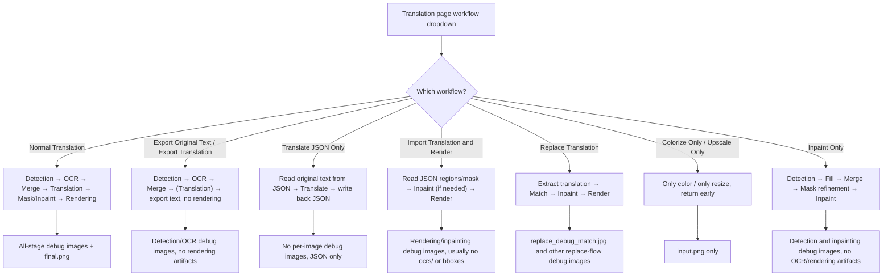
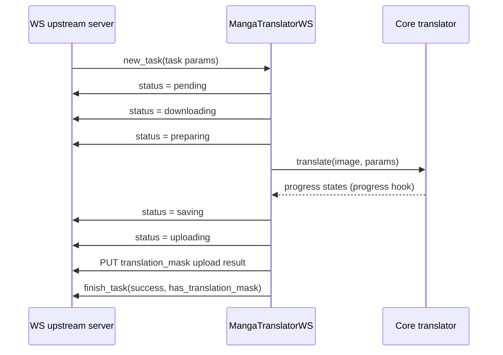

# Special Workflows and WebSocket Debug Artifacts

When modes such as Export Original Text, Export Translation, Translate JSON Only, Import Translation and Render, Replace Translation, or Colorize Only / Upscale Only / Inpaint Only skip parts of the standard pipeline, this page explains which debug artifacts they do (or do not) produce. The two internal transport modes, `ws` and `shared`, additionally write `ws_*` debug images and transport-related files of their own. Per-stage debug images for the normal pipeline are covered in [Debug Folder Naming and Overview](./folder-naming-and-overview.md), [OCR and Text Regions](./ocr-and-text-regions.md), and [Mask, Inpainting and Rendering](./mask-inpainting-and-rendering.md); the full protocol contract for `ws`/`shared` lives in [Internal Shared and WebSocket Protocol](../developer/internal-shared-and-websocket.md).

## Feature boundary

- Debug artifacts fall into three groups: conditional artifacts of special workflows that skip stages, the `ws_*` images written by the `ws` mode rendering callback, and the logs and directories produced while `shared`/`ws` run.
- Unless stated otherwise, every debug artifact requires `verbose` to be enabled; otherwise only business files such as the final image, JSON, or text exports are written.
- "Artifacts that actually exist in one run" differs from "all artifacts the current source may generate in that mode": for example, Import Translation and Render only triggers the detection branch when a mask is missing or detection must be rerun.
- This page does not repeat the endpoints, ports, authentication, or pickle/protobuf serialization details of `shared`/`ws`; those belong to [Internal Shared and WebSocket Protocol](../developer/internal-shared-and-websocket.md).

## UI operations

### Choosing a workflow mode on the translation page

Open the "Translation" page. The dropdown at the top is labeled "Translation Workflow Mode:" and the hint below is "Choose translation workflow mode before starting the task.". The dropdown has 9 options; selecting one writes the corresponding backend flag into `cli.*` configuration and saves it immediately. The start button text also changes with the mode.

### Enabling verbose logging in settings

Open "Settings" → the "General" group and check "Verbose Logging" (storage key `cli.verbose`). When enabled, the Qt UI writes a runtime log `log_<timestamp>.txt` under `result/` and creates a per-image debug subfolder for each translation; when disabled, none of these debug files are written. The `local`, `ws`, `shared`, and `web` CLI subcommands each provide their own `-v/--verbose` switch.

## Option matrix

| UI call key | English actual value | 简体中文 actual value |
| --- | --- | --- |
| `Translation Workflow Mode:` | Translation Workflow Mode: | 翻译流程模式： |
| `Choose translation workflow mode before starting the task.` | Choose translation workflow mode before starting the task. | 开始任务前请选择翻译流程模式。 |
| `Normal Translation` | Normal Translation | 正常翻译流程 |
| `Export Translation` | Export Translation | 导出翻译 |
| `Export Original Text` | Export Original Text | 导出原文 |
| `Translate JSON Only` | Translate JSON Only | 仅翻译（JSON） |
| `Import Translation and Render` | Import Translation and Render | 导入翻译并渲染 |
| `Colorize Only` | Colorize Only | 仅上色 |
| `Upscale Only` | Upscale Only | 仅超分 |
| `Inpaint Only` | Inpaint Only | 仅修复 |
| `Replace Translation` | Replace Translation | 替换翻译 |
| `Start Translation` | Start Translation | 开始翻译 |
| `Start Replace Translation` | Start Replace Translation | 开始替换翻译 |
| `Start Inpainting` | Start Inpainting | 开始修复 |
| `Start Upscaling` | Start Upscaling | 开始超分 |
| `Start Colorizing` | Start Colorizing | 开始上色 |
| `Start JSON Translation` | Start JSON Translation | 开始仅翻译（JSON） |
| `Generate Original Text Template` | Generate Original Text Template | 仅生成原文模板 |
| `label_verbose` | Verbose Logging | 详细日志 |
| `desc_cli_verbose` | Output detailed debug info to logs for troubleshooting. … | 输出详细的调试信息到日志，方便排查问题。… |
| `🔧 Translation workflow: {mode}` | 🔧 Translation workflow: {mode} | 🔧 翻译流程：{mode} |

## Special workflow debug artifacts

The 8 non-default modes in the dropdown map to a set of backend flags: `template` (with `save_text`), `generate_and_export`, `translate_json_only`, `load_text`, `replace_translation`, `colorize_only`, `upscale_only`, and `inpaint_only`. Each of these skips part of the standard pipeline, so the table below lists "conditional artifacts this mode may produce with verbose enabled", not files that appear on every run.

| Workflow mode (UI) | Backend flag | Skipped/changed stages | Conditional verbose artifacts |
| --- | --- | --- | --- |
| Normal Translation | (none) | None | Full standard set: `input.png`, `mask_raw.png`, `bboxes*.png`, `ocrs/`, `mask_final.png`, `inpaint_input.png`, `inpainted.png`, rendering debug images, `final.png` |
| Export Original Text | `template` + `save_text` | Skips translation and rendering; forces single-image batches | `input.png`, `mask_raw.png`, `bboxes*.png`, `ocrs/`, `bboxes.png`; no inpainting/rendering/`final.png`; also exports original text |
| Export Translation | `generate_and_export` | Skips rendering | Detection/OCR artifacts (as above); no inpainting/rendering/`final.png`; also exports translated text |
| Translate JSON Only | `translate_json_only` | Skips detection/OCR/rendering; only reads and writes JSON | No per-image debug images; rewrites JSON on success and deletes `imagename_original.txt` |
| Import Translation and Render | `load_text` | Skips detection/OCR/translation; renders directly | Usually only rendering/inpainting artifacts (`inpaint_input.png`, `mask_final.png`, `inpainted.png`, `final.png`); detection branch only when a mask is missing or YOLO label import is enabled |
| Replace Translation | `replace_translation` | Does not run normal translation; extracts translation → matches → inpaints → renders | `replace_debug_match.jpg`, `inpainted.png`, `debug_extracted_text.png` |
| Colorize Only | `colorize_only` | Only colorizes | `input.png`; no detection/OCR/rendering/`final.png` |
| Upscale Only | `upscale_only` | Only upscales | `input.png`; no detection/OCR/rendering/`final.png` |
| Inpaint Only | `inpaint_only` | Detection → fill → merge → mask refinement → inpainting; no OCR/translation/rendering | `input.png`, detector debug images (e.g. `bboxes_with_scores.png`), `inpaint_input.png`, `mask_final.png`, `inpainted.png` |



The diagram describes real branches in the source; no run screenshots are faked. The actual artifacts of each branch also depend on whether the detector returns debug images, whether text regions exist, and whether a mask is missing; conditional artifacts must not be described as present on every run.

### Export workflows

- "Export Original Text" (`template` + `save_text`): preprocessing runs as usual (so verbose still writes `input.png`, `mask_raw.png`, `bboxes*.png`, `ocrs/`, `bboxes.png`), then original text is exported directly; translation, mask, inpainting, and rendering are skipped, so there is no `final.png`. The JSON records `skip_font_scaling: false`, so the next import render re-runs smart typesetting.
- "Export Translation" (`generate_and_export`): detection/OCR/translation run as usual, but rendering is skipped and translated text is exported. The JSON records `skip_font_scaling: true` to replay the generated result.
- "Translate JSON Only" (`translate_json_only`): reads original text from JSON, translates, writes the result back, and deletes the matching `imagename_original.txt` on success. This branch never enters the per-image debug writes, so verbose produces no per-image debug images.
- All three export flows write under `manga_translator_work/` into the `json/`, `originals/`, and `translations/` subdirectories; these are business files, not debug artifacts. The template format is decided by `config/translation_template.json`, which is parsed as a text template and must not be assumed to be strict JSON.

### Import and replace workflows

- "Import Translation and Render" (`load_text`): reads regions and masks from `_translations.json` (or an in-memory payload) and renders directly, skipping detection/OCR/translation. When the JSON already carries a refined mask, no detection debug images are generated; the detection branch only triggers when the JSON lacks a mask or "import YOLO labels" requires regenerating a mask. The inpainted image may come from an editor in-memory payload, a disk file under `manga_translator_work/inpainted/`, or a fresh inpainting run; `inpaint_input.png`/`mask_final.png`/`inpainted.png` only appear when inpainting actually runs.
- "Replace Translation" (`replace_translation`): place translated images with matching filenames under `manga_translator_work/translated_images/`; the program extracts the translated text, matches regions on the raw image, inpaints the original text regions, and renders the translation. With verbose it writes `replace_debug_match.jpg` (raw boxes, translated boxes, match lines and overlap ratios), `inpainted.png` (the inpainted raw image), and `debug_extracted_text.png` (the extracted translated text in direct-paste mode).

### Single-stage workflows

- "Colorize Only" / "Upscale Only": save `input.png` (verbose) at the per-image entry and return immediately; they never enter detection/OCR/translation/rendering, so there is no `mask_raw.png`, `ocrs/`, `inpainted.png`, or `final.png`.
- "Inpaint Only": runs "detection → fill placeholder text → textline merge → mask refinement → inpainting" and skips OCR, translation, and rendering. With verbose it produces `input.png`, detector debug images (e.g. `bboxes_with_scores.png`/`mask_binary.png`/`hybrid_detection_boxes.png`), and inpainting artifacts (`inpaint_input.png`, `mask_final.png`, `inpainted.png`); no `ocrs/`, no rendering debug images, and no `final.png`.

## WebSocket and shared-transport debug artifacts

In `ws` mode (`MangaTranslatorWS`), verbose additionally writes the following rendering-related images into the per-image debug subfolder. `shared` mode has no dedicated files of its own, but with verbose it uses the same `_result_path()` debug directory as the normal pipeline.

| Artifact | Write point | Trigger | Content and consumer |
| --- | --- | --- | --- |
| `ws_render_in.png` | `manga_translator/mode/ws.py#_run_text_rendering` | `ws` mode and verbose | Image before rendering, `ctx.img_rgb` |
| `ws_render_out.png` | Same | `ws` mode and verbose | Rendered output before mask clipping |
| `ws_mask.png` | Same | `ws` mode and verbose | Final render mask (white 255), merged from pixels changed by rendering and `ctx.mask` |
| `ws_inmask.png` | Same | `ws` mode and verbose | Input image masked to the render region (RGBA × mask) |
| `ws_output.png` | Same | `ws` mode and verbose | Rendered output masked to the render region (RGBA × mask), i.e. the content actually uploaded |
| `ws_final.png` | `manga_translator/mode/ws.py#server_process_inner` | `ws` mode and verbose, and translation succeeded | Final result resized back to the original dimensions (LANCZOS) |
| `result/<task_id>/` | `manga_translator/mode/ws.py#server_process_inner` | `ws` mode and verbose | Cleaned and recreated before processing; the current source writes `ws_*` debug images into the per-image subfolder via `_result_path()`, so the relationship between `result/<task_id>/` and the per-image subfolder needs runtime verification |

The only transport-related files of `shared` mode are the runtime log and the debug subfolders themselves: `MangaShare` creates the translator with `MangaTranslator(params)`, `verbose` is passed through the parameters, and debug images land in the same `result/<image-subfolder>/` location as normal mode. `result/log_<timestamp>.txt` is the global DEBUG log configured by the desktop Qt UI at startup in `desktop_qt_ui/main.py`; it is not part of a per-image debug subfolder.

## Runtime behavior

### Debug directory and trigger conditions

`MangaTranslator._set_image_context()` builds the subfolder name at the start of each input image:

```text
{millisecond timestamp}-{first 8 chars of image MD5}-{detection_size}-{target_lang}-{translator}
```

The MD5 is computed over a PNG-normalized copy of the image content and truncated to 8 characters, falling back to `fallback_<timestamp>` on failure. `_result_path()` returns `BASE_PATH/result/<image-subfolder>/<artifact>` and creates the parent directory when verbose is on and an image context exists; `BASE_PATH` is the executable directory in packaged builds and the repository root in development. The settings description text simplifies this to "timestamp-image-target-language-translator", but the actual middle fields are the MD5 and detection size; the source is authoritative.

The terminal diagnostic files written directly by `_result_path()` (e.g. `input.png`, `mask_raw.png`, `bboxes*.png`, `ocrs/`, `inpaint_*.png`, `inpainted.png`, `final.png`) are consumed by operators who enable verbose or by issue-report recipients; static searches found no later reads of these filenames in the repository.

### WebSocket mode protocol and artifacts

`MangaTranslatorWS` subclasses the translator and acts as an internal worker client that actively connects to an upstream server (CLI default `ws://localhost:5000`), authenticating with the `x-secret` header (from the `ws_secret` parameter or the `WS_SECRET` environment variable; there is no `--ws-secret` CLI option). Messages are protobuf `WebSocketMessage` with a `oneof` containing `new_task`, `status`, and `finish_task`. The image is downloaded from the `source_image` URL and the result is `PUT` back to the `translation_mask` URL; images with a long edge above 1200 pixels force `upscale_ratio=1`. `--host`/`--port`/`--nonce` are parseable on the `ws` subcommand but the current `MangaTranslatorWS` does not consume them.



Additional states are `error-download` (download failed) and `error-upload` (upload failed). With verbose, `_run_text_rendering()` writes `ws_render_in/out`, `ws_mask`, `ws_inmask`, and `ws_output`, and `ws_final.png` is saved before upload. `sync_state` forwards progress states as `status` messages through a `Throttler` that limits sends to one per 0.2 seconds.

### Shared transport protocol and artifacts

`MangaShare` starts an internal FastAPI app with uvicorn, listening on `127.0.0.1:5003` by default. Only `translate` and `translate_batch` are allowed; a missing or mismatched `X-Nonce` header returns 401, a busy lock returns 429, and any other method name returns 403. The streaming response of `/execute/{method}` uses a frame format of "1-byte status + 4-byte big-endian length + payload":

| Status byte | Meaning | Payload |
| --- | --- | --- |
| `0` | Result | Pickled `Context` (a minimal 1×1 white result when `use_placeholder` is set) |
| `1` | Progress | UTF-8 state string (e.g. `detection`, `ocr`, `translation`, `rendering`) |
| `2` | Error | Error text |

`/simple_execute/{method}` returns the pickled bytes in one shot. Unpickling untrusted input can execute arbitrary code, and `X-Nonce` is weak authentication transmitted in plaintext, so `shared`/`ws` must be treated as internal protocols bound to loopback or a controlled network. `timeout_keep_alive=1800` (30 minutes) keeps batch translations connected.

## Dependencies and conflicts

- Every debug artifact requires `verbose`; `desc_cli_verbose` describes the Qt UI behavior, while each CLI mode controls it with `-v` separately — do not mix the two.
- Special workflows are incompatible with `batch_concurrent`: when any of `load_text`, `translate_json_only`, `template+save_text`, `generate_and_export`, `colorize_only`, `upscale_only`, `inpaint_only`, or `replace_translation` is enabled, `batch_concurrent` is ignored and processing falls back to sequential; `template+save_text` also forces `batch_size=1`.
- `ws`/`shared` are internal execution links, not the public Web API; do not mix the web-mode `0.0.0.0:8000`, the shared `127.0.0.1:5003`, and the ws upstream `ws://localhost:5000` ports.
- Debug images, `ocrs/` crops, `replace_debug_match.jpg`, `ws_*` images, JSON, and logs can all contain user images, original/translated text, or local paths; each file must be sanitized before sharing, and `mask_raw` base64 or a PNG debug image is not the same as sanitized data.

## Related files and formats

| File/directory | Role on this page | Note |
| --- | --- | --- |
| `result/<image-subfolder>/` | Per-image verbose debug artifacts (including `ws_*`) | Naming rules above; not every run produces every file |
| `result/<task_id>/` | Created by `ws` mode with verbose | Relationship to the per-image subfolder pending runtime verification |
| `result/log_<timestamp>.txt` | Desktop Qt UI global runtime log | Configured in `desktop_qt_ui/main.py`; not part of a per-image debug folder |
| `manga_translator_work/json/` | `_translations.json` working files | Read/written by export/import flows; includes fields such as `mask_raw` base64 and `mask_is_refined` |
| `manga_translator_work/originals/`, `translations/` | Original/translated template exports | Extension decided by `config/translation_template.json` |
| `manga_translator_work/translated_images/` | Replace Translation input | Translated images named like the raw images |
| `manga_translator_work/inpainted/` | Historical inpainted images | Reused first by `load_text` when an inpainted image is missing |
| `<stem>_photoshop_script.jsx` | Editable PSD export script | Generated with verbose or `psd_script_only`; may contain layer text and local paths, sanitize before sharing |
| `manga_translator/mode/ws.py`, `mode/share.py` | Internal worker implementations | Protocol details in [Internal Shared and WebSocket Protocol](../developer/internal-shared-and-websocket.md) |

## Source evidence {#source-evidence}

| Layer | File | What this page verified |
| --- | --- | --- |
| UI/workflow mode | `desktop_qt_ui/ui/main_page/pages/translation_page.py`, `ui/main_page/runtime.py`, `desktop_qt_ui/app_logic.py` | 9 dropdown options, flag writes, start-button text, `batch_concurrent` disable list |
| UI/verbose logging | `desktop_qt_ui/ui/main_page/settings_tab_layout.json`, `desktop_qt_ui/core/config_models.py`, `locales/en_US.json`, `zh_CN.json` | `cli.verbose` location, `label_verbose`/`desc_cli_verbose` English/Chinese values |
| Debug directory | `manga_translator/manga_translator.py#_set_image_context`, `_get_image_subfolder`, `_result_path` | Subfolder naming, MD5, `BASE_PATH` branches |
| Special workflows | `manga_translator/manga_translator.py#translate_batch` | Skipped stages per mode, single-image batches, JSON flags (`skip_font_scaling` etc.) |
| Replace artifacts | `manga_translator/utils/replace_translation.py` | Trigger conditions for `replace_debug_match.jpg`, `inpainted.png`, `debug_extracted_text.png` |
| ws artifacts | `manga_translator/mode/ws.py` | `ws_*` write points, status frames, `x-secret`, `result/<task_id>/` |
| shared artifacts | `manga_translator/mode/share.py` | Endpoints, `X-Nonce`, 0/1/2 frame format, pickle and `use_placeholder` |
| Runtime log | `desktop_qt_ui/main.py` | `result/log_<timestamp>.txt` generation |

## Verification {#verification}

| Verification item | Status | Notes |
| --- | --- | --- |
| BLUEPRINT, PAGE_GUIDELINES, TODO | Done | Read section 1.3, item 5.15, and section 6.3 in full and wrote per the page contract |
| Workflow modes and i18n | Done | Statically verified translation-page dropdown, runtime, app_logic, and actual `en_US`/`zh_CN` values |
| Special workflow branches | Done | Statically verified skipped stages and JSON flags in `translate_batch` |
| ws/shared artifacts | Done | Statically verified write points, frame format, and auth in `mode/ws.py` and `mode/share.py` |
| Sanitized runtime verification | Pending | No real `.env`, user config, API key/token, user images, or private task artifacts were read; the `result/<task_id>/` relationship to the per-image subfolder and actual artifact sets per mode need a sanitized run |
| VitePress checks | Pending | Coordinator runs `node scripts/verify-route-mirror.mjs .`, `node scripts/verify-source-evidence.mjs .`, and the build check before merge |
