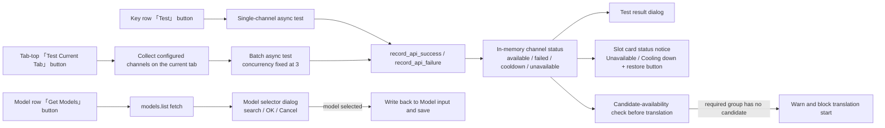

# Connection Tests and Model List

After filling in Key, Base, and Model on the API Management page, use the features on this page to verify that a connection actually works, then fetch model names from the server back into the Model field. Testing does more than show a result dialog: success or failure is written into the in-memory channel status, which also affects the candidate-availability check before starting translation.

This page does not cover filling, masking, or `.env` persistence of credential fields (see [API Credentials, Addresses, and Models](./credentials-addresses-models.md)), slot add/delete and rotation strategy (see [Slots and rotation](./slots-and-rotation.md)), or the cooldown, unavailable, and auto-recovery state machine for real requests (see [Failures, cooldown, and recovery](./failures-cooldown-and-recovery.md)).

## Feature boundary

- “Test” (`Test`) tests a single API channel (the button on the right of the Key row); “Test Current Tab” (`Test Current Tab`) batch-tests every configured channel on the current feature tab. The batch test applies only to the current tab (Translation/OCR/Colorization/Render) and never crosses tabs.
- Test results are written into the in-memory status through `record_api_success` / `record_api_failure`; before starting translation, `validate_api_candidate_availability()` checks each required channel group for available candidates and blocks the start with a warning when none remain.
- “Get Models” (`Get Models`) fetches the model list from the server and writes the selected model back into the Model input. Only the Model row has this button; the Key row has only “Test”, and the Base row has neither button.
- This page does not cover the `run_with_api_candidates` failover/round_robin request retries, cooldown timing, or recovery logic; that state machine belongs to [Failures, cooldown, and recovery](./failures-cooldown-and-recovery.md).
- Testing and model fetching issue real network requests and require the channel to have Key/Base/Model filled in; local OpenAI-compatible endpoints (`localhost`, private IPs, `.local`, etc.) automatically use the `ollama` placeholder key when the key is empty.

## UI operations

### Test a single API channel

1. Open “API Management” (`API Management`) and choose the “Translation” (`Translation`), “OCR” (`OCR`), “Colorization” (`Colorization`), or “Render” (`Render`) tab.
2. Click “Test” (`Test`) on the right of the Key row in an API slot card.
3. A progress dialog appears with “Testing” (`Testing`) and “Testing API connection, please wait...” (`Testing API connection, please wait...`); you can stop it with “Cancel” (`Cancel`). Cancelling shows no result dialog.
4. On success, an information dialog appears with the title “API connection test successful!” (`API connection test successful!`); on failure, an “Error” (`Error`) dialog appears with the title “API connection test failed” (`API connection test failed`) and a body containing classified troubleshooting advice and an API address example.

### Test all channels on the current tab

1. Click “Test Current Tab” (`Test Current Tab`) on the right of the feature-selector row at the top of the tab.
2. An “API Batch Test” (`API Batch Test`) progress dialog appears, stating “Testing {count} API channels with concurrency {concurrency}...” (`Testing API channels`); the concurrency is fixed at 3.
3. When it finishes, an “API Batch Test Results” (`API Batch Test Results`) dialog appears with the summary “{total} total, {available} available, {unavailable} unavailable” (`API batch test summary`). The body lists only the unavailable channels, each prefixed with `[unavailable]` plus the error message; when everything is available it shows only “No unavailable API” (`No unavailable API`).
4. If the current tab has no testable channels (no Key/Base filled and the local-placeholder rule does not apply), clicking it only shows “No API channels to test” (`No API channels to test`).

### Fetch the model list and write it into the Model field

1. Click “Get Models” (`Get Models`) on the right of the Model row in an API slot card.
2. A “Get Models” progress dialog appears with “Fetching models, please wait...” (`Fetching models, please wait...`); it can be cancelled.
3. On success, a “Select Model” (`Select Model`) dialog appears with the prompt “Available models:” (`Available models:`), a search box placeholder of “Search models...” (`Search models...`), and “OK” (`OK`) / “Cancel” (`Cancel`) buttons; OK stays disabled until a model is selected and the single filtered result is auto-selected.
4. After selecting a model and clicking OK, the model name is written back into the Model input and saved; an empty server response shows “No models available” (`No models available`); a fetch failure shows “Failed to get models” (`Failed to get models`).

### Action and dialog copy {#ui-copy}

| Call key | English actual value | Simplified Chinese actual value |
| --- | --- | --- |
| `Test Current Tab` | Test Current Tab | 测试当前页 |
| `Test` | Test | 测试 |
| `Get Models` | Get Models | 获取模型 |
| `API Batch Test` | API Batch Test | API 批量测试 |
| `Testing API channels` | Testing {count} API channels with concurrency {concurrency}... | 正在测试 {count} 个 API 通道，并发 {concurrency}... |
| `Testing` | Testing | 测试中 |
| `Testing API connection, please wait...` | Testing API connection, please wait... | 正在测试API连接，请稍候... |
| `Fetching models, please wait...` | Fetching models, please wait... | 正在获取模型列表，请稍候... |
| `API Batch Test Results` | API Batch Test Results | API 批量测试结果 |
| `API batch test summary` | {total} total, {available} available, {unavailable} unavailable | 共 {total} 个，可用 {available} 个，不可用 {unavailable} 个 |
| `API test available` | available | 可用 |
| `API test unavailable` | unavailable | 不可用 |
| `No API channels to test` | No API channels to test | 没有可测试的 API 通道 |
| `No unavailable API` | No unavailable API | 无不可用 API |
| `API connection test successful!` | API connection test successful! | API连接测试成功！ |
| `API connection test failed` | API connection test failed | API连接测试失败 |
| `API slot unavailable marker` | Unavailable | 不可用 |
| `API slot cooldown marker` | Cooling down | 冷却中 |
| `Restore API channel` | Restore | 恢复 |
| `API candidate availability failed` | No available API candidates | 没有可用的 API 候选 |
| `API candidate availability failed details` | The following API channels have no available candidates: {details}... | 以下 API 通道当前没有可用候选：{details}... |
| `Select Model` | Select Model | 选择模型 |
| `Available models:` | Available models: | 可用模型： |
| `Search models...` | Search models... | 搜索模型... |
| `OK` | OK | 确定 |
| `Cancel` | Cancel | 取消 |
| `No models available` | No models available | 没有可用的模型 |
| `Failed to get models` | Failed to get models | 获取模型列表失败 |
| `Error` | Error | 错误 |
| `Warning` | Warning | 警告 |
| `Success` | Success | Success |

`Success` has no translation entry in `en_US.json` or `zh_CN.json`; `_t` falls back to the literal, so the English UI also shows `Success`. The error-dialog body (classified advice and API address example) is hardcoded Chinese by `_format_test_connection_error()` and is not localized.

## Test result display {#test-result-display}

### Single-channel test results

The success dialog title is fixed as “API connection test successful!”, and the body shows the detail returned by the test function (for example “连接成功，模型 {model} 可用”). The failure dialog title is “API connection test failed”, and the body classifies advice by error keywords, then appends “API 地址示例：{address}” and the original error (wrapped at 60 characters). These detail strings are currently hardcoded Chinese and do not follow the UI language.

### Batch test results

The batch result dialog summarizes by available/unavailable. The title shows total and available/unavailable counts; the body lists only the failed channels, each line prefixed with `[unavailable]` followed by the channel label (for example `OpenAI API Key #2`) and the wrapped error; when all pass, the body is empty and shows “No unavailable API”. After the dialog closes, the slot cards and status notices are rebuilt from the latest status.

### Slot status notice and restore

When a channel is `unavailable` (permanently unavailable) or `cooldown` (cooling down), the corresponding slot card inserts a colored status notice: `unavailable` shows “Unavailable” (`Unavailable`) and `cooldown` shows “Cooling down” (`Cooling down`), with a sync-icon restore button on the right (tooltip “Restore”). Clicking restore calls `clear_api_status` to remove the in-memory status and immediately rebuilds the group.

| In-memory state | Written by | UI presentation |
| --- | --- | --- |
| `available` | Successful test or real request | No status notice; counted as “available” in batch tests |
| `failed` | Ordinary failure (not permanent, not rate-limited) | Counted as “unavailable” in batch tests with the error listed; no notice on the card |
| `cooldown` | 429 or rate-limit marker | Card status notice “Cooling down” + restore button |
| `unavailable` | Permanent 400-class errors (invalid key, missing model, quota, etc.) | Card status notice “Unavailable” + restore button |

## Runtime behavior {#runtime-behavior}

### Test-target detection and channel collection

Each environment-variable key is split by scope (`OCR_` / `COLOR_` / `RENDER_`) and provider (`OPENAI` / `GEMINI` / `DEEPSEEK` / `GROQ` / `CUSTOM_OPENAI` / `SAKURA`) before the test target is resolved: the scope decides `openai_ocr`, `gemini_ocr`, `openai_colorizer`, `gemini_renderer`, and so on; unscoped providers map to `openai`, `gemini`, `sakura`, and others; the translation tab also falls back to the current translator key. The batch test collects only keys whose field is `API_KEY` / `AUTH_KEY` / `TOKEN` under the current tab scope and dedupes by “feature:provider:slot”; on the translation tab with Sakura selected it additionally collects `SAKURA_API_BASE` as one item. A channel enters the test list only when a Key is configured, or when Sakura or a local OpenAI-compatible endpoint only needs an address.

### How test requests are built

`test_api_connection_async()` dispatches to different implementations by test target; all of them issue real HTTP requests:

- OpenAI text (translation): with a model filled in it calls `chat.completions.create` for that model, otherwise `models.list`; client timeout is 30 seconds.
- OpenAI OCR: without a model it uses the default `gpt-4o` and sends a 50×50 white test image with “Read the image and reply with OK.”; timeout is 30 seconds.
- OpenAI colorization/rendering: without a model it uses the default `gpt-image-1` and calls the image-generation interface; timeout is 60 seconds.
- Gemini text/OCR: without a model, OCR uses the default `gemini-1.5-flash`; it generates content or lists models; timeout is 30 seconds.
- Gemini colorization/rendering: without a model it uses the default `gemini-2.0-flash-preview-image-generation`, requests the TEXT+IMAGE modality, and disables safety thresholds; timeout is 60 seconds.
- Sakura: uses an OpenAI-compatible client with a fixed placeholder key to test the model or list models; the test path sets no explicit short timeout and relies on SDK defaults.

OpenAI-family tests prefer the `curl_cffi` client with a browser fingerprint (`impersonate="chrome110"`) and fall back to the standard `openai` client; Gemini-family tests prefer `AsyncGeminiCurlCffi` and fall back to the synchronous `google-genai` client (run in the event-loop executor).

### Model list fetching

`get_available_models_async()` calls `models.list()` for OpenAI-compatible targets, reads all `data[].id` values, and applies `sort(reverse=True)` so newer models come first, with a 60-second client timeout; Gemini uses `models.list()` (the curl_cffi branch reads `id` directly, while the google-genai fallback strips the `models/` prefix); Sakura also uses OpenAI-compatible `models.list()`. The model list comes from the server response and depends on credentials, address, and the remote service, so it cannot be a static option table. Unsupported targets (neither OpenAI-compatible nor Gemini/Sakura) return “该翻译器不支持获取模型列表” and show “Failed to get models”.

### Failure classification and user advice

`_format_test_connection_error()` classifies errors by keyword into three categories: network-class (connection, timeout, DNS, host, `curl: (7)`, `curl: (28)`, etc.) suggests checking model/address/key first, then the network and enabling TUN (virtual NIC mode); service-class (502/503/504, service unavailable, bad gateway, upstream, etc.) suggests retrying later or switching API sites/relays; everything else suggests checking the model, address, and key. The body also appends “API 地址示例：{example}”. `record_api_failure()` then marks the state as `failed` / `cooldown` / `unavailable` based on 400/402/404/429 and message markers.

### Timeouts and cancellation

Single-channel tests, batch tests, and model fetching all run in separate async tasks with a cancellable progress dialog. Cancelling the dialog or the task closes the progress dialog and shows no result dialog. Client timeouts (30 seconds for text/OCR, 60 seconds for images and model fetching) are passed by the test code; timeout exceptions enter failure classification and are reported under the “connection error, timeout” advice.

## Test and model-fetch data flow {#flow-diagram}

The diagram shows the source-confirmed data flow: test results feed the result dialogs, the slot-card status notices, and the translation-start gate through shared in-memory status; model fetching goes through `models.list` alone and writes back to configuration only after the user selects a model. It does not claim that a successful test guarantees a successful real translation — real requests are still governed by the rotation strategy and the cooldown/recovery state machine; see [Failures, cooldown, and recovery](./failures-cooldown-and-recovery.md).

## Dependencies and conflicts

- Tests and model fetching depend on the channel Key/Base/Model and the network; this page never writes real keys and never treats the server model list as a static enum.
- Status written by tests is in-memory (`_API_STATUS`) and is not persisted to `.env` or `config.json`; a restart clears the state and cards show no historical notice.
- The pre-translation candidate check treats channels in `cooldown` / `unavailable` as unusable; re-run “Test Current Tab” or click the restore button before starting.
- With hybrid OCR enabled, the OpenAI/Gemini groups of the primary and secondary OCR may appear together, and the batch test includes both groups in the current tab.
- The Sakura group has no Model field, so there is no “Get Models” button; a test target containing `sakura` only needs the address to run.
- Model fetching differs between OpenAI-compatible endpoints and Gemini (sorting, prefix handling, client fallback), so returned model-name formatting can differ; confirm compatibility with the `model` field of the request body before writing it into the Model field.

## Related files and formats

| File/format | Actual role on this page | Manual-edit and compatibility note |
| --- | --- | --- |
| `.env` | Stores the Key/Base/Model used by tests and model fetching | `KEY="value"` format; contains real secrets — never commit or display |
| `desktop_qt_ui/locales/en_US.json`, `zh_CN.json` | Copy for buttons, progress dialogs, result dialogs, and status notices | Missing keys such as `Success` fall back to the literal; error-detail bodies are hardcoded Chinese |
| `desktop_qt_ui/ui/secondary_pages/model_selector_dialog.py` | Model selector dialog | Search, double-click, or OK confirms; OK is disabled with no selection |
| `desktop_qt_ui/ui/secondary_pages/themed_progress_dialog.py` | Progress and cancellation for test/batch test/model fetch | Cancelling shows no result dialog |
| `manga_translator/api_key_rotation.py` | In-memory status read/write and candidate availability | `_API_STATUS` is not persisted; `make_endpoint_status_key` stores an HMAC fingerprint of the key, not plaintext |

## Source evidence {#source-evidence}

| Layer | File | What was checked |
| --- | --- | --- |
| UI buttons and dialogs | `desktop_qt_ui/ui/main_page/env_management.py` | `Test`/`Get Models`/`Test Current Tab` creation, progress dialogs, success/failure/batch result dialogs, status notice and restore |
| Test and model-fetch logic | `desktop_qt_ui/app_logic.py` | `test_api_connection_async`, each `_test_*_api`, `get_available_models_async`, error classification, and timeouts |
| UI/i18n | `desktop_qt_ui/locales/en_US.json`, `zh_CN.json`, `desktop_qt_ui/services/i18n_service.py` | Keys and actual bilingual values, fallback behavior for missing keys |
| Model selector dialog | `desktop_qt_ui/ui/secondary_pages/model_selector_dialog.py` | Search, auto-selection, OK disabling, and return values |
| Status and candidate checks | `manga_translator/api_key_rotation.py`, `manga_translator/runtime_api_resolver.py` | `record_api_success/failure`, status-notice trigger conditions, `validate_api_candidate_availability` gate |
| Request clients | `manga_translator/translators/common.py`, `manga_translator/utils/openai_compat.py` | `curl_cffi` fallback, `ollama` placeholder key, local-endpoint detection |

## Verification {#verification}

| Check | Status | Notes |
| --- | --- | --- |
| BLUEPRINT, PAGE_GUIDELINES, TODO | Complete | Read section 1.3 and item 5.6 and followed the page contract |
| UI layout and calls | Complete | Statically checked env_management, app_logic, model_selector_dialog, and env_page |
| `en_US` / `zh_CN` actual locales | Complete | The table records key, actual English, and actual Simplified Chinese values; the missing `Success` key is marked as fallback |
| Test/model-fetch runtime chain | Complete | Statically checked test-target dispatch, request construction, error classification, timeouts, status writes, and the candidate gate |
| Sanitized runtime verification | Deferred | No real `.env`, user config, API key/token, username, user image, or private prompt was read |
| VitePress | Deferred | Coordinator should run `npm run docs:build --prefix doc/wiki` plus mirror/source checks before merge |
