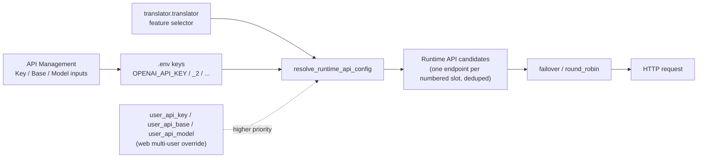

# API Credentials, Addresses, and Models

Use this page when you call remote APIs such as OpenAI, Gemini, or Sakura. It documents the three credential fields — key (Key), API address (Base), and model name (Model) — how they are stored in `.env`, how they are reused through numbered channels (`_2`, `_3`, …), and how the UI hides and masks them. This page does not cover provider tabs, feature selectors, slot rotation, connection tests, custom request parameters, or presets; those are documented in [Provider tabs](./provider-tabs.md), [Feature selectors](./feature-selectors.md), [Slots and rotation](./slots-and-rotation.md), [Connection tests and model list](./connection-tests-and-model-list.md), [Custom request parameters](./custom-request-parameters.md), and [Presets and persistence](./presets-and-persistence.md).

## Feature boundary

- Key/Base/Model are the three fields of an “API slot” card: Key stores the secret, Base stores the request URL, and Model stores the model name. Each maps to its own `.env` key.
- Only the provider group activated by the current feature selector shows credential cards. OpenAI/Gemini use Key/Base/Model; Sakura has only an address and a dictionary path, with no Key or Model.
- `.env` is the only credential persistence location on desktop. `config.json` and `config/config-example.json` do not store API keys. The `user_api_key`/`user_api_base`/`user_api_model` fields are configuration overrides for the multi-user web scenario, not inputs on this page.
- Numbered suffixes such as `_2`, `_3` are candidate channels within the same provider, not new translators; switching translators is still driven by `translator.translator`.

## UI operations

### Fill in credentials in API Management

1. Open “API Management” (`API Management`) in the left navigation. The page subtitle reads “Manage API keys and environment variables for each translator”.
2. Choose a tab: “Translation” (`Translation`), “OCR” (`OCR`), “Colorization” (`Colorization`), or “Render” (`Render`).
3. Each tab starts with a feature-selector row (label such as “Translator:”) and a “Test Current Tab” (`Test Current Tab`) button. Changing the selector refreshes the credential groups below; see [Feature selectors](./feature-selectors.md) for the exact boundary.
4. The active provider shows one or more “API slot” cards. Each card header has a two-digit badge on the left (for example `01`, `02`), the text “API slot” on the right, and a delete button (`Delete`) in the top-right corner. The number appears only in the badge, not in the title text.
5. Each card lists three fields in order: Key (for example “OpenAI API Key”), Model (for example “OpenAI Model”), and Base (for example “OpenAI API Base”).
6. Secret inputs start masked (password echo mode). The inline eye icon toggles between “Show key” (`Show key`) and “Hide key” (`Hide key`).
7. The Key row has a “Test” (`Test`) button on the right, the Model row has a “Get Models” (`Get Models`) button, and the Base row has no button.
8. Clicking “+ Add API slot” (`+ Add API slot`) creates the next numbered channel (`_2`) for the current provider; the button hides once the UI limit is reached.
9. Any edit updates the in-memory value and `os.environ` immediately, then is coalesced over 250 ms and atomically rewritten to `.env` on a background thread.

### Page, tab, and action copy

| Call key | English actual value | Simplified Chinese actual value |
| --- | --- | --- |
| `API Management` | API Management | API 管理 |
| `Manage API keys and environment variables for each translator` | Manage API keys and environment variables for each translator | 管理每个翻译器的 API 密钥和环境变量 |
| `Translation` | Translation | 翻译 |
| `OCR` | OCR | 文字识别 |
| `Colorization` | Colorization | 上色 |
| `Render` | Render | 渲染 |
| `label_translator` | Translator | 翻译器 |
| `label_ocr` | OCR Model | OCR模型 |
| `label_colorizer` | Colorization Model | 上色模型 |
| `label_renderer` | Renderer | 渲染器 |
| `Test Current Tab` | Test Current Tab | 测试当前页 |
| `Test` | Test | 测试 |
| `Get Models` | Get Models | 获取模型 |
| `Show Secret` | Show key | 显示密钥 |
| `Hide Secret` | Hide key | 隐藏密钥 |
| `Delete` | Delete | 删除 |
| `+ Add API slot` | + Add API slot | + 添加 API 通道 |
| `API slot {index}` | API slot | API 通道 |
| `placeholder_paste_key` | Paste your key | 粘贴你的密钥 |
| `placeholder_paste_token` | Paste your token | 粘贴你的令牌 |
| `API rotation strategy:` | Rotation strategy: | 轮询策略： |
| `No translation API required` | The current translator does not require an OpenAI/Gemini API key. | 当前翻译器不需要 OpenAI/Gemini API Key。 |
| `No OCR API required` | The current OCR does not require an OpenAI/Gemini API key. | 当前 OCR 不需要 OpenAI/Gemini API Key。 |
| `No colorization API required` | The current colorizer does not require an OpenAI/Gemini API key. | 当前上色器不需要 OpenAI/Gemini API Key。 |
| `No render API required` | The current renderer does not require an OpenAI/Gemini API key. | 当前渲染器不需要 OpenAI/Gemini API Key。 |

### Credential field copy

| Call key | English actual value | Simplified Chinese actual value |
| --- | --- | --- |
| `label_OPENAI_API_KEY` | OpenAI API Key | OpenAI API 密钥 |
| `label_OPENAI_MODEL` | OpenAI Model | OpenAI 模型 |
| `label_OPENAI_API_BASE` | OpenAI API Base | OpenAI API 地址 |
| `label_GEMINI_API_KEY` | Gemini API Key | Gemini API 密钥 |
| `label_GEMINI_MODEL` | Gemini Model | Gemini 模型 |
| `label_GEMINI_API_BASE` | Gemini API Base | Gemini API 地址 |
| `label_OCR_OPENAI_API_KEY` | OCR OpenAI API Key | 文字识别 OpenAI API 密钥 |
| `label_OCR_OPENAI_MODEL` | OCR OpenAI Model | 文字识别 OpenAI 模型 |
| `label_OCR_OPENAI_API_BASE` | OCR OpenAI API Base | 文字识别 OpenAI API 地址 |
| `label_OCR_GEMINI_API_KEY` | OCR Gemini API Key | 文字识别 Gemini API 密钥 |
| `label_OCR_GEMINI_MODEL` | OCR Gemini Model | 文字识别 Gemini 模型 |
| `label_OCR_GEMINI_API_BASE` | OCR Gemini API Base | 文字识别 Gemini API 地址 |
| `label_COLOR_OPENAI_API_KEY` | Colorization OpenAI API Key | 上色 OpenAI API 密钥 |
| `label_COLOR_OPENAI_MODEL` | Colorization OpenAI Model | 上色 OpenAI 模型 |
| `label_COLOR_OPENAI_API_BASE` | Colorization OpenAI API Base | 上色 OpenAI API 地址 |
| `label_COLOR_GEMINI_API_KEY` | Colorization Gemini API Key | 上色 Gemini API 密钥 |
| `label_COLOR_GEMINI_MODEL` | Colorization Gemini Model | 上色 Gemini 模型 |
| `label_COLOR_GEMINI_API_BASE` | Colorization Gemini API Base | 上色 Gemini API 地址 |
| `label_RENDER_OPENAI_API_KEY` | Rendering OpenAI API Key | 渲染 OpenAI API 密钥 |
| `label_RENDER_OPENAI_MODEL` | Rendering OpenAI Model | 渲染 OpenAI 模型 |
| `label_RENDER_OPENAI_API_BASE` | Rendering OpenAI API Base | 渲染 OpenAI API 地址 |
| `label_RENDER_GEMINI_API_KEY` | Rendering Gemini API Key | 渲染 Gemini API 密钥 |
| `label_RENDER_GEMINI_MODEL` | Rendering Gemini Model | 渲染 Gemini 模型 |
| `label_RENDER_GEMINI_API_BASE` | Rendering Gemini API Base | 渲染 Gemini API 地址 |
| `label_SAKURA_API_BASE` | SAKURA API Base | SAKURA API 地址 |
| `label_SAKURA_DICT_PATH` | SAKURA Dictionary Path | SAKURA 词典路径 |

## Field-to-.env mapping

Field labels come from the `labels` map in `app_logic.py` and are translated through i18n; the `.env` keys are the actual stored keys. At runtime, OCR/colorizer/renderer may fall back to the unscoped translator keys.

| UI field (actual copy) | `.env` key | Notes |
| --- | --- | --- |
| OpenAI API Key | `OPENAI_API_KEY` | Secret; masked input; placeholder “Paste your key” |
| OpenAI Model | `OPENAI_MODEL` | Model name; placeholder `gpt-4o`; “Get Models” can write it back |
| OpenAI API Base | `OPENAI_API_BASE` | API address; placeholder `https://api.openai.com/v1` |
| Gemini API Key | `GEMINI_API_KEY` | Secret; masked input |
| Gemini Model | `GEMINI_MODEL` | Model name; placeholder `gemini-1.5-flash-002` |
| Gemini API Base | `GEMINI_API_BASE` | API address; placeholder `https://generativelanguage.googleapis.com` |
| OCR OpenAI API Key | `OCR_OPENAI_API_KEY` | Secret; runtime fallback `OPENAI_API_KEY` |
| OCR OpenAI Model | `OCR_OPENAI_MODEL` | Model name; placeholder `gpt-4o` |
| OCR OpenAI API Base | `OCR_OPENAI_API_BASE` | API address; placeholder `https://api.openai.com/v1`; fallback `OPENAI_API_BASE` |
| OCR Gemini API Key | `OCR_GEMINI_API_KEY` | Secret; runtime fallback `GEMINI_API_KEY` |
| OCR Gemini Model | `OCR_GEMINI_MODEL` | Model name; placeholder `gemini-1.5-flash` |
| OCR Gemini API Base | `OCR_GEMINI_API_BASE` | API address; placeholder `https://generativelanguage.googleapis.com`; fallback `GEMINI_API_BASE` |
| Colorization OpenAI API Key | `COLOR_OPENAI_API_KEY` | Secret; runtime fallback `OPENAI_API_KEY` |
| Colorization OpenAI Model | `COLOR_OPENAI_MODEL` | Model name; placeholder `gpt-image-1` |
| Colorization OpenAI API Base | `COLOR_OPENAI_API_BASE` | API address; placeholder `https://api.openai.com/v1`; fallback `OPENAI_API_BASE` |
| Colorization Gemini API Key | `COLOR_GEMINI_API_KEY` | Secret; runtime fallback `GEMINI_API_KEY` |
| Colorization Gemini Model | `COLOR_GEMINI_MODEL` | Model name; placeholder `gemini-2.0-flash-preview-image-generation` |
| Colorization Gemini API Base | `COLOR_GEMINI_API_BASE` | API address; placeholder `https://generativelanguage.googleapis.com`; fallback `GEMINI_API_BASE` |
| Rendering OpenAI API Key | `RENDER_OPENAI_API_KEY` | Secret; runtime fallback `OPENAI_API_KEY` |
| Rendering OpenAI Model | `RENDER_OPENAI_MODEL` | Model name; placeholder `gpt-image-1` |
| Rendering OpenAI API Base | `RENDER_OPENAI_API_BASE` | API address; placeholder `https://api.openai.com/v1`; fallback `OPENAI_API_BASE` |
| Rendering Gemini API Key | `RENDER_GEMINI_API_KEY` | Secret; runtime fallback `GEMINI_API_KEY` |
| Rendering Gemini Model | `RENDER_GEMINI_MODEL` | Model name; placeholder `gemini-2.0-flash-preview-image-generation` |
| Rendering Gemini API Base | `RENDER_GEMINI_API_BASE` | API address; placeholder `https://generativelanguage.googleapis.com`; fallback `GEMINI_API_BASE` |
| SAKURA API Base | `SAKURA_API_BASE` | Address; placeholder `http://127.0.0.1:8080/v1`; no Key/Model |
| SAKURA Dictionary Path | `SAKURA_DICT_PATH` | Dictionary path; placeholder `./dict/sakura_dict.txt` |

Placeholders are input hints only, never written values; `_get_env_default_placeholder()` strips `OCR_`/`COLOR_`/`RENDER_` prefixes and reuses the base defaults. `keys.py` still defines legacy environment variables such as `BAIDU_*`, `YOUDAO_*`, `DEEPL_AUTH_KEY`, `CAIYUN_TOKEN`, `GROQ_*`, `DEEPSEEK_*`, and `TOGETHER_*`, but the current `API_GROUP_SPECS` and `Translator` enum only drive the OpenAI/Gemini/Sakura credential cards, so inactive keys are not shown in API Management.

## Numbered channel fields

The three fields of one provider can be numbered to form multiple candidate channels. Numbering starts at `1`, where `1` is the base key itself, and indexes `2` and above append `_<index>` to the key name:

- `OPENAI_API_KEY`, `OPENAI_MODEL`, and `OPENAI_API_BASE` form channel 1.
- `OPENAI_API_KEY_2`, `OPENAI_MODEL_2`, and `OPENAI_API_BASE_2` form channel 2, and so on.

- `get_indexed_env_key(base_key, index)` generates the numbered key: `index <= 1` returns the base key, otherwise it returns `f"{base_key}_{index}"`.
- `get_rotation_slot_count()` scans the current `.env` for all keys shaped like `<base>_<index>` and uses the highest index as the channel count; empty slots still render cards.
- The UI limit is `API_ROTATION_UI_MAX_SLOTS = min(10, MAX_ROTATION_SLOTS)`, where the engine-level `MAX_ROTATION_SLOTS` is `30`; once the limit is reached, the “+ Add API slot” button is hidden.
- “+ Add API slot” first writes empty values for the new index’s three keys, then refreshes. Deleting a card calls `_delete_api_rotation_slot()`, which shifts all later slots forward to keep numbering consecutive, then deletes the last slot’s keys.
- Each provider group also has a strategy key such as `OPENAI_API_ROTATION_STRATEGY` or `OCR_OPENAI_API_ROTATION_STRATEGY`, written by the “Rotation strategy:” dropdown; how the strategy orders requests is covered in [Slots and rotation](./slots-and-rotation.md).
- At runtime the resolver reads Key/Base/Model for indexes 1..channel count and drops duplicate endpoints whose `(api_key, base_url, model)` tuple is identical.

## Hiding and masking

- `_is_secret_env_key()` treats any key containing `API_KEY`, `AUTH_KEY`, or `TOKEN` as secret, for example `OPENAI_API_KEY`, `DEEPL_AUTH_KEY`, and `CAIYUN_TOKEN`.
- Secret fields use password echo mode (`QLineEdit.EchoMode.Password`). The inline eye icon toggles between “Show key” (`Show key`) and “Hide key” (`Hide key`); the tooltip text comes from the `Show Secret` / `Hide Secret` locale keys.
- The key and token placeholders are “Paste your key” and “Paste your token” respectively and never contain real values.
- `.env` is a plain-text local file located next to the packaged executable or at the project root in development. Never commit, export, or screenshot real keys. Presets may store API environment variables, but exported config JSON explicitly excludes API keys; see [Presets and persistence](./presets-and-persistence.md).

## Runtime behavior

On startup, `ConfigService` reads `.env` into memory and loads it into `os.environ` (`load_app_dotenv(override=True)`). Every edit updates the in-memory value and `os.environ` immediately, is coalesced by a `QTimer` over 250 ms, and is then atomically rewritten to `.env` as `KEY="value"` lines on the “config-writer” background thread. Translators, OCR, colorizers, and renderers call `resolve_runtime_api_config()` in `parse_args()`, read environment variables per numbered slot, build candidate endpoints, and hand them to the `failover`/`round_robin` strategy for the actual HTTP request.

For OpenAI-compatible local endpoints (`localhost`, private IPs, `.local`, etc.), an empty key is normalized to the `ollama` placeholder so local services such as Ollama work without a key; non-local endpoints still require a real key.

## Dependencies and conflicts

- The feature selector decides which provider group is shown; changing the translator inside API Management writes the same `translator.translator` key and refreshes the required credential groups.
- With hybrid OCR (`ocr.use_hybrid_ocr`) enabled, the OpenAI/Gemini groups for the primary and secondary OCR may be shown at the same time.
- The Sakura group has only an address and a dictionary path; with no Key/Model there is no “Get Models” button, but “Test” still runs against the address.
- In the web scenario, `translator.user_api_key`/`user_api_base`/`user_api_model` and server-side `_runtime_api_overrides` take priority over `.env`; desktop mode has none of these overrides by default.
- The fields on this page are unrelated to custom request parameters (`config/custom_api_params.json`); the model name becomes the `model` field in the request body, and custom parameters match presets by model name.
- Inactive legacy environment variables (DeepL, Caiyun, Baidu, Youdao, Groq, DeepSeek, Together, etc.) are not shown in the UI, but their read logic remains in the code.

## Related files and formats

| File/format | Actual role on this page | Manual-edit and compatibility note |
| --- | --- | --- |
| `.env` | The only credential persistence location on desktop | `KEY="value"` format; contains real secrets — never commit or display |
| `config/config-example.json` | Release config example | Contains no API keys; `translator.translator` defaults to `openai` |
| `config/config.json` | User settings persistence | Does not store credentials; import/export preserves sensitive information |
| `manga_translator/translators/keys.py` | Legacy env defaults | Some keys have no API Management card today |
| `desktop_qt_ui/services/preset_service.py` | Presets may store API env vars | Applying a preset replaces `.env` wholesale; see the presets page |

## Source evidence {#source-evidence}

| Layer | File | What was checked |
| --- | --- | --- |
| UI controls | `desktop_qt_ui/ui/main_page/env_management.py` | Field creation, masking and eye toggle, Test/Get Models, numbered-slot add/delete compaction |
| UI groups and tabs | `desktop_qt_ui/ui/main_page/dynamic_settings.py`, `desktop_qt_ui/ui/main_page/pages/env_page.py` | `API_GROUP_SPECS`, `SIMPLE_API_GROUP_SPECS`, four tabs and subtitle |
| UI/i18n | `desktop_qt_ui/app_logic.py`, `desktop_qt_ui/locales/en_US.json`, `zh_CN.json` | `labels` map, keys, and actual bilingual display values |
| Persistence | `desktop_qt_ui/services/config_service.py`, `manga_translator/utils/dotenv_utils.py` | `.env` path, 250 ms coalescing, atomic rewrite |
| Candidate resolution | `manga_translator/runtime_api_resolver.py`, `manga_translator/api_key_rotation.py` | Numbered reads, dedupe, strategy keys, slot limits |
| Final consumers | `manga_translator/translators/openai.py`, `gemini.py`, `ocr/model_api_ocr.py`, `colorization/model_api_colorizer.py`, `rendering/model_api_renderer.py` | Default base/model, fallback keys, local empty-key placeholder |

## Verification {#verification}

| Check | Status | Notes |
| --- | --- | --- |
| BLUEPRINT, PAGE_GUIDELINES, TODO | Complete | Read section 1.3 and item 5.6 and followed the page contract |
| UI layout and calls | Complete | Statically checked env_page, dynamic_settings, and env_management |
| `en_US` / `zh_CN` actual locales | Complete | The table records key, actual English, and actual Simplified Chinese values |
| Field-to-`.env` mapping | Complete | Checked `API_GROUP_SPECS`, `runtime_api_resolver.py`, and `keys.py` |
| Sanitized runtime verification | Deferred | No real `.env`, user config, API key/token, username, user image, or private prompt was read |
| VitePress | Deferred | Coordinator should run `npm run docs:build --prefix doc/wiki` plus mirror/source checks before merge |