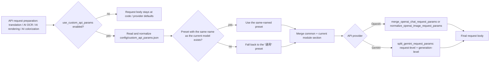
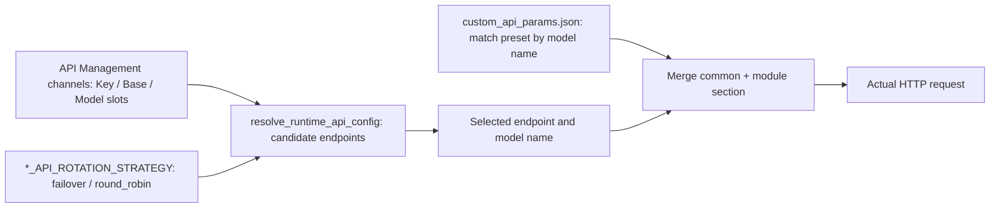

# Custom Request Parameters

When you need to attach extra request-body fields such as `temperature`, `top_p`, or `max_tokens` to translation, AI OCR, AI rendering, or AI colorization requests, this page documents the file structure of `config/custom_api_params.json`, model-preset matching, how module sections merge into OpenAI/Gemini request bodies, and the boundary with `*_API_ROTATION_STRATEGY`. It does not cover connection credentials, model selection, or API channel rotation; see [API Credentials, Addresses, and Models](./credentials-addresses-models.md) and [Slots and rotation](./slots-and-rotation.md). The master switch lives in [Settings → General](../settings/general-and-app.md).

## Feature boundary

- `config/custom_api_params.json` is the extra-request-parameters file: it only appends fields to OpenAI/Gemini request bodies. It does not store connection credentials (Key/Base/Model live in `.env`), does not select a model, and does not participate in `*_API_ROTATION_STRATEGY` candidate rotation.
- The top-level boolean key `use_custom_api_params` decides whether the file is read; a legacy value stored at `translator.use_custom_api_params` is migrated to the top level on load.
- The file root is a “model preset” object. The default preset is literally named “通用”; that string is a stored value and is not translated with the UI language.
- Every preset contains exactly five sections: `common`, `translator`, `ocr`, `colorizer`, and `render`. At runtime only `common` plus the current API module's section are merged; sections of other modules never leak into the request.
- Presets are matched by the model name actually used by the request: a top-level preset with the same name wins; otherwise the “通用” preset is used as the fallback.

## UI operations

### Open the custom-parameter editor {#open-editor}

1. Open “Settings” (`Settings`) and select the “General” (`General`) group.
2. Find the “Use Custom API Params” (`Use Custom API Params`) switch; it binds the top-level configuration key `use_custom_api_params`.
3. Click the inline “Edit” (`Edit`) button to open the “Edit Custom API Params” (`Edit Custom API Params`) dialog; if the file is missing, the backend creates the default file first.
4. The “Model Preset” (`Model Preset`) combo at the top selects the preset being edited; “通用” is selected by default. Use “Add Preset” (`Add Preset`), “Rename” (`Rename`), or “Delete” (`Delete`) for presets other than “通用”.
5. On the “Grouped API Params” (`Grouped API Params`) tab, edit field rows per section tab: Key (parameter name), Type, Value, and a Delete button. The type combo is fixed to String (`String`), Number (`Number`), Boolean (`Boolean`), Null (`Null`), and JSON.
6. Or switch to the “Raw Edit” (`Raw Edit`) tab to edit the whole JSON file directly.
7. Click “Save” (`Save`) to write the file back; the status bar shows “Saved successfully” (`Saved successfully`). JSON syntax or structure errors show the corresponding message and nothing is written.

### Editor copy {#editor-copy}

| UI call key | English actual value | Simplified Chinese actual value |
| --- | --- | --- |
| `Settings` | Settings | 设置 |
| `General` | General | 通用 |
| `label_use_custom_api_params` | Use Custom API Params | 使用自定义API参数 |
| `desc_use_custom_api_params` | Match a parameter preset by the current model and fall back to General; each API module reads only common and its own section. Applies to translation, AI OCR, AI rendering, and AI colorization. | 按当前模型匹配参数预设，找不到时回退“通用”；每个 API 模块只读取 common 和自身分组。适用于翻译、AI 识别、AI 渲染、AI 上色。 |
| `Edit` | Edit | 编辑 |
| `Edit Custom API Params` | Edit Custom API Params | 编辑自定义 API 参数 |
| `At runtime, each API module selects the preset named after its current model and falls back to General. Only common and that module's section are merged.` | At runtime, each API module selects the preset named after its current model and falls back to General. Only common and that module's section are merged. | 运行时，各 API 模块按当前模型名自动选择同名预设；找不到时回退“通用”。只合并 common 与当前模块分组。 |
| `Model Preset` | Model Preset | 模型预设 |
| `Add Preset` | Add Preset | 添加预设 |
| `Rename` | Rename | 重命名 |
| `Delete` | Delete | 删除 |
| `Grouped API Params` | Grouped API Params | 分类 API 参数 |
| `Each preset contains common, translator, OCR, colorizer, and render sections. Parameters are never sent across modules.` | Each preset contains common, translator, OCR, colorizer, and render sections. Parameters are never sent across modules. | 每个预设固定包含 common、translator、ocr、colorizer、render，模块之间不会互相发送参数。 |
| `Raw Edit` | Raw Edit | 源码编辑 |
| `label_translator` | Translator | 翻译器 |
| `label_ocr` | OCR Model | OCR模型 |
| `label_colorizer` | Colorization Model | 上色模型 |
| `label_renderer` | Renderer | 渲染器 |
| `Key` | Key | 参数名 |
| `Type` | Type | 类型 |
| `Value` | Value | 值 |
| `String` | String | 字符串 |
| `Number` | Number | 数值 |
| `Boolean` | Boolean | 布尔值 |
| `Null` | Null | 空值 |
| `JSON` (hard-coded, not through i18n) | JSON | JSON |
| `Add Row` | Add Row | 添加行 |
| `Refresh` | Refresh | 刷新 |
| `Cancel` | Cancel | 取消 |
| `Save` | Save | 保存 |
| `Loaded successfully` | Loaded successfully | 加载成功 |
| `Saved successfully` | Saved successfully | 保存成功 |
| `Load failed` | Load failed | 加载失败 |
| `Save failed` | Save failed | 保存失败 |
| `JSON format error` | JSON format error | JSON 格式错误 |
| `JSON root must be an object` | JSON root must be an object | JSON 顶层必须是对象 |
| `Duplicate parameter name: {name}` | Duplicate parameter name: {name} | 参数名重复：{name} |
| `Number value is empty` | Number value is empty | 数值不能为空 |
| `Number value is invalid` | Number value is invalid | 数值无效 |
| `JSON value is empty` | JSON value is empty | JSON 值不能为空 |
| `Parameter name cannot be empty` | Parameter name cannot be empty | 参数名不能为空 |
| `Enter preset name:` | Enter preset name: | 输入预设名称： |
| `OK` | OK | 确定 |
| `Warning` | Warning | 警告 |
| `Preset name cannot be empty` | Preset name cannot be empty | 预设名称不能为空 |
| `Preset '{name}' already exists` | Preset '{name}' already exists | 预设“{name}”已存在 |
| `Rename Preset` | Rename Preset | 重命名预设 |
| `Confirm` | Confirm | 确认 |
| `Are you sure you want to delete preset '{name}'?` | Are you sure you want to delete preset '{name}'? | 确定要删除预设 '{name}' 吗？ |

The section-tab titles follow `CUSTOM_API_PARAM_SECTIONS` order: `common` shows “General” (`General`), `translator` shows “Translator” (`Translator`), `ocr` shows “OCR Model” (`OCR Model`), `colorizer` shows “Colorization Model” (`Colorization Model`), and `render` shows “Renderer” (`Renderer`). The input placeholders (`temperature`, `gpt-4o-mini`, `0.2`, `{"type": "json"}`) are hard-coded examples, not options.

## File structure and defaults

### File location and creation {#file-location}

- Path: `get_custom_api_params_path()` returns `get_config_dir()/custom_api_params.json`, i.e. the `config/` directory next to the executable (in the development repository, `config/custom_api_params.json`).
- At desktop startup, `ConfigService` and the runtime-file factory call `ensure_custom_api_params_file()`: the file is created with the code defaults when missing, rebuilt when its content matches the legacy default MD5, and legacy “unwrapped” payloads are migrated into the “通用” preset. Existing user edits are never overwritten.
- The editor “Save” (`Save`) writes the file back as UTF-8 with 2-space indentation; the backend creates default files via a temporary file plus atomic replace.

### Default structure and sections {#default-structure}

The file root is “preset name → preset object”. The default content generated by the code when the file is missing (sanitized example, no secrets):

```json
{
  "通用": {
    "common": {},
    "translator": {
      "temperature": 0.3,
      "top_p": 0.95
    },
    "ocr": {
      "temperature": 0.0
    },
    "colorizer": {},
    "render": {}
  }
}
```

| Section | Merged into which module request | Code default content | Notes |
| --- | --- | --- | --- |
| `common` | All modules | `{}` | Copied first for every preset |
| `translator` | Translation | `{"temperature": 0.3, "top_p": 0.95}` | Entered into translation requests only |
| `ocr` | AI OCR | `{"temperature": 0.0}` | Entered into AI OCR requests only |
| `colorizer` | AI colorization | `{}` | Entered into AI colorization requests only |
| `render` | AI rendering | `{}` | Entered into AI rendering requests only |

Normalization keeps only those five sections; any other top-level section name is never read by any module and never reaches a request body. Field names and values are decided by each API — for example `temperature`, `top_p`, `max_tokens`, `frequency_penalty`, and `response_format` are common for OpenAI chat, while `top_p`, `top_k`, `max_output_tokens`, `safety_settings`, and `response_modalities` are common for Gemini. Keys outside these lists follow the “as-is merge” or “camel-case conversion” rules below.

## Parameters and options

#### `use_custom_api_params` — 使用自定义API参数 / Use Custom API Params {#use-custom-api-params}

- Control: toggle plus an “Edit” (`Edit`) file-editor button.
- Location: Settings → General; UI call key `label_use_custom_api_params`, description key `desc_use_custom_api_params`.
- Stored value: top-level boolean key `use_custom_api_params`; a legacy value written at `translator.use_custom_api_params` is migrated to the top level on load.
- Options: `true` / `false`; there is no enum dropdown.
- Defaults: core `manga_translator/config.py#Config.use_custom_api_params` is `false`; Qt model `desktop_qt_ui/core/config_models.py#AppSettings.use_custom_api_params` is `false`; release `config/config-example.json` is `true`.
- Effective stage: API request construction for translation, AI OCR, AI rendering, and AI colorization.
- Mechanism: when enabled, each consumer calls `resolve_custom_api_params()` on every request: it selects a preset by model name, merges `common` with the current module section, and hands the result to the OpenAI/Gemini merge helpers before sending. When disabled, it returns empty parameters and the request body stays at the code/provider defaults.
- Dependencies/conflicts: requires `config/custom_api_params.json` to be parseable and structurally valid; it does not store credentials, select a model, or participate in channel rotation. In web mode the key is server-side and `SERVER_HIDDEN_CONFIG_KEYS` hides it from user-facing config endpoints.
- Performance/API cost: extra fields change sampling or request-body size; for example a higher `temperature` may raise retry probability and larger image-output configuration increases token and bandwidth cost.
- Related files and debug artifacts: `config/custom_api_params.json`, `config/config-example.json`; logs contain a sanitized line such as “已启用自定义API参数[分组]”.
- Diagram: required for preset matching and request-body merging, see [Preset matching and merging](#preset-resolution).
- Source evidence: definitions in `manga_translator/config.py`, `desktop_qt_ui/core/config_models.py`; UI in `desktop_qt_ui/ui/main_page/dynamic_settings.py`, `env_management.py`, `ui/secondary_pages/custom_api_params_editor.py`; resolution in `manga_translator/custom_api_params.py`; consumers in `manga_translator/translators/openai.py`, `gemini.py`, `ocr/model_api_ocr.py`, `colorization/model_api_colorizer.py`, `rendering/model_api_renderer.py`.
- Verification status: static source/i18n check complete; sanitized runtime verification deferred.

## Runtime behavior

### Preset matching and merging {#preset-resolution}

Every API request resolves custom parameters in the following order:

1. `is_custom_api_params_enabled(config)` reads the top-level `use_custom_api_params`, falling back to the legacy `translator.use_custom_api_params`; when disabled it returns empty parameters immediately.
2. `load_custom_api_params_file()` reads and normalizes the file; invalid JSON logs an error and returns empty presets.
3. `resolve_custom_api_params_for_model()` takes the model name used by the request (leading/trailing whitespace stripped); a top-level preset with the same name is selected, otherwise the “通用” preset is used.
4. Merge = the preset's `common` + the current module section; `section` must be `translator` / `ocr` / `colorizer` / `render`, and any other value raises `ValueError`.
5. The consumer calls the provider-specific merge helper and writes the result into the final request body.



The model name comes from the API-management channels or translator defaults, not from this file; the same configuration may therefore match different presets on different models.

### OpenAI request-body merging {#openai-merge}

| Consumer | Merge helper | Base request fields | Custom-parameter behavior |
| --- | --- | --- | --- |
| Translation (`openai.py`, `openai_hq.py`) | `merge_openai_chat_request_params` | `model`, `messages`, optional `max_tokens` | Every key except `model`, `messages`, and `stream` overrides or appends; custom `max_tokens` overrides the code value; `stream` is controlled by the streaming switch and cannot be overridden |
| AI OCR (`ocr/model_api_ocr.py`) | `merge_openai_chat_request_params` | `model`, `messages` | Same as above |
| AI rendering / AI colorization (`rendering/model_api_renderer.py`, `colorization/model_api_colorizer.py`) | `normalize_openai_image_request_params` | `model`, `prompt`, image, etc. assembled by the image interface | `extra_body` is flattened to the top level (existing top-level keys win); `model`, `prompt`, `image`, `images`, `messages`, and `input` are dropped |

Example: translation base parameters are `model` + `messages` (+ optional `max_tokens`); with `temperature: 0.7` in the preset, the final request body is `{"model": ..., "messages": ..., "temperature": 0.7}`.

### Gemini request-body merging {#gemini-merge}

`split_gemini_request_params` splits custom parameters into request-level and generation-level:

- Request-level keys (mapped to REST request fields): `safety_settings` → `safetySettings`, `system_instruction` → `systemInstruction`, `tool_config` → `toolConfig`, `cached_content` → `cachedContent`, `automatic_function_calling` → `automaticFunctionCalling`, `tools`.
- Generation-level keys (mapped to `generationConfig`): `top_p` → `topP`, `top_k` → `topK`, `max_output_tokens` → `maxOutputTokens`, `stop_sequences` → `stopSequences`, `candidate_count` → `candidateCount`, `response_modalities` → `responseModalities`, `response_mime_type` → `responseMimeType`, `response_schema` → `responseSchema`, `presence_penalty` → `presencePenalty`, `frequency_penalty` → `frequencyPenalty`, `thinking_budget` → `thinkingBudget`; other snake_case keys are camel-cased.
- `model` and `contents` are always skipped; nested `generationConfig` / `generation_config` objects are unwrapped into the generation level.
- Translation (SDK path, `gemini.py`, `gemini_hq.py`): `apply_gemini_sdk_generation_params` writes only generation-level fields into `GenerateContentConfig` (attribute names converted back to snake_case); request-level fields are not injected through the SDK because the code sets `safety_settings` and other base config itself.
- AI OCR / rendering / colorization (REST path): request-level overrides are written into the request kwargs and generation-level overrides into `generationConfig`.

### Priority and override rules {#priority-rules}

- A disabled switch wins over everything: `use_custom_api_params=false` means the file is never read.
- A same-named preset wins over “通用”: the preset is only used on an exact model-name match.
- Only `common` + the current section are merged: other module sections never participate, and duplicate field names inside one preset are rejected.
- Reserved fields cannot be overridden: OpenAI `model`, `messages`, `stream`; Gemini `model`, `contents`; image requests `model`, `prompt`, `image`, `images`, `messages`, `input`.
- Other fields override code defaults: for example Gemini code defaults to `top_p=0.95` and `top_k=64`, so a preset `top_p` overrides it; an OpenAI translation preset `max_tokens` overrides the base `max_tokens`.
- When `extra_body` is flattened for OpenAI image requests, existing top-level keys win: a top-level custom key takes precedence over the same key inside `extra_body`.

## Boundary with API rotation strategy {#rotation-boundary}

| Configuration | Role | Notes |
| --- | --- | --- |
| Key/Base/Model and numbered channels in `.env` | Store connection credentials and endpoints | See [API Credentials, Addresses, and Models](./credentials-addresses-models.md) |
| `*_API_ROTATION_STRATEGY` (for example `OPENAI_API_ROTATION_STRATEGY`) | `failover` / `round_robin` among candidate endpoints | Only decides “which endpoint”, never changes request-body fields |
| `config/custom_api_params.json` | Extra request-body parameters | Does not handle connection credentials, model selection, or API channel rotation |



Custom parameters match a preset by the model name actually used in the current round; the model name itself comes from the endpoint selected by the channels and rotation, not from this file. Rotation changes the order and selection of candidate endpoints, not request-body fields; channel retries, cooldown, unavailability, and recovery never alter the already-merged custom parameters.

## Dependencies and conflicts

- Preset matching depends on the model name used by the request; the name comes from the API-management channels or translator defaults, so the same file may select different presets on different models.
- Custom parameters are unavailable on JSON syntax or structural errors: parsing failures are logged and empty presets are returned, and translation continues with default parameters.
- Ordinary retries, quality retries, and API channel rotation never modify the already-merged custom parameters; every request re-resolves, so the preset may change when the model name changes with rotation.
- Do not put API keys, tokens, or private prompts into this file: the values are sent verbatim into request bodies and may appear in logs/debug artifacts.
- The file is independent of context-page count, prompt files, RPM, and the streaming switch; those control different dimensions of a request, see the translator and settings pages.
- In web mode `use_custom_api_params` is a server-side key and is not shown in the web user configuration interface.

## Related files and formats

| File/format | Actual role on this page | Manual-edit and compatibility note |
| --- | --- | --- |
| `config/custom_api_params.json` | The only persistence file for extra request parameters | UTF-8 JSON with a preset object at the root; use sanitized examples only |
| `config/config-example.json` | Release default `use_custom_api_params: true` | Contains no secrets; importing overrides in-memory settings |
| `config/config.json` | User-settings persistence | Stores the switch value, not this file's content |
| `desktop_qt_ui/locales/en_US.json`, `zh_CN.json` | Settings and editor copy | Keys and actual display values are listed in the tables above |

## Mermaid data-flow limits

The diagrams describe the source-confirmed preset resolution, request-body merging, and rotation boundary; they do not claim that every run necessarily carries custom parameters or makes a network request. `use_custom_api_params=false`, missing/invalid files, missing same-named presets, and non-OpenAI/Gemini modules take their documented bypasses. No runtime screenshot or private task artifact has been fabricated.

## Source evidence {#source-evidence}

| Layer | File | What was checked |
| --- | --- | --- |
| Settings UI | `desktop_qt_ui/ui/main_page/dynamic_settings.py`, `desktop_qt_ui/ui/main_page/settings_tab_layout.json` | General group, switch, and Edit button |
| Editor UI | `desktop_qt_ui/ui/secondary_pages/custom_api_params_editor.py`, `desktop_qt_ui/ui/main_page/env_management.py`, `view.py` | Preset/section/row editing, Raw edit, save and error states |
| UI/i18n | `desktop_qt_ui/app_logic.py`, `desktop_qt_ui/locales/en_US.json`, `zh_CN.json` | Key mapping and actual bilingual display values |
| Config models | `desktop_qt_ui/core/config_models.py`, `manga_translator/config.py` | Qt/release/core defaults and legacy-key migration |
| File resolution | `manga_translator/custom_api_params.py`, `manga_translator/runtime_files.py` | Default content, creation/migration/normalization, preset matching |
| Request merging | `manga_translator/api_request_params.py` | OpenAI/Gemini merge rules and reserved fields |
| Final consumers | `manga_translator/translators/openai.py`, `gemini.py`, `openai_hq.py`, `gemini_hq.py`, `ocr/model_api_ocr.py`, `colorization/model_api_colorizer.py`, `rendering/model_api_renderer.py` | Per-section resolution and merge for each module |
| Rotation boundary | `manga_translator/runtime_api_resolver.py`, `manga_translator/api_key_rotation.py` | Strategy keys, candidate endpoints, and the boundary with custom parameters |

## Verification {#verification}

| Check | Status | Notes |
| --- | --- | --- |
| BLUEPRINT, PAGE_GUIDELINES, TODO | Complete | Read section 1.3 and item 5.6 and followed the page contract |
| UI layout and calls | Complete | Statically checked dynamic_settings, env_management, and custom_api_params_editor |
| `en_US` / `zh_CN` actual locales | Complete | The table records key, actual English, and actual Simplified Chinese values |
| Preset resolution and request merging | Complete | Statically checked custom_api_params.py, api_request_params.py, and every consumer |
| Sanitized runtime verification | Deferred | No real `.env`, user config, API key/token, username, user image, or private prompt was read |
| VitePress | Deferred | Coordinator should run `npm run docs:build --prefix doc/wiki` plus mirror/source checks before merge |