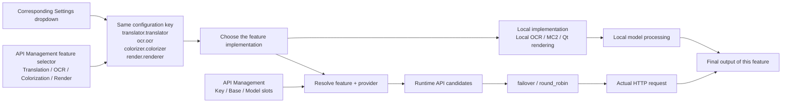
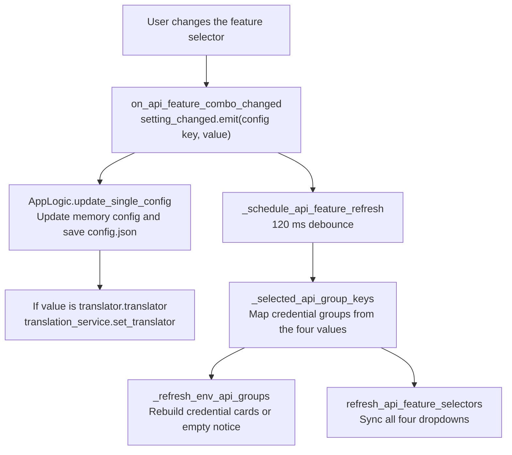

# Feature Selectors

Use the feature selector at the top of each API Management tab when you need to switch the translation, OCR, colorization, or rendering implementation without leaving the page. These selectors are not a separate "API configuration": they write directly to the same configuration key as the corresponding feature, so changing "Translator" here from OpenAI to Gemini really switches the translator and immediately refreshes the credential groups required by the current tab.

This page documents which configuration key each of the four feature selectors writes, how a change refreshes the credential groups, and how a selection actually changes the feature implementation. Detailed differences between translation implementations are in [Translator selection and target languages](../translator/selection-and-languages.md); candidate slots and rotation strategies are in [Slots and rotation](./slots-and-rotation.md); credential-field editing and connection tests are in [Credentials, addresses, and models](./credentials-addresses-models.md) and [Connection tests and model list](./connection-tests-and-model-list.md) respectively.

## Feature boundary {#feature-boundary}

- The "Translation", "OCR", "Colorization", and "Render" tabs in API Management each have a feature selector at the top, bound to `translator.translator`, `ocr.ocr`, `colorizer.colorizer`, and `render.renderer` respectively.
- Difference from "translator selection": the "Translator" dropdown on the Settings "Translation" tab and the translator dropdown at the top of the API Management translation tab write the same `translator.translator` key and share the same options and display mapping. Changing "Translator" in API Management therefore really changes the translation implementation and refreshes the required credential groups; it does not only change connection information.
- Difference from "API candidate slot rotation": Key/Base/Model slots with `failover`/`round_robin` only pick request endpoints inside the already selected implementation, handling retries, cooldown, unavailability, and recovery; they never change the implementation itself.
- `translator_chain` feeds one translator's output into the next translator; it is unrelated to these four selectors.

## UI operations {#ui-operations}

### Switch feature implementations in API Management {#api-tab-selectors}

1. Open "API Management" (`API Management`). The page header shows the title and description, followed by four tabs: "Translation", "OCR", "Colorization", and "Render".
2. Each tab has one feature-selector row at the top: a label on the left, a dropdown in the middle, and a "Test Current Tab" (`Test Current Tab`) button on the right.
3. Choose a new value in the dropdown. The selection immediately writes the corresponding configuration key and saves it to `config/config.json`; after a debounce of about 120 ms the tab's credential groups are refreshed and all four selectors are re-synced.
4. When you select an implementation that needs an API (for example OpenAI/Gemini translation, AI OCR, AI colorization, or AI rendering), the tab shows the matching Key/Base/Model slots; local or no-API implementations show a notice card such as "The current translator does not require an OpenAI/Gemini API key."
5. Click "Test Current Tab" to run connection tests against every configured candidate slot on that tab; the test target is derived from the current selector value and the environment-variable prefix. See [Connection tests and model list](./connection-tests-and-model-list.md) for the full flow.

### UI invocation and actual labels {#ui-i18n}

| UI invocation key | English actual value | Simplified Chinese actual value |
| --- | --- | --- |
| `API Management` | API Management | API 管理 |
| `Manage API keys and environment variables for each translator` | Manage API keys and environment variables for each translator | 管理每个翻译器的 API 密钥和环境变量 |
| `Translation` | Translation | 翻译 |
| `OCR` | OCR | 文字识别 |
| `Colorization` | Colorization | 上色 |
| `Render` | Render | 渲染 |
| `label_translator` | Translator | 翻译器 |
| `label_ocr` | OCR Model | OCR模型 |
| `label_colorizer` | Colorization Model | 上色模型 |
| `label_renderer` | Renderer | 渲染器 |
| `Test Current Tab` | Test Current Tab | 测试当前页 |
| `No translation API required` | The current translator does not require an OpenAI/Gemini API key. | 当前翻译器不需要 OpenAI/Gemini API Key。 |
| `No OCR API required` | The current OCR does not require an OpenAI/Gemini API key. | 当前 OCR 不需要 OpenAI/Gemini API Key。 |
| `No colorization API required` | The current colorizer does not require an OpenAI/Gemini API key. | 当前上色器不需要 OpenAI/Gemini API Key。 |
| `No render API required` | The current renderer does not require an OpenAI/Gemini API key. | 当前渲染器不需要 OpenAI/Gemini API Key。 |
| `translator_openai_hq` | OpenAI High Quality | OpenAI高质量翻译 |
| `translator_gemini_hq` | Gemini High Quality | Gemini高质量翻译 |
| `translator_none` | None | 无 |
| `translator_original` | Original | 原文 |

`OpenAI`, `Google Gemini`, `Sakura`, `Manga Colorization v2`, `OpenAI Colorizer`, `Gemini Colorizer`, `OpenAI Renderer`, `Gemini Renderer`, `Default`, and OCR engine names such as `openai_ocr` are hard-coded display values in `app_logic.py` or raw enum values, not locale keys; the OCR dropdown has no display mapping and shows stored values directly.

## Enumerations and complete options {#option-matrix}

Each dropdown takes its options from `AppLogic.get_options_for_key()` and its display values from `get_display_mapping()`; API Management and Settings share the same source. The "Activated credential group" column below refers to the `API_GROUP_SPECS` groups in `dynamic_settings.py`.

### Translator (`translator.translator`)

| Stored value | English | Simplified Chinese | Activated credential group | Implementation |
| --- | --- | --- | --- | --- |
| `openai` | OpenAI | OpenAI | `translator_openai` | OpenAI translator |
| `openai_hq` | OpenAI High Quality | OpenAI高质量翻译 | `translator_openai` | OpenAI high-quality translator |
| `gemini` | Google Gemini | Google Gemini | `translator_gemini` | Gemini translator |
| `gemini_hq` | Gemini High Quality | Gemini高质量翻译 | `translator_gemini` | Gemini high-quality translator |
| `sakura` | Sakura | Sakura | `translator_sakura` | Sakura translator |
| `none` | None | 无 | none | No translation |
| `original` | Original | 原文 | none | Keep the original text |

### OCR model (`ocr.ocr`)

| Stored value | English | Simplified Chinese | Activated credential group | Implementation |
| --- | --- | --- | --- | --- |
| `32px` | 32px | 32px | none | Local 32px OCR |
| `48px` | 48px | 48px | none | Local 48px OCR |
| `48px_ctc` | 48px_ctc | 48px_ctc | none | Local 48px CTC OCR |
| `mocr` | mocr | mocr | none | Manga OCR |
| `paddleocr` | paddleocr | paddleocr | none | PaddleOCR |
| `paddleocr_korean` | paddleocr_korean | paddleocr_korean | none | PaddleOCR Korean |
| `paddleocr_latin` | paddleocr_latin | paddleocr_latin | none | PaddleOCR Latin |
| `paddleocr_thai` | paddleocr_thai | paddleocr_thai | none | PaddleOCR Thai |
| `paddleocr_vl` | paddleocr_vl | paddleocr_vl | none | PaddleOCR-VL |
| `openai_ocr` | openai_ocr | openai_ocr | `ocr_openai` | OpenAI vision OCR |
| `gemini_ocr` | gemini_ocr | gemini_ocr | `ocr_gemini` | Gemini vision OCR |

### Colorization model (`colorizer.colorizer`)

| Stored value | English | Simplified Chinese | Activated credential group | Implementation |
| --- | --- | --- | --- | --- |
| `none` | None | 无 | none | No colorization |
| `mc2` | Manga Colorization v2 | Manga Colorization v2 | none | Local MC2 colorizer |
| `openai_colorizer` | OpenAI Colorizer | OpenAI Colorizer | `color_openai` | OpenAI colorizer |
| `gemini_colorizer` | Gemini Colorizer | Gemini Colorizer | `color_gemini` | Gemini colorizer |

### Renderer (`render.renderer`)

| Stored value | English | Simplified Chinese | Activated credential group | Implementation |
| --- | --- | --- | --- | --- |
| `default` | Default | Default | none | Qt offscreen renderer |
| `openai_renderer` | OpenAI Renderer | OpenAI Renderer | `render_openai` | OpenAI rendering |
| `gemini_renderer` | Gemini Renderer | Gemini Renderer | `render_gemini` | Gemini rendering |
| `none` | None | 无 | none | No rendering; output the base image |

## Feature-selector parameters {#parameters}

#### `translator.translator` — Translator / 翻译器 {#translator-translator}

- Control: dropdown.
- Location: top of the API Management translation tab; first row of Settings → Translation; the editor property panel reuses the same display mapping.
- Stored value: `openai`, `openai_hq`, `gemini`, `gemini_hq`, `sakura`, `none`, or `original`.
- Options: identical to the core `Translator` enum; see the [option matrix](#option-matrix).
- Defaults: core `manga_translator/config.py#TranslatorConfig.translator` is `openai_hq`; Qt model `desktop_qt_ui/core/config_models.py#TranslatorSettings.translator` is `openai_hq`; release `config/config-example.json` is `openai`.
- Effective stages: translation dispatch (including batch translation); HQ variants additionally load a high-quality prompt.
- Mechanism: the selector writes the new value to `translator.translator` and saves it; `AppLogic.update_single_config()` additionally calls `translation_service.set_translator(value)` for `translator.translator`, updating the desktop translation service immediately. At runtime the `TRANSLATORS` registry in `manga_translator/translators/__init__.py` maps the value to `OpenAITranslator`, `OpenAIHighQualityTranslator`, `GeminiTranslator`, `GeminiHighQualityTranslator`, `SakuraTranslator`, `NoneTranslator`, or `OriginalTranslator`.
- Dependencies/conflicts: shares the key with the Settings translator dropdown, so the last change wins; `openai`/`openai_hq` share the OpenAI credential group, `gemini`/`gemini_hq` share the Gemini group, `sakura` uses `SAKURA_API_BASE` and `SAKURA_DICT_PATH`, and `none`/`original` require no API credentials.
- Related files: `config/config.json` (persistence), `.env` (credential groups), `manga_translator/translators/` (implementations).
- Diagram: required; see [From selector to implementation](#selector-to-implementation).
- Source evidence: `env_management.py#API_FEATURE_SELECTOR_SPECS`, `app_logic.py#update_single_config`, `translators/__init__.py#TRANSLATORS`, `config.py#TranslatorConfig`.
- Verification status: static source/i18n check complete; real switching requires sanitized runtime verification.

#### `ocr.ocr` — OCR Model / OCR模型 {#ocr-ocr}

- Control: dropdown.
- Location: top of the API Management OCR tab; the OCR group in Settings; the editor property panel reuses the same mapping.
- Stored value: `32px`, `48px`, `48px_ctc`, `mocr`, `paddleocr`, `paddleocr_korean`, `paddleocr_latin`, `paddleocr_thai`, `paddleocr_vl`, `openai_ocr`, or `gemini_ocr`.
- Options: identical to the core `Ocr` enum; the dropdown has no display mapping and shows stored values directly.
- Defaults: core, Qt model, and release configuration are all `48px`.
- Effective stages: OCR recognition and text-line extraction; `paddleocr_vl` additionally participates in language-hint processing.
- Mechanism: the `OCRS` registry in `manga_translator/ocr/__init__.py` maps the value to a local or API model; `openai_ocr`/`gemini_ocr` use OpenAI/Gemini vision requests through `model_api_ocr.py`, while local engines run offline recognition. At runtime `dispatch_ocr(config.ocr.ocr, ...)` selects the engine with this key.
- Dependencies/conflicts: `ocr.ocr` represents only the primary OCR; with hybrid OCR (`ocr.use_hybrid_ocr`) enabled, an AI engine in `ocr.secondary_ocr` also requires its credential group and both engines appear on the OCR tab. `openai_ocr`/`gemini_ocr` activate the `ocr_openai`/`ocr_gemini` groups respectively; the other engines require no API.
- Related files: `.env` (`OCR_OPENAI_*`, `OCR_GEMINI_*`), `manga_translator/ocr/` (implementations).
- Diagram: required; see [From selector to implementation](#selector-to-implementation).
- Source evidence: `config.py#OcrConfig`, `ocr/__init__.py#OCRS`, the `dispatch_ocr` call in `manga_translator.py`.
- Verification status: static source/i18n check complete; real recognition requires sanitized runtime verification.

#### `colorizer.colorizer` — Colorization Model / 上色模型 {#colorizer-colorizer}

- Control: dropdown.
- Location: top of the API Management colorization tab; the colorization group in Settings.
- Stored value: `none`, `mc2`, `openai_colorizer`, or `gemini_colorizer`.
- Options: identical to the core `Colorizer` enum.
- Defaults: core, Qt model, and release configuration are all `none`.
- Effective stages: the colorization stage of the pipeline; `none` skips colorization.
- Mechanism: the `COLORIZERS` registry in `manga_translator/colorization/__init__.py` maps the value to `MangaColorizationV2` (local) or `OpenAIColorizer`/`GeminiColorizer` (API); `dispatch_colorization(config.colorizer.colorizer, ...)` uses the key. API colorizers read the `COLOR_OPENAI_*` or `COLOR_GEMINI_*` candidates through `resolve_runtime_api_config`.
- Dependencies/conflicts: `openai_colorizer`/`gemini_colorizer` activate the `color_openai`/`color_gemini` groups respectively; `none`/`mc2` require no API. AI colorization is also affected by `ai_colorizer_history_pages` (see the colorization settings page).
- Related files: `.env` (`COLOR_*`), `manga_translator/colorization/` (implementations).
- Diagram: required; see [From selector to implementation](#selector-to-implementation).
- Source evidence: `config.py#ColorizerConfig`, `colorization/__init__.py#COLORIZERS`, `manga_translator.py#_run_colorizer`.
- Verification status: static source/i18n check complete; real colorization requires sanitized runtime verification.

#### `render.renderer` — Renderer / 渲染器 {#render-renderer}

- Control: dropdown.
- Location: top of the API Management render tab; the typesetting/rendering group in Settings.
- Stored value: `default`, `openai_renderer`, `gemini_renderer`, or `none`.
- Options: identical to the core `Renderer` enum; `_missing_` accepts legacy `manga2eng`/`manga2eng_pillow` strings and normalizes them to `default`.
- Defaults: core, Qt model, and release configuration are all `default`.
- Effective stages: the typesetting/rendering stage after inpainting; `none` outputs the base image directly without rendering text.
- Mechanism: `dispatch()` in `manga_translator/rendering/__init__.py` routes `openai_renderer`/`gemini_renderer` to `dispatch_api_rendering()`, where `get_api_renderer()` in `model_api_renderer.py` picks the OpenAI or Gemini renderer; other values take the Qt offscreen path. When an AI renderer is selected, the pipeline skips inpainting via `_should_skip_inpainting_for_ai_renderer()` and uses the original image as the render base.
- Dependencies/conflicts: `openai_renderer`/`gemini_renderer` activate the `render_openai`/`render_gemini` groups respectively; `default`/`none` require no API. AI rendering is also affected by `ai_renderer_concurrency` and the inpainting-skip logic.
- Related files: `.env` (`RENDER_*`), `manga_translator/rendering/` (implementations).
- Diagram: required; see [From selector to implementation](#selector-to-implementation).
- Source evidence: `config.py#RenderConfig`, `rendering/__init__.py#dispatch`, `rendering/model_api_renderer.py`, `manga_translator.py#_should_skip_inpainting_for_ai_renderer`.
- Verification status: static source/i18n check complete; real rendering requires sanitized runtime verification.

## Runtime behavior {#runtime-behavior}

### From selector to implementation {#selector-to-implementation}

All four selectors share the same chain: the configuration value is handed to the registry of the corresponding feature, which decides between API candidates and a local model. Only OpenAI/Gemini-style implementations require credential resolution; local models (such as 32px OCR, MC2, or the Default renderer) do not go through candidate resolution.

`translator_chain` chains one translator's output to the next translator during the translation stage; it does not participate in endpoint rotation and does not write any of these four keys.

### Credential-group refresh linkage {#credential-group-refresh}

After a feature-selector change, the UI first writes the configuration and then uses a 120 ms debounce to merge two refreshes — credential-group rebuild plus selector sync — so that rapid switching does not rebuild widgets repeatedly.

`_selected_api_group_keys(config)` reads the four configuration values and returns the credential groups to show on each tab — for example `translator_openai` when the translator is `openai`/`openai_hq`, or `ocr_openai` when OCR is `openai_ocr`. `_refresh_env_api_groups` then rebuilds the Key/Base/Model slots of the current tab; implementations without an API requirement show a "No … API required" empty notice. Changing any of `translator.translator`, `ocr.ocr`, `ocr.secondary_ocr`, `ocr.use_hybrid_ocr`, `colorizer.colorizer`, or `render.renderer` in Settings also calls the same refresh function after about 100 ms, so Settings changes update the API Management credential groups as well.

### Synchronization with translator selection {#translator-selector-sync}

- The "Translator" dropdown on the Settings "Translation" tab and the translator dropdown at the top of the API Management translation tab bind to the same `translator.translator` key and share the same `get_options_for_key("translator")` / `get_display_mapping("translator")` source.
- Either place writes back the configuration and calls `translation_service.set_translator()` when the key is `translator.translator`; that is why "changing the translator in API Management really switches the translator".
- API candidate slot rotation does not write this key; it only affects request endpoints inside the selected implementation. `translator_chain` does not write this key either.

## Dependencies and conflicts {#dependencies-and-conflicts}

- The four selectors share configuration keys with the corresponding Settings dropdowns; they are not independent settings, the last change wins, and there is no "API page overrides Settings page" priority.
- Credential values live in `.env` (or runtime overrides), not in these four keys; see [Credentials, addresses, and models](./credentials-addresses-models.md).
- With hybrid OCR enabled, the OCR tab also considers an AI engine in `ocr.secondary_ocr` and shows its credential group; the `ocr.ocr` selector represents only the primary OCR.
- When `render.renderer` is `openai_renderer`/`gemini_renderer`, inpainting is skipped and the original image is used as the render base; `none` skips typesetting rendering entirely.
- `sakura` translation needs no Key/Model slots, only `SAKURA_API_BASE` and a dictionary path.
- Switching implementations does not reset that feature's request parameters, custom parameters, or prompts; those belong to the corresponding feature pages.

## Related files and formats {#related-files}

| File/format | Actual role on this page | Manual-edit and compatibility note |
| --- | --- | --- |
| `config/config.json` | Persists the four keys written by the selectors | Never read or display a real user file |
| `config/config-example.json` | Release-default evidence | Use sanitized examples only |
| `.env` | Credential groups (`OPENAI_*`, `GEMINI_*`, `OCR_OPENAI_*`, `OCR_GEMINI_*`, `COLOR_*`, `RENDER_*`, `SAKURA_*`) | Never record real keys |
| `manga_translator/translators/__init__.py` | Translator registry | Maps stored values to implementation classes |
| `manga_translator/ocr/__init__.py` | OCR registry | Maps stored values to OCR implementations |
| `manga_translator/colorization/__init__.py` | Colorizer registry | Maps stored values to colorizer implementations |
| `manga_translator/rendering/__init__.py`, `rendering/model_api_renderer.py` | Rendering dispatch and AI renderers | AI rendering goes through API candidates |

## Source evidence {#source-evidence}

| Layer | File | What was checked |
| --- | --- | --- |
| Feature-selector UI | `desktop_qt_ui/ui/main_page/env_management.py` | `API_FEATURE_SELECTOR_SPECS`, dropdown population, `on_api_feature_combo_changed`, 120 ms debounce, `Test Current Tab` |
| Credential-group refresh | `desktop_qt_ui/ui/main_page/dynamic_settings.py` | `_selected_api_group_keys`, `_refresh_env_api_groups`, the 100 ms refresh in `_on_setting_changed` |
| Config write and translation service | `desktop_qt_ui/app_logic.py` | `update_single_config`, `set_translator`, `get_options_for_key`/`get_display_mapping` |
| Page structure and i18n | `desktop_qt_ui/ui/main_page/pages/env_page.py`, `desktop_qt_ui/locales/en_US.json`, `zh_CN.json` | Four tabs, labels, and empty-notice actual texts |
| Config models and core enums | `desktop_qt_ui/core/config_models.py`, `manga_translator/config.py` | Qt/core defaults and `Translator`/`Ocr`/`Colorizer`/`Renderer` |
| Implementation registries and dispatch | `manga_translator/translators/__init__.py`, `ocr/__init__.py`, `colorization/__init__.py`, `rendering/__init__.py`, `rendering/model_api_renderer.py` | Stored values to implementation classes and pipeline consumers |
| Runtime API resolution | `manga_translator/runtime_api_resolver.py` | feature/provider to candidate endpoints |
| Release defaults | `config/config-example.json` | Release defaults of the four keys |

## Verification {#verification}

| Check | Status | Notes |
| --- | --- | --- |
| BLUEPRINT, PAGE_GUIDELINES, TODO | Complete | Read in full and followed the page contract |
| UI layout and calls | Complete | Statically checked `env_page.py`, `env_management.py`, `dynamic_settings.py` |
| `en_US` / `zh_CN` actual locales | Complete | The table records each key's actual English and Simplified Chinese value |
| Selector runtime chain | Complete | Statically checked config write, credential-group refresh, and implementation registries/dispatch |
| Sanitized runtime verification | Deferred | No real `.env`, user `config.json`, API key/token, or private content was read |
| Route mirror and source evidence | Complete | `node scripts/verify-route-mirror.mjs .` and `node scripts/verify-source-evidence.mjs .` pass |
| VitePress build | Deferred | Coordinator should run `npm run docs:build --prefix doc/wiki` before merge |