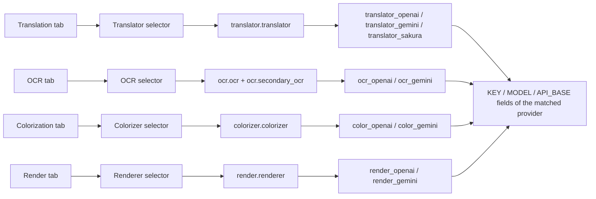

# API Management Tabs and Provider Fields

Use this page when you need to configure the API credentials used separately by translation, OCR, colorization, and rendering. Open “API Management” (`API Management`): the page is split into four feature tabs, one per feature. Each tab shows that feature’s selector at the top and only the credential field group of the currently selected provider below it.

This page covers the layout and switching of the four tabs and which provider’s field group each tab shows. For the full options and write behavior of the feature selectors, see [Feature selectors](./feature-selectors.md); for the meaning of the Key/Base/Model fields, see [Credentials, addresses, and models](./credentials-addresses-models.md); for candidate slots and rotation, see [API slots and rotation](./slots-and-rotation.md); for connection tests and the model list, see [Connection tests and model list](./connection-tests-and-model-list.md).

## Feature boundary

- API Management always contains four tabs with the route keys `env_translation`, `env_ocr`, `env_colorization`, and `env_render`, mapping to the translation, OCR, colorization, and rendering features.
- Each tab has a feature-selector dropdown at the top that writes to `translator.translator`, `ocr.ocr`, `colorizer.colorizer`, and `render.renderer` respectively; the OCR tab also reads `ocr.secondary_ocr` when hybrid OCR is enabled.
- A tab is only a navigation container: clicking a tab switches the stacked page on the right and does not change any configuration. Only the feature selector inside a tab writes configuration.
- The provider groups shown by a tab are decided by the current value of that feature selector; when no API provider matches, the tab shows a “no API required” empty state instead of credential cards.
- Translator selection, API feature selectors, and API candidate-slot rotation are three different boundaries: this page and [Feature selectors](./feature-selectors.md) cover the tabs, selectors, and field groups; translator implementation selection via `translator.translator` is covered by [Translator selection](../translator/selection-and-languages.md); slot rotation is covered by [API slots and rotation](./slots-and-rotation.md).

## UI operations

### Open API Management and switch tabs {#open-and-switch-tabs}

1. Choose “API Management” (`API Management`) in the left navigation. Below the title the subtitle reads “Manage API keys and environment variables for each translator”, and below the subtitle is the global API preset toolbar (the “Preset:” dropdown, “Add new preset”, and “Delete selected preset” buttons). Adding, deleting, and loading presets is covered by [Presets and persistence](./presets-and-persistence.md).
2. Click “Translation”, “OCR”, “Colorization”, or “Render” in the tab bar to switch tabs; the page opens on the “Translation” tab by default.
3. Switching tabs does not save or discard any input and does not change any configuration key; the credential fields of the four tabs are independent.

| UI call key | English actual value | Simplified Chinese actual value |
| --- | --- | --- |
| `API Management` | API Management | API 管理 |
| `Manage API keys and environment variables for each translator` | Manage API keys and environment variables for each translator | 管理每个翻译器的 API 密钥和环境变量 |
| `Translation` | Translation | 翻译 |
| `OCR` | OCR | 文字识别 |
| `Colorization` | Colorization | 上色 |
| `Render` | Render | 渲染 |
| `Test Current Tab` | Test Current Tab | 测试当前页 |
| `Preset:` | Preset: | 预设： |
| `Add new preset` | Add new preset | 添加新预设 |
| `Delete selected preset` | Delete selected preset | 删除选中的预设 |

### Feature-selector row inside each tab {#feature-selector-row}

Each tab contains one section card whose first row is a fixed “feature-selector row”: a label on the left, a dropdown in the middle, and a “Test Current Tab” button on the right. The labels and the configuration keys written by the four tabs are listed below; the dropdown options reuse the same enum values and display mapping as the Settings page, and a change is written to the matching configuration key immediately and refreshes the field groups.

| UI call key | English actual value | Simplified Chinese actual value | Config key written |
| --- | --- | --- | --- |
| `label_translator` | Translator | 翻译器 | `translator.translator` |
| `label_ocr` | OCR Model | OCR模型 | `ocr.ocr` |
| `label_colorizer` | Colorization Model | 上色模型 | `colorizer.colorizer` |
| `label_renderer` | Renderer | 渲染器 | `render.renderer` |

“Test Current Tab” runs a batch connection test over all configured keys of the current tab’s feature only; see [Connection tests and model list](./connection-tests-and-model-list.md).

### Provider field groups and the empty state {#provider-groups-and-empty-state}

- Every provider matched by the selector gets one credential card. OpenAI/Gemini cards contain a “Rotation strategy:” dropdown, numbered slot cards (Key, Model, and Base fields), and a “+ Add API slot” button; Sakura is a simplified two-field card (address and dictionary path) with no rotation strategy or slots.
- Each slot card shows a two-digit badge on the left (for example `01`) and a fixed “API slot” title; the field labels inside the card carry no index. The indexed display name such as “OpenAI API Key #2” is used in batch-test result lists.
- Secret fields (API Key / AUTH Key / Token) are masked by default and can be toggled with the eye button (“Show key” / “Hide key”); every key row has a “Test” button on its right and every model row has a “Get Models” button.
- When the current selector value needs no OpenAI/Gemini credentials (for example translator `none`/`original`, OCR `48px`, colorizer `none`, or renderer `default`), the card area shows the matching “no API required” hint and renders no credential fields.

| UI call key | English actual value | Simplified Chinese actual value |
| --- | --- | --- |
| `API rotation strategy:` | Rotation strategy: | 轮询策略： |
| `API slot {index}` | API slot {index} | API 通道 {index} |
| `+ Add API slot` | + Add API slot | + 添加 API 通道 |
| `Show Secret` | Show key | 显示密钥 |
| `Hide Secret` | Hide key | 隐藏密钥 |
| `Test` | Test | 测试 |
| `Get Models` | Get Models | 获取模型 |
| `Delete` | Delete | 删除 |
| `API slot cooldown marker` | Cooling down | 冷却中 |
| `API slot unavailable marker` | Unavailable | 不可用 |
| `Restore API channel` | Restore | 恢复 |
| `No translation API required` | The current translator does not require an OpenAI/Gemini API key. | 当前翻译器不需要 OpenAI/Gemini API Key。 |
| `No OCR API required` | The current OCR does not require an OpenAI/Gemini API key. | 当前 OCR 不需要 OpenAI/Gemini API Key。 |
| `No colorization API required` | The current colorizer does not require an OpenAI/Gemini API key. | 当前上色器不需要 OpenAI/Gemini API Key。 |
| `No render API required` | The current renderer does not require an OpenAI/Gemini API key. | 当前渲染器不需要 OpenAI/Gemini API Key。 |

## Tab structure {#tab-structure}

The diagram below shows the fixed mapping “tab → feature selector → config key → provider field groups”; OpenAI/Gemini groups display the KEY / MODEL / API_BASE field columns.

| Tab | Feature-selector stored value | Provider group | Fields (env keys) |
| --- | --- | --- | --- |
| Translation | `openai` / `openai_hq` | `translator_openai` | `OPENAI_API_KEY`, `OPENAI_MODEL`, `OPENAI_API_BASE` |
| Translation | `gemini` / `gemini_hq` | `translator_gemini` | `GEMINI_API_KEY`, `GEMINI_MODEL`, `GEMINI_API_BASE` |
| Translation | `sakura` | `translator_sakura` | `SAKURA_API_BASE`, `SAKURA_DICT_PATH` |
| OCR | `openai_ocr` | `ocr_openai` | `OCR_OPENAI_API_KEY`, `OCR_OPENAI_MODEL`, `OCR_OPENAI_API_BASE` |
| OCR | `gemini_ocr` | `ocr_gemini` | `OCR_GEMINI_API_KEY`, `OCR_GEMINI_MODEL`, `OCR_GEMINI_API_BASE` |
| Colorization | `openai_colorizer` | `color_openai` | `COLOR_OPENAI_API_KEY`, `COLOR_OPENAI_MODEL`, `COLOR_OPENAI_API_BASE` |
| Colorization | `gemini_colorizer` | `color_gemini` | `COLOR_GEMINI_API_KEY`, `COLOR_GEMINI_MODEL`, `COLOR_GEMINI_API_BASE` |
| Render | `openai_renderer` | `render_openai` | `RENDER_OPENAI_API_KEY`, `RENDER_OPENAI_MODEL`, `RENDER_OPENAI_API_BASE` |
| Render | `gemini_renderer` | `render_gemini` | `RENDER_GEMINI_API_KEY`, `RENDER_GEMINI_MODEL`, `RENDER_GEMINI_API_BASE` |

Field labels map “env key → UI text”, and the key prefix decides the feature: no prefix means translation, `OCR_` means OCR, `COLOR_` means colorization, and `RENDER_` means rendering. The actual values are:

| UI call key | English actual value | Simplified Chinese actual value |
| --- | --- | --- |
| `label_OPENAI_API_KEY` | OpenAI API Key | OpenAI API 密钥 |
| `label_OPENAI_MODEL` | OpenAI Model | OpenAI 模型 |
| `label_OPENAI_API_BASE` | OpenAI API Base | OpenAI API 地址 |
| `label_GEMINI_API_KEY` | Gemini API Key | Gemini API 密钥 |
| `label_GEMINI_MODEL` | Gemini Model | Gemini 模型 |
| `label_GEMINI_API_BASE` | Gemini API Base | Gemini API 地址 |
| `label_OCR_OPENAI_API_KEY` | OCR OpenAI API Key | 文字识别 OpenAI API 密钥 |
| `label_OCR_OPENAI_MODEL` | OCR OpenAI Model | 文字识别 OpenAI 模型 |
| `label_OCR_OPENAI_API_BASE` | OCR OpenAI API Base | 文字识别 OpenAI API 地址 |
| `label_OCR_GEMINI_API_KEY` | OCR Gemini API Key | 文字识别 Gemini API 密钥 |
| `label_OCR_GEMINI_MODEL` | OCR Gemini Model | 文字识别 Gemini 模型 |
| `label_OCR_GEMINI_API_BASE` | OCR Gemini API Base | 文字识别 Gemini API 地址 |
| `label_COLOR_OPENAI_API_KEY` | Colorization OpenAI API Key | 上色 OpenAI API 密钥 |
| `label_COLOR_OPENAI_MODEL` | Colorization OpenAI Model | 上色 OpenAI 模型 |
| `label_COLOR_OPENAI_API_BASE` | Colorization OpenAI API Base | 上色 OpenAI API 地址 |
| `label_COLOR_GEMINI_API_KEY` | Colorization Gemini API Key | 上色 Gemini API 密钥 |
| `label_COLOR_GEMINI_MODEL` | Colorization Gemini Model | 上色 Gemini 模型 |
| `label_COLOR_GEMINI_API_BASE` | Colorization Gemini API Base | 上色 Gemini API 地址 |
| `label_RENDER_OPENAI_API_KEY` | Rendering OpenAI API Key | 渲染 OpenAI API 密钥 |
| `label_RENDER_OPENAI_MODEL` | Rendering OpenAI Model | 渲染 OpenAI 模型 |
| `label_RENDER_OPENAI_API_BASE` | Rendering OpenAI API Base | 渲染 OpenAI API 地址 |
| `label_RENDER_GEMINI_API_KEY` | Rendering Gemini API Key | 渲染 Gemini API 密钥 |
| `label_RENDER_GEMINI_MODEL` | Rendering Gemini Model | 渲染 Gemini 模型 |
| `label_RENDER_GEMINI_API_BASE` | Rendering Gemini API Base | 渲染 Gemini API 地址 |
| `label_SAKURA_API_BASE` | SAKURA API Base | SAKURA API 地址 |
| `label_SAKURA_DICT_PATH` | SAKURA Dictionary Path | SAKURA 词典路径 |

## How tabs relate to feature selectors {#tab-selector-relationship}

- A tab represents a feature; the feature selector represents the implementation/provider currently chosen for that feature. Together they decide which field group is rendered below the tab.
- When a selector changes, the UI emits `setting_changed` (with the config key and the stored value) and then rebuilds the field groups of the four tabs and re-populates all selectors through a 120 ms debounce timer.
- The selectors of all four tabs read the same configuration: after `translator.translator`, `ocr.ocr`, `colorizer.colorizer`, or `render.renderer` is changed on the Settings page or in the editor, returning to API Management rebuilds the field groups from the new value.
- The OCR tab is special: with hybrid OCR enabled, the primary OCR (`ocr.ocr`) and the secondary OCR (`ocr.secondary_ocr`) can each be `openai_ocr`/`gemini_ocr`, so both provider groups can appear in the same tab at the same time.
- When no provider matches, the tab shows the “no API required” empty state (see the three-column table above) instead of a blank or broken state.

## Dependencies and conflicts

- Switching tabs does not write configuration; only the feature selectors and the field editors do. Merely viewing a tab never changes a setting.
- Credential fields are `.env` keys; edits enter memory immediately and are flushed on the shared save cadence. Field groups are rebuilt from the current selector value, so a provider group that is not selected is not displayed even if its `.env` keys contain values.
- A selector on this page and the Settings page share the same configuration key: they are two edit entry points for the same setting, not two independent configurations.
- Sakura translation has no Key/Model/Base slot cards, only the address and dictionary path; the “Rotation strategy:” dropdown and “+ Add API slot” appear only in OpenAI/Gemini groups.
- Cooldown/unavailable/recovery markers are slot state; see [Failures, cooldown, and recovery](./failures-cooldown-and-recovery.md). This page does not expand on rotation internals.

## Related files and formats

| File/format | Actual role on this page | Manual-edit and compatibility note |
| --- | --- | --- |
| `.env` | Stores each provider’s Key/Model/Base and numbered slots | Never show real keys, tokens, or user values in docs or screenshots |
| `config/config.json` | Persists the feature-selector values (`translator`, `ocr`, `colorizer`, `render`) | Never read or display a real user file |
| `config/config-example.json` | Release example: `translator=openai`, `ocr=48px`, `use_hybrid_ocr=false`, `colorizer=none`, `renderer=default` | Sanitized example only; keep Qt and release defaults separate |
| `desktop_qt_ui/core/config_models.py` | Qt defaults: `openai_hq`, `48px`, hybrid OCR on, `mocr`, `none`, `default` | Do not collapse core/release/Qt defaults into one default |

## Source evidence {#source-evidence}

| Layer | File | What was checked |
| --- | --- | --- |
| Tab layout | `desktop_qt_ui/ui/main_page/pages/env_page.py` | Creation of the four tabs, title keys, default tab, and stacked switching |
| Tab content | `desktop_qt_ui/ui/main_page/dynamic_settings.py` | `API_GROUP_SPECS`, `SIMPLE_API_GROUP_SPECS`, `_selected_api_group_keys`, `_add_api_section_panel`, empty state |
| Selector and fields | `desktop_qt_ui/ui/main_page/env_management.py` | Feature-selector row, rotation/slot/field controls, test and get-models buttons, secret visibility, debounced refresh |
| UI/i18n | `desktop_qt_ui/app_logic.py`, `desktop_qt_ui/locales/en_US.json`, `zh_CN.json` | Label mapping and actual bilingual display values |
| Config models | `desktop_qt_ui/core/config_models.py`, `config/config-example.json` | Qt and release defaults |
| Consumers | `manga_translator/config.py`, `manga_translator/api_key_rotation.py` | Enum values, strategy key, slot key naming |

## Verification {#verification}

| Check | Status | Notes |
| --- | --- | --- |
| BLUEPRINT, PAGE_GUIDELINES, TODO | Complete | Read in full and followed the page contract |
| Tab layout and switching | Complete | Statically checked the four tabs in `env_page.py` and group rebuilding in `dynamic_settings.py` |
| UI/i18n actual values | Complete | Three-column tables checked against `en_US.json` / `zh_CN.json` |
| Provider-group mapping | Complete | Statically checked `_selected_api_group_keys` and `API_GROUP_SPECS` |
| Sanitized runtime verification | Deferred | No real `.env`, user `config.json`, API key/token, username, user image, or private prompt was read |
| VitePress | Deferred | Coordinator should run `npm run docs:build --prefix doc/wiki` plus mirror/source checks before merge |
