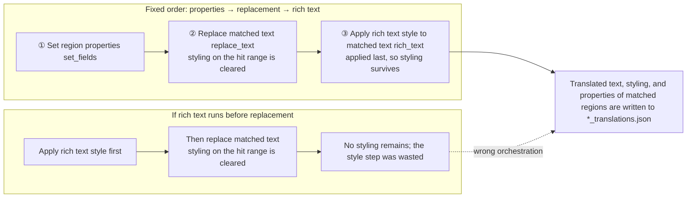

# Batch Actions and Order

When you need to edit translated regions across the main file list, the “Batch actions” (`Batch actions`) card decides what happens to each matched region: set properties, replace text, or apply rich-text styling. This page documents the three action blocks, how they are stored in a scheme file, and why they always run in the fixed order properties → text replacement → rich text.

Scheme creation, copy, rename, and delete are covered by [Scheme management](./schemes-crud.md); condition fields, operators, and the `all`/`any` logic by [Match conditions](./conditions.md); and preview, checkboxes, write-back, and restore by [Preview, apply, and restore](./preview-apply-restore.md). Rich-text style fields share the same style editor as rich-text rules; see [Rich-text styles and presets](../rich-text-rules/styles-and-presets.md).

## Feature boundary {#feature-boundary}

- The “Batch actions” card contains exactly three action blocks: `set_fields` (Set region properties), `replace_text` (Replace matched text), and `rich_text` (Apply rich text style to matched text).
- Actions always run in the fixed order `set_fields` → `replace_text` → `rich_text`; the UI offers no drag or move-up/move-down reordering. Entries inside the same block run top to bottom.
- The reason for the fixed order: replacing text clears rich-text styling on the changed range, so styling must come last. Putting styling before replacement is wasted work.
- “Set region properties” produces at most one action per scheme (all rows packed into one `fields` dict); “Replace matched text” and “Apply rich text style to matched text” produce one action per entry.
- Conditions select which regions are in scope; each action uses its own pattern to locate a substring inside the region's translation. The two layers are separate, so there is no ambiguity about which condition's hit range is the target.
- This page does not cover condition editing (see [Match conditions](./conditions.md)), preview/apply/restore (see [Preview, apply, and restore](./preview-apply-restore.md)), or every rich-text style field (see [Rich-text styles and presets](../rich-text-rules/styles-and-presets.md)).

## UI operations {#ui-operations}

### Configure actions in Batch Management

1. Open the “Batch Management” (`Batch Management`) page. The title is “Batch Management” and the subtitle is “Match regions across the main file list and edit their text, styling, and properties in bulk”.
2. In the “Batch actions” (`Batch actions`) card, each action block has its own enable checkbox. Checking an empty “Replace matched text” or “Apply rich text style to matched text” block adds one blank entry automatically; unchecking disables the block and both preview and apply ignore it.
3. In the “Set region properties” block, click “Add property” (`Add property`) to add a row: a field dropdown, a value editor, and a remove button. The dropdown lists writable fields only; read-only/derived fields can be used in conditions but cannot be written here.
4. In the “Replace matched text” block, click “Add replacement” (`Add replacement`) to add an entry: “Match text” (`Match text`) holds the pattern, the “Regex” (`Regex`) toggle decides whether the pattern is a regular expression, and “Replace with” (`Replace with`) holds the replacement text. With regex on, the replacement supports backreferences like `\1`.
5. In the “Apply rich text style to matched text” block, click “Add style entry” (`Add style entry`) to add an entry: a mode dropdown, “Match text”, an optional “Match rich text” (`Match rich text`) condition, and the target-style “Edit Style” (`Edit Style`) button.
6. The hint below the card title states the fixed order directly: “Applied in a fixed order: properties, then text replacement, then rich text. Changing the text clears styling on the changed range, so styling must come last. Within a block, entries run top to bottom.”

| UI call key | English actual value | Simplified Chinese actual value |
| --- | --- | --- |
| `Batch Management` | Batch Management | 批量管理 |
| `Match regions across the main file list and edit their text, styling, and properties in bulk` | Match regions across the main file list and edit their text, styling, and properties in bulk | 跨主页文件列表匹配区域，批量修改文字、富文本样式与属性 |
| `Batch actions` | Batch actions | 批量动作 |
| `Applied in a fixed order: properties, then text replacement, then rich text. Changing the text clears styling on the changed range, so styling must come last. Within a block, entries run top to bottom.` | Applied in a fixed order: properties, then text replacement, then rich text. Changing the text clears styling on the changed range, so styling must come last. Within a block, entries run top to bottom. | 固定按此顺序执行：改属性 → 替换文字 → 富文本。改文字会清掉命中区间的样式，所以样式必须放最后。同一块内的条目从上往下依次执行。 |
| `Set region properties` | Set region properties | 批量改区域属性 |
| `Add property` | Add property | 添加属性 |
| `Remove property` | Remove property | 移除属性 |
| `Replace matched text` | Replace matched text | 替换命中文字 |
| `Add replacement` | Add replacement | 添加替换 |
| `Remove replacement` | Remove replacement | 删除这条替换 |
| `Match text` | Match text | 匹配文字 |
| `Text or regular expression` | Text or regular expression | 文字或正则表达式 |
| `Regex` | Regex | 正则 |
| `Replace with` | Replace with | 替换为 |
| `Supports backreferences like \1 when regex is on` | Supports backreferences like \1 when regex is on | 开启正则时支持 \1 这样的反向引用 |
| `Apply rich text style to matched text` | Apply rich text style to matched text | 给命中文字加富文本样式 |
| `Add style entry` | Add style entry | 添加样式条目 |
| `Remove style entry` | Remove style entry | 删除这条样式 |
| `Overwrite` | Overwrite | 覆盖 |
| `Fill in` | Fill in | 添加 |
| `Replace` | Replace | 替换 |
| `Match rich text` | Match rich text | 匹配富文本 |
| `Match all` | Match all | 全部满足 |
| `Match any` | Match any | 任一满足 |
| `Edit Style` | Edit Style | 编辑样式 |
| `No style set` | No style set | 未设置样式 |
| `No style filter` | No rich text filter | 未设置富文本条件 |
| `Leave the pattern empty to target the whole region` | Leave the pattern empty to target the whole region | 匹配文字留空 = 整条 region 的全部文字 |

Action-block enablement and entries are saved with the scheme; any change to a condition or action row invalidates the previous preview.

## The three action types {#action-types}

### Set region properties

The controls are listed as “field + value” rows; `to_actions()` packs every row in the block into a single `set_fields` action (a `fields` dict). The writable fields are:

| Stored key | English actual value | Simplified Chinese actual value | Notes |
| --- | --- | --- | --- |
| `translation` | Translation | 翻译 | Rewrites the whole translation through the sync pipeline and drops old rich text |
| `translation_raw` | Translation (pre-replacement) | 译文（替换前） | Pre-replacement translation; writing it alone updates only this field |
| `font_family` | Font Family | 字体 | Font family |
| `target_lang` | Target Language | 目标语言 | Target language |
| `source_lang` | Source Language | 源语言 | Source language |
| `direction` | Direction | 排版方向 | `h` / `v` / `hr` / `vr` / `auto` |
| `alignment` | Alignment | 对齐 | `left` / `center` / `right` / `auto` |
| `font_size` | Font Size | 字号 | Integer |
| `angle` | Angle | 角度 | Numeric |
| `line_spacing` | Line Spacing | 行距 | Numeric |
| `letter_spacing` | Letter Spacing | 字距 | Numeric |
| `stroke_width` | Stroke Width | 描边宽度 | Numeric |
| `fg_colors` | Text Color | 文字颜色 | Color; also accepts the editor's `font_color` form |
| `bg_colors` | Stroke Color | 描边颜色 | Color; also accepts the editor's `bg_color` form |

Read-only/derived fields (`text` Source Text, `prob` OCR Confidence, `has_rich_text` Has Rich Text, `line_count` Line Count, `region_index` Region Index) do not appear in the “Add property” dropdown and are usable only in [Match conditions](./conditions.md).

Writing `translation` is a whole-rewrite: the old `translation_rich` is dropped and `translation_raw` is synced to the same text, unless the block also writes `translation_raw`, in which case your written value is kept.

### Replace matched text

Each entry produces one `replace_text` action with `pattern`, `regex`, and `replace` fields. An entry with an empty pattern produces no action; the engine collapses consecutive newlines before locating substrings. With `regex` on, the replacement supports backreferences like `\1`, and invalid references are treated literally so the whole batch does not crash.

Replacement is written back by replaying edit operations: unchanged characters keep their rich-text and ruby/tcy node ownership, only the replaced characters lose styling, and the inserted text inherits the style of the first character of the matched range (when the range originally had several styles, only one can be carried over).

### Apply rich text style to matched text

Each entry produces one `rich_text` action. Three modes:

| Stored value | English | Simplified Chinese | Actual behavior |
| --- | --- | --- | --- |
| `overwrite` | Overwrite | 覆盖 | Your properties win; the rest of the hit keeps what it has |
| `fill` | Fill in | 添加 | Properties the hit already has win; only the missing ones are added; if the range already contains any ruby/tcy node, the whole range yields |
| `replace` | Replace | 替换 | Clears the existing styles and nodes on the hit, then applies the new style |

An empty pattern targets the whole region. An optional `match_style` filters the hit by its existing rich-text styling using “Match all”/“Match any”. Actions with empty `style`, `ruby`, and `tcy` are dropped. The engine applies hit ranges right-to-left so coordinates do not shift.

## Fixed execution order {#execution-order}

The `actions` list in the scheme file does not have to be hand-sorted: `normalize_scheme()` applies a stable sort with `ACTION_ORDER = (set_fields, replace_text, rich_text)`, so entries of the same type keep the order in which they were written.

“Styling on the hit range is cleared” refers to the rewrite of the matched substring, not a guarantee that the whole region loses styling: unchanged characters keep their styles through edit replay. The fixed order ensures that rich-text styling added last is not cleared again by a replacement action in the same scheme.

## Dependencies and conflicts {#dependencies-and-conflicts}

- Conditions decide which regions enter the preview; actions only locate substrings inside those regions. Conditions do not participate in action execution.
- Preview requires at least one enabled action block (`Enable at least one batch action first.`); a scheme with no actions cannot be previewed.
- A preview is invalidated whenever any condition or action row changes, and “Preview matches” must be run again.
- The rich-text style editor is shared with the rich-text rules page (`RichTextStyleDialog`); style fields and compatibility are documented there.
- Batch write-back can conflict with in-memory editor data: the UI warns and reloads the editor after applying; see [Preview, apply, and restore](./preview-apply-restore.md).
- Batch management only touches the desktop-side `*_translations.json` files and the scheme file. It does not enter the `manga_translator` rendering pipeline and never reads or writes API credentials.

## Related files and formats {#related-files-and-formats}

| File/format | Actual role on this page | Manual-edit and compatibility note |
| --- | --- | --- |
| `config/batch_edit_schemes.yaml` | Stores all schemes; top-level `schemes` list, each scheme has `match` and `actions` | `yaml.safe_load` / `safe_dump`; lazily created with a default example when missing |
| `schemes[].actions[].type` | `set_fields` / `replace_text` / `rich_text` | Normalized with a stable `ACTION_ORDER` sort; unknown types and the legacy `clear` mode are dropped |
| `rich_text` action `mode` | `overwrite` / `fill` / `replace` | Invalid modes fall back to `overwrite` |
| `<image-dir>/manga_translator_work/json/<stem>_translations.json` | Target of the write-back; regions hold `translation`, `translation_raw`, `translation_rich`, and more | A `.bak` is written next to each modified file by default; see [Preview, apply, and restore](./preview-apply-restore.md) |

## Source evidence {#source-evidence}

| Layer | File | What was checked |
| --- | --- | --- |
| Page entry | `desktop_qt_ui/ui/main_page/pages/batch_edit_page.py` | “Batch Management” page title and subtitle |
| UI | `desktop_qt_ui/ui/secondary_pages/batch_edit_panel.py` | Action-card layout, enable checkboxes, hint text, and `_collect_scheme()` action assembly |
| Action widgets | `desktop_qt_ui/ui/secondary_pages/batch_edit_condition_widgets.py` | `SetFieldsActionCard`, `ReplaceTextActionCard`, `RichTextActionCard`, entries, and mode dropdown |
| i18n | `desktop_qt_ui/locales/en_US.json`, `zh_CN.json` | Actual bilingual display values for action-related keys |
| Persistence | `desktop_qt_ui/services/batch_edit_schemes.py` | `ACTION_ORDER`, stable `normalize_scheme()` sort, `RICH_MODES` |
| Engine | `desktop_qt_ui/services/batch_edit_engine.py` | `_apply_set_fields`, `_apply_replace_text`, `_apply_rich_text`, `apply_scheme_to_region` |
| Scheduling | `desktop_qt_ui/services/batch_edit_service.py` | Scan/apply/restore channel and cancel boundaries |

## Verification {#verification}

| Check | Status | Notes |
| --- | --- | --- |
| BLUEPRINT, PAGE_GUIDELINES, TODO | Complete | Read in full and followed the page contract |
| UI layout and calls | Complete | Statically checked the batch panel action cards and entry widgets |
| `en_US` / `zh_CN` actual locales | Complete | The table records key, actual English, and actual Simplified Chinese values |
| Action execution chain | Complete | Statically checked the stable `ACTION_ORDER` sort and the engine implementations of the three actions |
| Sanitized runtime verification | Deferred | No real `.env`, user `config.json`, API key/token, username, user image, or private prompt was read |
| VitePress | Deferred | Coordinator should run `npm run docs:build --prefix doc/wiki` plus mirror/source checks before merge |