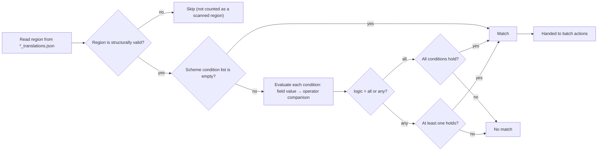

# Batch Condition Matching

Use this page when regions across a set of images must be filtered by content, layout, or properties before bulk edits. The “Batch Management” (`Batch Management`) page uses match conditions to select regions, then batch actions edit their text, rich-text styling, or properties; the two are separate, so there is no ambiguity about which condition's match range is the target.

This page covers condition fields and matching rules only. Scheme CRUD is documented in [Scheme management (CRUD)](./schemes-crud.md), batch actions in [Batch actions and execution order](./actions-and-order.md), and preview, apply, backup, and restore in [Preview, apply, and restore](./preview-apply-restore.md).

## Feature boundary {#feature-boundary}

- A scheme has two parts: `match` (`logic` + `conditions`) and `actions`; conditions are the first half and only filter regions.
- With an empty condition list, every region in scope matches (“No conditions means every region in scope is selected.”).
- Conditions are evaluated only on structurally valid regions; malformed regions are skipped during both scanning and applying.
- Batch-management conditions operate on region data in the `*_translations.json` files from the main file list. They have nothing to do with `batch_size` or `batch_concurrent` (image batching/concurrent translation) in the translation pipeline.

## UI operations {#ui-operations}

### Configure match conditions in Batch Management

1. Open the “Batch Management” (`Batch Management`) page in the main navigation.
2. Select or create a scheme (see [Scheme management (CRUD)](./schemes-crud.md)).
3. In the “Match conditions” (`Match conditions`) card, first choose “Match all” (`Match all`) or “Match any” (`Match any`) from the logic combo box.
4. Click “Add condition” (`Add condition`) to create a condition row `[Field ▾] [Operator ▾] [Value] [×]`. The field combo lists every matchable field, operators change with the field kind, and the value editor is built dynamically from the field kind plus operator.
5. Changing the field or operator rebuilds the value editor; operators that need no value (`empty`, `not_empty`, `is_true`, `is_false`) hide it.
6. Click `×` at the end of a row to remove that condition (tooltip “Remove condition”).
7. Any change marks the scheme as dirty and auto-saves it to `config/batch_edit_schemes.yaml` after about 600 ms, while clearing the previous preview result.

| UI call key | English actual value | Simplified Chinese actual value |
| --- | --- | --- |
| `Batch Management` | Batch Management | 批量管理 |
| `Match regions across the main file list and edit their text, styling, and properties in bulk` | Match regions across the main file list and edit their text, styling, and properties in bulk | 跨主页文件列表匹配区域，批量修改文字、富文本样式与属性 |
| `Scheme:` | Scheme: | 方案: |
| `Match conditions` | Match conditions | 匹配条件 |
| `Match all` | Match all | 全部满足 |
| `Match any` | Match any | 任一满足 |
| `Add condition` | Add condition | 添加条件 |
| `Remove condition` | Remove condition | 移除条件 |
| `No conditions means every region in scope is selected.` | No conditions means every region in scope is selected. | 不填条件表示范围内的所有区域都命中。 |
| `Preview matches` | Preview matches | 预览命中 |

### Condition rows and value editors

Each condition row `[Field ▾] [Operator ▾] [Value] [×]` gets its value editor built from the field kind and operator:

| Field kind | Value editor | Notes |
| --- | --- | --- |
| Text (`text`) | Single-line input | Placeholder text is “Value” (`Value`) |
| Enum (`enum`) | Combo box | Shows raw storage values, not translated; e.g. direction `h`/`v`/`hr`/`vr`/`auto` |
| Number (`number`) | Number input | Integer range -100000…100000; decimals keep 3 places with step 0.05 |
| Number range (`between`) | Low + “to” (`to`) + high | Two number inputs |
| Color (`color`) | Color picker | “Close to color” (`color_near`) adds “Tolerance” (`Tolerance`), range 0…442, default 30 |
| Boolean (`bool`) | “Yes” (`Yes`)/“No” (`No`) combo | Stores `true`/`false` |
| Font (`font_family`) | Font combo | Lists system fonts |

## Condition fields {#condition-fields}

The following fields appear in the field combo box. `Storage value` is the field key written to the scheme YAML; fields marked “No” are condition-only and cannot be targets of the “set region properties” action.

| Storage value | English actual value | Simplified Chinese actual value | Kind | Writable by actions |
| --- | --- | --- | --- | --- |
| `translation` | Translation | 翻译 | Text | Yes |
| `text` | Source Text | 原文 | Text | No |
| `translation_raw` | Translation (pre-replacement) | 译文（替换前） | Text | Yes |
| `font_family` | Font Family | 字体 | Text (font) | Yes |
| `target_lang` | Target Language | 目标语言 | Text | Yes |
| `source_lang` | Source Language | 源语言 | Text | Yes |
| `direction` | Direction | 排版方向 | Enum | Yes |
| `alignment` | Alignment | 对齐 | Enum | Yes |
| `font_size` | Font Size | 绝对字号 | Number (integer) | Yes |
| `angle` | Angle | 角度 | Number | Yes |
| `line_spacing` | Line Spacing | 行距 | Number | Yes |
| `letter_spacing` | Letter Spacing | 字距 | Number | Yes |
| `stroke_width` | Stroke Width | 描边宽度 | Number | Yes |
| `prob` | OCR Confidence | OCR 置信度 | Number | No |
| `fg_colors` | Text Color | 文字颜色 | Color | Yes |
| `bg_colors` | Stroke Color | 描边颜色 | Color | Yes |
| `has_rich_text` | Has Rich Text | 含富文本 | Boolean | No |
| `line_count` | Line Count | 行数 | Number (integer) | No |
| `region_index` | Region Index | 区域序号 | Number (integer) | No |

Field-value notes:

- `translation` matches the region body: it prefers the visible text of the rich-text document (newlines as `\n`) and falls back to the `translation` field when parsing fails. Matching does not run on `[BR]`-based `translation`, so the four characters of `[BR]` never pollute character indices.
- `text`, `prob`, `has_rich_text`, `line_count`, and `region_index` are read-only and never appear in the “set region properties” action.
- `direction` values are alias-normalized: `horizontal` → `h`, `vertical` → `v`, and `h`/`v`/`hr`/`vr`/`auto` are accepted.
- Empty `fg_colors`/`bg_colors` fall back to `font_color`/`bg_color`, keeping compatibility with historical editor-saved shapes.

## Operators and matching rules {#operators-and-rules}

Operators are determined by the field kind and are listed per kind:

| Storage value | English actual value | Simplified Chinese actual value | Applies to | Needs a value |
| --- | --- | --- | --- | --- |
| `contains` | contains | 包含 | Text | Yes |
| `not_contains` | does not contain | 不包含 | Text | Yes |
| `eq` | equals | 等于 | Text/Enum/Number | Yes |
| `ne` | not equal to | 不等于 | Text/Enum/Number | Yes |
| `regex` | matches regex | 正则匹配 | Text | Yes |
| `not_regex` | does not match regex | 正则不匹配 | Text | Yes |
| `empty` | is empty | 为空 | Text | No |
| `not_empty` | is not empty | 不为空 | Text | No |
| `gt` | greater than | 大于 | Number | Yes |
| `gte` | at least | 大于等于 | Number | Yes |
| `lt` | less than | 小于 | Number | Yes |
| `lte` | at most | 小于等于 | Number | Yes |
| `between` | between | 介于 | Number | Yes (two values) |
| `color_eq` | equals color | 颜色等于 | Color | Yes |
| `color_near` | close to color | 颜色接近 | Color | Yes (with tolerance) |
| `is_true` | is yes | 是 | Boolean | No |
| `is_false` | is no | 否 | Boolean | No |

Matching rules (from the `batch_edit_engine` evaluation implementation):

- Text: normalized with `str()` first; `contains`/`not_contains` are substring checks and `eq`/`ne` are whole-string equality; `empty`/`not_empty` judge the text after stripping leading/trailing whitespace.
- Regex: uses a `re.search` substring search; when the pattern is invalid, both `regex` and `not_regex` return no match (an invalid pattern never aborts the whole scan).
- Enum: both sides are stripped and lowercased before comparison; direction is alias-normalized as well.
- Number: if the value cannot be parsed as a number, the condition does not match; `eq`/`ne` use floating-point approximate comparison (relative/absolute tolerance `1e-9`); `between` is inclusive and swaps the bounds when low is greater than high.
- Color: compared by RGB distance; `color_eq` requires distance 0 and `color_near` requires distance ≤ tolerance (default `30.0` when no tolerance is provided; UI range 0…442).
- Boolean: `is_true` requires a truthy value and `is_false` requires a falsy value.
- An unknown field, an unknown operator, or a field/operator kind mismatch always makes the condition not match (returns false).

## Condition matching flow {#matching-flow}

The diagram below shows how a single region flows from the file to “matched” or not (“executing actions” is covered by [Batch actions and execution order](./actions-and-order.md)):

Limits: the diagram reflects the real source evaluation path. The `translation` body is the rich-text visible text (`\n`), so operators such as `contains`/`regex` see `\n` newlines, not `[BR]` markers. The apply stage re-reads the files and re-runs the same conditions instead of reusing the preview cache.

## Dependencies and conflicts {#dependencies-and-conflicts}

- Conditions only filter regions; each action carries its own `pattern` to locate substrings inside the translation. Conditions and actions do not share a “match range”.
- Condition evaluation depends on region fields such as `texts`/`lines`/`translation`/rich text; regions with missing OCR text or malformed structure are skipped and can never be “selected”.
- After any scheme change, the previous preview is invalidated; click “Preview matches” (`Preview matches`) again to regenerate the match list.
- Batch-management conditions are unrelated to `context_size`, `batch_size`, and `batch_concurrent` in translation settings: the former operate on region data of translated JSON, while the latter control batching and concurrency of the translation pipeline.
- This page never reads or displays real `.env`, user `config.json`, or task artifacts; scheme YAML records only condition and action structure and contains no credentials.

## Related files and formats {#related-files-and-formats}

| File/format | Actual role on this page | Manual-edit and compatibility note |
| --- | --- | --- |
| `config/batch_edit_schemes.yaml` | Stores schemes; `match.logic` and `match.conditions[]` are this page's content | `conditions[].field`/`op`/`value` must match the field and operator tables; unknown fields or operators evaluate as no match |
| `*_translations.json` | Region data read by conditions (`texts`, `lines`, `text`, `translation`, `direction`, `prob`, colors, etc.) | Only field semantics are recorded; no real user images or translations are shown |
| `.bak` | Backup written before write-back | Covered by [Preview, apply, and restore](./preview-apply-restore.md); not expanded here |

## Source evidence {#source-evidence}

| Layer | File | What was checked |
| --- | --- | --- |
| Page entry | `desktop_qt_ui/ui/main_page/pages/batch_edit_page.py`, `desktop_qt_ui/ui/main_window.py` | Batch Management registration, title, and subtitle |
| Condition UI | `desktop_qt_ui/ui/secondary_pages/batch_edit_panel.py` | Match conditions card, logic combo, add/remove conditions, auto-save |
| Condition rows and value editors | `desktop_qt_ui/ui/secondary_pages/batch_edit_condition_widgets.py` | Field/operator/value triple and kind-based value editors |
| Evaluation engine | `desktop_qt_ui/services/batch_edit_engine.py` | `FIELDS`, `OPS_BY_KIND`, `evaluate_conditions`, `region_field_value`, `region_is_sane` |
| Scheme persistence | `desktop_qt_ui/services/batch_edit_schemes.py` | `match.logic`/`conditions` structure, load/save, and validation |
| i18n | `desktop_qt_ui/locales/en_US.json`, `zh_CN.json` | Actual English/Chinese values of fields, operators, and panel copy |

## Verification {#verification}

| Check | Status | Notes |
| --- | --- | --- |
| BLUEPRINT, PAGE_GUIDELINES, TODO | Complete | Read in full and followed the page contract; scope matches `BLUEPRINT.md` 5.4 batch management |
| Condition UI and i18n | Complete | Statically checked `batch_edit_panel.py`, `batch_edit_condition_widgets.py`, and both locale files |
| Matching rules and field values | Complete | Statically checked `evaluate_conditions`, `region_field_value`, and `region_is_sane` in `batch_edit_engine.py` |
| Route mirror and source-evidence checks | Deferred | Coordinator should run `node scripts/verify-route-mirror.mjs .` and `node scripts/verify-source-evidence.mjs .` before merge |
| Sanitized runtime verification | Deferred | No real `.env`, user `config.json`, API key/token, username, user image, or private translation was read |
