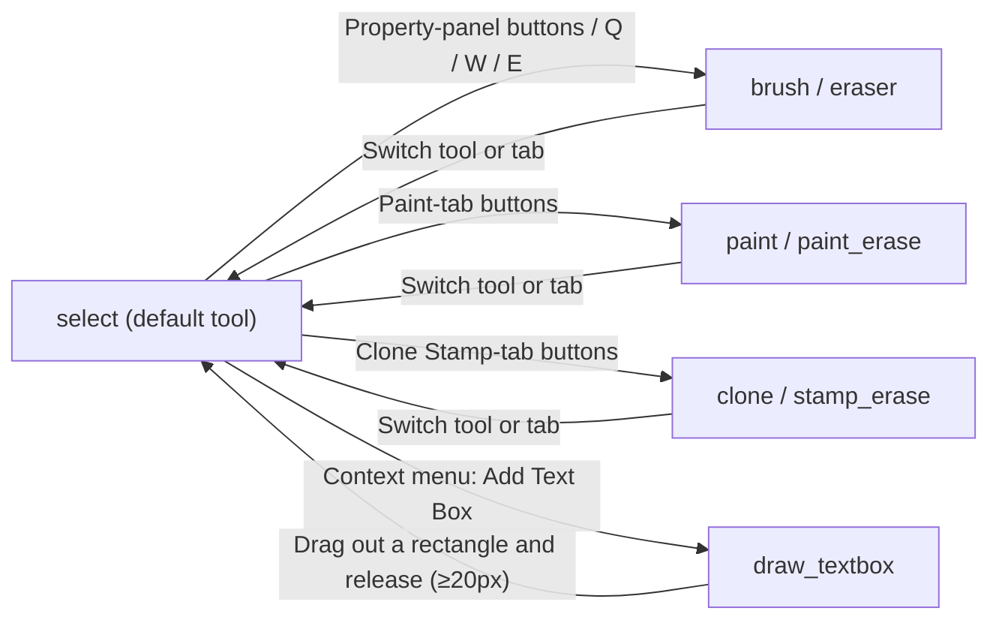
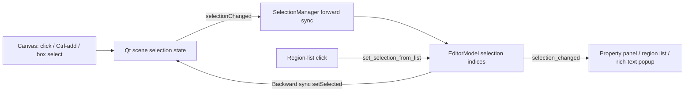

# Canvas Tools and Selection

Once you enter the editor, the canvas is the main workspace for adjusting text regions and retouching the image. This page explains how to switch each canvas tool (selection, mask brush, eraser, color paint, clone stamp) and how to select, drag, and zoom the canvas and its text regions. How mask strokes are written into the refined mask and how the paint/stamp layers and their clear buttons work are covered in [Mask, Paint, and Clone Stamp](./mask-paint-and-clone-stamp.md); toolbar menus, display modes, and arrange actions are covered in [Toolbar and Menus](./toolbar-and-menus.md); shortcut registration and focus priority are covered in [Shortcuts](./shortcuts.md).

## Feature boundary

- The canvas tool is a single active state `active_tool`. Its values are `select`, `brush`, `eraser`, `paint`, `paint_erase`, `clone`, `stamp_erase`, and the temporary drawing state `draw_textbox`. The UI changes it only through the Property Editor buttons, the `Q`/`W`/`E` keys, and the context-menu item “Add Text Box”.
- Selection (click, box select, multi-select) and region dragging happen only under the `select` tool. With a brush-like tool, pressing the left button no longer selects regions; it draws a stroke instead.
- View zoom and panning (wheel zoom, zoom in/out, fit to window, middle-button drag) transform the whole canvas view and never change region data. `Ctrl+wheel` resizes the font of selected regions and `Shift+wheel` changes the shared brush size; both combinations belong to the [Shortcuts](./shortcuts.md) page.
- The selection is synchronized bidirectionally between the canvas, the region list, and the Property Editor. Region source/translation editing, find-and-replace, OCR/Translate buttons, and list behavior are covered in [Region List and Text Editing](./region-list-and-text-editing.md).
- Mask refinement and the data structure and rendering of the paint/stamp layers belong to [Mask, Paint, and Clone Stamp](./mask-paint-and-clone-stamp.md); this page only explains the tool entry points and pointer semantics.

## UI operations

### Switch canvas tools in the Property Editor

After opening the editor, the left panel defaults to “Property Editor” (`Property Editor`). In the “Image Editing” (`Image Editing`) group there are three tabs, `Mask`, `Paint`, and `Clone Stamp`; each tab offers a set of mutually exclusive tool buttons. All three tabs share one button group, so checking a tool on any tab unchecks the tools on the other tabs.

| UI call key | English actual value | Simplified Chinese actual value |
| --- | --- | --- |
| `Property Editor` | Property Editor | 属性编辑 |
| `Image Editing` | Image Editing | 图像编辑 |
| `Mask` | Mask | 蒙版 |
| `Paint` | Paint | 画笔 |
| `Clone Stamp` | Clone | 印章 |
| `No Selection` | No Selection | 不选择 |
| `Selection Tool` | Selection Tool | 选择工具 |
| `Brush` | Brush | 画笔 |
| `Brush Tool` | Brush Tool | 画笔工具 |
| `Eraser` | Eraser | 橡皮擦 |
| `Eraser Tool` | Eraser Tool | 橡皮擦工具 |
| `Clone Stamp Hint` | Clone stamp: right-click to sample, left-drag to paint | 仿制印章：右键取样，左键拖动涂抹 |
| `Brush Size:` | Brush Size: | 笔刷大小: |
| `Brush Color:` | Brush Color: | 画笔颜色： |
| `Show Refined Mask` | Show Refined Mask | 显示优化蒙版 |
| `Show Paint Layer` | Show Paint Layer | 显示画笔层 |
| `Show Stamp Layer` | Show Stamp Layer | 显示印章层 |
| `Clear All Masks` | Clear All Masks | 清除所有蒙版 |
| `Clear Paint Layer` | Clear Paint Layer | 清除画笔图层 |
| `Clear Stamp Layer` | Clear Stamp Layer | 清除印章层 |

The tool buttons on the three tabs emit the active values `select`, `brush`, `eraser`, `paint`, `paint_erase`, `clone`, and `stamp_erase` respectively, and the checked state is mirrored back from the model when the active tool changes. When you switch tabs and the current tool does not belong to the new tab, the active tool is reset to that tab’s “No Selection” (`No Selection`) button, avoiding cross-tab tool conflicts.

The Mask tab additionally offers “Show Refined Mask” (`Show Refined Mask`) and “Clear All Masks” (`Clear All Masks`); the Paint tab offers “Show Paint Layer” (`Show Paint Layer`), “Clear Paint Layer” (`Clear Paint Layer`), and “Brush Color:” (`Brush Color:`); the Clone Stamp tab offers “Show Stamp Layer” (`Show Stamp Layer`) and “Clear Stamp Layer” (`Clear Stamp Layer`). All three tabs share one “Brush Size:” (`Brush Size:`) model field with a range of 5–200 and an initial value of 30.

Instead of opening the panel, press `Q` for the “Selection Tool”, `W` for the “Brush Tool”, and `E` for the “Eraser Tool”. Right-clicking on blank canvas and choosing “Add Text Box” enters the `draw_textbox` drawing mode.

### Canvas pointer operations

The table below lists pointer semantics per active tool; the input layer treats every brush-like tool as drawing and never as region selection.

| Active tool | Left button | Right button | Notes |
| --- | --- | --- | --- |
| `select` | Click to select a region; drag inside the white frame to move it; drag handles to resize/rotate; drag on blank canvas to box-select | Opens the context menu | Region selection and geometry editing |
| `draw_textbox` | Drag out a rectangle to create a new text region; returns to `select` on release | Entered through the “Add Text Box” context-menu item | Creation is discarded when the rectangle is under 20×20 px |
| `brush` | Press and drag to write white strokes into the refined mask | — | Commits `MaskEditCommand` and triggers an inpaint stroke |
| `eraser` | Press and drag to erase mask strokes to 0 | — | Commits `MaskEditCommand` |
| `paint` | Press and drag to write the brush color into the paint layer | — | Writes `paint_overlay` |
| `paint_erase` | Press and drag to erase the paint layer | — | Writes `paint_overlay` |
| `clone` | Press and drag to clone paint into the stamp layer | Right-click samples; the context menu is suppressed | Sample-circle marker; offset locks on the first dab |
| `stamp_erase` | Press and drag to erase the stamp layer | — | Writes `stamp_overlay` |

Brush, eraser, paint, clone stamp, and stamp eraser all show a circular cursor whose radius follows the brush size and the current zoom; `draw_textbox` shows a cross cursor. An in-progress box select or stroke is cleaned up uniformly when you switch tools, open the context menu, press `Escape`, or the window loses focus: switching tools commits with the old tool semantics, while the context menu and focus loss discard it.

### Select, drag, and zoom

- Selection: with the `select` tool, click a text region to select it; hold `Ctrl` and click to add to the selection; press and drag on blank canvas to draw a dashed selection box, then on release regions intersecting the box are hit precisely (including rotated and thin regions), and the old selection is cleared unless `Ctrl` is held. Clicking blank canvas (a zero-size box) is equivalent to deselecting.
- Dragging: drag a selected region (inside its white frame) to move it; other selected regions follow in the same drag. Drag the white square handles around the selection to resize the frame and drag the rotation handle to rotate. On release the geometry is written back through `update_region_geometry` and enters the undo history.
- Zooming: the wheel zooms in by a factor of 1.15 and out by 1/1.15, clamped to 0.05–50, anchored at the mouse position. The “Zoom In (+)” (`Zoom In (+)`) and “Zoom Out (-)” (`Zoom Out (-)`) items in the “Menu” and the persistent “Fit to Window” (`Fit to Window`) button drive the same view transform.
- Panning: press and hold the middle mouse button and drag to pan. Pressing the middle button internally switches to `ScrollHandDrag`; releasing restores `NoDrag`.
- The view state (transform matrix and center) is emitted through `view_state_changed` to the original-compare panel and the floating rich-text editor for positioning.

## Tool and selection flow

The diagrams below sketch the tool state transitions and the bidirectional selection sync. Switching tools first commits the in-progress interaction under the old tool semantics, so a mask stroke cannot be committed to the wrong tool; after `draw_textbox` commits, the tool returns to “select”.

The selection changes at either end are mirrored to the other end: clicks/box selects on the canvas first land in the Qt scene selection state, then `SelectionManager` converts them into the model’s index list, and the Property Editor, region list, and floating rich-text editor all read the same model selection; clicking in the region list writes back through the controller to the model and refreshes the canvas selection.

## Runtime behavior

### Tool state machine

`session.py` initializes `active_tool` to `select`. `EditorModel.set_active_tool()` emits only when the value changes; `GraphicsView._on_active_tool_changed()` first commits the in-progress box select or stroke under the old tool semantics, then switches the internal `_active_tool` and updates the cursor. Switching away from `clone` clears the clone-stamp sample point and offset. The input layer also keeps a legacy `pen` branch, but the current UI never emits that value.

`draw_textbox` is not one of the Property Editor buttons: only the context-menu item “Add Text Box” (`enter_drawing_mode`) clears the selection and sets the active tool to `draw_textbox`. After the rectangle is dragged out, `_finish_textbox_drawing` creates the region and returns to `select`; creation is discarded when the rectangle is under 20 px wide or high. The new region inherits font, color, alignment, and similar styles from the last selected region as a template, and the text direction is inferred from the box width/height.

### Bidirectional selection sync

`SelectionManager` uses a `_syncing` flag to prevent feedback loops: Qt scene `selectionChanged` → model `set_selection`; model `selection_changed` → `setSelected` on each item. Box selection uses `scene.items(rect, IntersectsItemShape)` for precise hits instead of `boundingRect`, so rotated and thin regions are not mis-selected. After the region items are rebuilt, `restore_selection_after_rebuild` restores the selection.

## Dependencies and conflicts

- Region selection only happens under the `select` tool; the left button of a brush-like tool always draws and cannot pick a region.
- `Delete` region deletion and `Ctrl+Z`/`Ctrl+Y` undo/redo are focus-aware: with focus in a text control they are left to text editing, and only with canvas focus do they act on regions; see [Shortcuts](./shortcuts.md).
- `Ctrl+wheel` and `Shift+wheel` are intercepted by the shortcut manager to resize the selected regions’ font and the shared brush size respectively, and never fall through to canvas zoom.
- Switching tabs resets the tool to that tab’s “No Selection”, so the mask brush and the color paint brush cannot be active at the same time.
- The context-menu items “🔍 OCR识别选中项”, “🌐 翻译选中项”, “📋 复制区域”, “🎨 粘贴样式”, “🗑️ 删除选中的 N 个区域”, “➕ 添加文本框”, “📋 粘贴区域”, and “🔄 刷新视图” are hardcoded Chinese literals in the code without `en_US`/`zh_CN` counterparts and do not switch language; while the clone stamp is active the right button is reserved for sampling and the menu is fully suppressed.
- View zoom is clamped between 0.05 and 50 to keep wheel zoom from runaway and to avoid stroke artifacts at extremely small scales; zoom only changes the view transform, never the region data.

## Related files and formats

| File/state | Actual role on this page | Note |
| --- | --- | --- |
| Session state `active_tool`, `brush_size`, `brush_color` | Runtime state of the canvas tool and brush parameters | Lives in the editor session memory only; not written to a config file |
| Region data `polygons`, `white_frame_rect_local`, `angle`, etc. | Region geometry fields written back by canvas drag/handle edits | Persisted to `*_translations.json`; see [Import, export, and writeback](./import-export-and-writeback.md) |
| Refined mask, paint layer, stamp layer | Write targets of `brush`/`eraser`/`paint`/`clone` tools | Layer structure, rendering, and clearing are covered in [Mask, Paint, and Clone Stamp](./mask-paint-and-clone-stamp.md) |

## Source evidence {#source-evidence}

| Layer | File | What was checked |
| --- | --- | --- |
| Tool-selection UI | `desktop_qt_ui/ui/widgets/property_panel.py` | Image Editing group, three tabs, shared exclusive button group, `_on_mask_tool_changed` mapping, tab-switch reset |
| Tool state | `desktop_qt_ui/editor/session.py`, `editor_model.py`, `editor_controller.py` | `active_tool` initial `select`, signals, and controller forwarding |
| Canvas input | `desktop_qt_ui/ui/editor/graphics_view_input.py` | Per-tool left/right button branches, box select, textbox drawing, wheel zoom, middle-button pan, cursors |
| View and zoom | `desktop_qt_ui/ui/editor/graphics_view.py` | Zoom clamp 0.05–50, transform anchor, `fit_to_window`, region drag threshold 5 px |
| Selection sync | `desktop_qt_ui/ui/editor/selection_manager.py` | Forward/backward sync, box-select intersection hits, restore after rebuild |
| Region geometry | `desktop_qt_ui/ui/editor/graphics_items.py` | White-frame handle resize/move, rotation handle, batch drag |
| UI/i18n | `desktop_qt_ui/locales/en_US.json`, `zh_CN.json` | Keys and actual display values in both languages from the tables |
| Signal wiring | `desktop_qt_ui/ui/editor/view.py` | Property-panel tool/brush signals, toolbar zoom/fit-to-window, list selection writeback |

## Verification {#verification}

| Check | Status | Notes |
| --- | --- | --- |
| BLUEPRINT, PAGE_GUIDELINES, TODO | Complete | Read in full and followed the page contract; this page’s TODO stays `[未开工]` and is checked by the coordinator |
| UI layout and calls | Complete | Statically checked Property-Editor tool tabs, view signal wiring, and canvas input branches |
| `en_US` / `zh_CN` actual locales | Complete | The table records key, actual English, and actual Simplified Chinese values |
| Tool/selection/zoom runtime chain | Complete | Statically checked tool state machine, bidirectional selection sync, box-select hits, wheel zoom, and middle-button pan |
| Sanitized runtime verification | Deferred | GUI was not started and no screenshot was taken; no real user image, `.env`, key, or private task artifact was read |
| VitePress | Deferred | Coordinator should run `npm run docs:build --prefix doc/wiki` plus mirror/source checks before merge |

