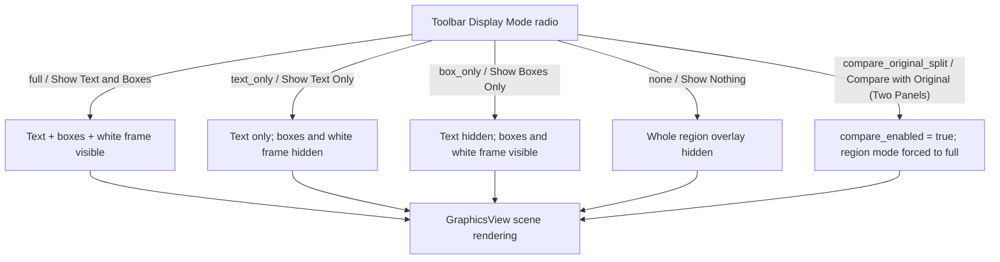
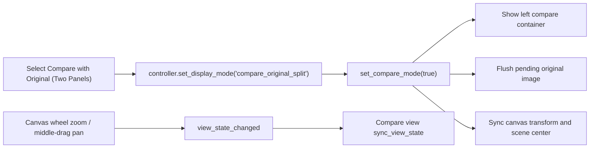

# Display, Compare, and Arrange

Use this page when you need to check whether translated text hides the original artwork, verify inpainting/cleanup results, or arrange multiple text regions into aligned rows and columns. It documents switching canvas display modes, enabling the two-panel original comparison, and aligning or distributing selected regions. This page only covers “how it is displayed” and “how it is arranged”; the toolbar menu structure, zoom scaling, and the five editor toggles live in [Editor Toolbar and Menus](./toolbar-and-menus.md), region selection and dragging in [Canvas Tools and Selection](./canvas-tools-and-selection.md), and text/style editing in [Text Properties](./text-properties.md) and [Style Properties](./style-properties.md).

## Feature boundary

- “Display Mode” (`Display Mode`) is an exclusive radio selection that changes only the visibility of the text-region overlays on the canvas (text, box outlines, white frame). It never modifies region data and is not an export parameter.
- “Compare with Original (Two Panels)” (`Compare with Original (Two Panels)`) adds a read-only original-image preview to the left of the editing canvas; the right canvas renders in “Show Text and Boxes” mode so you can view the original and the current edit at the same time.
- The “Original Image Opacity:” (`Original Image Opacity:`) slider controls only the transparency of the original-image overlay on the canvas, letting you switch between “view the inpainted/cleaned result” and “view the original”. It is not an export parameter.
- “Arrange” (`Arrange`) only moves selected text regions (it updates each region `center`); it never changes text content, style, or region size.
- This page does not cover menu expansion, shortcuts, zoom scaling, or persistence of the five toggles (see [Editor Toolbar and Menus](./toolbar-and-menus.md)), nor mask/brush/clone-stamp tools (see [Mask, Paint, and Clone Stamp](./mask-paint-and-clone-stamp.md)).

## UI operations

### Switch display modes

1. Open “Display Mode” (`Display Mode`) on the editor toolbar.
2. Pick one of the five exclusive options: `Show Text and Boxes`, `Show Text Only`, `Show Boxes Only`, `Show Nothing`, or `Compare with Original (Two Panels)`.
3. The switch takes effect immediately: only the text/box overlay visibility changes; region data and the image itself never change.
4. With “Show Nothing” (`Show Nothing`) the region overlays are hidden, so you cannot click regions on the canvas; switch back to another display mode to continue editing on the canvas.

### Compare with the original in two panels

1. Open “Display Mode” and choose “Compare with Original (Two Panels)” (`Compare with Original (Two Panels)`).
2. The editing canvas stays on the right and a read-only original preview appears on the left; the right canvas automatically renders in “Show Text and Boxes” mode.
3. The two panels share zoom and pan: scrolling to zoom or middle-dragging on the canvas moves the left preview in sync.
4. Reopen “Display Mode” and pick another option to leave comparison; the left panel hides.

### Adjust original image opacity

- Drag the “Original Image Opacity:” (`Original Image Opacity:`) slider on the toolbar, range 0–100.
- `0` makes the original overlay fully transparent (you see the inpainted/cleaned background, or the canvas background when no inpainted image exists); `100` makes it fully opaque (you see the original/working image).
- The control starts at `0`. After a document loads, it stays at `0` when an inpainted image exists (showing the inpainted result), otherwise it switches to `100` (showing the original). After automatic inpainting completes it also returns to `0`, unless you have already moved the slider manually.

### Align and distribute text regions

1. Select regions on the canvas: at least 1 with the canvas reference, at least 2 with the selection reference, and at least 3 for spacing distribution. Menu items stay disabled when the requirement is not met.
2. Open “Arrange” (`Arrange`) and choose a reference first: “Reference: Selection” (`Reference: Selection`, default) or “Reference: Canvas” (`Reference: Canvas`).
3. Click one of the six alignment items (`Align Left`, `Align Horizontal Center`, `Align Right`, `Align Top`, `Align Vertical Center`, `Align Bottom`) to align.
4. Or click “Distribute Vertical Spacing” (`Distribute Vertical Spacing`) or “Distribute Horizontal Spacing” (`Distribute Horizontal Spacing`) to equalize the gaps between selected regions.
5. The menu stays open after a click, so you can change the reference and repeat align/distribute actions; each align/distribute is a single batch command that `Ctrl+Z` undoes as a whole.

### Fit the canvas to the window

Click “Fit to Window” (`Fit to Window`) on the toolbar to scale the current image to fill the canvas viewport while keeping its aspect ratio. It only changes the view, never region data; zoom scaling and wheel-zoom details live in [Editor Toolbar and Menus](./toolbar-and-menus.md).

## Option matrix

| UI call key | English actual value | Simplified Chinese actual value |
| --- | --- | --- |
| `Display Mode` | Display Mode | 显示模式 |
| `Show Text and Boxes` | Show Text and Boxes | 文字文本框显示 |
| `Show Text Only` | Show Text Only | 只显示文字 |
| `Show Boxes Only` | Show Boxes Only | 只显示框线 |
| `Show Nothing` | Show Nothing | 都不显示 |
| `Compare with Original (Two Panels)` | Compare with Original (Two Panels) | 与原图对比（双栏） |
| `Original Image Opacity:` | Original Image Opacity: | 原图不透明度: |
| `Fit to Window` | Fit to Window | 适应窗口 |
| `Arrange` | Arrange | 排列 |
| `Reference: Selection` | Reference: Selection | 参照：选区 |
| `Reference: Canvas` | Reference: Canvas | 参照：画布 |
| `Align Left` | Align Left | 左对齐 |
| `Align Horizontal Center` | Align Horizontal Center | 水平居中 |
| `Align Right` | Align Right | 右对齐 |
| `Align Top` | Align Top | 顶对齐 |
| `Align Vertical Center` | Align Vertical Center | 垂直居中 |
| `Align Bottom` | Align Bottom | 底对齐 |
| `Distribute Vertical Spacing` | Distribute Vertical Spacing | 垂直间距分布 |
| `Distribute Horizontal Spacing` | Distribute Horizontal Spacing | 水平间距分布 |

Every key above has an actual value in both `en_US.json` and `zh_CN.json`. The stored values of display mode and arrange (`full`, `text_only`, `box_only`, `none`, `compare_original_split`; references `selection`/`canvas`; alignments `left`/`horizontal_center`/`right`/`top`/`vertical_center`/`bottom`; distributions `spacing_v`/`spacing_h`) are used only by signals and the controller and never shown as UI text.

## Runtime behavior

### How display modes control the canvas {#display-mode-mechanism}

The controller maps a display mode into two signals: `compare_enabled` and `region_display_mode`. Comparison forces the region mode to `full`; every other mode becomes the region mode directly. When the canvas receives `region_display_mode_changed`, it toggles the three-level visibility (text, box outlines, white frame) of each region item.

Display modes only toggle overlay visibility; the base image and region data never change.

### How the compare panel stays in sync {#compare-sync}

The compare panel `OriginalCompareView` is a read-only `QGraphicsView`: `setInteractive(False)`, it never takes focus, and it has no scroll bars. On document load the original image is read in the background (`_load_compare_image` loads the raw `source_path`; when the source and display image share the same path it reuses the display image). Images larger than 3,000,000 pixels are downsampled before display. Every canvas zoom/pan emits `view_state_changed` (transform + scene center), and the compare view aligns its viewport with the same transform and center; when switching images the new original is cached as pending and flushed only while comparison is visible.

### Layer meaning of original-image opacity {#opacity-layers}

The canvas stacks layers by z-order: the inpainted image is the bottom layer at `z=1`, the original/working image is the overlay at `z=2`, followed by paint at `z=5`, stamp at `z=6`, and text regions at `z=100`. The slider value divided by 100 is stored as the model `original_image_alpha` and applied as the overlay `setOpacity` value:

| Slider value | Overlay opacity | What the canvas actually shows |
| --- | --- | --- |
| `0` | Fully transparent | Inpainted/cleaned background; canvas background when no inpainted image exists |
| `100` | Fully opaque | Original/working image |

On document load, before any manual adjustment, the default opacity depends on whether an inpainted image exists: `0` when it does, otherwise `1`; automatic inpainting also returns it to `0`. After you move the slider manually, `_user_adjusted_alpha` is set and later automatic flows no longer override your setting.

### Alignment and distribution geometry {#arrange-geometry}

Both alignment and distribution take the white-frame reference points (left/right/top/bottom/center) of each region in world coordinates as input and only shift the region `center`. The target line uses either the selected regions’ white-frame bounding box or the image scene rectangle (`min`/`max`/midpoint):

| Alignment action | Selection-reference target | Canvas-reference target |
| --- | --- | --- |
| Align Left `Align Left` | Bounding-box `min_x` | Image rect `min_x` |
| Align Horizontal Center `Align Horizontal Center` | Bounding-box horizontal midpoint | Image horizontal midpoint |
| Align Right `Align Right` | Bounding-box `max_x` | Image rect `max_x` |
| Align Top `Align Top` | Bounding-box `min_y` | Image rect `min_y` |
| Align Vertical Center `Align Vertical Center` | Bounding-box vertical midpoint | Image vertical midpoint |
| Align Bottom `Align Bottom` | Bounding-box `max_y` | Image rect `max_y` |

Spacing distribution sorts regions by their reference value, keeps the two ends fixed, computes “total span − sum of region sizes” as the total gap and divides it by `n-1`, then places each inner region at “previous region’s far edge + equal gap”. The result is equal whitespace between regions, not equally spaced centers. All results are packed into one `MultiRegionUpdateCommand` batch command that can be undone as a whole; the white frames and text move immediately instead of waiting for the debounced render.

## Dependencies and conflicts

- Display modes affect overlay visibility only: with “Show Nothing” the region overlays are hidden and you cannot click regions on the canvas; with “Show Text Only” the outlines are hidden and region boundaries are not visible.
- Comparison forces the right canvas to `full`: even if you previously chose “Show Text Only”, text and boxes are shown while comparing; leaving comparison requires picking another display mode again, it is not restored automatically.
- Alignment/distribution depends on the selection count and the reference: canvas reference ≥1, selection reference ≥2, spacing distribution ≥3; menu items are disabled otherwise. Multi-selection is covered in [Canvas Tools and Selection](./canvas-tools-and-selection.md).
- Align/distribute only modifies region `center`, which triggers a model update and region rebuild; it is a position operation and never changes text content, style, or size.
- “Original Image Opacity” is not an export parameter: export goes through the export service, and the opacity only affects canvas viewing. File semantics for inpainted images and `editor_base` live in [Import/Export and Writeback](./import-export-and-writeback.md).
- The large-image compare preview is downsampled to at most 3,000,000 pixels, so at extreme zoom the left preview may look less sharp than the canvas; this affects preview only, not export.
- Display mode, opacity, and comparison state are kept in the editor session and never written to a configuration file; reopening the editor returns them to defaults.

## Related files and formats

| File/format | Role on this page | Manual-edit and compatibility notes |
| --- | --- | --- |
| `manga_translator_work/editor_base/` | Working image for editing; when present and not stale the canvas shows it, while the compare panel still shows the raw source image | A stale `editor_base` is deleted and falls back to the original; never copy private paths |
| `manga_translator_work/inpainted/` | Inpainted image; its presence decides the default “Original Image Opacity” after load | Missing inpainted images are handled as “no inpainted image”; real user images are never read |
| `manga_translator_work/paint_overlay/` | Paint layer | Unrelated to display/arrange; visible only when layered on the canvas |
| `*_translations.json` | Persists region data and `center` | The `center` modified by align/distribute is saved/written back with the region data |
| `desktop_qt_ui/locales/en_US.json` / `zh_CN.json` | Translations for display mode, arrange, and the persistent controls | All keys listed on this page have both values; missing keys are marked honestly |

## Mermaid data-flow limits

The flowcharts and tables above describe source-confirmed control flow and geometry; they do not represent real user images or network requests. Scenarios such as no selection, no image, downsampling, or no inpainted image have their own branches. This page contains no fabricated runtime screenshots or private task artifacts.

## Source evidence {#source-evidence}

| Layer | File | Verified on this page |
| --- | --- | --- |
| UI | `desktop_qt_ui/ui/widgets/editor_toolbar.py` | Display-mode radio, arrange menu and reference radio, align/distribute enablement, opacity slider, fit-to-window |
| View wiring | `desktop_qt_ui/ui/editor/view.py` | Compare container creation/hiding, `set_compare_mode`, view-state sync, align/distribute signal wiring |
| Canvas rendering | `desktop_qt_ui/ui/editor/graphics_view_layers.py`, `graphics_items.py`, `graphics_view_input.py` | Layer z-order, original opacity, text/box/white-frame visibility, zoom and fit-to-window |
| Compare view | `desktop_qt_ui/ui/editor/original_compare_view.py` | Read-only preview, 3,000,000-pixel downsample cap, transform/center sync |
| Controller | `desktop_qt_ui/editor/editor_controller.py` | `set_display_mode`, `set_original_image_alpha`, `align_regions`, `distribute_regions` |
| Geometry | `desktop_qt_ui/editor/alignment_service.py` | White-frame reference points, target lines, alignment and spacing-distribution formulas |
| Model/session | `desktop_qt_ui/editor/editor_model.py`, `session.py` | Region display mode, original image alpha, compare image |
| Document load | `desktop_qt_ui/editor/document_load_worker.py`, `controller_document_service.py` | Compare-image loading, default opacity, `_user_adjusted_alpha` |
| UI/i18n | `desktop_qt_ui/locales/en_US.json`, `zh_CN.json` | Key mapping and actual English/Chinese values |

## Verification {#verification}

| Verification | Status | Notes |
| --- | --- | --- |
| BLUEPRINT, PAGE_GUIDELINES, TODO | Done | Fully read and written per the page contract (section 1.3, subsection 5.10) |
| UI layout and calls | Done | Static review of toolbar, view, compare panel, and align/distribute services |
| `en_US` / `zh_CN` actual locale | Done | Table records key, English, and Simplified Chinese values item by item |
| Display/compare/arrange runtime chain | Done | Static review of display-mode visibility, compare sync, layer opacity, and geometry |
| Sanitized runtime verification | Deferred | This page read no real user images, secrets, or private task artifacts |
| VitePress | Pending | The coordinator runs `npm run docs:build --prefix doc/wiki` plus mirror/source checks before merge |