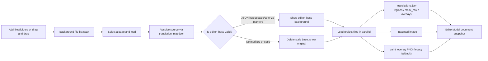
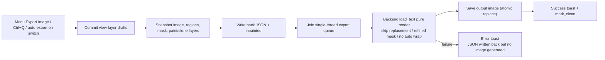
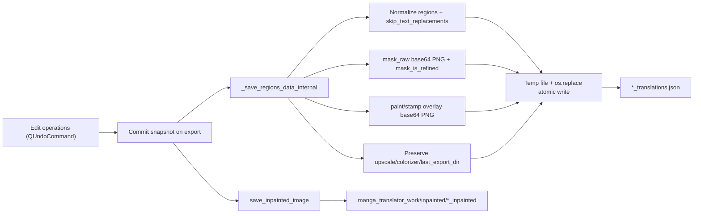

# Editor Import/Export and Writeback

The editor loads the project data produced by the translation pipeline so you can adjust text, geometry, style, masks, and paint/clone layers region by region. When you finish editing, one “Export Image” action renders the current page to a final image and writes the project data back to disk. This guide covers the import formats, the rendering and output-path rules for export, and how JSON and inpainted images are written back.

The right-panel file list (add/remove/switch pages and entering the editor after a completed task) is covered by [Layout and File List](./layout-and-file-list.md); the “Export Image” menu item and the “Auto Export on Image Switch” toggle are covered by [Toolbar and Menus](./toolbar-and-menus.md); shortcut dispatch such as `Ctrl+Q` is covered by [Shortcuts](./shortcuts.md); and how masks and paint/clone layers enter project files is covered by [Mask Painting and Clone Stamp](./mask-paint-and-clone-stamp.md).

## What you can do {#feature-boundary}

- This guide covers the data boundary between the editor and disk: which project files are read on import, what is rendered and where it is written on export, and the formats of the written-back data.
- It does not cover the right-panel file-list buttons, tree display, or row states (see [Layout and File List](./layout-and-file-list.md)); it does not cover the “Export Image” menu item or the “Auto Export on Image Switch” toggle’s UI and persistence (see [Toolbar and Menus](./toolbar-and-menus.md)).
- Editor export is not a full re-run of the translation pipeline: it renders the current snapshot directly and does not re-run detection, OCR, translation, colorization, or upscaling; the mask is treated as refined and the inpainted image is reused.
- The translation page’s “Import Translation and Render” workflow shares the same `_translations.json` format with the editor, but the entry points differ: that is a translation-page workflow, while the editor reads project data automatically when a file is loaded from its list.
- This page never shows real user images, project JSON, secrets, or private paths; formats are described with key names and sanitized structures only.

## Use it in the editor {#ui-operations}

### Import images and project data {#import-images-and-project-data}

1. In the right panel, click “Add Files”, “Add Folder”, or drag and drop files/folders to add images to the page list; the full list-button operations are covered by [Layout and File List](./layout-and-file-list.md).
2. Click a row (or press `A`/`D` to switch pages) to load that image: the editor reads the associated `*_translations.json`, inpainted image, and paint layers in the background, then shows the canvas for editing.
3. After a translation task finishes, the main window shows a “Task Completed” confirmation; choosing “Yes” enters the editor and opens the source image behind the result (resolved through `translation_map.json` or this task’s output mapping).

### Export the current image {#export-current-image}

1. Open the “Menu” dropdown in the toolbar and click “Export Image”, or press `Ctrl+Q`.
2. The editor first flushes pending drafts such as the floating rich-text editor, then writes back the project data and enters the export queue; a progress toast is shown while exporting and a success toast appears when finished.
3. With “Auto Export on Image Switch” enabled, switching to the next page exports the current page first; a rejected automatic export aborts the switch.

### Unsaved changes and page switching {#unsaved-changes-and-switching}

With “Auto Export on Image Switch” disabled, switching pages while the current page has unsaved edits shows a three-button dialog (hardcoded Chinese in the source):

| Button | Behavior |
| --- | --- |
| Export Image | Exports the current page first and loads the target page only after a successful export; no switch if export is rejected or fails |
| Don’t Save | Discards the unsaved edits and loads the target page directly |
| Cancel | Aborts the switch and stays on the current page |

## Import: files and project data {#import-files-and-project-data}

The loadable page-image extensions match the main list: `.png`, `.jpg`, `.jpeg`, `.jfif`, `.webp`, `.avif`, `.bmp`, `.tiff`, `.tif`, `.heic`, `.heif`.

### Import flow {#import-flow}

## Export: rendering, output paths, and queue {#export-rendering-output-and-queue}

### What export does {#what-export-does}

“Export Image” does not re-run detection/OCR/translation/colorization/upscaling. It hands the current snapshot to the backend `load_text` render directly: `translator='none'`, `load_text=True`, `save_text=False`; the mask is treated as refined (`mask_is_refined`) and the inpainted image is reused; the export config also forces `render.disable_auto_wrap=True` because the text boxes were laid out by the user.

Two persistence steps happen before rendering: the project data is written back to `*_translations.json` (see [Writeback: JSON and inpainted image](#writeback-json-and-inpainted)), and the current inpainted image (the base image when none exists) is written to the `_inpainted` file so the backend `load_text` skips its own inpainting step. Only then is the render job added to the export queue.

### Output path and filename {#output-path-and-filename}

The output directory is chosen in this order:

1. `last_export_dir` recorded in the image’s JSON (the last export directory).
2. When `cli.save_to_source_dir` is enabled: `<source-dir>/manga_translator_work/result`.
3. `app.last_output_path` (when set and valid).
4. The source image’s directory.

Filename rules: when `cli.format` is non-empty and not “不指定”, its extension (lowercased) is used; otherwise the source extension is kept; if neither exists, `.png` is used. Image quality comes from `cli.save_quality`. When `cli.export_editable_psd` is enabled, an editable PSD is also exported to `manga_translator_work/psd/` after rendering (`cli.psd_script_only` exports the script only).

### Export queue and “saved” semantics {#export-queue-and-clean-state}

Export is an asynchronous single-threaded queue (`ThreadPoolExecutor(max_workers=1)`):

- Automatic exports for the same image are coalesced: submitting a new one cancels the previous not-yet-started automatic export for that image; manual exports are not coalesced.
- Once the project data is written back, the job is queued and `mark_clean()` is called (QUndoStack clean state). “Unsaved” is therefore determined by whether the export was queued, not by whether rendering eventually succeeded; on render failure the JSON is already written back, no output image is produced, and an error toast is shown.
- While exporting, the toast reads “正在导出…” or “正在导出（N 个任务）”; on success it reads “导出成功\n{output-path}\n已同步 JSON”; on failure it reads “{filename} 导出失败：{reason}”.
- Closing the app with unfinished jobs first shows the “导出任务尚未完成” confirmation; choosing “Yes” drains the export queue before exiting, and choosing “No” cancels the close.

### Export flow {#export-flow}

## Writeback: JSON and inpainted image {#writeback-json-and-inpainted}

### JSON writeback {#json-writeback}

On export, `EditorControllerExportService.save_editor_json()` writes the current snapshot to the `*_translations.json` found by `find_json_path()`:

- The top-level key is the absolute source path; `regions` are normalized by `_normalize_regions_for_backend`: missing `translation`, `texts`, `font_size`, `angle`, `target_lang`, `language`, and `direction` are filled, `fg_colors`/`fg_color` tuples become hex `font_color`, and `v`/`h` become `vertical`/`horizontal`.
- `skip_text_replacements: true` is always written: the editor’s `translation` field is the final post-replacement text (`translation_raw` holds the pre-replacement text), so the backend render must not replace it again.
- When a mask exists, `mask_raw` (base64 PNG) is written with `mask_is_refined: true`, so the backend skips mask refinement.
- Non-empty paint/clone layers are written as base64 PNG (RGBA) keys `paint_overlay` / `stamp_overlay`.
- Existing upscale/colorize markers and `last_export_dir` are preserved (`preserve_existing_preprocess_flags`) so the next export does not lose the background-source markers.
- Writes use a temp file in the same directory plus `os.replace` for atomic replacement, so the backend never reads a half-written JSON.

### Inpainted writeback {#inpainted-writeback}

`save_inpainted_image()` writes the current inpainted image (the base image when none exists) to `manga_translator_work/inpainted/<image-name>_inpainted.<ext>` with quality from `cli.save_quality`, again using temp file + `os.replace`. If the backend regenerates an inpainted image during rendering, it also writes it back to the same path (`_persist_backend_inpainted_image`), so the next editing session sees the newest inpaint result.

### Writeback flow {#writeback-flow}

## Limitations and notes {#dependencies-and-conflicts}

- Editor export forces `disable_auto_wrap=True`, so the result is not affected by auto-wrap settings such as AI line breaking; text-box size and position are taken from the editor.
- `translation` is always the final post-replacement text: legacy JSON without `translation_raw` is backfilled from `translation` on load, and `skip_text_replacements` prevents double replacement on writeback.
- External writebacks such as batch management modify the JSON, but the editor keeps regions in memory and does not watch file changes; after a batch writeback the batch panel calls `load_image_and_regions` to reload the editor, otherwise the auto-export on switch would overwrite the new data with stale memory. See [Batch Management: Preview, Apply, and Restore](../batch-management/preview-apply-restore.md).
- Auto-export on switch depends on the export queue: a rejected automatic export aborts the switch, and a manual export makes the switch wait for completion.
- `editor_base` is valid only when the JSON has upscale/colorize markers; without them the editor deletes the stale base and falls back to the original to avoid showing a background that does not match the current JSON.
- When the JSON does not exist, export creates it (`get_json_path(create_dir=True)` when `find_json_path` returns nothing); writes land in the new location, while legacy same-directory JSON remains readable but is no longer the write target.
