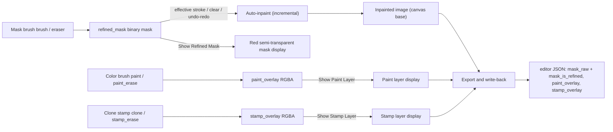
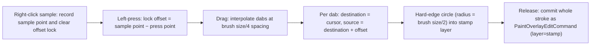

# Mask Painting and Clone Stamp

When the auto-generated repair mask misses text ghosts, covers too much background, or the image still has watermarks, grids, or bubble lines that need manual removal, switch to the mask brush, color brush, or clone stamp in the “Image Editing” group on the left side of the editor and retouch the image directly on the canvas. This page explains the write targets, display controls, auto-inpainting trigger, undo, and persistence format of these three tool families. Tool entry points, pointer semantics, zoom/panning, and selection are covered in [Canvas Tools and Selection](./canvas-tools-and-selection.md); the inpainter model and its parameters are covered in [Settings → Mask and Inpainting](../settings/mask-and-inpainting.md); shortcuts and focus rules are covered in [Shortcuts](./shortcuts.md).

## Feature boundary

- The mask brush (`brush`) and eraser (`eraser`) edit the **refined mask** (`refined_mask`, a binary 0/255 array), not the raw mask produced by detection. Each effective stroke commits one `MaskEditCommand` and triggers one auto-inpaint pass.
- The color brush (`paint`, `paint_erase`) writes the **paint layer** (`paint_overlay`, RGBA); the clone stamp (`clone`, `stamp_erase`) writes the **stamp layer** (`stamp_overlay`, RGBA). These two layers are independent transparent layers above the inpainted image and never enter mask binarization.
- “Clear All Masks” (`Clear All Masks`) clears the refined mask (falling back to the raw mask when no refined mask exists); “Clear Paint Layer” (`Clear Paint Layer`) and “Clear Stamp Layer” (`Clear Stamp Layer`) clear the corresponding RGBA layers. All three go through undoable commands.
- This page does not cover tool-button switching, selection, zoom/pan, context menus, or shortcut registration (see [Canvas Tools and Selection](./canvas-tools-and-selection.md) and [Shortcuts](./shortcuts.md)), nor the global inpainter model, size, precision, and per-block settings (see [Settings → Mask and Inpainting](../settings/mask-and-inpainting.md)).

## UI operations

### Choose the layer and tool in the Property Editor

After opening the editor, the left panel defaults to “Property Editor” (`Property Editor`). The “Image Editing” (`Image Editing`) group offers three tabs, `Mask`, `Paint`, and `Clone Stamp`; each tab provides a set of mutually exclusive tool buttons. All three tabs share one button group, so checking a tool on any tab unchecks the buttons on the other tabs. When you switch tabs and the current tool does not belong to the new tab, the active tool is reset to that tab’s “No Selection” (`No Selection`) button, avoiding cross-tab tool conflicts. The three tabs also share one “Brush Size:” (`Brush Size:`) field.

### Mask tab: brush and eraser

1. Open the “Mask” (`Mask`) tab.
2. Click “Brush” (`Brush`) or “Eraser” (`Eraser`); alternatively press `W` / `E` to switch without opening the panel.
3. Drag the “Brush Size:” (`Brush Size:`) slider to adjust stroke thickness; the range is 5–200 with an initial value of 30. On the canvas, `Shift+wheel` adjusts the same field by ±1 per notch.
4. Press and drag the left button on the canvas: the brush writes 255 at the stroke position, and the eraser clears the stroke position to 0. On release, the whole stroke is committed as one undoable command and triggers one auto-inpaint pass.
5. Check “Show Refined Mask” (`Show Refined Mask`) to display the refined mask as a semi-transparent red overlay on the canvas; click “Clear All Masks” (`Clear All Masks`) to clear the refined mask entirely.

### Paint tab: color brush

1. Open the “Paint” (`Paint`) tab.
2. Choose “Brush” (`Brush`) or “Eraser” (`Eraser`): the former writes the color chosen in “Brush Color:” (`Brush Color:`) into the paint layer, and the latter erases the paint layer.
3. The brush color defaults to `#ffffff` (white). Click the color button to open the “Select brush color” (`Select brush color`) dialog; an empty value is normalized to `#ff0000`.
4. “Show Paint Layer” (`Show Paint Layer`) only controls whether the paint layer is displayed; it never deletes data and is checked by default. “Clear Paint Layer” (`Clear Paint Layer`) clears the whole layer and can be restored with undo.

### Clone Stamp tab: sampling and stamping

1. Open the “Clone Stamp” (`Clone Stamp`) tab and select “Clone Stamp” (`Clone Stamp`; the English display value is `Clone`).
2. **Right-click** on the canvas at the source position you want to copy to sample it. While the clone stamp is active, right-click no longer opens the context menu.
3. Press and drag with the **left button** to paint: at the moment the stroke starts, the offset is locked as “sample point − press point”, and the source position then follows the cursor while keeping that offset. Each dragged point stamps source pixels into the stamp layer.
4. To correct mis-stamps, choose “Eraser” (`Eraser`) on the same tab and press-drag to erase the stamp layer.
5. Check “Show Stamp Layer” (`Show Stamp Layer`) to control stamp-layer visibility; it is checked by default. Click “Clear Stamp Layer” (`Clear Stamp Layer`) to clear the whole layer; this can be restored with undo.

### Control texts

| UI call key | English actual value | Simplified Chinese actual value |
| --- | --- | --- |
| `Property Editor` | Property Editor | 属性编辑 |
| `Image Editing` | Image Editing | 图像编辑 |
| `Mask` | Mask | 蒙版 |
| `Paint` | Paint | 画笔 |
| `Clone Stamp` | Clone | 印章 |
| `No Selection` | No Selection | 不选择 |
| `Selection Tool` | Selection Tool | 选择工具 |
| `Brush` | Brush | 画笔 |
| `Brush Tool` | Brush Tool | 画笔工具 |
| `Eraser` | Eraser | 橡皮擦 |
| `Eraser Tool` | Eraser Tool | 橡皮擦工具 |
| `Brush Size:` | Brush Size: | 笔刷大小: |
| `Brush Color:` | Brush Color: | 画笔颜色： |
| `Show Refined Mask` | Show Refined Mask | 显示优化蒙版 |
| `Clear All Masks` | Clear All Masks | 清除所有蒙版 |
| `Show Paint Layer` | Show Paint Layer | 显示画笔层 |
| `Clear Paint Layer` | Clear Paint Layer | 清除画笔图层 |
| `Show Stamp Layer` | Show Stamp Layer | 显示印章层 |
| `Clear Stamp Layer` | Clear Stamp Layer | 清除印章层 |
| `Select brush color` | Select brush color | 选择画笔颜色 |
| `Clone Stamp Hint` | Clone stamp: right-click to sample, left-drag to paint | 仿制印章：右键取样，左键拖动涂抹 |

The English display value of `Clone Stamp` is `Clone`, not `Clone Stamp`. The Simplified Chinese value of `Brush Size:` is `笔刷大小:` (half-width colon) while `Brush Color:` is `画笔颜色：` (full-width colon); both come from the locale files verbatim and are not typography differences.

## Layers and data flow

The data flow between tool buttons, write targets, display layers, and export is shown below. Mask-family tools ultimately affect the refined mask and the auto-inpaint result; paint/stamp tools write two independent RGBA overlay layers that never enter mask binarization.

The inpainted image, paint layer, and stamp layer are all stacked above the base image on the canvas, with the text regions rendered on top. The clone stamp samples from exactly this “currently visible canvas content” (the inpainted image when present, otherwise the original, then the paint layer, then the stamp content already stamped in the current stroke), so content can be propagated within the same stroke.

## Runtime behavior

### Mask strokes and auto-inpainting

- `_build_stroke_mask` connects the press points into a round-cap polyline and converts the stroke to mask resolution using “brush size × mask/image size ratio”; the mask resolution follows `refined_mask`, falling back to base-image pixel size when no refined mask exists.
- On commit, the old and new masks are compared; only real changes construct a `MaskEditCommand` (storing the old/new pixel patch inside the change bounding box), executed through the `QUndoStack`.
- After a brush stroke, `force_inpaint_stroke(stroke_mask)` runs an incremental inpaint limited to the stroke bounding box (padded by 50 px) instead of re-running the whole image. After an eraser stroke, the `refined_mask_changed` signal computes “added/removed” areas from the cached mask snapshot and inpaints incrementally; removed areas are restored directly from the base image.
- Inpaint requests carry a generation number `_inpaint_request_generation`: a new stroke cancels and supersedes the unfinished old request, so with rapid successive strokes the canvas settles on the result of the latest request.
- The inpainter itself uses `inpainter`, `inpainting_size`, `inpainting_precision`, and `force_use_torch_inpainting` from settings, on `cuda` (when GPU is enabled and available) or `cpu`; see [Settings → Mask and Inpainting](../settings/mask-and-inpainting.md).
- Stroke preview colors: mask brush is semi-transparent red, eraser is semi-transparent blue, color brush uses the chosen color, paint/stamp erasers are semi-transparent cyan, and the clone stamp shows the real stamped pixels.

### Paint and stamp layers

- Both layers are `(H, W, 4)` RGBA uint8 arrays at runtime and always match the base-image pixel size; empty layers are hidden on display, and a commit that equals the old layer is skipped.
- `paint` writes the chosen color into RGB and sets alpha=255; `paint_erase`/`stamp_erase` set alpha to 0 at the stroke position (the array is not physically deleted).
- Each complete dragged stroke of the brush, eraser, or stamp eraser commits one `PaintOverlayEditCommand`, which also records only the changed bounding box; undo/redo restores only those pixels.

### Clone stamp algorithm

- The sample marker is a dashed circle at the top of the scene, with radius following the brush size. Before the offset is locked it stays at the sample point; after locking it follows the cursor, showing “source = cursor + offset”.
- Each single dab is a pixel-grid-aligned hard-edge circle that copies RGB from the composite source into the stamp layer and sets alpha to 255, so the edge does not depend on the drag direction.
- `Escape` or losing canvas focus cancels the in-progress stamping without committing.

### Display and clearing

- Mask display uses `build_mask_display_frame`: the binary mask becomes a premultiplied RGBA frame in red (255,0,0) with alpha=128, downsampled to at most 2 million pixels for preview. The refined mask sits at z=11 and the raw mask at z=10.
- The paint layer sits at z=5 and the stamp layer at z=6, both above the inpainted image (z=1) and below the text regions. “Show Paint Layer / Show Stamp Layer” only toggles `layer_visible` and never deletes data.
- “Clear All Masks” clears the refined mask and then triggers auto-inpainting as usual; “Clear Paint Layer / Clear Stamp Layer” commit a clear command when the layer has content and return immediately for empty layers.

## Undo and redo

Mask strokes, clearing all masks, paint/stamp strokes, and layer clearing all enter the same `QUndoStack`:

- `MaskEditCommand`: undo/redo writes `refined_mask` back through the patch or the full array. The write-back also emits `refined_mask_changed`, so undoing/redoing a mask edit re-triggers auto-inpainting.
- `PaintOverlayEditCommand`: `layer='paint'` acts on the paint layer and `layer='stamp'` on the stamp layer; undo/redo only changes pixels of the corresponding layer and never triggers inpainting.
- The undo granularity is the whole stroke, not an individual dab; the focus rules for `Ctrl+Z`/`Ctrl+Y` are covered in [Shortcuts](./shortcuts.md).

## Dependencies and conflicts

- Mask-family tools depend on the inpainter configuration being loadable (model, size, precision). If loading fails or the model is missing, the mask still updates but the inpainted image does not refresh and an error is logged.
- The left button of brush-like tools always draws; it cannot select or drag regions. Switch back to “No Selection” (`No Selection`) for region operations.
- Switching tabs resets the active tool to the new tab’s “No Selection”, so the mask brush and the color brush are never active at the same time.
- `Shift+wheel` adjusts the shared brush size (5–200) shared by all three tabs and never zooms the canvas; `Ctrl+wheel` adjusts the font size of selected regions. Both belong to [Shortcuts](./shortcuts.md).
- While the clone stamp is active, right-click is occupied by sampling and the context menu is fully suppressed; `Escape`/focus loss discards uncommitted strokes.
- Stroke data is kept at full base-image resolution (RGBA layers are H×W×4), so very large images consume significant memory; display layers are downsampled, but dabs and stamps always run at full resolution.
- The paint/stamp layers and the refined mask are written into the project file on export; the export and write-back formats are covered in [Import, Export, and Write-back](./import-export-and-writeback.md).

## Related files and formats

| File/format | Actual role on this page | Manual-edit and compatibility note |
| --- | --- | --- |
| Session state `active_tool`, `brush_size`, `brush_color`, `display_mask_type` | Runtime state of tools and brush parameters | Defaults are `select`, `30`, `#ffffff`, `none`; kept only in editor-session memory and never written to config files |
| `refined_mask` / binary uint8 array | Read/write target of the mask brush and eraser | On export the edited mask is written to `mask_raw` (base64 PNG) with `mask_is_refined: true`, so the backend skips mask refinement |
| `paint_overlay` / `stamp_overlay` (RGBA uint8) | Write targets of the color brush and clone stamp | Exported as base64 PNG under the JSON keys `paint_overlay` / `stamp_overlay`; the legacy single-file PNG is only a paint-layer compatibility fallback |
| `*_translations.json` | Editor project persistence | Document the format and key names only; never show real user images or project files |

## Source evidence {#source-evidence}

| Layer | File | What was checked |
| --- | --- | --- |
| UI | `desktop_qt_ui/ui/widgets/property_panel.py` | Image-Editing group with three tabs, shared exclusive button group, brush size/color, display/clear controls, signals, and tab-switch reset |
| Session state | `desktop_qt_ui/editor/session.py`, `editor_model.py`, `editor_controller.py` | Defaults and signal forwarding of `active_tool`/`brush_size`/`brush_color`/`display_mask_type` |
| Canvas input | `desktop_qt_ui/ui/editor/graphics_view_input.py` | Stroke collection, mask writing, paint/stamp layer writing, clone sampling and dabs, previews, commit and cancel |
| Undo/redo | `desktop_qt_ui/editor/commands.py` | Patch storage and write-back of `MaskEditCommand` and `PaintOverlayEditCommand` |
| Auto-inpainting | `desktop_qt_ui/editor/controller_inpaint_service.py` | Incremental inpaint, generation cancel, `clear_all_masks`, layer clearing |
| Display layers | `desktop_qt_ui/ui/editor/mask_layer.py`, `overlay_layer.py`, `editor/image_utils.py` | Red mask display, paint/stamp z-values, downsampled previews |
| Persistence/export | `desktop_qt_ui/services/export_service.py`, `services/file_service.py`, `editor/document_load_worker.py`, `editor/controller_export_service.py` | `mask_raw`/`paint_overlay`/`stamp_overlay` disk write/read and in-memory payload pass-through |
| UI/i18n | `desktop_qt_ui/locales/en_US.json`, `zh_CN.json` | Keys and actual display values in both languages from the tables above |
| Wiring | `desktop_qt_ui/ui/editor/view.py`, `desktop_qt_ui/app_logic.py` | Property-panel signals to the controller; app logic holds no mask/brush runtime state (only inpainter config and shutdown cleanup) |

## Verification {#verification}

| Check | Status | Notes |
| --- | --- | --- |
| BLUEPRINT, PAGE_GUIDELINES, TODO | Complete | Read in full and followed the page contract; the page TODO stays `[未开工]` and is ticked by the coordinator |
| UI layout and calls | Complete | Statically checked the three property-panel tabs, view signal wiring, and canvas input branches |
| `en_US` / `zh_CN` actual locales | Complete | The table records key, actual English, and actual Simplified Chinese values, including `Clone Stamp`→`Clone` |
| Mask/paint/clone-stamp runtime chain | Complete | Statically checked stroke commits, incremental inpaint, stamp dabs, and undo commands |
| Sanitized runtime verification | Deferred | GUI not launched and no screenshots taken; no real user image, `.env`, key, or private project file was read |
| VitePress | Deferred | Coordinator should run `npm run docs:build --prefix doc/wiki` plus mirror/source checks before merge |