# Region List and Text Editing

When you need to check OCR results one by one, adjust a speech line, or re-recognize a text box in the editor, use the “Editable Translation” (`Editable Translation`) region list in the left panel and the “Text Content” (`Text Content`) section of the property panel. This page covers browsing the region list, find/replace, batch apply, source/translation editing in the property panel, and list synchronization; styles, rich text, masks, and import/export are covered on their own pages.

## Feature boundary {#feature-boundary}

- The left panel has two routes: “Editable Translation” (`Editable Translation`, the region list) and “Property Editor” (`Property Editor`, the property panel), with the latter shown by default. This page covers the full region-list interaction plus the “Text Content” (`Text Content`) and “Actions” (`Actions`) sections of the property panel.
- Each region-list row shows “number: source text” and an editable translation box. In-row edits are only list drafts; they reach the model only after you click “Apply All Translation Changes” (`Apply All Translation Changes`).
- The property-panel text section maintains three text fields: source `text`, final translation `translation`, and pre-replacement translation `translation_raw`. “Show Translation (Raw)” (`Show Translation (Raw)`) is checked by default; when checked you edit `translation_raw`.
- Not covered here: style settings (`Style Settings`) see [Style properties](./style-properties.md); the floating rich-text editor see [Floating rich text](./floating-rich-text.md); masks, paint, and clone stamp see [Mask paint and clone stamp](./mask-paint-and-clone-stamp.md); import/export and write-back see [Import, export, and write-back](./import-export-and-writeback.md); shortcuts see [Shortcuts](./shortcuts.md).

## UI operations {#ui-operations}

### Open the left panel and browse the region list {#open-region-list}

1. After opening an image in the editor, the left panel shows “Property Editor” (`Property Editor`) by default. Click “Editable Translation” (`Editable Translation`) to switch to the region list.
2. Each row shows the number plus source text in the form `1: source text`, plus an editable translation box. The translation box placeholder is a hardcoded Chinese literal “译文” without an i18n key, so there is no `en_US`/`zh_CN` pair and it does not switch with the language.
3. Clicking or rubber-band selecting regions on the canvas updates the model selection, which selects the matching list rows; clicking a list row sets that region as the current selection for the canvas and the property panel through the controller.
4. Editing a row's translation only changes the list draft; clicking “Apply All Translation Changes” (`Apply All Translation Changes`) commits the changed rows in a batch.

### Find/replace and apply all translation changes {#find-replace-apply}

1. Type the text to find in “Find” (`Find`) and the replacement in “Replace with” (`Replace with`).
2. Click “Replace All” (`Replace All`) to run a plain-text replacement (`str.replace`, not regex) over the translation drafts of every list row; nothing happens when the find box is empty.
3. “Replace All” only edits drafts. After you click “Apply All Translation Changes” (`Apply All Translation Changes`), the controller collects all row translations, skips unchanged regions, and merges the changes into one undoable batch-update command.
4. A row that is being edited (has focus) is not overwritten when the model refreshes, so focus, cursor, and IME composition are preserved.

### Edit text in the property panel {#edit-text-in-property-panel}

With a single selection, the “Text Content” (`Text Content`) section is enabled; with a multi-selection it is disabled while the style and action sections stay enabled.

1. The “Original Text:” (`Original Text:`) box writes back to the region source `text` field.
2. “Show Translation (Raw)” (`Show Translation (Raw)`) is checked by default: the “Translated Text:” (`Translated Text:`) box then edits `translation_raw`, and every change runs the replacement rules in real time to produce `translation`. Unchecking it edits the final `translation` instead.
3. The translation box shows line breaks as `↵`; when saved, `↵` becomes the model-stored `[BR]`. When displayed, `[BR]`, ` `, `【BR】`, and real newlines are all converted to `↵`.
4. Click “Placeholder” (`Placeholder`) to insert the full-width underscore `＿` at the cursor, or “Newline↵” (`Newline↵`) to insert `↵`.
5. The “Character count: 0” (`Character count: 0`) label is a static string in the source; there is no dynamic character-counting logic (see [Verification](#verification)).
6. Pick an entry in “OCR Model:” (`OCR Model:`) and click “Recognize” (`Recognize`) to re-run OCR on the current selection; pick “Translator:” (`Translator:`) and “Target Language:” (`Target Language:`) and click “Translate” (`Translate`) to translate the current selection. The three dropdown options come from config display mappings, not fixed i18n enums.

### Copy, paste, and delete regions {#copy-paste-delete}

The “Actions” (`Actions`) section is available for both single and multi selection:

- “Copy” (`Copy`): copies the selected region data to the internal clipboard.
- “Paste” (`Paste`): with a single selection it pastes the style (keeping position and text, overwriting font, size, color, alignment, direction, line spacing, and letter spacing); with a multi-selection or no selection it pastes the whole region at the mouse position or a default offset.
- “Delete” (`Delete`): deletes the selected regions in one undoable action.

## Option matrix {#option-matrix}

| UI call key | English actual value | Simplified Chinese actual value |
| --- | --- | --- |
| `Editable Translation` | Editable Translation | 可编辑译文 |
| `Property Editor` | Property Editor | 属性编辑 |
| `Find` | Find | 查找 |
| `Replace with` | Replace with | 替换为 |
| `Replace All` | Replace All | 全部替换 |
| `Apply All Translation Changes` | Apply All Translation Changes | 应用所有译文修改 |
| `Text Content` | Text Content | 文本内容 |
| `Original Text:` | Original Text: | 原文: |
| `Show Translation (Raw)` | Show Translation (Raw) | 显示替换前译文 |
| `Translated Text:` | Translated Text: | 译文: |
| `Placeholder` | Placeholder | 占位符 |
| `Newline↵` | Newline↵ | 换行↵ |
| `Insert placeholder ＿` | Insert placeholder ＿ | 插入占位符 ＿ |
| `Insert newline` | Insert newline | 插入换行符 |
| `Character count: 0` | Character count: 0 | 字符数: 0 |
| `OCR Model:` | OCR Model: | OCR模型: |
| `Recognize` | Recognize | 识别 |
| `Translator:` | Translator: | 翻译器： |
| `Translate` | Translate | 翻译 |
| `Target Language:` | Target Language: | 目标语言： |
| `Actions` | Actions | 操作 |
| `Copy` | Copy | 复制 |
| `Paste` | Paste | 粘贴 |
| `Delete` | Delete | 删除 |

The following UI strings are hardcoded Chinese literals without i18n keys and are listed here as missing entries: the region-list translation placeholder “译文”, and the in-progress/completion toasts for OCR and translation (“正在识别...”, “正在翻译...”, “识别完成”, “翻译完成”, and similar) emitted by the controller, which are not part of a complete i18n table.

## Runtime behavior {#runtime-behavior}

### List synchronization flow {#list-sync-flow}

`EditorModel` is the single source of truth for region state; every region change goes through a model mutation that broadcasts a `RegionChange`. The region list refreshes minimally by kind (`reset`/`updated`/`inserted`/`removed`); incremental updates preserve uncommitted drafts and never overwrite a focused translation box.

```mermaid
flowchart LR
    A["Canvas click or rubber-band selection"] --> B["EditorModel.set_selection"]
    C["Click a region-list row"] -->|region_selected| D["EditorController.set_selection_from_list"]
    D --> B
    B -->|selection_changed| E["RegionListView.update_selection"]
    B -->|selection_changed| F["PropertyPanel.on_selection_changed"]
    F -->|translated_text_modified / translation_raw_modified / original_text_modified| G["EditorController text-update commands"]
    E -->|Apply All Translation Changes| H["EditorController.update_multiple_translations"]
    G --> I["MultiRegionUpdateCommand / UpdateRegionCommand"]
    H --> I
    I --> J["EditorModel.update_region / update_regions"]
    J -->|regions_changed| E
    J -->|regions_changed| F
    K["OCR / translation async results (located by stable region_id)"] --> L["EditorController.on_regions_update_finished"]
    L --> I
```

Sync-channel summary:

| Direction | Signal / action | Receiver | Key behavior |
| --- | --- | --- | --- |
| List → model selection | `region_selected` | `controller.set_selection_from_list` → `model.set_selection` | Clicking a row switches the canvas and property panel to that region |
| Model selection → list | `selection_changed` | `RegionListView.update_selection` | Selection changes from canvas/panel select matching list rows in reverse |
| Model regions → list | `regions_changed` | `RegionListView.on_regions_changed` | Kind-based incremental refresh; drafts preserved, focused rows not overwritten |
| List → model | “Apply All Translation Changes” | `controller.update_multiple_translations` | Collects drafts, skips unchanged regions, one undoable command |
| Property panel → model | text-modification signals | `controller.update_translated_text` etc. | Writes `translation`/`translation_raw`/`text` in real time |
| Async task → model | stable `region_id` lookup | `controller.on_regions_update_finished` | Inserts/deletes during the wait cannot write to the wrong target |

### Text fields and line-break storage {#text-fields-and-breaks}

| Field | Stored value | Purpose and write-back rule |
| --- | --- | --- |
| `text` | Source text string | Written back directly by the “Original Text:” box; region OCR results also write this field |
| `translation` | Final translation, including `[BR]` break markers | Consumed by rendering; direct edits overwrite `translation_raw` as well (rules are not reversible) |
| `translation_raw` | Pre-replacement translation | Edited when “Show Translation (Raw)” is checked; every change runs replacement rules to produce `translation`, falling back to raw text on failure |
| `translation_rich` | Rich-text document | Maintained by the floating rich-text editor or auto rich-text rules; dropped back to plain text when a full replacement has no reliable sync result |

Line-break conversion: when displaying, `[BR]`, ` `, `【BR】`, and real newlines are normalized to `↵`; when saving, `↵` becomes `\n` and is merged into `[BR]`. The renderer treats `[BR]` as a hard break and the replacement rules skip these markers so marker content is not replaced by accident. The legacy `<H>` local-horizontal protocol is removed: saving strips existing `<H></H>` tags (keeping the inner text), and the rendering pipeline no longer has an `<H>` consumer.

## Dependencies and conflicts {#dependencies-and-conflicts}

- The region list, property panel, and toolbar align/distribute buttons all listen to the same model selection instead of keeping their own copies; any change from one side refreshes the others.
- Focused list rows and property-panel text boxes are not overwritten by ordinary refreshes; only async write-backs (`source="async"`) force-refresh the text fields so a stale document cannot overwrite the model.
- `translation` and `translation_raw` are two fields of the same region, not two regions; “Show Translation (Raw)” only changes which field you edit.
- “Auto Apply Rich Text Rules While Editing” (`Auto Apply Rich Text Rules While Editing`) is controlled by an editor-menu toggle; rule definitions and render timing belong to the rich-text-rules pages.
- There are interactions with batch-management write-back and real-time replacement rules; batch write-back, `.bak`, and restore belong to the batch-management pages.
- When focus is in a text control, `Delete` does not delete regions and `Q`/`W`/`E`/`A`/`D` are forwarded as text instead of switching tools or images; see [Shortcuts](./shortcuts.md).

## Related files and formats {#related-files}

| File/format | Actual role on this page | Manual-edit and compatibility note |
| --- | --- | --- |
| `<image-dir>/manga_translator_work/json/<stem>_translations.json` | Region persistence: the `regions` array holds `text`, `translation`, `translation_raw`, and more | Editor changes are saved through export/write-back; this page never shows real user paths or images |
| Legacy `*_translations.json` | Backward-compatible read | Missing `translation_raw` is backfilled from `translation` so the “pre-replacement translation” box always has a value |
| `config/text_replacements.yaml` | Replacement rules | Applied in real time when editing `translation_raw`; falls back to raw text on failure |
| Rich-text-rules config files | Auto rich-text rules | Triggered by the “Auto Apply Rich Text Rules While Editing” toggle; covered by the rich-text-rules pages |
| `config/config.json` | App configuration (including editor toggles) | Never read or displayed from a real user file; no private absolute paths committed |

## Source evidence {#source-evidence}

| Layer | File | What was checked |
| --- | --- | --- |
| Region list | `desktop_qt_ui/ui/widgets/region_list_view.py` | Row structure, incremental sync, draft preservation, find/replace, selection echo |
| Property-panel text section | `desktop_qt_ui/ui/widgets/property_panel.py` | Text/action controls, `↵`/`[BR]` conversion, raw mode, write-back signals |
| View wiring | `desktop_qt_ui/ui/editor/view.py` | Left-panel routes, apply button, signal connections, language refresh |
| Model | `desktop_qt_ui/editor/editor_model.py`, `editor/session.py`, `editor/region_change.py` | Single source of truth for regions, `RegionChange` notifications |
| Controller | `desktop_qt_ui/editor/editor_controller.py` | Text/batch-update commands, raw replacement, async `region_id` write-back |
| Load/write-back | `desktop_qt_ui/editor/document_load_worker.py`, `editor/controller_document_service.py`, `services/file_service.py`, `editor/controller_export_service.py` | JSON reading, legacy-field backfill, export writing |
| Services | `desktop_qt_ui/services/ocr_service.py`, `translation_service.py` | Region OCR and translation requests |
| Final consumers | `manga_translator/rendering/text_replacements.py`, `manga_translator/rendering/__init__.py` | Replacement-rule application, `[BR]` break normalization |
| i18n | `desktop_qt_ui/locales/en_US.json`, `zh_CN.json` | Keys and actual bilingual values |

## Verification {#verification}

| Check | Status | Notes |
| --- | --- | --- |
| BLUEPRINT, PAGE_GUIDELINES, TODO | Complete | Read in full and followed the page contract |
| UI layout and calls | Complete | Statically checked region list, left-panel routes, property-panel text/action sections |
| `en_US` / `zh_CN` actual locales | Complete | Three-column table checked item by item; the “译文” placeholder and OCR/translation toasts are non-i18n Chinese literals |
| List sync and text write-back | Complete | Statically checked incremental sync, draft preservation, `region_id` async lookup, and `↵`/`[BR]` conversion |
| Character count | Deferred to runtime | `Character count: 0` is a fixed string in the static source with no dynamic counting logic found; needs a headed run to confirm |
| Sanitized runtime verification | Deferred | No real `.env`, user `config.json`, API key/token, username, user image, or private path was read |
| VitePress | Deferred | Coordinator should run `npm run docs:build --prefix doc/wiki` plus mirror/source checks before merge |