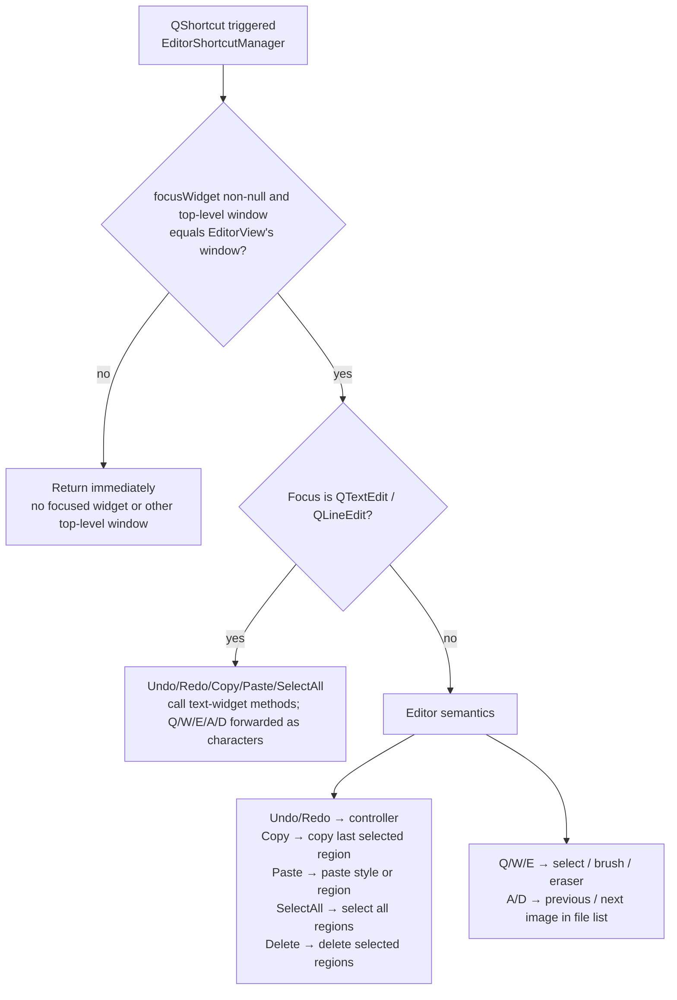
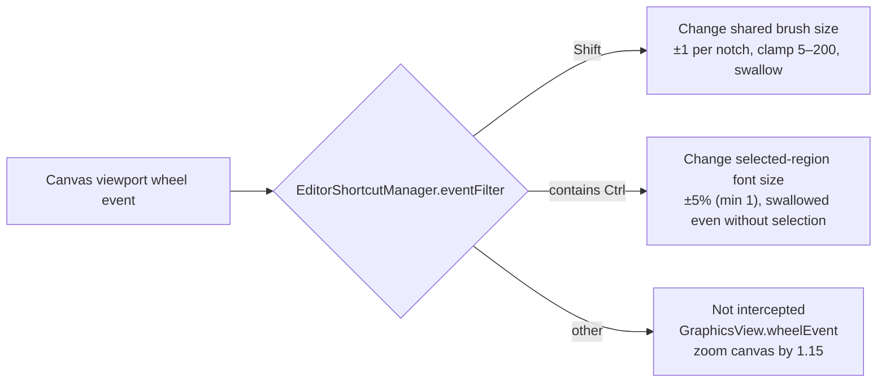

# Editor Shortcuts

Most high-frequency editor actions can be triggered with the keyboard or the mouse wheel: undo/redo, copy/paste/delete, switching canvas tools, switching images, and wheel combos for the brush size and the selected regions' font size. This page lists every shortcut and wheel combo actually registered by `EditorShortcutManager`, and explains who receives a key when focus is in a text widget, on the canvas, or in the floating rich-text window.

The full operations of the toolbar and menus, canvas tools, region list, property panels, and floating rich text live in [Toolbar and Menus](./toolbar-and-menus.md), [Canvas Tools and Selection](./canvas-tools-and-selection.md), [Region List and Text Editing](./region-list-and-text-editing.md), [Text Properties](./text-properties.md), [Style Properties](./style-properties.md), [Floating Rich Text](./floating-rich-text.md), and [Import/Export and Writeback](./import-export-and-writeback.md). This page only answers “which key does what”; it does not repeat those pages' control details.

## Feature boundary {#feature-boundary}

- All editor keyboard shortcuts are registered by `desktop_qt_ui/ui/editor/shortcut_manager.py#EditorShortcutManager`; the toolbar never registers `QAction` shortcuts and only appends hint text to the “Export Image”, “Undo”, and “Redo” menu items.
- `Undo`, `Redo`, `Copy`, `Paste`, `Select All`, and `Delete` are registered with `QKeySequence.StandardKey`; on Windows the primary bindings are `Ctrl+Z`, `Ctrl+Y`, `Ctrl+C`, `Ctrl+V`, `Ctrl+A`, and `Del`. The displayed mapping follows the Qt platform.
- `Ctrl+Q` (export), `Q`/`W`/`E` (tool switching), and `A`/`D` (image switching) are fixed literals and do not change across platforms.
- Wheel combos are handled by an event filter installed on the canvas viewport: `Shift+wheel` changes the shared brush size, any `Ctrl`-containing wheel combo changes the selected regions' font size, and a plain wheel is passed to `GraphicsView` to zoom the canvas.
- `Escape` or canvas focus loss cancels an in-progress box selection, drawing, text box, clone stamp, region drag, or middle-button pan without committing anything.
- Shortcut dispatch priority, from highest to lowest: focus in another top-level window (for example the floating rich-text window) → focus in a main-window text widget → focus on the canvas. The full conflict rules are in [Runtime behavior](#runtime-behavior).

## UI operations {#ui-operations}

### View shortcut hints in the Menu {#toolbar-hints}

Open the editor toolbar's “Menu” (`Menu`): “Export Image” (`Export Image`), “Undo” (`Undo`), and “Redo” (`Redo`) have `(Ctrl+Q)`, `(Ctrl+Z)`, and `(Ctrl+Y)` hint text appended by code. These hints are text only; the real shortcuts are registered by `EditorShortcutManager`.

### Keyboard shortcut reference {#shortcut-reference}

The following table lists every keyboard shortcut actually registered by `_setup_editor_shortcuts()`. Behavior differs when focus is in a text widget (`QTextEdit` or `QLineEdit`) versus on the canvas; with text focus, `Q`/`W`/`E`/`A`/`D` are forwarded to the widget as ordinary characters instead of switching tools or images.

| Registration name | Registered sequence | With focus in a text widget | Non-text focus (canvas) |
| --- | --- | --- | --- |
| `undo` | `StandardKey.Undo` (Windows: `Ctrl+Z`) | Calls the text widget's `undo()` | `controller.undo()` undoes the editor action |
| `redo` | `StandardKey.Redo` (Windows: `Ctrl+Y`) | Calls the text widget's `redo()` | `controller.redo()` redoes the editor action |
| `copy` | `StandardKey.Copy` (Windows: `Ctrl+C`) | Calls the text widget's `copy()` | Copies the last selected region |
| `paste` | `StandardKey.Paste` (Windows: `Ctrl+V`) | Calls the text widget's `paste()` | With one selected region, pastes its style; with none, pastes a region at the mouse or default position |
| `select_all` | `StandardKey.SelectAll` (Windows: `Ctrl+A`) | Calls the text widget's `selectAll()` | Selects all regions |
| `delete` | `StandardKey.Delete` (Windows: `Del`) | Does not delete regions | Deletes the selected regions |
| `export` | `Ctrl+Q` | Still exports (flushes pending floating rich-text changes first) | Still exports |
| `tool_select` | `Q` | Forwards the character `q` to the text widget | Switches to the select tool `select` |
| `tool_brush` | `W` | Forwards the character `w` to the text widget | Switches to the brush tool `brush` |
| `tool_eraser` | `E` | Forwards the character `e` to the text widget | Switches to the eraser tool `eraser` |
| `prev_image` | `A` | Forwards the character `a` to the text widget | Selects the previous image in the file list |
| `next_image` | `D` | Forwards the character `d` to the text widget | Selects the next image in the file list |

### Wheel combos {#wheel-combos}

| Combo | Effect | Limits |
| --- | --- | --- |
| `Shift + wheel` | Changes the shared brush size by ±1 per notch | Clamped to `5`–`200`; the event is swallowed and does not zoom the canvas |
| Any `Ctrl`-containing wheel combo | Changes the font size of all selected regions by ±5% (minimum 1) | Swallowed even with no selection; never falls through to canvas zoom |
| Plain wheel | Zooms the canvas anchored at the mouse position | Scale clamped to `0.05`–`50.0`, handled by `GraphicsView.wheelEvent()` |

## Option matrix {#options-i18n}

| UI call key | English actual value | Simplified Chinese actual value |
| --- | --- | --- |
| `Export Image` | Export Image | 导出图片 |
| `Undo` | Undo | 撤销 |
| `Redo` | Redo | 重做 |
| `Copy` | Copy | 复制 |
| `Paste` | Paste | 粘贴 |
| `Select All` | Select All | 全部选中 |
| `Delete` | Delete | 删除 |

The `(Ctrl+Q)`, `(Ctrl+Z)`, and `(Ctrl+Y)` suffixes on “Export Image”, “Undo”, and “Redo” are hint text appended by code after the i18n value; they are not part of any locale value. The registered sequences and menu hints are listed in [Keyboard shortcut reference](#shortcut-reference).

## Runtime behavior {#runtime-behavior}

### Registration and focus dispatch {#registration-and-dispatch}

`EditorShortcutManager` registers every editor shortcut with focus awareness (`context_aware=True`). On trigger it reads `QApplication.focusWidget()`: if there is no focused widget, or the focused widget's top-level window is not the `EditorView` window (for example when focus is in the `Qt.Tool` floating rich-text window), every editor shortcut returns immediately, so the main window's stale focus cannot delete canvas regions by accident; otherwise it checks whether the focus is a `QTextEdit` / `QLineEdit` to decide between text-widget handling and editor semantics.

### Key forwarding with text focus {#text-widget-forwarding}

When focus is in a text widget, the `Q`/`W`/`E`/`A`/`D` handlers temporarily disable the corresponding shortcut, synthesize a `KeyPress` plus `KeyRelease` event (for example `q`) sent to the widget, and then re-enable the shortcut to avoid recursion. `Ctrl+Q` export does not depend on focus: it calls `EditorView.export_image()` directly, which first runs `flush_pending_changes()` to flush debounced rich-text body and ruby edits from the floating editor.

### Wheel event filtering {#wheel-event-filter}

`EditorShortcutManager` installs an event filter on `graphics_view.viewport()`, so wheel events reach the filter first:

The `Shift` branch matches “modifiers equal Shift”; the `Ctrl` branch matches “contains Ctrl”, so `Ctrl+Shift+wheel` also resizes fonts. Property-panel sliders, spin boxes, and dropdowns do not swallow the wheel without keyboard focus and let the parent scroll area take over; `CustomSlider` changes its value only while focused.

### Escape and canvas focus loss {#escape-and-focus-out}

When the canvas has an in-progress interaction (box selection, drawing, text box, clone stamp, region drag, or middle-button pan), pressing `Escape` calls `_cancel_active_interaction(commit=False)` to discard it without committing; `focusOutEvent` (modal dialogs, window deactivation, or focus transfer) uses the same discard path so a lost `mouseRelease` cannot leave a stray box-selection rectangle or drawing preview on the scene.

## Dependencies and conflicts {#dependencies-and-conflicts}

- `Delete` deletes regions only when focus is not in a text widget; a `Delete` inside a text widget never triggers region deletion.
- The floating rich-text window is shown with `WA_ShowWithoutActivating`, and selection changes never call `focus_text()` to steal focus; the canvas keeps focus, so `Delete`/`A`/`D`/`Q`/`W`/`E` keep their canvas semantics after the popup appears. Clicking the editor's text box enters text editing normally.
- A canvas mouse press first calls `force_save_property_panel_edits()` and then `setFocus()` on the canvas, so property-panel text being edited is not lost when switching to the canvas.
- Rows being edited in the region list use delta sync to preserve drafts: a focused translation box is not overwritten by model updates, avoiding lost focus, caret, or IME composition; property-panel text being edited is likewise not overwritten by regular refresh, with asynchronous forced field updates as the exception.
- The toolbar only shows shortcut hint text and never registers `QAction` shortcuts, avoiding double triggers with `EditorShortcutManager`.
- Shortcut behavior depends on selection state: with no selection, `Delete` and `Copy` do nothing and `Paste` inserts a region at the mouse position; with multiple regions, `Copy` copies only the last selected one.
- Outside the editor (other main-window pages or other system windows), these shortcuts are outside `EditorShortcutManager`'s registration scope and are not guaranteed to work.

## Related files and formats {#related-files-and-formats}

| File | Actual role on this page | Note |
| --- | --- | --- |
| `desktop_qt_ui/ui/editor/shortcut_manager.py` | Registration, focus dispatch, and key forwarding for all editor shortcuts and the wheel filter | `StandardKey` display follows the Qt platform |
| `desktop_qt_ui/ui/editor/graphics_view_input.py` | `Escape`/focus-loss cancel, wheel zoom, canvas click saves property edits first | View scale clamped to `0.05`–`50.0` |
| `desktop_qt_ui/ui/editor/view.py` | `EditorView` creation, `export_image()` flush, file-list and signal wiring | `Ctrl+Q` shares the same export entry as the toolbar |
| `desktop_qt_ui/ui/widgets/editor_toolbar.py` | Shortcut hint text after menu items | Hint text is appended by code, not part of a locale value |
| `desktop_qt_ui/ui/widgets/property_panel.py` | Unfocused controls do not swallow the wheel; in-edit text protection | `CustomSlider` changes its value only while focused |
| `desktop_qt_ui/ui/widgets/region_list_view.py` | Draft preservation for rows being edited | Delta updates, no full-list rebuild |
| `desktop_qt_ui/ui/widgets/rich_text_floating_editor.py` | `WA_ShowWithoutActivating` and tool-window flags | Canvas keeps focus |
| `desktop_qt_ui/locales/en_US.json` / `zh_CN.json` | Actual bilingual display values for the UI call keys on this page | Mark missing keys honestly as missing/fallback |

## Mermaid diagram limits {#mermaid-limits}

The dispatch and wheel diagrams describe source-confirmed branches: every editor shortcut is focus-aware and returns immediately when there is no focused widget or another top-level window has focus; `Ctrl+wheel` is swallowed with or without a selection and never falls through to canvas zoom; only a plain wheel reaches `GraphicsView` zoom. The diagrams do not claim that every key press triggers a region operation or an export; empty selections, missing images, and non-text focus take their documented branches. No runtime screenshot or private task artifact has been fabricated.

## Source evidence {#source-evidence}

| Layer | File | What was checked |
| --- | --- | --- |
| Shortcut registration | `desktop_qt_ui/ui/editor/shortcut_manager.py` | 12 keyboard shortcuts, focus-aware wrapper, `_forward_key_to_widget`, viewport wheel filter |
| Canvas input | `desktop_qt_ui/ui/editor/graphics_view_input.py` | `Escape`/focus-loss cancel, wheel zoom factor and clamp, canvas click saves property edits first |
| View wiring | `desktop_qt_ui/ui/editor/view.py` | `export_image()` flushes the floating rich-text editor; file list `select_prev/next_image`; popup shown without stealing focus |
| Toolbar hints | `desktop_qt_ui/ui/widgets/editor_toolbar.py` | `(Ctrl+Q)` / `(Ctrl+Z)` / `(Ctrl+Y)` hint text on menu items |
| Property/list protection | `desktop_qt_ui/ui/widgets/property_panel.py`, `region_list_view.py` | Unfocused controls let the wheel pass through; in-edit text/drafts not overwritten |
| Popup focus | `desktop_qt_ui/ui/widgets/rich_text_floating_editor.py` | `WA_ShowWithoutActivating`, `Qt.Tool` and frameless window flags |
| UI/i18n | `desktop_qt_ui/locales/en_US.json`, `zh_CN.json` | Key mapping and actual bilingual display values |

## Verification {#verification}

| Check | Status | Notes |
| --- | --- | --- |
| BLUEPRINT, PAGE_GUIDELINES, TODO | Complete | Read in full and followed the page contract (section 1.3, item 5.10) |
| Shortcut registration and focus dispatch | Complete | Statically checked every registration and handler branch in `shortcut_manager.py` |
| Actual `StandardKey` mapping | Complete | Checked Windows primary bindings with Qt `QKeySequence.keyBindings()` |
| `en_US` / `zh_CN` actual locales | Complete | The table records key, actual English, and actual Simplified Chinese values item by item |
| Sanitized runtime verification | Deferred | No real user config, API key/token, username, user image, or private task artifact was read; no headed-mode key triggering yet |
| VitePress | Deferred | Coordinator should run `npm run docs:build --prefix doc/wiki` plus mirror/source checks before merge |