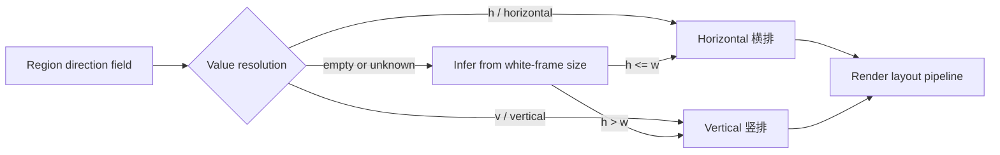
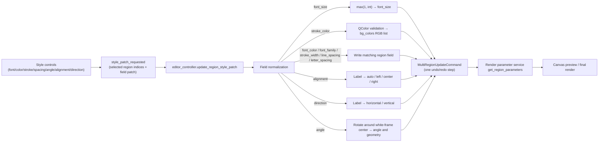

# Editor Style Properties

Use the “Style Settings” (`Style Settings`) section of the property panel whenever you need to unify or fine-tune how text regions look: font, size, text color, stroke, line spacing, letter spacing, rotation angle, alignment, and layout direction. This page covers region-level base styles only: each field change is emitted as one style patch that applies to all currently selected regions. Per-segment rich-text styles (bold, glow, ruby, TCY, and so on) are covered in [Floating rich text editor](./floating-rich-text.md), text content plus OCR/translation in [Region list and text editing](./region-list-and-text-editing.md), mask/brush/clone-stamp tools in [Canvas tools and selection](./canvas-tools-and-selection.md), and style persistence through project JSON in [Import, export, and writeback](./import-export-and-writeback.md).

## Feature boundary

- “Style Settings” is one of the three property-panel sections; the other two are “Image Editing” and “Text Content”. This page covers the style section only.
- Style fields are per-region data fields (`font_family`, `font_size`, `bg_colors`, and so on), not global rendering-config keys. The global rendering group in Settings participates only as a fallback when a region has no corresponding field.
- With a single selection, the text, style, and action sections are enabled; with a multi-selection the text section is disabled while style and actions stay enabled, and changing any style field applies to all selected regions. With no selection all three sections are disabled. Multi-selection has no “mixed value” display; the style controls keep the value of the last single selection.
- Rich-text “local styles” (bold, italic, underline, text color, glow, outer stroke, TCY, ruby, local rotation, and so on) apply to one contiguous text segment and never write these region fields.
- A style preset (`Style Preset`) saves only a subset of the region-level style fields; font size and angle are not saved.

## UI operations

### Open the property panel and select regions

1. Open the editor. The left panel shows “Property Editor” (`Property Editor`) by default.
2. Select one region on the canvas: the text, style, and action sections are enabled, and the style controls show that region's actual values.
3. Rubber-band or multi-select regions: the text section is disabled while the style and action sections stay enabled; changing any style field applies to all selected regions.
4. With no selection, all three sections are disabled and the style controls return to their initial defaults.
5. Before a canvas click the panel first forces pending property-panel text edits to be saved (`force_save_property_panel_edits()`), so edits are not lost when switching to the canvas.

### Style-field overview

| UI call key | English actual value | Simplified Chinese actual value | Style patch field | Control / range or initial value |
| --- | --- | --- | --- | --- |
| `Style Settings` | Style Settings | 样式设置 | — | Section title |
| `Style Preset:` | Style Preset: | 样式组合： | Entire style combo | Saved-style dropdown plus save/delete buttons |
| `Font:` | Font: | 字体： | `font_family` | System font dropdown |
| `Font Size:` | Font Size: | 字体大小： | `font_size` | Spin box 8–1000; slider 8–150 |
| `Font Color:` | Font Color: | 字体颜色： | `font_color` | Color picker, widget default `#000000` |
| `Stroke Color:` | Stroke Color: | 描边颜色： | `stroke_color` | Color picker, widget default `#ffffff` |
| `Stroke Width:` | Stroke Width: | 描边宽度： | `stroke_width` | 0–1, step 0.01, initial `0.07` |
| `Line Spacing:` | Line Spacing: | 行间距： | `line_spacing` | 0.1–5, step 0.1, initial `1.0` |
| `Letter Spacing:` | Letter Spacing: | 字间距： | `letter_spacing` | 0.1–5, step 0.1, initial `1.0` |
| `Angle:` | Angle: | 角度： | `angle` | -9999–9999°, step 1, initial `0.0` |
| `Alignment:` | Alignment: | 对齐： | `alignment` | Dropdown: Auto / Left / Center / Right |
| `Direction:` | Direction: | 方向： | `direction` | Dropdown: Horizontal / Vertical (Auto excluded) |

Stored values and displayed labels of the alignment/direction dropdowns:

| Stored value | UI call key | English actual value | Simplified Chinese actual value |
| --- | --- | --- | --- |
| `auto` | `alignment_auto` | Auto | 自动 |
| `left` | `alignment_left` | Left | 左对齐 |
| `center` | `alignment_center` | Center | 居中 |
| `right` | `alignment_right` | Right | 右对齐 |
| `h` (alias `horizontal`) | `direction_horizontal` | Horizontal | 横排 |
| `v` (alias `vertical`) | `direction_vertical` | Vertical | 竖排 |

### Change colors, stroke, and spacing

- Click the color button next to “Font Color” or “Stroke Color” to open the color flyout. It contains “Palette” (`Palette`), “Brightness” (`Brightness`), “Custom” (`Custom`), “Common” (`Common`), and “Recently used” (`Recent`) groups, with HEX or RGB input. Click “Pick screen color” (`Pick screen color`) to enter the full-screen color sampler: left-click picks a color, right-click or Esc cancels.
- “Font Size” is controlled jointly by a spin box (8–1000) and a slider (8–150); the ranges differ because the slider covers only the common range.
- Setting “Stroke Width” to `0` disables the stroke.
- The color picker remembers picked colors under “Recently used” and persists them in the app configuration (up to 20), so they are directly selectable next time.

| UI call key | English actual value | Simplified Chinese actual value |
| --- | --- | --- |
| `Palette` | Palette | 色板 |
| `Brightness` | Brightness | 亮度 |
| `Custom` | Custom | 自定义 |
| `Common` | Common | 常用颜色 |
| `Recent` | Recently used | 曾经用过 |
| `Pick screen color` | Pick screen color | 屏幕取色 |
| `Click to select color` | Click to select color | 点击选择颜色 |
| `Select font color` | Select font color | 选择字体颜色 |
| `Select stroke color` | Select stroke color | 选择描边颜色 |

### Save and apply a style preset

1. After adjusting styles, click the save button (tooltip “Save current style combination”), enter a name, and save. The name must not be empty; if it already exists, confirm whether to overwrite it.
2. Choose a saved style from the “Style Preset:” dropdown to apply that combination to all currently selected regions; applying does not change font size or angle.
3. Click the delete button (tooltip “Delete selected saved style”) to delete the selected combination after a confirmation dialog.
4. If writing the config to disk fails, save or delete shows an error dialog.

| UI call key | English actual value | Simplified Chinese actual value |
| --- | --- | --- |
| `Save Style` | Save Style | 保存样式 |
| `Enter style preset name:` | Enter style preset name: | 输入样式名称： |
| `Save` | Save | 保存 |
| `Cancel` | Cancel | 取消 |
| `Style preset name cannot be empty` | Style preset name cannot be empty | 样式名称不能为空 |
| `Style preset '{name}' already exists. Overwrite?` | Style preset '{name}' already exists. Overwrite? | 样式“{name}”已存在，是否覆盖？ |
| `Failed to save style preset` | Failed to save style preset | 保存样式失败 |
| `Failed to delete style preset` | Failed to delete style preset | 删除样式失败 |
| `Please select a saved style` | Please select a saved style | 请选择一个已保存样式 |
| `Delete style preset '{name}'?` | Delete style preset '{name}'? | 确定删除样式“{name}”？ |
| `Select saved style` | Select saved style | 选择已保存样式 |
| `Choose a saved style to apply` | Choose a saved style to apply | 选择一个已保存样式并应用到当前选区 |
| `Save current style combination` | Save current style combination | 保存当前样式组合 |
| `Delete selected saved style` | Delete selected saved style | 删除当前选中的已保存样式 |
| `Delete Style` | Delete Style | 删除样式 |

### Adjust font size from the canvas

Hold Ctrl and scroll the wheel over the canvas to adjust the font size of all selected regions by about 5% of the current size per notch (clamped to a minimum of 1). Even with no selection the event is swallowed, so it never falls through to canvas zooming. Shift+wheel adjusts brush size, which belongs to the “Image Editing” section; see [Canvas tools and selection](./canvas-tools-and-selection.md).

## Parameters and options

All fields below are “style patch fields”: the per-region data keys written back by one property-panel change. The control ranges come from `property_panel.py` and are not the value ranges of the core rendering config.

#### `font_family` — Font: / 字体： {#font-family}

- Control: system font dropdown (`FontComboBox`, sorted by the current UI language).
- Location: Property panel → Style Settings; UI call key `Font:`.
- Stored value: region field `font_family`, a font-family name string (for example `Microsoft YaHei UI`).
- Options: installed system fonts; there is no enum dropdown.
- Defaults: core `manga_translator/config.py#RenderConfig.font_family` is `None` (no forced font); the Qt font dropdown has no fixed initial item and shows empty when the region has no value; release `config/config-example.json` sets `render.font_family` to `Microsoft YaHei UI`.
- Effective stages: editor preview and final rendering (layout/render); it belongs to `_FONT_AFFECTING_FIELDS`, so the white frame is resynced after the change.
- Mechanism: `_on_font_family_changed` reads `currentFamily()` and emits a `{"font_family": name}` patch; the controller validates and writes it to the region data, and the render-parameter service lets the region `font_family` override the global font.
- Dependencies/conflicts: fonts that are not installed never appear in the dropdown; an empty value means follow the global rendering font.
- Performance/API cost: no network cost; a font-family change triggers one white-frame resync.
- Related files and debug artifacts: no separate file; it is written to the project JSON with the region data.
- Diagram: not needed: single font-family choice with no branch and no processing-stage change.
- Source evidence: control `desktop_qt_ui/ui/widgets/property_panel.py:715`; patch emission `:1804`; controller `desktop_qt_ui/editor/editor_controller.py:1313`.
- Verification status: static check complete; UI runtime check deferred.

#### `font_size` — Font Size: / 字体大小： {#font-size}

- Control: integer spin box (8–1000) plus slider (8–150), kept in sync.
- Location: Property panel → Style Settings; UI call key `Font Size:`.
- Stored value: region field `font_size`, a non-negative integer.
- Options: integer; there is no enum dropdown. The spin box ranges from 8 to 1000; the controller clamps normalization to `max(1, int)`.
- Defaults: core `RenderConfig.font_size` is `None` (auto-computed size, about 0.8 of the box height, capped at 128); the Qt control falls back to `12` for display when cleared without a selection; release `config-example.json` sets `render.font_size` to `null`.
- Effective stages: editor preview and final rendering; it belongs to `_FONT_AFFECTING_FIELDS`, so the white frame is resynced after the change.
- Mechanism: the spin box and the slider each emit a patch; the controller normalizes to `max(1, int(value))` and writes the region field. Ctrl+wheel on the canvas adjusts the font size of all selected regions by about 5% per notch.
- Dependencies/conflicts: `font_size` is a different layer from `render.font_size_offset`, `font_scale_ratio`, and `max_font_size`: the former is a fixed per-region size, the latter are global scaling offsets.
- Performance/API cost: no network cost; each size change triggers one white-frame resync and redraw.
- Related files and debug artifacts: no separate file; it is written to the project JSON with the region data.
- Diagram: not needed: single numeric value with no branch; the white frame is recomputed from the new size by the render-parameter pipeline.
- Source evidence: control `property_panel.py:720`; patch emission `:1780`, `:1793`; Ctrl+wheel `desktop_qt_ui/ui/editor/shortcut_manager.py:376`.
- Verification status: static check complete; UI runtime check deferred.

#### `font_color` — Font Color: / 字体颜色： {#font-color}

- Control: color picker (`ColorPickerWidget`).
- Location: Property panel → Style Settings; UI call key `Font Color:`; flyout title key `Select font color`.
- Stored value: region field `font_color`, a `#RRGGBB` hex string; it is mapped to the foreground color for rendering.
- Options: any HEX color; there is no enum dropdown.
- Defaults: core `RenderConfig.font_color` is `None` (keep the OCR-detected `fg_colors`); the Qt color-picker widget defaults to `#000000`; release `config-example.json` sets `null`.
- Effective stages: editor preview and final rendering; the color itself does not change the white-frame size.
- Mechanism: `_on_font_color_changed` emits a `{"font_color": "#rrggbb"}` patch; the controller validates it as a `QColor` and writes the string to `font_color`; display prefers `font_color` and falls back to `fg_colors` when it is absent.
- Dependencies/conflicts: `fg_colors` is the raw foreground color from OCR; once `font_color` is set it takes precedence.
- Performance/API cost: no network cost; only a redraw.
- Related files and debug artifacts: picked colors are remembered under app config `app.saved_colors` (up to 20).
- Diagram: not needed: single color value with a fixed mapping and no branch.
- Source evidence: control `property_panel.py:731`; patch emission `:1814`; rendering mapping `desktop_qt_ui/services/render_parameter_service.py:266`.
- Verification status: static check complete; UI runtime check deferred.

#### `stroke_color` — Stroke Color: / 描边颜色： {#stroke-color}

- Control: color picker (`ColorPickerWidget`).
- Location: Property panel → Style Settings; UI call key `Stroke Color:`; flyout title key `Select stroke color`.
- Stored value: the patch field is `stroke_color`; it is converted to the region field `bg_colors` (a list of RGB integers) when written, and is consumed as the background/stroke color for rendering.
- Options: any HEX color; there is no enum dropdown.
- Defaults: the Qt color-picker widget defaults to `#ffffff`; core and release config have no independent `stroke_color` key (rendering consumes `bg_color`/`bg_colors`).
- Effective stages: editor preview and final rendering; the color itself does not change the white-frame size.
- Mechanism: `_on_stroke_color_changed` emits a `{"stroke_color": "#rrggbb"}` patch; the controller validates it with `QColor` and writes `bg_colors` as `[r, g, b]`; display prefers `stroke_color` and then `bg_color`/`bg_colors`.
- Dependencies/conflicts: whether a stroke is drawn is decided by `stroke_width`; with `stroke_width=0` the color has no effect. The stroke color picker uses the `saved_stroke_colors` config key, which has no matching field in `AppSection`; cross-restart persistence needs runtime verification.
- Performance/API cost: no network cost; only a redraw.
- Related files and debug artifacts: region `bg_colors` is saved with the project JSON.
- Diagram: not needed: single color value; the `stroke_color → bg_colors → bg_color` mapping is fixed with no branch.
- Source evidence: control `property_panel.py:744`; patch emission `:1820`; field mapping `editor_controller.py:1373`; rendering mapping `render_parameter_service.py:272`.
- Verification status: static check complete; `saved_stroke_colors` persistence deferred to runtime verification.

#### `stroke_width` — Stroke Width: / 描边宽度： {#stroke-width}

- Control: double spin box (0–1, step 0.01, two decimals).
- Location: Property panel → Style Settings; UI call key `Stroke Width:`.
- Stored value: region field `stroke_width`, a float; it is the stroke-width ratio relative to the font size.
- Options: `0.0`–`1.0`; `0` disables the stroke.
- Defaults: core `RenderConfig.stroke_width` is `0.07` (7%); the Qt control initializes to `0.07`; release `config-example.json` sets `0.07`.
- Effective stages: editor preview and final rendering; it belongs to `_FONT_AFFECTING_FIELDS`, so the white frame is resynced after the change.
- Mechanism: the value change emits a `{"stroke_width": float}` patch; the controller normalizes to a float and writes the region field; rendering scales the stroke thickness by the font size.
- Dependencies/conflicts: `stroke_width=0` disables the stroke; the stroke color is decided by `stroke_color`.
- Performance/API cost: no network cost; triggers a white-frame resync and redraw.
- Related files and debug artifacts: no separate file; it is written to the project JSON with the region data.
- Diagram: not needed: single numeric offset; `0` disables the stroke as a value semantic, not a separate processing branch.
- Source evidence: control `property_panel.py:760`; patch emission `:1826`; rendering consumer `desktop_qt_ui/editor/text_renderer_backend.py:154`.
- Verification status: static check complete; UI runtime check deferred.

#### `line_spacing` — Line Spacing: / 行间距： {#line-spacing}

- Control: double spin box (0.1–5, step 0.1, one decimal).
- Location: Property panel → Style Settings; UI call key `Line Spacing:`.
- Stored value: region field `line_spacing`, a line-spacing multiplier.
- Options: `0.1`–`5.0`; `1.0` means default line spacing.
- Defaults: core `RenderConfig.line_spacing` is `None` (falls back to `1.0` at runtime); the Qt control initializes to `1.0`; release `config-example.json` sets `1.0`.
- Effective stages: editor preview and final rendering; it belongs to `_FONT_AFFECTING_FIELDS`, so the white frame is resynced after the change.
- Mechanism: when the region value is missing it is taken from the rendering config or `1.0`; actual spacing = font size × base spacing × multiplier (base 0.01 horizontal, 0.2 vertical).
- Dependencies/conflicts: an explicit region value overrides the rendering config; only `None` falls back.
- Performance/API cost: no network cost; triggers a white-frame resync and redraw.
- Related files and debug artifacts: no separate file; it is written to the project JSON with the region data.
- Diagram: not needed: single multiplier with no branch; the fallback path is fixed.
- Source evidence: control `property_panel.py:768`; patch emission `:1832`; fallback logic `editor_controller.py:1381`; rendering consumer `text_renderer_backend.py:163`.
- Verification status: static check complete; UI runtime check deferred.

#### `letter_spacing` — Letter Spacing: / 字间距： {#letter-spacing}

- Control: double spin box (0.1–5, step 0.1, one decimal).
- Location: Property panel → Style Settings; UI call key `Letter Spacing:`.
- Stored value: region field `letter_spacing`, a letter-spacing multiplier.
- Options: `0.1`–`5.0`; `1.0` means default letter spacing.
- Defaults: core `RenderConfig.letter_spacing` is `None` (falls back to `1.0` at runtime); the Qt control initializes to `1.0`; release `config-example.json` sets `1.0`.
- Effective stages: editor preview and final rendering; it belongs to `_FONT_AFFECTING_FIELDS`, so the white frame is resynced after the change.
- Mechanism: when the region value is missing it is taken from the rendering config or `1.0`; actual spacing = original glyph advance × multiplier.
- Dependencies/conflicts: an explicit region value overrides the rendering config; only `None` falls back.
- Performance/API cost: no network cost; triggers a white-frame resync and redraw.
- Related files and debug artifacts: no separate file; it is written to the project JSON with the region data.
- Diagram: not needed: single multiplier with no branch; the fallback path is fixed.
- Source evidence: control `property_panel.py:777`; patch emission `:1838`; rendering consumer `text_renderer_backend.py:164`.
- Verification status: static check complete; UI runtime check deferred.

#### `angle` — Angle: / 角度： {#angle}

- Control: double spin box (-9999–9999, step 1, one decimal, `°` suffix).
- Location: Property panel → Style Settings; UI call key `Angle:`.
- Stored value: region field `angle`, rotation angle in degrees.
- Options: `-9999.0`–`9999.0`; `0.0` means no rotation.
- Defaults: the Qt control initializes to `0.0`; core and release config have no global `angle` key, because angle is a per-region geometry field.
- Effective stages: editor preview and final rendering; it directly changes region geometry.
- Mechanism: the controller receives `{"angle": float}` and calls `_build_rotated_region_data`, which recomputes the region geometry around the white-frame center and writes `angle` into the region; the text box is drawn rotated by that angle.
- Dependencies/conflicts: angle is a geometry transform and is not part of the `_FONT_AFFECTING_FIELDS` font-based white-frame resync; repeated changes accumulate on the current geometry.
- Performance/API cost: no network cost; triggers one geometry recomputation and redraw.
- Related files and debug artifacts: region geometry and `angle` are saved with the project JSON.
- Diagram: not needed: single numeric geometry transform with no branch; see the data-flow diagram under “Runtime behavior”.
- Source evidence: control `property_panel.py:788`; patch emission `:1844`; geometry rotation `editor_controller.py:1071`.
- Verification status: static check complete; rotated white-frame behavior deferred to runtime verification.

#### `alignment` — Alignment: / 对齐： {#alignment}

- Control: dropdown.
- Location: Property panel → Style Settings; UI call key `Alignment:`.
- Stored value: region field `alignment`, one of `auto` / `left` / `center` / `right`.
- Options:
  | Stored value | UI call key | English actual value | Simplified Chinese actual value |
  | --- | --- | --- | --- |
  | `auto` | `alignment_auto` | Auto | 自动 |
  | `left` | `alignment_left` | Left | 左对齐 |
  | `center` | `alignment_center` | Center | 居中 |
  | `right` | `alignment_right` | Right | 右对齐 |
- Defaults: core `RenderConfig.alignment` is `Alignment.auto`; the Qt dropdown has no fixed initial item; release `config-example.json` sets `auto`.
- Effective stages: editor preview and final rendering; it controls where text sits inside the box.
- Mechanism: dropdown labels come from `get_display_mapping('alignment')`; on change the label is resolved back to the stored value before the region is written; the controller normalizes with `_normalize_alignment_value`.
- Dependencies/conflicts: `auto` lets the layout pipeline decide; changing the dropdown does not change region geometry.
- Performance/API cost: no network cost; only a redraw.
- Related files and debug artifacts: saved with the project JSON region data.
- Diagram: not needed: four-way display preference written directly to the `alignment` field, with no processing-stage or branch change.
- Source evidence: mapping `desktop_qt_ui/app_logic.py:1093`; patch emission `property_panel.py:1960`; normalization `editor_controller.py:810`.
- Verification status: static check complete; UI runtime check deferred.

#### `direction` — Direction: / 方向： {#direction}

- Control: dropdown (`auto` excluded).
- Location: Property panel → Style Settings; UI call key `Direction:`.
- Stored value: region field `direction`, `horizontal` or `vertical` (legacy data may also store the `h`/`v` aliases).
- Options:
  | Stored value | UI call key | English actual value | Simplified Chinese actual value |
  | --- | --- | --- | --- |
  | `h` / `horizontal` | `direction_horizontal` | Horizontal | 横排 |
  | `v` / `vertical` | `direction_vertical` | Vertical | 竖排 |
- Defaults: core `RenderConfig.direction` is `Direction.auto`; the Qt dropdown does not show `auto`, and when a region has no direction the panel infers the display from the white-frame size; release `config-example.json` sets `auto`.
- Effective stages: editor preview and final rendering; horizontal and vertical enter different layout paths.
- Mechanism: on display, the region value is normalized and mapped to Horizontal/Vertical; when the region value is empty or unknown the panel reads the white-frame size, showing Vertical when `h > w` and Horizontal otherwise. On change, the displayed label is resolved back to the stored value and written to the region.
- Dependencies/conflicts: `direction=auto` exists only as a global-config fallback; an explicit region horizontal/vertical overrides it. Direction belongs to `_FONT_AFFECTING_FIELDS`, so changing it resyncs the white frame.
- Performance/API cost: no network cost; triggers a white-frame resync and redraw.
- Related files and debug artifacts: saved with the project JSON region data.
- Diagram: required, because direction decides the layout branch:

Limitation note: the dropdown itself has only horizontal/vertical; `auto` never appears in the editor dropdown. Legacy regions without a direction are inferred from the white-frame size for display only, and the inference does not write back to the region data.
- Source evidence: mapping `app_logic.py:1099`; display inference `property_panel.py:1633`; patch emission `:1965`; normalization `editor_controller.py:832`.
- Verification status: static check complete; UI runtime check deferred.

## Runtime behavior

Every style-control change sends the “selected region indices + field patch” through `style_patch_requested` to the controller. The controller first normalizes the fields (integer font size, color-to-RGB conversion, alignment/direction label lookup, angle geometry rotation), then writes all selected regions with a single `MultiRegionUpdateCommand`, so one change corresponds to one undoable operation. The region data is then resolved by the render-parameter service for both canvas preview and final rendering.

Limitation note: the stroke color is written to `bg_colors` rather than to a same-named region field; font size, font family, line spacing, letter spacing, direction, and stroke width belong to `_FONT_AFFECTING_FIELDS` and resync the white frame, while color, alignment, and angle do not.

## Dependencies and conflicts

- A style preset (`Style Preset`) saves font, color, stroke, spacing, alignment, and direction, but not font size or angle; applying a preset never changes those two fields.
- “Copy Region / Paste Style” copies only `font_family`, `font_size`, `font_color`, `alignment`, `direction`, `line_spacing`, and `letter_spacing`; stroke color, stroke width, and angle are not copied. The right-click “🎨 粘贴样式” item is a hard-coded Chinese literal in the source, is not i18n'ed, and does not switch with the UI language.
- Multi-selection style edits apply the same patch to all selected regions and are recorded as one undo command; multi-selection has no “mixed value” display.
- Ctrl+wheel font-size adjustment on the canvas is a separate entry point that shares the `font_size` field with the panel spin box; Shift+wheel brush-size adjustment belongs to the “Image Editing” section.
- `line_spacing`/`letter_spacing` fall back to the rendering config (otherwise `1.0`) only when the region value is missing; an explicit value overrides the global one.
- The stroke color picker uses the `saved_stroke_colors` config key, but `AppSection` only defines `saved_colors`; cross-restart persistence needs runtime verification.
- Style fields affect only the editor preview and final rendering; they never change the OCR, translation, or mask stages.

## Related files and formats

| File/config | Actual role on this page | Note |
| --- | --- | --- |
| `config/config.json` | Persists app settings such as `app.saved_style_presets` and `app.saved_colors` | Never read or display a real user file |
| `config/config-example.json` | Release defaults: `render.font_family`, `render.stroke_width: 0.07`, `render.line_spacing: 1.0`, etc.; `app.saved_style_presets: null` | Use sanitized examples only |
| `desktop_qt_ui/core/config_models.py#AppSection` | Model fields `saved_colors`, `saved_style_presets` | `saved_stroke_colors` has no matching field |
| Project JSON (e.g. `manga_translator_work/json/*_translations.json`) | Region style fields (`font_family`, `font_size`, `font_color`, `bg_colors`, `stroke_width`, `line_spacing`, `letter_spacing`, `angle`, `alignment`, `direction`) are saved with the regions | Writeback and import/export are covered on the editor import/export page |
| `manga_translator/config.py#RenderConfig` | Global rendering defaults (`stroke_width`, `alignment`, `direction`, `font_color`, etc.) | Used as fallback only when a region has no value |

## Source evidence {#source-evidence}

| Layer | File | What was checked |
| --- | --- | --- |
| UI | `desktop_qt_ui/ui/widgets/property_panel.py` | Style-section controls, ranges and initial values, patch emission, style presets, multi-selection semantics |
| Color | `desktop_qt_ui/ui/widgets/color_picker.py` | Color flyout, common/recent colors, screen color sampling |
| Wiring | `desktop_qt_ui/ui/editor/view.py` | `style_patch_requested` → `update_region_style_patch` |
| Controller | `desktop_qt_ui/editor/editor_controller.py` | Field normalization, `bg_colors` mapping, angle geometry rotation, undo command |
| Render parameters | `desktop_qt_ui/services/render_parameter_service.py` | Region overrides, `font_color`/`fg_colors`, `bg_colors` |
| Render pipeline | `desktop_qt_ui/editor/render_layout_pipeline.py`, `text_render_pipeline.py`, `text_renderer_backend.py` | Consumers of spacing, stroke, and direction |
| Shortcuts | `desktop_qt_ui/ui/editor/shortcut_manager.py` | Ctrl+wheel font size, Shift+wheel brush size |
| i18n | `desktop_qt_ui/locales/en_US.json`, `zh_CN.json` | Keys and actual bilingual values |
| Core defaults | `manga_translator/config.py` | `RenderConfig` defaults |

## Verification {#verification}

| Check | Status | Notes |
| --- | --- | --- |
| BLUEPRINT, PAGE_GUIDELINES, TODO | Complete | Read in full and followed the page contract |
| Property-panel style section | Complete | Statically checked control ranges, patch fields, and multi-selection semantics |
| `en_US` / `zh_CN` actual locales | Complete | The tables record key, actual English, and actual Simplified Chinese values |
| Style-preset and color persistence | Deferred to runtime verification | `saved_style_presets` disk writes and the missing `saved_stroke_colors` model field |
| Canvas runtime verification | Deferred | Ctrl+wheel font size, screen color sampling, angle rotation, and white-frame inference need headed-mode verification |
| VitePress | Deferred | Coordinator should run `npm run docs:build --prefix doc/wiki` plus mirror/source checks before merge |
