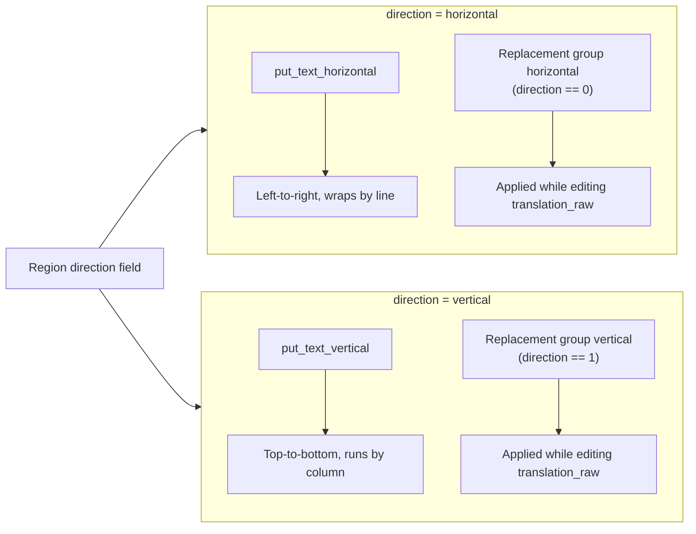

# Text Properties

Use this page when a line of dialogue needs to stand out, text must run vertically, spacing must be tuned, or a text region has to be rotated. It documents the text-typography fields in the editor’s “Property Editor” (`Property Editor`): Font, Font Size, Font Color, Line Spacing, Letter Spacing, Angle, Alignment, and Direction, together with their selection semantics, save timing, and rendering consumers.

Editing text content itself (original text, translation, pre-replacement translation, the placeholder/newline buttons, and the OCR/Translate buttons) is covered in [Region List and Text Editing](./region-list-and-text-editing.md); style presets and stroke are covered in [Style Properties](./style-properties.md); aligning/distributing regions on the canvas is covered in [Display, Compare, and Arrange](./display-compare-and-arrange.md).

## Feature boundary {#feature-boundary}

- The left-panel “Property Editor” (`Property Editor`) contains, top to bottom, the “Image Editing” (`Image Editing`), “Text Content” (`Text Content`), “Style Settings” (`Style Settings`), and “Actions” (`Actions`) groups. This page covers the typography fields in “Style Settings” that change a region’s text appearance: `Font:`, `Font Size:`, `Font Color:`, `Line Spacing:`, `Letter Spacing:`, `Angle:`, `Alignment:`, and `Direction:`.
- The “Text Content” (`Text Content`) and “Actions” (`Actions`) groups belong to [Region List and Text Editing](./region-list-and-text-editing.md); this page only references their field names and writeback semantics without repeating them.
- “Style Preset:” (`Style Preset:`), “Stroke Color:” (`Stroke Color:`), and “Stroke Width:” (`Stroke Width:`) in “Style Settings” belong to [Style Properties](./style-properties.md).
- The mask/brush/clone-stamp tools and layers in “Image Editing” belong to [Canvas Tools and Selection](./canvas-tools-and-selection.md) and [Mask, Paint, and Clone Stamp](./mask-paint-and-clone-stamp.md).
- The “Alignment:” (`Alignment:`) field here is the text alignment inside the text box (auto/left/center/right). It is not the “Arrange” action that aligns multiple text boxes to each other; the latter belongs to [Display, Compare, and Arrange](./display-compare-and-arrange.md).

## UI operations {#ui-operations}

### Property-panel sections and selection semantics {#panel-sections-and-selection}

After opening the editor, the left panel defaults to “Property Editor” (`Property Editor`). The selection state decides which of the four groups is enabled, handled centrally by `PropertyPanel.on_selection_changed()`:

| Selection state | Text Content | Style Settings | Actions | Behavior |
| --- | --- | --- | --- | --- |
| No selection | Disabled | Disabled | Disabled | Text boxes are cleared, font size resets to 12, line/letter spacing reset to 1.0, angle resets to 0, colors restore their defaults |
| Single selection | Enabled | Enabled | Enabled | The panel shows every field of that region and both text and typography can be edited |
| Multi selection | Disabled | Enabled | Enabled | Text boxes are cleared but the style controls stay enabled; typography changes apply to all selected regions as one undoable command |

Multi selection has no dedicated “mixed value” UI: the style controls keep their previous values, and any change emits `style_patch_requested(selected-indices, patch)`, which the controller normalizes and merges into a single `MultiRegionUpdateCommand`.

### Edit typography fields {#edit-typography-fields}

1. Select one text region on the canvas; the “Style Settings” (`Style Settings`) group becomes enabled.
2. “Font:” (`Font:`) is a searchable `FontComboBox` listing system fonts and fonts registered from the project `fonts/` directory; choosing one writes back the region `font_family`.
3. “Font Size:” (`Font Size:`) is a number input (8–1000) plus a slider (8–150) that stay in sync; values beyond the slider range can still be typed into the input.
4. “Font Color:” (`Font Color:`) is a color picker; recently used colors are saved to the `saved_colors` config entry.
5. “Line Spacing:” (`Line Spacing:`) and “Letter Spacing:” (`Letter Spacing:`) range from 0.1 to 5.0 in 0.1 steps, start at 1.0, and act as multipliers of the base spacing.
6. “Angle:” (`Angle:`) ranges from -9999 to 9999° in whole degrees with a `°` suffix; changing it rotates the region geometry around the white-frame center.
7. “Alignment:” (`Alignment:`) offers Auto/Left/Center/Right; “Direction:” (`Direction:`) offers only Horizontal/Vertical (`auto` is excluded; see [Parameters and options](#parameters)).
8. Every control change emits a style patch immediately; there is no separate “Save” step, and a batch of changes merges into one undoable command.

### Text content and actions {#text-content-and-actions}

The “Text Content” (`Text Content`) group maintains three text fields: source `text`, final `translation`, and pre-replacement `translation_raw`. “Show Translation (Raw)” (`Show Translation (Raw)`) is checked by default; when checked, the editor edits `translation_raw` and regeneration of `translation` through replacement rules happens in real time. The “Actions” (`Actions`) group offers Copy/Paste/Delete. Field writeback, the `↵`/`[BR]` conversion, the placeholder/newline buttons, and the OCR/Translate buttons are detailed in [Region List and Text Editing](./region-list-and-text-editing.md).

## UI copy matrix {#ui-copy-matrix}

Every key below has actual values in `desktop_qt_ui/locales/en_US.json` and `zh_CN.json`, matching `doc/wiki/data/i18n.generated.json`.

| UI call key | English actual value | Simplified Chinese actual value |
| --- | --- | --- |
| `Property Editor` | Property Editor | 属性编辑 |
| `Text Content` | Text Content | 文本内容 |
| `Style Settings` | Style Settings | 样式设置 |
| `Actions` | Actions | 操作 |
| `Image Editing` | Image Editing | 图像编辑 |
| `Original Text:` | Original Text: | 原文: |
| `Show Translation (Raw)` | Show Translation (Raw) | 显示替换前译文 |
| `Translated Text:` | Translated Text: | 译文: |
| `Placeholder` | Placeholder | 占位符 |
| `Newline↵` | Newline↵ | 换行↵ |
| `Character count: 0` | Character count: 0 | 字符数: 0 |
| `OCR Model:` | OCR Model: | OCR模型: |
| `Recognize` | Recognize | 识别 |
| `Translator:` | Translator: | 翻译器： |
| `Translate` | Translate | 翻译 |
| `Target Language:` | Target Language: | 目标语言： |
| `Font:` | Font: | 字体： |
| `Font Size:` | Font Size: | 字体大小： |
| `Font Color:` | Font Color: | 字体颜色： |
| `Line Spacing:` | Line Spacing: | 行间距： |
| `Letter Spacing:` | Letter Spacing: | 字间距： |
| `Angle:` | Angle: | 角度： |
| `Alignment:` | Alignment: | 对齐： |
| `Direction:` | Direction: | 方向： |
| `Copy` | Copy | 复制 |
| `Paste` | Paste | 粘贴 |
| `Delete` | Delete | 删除 |

The four stored values of the “Alignment:” dropdown and the two display values of the “Direction:” dropdown:

| Stored value | English actual value | Simplified Chinese actual value |
| --- | --- | --- |
| `auto` (`alignment_auto`) | Auto | 自动 |
| `left` (`alignment_left`) | Left | 左对齐 |
| `center` (`alignment_center`) | Center | 居中 |
| `right` (`alignment_right`) | Right | 右对齐 |
| `h` (`direction_horizontal`) | Horizontal | 横排 |
| `v` (`direction_vertical`) | Vertical | 竖排 |

## Parameters and options {#parameters}

#### `font_family` — Font / 字体 {#font-family}

- Control: searchable font dropdown (`FontComboBox`).
- Location: Property Editor → Style Settings → “Font:”; UI call key `Font:`.
- Stored value: a Qt font family name, not a font-file path; an empty string means unset.
- Options: scalable system fonts and fonts registered from the project `fonts/` directory; the display name is localized per language while the stored value is always the family name. Families starting with `[`, bitmap fonts, and ambiguous families are filtered out.
- Defaults: a region usually has no `font_family`; when `RenderParameters.font_family` is empty the renderer falls back to config `render.font_family`, then to `text_render.DEFAULT_FONT_FAMILY`.
- Effective stages: editor canvas text rendering and export rendering (typesetting).
- Mechanism: `FontComboBox.currentFamily()` returns the family name stored in the item data; `_on_font_family_changed` emits a `{"font_family": ...}` patch. The renderer calls `apply_font_for_render()` (which calls `set_font()` first) and then measures; when a font is unavailable it logs a warning and falls back to the default font instead of leaving the canvas blank.
- Dependencies/conflicts: the family name must be resolvable by Qt; writing a file path into JSON by hand will not work.
- Performance/API cost: no network cost; a missing font only falls back during rendering and does not block other stages.
- Related files/debug artifacts: `fonts/` (`.ttf`/`.otf`/`.ttc`) registered into Qt by `text_render.register_font_file()`; the region `font_family` is persisted to `*_translations.json`.
- Diagram: not needed (single family selection, no stage switch; the missing-font fallback has no user-visible branch worth a diagram).
- Source evidence: control `desktop_qt_ui/utils/font_list.py#FontComboBox`; patch `desktop_qt_ui/ui/widgets/property_panel.py#_on_font_family_changed`; rendering `desktop_qt_ui/editor/text_renderer_backend.py#apply_font_for_render`.
- Verification status: static source/i18n check complete; GUI font selection pending the full desktop acceptance.

#### `font_size` — Font Size / 字体大小 {#font-size}

- Control: number input (8–1000) plus slider (8–150) that stay in sync.
- Location: Property Editor → Style Settings → “Font Size:”; UI call key `Font Size:`.
- Stored value: integer pixel size; region `font_size` field.
- Options: integer; slider 8–150, number input 8–1000, controller normalization clamps the lower bound to 1.
- Defaults: the panel resets to 12 with no selection; a region reads `region_data.get("font_size", 12)`; the render service `RenderParameters.font_size` is 12; export falls back to 16 when a region has none; new regions are estimated at 60% of the white-frame height (8–72). Record the sources separately and do not merge them.
- Effective stages: editor canvas text rendering and export rendering (typesetting).
- Mechanism: either control change emits `{"font_size": int}`. Font size is a font-affecting field, so after writeback `_sync_white_frame_size_for_font_change()` recomputes the white-frame size with `calc_box_from_font()` while keeping the body center fixed.
- Dependencies/conflicts: `Ctrl+wheel` resizes the font of all selected regions, see [Shortcuts](./shortcuts.md); a font-size change resizes the white frame and may overlap neighboring regions.
- Performance/API cost: no network cost; larger sizes raise the rendered pixel count.
- Related files/debug artifacts: region `font_size` persisted to `*_translations.json`; no separate debug file.
- Diagram: not needed (single numeric offset, no branch; the white-frame coupling is covered by [Style-patch merging and save timing](#style-patch-flow)).
- Source evidence: control ranges `desktop_qt_ui/ui/widgets/property_panel.py:721`; patch and clamping `:1780`, `desktop_qt_ui/editor/editor_controller.py:1317`; white-frame sync `editor_controller.py#_sync_white_frame_size_for_font_change`.
- Verification status: static source/i18n check complete; input/slider sync pending runtime verification.

#### `font_color` — Font Color / 字体颜色 {#font-color}

- Control: color picker (`ColorPickerWidget`).
- Location: Property Editor → Style Settings → “Font Color:”; UI call key `Font Color:`.
- Stored value: `#RRGGBB` hex string; region `font_color` field.
- Options: any valid hex color; not an enum dropdown.
- Defaults: picker component default `#000000`; a region first reads `font_color`, then OCR `fg_colors` (RGB list), then config `render.font_color` (default `#000000`).
- Effective stages: editor canvas text rendering and export rendering (typesetting).
- Mechanism: the patch `{"font_color": hex}` writes the region field directly; `build_text_block_from_region()` converts the hex string to an RGB tuple for `fg_color`, and `text_renderer_backend` prefers the current render snapshot `render_params['font_color']` so the canvas preview does not stay on stale `fg_colors`.
- Dependencies/conflicts: recently used colors are written to the `saved_colors` app config, not to region data; `disable_font_border` affects the stroke only, not the font color.
- Performance/API cost: none.
- Related files/debug artifacts: region `font_color`/`fg_colors`; `saved_colors` config for recent colors.
- Diagram: not needed (color values have no branch).
- Source evidence: control `desktop_qt_ui/ui/widgets/property_panel.py:731`; patch `:1814`; render conversion `desktop_qt_ui/editor/text_render_pipeline.py#build_text_block_from_region`.
- Verification status: static source/i18n check complete; color-picker interaction pending runtime verification.

#### `line_spacing` — Line Spacing / 行间距 {#line-spacing}

- Control: float number input.
- Location: Property Editor → Style Settings → “Line Spacing:”; UI call key `Line Spacing:`.
- Stored value: 0.1–5.0 float multiplier; region `line_spacing` field; `1.0` is the base line spacing.
- Options: 0.1 steps; not an enum dropdown.
- Defaults: control initial 1.0; region default 1.0; render service `RenderParameters.line_spacing` is 1.0.
- Effective stages: editor canvas text rendering and export rendering (typesetting).
- Mechanism: the patch `{"line_spacing": float}` writes the region; the renderer passes it as `line_spacing_multiplier` into `put_text_horizontal`/`put_text_vertical`; it is a font-affecting field, so changes trigger the white-frame size resync.
- Dependencies/conflicts: multi-select changes apply to every selected region; excessive line spacing may overflow the white frame and needs the size resync.
- Performance/API cost: no network cost; does not affect API requests.
- Related files/debug artifacts: region `line_spacing` persisted to `*_translations.json`.
- Diagram: not needed (single numeric multiplier, no branch).
- Source evidence: control `desktop_qt_ui/ui/widgets/property_panel.py:762`; patch `:1832`; rendering `desktop_qt_ui/editor/text_renderer_backend.py:163`.
- Verification status: static source/i18n check complete; runtime verification pending the full desktop acceptance.

#### `letter_spacing` — Letter Spacing / 字间距 {#letter-spacing}

- Control: float number input.
- Location: Property Editor → Style Settings → “Letter Spacing:”; UI call key `Letter Spacing:`.
- Stored value: 0.1–5.0 float multiplier; region `letter_spacing` field; `1.0` is the base letter spacing.
- Options: 0.1 steps; not an enum dropdown.
- Defaults: control initial 1.0; region default 1.0; render service `RenderParameters.letter_spacing` is 1.0.
- Effective stages: editor canvas text rendering and export rendering (typesetting).
- Mechanism: the patch `{"letter_spacing": float}` writes the region; the renderer passes it as `letter_spacing_multiplier` into the text renderer; it is a font-affecting field, so changes trigger the white-frame size resync.
- Dependencies/conflicts: independent of line spacing; the “kerning” values in the floating rich-text editor are a separate per-segment style, see [Floating Rich Text](./floating-rich-text.md).
- Performance/API cost: none.
- Related files/debug artifacts: region `letter_spacing` persisted to `*_translations.json`.
- Diagram: not needed (single numeric multiplier, no branch).
- Source evidence: control `desktop_qt_ui/ui/widgets/property_panel.py:770`; patch `:1838`; rendering `desktop_qt_ui/editor/text_renderer_backend.py:164`.
- Verification status: static source/i18n check complete; runtime verification pending the full desktop acceptance.

#### `angle` — Angle / 角度 {#angle}

- Control: number input with a `°` suffix.
- Location: Property Editor → Style Settings → “Angle:”; UI call key `Angle:`.
- Stored value: angle in degrees (-9999–9999); region `angle` field.
- Options: whole-degree steps; not an enum dropdown.
- Defaults: control initial 0.0; region default 0.0.
- Effective stages: editor canvas region-geometry display and export rendering.
- Mechanism: `_on_angle_changed` emits `{"angle": float}`; the controller does not store the angle as a plain style value. It calls `_build_rotated_region_data()` to rotate the region geometry (center, `lines`, white frame) around the white-frame center and writes the rotated result back.
- Dependencies/conflicts: angle rewrites the region geometry rather than only the display; it shares the rotation data path with the canvas rotation handle; the floating rich-text editor’s “local rotation” is a separate per-segment style, see [Floating Rich Text](./floating-rich-text.md).
- Performance/API cost: no network cost; extreme angles enlarge the render bounding box.
- Related files/debug artifacts: region `angle`, `lines`, `center`, and white-frame fields persisted to `*_translations.json`.
- Diagram: not needed (numeric rotation, no branch; the geometry-rotation semantics are expressed in the parameter description).
- Source evidence: control `desktop_qt_ui/ui/widgets/property_panel.py:778`; patch `:1844`; rotation `desktop_qt_ui/editor/editor_controller.py#_build_rotated_region_data`, `editor/geometry_commit_pipeline.py`.
- Verification status: static source/i18n check complete; geometry consistency after rotation pending runtime verification.

#### `alignment` — Alignment / 对齐 {#alignment}

- Control: dropdown.
- Location: Property Editor → Style Settings → “Alignment:”; UI call key `Alignment:`.
- Stored value: `auto` / `left` / `center` / `right`; region `alignment` field.
- Options: the four alignment values in [UI copy matrix](#ui-copy-matrix); the mapping is defined in `app_logic.py#get_display_mapping('alignment')`.
- Defaults: core `manga_translator/config.py#RenderConfig.alignment` is `auto`; render service `RenderParameters.alignment` is `center`; export falls back to `center`; `calculate_default_parameters()` assigns `center` to wide boxes and `right` to tall narrow boxes by aspect ratio.
- Effective stages: editor canvas text rendering and export rendering (typesetting).
- Mechanism: the patch `{"alignment": text}` is normalized by `_normalize_alignment_value()`; `text_block.alignment` is passed directly to `put_text_horizontal`/`put_text_vertical` and controls the text alignment inside the box.
- Dependencies/conflicts: this is text alignment inside the box; aligning multiple text boxes to each other is the “Arrange” action in [Display, Compare, and Arrange](./display-compare-and-arrange.md). Multi-select changes apply to every selected region.
- Performance/API cost: none.
- Related files/debug artifacts: region `alignment` persisted to `*_translations.json`.
- Diagram: not needed (the four values feed the same render alignment parameter and do not switch algorithm branches).
- Source evidence: mapping `desktop_qt_ui/app_logic.py:1093`; normalization `desktop_qt_ui/editor/editor_controller.py#_normalize_alignment_value`; rendering `desktop_qt_ui/editor/text_renderer_backend.py:185`.
- Verification status: static source/i18n check complete; per-value rendering differences pending runtime verification.

#### `direction` — Direction / 方向 {#direction}

- Control: dropdown.
- Location: Property Editor → Style Settings → “Direction:”; UI call key `Direction:`.
- Stored value: `horizontal` / `vertical` (also written `h` / `v` internally); region `direction` field.
- Options: the dropdown excludes `auto` and shows only `direction_horizontal` (Horizontal / 横排) and `direction_vertical` (Vertical / 竖排); the `auto` i18n value exists but is not offered here.
- Defaults: core `manga_translator/config.py#RenderConfig.direction` is `auto`; render service `RenderParameters.direction` is `auto`; in the Property Editor, a region without an explicit direction is displayed by white-frame aspect ratio (taller than wide shows vertical, otherwise horizontal).
- Effective stages: editor canvas text rendering, export rendering, and the replacement-rule group selected in “Show Translation (Raw)” mode.
- Mechanism: the patch `{"direction": text}` is normalized by `_normalize_direction_value()` to `horizontal`/`vertical`; rendering maps `horizontal` to `h` and `vertical` to `v`; horizontal text runs through `put_text_horizontal` and vertical through `put_text_vertical`; replacement rules select the `horizontal`/`vertical` group by direction (`apply_replacements(text, direction)`, 0=horizontal, 1=vertical).
- Dependencies/conflicts: direction is a font-affecting field, so changes trigger the white-frame size resync; the horizontal replacement group does not run for vertical text.
- Performance/API cost: no network cost; direction only changes the render and replacement grouping.
- Related files/debug artifacts: region `direction` persisted to `*_translations.json`; the horizontal/vertical rule groups in `config/text_replacements.yaml`.
- Diagram: required; the direction-branch Mermaid is in [How direction changes rendering](#direction-render).
- Source evidence: mapping `desktop_qt_ui/app_logic.py:1099` (`auto` exclusion in `repopulate_options` at `property_panel.py:940`); normalization `editor_controller.py#_normalize_direction_value`; rendering `desktop_qt_ui/editor/text_render_pipeline.py#build_text_block_from_region`, `text_renderer_backend.py:179`; replacements `manga_translator/rendering/text_replacements.py#apply_replacements`.
- Verification status: static source/i18n check complete; horizontal/vertical rendering and replacement differences pending runtime verification.

## Runtime behavior {#runtime-behavior}

### Style-patch merging and save timing {#style-patch-flow}

The typography fields have no separate “Save” button: every control change emits a patch through `style_patch_requested`, and `EditorController.update_region_style_patch()` filters `_STYLE_PATCH_FIELDS`, normalizes values (`font_size` lower bound 1, spacing/stroke to float, `stroke_color` to `bg_colors` RGB, `alignment`/`direction` normalized), then merges all selected regions into one `MultiRegionUpdateCommand`, so a single change can be fully undone with `Ctrl+Z`. The `block_updates` flag stops the panel’s own refresh from re-emitting signals and creating a loop.

```mermaid
flowchart LR
    A["Typography control change\n(font/size/color/spacing/angle/alignment/direction)"] --> B["style_patch_requested\n(selected indices, patch)"]
    B --> C["update_region_style_patch"]
    C --> D["Filter _STYLE_PATCH_FIELDS and normalize"]
    D --> E{"angle in patch?"}
    E -->|yes| R["Rotate region geometry\naround white-frame center"]
    E -->|no| F["Compare per field, skip unchanged regions"]
    R --> F
    F --> G["Font-affecting field?\nfont_size/font_family/line_spacing/\nletter_spacing/direction"]
    G -->|yes| S["Sync white-frame size\nrecompute with calc_box_from_font"]
    G -->|no| H["MultiRegionUpdateCommand\n(one undoable command)"]
    S --> H
    H --> I["EditorModel updates all selected regions"]
    I --> J["Canvas re-render + undo history"]
```

### How direction changes rendering {#direction-render}

Direction is the only typography field that switches both the render function and the replacement-rule group: horizontal uses `put_text_horizontal` and the `horizontal` replacement group, while vertical uses `put_text_vertical` and the `vertical` replacement group. When editing `translation_raw`, `apply_replacements()` picks the group by the region’s current direction, so the same pre-replacement text can produce different final translations in horizontal versus vertical layout.

When a region has no explicit direction, the Property Editor infers the displayed value from the white-frame aspect ratio (taller than wide shows vertical) without writing region `direction`; the render service, in `calculate_default_parameters()`, derives the default direction by aspect ratio instead (ratio above 2 is horizontal, below 0.5 is vertical, otherwise `auto`).

## Dependencies and conflicts {#dependencies-and-conflicts}

- Typography writeback depends on single selection or style-only multi selection: with multiple regions selected the text-content group is disabled and only typography changes broadcast to all selected regions.
- A text control being edited is not overwritten by ordinary refreshes; only asynchronous writebacks (`source="async"`) force-refresh text fields, protecting the caret and IME composition.
- The Property Editor’s sliders, number inputs, and dropdowns swallow the wheel only when they hold keyboard focus; otherwise the wheel goes to the parent scroll area and does not change values by accident.
- `Ctrl+wheel` resizes the font of all selected regions and `Shift+wheel` changes the shared brush size; both combinations are intercepted by the shortcut manager, see [Shortcuts](./shortcuts.md).
- Font size, letter spacing, line spacing, and direction are font-affecting fields; after writeback the white-frame size is resynced. The sync changes only the frame’s width, height, and center while keeping the body center fixed.
- The “Alignment:” field is text alignment inside the box; the six-way align/distribute actions in the “Arrange” menu align text boxes to each other. Do not mix the two.
- An unavailable font does not block rendering: it falls back to the default font with a warning; hand-editing JSON with a font-file path instead of a family name will not take effect.
- Stroke color/width and style presets belong to [Style Properties](./style-properties.md); this page does not repeat their parameter definitions.

## Related files and formats {#related-files}

| File/format | Actual role on this page | Manual-edit and compatibility note |
| --- | --- | --- |
| `<image-dir>/manga_translator_work/json/<stem>_translations.json` | Region persistence: the `regions` array contains `font_family`, `font_size`, `font_color`/`fg_colors`, `bg_colors`, `stroke_width`, `line_spacing`, `letter_spacing`, `angle`, `alignment`, `direction`, etc. | Editor export writes it with `skip_text_replacements=True` (the editor `translation` is already final); never display real user paths or images in docs |
| `fonts/` directory (`.ttf`/`.otf`/`.ttc`) | Project fonts registered into Qt for the “Font:” dropdown and rendering | Fonts match by family name; families starting with `[` are rewritten so Qt foundry syntax does not resolve to an empty family |
| `config/text_replacements.yaml` | Horizontal/vertical replacement-rule groups | Applied in real time by region direction while editing `translation_raw` |
| `config/config.json` | Render defaults such as `render.font_color`/`render.font_family` and `saved_colors` | Never read or display a real user file; do not commit private absolute paths |

## Source evidence {#source-evidence}

| Layer | File | What was checked |
| --- | --- | --- |
| Property-panel UI | `desktop_qt_ui/ui/widgets/property_panel.py` | Style Settings controls, selection enable/disable, `_update_display` refresh, `style_patch_requested` emission, direction/alignment mapping fill |
| Font dropdown | `desktop_qt_ui/utils/font_list.py` | `FontComboBox`, system/project font enumeration, localized display, `currentFamily()` stored value |
| Controller | `desktop_qt_ui/editor/editor_controller.py` | `update_region_style_patch`, `_STYLE_PATCH_FIELDS`, normalization, angle rotation, `MultiRegionUpdateCommand`, white-frame sync |
| Render parameters | `desktop_qt_ui/services/render_parameter_service.py` | `RenderParameters` defaults, `calculate_default_parameters`, `_apply_region_overrides`, `export_parameters_for_backend` |
| Render pipeline | `desktop_qt_ui/editor/text_render_pipeline.py`, `text_renderer_backend.py` | `TextBlock` construction, font fallback, `font_color` parsing, `put_text_horizontal`/`put_text_vertical` consumers |
| Replacement rules | `manga_translator/rendering/text_replacements.py` | `apply_replacements(text, direction)` horizontal/vertical grouping |
| View wiring | `desktop_qt_ui/ui/editor/view.py` | Property-panel text/style signal connections, async force refresh |
| Persistence | `desktop_qt_ui/services/export_service.py`, `editor/controller_export_service.py` | Region JSON writeback, `skip_text_replacements`, missing-field fallbacks |
| UI/i18n | `desktop_qt_ui/locales/en_US.json`, `zh_CN.json`, `doc/wiki/data/i18n.generated.json` | Keys and actual display values in both languages from the tables |

## Verification {#verification}

| Check | Status | Notes |
| --- | --- | --- |
| BLUEPRINT, PAGE_GUIDELINES, TODO | Complete | Read in full and followed the page contract; this page’s TODO stays `[未开工]` and is checked by the coordinator |
| UI layout and calls | Complete | Statically checked the four Property-Editor groups, typography control ranges, `_update_display` refresh, and style-patch emission |
| `en_US` / `zh_CN` actual locales | Complete | Every row of the three-column tables matches `i18n.generated.json` |
| Typography runtime chain | Complete | Statically checked patch merging, multi-select semantics, white-frame sync, horizontal/vertical render branches, and replacement grouping |
| Sanitized runtime verification | Deferred | GUI was not started and no screenshot was taken; no real user image, `.env`, key, or private task artifact was read |
| VitePress | Deferred | Coordinator should run `npm run docs:build --prefix doc/wiki` plus mirror/source checks before merge |
