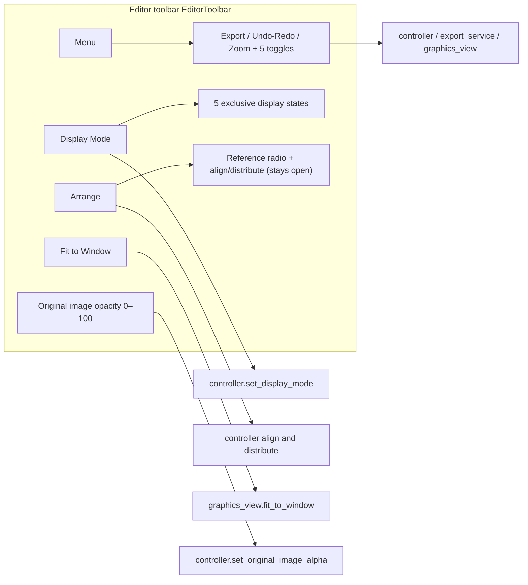

# Editor Toolbar and Menus

When you enter the editor, a fixed horizontal toolbar sits at the top. It groups high-frequency actions into three single-level dropdown menus (“Menu”, “Display Mode”, “Arrange”) and keeps two persistent controls (“Fit to Window” and original-image opacity). This page explains how the three menus expand, where each menu item leads, and how the five editor toggles are stored and persisted.

The complete options and canvas effects of “Display Mode” and “Arrange” live in [Display, Compare, and Arrange](./display-compare-and-arrange.md); canvas tools, property panels, the floating rich-text editor, shortcuts, and import/export are covered by [Canvas Tools and Selection](./canvas-tools-and-selection.md), [Text Properties](./text-properties.md), [Style Properties](./style-properties.md), [Floating Rich Text](./floating-rich-text.md), [Shortcuts](./shortcuts.md), and [Import/Export and Writeback](./import-export-and-writeback.md).

## Feature boundary

- The toolbar itself never switches pages: the back-to-home entry lives in the main-window sidebar, not in the editor toolbar.
- The “Menu” dropdown contains export, undo/redo, zoom in/out, and five checkable toggles; the five toggles are persisted in the `app` config section.
- “Display Mode” is an exclusive radio selection that decides whether the canvas shows the original, text, boxes, nothing, or a two-panel comparison; “Arrange” provides a reference radio, alignment, and spacing distribution. Their complete options belong to [Display, Compare, and Arrange](./display-compare-and-arrange.md).
- Zoom in/out is view scaling only: it scales by 1.15 per step and clamps the canvas scale to `0.05`–`50.0`; “Fit to Window” only fits the view. Neither modifies any region data.
- The “Original Image Opacity” slider (0–100) controls only the transparency of the original-image overlay on the canvas; it is not an export parameter.
- The real shortcut registration is not in the toolbar: `Ctrl+Q` (export), `Ctrl+Z` (undo), and `Ctrl+Y` (redo) are registered globally by `EditorShortcutManager`; the toolbar only shows hint text. See [Shortcuts](./shortcuts.md).

## UI operations

### Three dropdown menus

1. Open “Menu”: it shows “Export Image” (with a `(Ctrl+Q)` hint appended by code), undo/redo (hinted `Ctrl+Z` / `Ctrl+Y`), zoom in/out (`Zoom In (+)` / `Zoom Out (-)`), and five checkable editor toggles.

#### The five edit toggles

The five editor toggles in the “Menu” dropdown all carry a check mark. Their meanings and defaults are:

- **Enable Editor Snapping** (default `false`): snaps text-box rotation to `0/90/180/270/360/-90/-180/-270/-360` and to the angles of other text boxes; moving and scaling also align through the snapping logic, which makes it easier to line up the layout.
- **Scale Text Boxes from Center** (default `false`): scales text boxes from their center point instead of from a fixed opposite edge or corner.
- **Show Rich Text Editor Popup** (default `true`): automatically opens the floating rich-text editor when editing rich text; turn it off to stop the popup. See [Floating Rich Text](./floating-rich-text.md).
- **Auto Apply Rich Text Rules While Editing** (default `true`): applies rich-text styles automatically while you edit, based on the matching rules; turn it off to apply styles only on manual action. See [Rich-Text Rules Table, Raw Editing, and Matching](../rich-text-rules/table-raw-and-match.md).
- **Auto Export on Image Switch** (default `true`): automatically exports the current image when you switch to another one if it has unsaved changes; turn it off to be asked how to handle the unsaved changes first. See [Import/Export and Writeback](./import-export-and-writeback.md).

2. Open “Display Mode”: a radio group that switches between five canvas display states; see [Display, Compare, and Arrange](./display-compare-and-arrange.md) for the effects.
3. Open “Arrange”: first pick a reference (selection/canvas), then apply alignment or distribution; the menu stays open after a click so you can continue. See [Display, Compare, and Arrange](./display-compare-and-arrange.md) for the full options.

### Persistent toolbar controls

- Click “Fit to Window”: the current image is scaled to fill the canvas viewport while keeping its aspect ratio.
- Drag the “Original Image Opacity:” slider: `0` is fully transparent (showing the inpainted/cleaned background), `100` is fully opaque (showing the original); it starts at `0`.

## Runtime behavior

### Menu expansion and language switching

All three dropdown buttons open single-level menus; there are no nested submenus, and icon, check/radio indicator, and text columns are laid out independently:

- “Menu” uses a `CheckableMenu` with a leading indicator column: checking one of the five toggles shows the indicator, and the icon and text columns stay independent.
- The five “Display Mode” states and the “Arrange” reference options are exclusive `QActionGroup` radios.
- “Arrange” is a stay-open menu: it remains expanded after choosing a reference or applying an alignment/distribution so you can keep operating; clicking outside or pressing `Esc` closes it.
- On language switch, `EditorView.refresh_ui_texts()` calls `EditorToolbar.refresh_ui_texts()`, which rebuilds all three menus and restores the display mode, reference, toggles, and enabled states from internal fields so no state is lost.
- When the window is too narrow, toolbar content moves into a horizontal scroll area instead of wrapping or collapsing.

### Export and auto-export on image switch

- Clicking “Export Image” (or pressing `Ctrl+Q`) runs `EditorView.export_image()` → `controller.export_image()`: it first calls `commit_pending_edits()` to flush unsaved edits, then hands the work to the background export queue (`EditorControllerExportService`). Progress is shown as a Toast; failures have their own error messages.
- While a document is loading, `toolbar.set_export_enabled(False)` disables export; it is re-enabled after the loaded data is applied.
- “Auto Export on Image Switch” decides how unsaved edits are handled when switching images:
  - On: unsaved edits trigger an automatic export (`automatic=True`); if export is rejected, the image switch is aborted.
  - Off: an “Unsaved edits” three-button dialog appears (“导出图片”/“不保存”/“取消”). These three labels are currently hard-coded Chinese in source with no i18n key; they are a known gap, and no English label is invented here.
- The auto-export consumer reads the configuration directly when switching images; it does not depend on view-memory state.

### Undo and redo

- Undo/redo is implemented with `QUndoStack` (`history_service`); after each command-state change, the controller updates the toolbar's undo/redo enabled state.
- The shortcut text on the toolbar is a hint only; the focus-aware registration lives in `EditorShortcutManager`.

### Zoom and fit to window

- “Zoom In (+)” / “Zoom Out (-)” call `_apply_zoom(1.15)` / `_apply_zoom(1 / 1.15)` per step and clamp the target scale to `0.05`–`50.0`.
- The canvas wheel zooms the same way (up zooms in, down zooms out, factor 1.15), anchored at the mouse position.
- “Fit to Window” calls `fitInView(..., KeepAspectRatio)` to place the current image fully inside the viewport.

### Original image opacity

- The slider value `0`–`100` maps to `0.0`–`1.0`: `0` is fully transparent (showing the inpainted/cleaned background) and `100` is fully opaque (showing the original).
- When an image loads and the user has not manually adjusted the opacity, the default depends on whether an inpainted image exists: `0` with one, `1` without. Once the user drags the slider, the session stops overriding it (`_user_adjusted_alpha`).
- Slider changes are mirrored back through the model's `original_image_alpha_changed` signal so external updates also refresh the slider position.

## Dependencies and conflicts

- The toolbar only shows shortcut text and never registers `QAction` shortcuts, avoiding double triggers with the focus-aware registrations in `EditorShortcutManager`.
- When focus is in a text widget, editing shortcuts such as undo/redo are left to the text control; `Q`/`W`/`E`/`A`/`D` are forwarded as text instead of switching tools/images; `Ctrl+Q` export is unaffected. See [Shortcuts](./shortcuts.md).
- The availability of “Arrange” items depends on the selection count: with the canvas reference one selected region is enough for alignment, with the selection reference two are required, and spacing distribution needs three.
- “Auto Export on Image Switch” depends on the export queue and the image-loading flow: a rejected auto-export aborts the switch; when the user picks “export”, the switch waits for the export to finish.
- Export is an asynchronous queue task that shares a state machine with editor cancellation/cleanup; on shutdown the export queue is drained before the app exits.
- Turning off “Show Rich Text Editor Popup” immediately hides any visible floating editor; the canvas keeps focus, so delete/shortcut semantics are unchanged.

For further developer-facing mappings and source evidence, see the [Source evidence index](../../reference/source-evidence-index.md) and the [Options and I18n matrix](../../reference/options-i18n-matrix.md).
