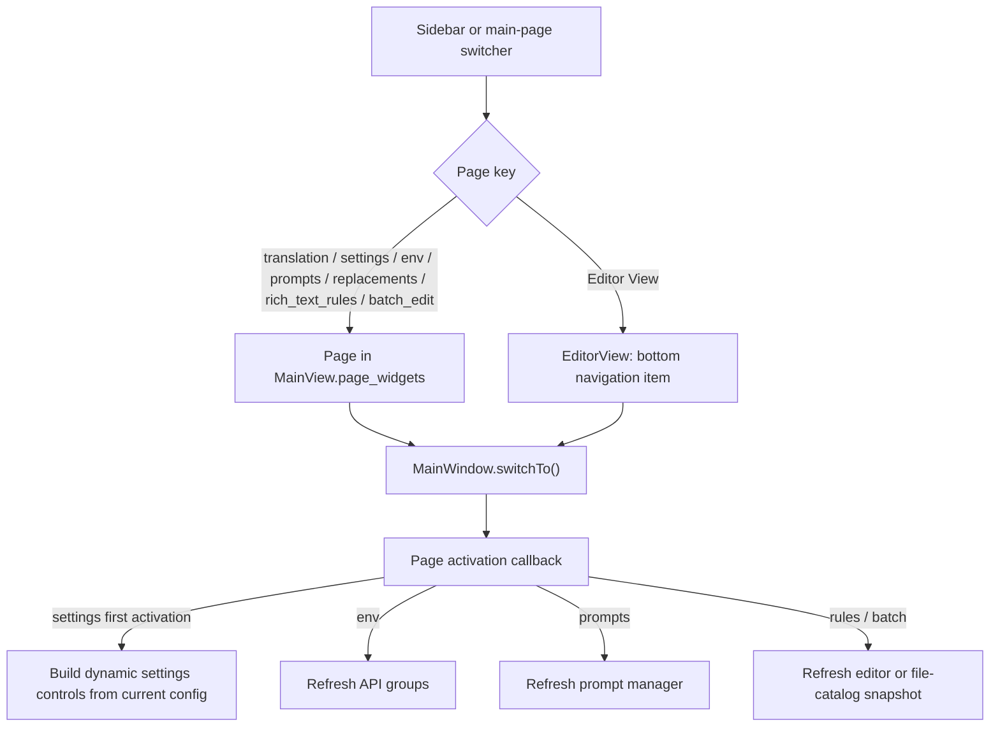

# Navigation and Language

This page explains how the desktop Qt window switches among the translation workspace, settings, API management, prompts, rules, batch management, and the editor, as well as the boundary between theme and UI-language configuration. The file list, workflow controls, editor tools, and secondary dialogs are documented on their respective feature pages.

## Feature boundary {#feature-boundary}

- The sidebar registers seven regular main pages. Editor View is a separate bottom navigation item and is not part of those seven page mappings.
- The translation page is selected at startup. When the sidebar is collapsed it becomes a narrow icon strip; hover tooltips identify the items. The window code sets the expanded width to 200px.
- Theme and language controls live in the main page's Application Settings area, not as additional sidebar items. Changing the UI language affects desktop UI text, not the translation target language.

## UI operations {#ui-operations}

### Use the main navigation {#use-main-navigation}

The seven regular sidebar pages are registered in this order. The labels below are the actual values for the i18n keys called by the code in the two locale files; icons identify items but do not change their function.

| Order | Page key | UI call key | English actual value | Simplified Chinese actual value | Icon | Page |
| --- | --- | --- | --- | --- | --- | --- |
| 1 | `translation` | `Translation Interface` | Translation Interface | 翻译界面 | `FIF.HOME` | Translation workspace |
| 2 | `settings` | `Settings` | Settings | 设置 | `FIF.SETTING` | Settings |
| 3 | `env` | `API Management` | API Management | API 管理 | `FIF.CONNECT` | API management |
| 4 | `prompts` | `Prompt Management` | Prompt Management | 提示词管理 | `FIF.DOCUMENT` | Prompt management |
| 5 | `replacements` | `Replacement Rules` | Replacement Rules | 替换规则 | `FIF.EDIT` | Replacement rules |
| 6 | `rich_text_rules` | `Rich Text Rules` | Rich Text Rules | 富文本规则 | `FIF.FONT` | Rich-text rules |
| 7 | `batch_edit` | `Batch Management` | Batch Management | 批量管理 | `FIF.LIBRARY` | Batch management |

The separate bottom navigation item is:

| UI call key | English actual value | Simplified Chinese actual value | Position | Object |
| --- | --- | --- | --- | --- |
| `Editor View` | Editor View | 编辑器视图 | `NavigationItemPosition.BOTTOM` | `EditorView` |

Clicking an item switches to its page. The translation workspace's internal page switcher also calls the window's `switchTo()` using a page key; it is not a second main-page registry.

### Theme and language {#theme-and-language}

Use the “Theme:” and “Language:” combo boxes in Application Settings on the main page. Theme changes the appearance; language changes control text. Both selections are written to application configuration.

| UI call key | English actual value | Simplified Chinese actual value |
| --- | --- | --- |
| `Theme:` | Theme: | 主题： |
| `Language:` | Language: | 语言： |
| `Main View` | Main View | 主视图 |
| `Editor View` | Editor View | 编辑器视图 |
| `Light` | Light | 浅色 |
| `Dark` | Dark | 深色 |
| `Gray` | Gray | 灰色 |
| `Ocean` | Ocean | 海洋 |
| `Forest` | Forest | 森林 |
| `Sunset` | Sunset | 落日 |
| `Rose` | Rose | 玫瑰 |
| `Follow System` | Follow System | 跟随系统 |

The theme storage values and combo-box labels are:

| Storage value | English | Simplified Chinese | Condition |
| --- | --- | --- | --- |
| `light` | Light | 浅色 | Always available; default theme |
| `dark` | Dark | 深色 | Always available |
| `gray` | Gray | 灰色 | Always available |
| `ocean` | Ocean | 海洋 | Always available |
| `forest` | Forest | 森林 | Always available |
| `sunset` | Sunset | 落日 | Always available |
| `rose` | Rose | 玫瑰 | Always available |
| `system` | Follow System | 跟随系统 | Follows system light/dark state; Windows theme monitoring is enabled for this value |

The language combo is populated from the ordered mapping returned by `I18nManager.get_available_locales()`, rather than deriving labels from configuration keys.

| Storage value | English | Simplified Chinese | Source |
| --- | --- | --- | --- |
| `zh_CN` | Simplified Chinese | 简体中文 | `LocaleInfo.name`: 简体中文 |
| `zh_TW` | Traditional Chinese | 繁體中文 | `LocaleInfo.name`: 繁體中文 |
| `en_US` | English | English | `LocaleInfo.name`: English |
| `ja_JP` | Japanese | 日本語 | `LocaleInfo.name`: 日本語 |
| `ko_KR` | Korean | 한국어 | `LocaleInfo.name`: 한국어 |
| `es_ES` | Spanish | Español | `LocaleInfo.name`: Español |

### What changes when the language changes {#switch-language}

1. Choose a target language in “Language:”. The combo hides its popup and schedules the change on the next Qt event-loop turn so one selection does not emit duplicate signals.
2. `MainWindow._change_language()` asks the i18n manager to set the locale. On success it writes the locale to `app.ui_language`, updates `config.json`, and starts the global text refresh.
3. The window title, internal actions, main-page text, and the seven regular sidebar labels and collapsed-state tooltips are refreshed. An already-created editor view also receives its `refresh_ui_texts()` call.
4. Changing language refreshes text and display controls only; it does not switch pages or call `switchTo()`, so the source proves that the current page is retained. The editor bottom-navigation label is not in the seven-item `_refresh_navigation_texts()` dictionary, so its language refresh is not claimed as verified behavior.

## Option matrix {#option-matrix}

This page's enumerated options are the theme and language combo boxes. Navigation items do not store enum values; their keys are used only for internal page mapping.

| Storage value | English | Simplified Chinese | Used in | i18n key or source |
| --- | --- | --- | --- | --- |
| `light` | Light | 浅色 | Theme combo | `Light`; `theme_registry.py` |
| `dark` | Dark | 深色 | Theme combo | `Dark`; `theme_registry.py` |
| `gray` | Gray | 灰色 | Theme combo | `Gray`; `theme_registry.py` |
| `ocean` | Ocean | 海洋 | Theme combo | `Ocean`; `theme_registry.py` |
| `forest` | Forest | 森林 | Theme combo | `Forest`; `theme_registry.py` |
| `sunset` | Sunset | 落日 | Theme combo | `Sunset`; `theme_registry.py` |
| `rose` | Rose | 玫瑰 | Theme combo | `Rose`; `theme_registry.py` |
| `system` | Follow System | 跟随系统 | Theme combo | `Follow System`; `theme_registry.py` |
| `zh_CN` | Simplified Chinese | 简体中文 | Language combo | Fixed `I18nManager` mapping; no locale JSON key |
| `zh_TW` | Traditional Chinese | 繁體中文 | Language combo | Fixed `I18nManager` mapping; no locale JSON key |
| `en_US` | English | English | Language combo | Fixed `I18nManager` mapping; no locale JSON key |
| `ja_JP` | Japanese | 日本語 | Language combo | Fixed `I18nManager` mapping; no locale JSON key |
| `ko_KR` | Korean | 한국어 | Language combo | Fixed `I18nManager` mapping; no locale JSON key |
| `es_ES` | Spanish | Español | Language combo | Fixed `I18nManager` mapping; no locale JSON key |

## Runtime behavior {#runtime-behavior}

At startup the main window creates `MainView`, registers the seven pages, and immediately switches to `translation_interface`. The corresponding refresh branch runs when a page is activated: settings builds its controls from the current configuration if not ready; API, prompt, and rule pages refresh their panels; and batch management receives the main file-list `FileCatalogSnapshot` before refreshing. Translation has no dedicated activation-refresh branch.

The language refresh chain is: language combo -> `language_change_requested` -> `I18nManager.set_locale()` -> write `app.ui_language` -> `_refresh_ui_texts()`. Native Qt dialog translations additionally try `qtbase_<locale>`, language-level, and `qt_<locale>` resources; the page does not claim a translation when a resource is unavailable.

When the theme is `system`, the window reads Windows `AppsUseLightTheme`. When the system becomes dark it applies `dark` and saves the earlier non-dark preference; when the system returns to light it restores that preference. The system-theme watcher checks every five seconds. Selecting another theme stops the watcher and saves the selection.

## Dependencies and conflicts {#dependencies-and-conflicts}

- Language switching depends on the corresponding locale files and the `I18nManager` locale mapping. A missing locale file is loaded as an empty translation dictionary by the service; do not assume every control has a translation.
- Theme switching depends on the application's theme styling implementation. `system` changes the theme selection and system watcher only; it does not change language.
- Page activation refreshes selected panels. API, prompt, rule, and batch refreshes can read files, configuration, or background-task state; their specific errors belong on those feature pages.
- Editor View is initialized independently from the seven `MainView.page_widgets` pages. Double-clicking a file or opening results after translation switches to the editor, but file loading, export, and region state are outside this page.
- The current source does not expose the top menu bar as a navigation source. The retained `QAction` objects are for internal behavior and should not be documented as visible entry points.

## Related files and formats {#related-files}

| File or field | Role on this page | Manual-edit or sharing note |
| --- | --- | --- |
| `config/config.json` | Persists `app.ui_language`, `app.theme`, and the preference restored in a light system state | Do not copy a user configuration containing personal paths or other private settings; examples use only public field names and values |
| `desktop_qt_ui/locales/en_US.json` | Actual English values for UI call keys | Cite public labels only; do not expose user data |
| `desktop_qt_ui/locales/zh_CN.json` | Actual Simplified Chinese values for UI call keys | Cite public labels only; do not expose user data |
| `desktop_qt_ui/services/i18n_service.py` | Locale order, language names, and locale-file loading | Follow missing-file behavior; do not invent translations |
| `desktop_qt_ui/theme_registry.py` | Theme storage values, label keys, and default theme | Theme values must come from the registry; do not mistake legacy locale labels such as `Blue` or `Teal` for current theme options |

## Screenshots and diagrams {#screenshots-and-diagrams}

This source review did not launch headed mode or create screenshots. Before publication, use a redacted configuration to check the seven regular navigation items, the editor bottom item, collapsed/expanded sidebar, language changes, theme changes, and deep-page switching. The Mermaid diagram above represents source-confirmed activation branches and does not replace runtime screenshots.

## Source evidence {#source-evidence}

| Layer | File | Checked for this page |
| --- | --- | --- |
| Main-window registration and switching | `desktop_qt_ui/ui/main_window.py` | Seven-page order, icons, object names, initial page, editor bottom position, sidebar width, and activation refresh |
| Main-page mapping and text refresh | `desktop_qt_ui/ui/main_page/view.py` | Seven `page_widgets` mappings, theme/language controls, page text refresh, and internal page switcher |
| Theme/language controls | `desktop_qt_ui/ui/main_page/layout.py` | Theme registry population, locale combo population, and deferred language-change signal |
| Internationalization service | `desktop_qt_ui/services/i18n_service.py` | Fixed locale order, display names, locale-file loading, and fallback |
| Theme definition | `desktop_qt_ui/theme_registry.py` | Current theme storage values, `system` option, and `light` default |
| Actual i18n values | `desktop_qt_ui/locales/en_US.json`, `desktop_qt_ui/locales/zh_CN.json` | English and Simplified Chinese actual values for navigation, theme, and language labels |

## Verification {#verification}

| Check | Status | Notes |
| --- | --- | --- |
| Page boundary | Complete | Compared with the main-navigation TODO in `BLUEPRINT.md` and `research/desktop-main-navigation.md` |
| UI call keys and three-column evidence | Complete (static) | Checked `en_US.json` and `zh_CN.json`; language names are recorded from the fixed `I18nManager` mapping |
| Page activation and language refresh | Complete (static) | Checked `main_window.py`, `main_page/view.py`, and `main_page/layout.py` |
| Headed mode and screenshots | Not run | The page explicitly retains runtime verification and shows no fabricated screenshots |
| Route mirror | Pending command verification | Run `node doc/wiki/scripts/verify-route-mirror.mjs doc/wiki` after writing |
| Source evidence check | Pending command verification | Run `node doc/wiki/scripts/verify-source-evidence.mjs doc/wiki` after writing |
| VitePress build | Pending command verification | Run `npm run docs:build --prefix doc/wiki` |

This page contains no API keys, tokens, usernames, private absolute paths, user images, or private prompts.
