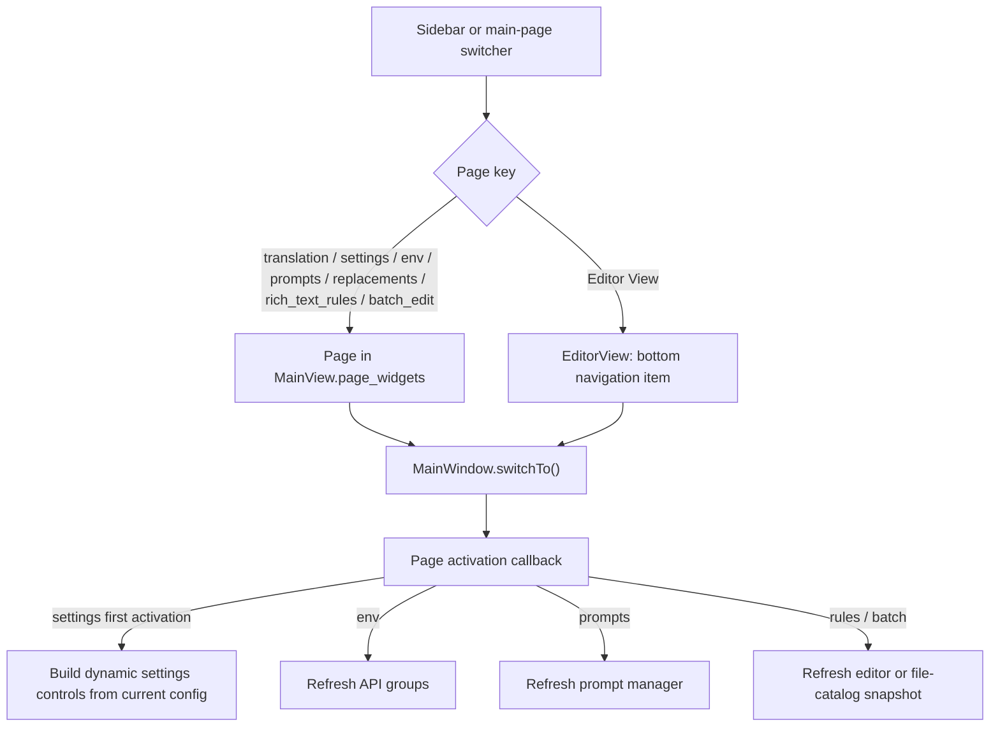

# Navigation and Language

This page explains how the desktop Qt window switches among the translation workspace, settings, API management, prompts, rules, batch management, and the editor, as well as the boundary between theme and UI-language configuration. The file list, workflow controls, editor tools, and secondary dialogs are documented on their respective feature pages.

## Feature boundary {#feature-boundary}

- The sidebar registers seven regular main pages. Editor View is a separate bottom navigation item and is not part of those seven page mappings.
- The translation page is selected at startup. When the sidebar is collapsed it becomes a narrow icon strip; hover tooltips identify the items. The window code sets the expanded width to 200px.
- Theme and language controls live in the main page's Application Settings area, not as additional sidebar items. Changing the UI language affects desktop UI text, not the translation target language.

## UI operations {#ui-operations}

### Use the main navigation {#use-main-navigation}

The seven regular sidebar pages are registered in this order. The labels below are the actual values for the i18n keys called by the code in the two locale files; icons identify items but do not change their function.

The separate bottom navigation item is:

Clicking an item switches to its page. The translation workspace's internal page switcher also calls the window's `switchTo()` using a page key; it is not a second main-page registry.

### Theme and language {#theme-and-language}

Use the “Theme:” and “Language:” combo boxes in Application Settings on the main page. Theme changes the appearance; language changes control text. Both selections are written to application configuration.

### What changes when the language changes {#switch-language}

1. Choose a target language in “Language:”. The combo hides its popup and schedules the change on the next Qt event-loop turn so one selection does not emit duplicate signals.
2. `MainWindow._change_language()` asks the i18n manager to set the locale. On success it writes the locale to `app.ui_language`, updates `config.json`, and starts the global text refresh.
3. The window title, internal actions, main-page text, and the seven regular sidebar labels and collapsed-state tooltips are refreshed. An already-created editor view also receives its `refresh_ui_texts()` call.
4. Changing language refreshes text and display controls only; it does not switch pages or call `switchTo()`, so the source proves that the current page is retained. The editor bottom-navigation label is not in the seven-item `_refresh_navigation_texts()` dictionary, so its language refresh is not claimed as verified behavior.

## Runtime behavior {#runtime-behavior}

At startup the main window registers the seven pages and immediately switches to the translation workspace. The corresponding refresh branch runs when a page is activated: settings builds its controls from the current configuration if not ready; API, prompt, and rule pages refresh their panels; and batch management receives the main file-list snapshot before refreshing. Translation has no dedicated activation-refresh branch.

After a language change, the new locale is written to the application configuration and a global text refresh is triggered. Native Qt dialogs additionally try to load matching Qt translation resources; the page does not claim a translation when a resource is unavailable.

When the theme is `system`, the window reads the Windows light/dark setting. When the system becomes dark it applies `dark` and saves the earlier non-dark preference; when the system returns to light it restores that preference. The system-theme watcher checks every five seconds. Selecting another theme stops the watcher and saves the selection.

## Dependencies and conflicts {#dependencies-and-conflicts}

- Language switching depends on the corresponding locale files and the `I18nManager` locale mapping. A missing locale file is loaded as an empty translation dictionary by the service; do not assume every control has a translation.
- Theme switching depends on the application's theme styling implementation. `system` changes the theme selection and system watcher only; it does not change language.
- Page activation refreshes selected panels. API, prompt, rule, and batch refreshes can read files, configuration, or background-task state; their specific errors belong on those feature pages.
- Editor View is initialized independently from the seven `MainView.page_widgets` pages. Double-clicking a file or opening results after translation switches to the editor, but file loading, export, and region state are outside this page.
- The current source does not expose the top menu bar as a navigation source. The retained `QAction` objects are for internal behavior and should not be documented as visible entry points.
