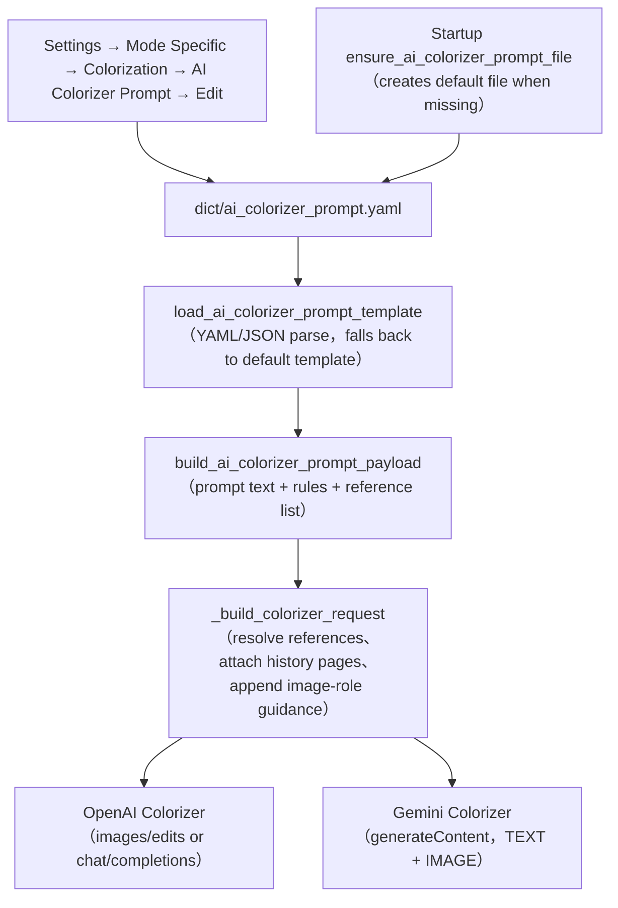
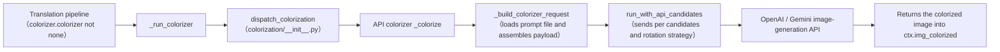

# AI Colorizer Prompt

When `OpenAI Colorizer` or `Gemini Colorizer` colorizes a manga page, the AI colorizer reads a fixed prompt file and sends its coloring instructions, colorization rules, and reference images together with the page image to the image-generation model. This page documents where that file lives, which fields it contains, how it is loaded and injected into requests, and its boundary with the custom HQ translation prompt. Parameter details for the colorization model, colorization size, denoise strength, and history pages are in [Upscaling and colorization](../settings/upscale-and-colorization.md); the full prompt-list, apply, and preview workflow is in [Prompt list, apply, and preview](./list-apply-and-preview.md); translation prompts are covered in [Context and prompts](../translator/context-and-prompts.md).

## Feature boundary

- `colorizer.ai_colorizer_prompt_path` is the UI call key of the fixed prompt-edit action shown as “AI Colorizer Prompt” (`label_ai_colorizer_prompt_path`) in Settings. It is not an ordinary configuration row and has no selectable-file combo box like `translator.high_quality_prompt_path`.
- Both the Settings edit action and the runtime request builder always target the default path `dict/ai_colorizer_prompt.yaml` (`DEFAULT_AI_COLORIZER_PROMPT_PATH`). Neither the Qt model `ColorizerSettings` nor the release file `config/config-example.json` persists a field with the same name; do not treat this key as a switchable translation-prompt path.
- This page never shows real prompt text, API keys, or user reference-image paths; it only documents the file structure, loading rules, and injection path.
- The offline colorizer `Manga Colorization v2` (`mc2`) does not read any prompt file; only `openai_colorizer` and `gemini_colorizer` load `dict/ai_colorizer_prompt.yaml`.

## UI operations

### Edit the AI colorizer prompt in Settings

1. Open “Settings” (`Settings`), select the “Mode Specific” (`Mode Specific`) tab, and locate the “Colorization” (`Colorization`) group.
2. Click “Edit” (`Edit`) on the “AI Colorizer Prompt” (`label_ai_colorizer_prompt_path`) row. The row only exposes an edit action; it has no path combo box or numeric input. The description panel reads “Fixed YAML prompt file used by OpenAI Colorizer and Gemini Colorizer. Click Edit to modify it directly.”
3. The “Edit Prompt” (`Edit Prompt`) dialog title includes the file name and opens on the “Template Edit” (`Template Edit`) tab, which contains three sections:
   - “Prompt Text” (`Prompt Text`): the main coloring prompt in a multiline text box.
   - “Colorization Rules” (`Colorization Rules`): one rule per line (`One rule per line`), split into a list on save.
   - “Reference Images” (`Reference Images`): a two-column table with headers “Path” (`Path`) and “Description” (`Description`); use “Add Reference Image” (`Add Reference Image`) to pick an image file and enter a description, and “Delete Row” (`Delete Row`) to remove rows.
4. “Add Section” (`Add Section`) re-inserts a removed section; sections can be moved up and down, but the on-screen order does not change the runtime loading order.
5. Switch to the “Raw Edit” (`Raw Edit`) tab to “Edit the raw file content directly” (`Edit the raw file content directly`); the file must parse as YAML/JSON before saving, otherwise the status bar shows “Format Error” (`Format Error`).
6. Click “Save” (`Save`) to write the file back and close; success shows “Saved successfully” (`Saved successfully`), while failures show “Save failed” (`Save failed`) or “Serialize Error” (`Serialize Error`).

### Reach the dedicated editor from Prompt Management

The “Prompt Management” (`Prompt Management`) list is built by `get_hq_prompt_options()`, which excludes the system prompts and the three fixed AI prompt stems `ai_ocr_prompt`, `ai_colorizer_prompt`, and `ai_renderer_prompt`. Therefore `dict/ai_colorizer_prompt.yaml` itself is not listed there, which prevents it from being applied as a translation custom prompt.

When a user-created file contains colorizer-specific fields such as `ai_colorizer_prompt`, `colorization_rules`, or `reference_images`, `open_prompt_editor()` detects it by content (`is_ai_colorizer_prompt_file`) and opens the same `AIColorizerPromptEditorDialog`; the preview panel also renders the “Prompt Text / Colorization Rules / Reference Images” sections. Otherwise it falls back to the generic `PromptEditorDialog`.

| UI call key | English actual value | Simplified Chinese actual value |
| --- | --- | --- |
| `Settings` | Settings | 设置 |
| `Mode Specific` | Mode Specific | 模式相关 |
| `Colorization` | Colorization | 上色 |
| `label_colorizer` | Colorization Model | 上色模型 |
| `label_ai_colorizer_prompt_path` | AI Colorizer Prompt | AI 上色提示词 |
| `label_ai_colorizer_history_pages` | AI Colorizer History Pages | AI 上色历史页数 |
| `label_colorization_size` | Colorization Size | 上色大小 |
| `label_denoise_sigma` | Denoise Strength | 降噪强度 |
| `desc_colorizer_ai_colorizer_prompt_path` | Fixed YAML prompt file used by OpenAI Colorizer and Gemini Colorizer. Click Edit to modify it directly. | OpenAI 上色 / Gemini 上色使用固定的 YAML 提示词文件。点击 Edit 直接编辑内容。 |
| `desc_colorizer_ai_colorizer_history_pages` | Automatically attaches the previous already-colorized pages as reference images for the current AI colorization request. This is image-only context, not text. Set 0 to disable. | 自动把前面已经上完色的页面当作参考图附加到当前页上色请求中。这里只控制历史页数，不写文字，只传图片。设为 0 表示关闭。 |
| `Edit` | Edit | 编辑 |
| `Edit Prompt` | Edit Prompt | 编辑提示词 |
| `Template Edit` | Template Edit | 模板编辑 |
| `Raw Edit` | Raw Edit | 源码编辑 |
| `Prompt Text` | Prompt Text | 提示词正文 |
| `Colorization Rules` | Colorization Rules | 上色规则 |
| `Reference Images` | Reference Images | 参考图片 |
| `One rule per line` | One rule per line | 每行一条规则 |
| `Add Section` | Add Section | 添加字段 |
| `Add Reference Image` | Add Reference Image | 添加参考图片 |
| `Delete Row` | Delete Row | 删除行 |
| `Path` | Path | 路径 |
| `Description` | Description | 说明 |
| `Save` | Save | 保存 |
| `Cancel` | Cancel | 取消 |
| `Loaded successfully` | Loaded successfully | 加载成功 |
| `Saved successfully` | Saved successfully | 保存成功 |
| `Format Error` | Format Error | 格式错误 |
| `Serialize Error` | Serialize Error | 序列化错误 |
| `Save failed` | Save failed | 保存失败 |
| `All sections added` | All sections added | 所有字段已添加 |
| `Edit the raw file content directly` | Edit the raw file content directly | 直接编辑文件原始内容 |
| `Prompt Management` | Prompt Management | 提示词管理 |
| `Prompt List` | Prompt List | 提示词列表 |
| `Found {count} prompt files.` | Found {count} prompt files. | 找到 {count} 个提示词文件。 |
| `Prompt Preview` | Prompt Preview | 提示词预览 |
| `Apply Selected Prompt` | Apply Selected Prompt | 应用所选提示词 |

## Prompt file and structure

### `dict/ai_colorizer_prompt.yaml` — the AI colorizer prompt file {#prompt-file}

- Storage format: YAML (`.yaml` / `.yml`) or JSON (`.json`); the loader searches `.yaml` → `.yml` → `.json` for a file with the same stem.
- Default template: the code constant `DEFAULT_AI_COLORIZER_PROMPT_TEMPLATE` has three fields; when the file is missing, fails to parse, or its root is not an object, it falls back to `DEFAULT_AI_COLORIZER_PROMPT`.
- At startup, `ensure_ai_colorizer_prompt_file()` (from `config_service` and `runtime_files`) creates the file with the default prompt when it is missing, without overwriting an existing file.

| Field (stored value) | Meaning | Compatible aliases (tried in order) |
| --- | --- | --- |
| `ai_colorizer_prompt` | Main coloring prompt text | `colorizer_prompt`, `prompt` |
| `colorization_rules` | List of colorization rules; a string is split by line | `rules`, `style_guide` |
| `reference_images` | List of reference images; each item is a string path or a `{path, description}` object | `reference_image_paths`, `images` |

For a reference-image object, the path key is tried as `path`, `image_path`, `file`, `value`, and the description key as `description`, `note`, `label`, `purpose`. This page records the structure and sanitized examples only, never real prompt text or private paths.

## Runtime behavior

### Prompt loading and request injection {#prompt-injection}

Limitation under the diagram: the file is loaded only when `colorizer.colorizer` is `openai_colorizer` or `gemini_colorizer`; `mc2`, `none`, and workflows that do not need colorization never read it. A missing reference image only logs a warning and is skipped; it does not abort the request.

### Path into an AI colorization request {#request-path}

The `colorize_only` workflow returns `ctx.img_colorized` directly after colorization, skipping detection, OCR, translation, and typesetting; in the normal workflow, colorization runs after upscaling and before detection. AI colorization requests also apply the custom request parameters of the `colorizer` section (see the API-management pages), independently of the prompt file.

### History-page image context {#history-images}

`colorizer.ai_colorizer_history_pages` (`AI Colorizer History Pages` / `AI 上色历史页数`) affects only the OpenAI/Gemini colorizers: after each successful colorization the result image is kept in memory, and the next request attaches the most recent N colorized pages as `history_reference` images — image-only context, never text; `0` disables it. When fewer history pages exist, only the available ones are used; task ordering and concurrency isolation limit which pages are available.

## Dependencies and conflicts

- Affects only AI colorizers: `mc2` and `none` never read the prompt file; rewriting it as a translation prompt does not change the offline colorizer.
- It is not interchangeable with the custom HQ translation prompt: `translator.high_quality_prompt_path` is a selectable translation-prompt path, while `dict/ai_colorizer_prompt.yaml` is the fixed AI colorizer prompt file; `get_hq_prompt_options()` explicitly excludes AI prompt stems such as `ai_colorizer_prompt` so a colorizer file cannot be applied to a translation request.
- Reference-image paths can be user-private. Relative paths resolve in turn against the prompt directory, the image directory, the project root, and the current working directory; absolute paths are used directly. Public docs and screenshots must not contain these paths or images.
- Prompt content is business text. Before sharing logs, request exports, or debug directories, remove prompt bodies, reference-image paths, history-page images, and credentials.
- Raw mode in the editor requires parseable YAML/JSON; a non-object root, wrong field types, or a missing PyYAML makes the loader fall back to the default template, and the editor reports a format or serialization error on save.

## Related files and formats

| File/format | Actual role on this page | Manual-edit and compatibility note |
| --- | --- | --- |
| `dict/ai_colorizer_prompt.yaml` | Default AI colorizer prompt file | The structure must parse; record sanitized structure only, never real prompt text |
| `.yaml` / `.yml` / `.json` | Formats supported by the prompt editor and loader | With multiple formats sharing a stem, `.yaml` → `.yml` → `.json` wins |
| Other `dict/` prompt files | HQ translation, AI OCR, AI renderer prompts | Not interchangeable with the colorizer prompt; do not mix files |
| `config/config.json` | User-settings persistence | The `colorizer` section has no `ai_colorizer_prompt_path` field; never read a real user file |
| `desktop_qt_ui/ui/main_page/settings_tab_layout.json` | The “Mode Specific” Settings layout | Source of the fixed prompt-edit UI call key |
| `manga_translator_work/editor_base/` | Editor base image after colorization | A runtime artifact, unrelated to the prompt file |

## Mermaid data-flow limits

The two diagrams describe the source-confirmed data transformations and final OpenAI/Gemini consumers; they do not claim that every run reads the file or makes a network request. Missing files, parse failures, non-AI colorizers, and workflows without colorization take their documented bypasses. No runtime screenshot or private task artifact has been fabricated.

## Source evidence {#source-evidence}

| Layer | File | What was checked |
| --- | --- | --- |
| Settings UI | `desktop_qt_ui/ui/main_page/dynamic_settings.py`, `settings_tab_layout.json` | Fixed prompt-edit action, label/description, and default path |
| Dedicated editor | `desktop_qt_ui/ui/secondary_pages/ai_colorizer_prompt_editor.py` | Template/raw tabs, three sections, reference-image table, save and statuses |
| Prompt management | `desktop_qt_ui/ui/main_page/layout.py`, `desktop_qt_ui/app_logic.py` | List exclusion rules, content detection, and editor routing |
| Prompt loading | `manga_translator/colorization/prompt_loader.py` | Field aliases, default template, reference-path resolution, payload assembly |
| Request building | `manga_translator/colorization/model_api_colorizer.py` | Prompt injection, reference/history attachment, OpenAI/Gemini request formats |
| Pipeline dispatch | `manga_translator/manga_translator.py`, `manga_translator/colorization/__init__.py` | Colorization entry, `_run_colorizer`, `colorize_only`, and history context |
| Configuration | `manga_translator/config.py`, `desktop_qt_ui/core/config_models.py` | `Colorizer` enum, `ColorizerConfig`, and Qt `ColorizerSettings` |
| Persistence/startup | `desktop_qt_ui/services/config_service.py`, `manga_translator/runtime_files.py` | Ensuring the default prompt file exists at startup |

## Verification {#verification}

| Check | Status | Notes |
| --- | --- | --- |
| BLUEPRINT, PAGE_GUIDELINES, TODO | Complete | Read section 1.3 and subsection 5.7 and followed the page contract |
| UI layout and calls | Complete | Statically checked Settings layout, fixed prompt-edit action, dedicated editor, and prompt-management routing |
| `en_US` / `zh_CN` actual locales | Complete | The table records key, actual English, and actual Simplified Chinese values |
| Prompt loading and injection chain | Complete | Statically checked loader, payload assembly, reference/history attachment, and OpenAI/Gemini requests |
| Route-mirror and source-evidence scripts | Complete | `node scripts/verify-route-mirror.mjs .`, `node scripts/verify-source-evidence.mjs .` pass |
| Sanitized runtime verification | Deferred | No real `.env`, user `config.json`, API key/token, username, user image, or private prompt was read |
| VitePress | Deferred | Coordinator should run `npm run docs:build --prefix doc/wiki` before merge |