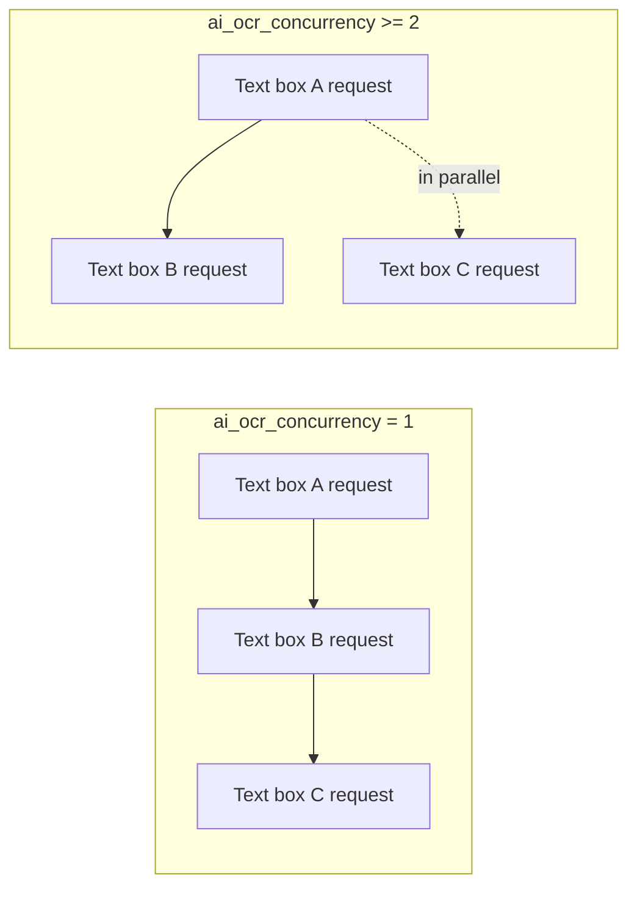
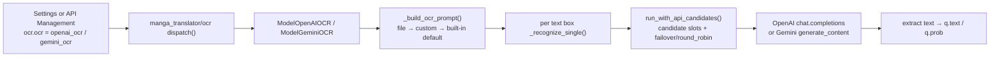

# AI OCR Prompt

When “OCR Model” (`OCR Model`) is set to `openai_ocr` or `gemini_ocr`, AI OCR sends a prompt together with each cropped text-box image to the vision model. This page documents the prompt's configuration keys, the prompt file under `dict/`, how it is loaded and injected, the path into the AI OCR request, and the boundary with custom HQ translation prompts. Overall OCR engine selection, credentials, and candidate slots are covered by [OCR, filter, and merge](../settings/ocr-filter-and-merge.md) and [API feature selectors](../api-management/feature-selectors.md); the generic prompt-file list and apply workflow is covered by [Prompt list, apply, and preview](./list-apply-and-preview.md).

## Feature boundary {#feature-boundary}

- `ocr.ai_ocr_prompt_path` is the fixed-prompt file action on the “AI OCR Prompt” row in Settings. It is bound to the backend `dict/ai_ocr_prompt.yaml` (auto-created when missing, migrating the legacy `dict/ai_ocr_prompt.json`) and is not itself persisted to `config/config.json`.
- `ocr.ai_ocr_custom_prompt` is a fallback prompt text that can be typed directly; `ocr.ai_ocr_concurrency` limits how many AI OCR requests are in flight for the same image.
- `dict/ai_ocr_prompt.yaml` is consumed only by `openai_ocr` / `gemini_ocr`; `translator.high_quality_prompt_path` is the custom prompt for HQ translation, and the two files and config keys cannot be interchanged.
- This page never embeds real prompt bodies or API keys; credentials, addresses, and models are covered by [API credentials, addresses, and models](../api-management/credentials-addresses-models.md).

## UI operations {#ui-operations}

### Configure in the “OCR” group of Settings {#configure-in-settings}

1. Open “Settings” (`Settings`) and select the “OCR” (`OCR`) group.
2. The “AI OCR Prompt” (`AI OCR Prompt`) row is a fixed-prompt file action; click “Edit” (`Edit`) to open the prompt editor.
3. Leave “AI OCR Custom Prompt” (`AI OCR Custom Prompt`) empty to use the file or the built-in default according to runtime precedence; a non-empty value takes part only when the file is empty or has no valid key.
4. Enter a positive integer in “AI OCR Concurrency” (`AI OCR Concurrency`): `1` recognizes text boxes serially, `2` or higher recognizes several text boxes in parallel.
5. In the “OCR” tab of “API Management”, set the feature selector to OpenAI/Gemini and configure the `OCR_OPENAI_*` / `OCR_GEMINI_*` credential slots; see [API feature selectors](../api-management/feature-selectors.md).

### Edit the prompt file {#edit-prompt-file}

1. Clicking “Edit” in Settings opens the prompt editor (`SimplePromptEditorDialog`). The window title is “Edit: ai_ocr_prompt.yaml” and the card shows the relative path hint `dict/ai_ocr_prompt.yaml`.
2. The text box is prefilled with the current file content; when the file is missing it is created and prefilled with the built-in default prompt.
3. Click “Save” (`Save`) to write the plain text back to the file (a YAML `ai_ocr_prompt: |` block); click “Cancel” (`Cancel`) to discard changes. A write failure shows an “Error” (`Error`) message box and does not overwrite the original file.

| UI call key | English actual value | Simplified Chinese actual value |
| --- | --- | --- |
| `Settings` | Settings | 设置 |
| `OCR` | OCR | 文字识别 |
| `OCR Model:` | OCR Model: | OCR模型: |
| `label_ocr` | OCR Model | OCR模型 |
| `label_ai_ocr_prompt_path` | AI OCR Prompt | AI OCR 提示词 |
| `desc_ocr_ai_ocr_prompt_path` | Fixed YAML prompt file used by OpenAI OCR and Gemini OCR. Click Edit to modify it directly. | OpenAI OCR / Gemini OCR 使用固定的 YAML 提示词文件。点击 Edit 直接编辑内容。 |
| `label_ai_ocr_custom_prompt` | AI OCR Custom Prompt | AI OCR 自定义提示词 |
| `desc_ocr_ai_ocr_custom_prompt` | Custom prompt for OpenAI OCR and Gemini OCR. Leave empty to use the built-in default prompt that returns only recognized text with line breaks preserved. | OpenAI OCR / Gemini OCR 的自定义提示词。留空时使用内置默认提示词，只返回识别文本并保留换行。 |
| `label_ai_ocr_concurrency` | AI OCR Concurrency | AI OCR 并发数 |
| `desc_ocr_ai_ocr_concurrency` | Maximum concurrent API requests for OpenAI OCR and Gemini OCR. Set 1 for serial processing, 2 or higher to process multiple text boxes at the same time. | OpenAI OCR / Gemini OCR 的最大并发请求数。1 表示串行识别，2 及以上会同时请求多个文本框。 |
| `No OCR API required` | The current OCR does not require an OpenAI/Gemini API key. | 当前 OCR 不需要 OpenAI/Gemini API Key。 |
| `Edit` | Edit | 编辑 |
| `Save` | Save | 保存 |
| `Cancel` | Cancel | 取消 |
| `Error` | Error | 错误 |

## Parameters and options {#parameters-and-options}

#### `ocr.ai_ocr_prompt_path` — AI OCR 提示词 / AI OCR Prompt {#ocr-ai-ocr-prompt-path}

- Control: fixed-prompt file action (a label row with an “Edit” button), not a dropdown.
- Location: Settings → OCR; UI call key `label_ai_ocr_prompt_path`.
- Stored value: not persisted to `config/config.json`; the backend always resolves the default path to `dict/ai_ocr_prompt.yaml` (`DEFAULT_AI_OCR_PROMPT_PATH`).
- Options: none; the file content is plain prompt text.
- Defaults: the core constant `manga_translator/ocr/prompt_loader.py#DEFAULT_AI_OCR_PROMPT` holds a built-in English prompt; on first run `ensure_ai_ocr_prompt_file()` writes it to `dict/ai_ocr_prompt.yaml`, or migrates the legacy `dict/ai_ocr_prompt.json` when present.
- Effective stage: OCR.
- Mechanism: `ensure_ai_ocr_prompt_file()` guarantees the file exists; `load_ai_ocr_prompt_file()` parses YAML/JSON with `load_prompt_file()` and returns the first non-empty string among `ai_ocr_prompt`, `ocr_prompt`, or `prompt`. A non-empty file wins over `ai_ocr_custom_prompt`.
- Dependencies/conflicts: consumed only by `openai_ocr` / `gemini_ocr`; unrelated to `translator.high_quality_prompt_path`.
- Performance/API cost: prompt length counts toward the token cost of every text-box request.
- Related files and debug artifacts: `dict/ai_ocr_prompt.yaml`, legacy `dict/ai_ocr_prompt.json`; no debug images.
- Diagram: not needed: this key is only a file-edit entry point; value changes are reflected in file content, see the injection-path diagram in [Runtime behavior](#runtime-behavior).

#### `ocr.ai_ocr_custom_prompt` — AI OCR 自定义提示词 / AI OCR Custom Prompt {#ocr-ai-ocr-custom-prompt}

- Control: text input (optional input).
- Location: Settings → OCR; UI call key `label_ai_ocr_custom_prompt`.
- Stored value: string; empty means unused.
- Options: arbitrary text; no enum.
- Defaults: core `manga_translator/config.py#OcrConfig.ai_ocr_custom_prompt` is `None`; Qt model `desktop_qt_ui/core/config_models.py#OcrSettings.ai_ocr_custom_prompt` is `None`; release `config/config-example.json` is `null`.
- Effective stage: OCR.
- Mechanism: in `_build_ocr_prompt()` this value is used only when the fixed file is empty or has no valid key, before falling back to the built-in default. Note that the UI description “Leave empty to use the built-in default prompt” omits the file precedence: as long as `dict/ai_ocr_prompt.yaml` is non-empty, this input has no effect.
- Dependencies/conflicts: shares the same consumption point as `ocr.ai_ocr_prompt_path`; when both are set, the file wins.
- Performance/API cost: proportional to prompt length; no extra fixed overhead.
- Related files and debug artifacts: not persisted; it travels inside `OcrConfig` into OCR dispatch.
- Diagram: not needed: a branch-free string precedence, see the loading-precedence notes in [Runtime behavior](#runtime-behavior).

#### `ocr.ai_ocr_concurrency` — AI OCR 并发数 / AI OCR Concurrency {#ocr-ai-ocr-concurrency}

- Control: integer input.
- Location: Settings → OCR; UI call key `label_ai_ocr_concurrency`.
- Stored value: positive integer; `_get_ai_ocr_concurrency()` clamps `0`, negatives, and parse failures to `1`.
- Options: integer; no enum.
- Defaults: core `manga_translator/config.py#OcrConfig.ai_ocr_concurrency` is `1`; Qt model `desktop_qt_ui/core/config_models.py#OcrSettings.ai_ocr_concurrency` is `1`; release `config/config-example.json` is `10`.
- Effective stage: OCR request scheduling.
- Mechanism: an `asyncio.Semaphore` limits how many AI OCR API requests are in flight for the same image; `1` recognizes text boxes serially, `2` or higher recognizes several text boxes in parallel. Parallelism applies only to the pending text boxes of this image, not to the whole image pipeline.
- Dependencies/conflicts: bounded by API rate limits, quotas, network, and memory; it does not change detection, translation, inpainting, or rendering concurrency.
- Performance/API cost: higher concurrency speeds up per-image OCR but makes rate-limit or candidate-slot cooldown more likely.
- Related files and debug artifacts: affects in-memory request scheduling only; no files.
- Diagram: required (see below).

Concurrency limits only how many AI OCR API requests are in flight for the same image; candidate-slot rotation still runs per request independently and is not changed by this setting.

## Runtime behavior {#runtime-behavior}

### Prompt-file loading and precedence {#prompt-loading}

1. `ensure_ai_ocr_prompt_file()` guarantees that `dict/ai_ocr_prompt.yaml` exists: when missing it writes the built-in default, or migrates the legacy `dict/ai_ocr_prompt.json` content when present.
2. `load_ai_ocr_prompt_file()` parses `.yaml` / `.yml` / `.json` with `load_prompt_file()`; the root must be a dict and the first non-empty string key is returned in the order `ai_ocr_prompt` → `ocr_prompt` → `prompt`.
3. `_build_ocr_prompt()` precedence: file content → `ai_ocr_custom_prompt` → `DEFAULT_AI_OCR_PROMPT`.
4. The recognition response passes through `_normalize_ocr_text()`: line endings are unified, surrounding whitespace is stripped, and surrounding triple-backtick code fences are removed when the model returned Markdown.

### Path into the AI OCR request {#request-path}

The prompt is sent as the text part of a `user` message together with the text-box PNG: OpenAI uses `text` + `image_url` (base64 data URL) in `messages[0].content`; Gemini uses `text` + `inlineData` in `contents[0].parts`. When custom API parameters are enabled, the `ocr` section of `config/custom_api_params.json` (default `temperature: 0.0`) is merged into the request body; credentials and candidate endpoints are resolved from `.env` / API-management slots via `resolve_runtime_api_config(feature="ocr", ...)`.

## Dependencies and conflicts {#dependencies-and-conflicts}

- `ocr.ocr` must be `openai_ocr` or `gemini_ocr`, otherwise the AI OCR prompt is not consumed; offline OCR (48px, PaddleOCR, etc.) uses its own model prompts and is out of scope here.
- The prompt file is consumed only by AI OCR; `translator.high_quality_prompt_path` is the custom HQ translation prompt, see [Context and prompts](../translator/context-and-prompts.md), and the two files cannot be interchanged.
- `ai_ocr_prompt` is a system-prompt stem, excluded from the “Prompt Management” list and the HQ prompt dropdown, so it never appears in [Prompt list, apply, and preview](./list-apply-and-preview.md); the only edit entry point is Settings.
- AI OCR requests are also affected by the Key/Base/Model slots, candidate-slot rotation, and custom request parameters in API Management; those mechanisms do not change prompt content.
- Prompt bodies are user content; before sharing logs, request exports, or debug directories, remove prompt text, text-box text, paths, and credentials.

## Related files and formats {#files-and-formats}

| File/format | Actual role on this page | Manual-edit and compatibility note |
| --- | --- | --- |
| `dict/ai_ocr_prompt.yaml` | Fixed AI OCR prompt file; root key `ai_ocr_prompt` | The root must be a dict; the editor saves a YAML block |
| `dict/ai_ocr_prompt.json` | Legacy prompt file | Migrated only when the default YAML is missing and the path is not customized |
| `.yaml` / `.yml` / `.json` | Formats accepted by `load_ai_ocr_prompt_file()` | Keys are looked up as `ai_ocr_prompt` → `ocr_prompt` → `prompt` |
| `config/custom_api_params.json` | Extra request-body parameters (`ocr` section, default `temperature: 0.0`) | Does not manage prompt content or credentials |
| `config/config.json` | User-configuration persistence | The fixed prompt path is not written; `ai_ocr_custom_prompt` and `ai_ocr_concurrency` are |
| `config/config-example.json` | Release example defaults | `ai_ocr_concurrency: 10`, `ai_ocr_custom_prompt: null` |

## Source evidence {#source-evidence}

| Layer | File | What was checked |
| --- | --- | --- |
| Settings layout | `desktop_qt_ui/ui/main_page/settings_tab_layout.json` | OCR group and ownership of `ocr.ai_ocr_prompt_path`, `ocr.ai_ocr_concurrency` |
| Dynamic settings and editor | `desktop_qt_ui/ui/main_page/dynamic_settings.py`, `desktop_qt_ui/ui/secondary_pages/simple_prompt_editor_dialog.py` | Fixed-prompt row, editor dialog, load, and save |
| Prompt loading | `manga_translator/ocr/prompt_loader.py` | Default path, legacy migration, key resolution, load/save/list |
| Generic loader | `manga_translator/translators/prompt_loader.py` | YAML/JSON parsing and dict validation |
| Config | `manga_translator/config.py`, `desktop_qt_ui/core/config_models.py`, `config/config-example.json` | Three defaults and field definitions |
| UI/i18n | `desktop_qt_ui/app_logic.py`, `desktop_qt_ui/locales/en_US.json`, `zh_CN.json` | Key mapping and actual bilingual display values |
| Runtime and consumers | `manga_translator/ocr/__init__.py`, `manga_translator/ocr/model_api_ocr.py`, `manga_translator/manga_translator.py` | Dispatch, prompt construction, candidate-slot requests, and OpenAI/Gemini messages |
| Request parameters | `manga_translator/custom_api_params.py`, `manga_translator/runtime_api_resolver.py`, `manga_translator/api_key_rotation.py` | `ocr` section merge and candidate-endpoint rotation |

## Verification {#verification}

| Check | Status | Notes |
| --- | --- | --- |
| BLUEPRINT, PAGE_GUIDELINES, TODO | Complete | Read in full and followed the page contract |
| UI layout and calls | Complete | Statically checked the settings layout, fixed-prompt editor, and API groups |
| `en_US` / `zh_CN` actual locales | Complete | The table records key, actual English, and actual Simplified Chinese values |
| Prompt loading and request injection chain | Complete | Statically checked file-loading precedence, OpenAI/Gemini message construction, and candidate endpoints |
| Sanitized runtime verification | Deferred | No real `.env`, user `config.json`, API key/token, username, user image, or private prompt was read |
| VitePress | Deferred | Coordinator should run `npm run docs:build --prefix doc/wiki` plus mirror/source checks before merge |