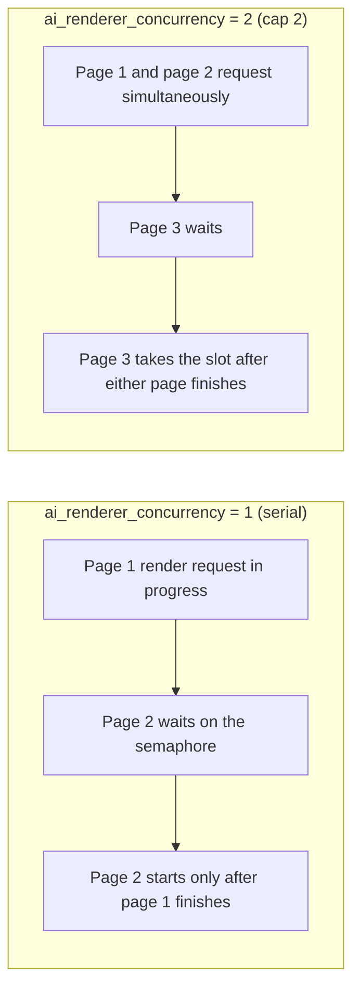
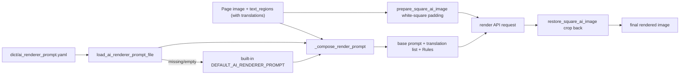
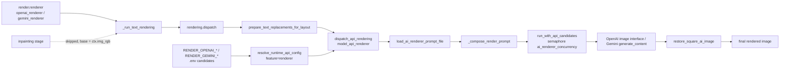

# AI Renderer Prompt

When the renderer is set to `openai_renderer` or `gemini_renderer`, page translations are no longer drawn by local font typesetting; the page image and region translations are sent to an image-generation model instead. This page documents the fixed prompt file used by AI rendering, how it is loaded and injected, the path into an AI render request, and its boundary with the custom HQ translation prompt.

This page does not cover the renderer enum, fonts, or typesetting parameters (see [Typesetting and rendering](../settings/typesetting-and-rendering.md)), API credentials, candidate slots, or rotation (see the API-management pages), nor the custom HQ translation prompt itself (see [Context and prompts](../translator/context-and-prompts.md)).

## Feature boundary {#feature-boundary}

- `render.renderer` decides whether AI rendering is used: `openai_renderer` / `gemini_renderer` go through an image-generation API, `default` uses local Qt/text_render drawing, and `none` skips text drawing.
- `render.ai_renderer_prompt_path` is the UI row key for a fixed prompt-file edit action in the “Typesetting” tab, not a persisted config value and not a switchable path; it always edits `dict/ai_renderer_prompt.yaml`.
- `render.ai_renderer_concurrency` limits how many AI render API requests run at the same time for the same provider.
- The AI renderer prompt is a fixed file. It belongs to a different feature than the user-selectable custom HQ prompt (`translator.high_quality_prompt_path`); the files must not be interchanged.

## UI operations {#ui-operations}

### Edit the AI renderer prompt in Settings {#edit-in-settings}

1. Open “Settings” (`Settings`) and select the “Typesetting” (`Typesetting`) group.
2. Find the “AI Renderer Prompt” (`AI Renderer Prompt`) row and click the “Edit” (`Edit`) button on the right.
3. A prompt-edit dialog (`SimplePromptEditorDialog`) opens: the window title is “Edit: ai_renderer_prompt.yaml” (`Edit` plus the file name), the title and section label are “AI Renderer Prompt”, the description comes from `desc_render_ai_renderer_prompt_path`, and the path hint is `dict/ai_renderer_prompt.yaml` (selectable for copying).
4. The editor is a monospace text box that starts with the current prompt-file content; if the file is missing it shows the built-in default prompt. Clicking “Save” (`Save`) writes the file back as a YAML literal block; clicking “Cancel” (`Cancel`) discards changes; a failed save shows the “Error” (`Error`) dialog.

| UI call key | English actual value | Simplified Chinese actual value |
| --- | --- | --- |
| `Settings` | Settings | 设置 |
| `Typesetting` | Typesetting | 排版 |
| `label_renderer` | Renderer | 渲染器 |
| `label_ai_renderer_prompt_path` | AI Renderer Prompt | AI 渲染提示词 |
| `desc_render_ai_renderer_prompt_path` | Fixed YAML prompt file used by OpenAI Renderer and Gemini Renderer. The final request is combined with numbered boxes and translated text for each region. | OpenAI 渲染 / Gemini 渲染使用固定的 YAML 提示词文件。实际请求会自动组合编号框图片和对应翻译文本。 |
| `label_ai_renderer_concurrency` | AI Renderer Concurrency | AI 渲染并发数 |
| `desc_render_ai_renderer_concurrency` | Maximum concurrent API requests for OpenAI Renderer and Gemini Renderer. This limits how many pages can be rendered at the same time during batch processing. | OpenAI 渲染 / Gemini 渲染的最大并发请求数。批量模式下可同时渲染多张页面。 |
| `Edit` | Edit | 编辑 |
| `Cancel` | Cancel | 取消 |
| `Save` | Save | 保存 |
| `Error` | Error | 错误 |
| renderer display mapping (hard-coded) | Default / OpenAI Renderer / Gemini Renderer / None | Default / OpenAI Renderer / Gemini Renderer / 无 |

### Boundary with Prompt Management {#prompt-management-boundary}

When “Prompt Management” (`Prompt Management`) is opened, the list contains only user prompt files; `get_hq_prompt_options()` scans `dict/` for `.yaml`, `.yml`, and `.json` files while excluding system-prompt stems such as `ai_renderer_prompt`. The AI renderer prompt therefore never appears in the “Apply Selected Prompt” (`Apply Selected Prompt`) candidates and is never overwritten by an HQ apply operation. The full Prompt Management workflow is covered in [Prompt list, apply, and preview](./list-apply-and-preview.md).

| UI call key | English actual value | Simplified Chinese actual value |
| --- | --- | --- |
| `Prompt Management` | Prompt Management | 提示词管理 |
| `Apply Selected Prompt` | Apply Selected Prompt | 应用所选提示词 |

## Parameters and options {#parameters-and-options}

#### `render.renderer` — 渲染器 / Renderer {#render-renderer}

- Control: dropdown.
- Location: Settings → Typesetting; the render feature selector on the API-management page binds the same key.
- Stored value: `default`, `openai_renderer`, `gemini_renderer`, `none`.
- Options (code-mapped display names): `default` → Default; `openai_renderer` → OpenAI Renderer; `gemini_renderer` → Gemini Renderer; `none` → `translator_none` (None / 无).
- Defaults: core `manga_translator/config.py#RenderConfig.renderer` is `Renderer.default`; Qt model `desktop_qt_ui/core/config_models.py#RenderSettings.renderer` is `"default"`; release `config/config-example.json` is `"default"`.
- Effective stages: before the text-rendering stage starts; selecting an AI renderer also makes the inpainting stage skipped.
- Mechanism: with `openai_renderer` / `gemini_renderer`, `_run_text_rendering` calls `rendering.dispatch`, which enters `model_api_renderer.dispatch_api_rendering` and sends the page image and translation list to an image-generation API; `default` uses local font typesetting; `none` draws nothing.
- Dependencies/conflicts: an AI renderer requires the matching `.env` API key; when missing, the UI blocks translation start (see “Dependencies and conflicts”). With an AI renderer, local typesetting parameters such as `render.font_family`, `font_color`, and `stroke_width` no longer reach the final pixels.
- Related files: `RENDER_OPENAI_*` / `RENDER_GEMINI_*` and their fallback keys in `.env`.
- Diagram: see “Path into the AI render request” below.
- Source evidence: definition `manga_translator/config.py#Renderer`; UI binding `desktop_qt_ui/app_logic.py`, `dynamic_settings.py`; consumers `manga_translator/rendering/__init__.py`, `model_api_renderer.py`.
- Verification status: complete (static source check).

#### `render.ai_renderer_prompt_path` — AI 渲染提示词 / AI Renderer Prompt {#render-ai-renderer-prompt-path}

- Control: fixed prompt-file edit action (label + “Edit” button), not an input box or a path picker.
- Location: Settings → Typesetting; UI call key `label_ai_renderer_prompt_path`.
- Stored value: nothing is written to the config JSON; clicking “Edit” always edits `dict/ai_renderer_prompt.yaml` (relative to the repository root, or the resource directory in packaged builds).
- Options: no enum; the file content is freely editable but must stay parseable as YAML.
- Defaults: when the file is missing, `ensure_ai_renderer_prompt_file()` writes the built-in `DEFAULT_AI_RENDERER_PROMPT`; if the file content matches a legacy prompt string it is upgraded to the default prompt. Core, Qt model, and release config have no such path field because it is not a config value.
- Effective stages: AI render request construction (`_build_base_prompt` / `_compose_render_prompt`).
- Mechanism: `load_ai_renderer_prompt_file()` parses YAML and returns the first non-empty string in `AI_RENDERER_PROMPT_KEYS = ("ai_renderer_prompt", "renderer_prompt", "prompt")` order; saving writes an `ai_renderer_prompt: |` literal block. This text becomes the “base prompt” part of the render request.
- Dependencies/conflicts: consumed only by the AI renderer; do not interchange it with the HQ translation prompt or the AI OCR/colorizer prompt files.
- Performance/API cost: a longer prompt sends more text tokens to the image-generation API and raises request cost together with the page-image size.
- Related files and debug artifacts: `dict/ai_renderer_prompt.yaml`; the request attachment file name is fixed to `numbered_page.png` (a historical name, not evidence that the current implementation draws numbered boxes).
- Diagram: see “Prompt-file loading and injection” below.
- Source evidence: definition and loading `manga_translator/rendering/prompt_loader.py`; UI `desktop_qt_ui/ui/main_page/dynamic_settings.py`; final consumer `model_api_renderer.py`.
- Verification status: complete (static source check).

#### `render.ai_renderer_concurrency` — AI 渲染并发数 / AI Renderer Concurrency {#render-ai-renderer-concurrency}

- Control: integer input.
- Location: Settings → Typesetting; UI call key `label_ai_renderer_concurrency`.
- Stored value: positive integer; at runtime it is parsed as `max(int(value or 1), 1)`, so `0`, negative values, and invalid values all fall back to `1`.
- Options: no enum.
- Defaults: core `manga_translator/config.py#RenderConfig.ai_renderer_concurrency` is `1`; Qt model `desktop_qt_ui/core/config_models.py#RenderSettings.ai_renderer_concurrency` is `1`; release `config/config-example.json` is `1`.
- Effective stages: AI render request scheduling; it affects only `openai_renderer` / `gemini_renderer`.
- Mechanism: `model_api_renderer.py` caches one `asyncio.Semaphore` per provider name; `_resolve_concurrency()` reads `render.ai_renderer_concurrency`, and `render()` wraps the whole API-candidate request in the semaphore. The value changes how many page requests may run concurrently for the same provider, not the content of a single page request.
- Dependencies/conflicts: OpenAI and Gemini use separate semaphores; a higher concurrency raises the chance of API rate limits or 429 responses. In batch mode, different pages share the same semaphore instance.
- Performance/API cost: the value approximates the upper bound of simultaneous image-generation requests.
- Diagram: the concurrency comparison below.
- Source evidence: definition `manga_translator/config.py`, `desktop_qt_ui/core/config_models.py`; consumer `manga_translator/rendering/model_api_renderer.py`.
- Verification status: complete (static source check).

Concurrency is grouped per provider: `openai_renderer` and `gemini_renderer` each have their own semaphore, so raising concurrency only affects pages of the same renderer. The real number of simultaneous requests is also bounded by API rate limits, candidate rotation, and network round trips, so it does not always equal the concurrency cap.

## Prompt-file loading and injection {#loading-and-injection}

### Fixed-file loading {#prompt-file-loading}

`dict/ai_renderer_prompt.yaml` is the fixed prompt file of the AI renderer. At startup, both `ConfigService.__init__` and `runtime_files.ensure_runtime_files()` call `ensure_ai_renderer_prompt_file()`: a missing file is written with the built-in default prompt, and a file matching a legacy prompt is upgraded to the default prompt, but already-modified user content is never overwritten.

`manga_translator/rendering/prompt_loader.py` provides four functions:

| Function | Purpose |
| --- | --- |
| `resolve_ai_renderer_prompt_path(path)` | Joins a relative path to the resource root (repository root in development, executable directory when packaged); absolute paths are normalized as-is |
| `load_ai_renderer_prompt_file(path)` | Parses YAML/JSON and returns the first non-empty string in `ai_renderer_prompt`, `renderer_prompt`, `prompt` order; returns an empty string when the file is missing or the root is not a mapping |
| `save_ai_renderer_prompt_file(path, text)` | Writes the file back as an `ai_renderer_prompt: |` YAML literal block |
| `ensure_ai_renderer_prompt_file(path)` | Writes the default prompt when missing and upgrades legacy prompts |

### Injection into the render request {#prompt-injection}

When a request is built, `_build_base_prompt()` calls `ensure_ai_renderer_prompt_file()` again and loads via `load_ai_renderer_prompt_file(None)`; if loading fails or returns empty, it falls back to the built-in `DEFAULT_AI_RENDERER_PROMPT`. `_compose_render_prompt()` appends the following to the base prompt:

- a header line, “Translation list with original texts as reference:”;
- one `- translation: ...` entry per region with non-empty translation, plus `original: ...` (the source text as reference) and `direction: vertical|horizontal`;
- a fixed `Rules:` list (match each line to the corresponding bubble, render every translation including sound effects, keep the page layout and artwork intact, return only the rendered image).

Translation values are first flattened with `rich_text.plain_text_of()` and line breaks are escaped to `\\n`. Before sending, the page image is padded to a white square with `prepare_square_ai_image()`; after the response, `restore_square_ai_image()` crops it back to the original size, and a LANCZOS resize is applied when the returned size differs.

## Path into the AI render request {#request-path}

After `openai_renderer` / `gemini_renderer` is selected, the text-rendering stage calls `rendering.dispatch` (in `manga_translator/rendering/__init__.py`), which first runs `prepare_text_replacements_for_layout()` on the regions (applying replacement rules) and then calls `model_api_renderer.dispatch_api_rendering()`. The latter creates `OpenAIRenderer` or `GeminiRenderer` from `render.renderer` and runs `BaseAPIRenderer.render()`:

1. `_read_runtime_config()` reads the `.env` candidates through `resolve_runtime_api_config(feature="renderer", provider=...)`; OpenAI uses `RENDER_OPENAI_API_KEY` / `RENDER_OPENAI_API_BASE` / `RENDER_OPENAI_MODEL` (falling back to `OPENAI_API_KEY` / `OPENAI_API_BASE`), and Gemini uses `RENDER_GEMINI_API_KEY` / `RENDER_GEMINI_API_BASE` / `RENDER_GEMINI_MODEL` (falling back to `GEMINI_API_KEY` / `GEMINI_API_BASE`).
2. Regions with non-empty translations are kept; if there are none, the original image is returned as-is.
3. The prompt and the square page image are built (see the previous section).
4. After acquiring the semaphore, `run_with_api_candidates()` issues the request according to the candidate slots and strategy; a failing candidate rebuilds the client and rotation continues.
5. OpenAI uses `request_openai_image_with_fallback()` (trying compatible endpoints in order); Gemini uses `generate_content()` (`responseModalities: ["TEXT", "IMAGE"]`, with built-in safety thresholds off).
6. The result is cropped back to the original size and returned.

Another key path is the inpainting stage: `_should_skip_inpainting_for_ai_renderer()` skips inpainting when `render.renderer` is `openai_renderer` / `gemini_renderer` and sets `ctx.img_inpainted = ctx.img_rgb`, so the AI render base image is the original working image rather than the inpainted image.

## Boundary with the custom HQ prompt {#hq-prompt-boundary}

| Dimension | `translator.high_quality_prompt_path` | `render.ai_renderer_prompt_path` |
| --- | --- | --- |
| Feature | Custom prompt for OpenAI/Gemini HQ translation | Fixed prompt for OpenAI/Gemini AI rendering |
| Consumers | `manga_translator/translators/openai_hq.py`, `gemini_hq.py` | `manga_translator/rendering/model_api_renderer.py` |
| File | User-selectable `dict/*.yaml/.yml/.json` (`get_hq_prompt_options()` scans, excluding system prompts) | Fixed `dict/ai_renderer_prompt.yaml` |
| Config key | Persisted path configuration (file-edit action in Settings) | UI row key, not a persisted config value |
| In the Prompt Management list | Yes | No (`ai_renderer_prompt` is excluded) |
| Editor | Settings “Custom Prompt” / Prompt Management | Settings “AI Renderer Prompt” Edit (`SimplePromptEditorDialog`) |

An AI render request reads only `dict/ai_renderer_prompt.yaml` and never reads the HQ custom prompt; conversely, HQ translation never reads the AI renderer prompt. Their text structures differ (the HQ prompt carries placeholders and an output format, while the AI renderer prompt is free text for an image model), so interchanging the files causes unexpected request behavior.

## Dependencies and conflicts {#dependencies-and-conflicts}

- When `openai_renderer` / `gemini_renderer` is selected but the matching `.env` API key is missing, the UI shows the “API Keys Required” (`API Keys Required`) dialog before translation starts and blocks the launch. The OpenAI renderer allows an empty key when a local base address is configured (`allow_empty_api_key_for_local_base`); the Gemini renderer always requires a key.
- `RENDER_*` keys participate in the API-management candidate slots and rotation (`API_ROTATION_ENV_GROUPS`); rotation does not change `render.renderer` or the prompt file.
- With AI rendering, the inpainting stage is skipped and the base image is the original working image; mask, inpaint, and typesetting debug artifacts are not produced by this path.
- Replacement rules are applied to translations before the AI render request (`prepare_text_replacements_for_layout`), and rich-text rules run in the post-request sync stage.
- Concurrency, API rate limits, and candidate rotation together determine actual throughput; cancelled tasks must not share intermediate requests or user images.
- This page records only the prompt schema and sanitized placeholders, never real prompt bodies, keys, user names, or private absolute paths.

## Related files and formats {#related-files-and-formats}

| File/format | Actual role on this page | Manual-edit and compatibility note |
| --- | --- | --- |
| `dict/ai_renderer_prompt.yaml` | Fixed prompt for AI rendering | The root must be a mapping with key `ai_renderer_prompt` (also accepts `renderer_prompt`, `prompt`); saving always writes an `ai_renderer_prompt: |` literal block |
| `manga_translator/rendering/prompt_loader.py` | Load, save, and initialize | Missing files are auto-created with the default prompt; legacy prompts are upgraded |
| `config/config-example.json` | Release default `render` section | Holds `renderer` and `ai_renderer_concurrency` defaults; contains no credentials |
| `config/config.json` | Runtime user configuration | Never read or display a real user file |
| `.env` | `RENDER_OPENAI_*` / `RENDER_GEMINI_*` and fallback keys | Never write real keys; empty-key local base applies only to the OpenAI renderer |
| `.yaml` / `.yml` / `.json` | Prompt-editor input formats | The AI renderer prompt is always YAML; other formats only appear in the HQ prompt list |

## Mermaid data-flow limits {#mermaid-limits}

The Mermaid diagrams on this page describe the real data transformations in the source and the final image-API consumers; they do not claim that every run makes a network request. `renderer=default/none`, missing API keys, no renderable regions, candidate rotation, and failure fallbacks take their documented bypasses. No runtime screenshot or private task artifact has been fabricated.

## Source evidence {#source-evidence}

| Layer | File | What was checked |
| --- | --- | --- |
| Settings UI | `desktop_qt_ui/ui/main_page/settings_tab_layout.json`, `desktop_qt_ui/ui/main_page/dynamic_settings.py` | Typesetting rows, fixed prompt-edit action, `render.*` controls |
| Prompt editor | `desktop_qt_ui/ui/secondary_pages/simple_prompt_editor_dialog.py` | Title, description, hint, load/save, Cancel/Save buttons |
| UI/i18n | `desktop_qt_ui/app_logic.py`, `desktop_qt_ui/locales/en_US.json`, `zh_CN.json` | Key mapping, renderer display mapping, actual bilingual copy |
| Config models | `desktop_qt_ui/core/config_models.py`, `manga_translator/config.py` | Qt, release, and core defaults |
| Prompt loading | `manga_translator/rendering/prompt_loader.py` | Path resolution, key order, default/legacy upgrade, YAML literal-block save |
| Render orchestration | `manga_translator/manga_translator.py`, `manga_translator/rendering/__init__.py` | AI renderer selection, inpainting skip, dispatch path |
| Final consumers | `manga_translator/rendering/model_api_renderer.py`, `manga_translator/utils/ai_image_preprocess.py` | Prompt composition, concurrency semaphore, candidate rotation, square padding/restore, OpenAI/Gemini requests |
| Initialization | `desktop_qt_ui/services/config_service.py`, `manga_translator/runtime_files.py` | Prompt-file initialization at startup |

## Verification {#verification}

| Check | Status | Notes |
| --- | --- | --- |
| BLUEPRINT, PAGE_GUIDELINES, TODO | Complete | Read in full and followed the page contract |
| UI layout and calls | Complete | Statically checked settings layout, fixed prompt-edit action, and SimplePromptEditorDialog |
| `en_US` / `zh_CN` actual locales | Complete | The table records key, actual English, and actual Simplified Chinese values |
| Loading and injection runtime chain | Complete | Statically checked prompt_loader, dispatch path, image preprocessing, and OpenAI/Gemini requests |
| Sanitized runtime verification | Deferred | No real `.env`, user `config.json`, API key/token, username, user image, or private prompt was read |
| VitePress | Deferred | Coordinator should run `npm run docs:build --prefix doc/wiki` plus mirror/source checks before merge |
