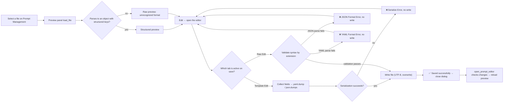

# Prompt Structured Editor

When you need to edit a custom translation prompt file under `dict/`, the “Edit” (`Edit`) action on the Prompt Management page opens the structured editor. The editor offers two modes: “Template Edit” (`Template Edit`), which turns the structured fields of a YAML/JSON file into a form, and “Raw Edit” (`Raw Edit`), which edits the file text directly. This page covers how the two modes are decided, the fields and formats, validation errors, and how the file is consumed and restored after saving.

This page covers the editor itself. The file list, create/copy/rename/delete, and applying a prompt are covered by [Prompt list, apply, and preview](./list-apply-and-preview.md); system prompts and output-format composition are covered by [System and translation prompts](./system-and-translation-prompts.md) and [Context and prompts](../translator/context-and-prompts.md).

## Feature boundary

- The structured editor reads and writes user prompt files under `dict/` (`.yaml`, `.yml`, `.json`); it never writes `.env`, `config.json`, or any API credential.
- The editor only writes the file back; “Apply Selected Prompt” (`Apply Selected Prompt`) writes the path to `translator.high_quality_prompt_path` and belongs to the prompt-list page.
- A file containing `ai_colorizer_prompt`, `colorization_rules`, or `reference_images` is recognized as an AI colorizer prompt and is opened by the dedicated colorizer editor instead of the generic structured fields.
- Fixed AI OCR and AI renderer prompts use their own simple editors in Settings and never enter this page's template fields; system prompt files (`system_prompt_hq`, `system_prompt_hq_format`, `system_prompt_line_break`, `glossary_extraction_prompt`) do not appear in the user prompt list.
- The page records structure and sanitized placeholders only; it never shows real prompt bodies, keys, or private paths.

## UI operations

### Open the editor {#open-editor}

1. Open “Prompt Management” (`Prompt Management`) and select a file in the “Prompt List” (`Prompt List`) on the left. The “Prompt Preview” (`Prompt Preview`) panel on the right shows a structured preview or the raw content.
2. Click “Edit” (`Edit`) in the top-right of the preview panel to open the “Edit Prompt” (`Edit Prompt`) dialog; the window title looks like “Edit Prompt – filename”.
3. When the file is missing, the preview panel shows “File not found” (`File not found`) and “Edit” is disabled; when the file cannot be read, the editor status bar shows “Error: {error}” (`Error: {error}`).
4. The “Custom Prompt” (`Custom Prompt`) control in the “Translation” (`Translation`) group of Settings is a combo box that only selects the current prompt file; editing the file content requires opening the editor from the Prompt Management page.

### Template Edit and Raw Edit tabs {#editor-tabs}

The top of the editor has two tabs:

- “Template Edit” (`Template Edit`): shown only when the file can be parsed into structured fields; it splits fields into a form and offers “Add Section” (`Add Section`), move up/down, and delete actions.
- “Raw Edit” (`Raw Edit`): always shown; it edits the raw file text in a monospace editor with the hint “Edit the raw file content directly” (`Edit the raw file content directly`).

Files that do not match the format show only the “Raw Edit” tab. Both tabs share the same “Save” (`Save`) button and bottom status bar; after saving, the two tabs are synchronized.

### Editor copy {#editor-copy}

| UI call key | English actual value | Simplified Chinese actual value |
| --- | --- | --- |
| `Prompt Management` | Prompt Management | 提示词管理 |
| `Prompt List` | Prompt List | 提示词列表 |
| `Prompt Preview` | Prompt Preview | 提示词预览 |
| `Edit` | Edit | 编辑 |
| `Edit Prompt` | Edit Prompt | 编辑提示词 |
| `Template Edit` | Template Edit | 模板编辑 |
| `Raw Edit` | Raw Edit | 源码编辑 |
| `Edit the raw file content directly` | Edit the raw file content directly | 直接编辑文件原始内容 |
| `Add Section` | Add Section | 添加字段 |
| `All sections added` | All sections added | 所有字段已添加 |
| `Move Up` | Move Up | 上移 |
| `Move Down` | Move Down | 下移 |
| `Add Row` | Add Row | 添加行 |
| `Delete Row` | Delete Row | 删除行 |
| `One rule per line` | One rule per line | 每行一条规则 |
| `Double-click a row to edit details` | Double-click a row to edit details | 双击行可编辑详细信息 |
| `Save` | Save | 保存 |
| `Cancel` | Cancel | 取消 |
| `Loaded successfully` | Loaded successfully | 加载成功 |
| `Error: {error}` | Error: {error} | 错误：{error} |
| `Serialize Error` | Serialize Error | 序列化错误 |
| `Format Error` | Format Error | 格式错误 |
| `Saved successfully` | Saved successfully | 保存成功 |
| `Save failed` | Save failed | 保存失败 |
| `File not found` | File not found | 文件不存在 |
| `Select a prompt file to preview` | Select a prompt file to preview | 选择一个提示词文件以预览 |
| `Unrecognized format – showing raw content` | Unrecognized format – showing raw content | 无法识别格式 – 显示原始内容 |
| `Error reading file: {error}` | Error reading file: {error} | 读取文件出错：{error} |

Structured titles, table headers, and glossary-category labels in the preview panel and editor are also translated through `_t(...)`; the actual values appear in the tables below.

## Structured fields and detection {#structured-fields}

### Structured detection {#structured-detection}

A file is parsed by extension first: `.yaml`/`.yml` use PyYAML `safe_load`, everything else uses `json.load`. The result must be an object (dict) and contain at least one of the following keys to be treated as structured:

| Detection key | Meaning | Handling in the editor |
| --- | --- | --- |
| `system_prompt` | Custom system-prompt text | Multi-line text box in Template Edit |
| `project_data` | Project title and terminology | Two sub-fields: `title` and `terminology` |
| `style_guide` | List of style-guide rules | Multi-line text box, one rule per line |
| `translation_rules` | List of translation rules | Multi-line text box, one rule per line |
| `glossary` | Glossary organized by category | Per-category tabbed tables |

When parsing fails, the root is not an object, or none of these keys is present, the preview shows “Unrecognized format – showing raw content” and the editor keeps only the “Raw Edit” tab. Root-type errors correspond to “JSON root must be an object” (`JSON root must be an object`) and “YAML root must be a mapping” (`YAML root must be a mapping`) in the related editors.

### Fields and controls {#fields-table}

The Template Edit tab creates one section per field already present in the file; missing fields can be added with “Add Section” (`Add Section`). Each section can be moved up, moved down, or deleted; the section order determines the key order of the saved file.

| Field key | Control | Serialized result on save |
| --- | --- | --- |
| `system_prompt` | Multi-line text box | String |
| `project_data.title` | Single-line input | `title` under `project_data` |
| `project_data.terminology` | Original/translation two-column table | `terminology` mapping under `project_data` |
| `style_guide` | “One rule per line” text box | List of strings |
| `translation_rules` | “One rule per line” text box | List of strings |
| `glossary` | Per-category tabbed tables | Mapping of category to entry lists |

Other keys without a dedicated control in the template are preserved as-is (“passthrough”) and are not dropped by a template save; for example `output_format`, `persona`, or future extension keys keep their values when data is collected.

### Glossary categories {#glossary-categories}

The tabs under `glossary` follow the fixed category order below; the category is the stored value and is not translated. Standard categories show translated tab labels through `_t(cat_key)`; note that the actual English value for `Org` is not `Org`.

| Stored category | English actual value (tab label) | Simplified Chinese actual value (tab label) |
| --- | --- | --- |
| `Person` | Person | 人物 |
| `Location` | Location | 地点 |
| `Org` | Organization | 组织 |
| `Item` | Item | 物品 |
| `Skill` | Skill | 技能 |
| `Creature` | Creature | 生物 |

The `Person` category uses a four-column table (`Original` 原文, `Translation` 翻译, `Nicknames` 昵称, `Introduction` 介绍); double-clicking a row opens an entry dialog where you can change `Category` and move the entry to another category. Other categories use a two-column original/translation table. `nicknames` and `description` are written to the file only when non-empty. Empty categories are kept so that `glossary` is not collapsed to an empty object after saving.

## Validation, saving, and recovery {#validation-save-restore}

### Saving from the Template tab {#template-save}

1. Clicking “Save” (`Save`) first collects data from the controls (`_collect_template_data`).
2. It serializes by file extension: `.yaml`/`.yml` use `yaml.dump(allow_unicode=True, default_flow_style=False, sort_keys=False)`; `.json` uses `json.dumps(indent=2, ensure_ascii=False)`.
3. A serialization exception shows “❌ Serialize Error” (`Serialize Error`) in the status bar and does not write the file.
4. On success the status bar shows “✅ Saved successfully” (`Saved successfully`), the Raw tab is synchronized to the same text, and the dialog closes.

### Saving from the Raw tab {#raw-save}

Before writing, the Raw tab validates syntax by extension; validation failure does not write the file:

- `.json`: `json.loads(content)` fails → “❌ JSON Format Error” (`Format Error`).
- `.yaml`/`.yml`: `yaml.safe_load(content)` fails → “❌ YAML Format Error” (`Format Error`).

Validation checks syntax only, not the root type. The file is written as UTF-8 and overwrites the original in place. A write exception shows “❌ Save failed” (`Save failed`) and the dialog stays open.

### Statuses and errors {#status-errors}

| Status | Trigger | Result |
| --- | --- | --- |
| `Loaded successfully` | File read and parsed | Ready to edit |
| `Error: {error}` | File read failure | Error shown, empty content |
| `Serialize Error` | Template collection or serialization exception | No write; dialog stays open |
| `Format Error` | JSON/YAML syntax error in Raw | No write; dialog stays open |
| `Save failed` | File write exception | No write; dialog stays open |
| `Saved successfully` | Write succeeded | Both tabs synchronized; dialog closes |

### Closing and recovery {#close-restore}

- “Cancel” (`Cancel`) or closing the window never writes; edits live only in the current session's controls.
- After the editor closes, the caller reads `get_was_modified()`; if a save happened or the Raw tab differs from the original, the preview panel is reloaded to show the latest file content.
- Prompt files have no automatic backup: the editor overwrites in place and does not create a `.bak` before saving. Restoring old content requires your own copy or version control, unlike batch schemes which write `.bak`.
- If a file becomes unparseable, translation does not crash: it skips the custom prompt and keeps the built-in base system prompt. Fix the file and reopen the editor to restore the custom prompt.

## Runtime consumption {#runtime-consumption}

Before translation starts, `_load_and_prepare_prompts` reads `translator.high_quality_prompt_path` and parses the file with `load_custom_prompt` (lookup order `.yaml` → `.yml` → `.json`; a non-object root returns empty). The parsed structured data is then flattened into a text block by `_flatten_prompt_data` and injected into the OpenAI/Gemini system prompt; the target-language placeholder (written as a three-brace `target_lang` placeholder) is replaced with the full target-language name.

With “Auto Extract Glossary” (`Auto Extract Glossary`, key `translator.extract_glossary`) enabled, newly extracted terms are merged back into the file's `glossary` by `merge_glossary_to_file` (writing YAML or JSON by extension). In other words, besides the editor, a running translation can also write the prompt file back when the conditions are met.

## Dependencies and conflicts

- The format depends on PyYAML at runtime: when `PyYAML` is missing, `.yaml`/`.yml` cannot be parsed, the editor falls back to Raw mode, and translation skips the custom prompt.
- A prompt file affects only the translation request's system prompt; it does not store API credentials, choose a translator, or participate in API-slot rotation.
- A template save preserves unknown keys, but keys and formats you hand-write in the Raw tab are your responsibility; a wrong root type (for example a top-level list) is not recognized as structured.
- Do not put API keys, tokens, usernames, private absolute paths, or sensitive business text into a prompt file; the file is flattened verbatim into requests and may appear in logs and debug artifacts.
- Automatic glossary merging modifies the current prompt file; if you do not want the runtime to change the file, disable “Auto Extract Glossary” or use a read-only copy.

## Related files and formats

| File/format | Actual role on this page | Manual-edit and compatibility note |
| --- | --- | --- |
| `dict/*.yaml`, `*.yml`, `*.json` | Input/output formats of the structured editor | YAML via `safe_load`/`dump`, JSON via `json.load`/`dumps`; root must be an object |
| `dict/prompt_example.yaml` | Default template for new prompts | Contains `system_prompt: ""` and the six-category `glossary`; record structure only, never private bodies |
| `config/config.json` | Stores `translator.high_quality_prompt_path` | The editor does not write it; applying a prompt updates the path |
| `dict/system_prompt_hq*.yaml` etc. | System prompt files | Not in the user prompt list and not in this page's template fields |
| `desktop_qt_ui/locales/en_US.json`, `zh_CN.json` | Editor and preview copy | Key-to-actual-value mapping in the tables above |

## Mermaid data-flow limits

The diagram describes the source-confirmed “structured/Raw detection → per-tab save → validation/serialization → write-back → preview refresh” flow; it does not claim that every open saves or sends a network request. Unparseable files, wrong root types, Raw syntax errors, and cancel-close take their documented bypasses. No runtime screenshot or private task artifact has been fabricated.

## Source evidence {#source-evidence}

| Layer | File | What was checked |
| --- | --- | --- |
| Editor UI | `desktop_qt_ui/ui/secondary_pages/prompt_preview.py` | Structured detection, template/Raw tabs, field controls, save and validation statuses |
| Prompt page | `desktop_qt_ui/ui/main_page/pages/prompt_page.py`, `ui/main_page/layout.py` | Preview panel, Edit entry, refresh after editor close |
| AI colorizer dispatch | `desktop_qt_ui/ui/secondary_pages/ai_colorizer_prompt_editor.py` | Dedicated field detection and template tabs |
| UI/i18n | `desktop_qt_ui/app_logic.py`, `desktop_qt_ui/locales/en_US.json`, `zh_CN.json` | Key mapping and actual bilingual display values |
| File loading | `manga_translator/translators/prompt_loader.py`, `desktop_qt_ui/app_logic.py` | YAML/JSON parsing, extension lookup, system-file exclusion |
| Runtime consumption | `manga_translator/manga_translator.py`, `translators/common.py` | Prompt preparation, flattening, placeholder replacement, base-prompt fallback |
| Write-back | `manga_translator/translators/common.py` | Automatic glossary merge into `glossary` |

## Verification {#verification}

| Check | Status | Notes |
| --- | --- | --- |
| BLUEPRINT, PAGE_GUIDELINES, TODO | Complete | Read section 1.3 and subsection 5.7; followed the page contract |
| Editor UI and call chain | Complete | Statically checked `prompt_preview.py`, `prompt_page.py`, `layout.py`, and the dispatch logic |
| `en_US` / `zh_CN` actual locales | Complete | The tables record key, actual English, and actual Simplified Chinese values |
| File format and runtime consumption | Complete | Statically checked `prompt_loader.py`, `manga_translator.py`, and `common.py` |
| Sanitized runtime verification | Deferred | No real `.env`, user `config.json`, API key/token, username, user image, or private prompt was read |
| VitePress | Deferred | Coordinator should run `npm run docs:build --prefix doc/wiki` plus mirror/source checks before merge |
