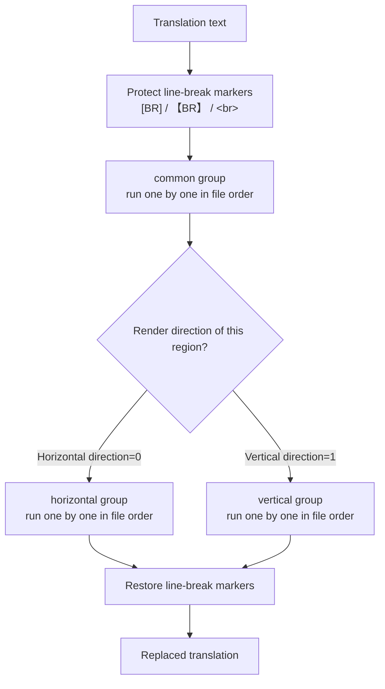
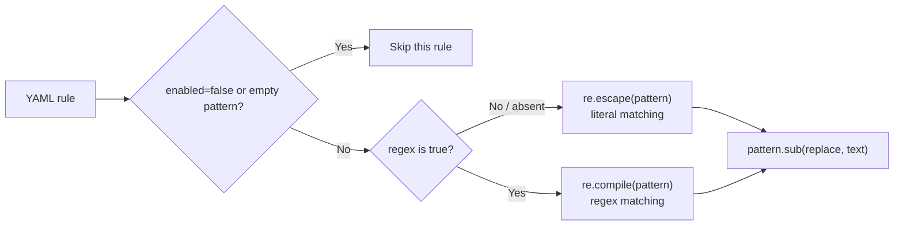
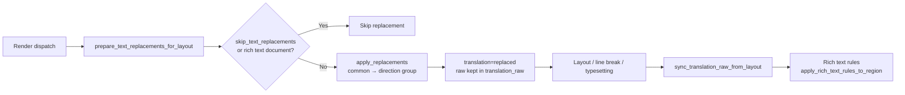

# Replacement Rule Table: Groups, Order, and Matching

Use this page when fixed words, punctuation, or vertical glyphs in translations need consistent rewriting. The “Replacement Rules” (`Replacement Rules`) page maintains a set of rules applied to translations before rendering. Every rule is loaded from `config/text_replacements.yaml` and applied top to bottom in the fixed order “Common (Always), then Horizontal/Vertical”. This page explains how the rules are grouped, ordered, and matched.

This page covers the table view: groups, execution order, literal/regex matching, and where replacements run in the render pipeline. The raw YAML edit mode, regex syntax details, and the full save/restore behavior are covered by [Raw YAML, regex, and save](./raw-yaml-regex-and-save.md); the rich-text rules applied after replacements are covered by [Rich text rule table: table, raw, and match](../rich-text-rules/table-raw-and-match.md).

## Feature boundary {#feature-boundary}

- The three groups are fixed as `common`, `horizontal`, and `vertical`: `common` always runs, `horizontal` runs only for horizontal rendering, and `vertical` runs only for vertical rendering.
- Each rule has five fields — `pattern`, `replace`, `regex`, `enabled`, `comment` — shown as five table columns in the table view.
- Rules execute top to bottom within the file: earlier rules in the same group run first, and the output of one rule keeps participating in later matches (cascade).
- This page does not cover YAML syntax validation in Raw edit mode or restoring defaults (see [Raw YAML, regex, and save](./raw-yaml-regex-and-save.md)), nor the rich-text rules applied after replacement (see the [Rich text rules](../rich-text-rules/table-raw-and-match.md) pages).

## Edit the rule table in the UI {#edit-rule-table}

Open “Replacement Rules” (`Replacement Rules`) in the main navigation. The subtitle under the page title summarizes the rule order (“Common (Always) → Horizontal/Vertical; rules cascade from top to bottom”). The page consists of one header card and one editor panel; there are no other tabs or dialogs.

### The three group tabs {#group-tabs}

At the top of the table view there is a group switcher with three fixed tabs. Switching tabs only changes which group you are editing; it does not modify the other groups and does not trigger any runtime behavior beyond saving.

| Stored value | English | Simplified Chinese | When it runs |
| --- | --- | --- | --- |
| `common` | Common (Always) | 通用（始终执行） | Always, before the other groups |
| `horizontal` | Horizontal | 横排 | When the region renders horizontally (direction resolves to horizontal), after `common` |
| `vertical` | Vertical | 竖排 | When the region renders vertically (direction resolves to vertical), after `common` |

### Table columns and toolbar {#table-columns-and-toolbar}

The table has five columns: “Enabled” (`Enabled`), “Pattern” (`Pattern`), “Replace” (`Replace`), “Regex” (`Regex`), and “Comment” (`Comment`). Enabled and Regex are text columns (`✓`/`✗`); double-click a cell to toggle it. The `✓`/`✗` glyphs are code constants, not i18n keys.

The toolbar buttons, left to right, are: “Add Rule” (`Add Rule`), “Delete” (`Delete`), move up/down (`↑`/`↓`, icon-only with a fixed width), “Select All” (`Select All`), “Enable/Disable” (`Enable`/`Disable`), “Regex/Cancel Regex” (`Regex`/`Cancel Regex`), and “Restore Default” (`Restore Default`).

| UI call key | English actual value | Simplified Chinese actual value |
| --- | --- | --- |
| `Replacement Rules` | Replacement Rules | 替换规则 |
| `Manage text replacement rules applied to translations before rendering` | Manage text replacements (order: Common (Always), then Horizontal/Vertical; rules cascade from top to bottom). | 管理应用到译文的文本替换规则（顺序：通用（始终执行）→ 横排/竖排；规则由上到下级联替换） |
| `Add Rule` | Add Rule | 添加规则 |
| `Delete` | Delete | 删除 |
| `Select All` | Select All | 全部选中 |
| `Enable` | Enable | 启用 |
| `Disable` | Disable | 禁用 |
| `Regex` | Regex | 正则 |
| `Cancel Regex` | Cancel Regex | 取消正则 |
| `Restore Default` | Restore Default | 恢复默认 |
| `Table View` | Table View | 表格视图 |
| `Raw Edit` | Raw Edit | 源码编辑 |
| `Common (Always)` | Common (Always) | 通用（始终执行） |
| `Horizontal` | Horizontal | 横排 |
| `Vertical` | Vertical | 竖排 |
| `Enabled` | Enabled | 启用 |
| `Pattern` | Pattern | 匹配 |
| `Replace` | Replace | 替换 |
| `Comment` | Comment | 备注 |
| `Filter:` | Filter: | 过滤: |
| `Type to filter by pattern / replace / comment...` | Type to filter by pattern / replace / comment... | 输入匹配 / 替换 / 备注以过滤... |
| `enabled` | enabled | 已启用 |
| `Saved automatically` | Saved automatically | 已自动保存 |
| `File not found` | File not found | 文件不存在 |
| `Load error` | Load error | 加载失败 |
| `Defaults restored` | Defaults restored | 已恢复默认 |
| `Restore default failed` | Restore default failed | 恢复默认失败 |
| `Parse Error` | Parse Error | 解析错误 |
| `Save Error` | Save Error | 保存错误 |
| `Save error` | Save error | 保存失败 |
| `Restore replacement rules to the built-in defaults? Current custom rules will be overwritten.` | Restore replacement rules to the built-in defaults? Current custom rules will be overwritten. | 要将替换规则恢复为内置默认值吗？当前自定义规则会被覆盖。 |
| `YAML syntax error, cannot switch to table view.` | YAML syntax error, cannot switch to table view. | YAML 语法错误，无法切换到表格视图。 |
| `YAML syntax error, changes not saved.` | YAML syntax error, changes not saved. | YAML 语法错误，修改尚未保存。 |

Steps:

1. Click “Add Rule” (`Add Rule`) under a group tab. A new row is appended at the end: Enabled is `✓`, Regex is `✗`, and Pattern/Replace/Comment are empty; the “Pattern” cell enters edit mode automatically.
2. Enter content in the “Pattern” and “Replace” columns. Keep “Regex” as `✗` for literal replacement, or double-click it to `✓` for regex replacement.
3. Use move up/down (`↑`/`↓`) to change the order of the current selected row within the group; order decides the cascade sequence.
4. Select one or more rows, then click “Enable/Disable” (`Enable`/`Disable`) or “Regex/Cancel Regex” (`Regex`/`Cancel Regex`) to toggle them in bulk; the button label follows the majority state of the selected rows — for example, it shows “Disable” when most are enabled.
5. Click “Delete” (`Delete`) to remove the current row (one row at a time). Edits trigger a 600 ms debounced auto-save; after a successful save the status bar shows “Saved automatically”.
6. Click “Restore Default” (`Restore Default`) to open a confirmation dialog; confirming overwrites `config/text_replacements.yaml` with the built-in default template and reloads it.

“Select All” (`Select All`) only selects the rows of the current group that are not hidden by the filter; hidden rows do not take part in the following Enable/Regex bulk toggles.

### Filter and status {#filter-and-status}

The filter box placeholder reads “Type to filter by pattern / replace / comment...”. Typing shows only the current-group rows whose Pattern, Replace, or Comment contains the text; filtering never changes the file content, and switching group tabs re-applies the filter.

The status bar at the bottom uses the format `group: enabled/total enabled ● [mode]`, for example `common: 2/3 enabled ● [Table View]`. `●` means there are unsaved changes; a missing file shows “File not found”, and a load failure shows “Load error”.

## Rule fields {#rule-fields}

The following five fields are the stored fields behind the five table columns. `regex`, `enabled`, and `comment` are optional and are written back to YAML only when they differ from the default; the table save skips whole rows with an empty “Pattern”.

#### `pattern` — 匹配 / Pattern {#rule-pattern}

- Control: text input in the “Pattern” column; a new rule enters edit mode automatically.
- Location: Replacement Rules → Table View → any group.
- Stored value: the `pattern` string of the YAML rule.
- Options: any text; parsed as Python `re` syntax when `regex: true`.
- Defaults: the core engine requires a non-empty value (empty rules are not compiled); a new table row defaults to an empty string.
- Effective stage: pre-render text replacement (`apply_replacements` and the entry-based `apply_replacements_to_entries`).
- Mechanism: literal patterns are compiled with `re.escape(pattern)`; regex patterns with `re.compile(pattern)`. A rule that fails to compile (regex syntax error) is skipped while the remaining rules still run.
- Dependencies/conflicts: an empty pattern is not written to YAML (the table save skips it); the line-break marker placeholders are never rewritten, see [Matching logic](#matching-logic).
- Related files and debug artifacts: `config/text_replacements.yaml`.
- Source evidence: `manga_translator/rendering/text_replacements.py#_compile_rule`; table column in `desktop_qt_ui/ui/secondary_pages/replacements_editor.py`.
- Verification status: complete (static check).

#### `replace` — 替换 / Replace {#rule-replace}

- Control: text input in the “Replace” column.
- Location: Replacement Rules → Table View → any group.
- Stored value: the `replace` string of the YAML rule; an empty string is allowed (removes the matched content).
- Options: any text; regex mode supports backreferences (such as `\1`), see [Raw YAML, regex, and save](./raw-yaml-regex-and-save.md).
- Defaults: a new table row defaults to an empty string; the engine uses `rule.get('replace', '')` when absent.
- Effective stage: pre-render text replacement.
- Mechanism: `compiled_pattern.sub(replace, text)` replaces every non-overlapping match; within a group, the next rule reads the output of the previous rule.
- Dependencies/conflicts: a replaced result that matches a later rule is replaced again (cascade); in the entry-based version, replacement characters inherit the style of the first character of the replaced span.
- Related files and debug artifacts: `config/text_replacements.yaml`.
- Source evidence: `manga_translator/rendering/text_replacements.py#apply_replacements`, `manga_translator/rendering/rich_text_sync.py#apply_replacements_to_entries`.
- Verification status: complete (static check).

#### `regex` — 正则 / Regex {#rule-regex}

- Control: the “Regex” column (`✓`/`✗`), toggled by double-click or by selecting rows and clicking “Regex/Cancel Regex” (`Regex`/`Cancel Regex`).
- Location: Replacement Rules → Table View → any group.
- Stored value: the `regex` boolean of the YAML rule; only `true` is written, `false` is omitted.
- Options: `true` (regex matching), `false`/absent (literal matching).
- Defaults: the engine uses `rule.get('regex', False)`; a new table row is `✗`.
- Effective stage: the rule-compilation stage decides how patterns match.
- Mechanism: literal mode escapes every regex metacharacter in the pattern and searches plain text; regex mode compiles the pattern with Python `re` syntax.
- Dependencies/conflicts: with regex enabled, metacharacters such as `.` and `*` in the pattern are no longer literal; a regex compile failure skips that rule and logs a warning.
- Related files and debug artifacts: `config/text_replacements.yaml`.
- Source evidence: `manga_translator/rendering/text_replacements.py#_compile_rule`.
- Verification status: complete (static check).

#### `enabled` — 启用 / Enabled {#rule-enabled}

- Control: the “Enabled” column (`✓`/`✗`), toggled by double-click or by selecting rows and clicking “Enable/Disable” (`Enable`/`Disable`); disabled rows are dimmed.
- Location: Replacement Rules → Table View → any group.
- Stored value: the `enabled` boolean of the YAML rule; only `false` is written, `true` is omitted.
- Options: `true`/absent (runs), `false` (skipped).
- Defaults: the engine uses `rule.get('enabled', True)`; a new table row is `✓`.
- Effective stage: the rule-compilation stage; a rule with `enabled: false` is not compiled and does not run.
- Mechanism: a disabled rule stays in the file and in the table; it is only skipped at runtime. Turn the cell back to `✓` to re-enable it.
- Dependencies/conflicts: disabling never deletes rule content; the “enabled/total” numbers in the status bar are counted from the Enabled column.
- Related files and debug artifacts: `config/text_replacements.yaml`.
- Source evidence: `manga_translator/rendering/text_replacements.py#_compile_rule`, `desktop_qt_ui/ui/secondary_pages/replacements_editor.py#_on_toggle_enabled`.
- Verification status: complete (static check).

#### `comment` — 备注 / Comment {#rule-comment}

- Control: text input in the “Comment” column.
- Location: Replacement Rules → Table View → any group.
- Stored value: the `comment` string of the YAML rule; written only when non-empty.
- Options: any text; it never participates in matching.
- Defaults: a new table row is an empty string.
- Effective stage: none (purely descriptive).
- Mechanism: comments are not compiled and never replace anything; the filter box concatenates Pattern, Replace, and Comment and does a case-insensitive substring match.
- Dependencies/conflicts: no runtime effect; write down the purpose of the rule to make filtering easier.
- Related files and debug artifacts: `config/text_replacements.yaml`.
- Source evidence: `desktop_qt_ui/ui/secondary_pages/replacements_editor.py#_add_rule_to_table`, `_apply_filter`.
- Verification status: complete (static check).

## Groups and execution order {#groups-and-order}

For one translation string, the engine runs in this order: protect line-break markers, apply the `common` group, apply the `horizontal` or `vertical` group according to the region render direction, then restore the line-break markers.

The direction is decided by `_resolve_region_render_horizontal`: when a region has a forced direction (`h`/`horizontal` → horizontal, `v`/`vertical` → vertical) it follows the forced value; otherwise it falls back to the detected region direction (the `region.horizontal` property, inferred from the target-language preset or aspect ratio). The render direction is decided by render settings and detection results; replacement rules never change the direction.

Inside one group, earlier rules run first and later rules keep matching on the already replaced text, so the order directly affects the result. For example, running `A → B` first and then `B → C` turns `A` into `C`; if the two rules are reversed, `B → C` never matches `A`.

## Matching logic {#matching-logic}

Each rule is first compiled into `(compiled_pattern, replace_string)` and then applied to the text with `pattern.sub(replace, text)`. The `regex` field decides how the pattern matches:

- Literal matching: regex metacharacters such as `.`, `*`, and `(` in the pattern are escaped and the text is matched character by character.
- Regex matching: the pattern is compiled with Python `re` syntax and supports features such as backreferences; a syntax error skips that rule with a warning and does not affect the other rules.
- Line-break marker protection: `[BR]`, `【BR】`, ` `, and ` ` (case-insensitive) are replaced with placeholders before replacement and restored afterwards, so marker content is never rewritten.
- The entry-based version (`apply_replacements_to_entries`) additionally skips empty matches and matches crossing `\n`; the replacement characters inherit the style of the first character of the replaced span.
- The module also provides two helpers, `build_h2v_dict`/`build_v2h_dict`, that extract single-character literal mappings from the vertical/horizontal groups; the current render pipeline does not reference them (static check).

## Where replacements run in the render pipeline {#render-pipeline}

Replacement runs in the rendering stage, before layout measurement. The result is written to `region.translation` while the pre-replacement text stays in `region.translation_raw`; layout and line breaking can still modify the translation afterwards, and finally the changes are projected back to the raw coordinates and the rich-text rules run.

- When `skip_text_replacements` is true, replacement is skipped entirely: rendered JSON exports write `skip_text_replacements: true` so re-imported rendering does not apply the rules a second time; editor exports always mark the flag; when absent from JSON the default is `false`, so imported rendering applies replacement normally.
- Rich text documents (`is_rich_text_document`) and regions that already carry a replacement record are not replaced twice; the pre-replacement text is kept in `ReplacementLayoutRecord(raw_text, replaced_text)` so layout edits can be projected back to the raw coordinates.
- In the editor, editing the “pre-replacement translation” (`translation_raw`) calls `editor_controller._apply_translation_replacements`, which syncs to the translation in real time with the same engine and falls back to the raw text on failure.
- Rich text synchronization (`rich_text_sync.py`) runs the same common + direction groups on rich text entries (the “entry-based” version) and places the rich-text rules after replacement.

## Dependencies and conflicts {#dependencies-and-conflicts}

- Which direction group runs depends on the region render direction, which is related to the “Direction” render setting and the detection result; replacement rules never change the direction.
- `text_replacements.yaml` and `rich_text_rules.yaml` are separate files: replacement runs before the rich-text rules, and the rich-text rules read the already-replaced translation.
- `batch_edit_schemes.yaml` lives in the same directory and uses the same YAML format, but belongs to the batch-management module and never enters the render pipeline.
- At startup, `ensure_runtime_files` creates a missing `config/text_replacements.yaml` and upgrades legacy default templates (identified by MD5) to the current built-in template; user custom content is never overwritten.
- Rule content may contain business terminology or special text. Before sharing logs, request exports, or debug directories, remove request bodies, historical text, paths, and credentials.

## Related files and formats {#related-files-and-formats}

| File/format | Actual role on this page | Manual-edit and compatibility note |
| --- | --- | --- |
| `config/text_replacements.yaml` | The persistence file for replacement rules; read and written directly by the table view | Keep the three top-level groups (`common`/`horizontal`/`vertical`) as lists; the table save rewrites the keys in the fixed group order |
| Built-in default template (`_DEFAULT_REPLACEMENTS_YAML`) | Content written by “Restore Default”; created at startup when the file is missing | Use sanitized examples only; restoring defaults overwrites custom rules |
| `config/rich_text_rules.yaml` | The rich-text rules file, executed after replacement | Independent of replacement rules; see the rich-text-rules pages |
| `config/batch_edit_schemes.yaml` | Batch scheme file | Does not participate in rendering; see the batch-management pages |
| `skip_text_replacements` flag in translation JSON | Records whether an image already has replacement applied, to avoid applying it twice on re-render | Defaults to `false`; do not edit the flag by hand |

## Mermaid data-flow limits {#diagram-limits}

The three diagrams above describe the source-confirmed group order, matching branches, and render call positions; they do not claim that every run performs replacement. `skip_text_replacements`, rich text documents, empty translations, load failures, and special workflows take their documented bypasses. No runtime screenshot or private task artifact has been fabricated; table examples use sanitized content only.

## Source evidence {#source-evidence}

| Layer | File | What was checked |
| --- | --- | --- |
| Page entry | `desktop_qt_ui/ui/main_page/pages/replacements_page.py` | Page title/subtitle and the embedded editor panel |
| Main navigation | `desktop_qt_ui/ui/main_window.py` | “Replacement Rules” navigation item and language-switch refresh |
| Editor panel | `desktop_qt_ui/ui/secondary_pages/replacements_editor.py` | Three group tabs, five-column table, toolbar, filter, status bar, debounced auto-save, cache invalidation, restore defaults |
| UI/i18n | `desktop_qt_ui/locales/en_US.json`, `zh_CN.json` | Key mapping and actual bilingual display values |
| Engine | `manga_translator/rendering/text_replacements.py` | Group parsing, literal/regex compilation, common → direction group order, marker protection, mtime cache, restore defaults |
| Render call | `manga_translator/rendering/text_replacement_layout.py` | `prepare_text_replacements_for_layout`, `sync_translation_raw_from_layout`, `skip_text_replacements` |
| Direction and dispatch | `manga_translator/rendering/__init__.py` | `_resolve_region_render_horizontal` and its two call sites |
| Entry-based rich text | `manga_translator/rendering/rich_text_sync.py` | `apply_replacements_to_entries`, style inheritance, empty/cross-line skip |
| Editor consumer | `desktop_qt_ui/editor/editor_controller.py` | Live sync when editing the pre-replacement translation |
| JSON round trip | `manga_translator/manga_translator.py`, `desktop_qt_ui/services/export_service.py` | Write and read of `skip_text_replacements` |
| Runtime files | `manga_translator/runtime_files.py` | Startup creation and default-template migration |

## Verification {#verification}

| Check | Status | Notes |
| --- | --- | --- |
| BLUEPRINT, PAGE_GUIDELINES, TODO | Complete | Read in full and followed the page contract |
| UI layout and calls | Complete | Statically checked navigation, page, and editor panel: groups/columns/toolbar/filter/status |
| `en_US` / `zh_CN` actual locales | Complete | Three-column tables record key, actual English, and actual Simplified Chinese values |
| Group order and matching logic | Complete | Statically checked `text_replacements.py`, `text_replacement_layout.py`, `rich_text_sync.py`, and the call graphs |
| Sanitized runtime verification | Deferred | No real `.env`, user `config.json`, API key/token, username, user image, or private rule body was read |
| VitePress | Deferred | Coordinator should run `npm run docs:build --prefix doc/wiki` plus mirror/source checks before merge |
