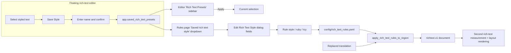

# Rich Text Styles and Presets

Use this page when a rule must do more than change text: it also adjusts font size, color, stroke, spacing, or direction on matched text, and when you want to load a style preset saved in the editor directly into a rule. Rule matching, table, and Raw editing are covered in [Rich-text rules: table, Raw, and matching](./table-raw-and-match.md); manually creating style presets in the editor is covered in [Floating rich-text editor](../editor/floating-rich-text.md).

## Feature boundary

- Each rule stores its styling in the `style`, `ruby`, and `tcy` fields of `config/rich_text_rules.yaml`; every control in the “Edit Rich Text Style” (`Edit Rich Text Style`) dialog maps back to one of those fields.
- The “Saved rich text style:” (`Saved rich text style:`) dropdown only reads `app.saved_rich_text_presets`; this page does not create, rename, or delete presets. Preset CRUD happens in the “Rich Text Presets” (`Rich Text Presets`) sidebar of the editor's floating rich-text panel.
- Automatic rules use “fill missing fields only” semantics: existing manual rich-text fields are preserved and rules only append fields that are not set yet. The editor's incremental path instead uses `skip` semantics and skips a whole match when the span carries manual rich text.
- `editor_auto_rich_text_rules` is the switch that auto-applies rules while typing in the editor; it is not the rules file itself and does not control the render pipeline.
- TCY and Ruby are node-level structures, not `TextStyle` fields; rules write them through the top-level `tcy` and `ruby` fields.

## UI operations

### Open the style dialog {#open-style-dialog}

1. Open the “Rich Text Rules” (`Rich Text Rules`) page.
2. Stay in “Table View” (`Table View`) and choose the rule group: “Common (Always)” (`Common (Always)`), “Horizontal” (`Horizontal`), or “Vertical” (`Vertical`).
3. Double-click or select the “Edit Style” (`Edit Style`) button in the “Rich Text Style” (`Rich Text Style`) column of the target row to open the “Edit Rich Text Style” (`Edit Rich Text Style`) dialog.
4. Enable only the properties this rule should add; disabled fields are not written to the rule. The hint reads: “Enable only the style properties this rule should add. Existing matching rich-text fields are preserved and are not overwritten.”
5. Click “OK” (`OK`) to serialize the fields back into the rule and trigger autosave; click “Reset” (`Reset`) to clear all styles; “Cancel” (`Cancel`) discards the changes. Serialization failure shows the “Invalid Style” (`Invalid Style`) warning.

### Load a saved style {#load-saved-style}

1. At the top of the “Edit Rich Text Style” dialog, choose a name from the “Saved rich text style:” (`Saved rich text style:`) dropdown.
2. Selecting a name loads every field of that preset into the controls at once (including Ruby and TCY); fine-tune as needed.
3. The first item is “Select saved rich text style” (`Select saved rich text style`) and does not represent any preset. The dropdown tooltip is “Choose a saved rich text style to load” (`Choose a saved rich text style to load`).

### Style summary and filtering {#style-summary}

- The “Rich Text Style” column button shows an abbreviation summary of the set fields: `B` bold, `I` italic, `U` underline, `C` color, `%` scale, `S` font size, `F` font family, `O` stroke, `OS` outer stroke, `G` glow, `D` emphasis, `FA` force advance, `K` kerning, `PK` pre kerning, `LK` line kerning, `NK` next kerning, `XY/Rot` transform, `R` ruby, `T` TCY.
- The filter box “Type to filter by pattern / style / comment...” (`Type to filter by pattern / style / comment...`) also matches the style JSON, so you can locate rules by typing a color value or a font size.

### Dialog and page strings {#ui-strings}

| UI call key | English actual value | Simplified Chinese actual value |
| --- | --- | --- |
| `Rich Text Rules` | Rich Text Rules | 富文本规则 |
| `Table View` | Table View | 表格视图 |
| `Raw Edit` | Raw Edit | 源码编辑 |
| `Common (Always)` | Common (Always) | 通用（始终执行） |
| `Horizontal` | Horizontal | 横排 |
| `Vertical` | Vertical | 竖排 |
| `Enabled` | Enabled | 启用 |
| `Pattern` | Pattern | 匹配 |
| `Rich Text Style` | Rich Text Style | 富文本编辑 |
| `Regex` | Regex | 正则 |
| `Comment` | Comment | 备注 |
| `Edit Style` | Edit Style | 编辑样式 |
| `Edit Rich Text Style` | Edit Rich Text Style | 编辑富文本样式 |
| `Saved rich text style:` | Saved rich text style: | 已保存富文本样式： |
| `Select saved rich text style` | Select saved rich text style | 选择已保存富文本样式 |
| `Choose a saved rich text style to load` | Choose a saved rich text style to load | 选择一个已保存富文本样式并载入 |
| `Enable only the style properties this rule should apply.` | Enable only the style properties this rule should add. Existing matching rich-text fields are preserved and are not overwritten. | 只启用本条规则需要追加的样式属性；已有相同富文本属性会保留，不会被自动规则覆盖。 |
| `Switches` | Switches | 开关 |
| `Bold` | Bold | 加粗 |
| `Underline` | Underline | 下划线 |
| `Emphasis` | Emphasis | 着重号 |
| `Vertical-in-Horizontal (TCY)` | Vertical-in-Horizontal (TCY) | 竖排内横排（纵中横） |
| `Ruby Text` | Ruby Text | 注音文本 |
| `Reset` | Reset | 重置 |
| `Cancel` | Cancel | 取消 |
| `OK` | OK | 确定 |
| `Invalid Style` | Invalid Style | 无效样式 |
| `Add Rule` | Add Rule | 添加规则 |
| `Delete` | Delete | 删除 |
| `Enable` | Enable | 启用 |
| `Restore Default` | Restore Default | 恢复默认 |
| `Filter:` | Filter: | 过滤: |
| `Saving...` | Saving... | 正在保存... |
| `All changes saved` | All changes saved | 所有修改已保存 |
| `Load error` | Load error | 加载失败 |
| `Save error` | Save error | 保存失败 |
| `YAML Error` | YAML Error | YAML 错误 |
| `YAML root must be a mapping` | YAML root must be a mapping | YAML 根节点必须是映射 |
| `Rich Text Presets` | Rich Text Presets | 富文本预设 |
| `No saved styles` | No saved styles | 暂无已保存样式 |
| `Choose a saved style to apply` | Choose a saved style to apply | 选择一个已保存样式并应用到当前选区 |
| `Rename preset` | Rename preset | 重命名预设 |
| `Delete preset` | Delete preset | 删除预设 |
| `Save Style` | Save Style | 保存样式 |
| `Enter style preset name:` | Enter style preset name: | 输入样式名称： |
| `Rich Text Preset` | Rich Text Preset | 富文本预设 |
| `Rename style preset` | Rename style preset | 重命名样式预设 |
| `Enter a new style preset name:` | Enter a new style preset name: | 输入新的样式名称： |
| `Style preset name cannot be empty` | Style preset name cannot be empty | 样式名称不能为空 |
| `Style preset '{name}' already exists. Overwrite?` | Style preset '{name}' already exists. Overwrite? | 样式“{name}”已存在，是否覆盖？ |
| `Delete style preset '{name}'?` | Delete style preset '{name}'? | 确定删除样式“{name}”？ |
| `Failed to save style preset` | Failed to save style preset | 保存样式失败 |

## Style fields {#style-fields}

Each style field maps to a `richtext.v1` `TextStyle` / `transform` key. Only enabled fields are written to the rule by `text_style_from_control_values()`; before writing, every style passes through `TextStyle.from_dict().to_dict()` normalization, and unknown keys make that rule fail to compile so the whole rule is skipped. Field defaults are control defaults, not region or region-style defaults.

#### `bold` — 加粗 / Bold {#field-bold}

- Control: checkbox (in the “Switches” row).
- Stored value: `style.bold: true`.
- Options: enabled (writes `true`) / not enabled (not written).
- Defaults: unchecked in the control; protocol default `false`.
- Effective stage: layout rendering (bold glyphs).
- Mechanism: checking the box writes `bold: true` into the rule style; it does not conflict with `underline` or `emphasis` and can be combined.
- Diagram: not needed: single boolean, no branch or state change.

#### `underline` — 下划线 / Underline {#field-underline}

- Control: checkbox (in the “Switches” row).
- Stored value: `style.underline: true`.
- Options: enabled / not enabled.
- Defaults: unchecked in the control; protocol default `false`.
- Effective stage: layout rendering (underline).
- Mechanism: checking the box writes `underline: true`; the renderer draws an underline on matched text.
- Diagram: not needed: single boolean, no branch.

#### `emphasis` — 着重号 / Emphasis {#field-emphasis}

- Control: checkbox (in the “Switches” row).
- Stored value: `style.emphasis: true`.
- Options: enabled / not enabled.
- Defaults: unchecked in the control; protocol default `false`.
- Effective stage: layout rendering (emphasis marks).
- Mechanism: checking the box writes `emphasis: true`; the renderer adds emphasis marks to matched text.
- Diagram: not needed: single boolean, no branch.

#### `tcy` — 竖排内横排（纵中横）/ Vertical-in-Horizontal (TCY) {#field-tcy}

- Control: checkbox (in the “Switches” row).
- Stored value: top-level rule field `tcy: true` (not a `style` field).
- Options: `true` / `false`.
- Defaults: unchecked in the control; the built-in default vertical rules include one `tcy: true` example (runs of 2–4 `!?`).
- Effective stage: vertical layout; only effective for vertical direction.
- Mechanism: the matched span is wrapped in a `tcy` node and laid out horizontally inside vertical text, e.g. consecutive question and exclamation marks.
- Dependencies/conflicts: not effective for horizontal matches; combined with `ruby` on the same span the node follows the rule product, and the editor `skip` semantics skip spans with existing manual nodes.
- Diagram: not needed: the directional boolean branch is described in the text.

#### `ruby` — 注音文本 / Ruby Text {#field-ruby}

- Control: text input (placeholder “Ruby Text”), must be enabled first.
- Stored value: top-level rule field `ruby: "..."` (not a `style` field).
- Options: any string; an empty string is equivalent to no ruby.
- Defaults: not enabled, no ruby.
- Effective stage: layout rendering (ruby node).
- Mechanism: the matched span is wrapped in a `ruby` node and the ruby text renders beside the annotated characters.
- Dependencies/conflicts: `ruby: null` (YAML null) is equivalent to no ruby; a non-string ruby makes the rule fail to compile.
- Diagram: not needed: single-value field, no branch.

#### `italic` — 斜体角度 / Italic Angle {#field-italic}

- Control: double spin box, range `[-85, 85]`, default `15`, step `1`.
- Stored value: `style.italic`: a number is the shear angle in degrees (positive tilts right); `true` means the default 15-degree italic; `false` / `0` means no italic.
- Options: boolean or number; protocol `_parse_italic` normalizes `0` to `False`.
- Defaults: control default `15`; protocol default `false`.
- Effective stage: layout rendering (glyph shear).
- Mechanism: the editor maps `italic: true` to `15.0` in the angle control so a boolean is not mistaken for 1 degree.
- Dependencies/conflicts: the angle is bounded by the control range; `TextStyle` validates on save.
- Diagram: not needed: numeric field, no branch.

#### `color` — 文字颜色 / Text Color {#field-color}

- Control: color picker, default `#E53935`; recent colors stored in `app.saved_colors`.
- Stored value: `style.color` (hex color string).
- Options: any hex color.
- Defaults: control default `#E53935`; protocol default none.
- Effective stage: layout rendering (text foreground).
- Mechanism: the color is written verbatim to `style.color`; the picker dialog title is “Select rich text color”.
- Dependencies/conflicts: single-value field; colors follow user content and must be sanitized.
- Diagram: not needed: single-value field, no branch.

#### `fontSize` — 绝对字号 / Font Size {#field-font-size}

- Control: integer spin box, range `[1, 1000]`, default `24`.
- Stored value: `style.fontSize` (number).
- Options: integers from `1` to `1000`.
- Defaults: control default `24`; protocol default none (falls back to region font size).
- Effective stage: layout rendering (local font size) and the second rich-text measurement.
- Mechanism: matched text uses this absolute font size; at render time matched regions are measured a second time so local sizes reach the final render box.
- Dependencies/conflicts: different dimension from `scale`: `fontSize` is absolute, `scale` is a relative multiplier.
- Diagram: not needed: numeric field, no branch.

#### `scale` — 字号倍率 / Scale {#field-scale}

- Control: double spin box, range `[0.1, 10]`, default `1.2`, step `0.05`.
- Stored value: `style.scale` (multiplier).
- Options: floats from `0.1` to `10`.
- Defaults: control default `1.2`; protocol default `1.0` (`to_dict` omits the field when equal to `1.0`).
- Effective stage: layout rendering (relative font scaling).
- Mechanism: `scale` scales matched text relative to the region font size; it is a different dimension from the absolute `fontSize`.
- Dependencies/conflicts: `0.1` is the control minimum, not a disable semantic; `scale=1.0` is not written after normalization.
- Diagram: not needed: numeric field, no branch.

#### `verticalAdvance` — 强制推进 / Force Advance {#field-vertical-advance}

- Control: dropdown with “Half Advance” and “Full Advance”.
- Stored value: `style.verticalAdvance`, either `half` or `full`.
- Options: `half` | Half Advance | 半格推进; `full` | Full Advance | 全角推进.
- Defaults: not enabled; protocol default none.
- Effective stage: vertical layout (character advance).
- Mechanism: forces each character in vertical text to advance half or full width, used to correct punctuation placement.
- Dependencies/conflicts: the protocol accepts only `half` / `full`; other values raise an error.
- Diagram: not needed: enum values are fully listed in the text.

#### `fontFamily` — 字体 / Font Family {#field-font-family}

- Control: font dropdown (system and project font directories, sorted for the current locale).
- Stored value: `style.fontFamily` (font name).
- Options: installed fonts and project font-directory content.
- Defaults: not enabled; protocol default none.
- Effective stage: layout rendering (font selection).
- Mechanism: the chosen font name is written to `style.fontFamily`; the renderer loads glyphs by font name.
- Dependencies/conflicts: the font list changes with installed fonts and directory content; it is not a fixed enum.
- Diagram: not needed: single-value field, no branch.

#### `stroke` — 描边 / Stroke {#field-stroke}

- Control: color picker (default `#FFFFFF`) plus a width spin box (range `[0, 20]`, default `0.07`, step `0.05`).
- Stored value: `style.stroke: { color, width }`.
- Options: color and width combinations.
- Defaults: control default color `#FFFFFF` and width `0.07`; protocol default no stroke.
- Effective stage: layout rendering (text stroke).
- Mechanism: writes color and width together; recent stroke colors are stored in `app.saved_stroke_colors`.
- Dependencies/conflicts: independent from `outerStroke` (inner stroke vs outer stroke).
- Diagram: not needed: two sub-values, no branch.

#### `outerStroke` — 外描边 / Outer Stroke {#field-outer-stroke}

- Control: color picker (default `#000000`) plus a width spin box (default `0.20`).
- Stored value: `style.outerStroke: { color, width }`.
- Options: color and width combinations.
- Defaults: control default color `#000000` and width `0.20`; protocol default no outer stroke.
- Effective stage: layout rendering (text outer stroke).
- Mechanism: the outer stroke sits farther out than `stroke` and is used for stronger contrast; recent colors are stored in `app.saved_outer_stroke_colors`.
- Dependencies/conflicts: independent from `stroke`.
- Diagram: not needed: two sub-values, no branch.

#### `glow` — 发光 / Glow {#field-glow}

- Control: color picker (default `#00FFFF`) plus a blur spin box (default `0.10`).
- Stored value: `style.glow: { color, blur }`.
- Options: color and blur combinations.
- Defaults: control default color `#00FFFF` and blur `0.10`; protocol default no glow.
- Effective stage: layout rendering (text glow).
- Mechanism: `blur` controls the halo range; recent glow colors are stored in `app.saved_glow_colors`.
- Dependencies/conflicts: does not affect the stroke fields.
- Diagram: not needed: two sub-values, no branch.

#### `kerning` / `preKerning` / `lineKerning` / `nextKerning` — 四类间距 {#field-kernings}

- Control: four double spin boxes, range `[-5, 5]`, default `0`, step `0.05`.
- Stored value: `style.kerning`, `style.preKerning`, `style.lineKerning`, `style.nextKerning`.
- Options: floats from `-5` to `5`; negative values tighten.
- Defaults: control default `0`; protocol default `0.0` (`lineKerning` and `nextKerning` are absent by default and written only when set).
- Effective stage: layout rendering (character/line spacing).
- Mechanism: `kerning` is post-character spacing, `preKerning` is pre-character spacing, `lineKerning` is spacing to the previous line, and `nextKerning` is spacing to the next line.
- Dependencies/conflicts: four fields share one control shape but have different semantics; `0` means no adjustment.
- Diagram: not needed: numeric fields, no branch.

#### `transform` — 局部旋转与偏移 / Rotation and Offset {#field-transform}

- Control: three spin boxes: “Rotation” (`[-180, 180]`, default `0`), “Offset X” (`[-500, 500]`, default `0`, suffix `%`), and “Offset Y” (`[-500, 500]`, default `0`, suffix `%`).
- Stored value: `style.transform: { rotation, offsetX, offsetY }`.
- Options: rotation angle and offset percentages.
- Defaults: all `0`; protocol default no transform.
- Effective stage: layout rendering (glyph rotation and offset).
- Mechanism: the built-in vertical rule uses `rotation: -90` to rotate symbols without dedicated vertical glyphs by 90 degrees (the engine's positive angle is counterclockwise, so vertical takes `-90`); `offsetX` / `offsetY` displace by percentage.
- Dependencies/conflicts: `transform` is a nested dict; only enabled fields are written.
- Diagram: not needed: numeric fields, no branch.

## Preset application {#preset-application}

### Save a preset in the floating editor {#save-preset-in-editor}

In the editor, select styled text and open the floating rich-text editor, then use “Save Style” (`Save Style`) to save the current selection's style as a preset. The dialog asks for “Enter style preset name:” (`Enter style preset name:`), defaulting to “Rich Text Preset N”. An empty name shows “Style preset name cannot be empty”; a duplicate name asks “Style preset '{name}' already exists. Overwrite?”. A preset stores only `style`, `ruby`, and `tcy`; it never stores matching conditions.

The list appears in the “Rich Text Presets” (`Rich Text Presets`) sidebar. Each preset can be applied to the current selection (`Choose a saved style to apply`), renamed (`Rename preset`), or deleted (`Delete preset`); with no presets it shows “No saved styles” (`No saved styles`). A failed save shows “Failed to save style preset” (`Failed to save style preset`).

### Load a preset on the rules page {#load-preset-in-rules-page}

The “Saved rich text style:” dropdown on the rules page reads the same `app.saved_rich_text_presets`: each preset is validated by `normalize_rich_text_preset()`, normalized by `normalize_text_style()`, and its `tcy` and `ruby` are extracted into the style. Selecting a name calls `load_style()` to fill every field into the style-dialog controls. The dropdown is read-only; the rules page has no preset CRUD entry point.

### Applying styles at render time {#render-time-application}

In the normal translation flow, rules are applied after text replacement and line breaking: `apply_rich_text_rules_to_region()` reads the replaced `translation` (or an existing `translation_rich`), matches in `common` → current-direction-group order, appends `automatic_style` to matched characters, merges it into the final style with “fill missing fields only”, and produces a `richtext.v1` document; BR markers are then converted to paragraph boundaries. Regions matched by rules are measured a second time so local font size, scale, and stroke reach the final render box.

### Preset and rule data flow {#preset-data-flow}

## Dependencies and conflicts

- Rule order is fixed as `common` (always) → the current direction's `horizontal` / `vertical` group; a later rule may overwrite an earlier rule's same-named field inside automatic styles, but existing manual rich-text fields are always preserved.
- The style dialog is shared with the batch action “Set rich text” via `RichTextStyleDialog`; this page covers the rules scenario only, batch usage is in [Batch management: preview, apply, and restore](../batch-management/preview-apply-restore.md).
- Presets and rules use two stores: presets live in `app.saved_rich_text_presets` (user `config.json`) and rules live in `config/rich_text_rules.yaml`; loading a preset only fills the dialog fields and never creates a new rule.
- With `editor_auto_rich_text_rules` disabled, the editor stops auto-applying rules while typing, but the render pipeline still applies `config/rich_text_rules.yaml`.
- Style values may contain user business content (colors, font names, ruby text). Before sharing logs, config exports, or debug directories, remove rule bodies, preset names, colors, and ruby text.

## Related files and formats

| File/format | Actual role on this page | Manual-edit and compatibility note |
| --- | --- | --- |
| `config/rich_text_rules.yaml` | Rule and style persistence: top-level `common` / `horizontal` / `vertical` lists; rules carry `enabled` / `pattern` / `regex` / `style` / `ruby` / `tcy` / `comment` | Must stay parseable YAML; `style` accepts only known `TextStyle` keys, unknown keys make the rule fail to compile and be skipped |
| `config/config.json` | `app.saved_rich_text_presets` preset persistence | Never read or display a real user file; a preset payload is `{ style, ruby, tcy }` |
| `config/config-example.json` | Release defaults `saved_rich_text_presets: null` and `editor_auto_rich_text_rules: true` | Use sanitized examples only |
| `app.saved_colors` / `saved_stroke_colors` / `saved_outer_stroke_colors` / `saved_glow_colors` | Recent-color lists for the color pickers | Names are both display and stored values and accumulate with use |
| `richtext.v1` document | Rule output and final render input | Format, block, and inline structure is implemented solely in `manga_translator/rendering/rich_text.py` |

## Mermaid data-flow limits

The diagram describes the source-confirmed preset-sharing and rule-application paths. It does not claim every render needs a preset: without presets the dropdown is empty and the rules page can only be filled manually. Disabled `editor_auto_rich_text_rules`, empty matches, invalid rules, and special workflows take their documented bypasses. No runtime screenshot or private task artifact has been fabricated.

## Source evidence {#source-evidence}

| Layer | File | What was checked |
| --- | --- | --- |
| Rules page UI | `desktop_qt_ui/ui/main_page/pages/rich_text_rules_page.py` | Page title, subtitle, and panel mounting |
| Style dialog | `desktop_qt_ui/ui/secondary_pages/rich_text_rules_editor.py` | `RichTextStyleControls` fields, ranges, defaults, `RichTextStyleDialog`, abbreviation summary, and filtering |
| Style normalization | `desktop_qt_ui/editor/rich_text_editing.py` | `normalize_text_style`, `text_style_to_control_values`, `text_style_from_control_values` |
| Preset persistence | `desktop_qt_ui/editor/rich_text_presets.py` | `normalize_rich_text_preset`, `RichTextPresetStore` load/save and rollback on failure |
| Preset UI | `desktop_qt_ui/ui/widgets/rich_text_floating_editor.py`, `rich_text_editor_components.py` | Save/apply/rename/delete presets, sidebar list and hints |
| Config models | `desktop_qt_ui/core/config_models.py`, `config/config-example.json` | `app.saved_rich_text_presets`, `editor_auto_rich_text_rules` defaults |
| Rule loading/application | `manga_translator/rendering/rich_text_rules.py` | Default rules YAML, compilation, cache invalidation, `_merge_style`, fill-missing semantics, tcy/ruby |
| Render integration | `manga_translator/rendering/text_replacement_layout.py`, `rendering/__init__.py` | Apply rules after replacement, second measurement, and final rendering |
| Editor auto rules | `desktop_qt_ui/editor/rich_text_editor_state.py`, `manga_translator/rendering/rich_text_sync.py` | Incremental application while typing, `skip` semantics |
| Protocol and i18n | `manga_translator/rendering/rich_text.py`, `desktop_qt_ui/locales/en_US.json`, `zh_CN.json` | `TextStyle` / `transform` keys and actual bilingual display values |

## Verification {#verification}

| Check | Status | Notes |
| --- | --- | --- |
| BLUEPRINT, PAGE_GUIDELINES, TODO | Complete | Read in full and followed the page contract |
| Style controls and field mapping | Complete | Statically checked `RichTextStyleControls` fields, ranges, defaults, and `text_style_from_control_values` |
| Preset read/write and sharing | Complete | Statically checked `RichTextPresetStore`, the floating editor, and the rules-page dropdown sharing `app.saved_rich_text_presets` |
| `en_US` / `zh_CN` actual locales | Complete | The table records key, actual English, and actual Simplified Chinese values |
| Render-time application and second measurement | Complete | Statically checked `text_replacement_layout.py`, `rich_text_rules.py`, and `rendering/__init__.py` |
| Sanitized runtime verification | Deferred | No real user `config.json`, private rule body, preset name, or color was read |
| VitePress | Deferred | Coordinator should run `npm run docs:build --prefix doc/wiki` plus mirror/source checks before merge |