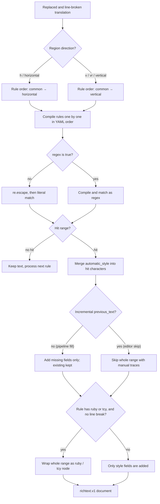

# Rich-Text Rules Table, Raw Editing, and Matching

Use the "Rich Text Rules" (`Rich Text Rules`) page when you want translated text to get bold, color, stroke, ruby, or tate-chu-yoko effects automatically instead of editing every region by hand. Rules match the translation after text replacement and before rendering, and only *add* rich-text fields that are not set yet; they never change the text itself. This page documents the Table View (`Table View`) and Raw Edit (`Raw Edit`) editing modes, the fields of each rule, and the matching and execution flow.

Text replacement rules are covered by [Replacement rules: table groups and order](../replacement-rules/table-groups-and-order.md) and [Replacement rules: raw YAML, regex, and saving](../replacement-rules/raw-yaml-regex-and-save.md). The meaning of individual style properties, saved style presets, and the in-editor style panel are covered by [Rich-text styles and presets](./styles-and-presets.md).

## Feature boundary {#feature-boundary}

- Rich-text rules read the translation *after* replacement and line breaking: `[BR]`, `【BR】`, ` `, and newlines are first converted into paragraph boundaries, and rules never style the markers themselves.
- Rules run per group: `common` (always) first, then `horizontal` or `vertical` depending on the region direction.
- Rules only add style, ruby, and tate-chu-yoko (TCY) nodes; they do not replace text or delete existing manual rich-text fields. Whether a matched range with manual traces is touched is decided by the fill/skip policy (see the matching flow).
- This page does not cover text replacement rules, manual editor styling, or saving/deleting style presets (see the linked pages), and it never stores API credentials or private user content.

## UI operations {#ui-operations}

### Open the rich-text rules page {#open-page}

1. Open the "Rich Text Rules" (`Rich Text Rules`) item in the left main navigation. The rule editor panel sits below the page title, with a status label at the bottom.
2. The toolbar at the top contains "Add Rule" (`Add Rule`), "Delete" (`Delete`), Move Up `↑`, Move Down `↓`, "Enable" (`Enable`), "Regex" (`Regex`), and "Restore Default" (`Restore Default`).
3. Below the toolbar are the filter box and the "Table View" (`Table View`) / "Raw Edit" (`Raw Edit`) mode switcher.

### Table View {#table-view}

Table View is the default mode and shows rules per group:

- Switch the current group with the "Common (Always)" (`Common (Always)`), "Horizontal" (`Horizontal`), and "Vertical" (`Vertical`) tabs; they map to the YAML keys `common`, `horizontal`, and `vertical`.
- Each row has five columns: `Enabled`, `Pattern`, `Rich Text Style`, `Regex`, and `Comment`.
- The Enabled and Regex columns show `✓`/`✗`; double-click a cell to toggle it, or select multiple rows and click the toolbar "Enable" or "Regex" buttons to toggle them in bulk.
- The Rich Text Style column is a style button: it shows "Edit Style" (`Edit Style`) when no style is set, and a style summary (for example `B I C % S` meaning bold, italic, color, scale, font size) once a style exists. Click the button to open the "Edit Rich Text Style" dialog.
- "Add Rule" inserts a row at the bottom and starts editing the Pattern cell; "Delete" removes selected rows; `↑`/`↓` move selected rows, and the order decides whether a later automatic rule overrides an earlier rule's same-named fields.
- The filter box does a case-insensitive contains match on pattern, style, and comment (`Type to filter by pattern / style / comment...`); it only hides non-matching rows and never changes data.

### Raw Edit {#raw-edit}

1. Switch to "Raw Edit" (`Raw Edit`) to edit the whole YAML document in a monospaced editor with YAML syntax highlighting; the hint reads "Edit raw YAML content directly. Changes are saved automatically." (`Edit raw YAML content directly. Changes are saved automatically.`).
2. Switching from table to Raw serializes the current table data as YAML. Switching back parses and validates: the root must be a mapping and the three groups must be lists, otherwise a "YAML Error" (`YAML Error`) warning appears and the editor stays in Raw mode.
3. After a change the status shows "Saving..." (`Saving...`), then after a 600 ms debounce the file is written and the status becomes "All changes saved" (`All changes saved`). On write failure it shows "Save error: {error}" (`Save error: {error}`) and the unsaved text stays in the editor.

### Style edit dialog {#style-dialog}

Click the style button in the Rich Text Style column to open the "Edit Rich Text Style" (`Edit Rich Text Style`) dialog:

- At the top, a preset can be loaded from the "Saved rich text style:" (`Saved rich text style:`) combo box.
- The "Switches" (`Switches`) row provides "Bold" (`Bold`), "Underline" (`Underline`), "Emphasis" (`Emphasis`), and "Vertical-in-Horizontal (TCY)" (`Vertical-in-Horizontal (TCY)`).
- The remaining fields are optional and enabled with the checkbox on each row: Ruby Text, Italic Angle, Text Color, Font Size, Scale, Force Advance (Half/Full), Font Family, Stroke, Outer Stroke, Glow, Kerning, Pre Kerning, Line Kerning, Next Kerning, Rotation, Offset X, and Offset Y.
- The dialog hint reads "Enable only the style properties this rule should apply." (`Enable only the style properties this rule should apply.`). On OK the style is validated; an invalid style raises an "Invalid Style" (`Invalid Style`) warning.

### Statuses and errors {#status-errors}

| UI call key | English actual value | Simplified Chinese actual value |
| --- | --- | --- |
| `Rich Text Rules` | Rich Text Rules | 富文本规则 |
| `Automatically style text matched after replacement rules are applied` | Add rich-text styles after text replacements (order: Common (Always), Horizontal/Vertical, then rich-text rules). Existing matching rich-text fields are preserved, and BR markers remain paragraph boundaries. | 自动为文本替换完成后的译文追加富文本样式（顺序：替换规则中的“通用（始终执行）”→ 横/竖排 → 富文本规则；已有相同富文本属性不会覆盖；BR 标记会作为换行边界保护） |
| `Add Rule` | Add Rule | 添加规则 |
| `Delete` | Delete | 删除 |
| `Enable` | Enable | 启用 |
| `Regex` | Regex | 正则 |
| `Restore Default` | Restore Default | 恢复默认 |
| `Filter:` | Filter: | 过滤: |
| `Type to filter by pattern / style / comment...` | Type to filter by pattern / style / comment... | 按匹配内容、样式或备注筛选... |
| `Table View` | Table View | 表格视图 |
| `Raw Edit` | Raw Edit | 源码编辑 |
| `Common (Always)` | Common (Always) | 通用（始终执行） |
| `Horizontal` | Horizontal | 横排 |
| `Vertical` | Vertical | 竖排 |
| `Enabled` | Enabled | 启用 |
| `Pattern` | Pattern | 匹配 |
| `Rich Text Style` | Rich Text Style | 富文本编辑 |
| `Comment` | Comment | 备注 |
| `Edit Style` | Edit Style | 编辑样式 |
| `Edit Rich Text Style` | Edit Rich Text Style | 编辑富文本样式 |
| `Edit raw YAML content directly. Changes are saved automatically.` | Edit raw YAML content directly. Changes are saved automatically. | 直接编辑原始 YAML 内容，修改会自动保存。 |
| `All changes saved` | All changes saved | 所有修改已保存 |
| `Saving...` | Saving... | 正在保存... |
| `Load error` | Load error | 加载失败 |
| `Save error` | Save error | 保存失败 |
| `YAML Error` | YAML Error | YAML 错误 |
| `YAML root must be a mapping` | YAML root must be a mapping | YAML 根节点必须是映射 |
| `Rule group '{group}' must be a list` | Rule group '{group}' must be a list | 规则分组“{group}”必须是列表 |
| `Restore rich text rules to the built-in defaults? Current custom rules will be overwritten.` | Restore rich text rules to the built-in defaults? Current custom rules will be overwritten. | 要将富文本规则恢复为内置默认值吗？当前自定义规则会被覆盖。 |
| `Defaults restored` | Defaults restored | 已恢复默认 |
| `Restore default failed` | Restore default failed | 恢复默认失败 |
| `Invalid Style` | Invalid Style | 无效样式 |
| `Reset` | Reset | 重置 |
| `Cancel` | Cancel | 取消 |
| `OK` | OK | 确定 |
| `Bold` | Bold | 加粗 |
| `Underline` | Underline | 下划线 |
| `Emphasis` | Emphasis | 着重号 |
| `Vertical-in-Horizontal (TCY)` | Vertical-in-Horizontal (TCY) | 竖排内横排（纵中横） |
| `Ruby text` | Ruby text | 注音文本 |
| `Color` | Color | 颜色 |
| `Saved rich text style:` | Saved rich text style: | 已保存富文本样式： |
| `Select saved rich text style` | Select saved rich text style | 选择已保存富文本样式 |
| `Choose a saved rich text style to load` | Choose a saved rich text style to load | 选择一个已保存富文本样式并载入 |

## Parameters and options {#parameters-and-options}

Each rule is a mapping inside one of the groups in `config/rich_text_rules.yaml`. The table below lists the YAML keys of a rule mapping; the controls and display text are the ones listed in the table above.

#### `enabled` — Enabled {#rule-enabled}

- Control: the Enabled column (`✓`/`✗`).
- Stored value: boolean; `true` participates in matching, `false` skips the whole rule at compile time.
- Options: YAML boolean `true` / `false`; shown as `✓` / `✗` in the table.
- Defaults: built-in example rule `enabled: false`, built-in vertical rules `true`; the file is created on first startup by `ensure_rich_text_rules_exists`.
- Effective stages: rich-text rule compilation and matching before rendering (also used by editor auto-apply).
- Mechanism: `_compile_rule` returns `None` for rules whose `enabled` is false or missing, so they never enter matching.
- Dependencies/conflicts: a disabled rule does not match and does not affect other rules.
- Related files and debug artifacts: only `config/rich_text_rules.yaml`; no debug image.
- Diagram: not needed — it only decides whether a single rule participates, with no branch worth diagramming.
- Source evidence: `manga_translator/rendering/rich_text_rules.py#_compile_rule`, `desktop_qt_ui/ui/secondary_pages/rich_text_rules_editor.py#_insert`.
- Verification: complete (static check).

#### `pattern` — Pattern {#rule-pattern}

- Control: text edit in the Pattern column.
- Stored value: string; an empty-string pattern makes the rule skipped at compile time.
- Options: any string; with `regex: false` it is matched literally (internally escaped with `re.escape`), with `regex: true` it is compiled as a regular expression.
- Defaults: built-in example `pattern: "示例"`; built-in vertical rules use a symbol character class and `[!?！？]{2,4}`.
- Effective stages: matching, after replacement and line breaking.
- Mechanism: `_compile_rule` compiles `re.compile(pattern)` or `re.compile(re.escape(pattern))` depending on the `regex` flag. An invalid regex logs a warning and skips that rule without a dialog. Matching runs over the match text rule by rule, and zero-width hits (`start == end`) are ignored.
- Performance/API cost: no API call; rule count and translation length only affect CPU matching time.
- Diagram: see "Matching and execution flow".
- Source evidence: `rich_text_rules.py#_compile_rule`, `#apply_rich_text_rules`.
- Verification: complete (static check).

#### `regex` — Regex {#rule-regex}

- Control: the Regex column (`✓`/`✗`) or the toolbar "Regex" bulk toggle.
- Stored value: boolean; `true` compiles `pattern` as a Python `re` regular expression, `false` treats it as literal text.
- Options: YAML boolean `true` / `false`.
- Defaults: built-in example `regex: false`; built-in vertical rules `regex: true`.
- Effective stages: compile and matching.
- Mechanism: with regex on, character classes, quantifiers, capture groups, and lookarounds work; with literal matching, metacharacters are escaped, so writing `[!?]` does not create a character class.
- Dependencies/conflicts: a regex error only skips this rule and logs a warning; the hit range decides which characters get the style.
- Diagram: see "Matching and execution flow".
- Source evidence: `rich_text_rules.py#_compile_rule`.
- Verification: complete (static check).

#### `style` — Rich Text Style {#rule-style}

- Control: the style button in the Rich Text Style column → the "Edit Rich Text Style" dialog.
- Stored value: mapping with keys such as `bold`, `italic`, `color`, `scale`, `fontSize`, `fontFamily`, `stroke`, `outerStroke`, `glow`, `emphasis`, `verticalAdvance`, `kerning`, `preKerning`, `lineKerning`, `nextKerning`, `transform` (rotation/offset), `ruby`, and `tcy`. A rule with no style, no ruby, and no tcy is dropped at compile time.
- Options: value ranges of each field are described in "Style edit dialog"; each field can be enabled or disabled independently.
- Defaults: built-in vertical symbol rule uses `transform: rotation: -90`; the common example uses `style: {}`.
- Effective stages: style merge before rendering and editor auto-apply.
- Mechanism: for each hit character the rule style is merged into `automatic_style` (later rules override same-named fields of earlier automatic rules), then merged into the character's existing style by only adding missing fields, so manual fields always win.
- Dependencies/conflicts: existing manual rich-text fields are not overwritten; the editor's skip policy skips the whole range when it carries manual traces.
- Diagram: see "Matching and execution flow".
- Source evidence: `rich_text_rules.py#_merge_style`, `#_add_missing_style`, `#_style_is_subset`.
- Verification: complete (static check).

#### `ruby` — Ruby text {#rule-ruby}

- Control: the Ruby Text input in the "Edit Rich Text Style" dialog.
- Stored value: string; a YAML null (`null`) is equivalent to no ruby and does not make the rule invalid.
- Options: any string; the whole hit range is wrapped with this ruby.
- Defaults: built-in rules have no ruby.
- Effective stages: node wrapping before rendering.
- Mechanism: when the hit range contains no line-break marker (`[BR]`/newline etc.) and none of its characters carry a manual node, the whole range is wrapped as a `ruby` node; ranges with manual nodes are not rewrapped under the fill policy.
- Dependencies/conflicts: ruby and `tcy` are mutually exclusive (`ruby` wins); line-break markers prevent node wrapping.
- Diagram: see "Matching and execution flow".
- Source evidence: `rich_text_rules.py#apply_rich_text_rules`.
- Verification: complete (static check).

#### `tcy` — Vertical-in-Horizontal (TCY) {#rule-tcy}

- Control: the "Vertical-in-Horizontal (TCY)" switch in the "Edit Rich Text Style" dialog.
- Stored value: boolean; only effective for the vertical direction (`vertical` group).
- Options: YAML boolean `true` / `false`.
- Defaults: the second built-in vertical rule uses `tcy: true` (2–4 consecutive question/exclamation marks).
- Effective stages: node wrapping before rendering.
- Mechanism: `allow_tcy` is true only when the region direction is vertical; the range is wrapped as a `tcy` node when it contains no line-break marker and no manual nodes.
- Dependencies/conflicts: writing `tcy: true` in a horizontal rule has no effect.
- Diagram: see "Matching and execution flow".
- Source evidence: `rich_text_rules.py#apply_rich_text_rules`, `#_direction_group`.
- Verification: complete (static check).

#### `comment` — Comment {#rule-comment}

- Control: text edit in the Comment column.
- Stored value: string, for display and filtering only; it never participates in matching.
- Options: any string.
- Defaults: built-in rules carry Chinese notes (e.g. vertical symbol rotation and TCY examples).
- Effective stages: none (metadata).
- Mechanism: the filter box concatenates pattern, style, and comment and does a contains match.
- Dependencies/conflicts: none.
- Diagram: not needed — a pure note field with no branch.
- Source evidence: `rich_text_rules_editor.py#_filter`.
- Verification: complete (static check).

#### Group keys `common` / `horizontal` / `vertical` {#rule-groups}

- Control: the group tabs at the top of Table View.
- Stored value: three top-level YAML keys whose values must be lists.
- Options: `common` | Common (Always) | 通用（始终执行）; `horizontal` | Horizontal | 横排; `vertical` | Vertical | 竖排.
- Defaults: the built-in file contains one disabled example in `common`, `horizontal: []`, and two enabled rules in `vertical`.
- Effective stages: rule iteration order.
- Mechanism: `_iter_rules` yields all `common` rules first, then the direction group resolved from `region.direction` (`h`, `v`, `vr`, etc.; `v`/`vr`/`vertical` count as vertical, everything else as horizontal).
- Dependencies/conflicts: within one group, rules run in YAML order; renaming a group key in Raw makes that group's rules unrecognized.
- Diagram: see "Matching and execution flow".
- Source evidence: `rich_text_rules.py#_iter_rules`, `#_direction_group`, `#_parse_rules`.
- Verification: complete (static check).

## Matching and execution flow {#matching-flow}

- Literal matching: with `regex: false`, `pattern` is escaped via `re.escape`, so metacharacters such as `[`, `(`, and `*` are treated as plain characters.
- Incremental semantics: the rendering pipeline passes no `previous_text`, so every hit counts as new. The editor passes the text before each edit and applies only hits that did not exist before; old hits on unchanged text are never re-applied (a manually cleared style is not pushed back).
- Fill vs. skip: the pipeline uses the `fill` policy (add missing fields only); the editor uses `skip`, skipping a whole range that carries any rich text the rule itself cannot produce (manual traces), while the rule's own residual style is still allowed to fill gaps.
- Node wrapping: `ruby` or vertical `tcy` wraps the whole range only when the range contains no line-break marker and none of its characters carry a manual node.
- Second measurement: regions hit by automatic rules are marked `_rich_text_rules_applied`; during rendering they get one extra measurement pass with `skip_text_replacements=True` so that local font size, scale, stroke, and other styles are reflected in the final render box. BR structure is not rewritten again.

## Dependencies and conflicts {#dependencies-and-conflicts}

- Rich-text rules depend on text replacement running first: changing text clears the style on the changed range, so styling must come last. The fixed order is "properties → replacement → rich text".
- Rules only add styles and never change text: if the editor's rule output has different visible text than the translation, the rule result is discarded and the sync result is kept.
- The built-in vertical example uses `transform.rotation: -90` to rotate symbols (the engine's positive angle is counter-clockwise, so vertical takes clockwise `-90`); different directions use different rule groups.
- Existing manual rich-text fields are never overwritten by automatic rules; the editor `skip` policy does not even touch the range.
- The file is cached by mtime: after manually editing `config/rich_text_rules.yaml`, reload to pick it up; saving from the UI invalidates the cache and reloads.
- "Auto Apply Rich Text Rules While Editing" (`Auto Apply Rich Text Rules While Editing`, key `app.editor_auto_rich_text_rules`) is an editor consumer switch, not rule-file content; turning it off stops editor auto-apply but the rendering pipeline still applies rules.
- Do not put API keys, tokens, usernames, private absolute paths, or business-sensitive text into rule comments; the rule file can appear in logs and debug artifacts.

## Related files and formats {#related-files}

| File/format | Actual role on this page | Manual-edit and compatibility note |
| --- | --- | --- |
| `config/rich_text_rules.yaml` | Rule persistence file; created by `ensure_rich_text_rules_exists` on first startup | Root must be a mapping and `common`/`horizontal`/`vertical` must be lists; Raw save writes the text with `\n` line endings |
| Table View ↔ Raw | Two editing views of the same data | Views stay in sync when switching; a parse failure keeps Raw mode active and raises "YAML Error" |
| `desktop_qt_ui/locales/en_US.json`、`zh_CN.json` | Page and editor copy | Keys and actual display values are in the "Statuses and errors" table above |
| `desktop_qt_ui/core/config_models.py#AppSection` | `app.editor_auto_rich_text_rules` defaults to `true` | Controls editor auto-apply only; it is not written into the rule file |
| `config/config.json` | Stores app settings such as `app.editor_auto_rich_text_rules` | Rules themselves are not stored there; real user configuration is never read or displayed |

## Mermaid data-flow limits {#mermaid-limits}

The diagram above describes the source-confirmed "direction grouping → per-rule compile → literal/regex match → style merge → fill/skip → node wrapping" flow; it does not claim every run has a hit or necessarily produces a rich-text document. Disabled rules, empty patterns, invalid regexes, rules without style/ruby/tcy, no hits, and ranges with line breaks or manual traces take their documented bypasses. No runtime screenshot or private task artifact has been fabricated.

## Source evidence {#source-evidence}

| Layer | File | What was checked |
| --- | --- | --- |
| Page and navigation | `desktop_qt_ui/ui/main_page/pages/rich_text_rules_page.py`, `ui/main_window.py`, `ui/main_page/view.py` | Page title/subtitle, main-navigation entry, language-switch refresh |
| Editor UI | `desktop_qt_ui/ui/secondary_pages/rich_text_rules_editor.py` | Toolbar, filter, table/Raw switching, auto-save, status label, style dialog and optional fields |
| UI/i18n | `desktop_qt_ui/app_logic.py`, `desktop_qt_ui/locales/en_US.json`, `zh_CN.json` | Key mapping and actual bilingual display values |
| Rule loading and matching | `manga_translator/rendering/rich_text_rules.py` | Group order, literal/regex compile, fill/skip, incremental semantics, ruby/tcy wrapping, mtime cache |
| Rendering consumer | `manga_translator/rendering/text_replacement_layout.py`, `manga_translator/rendering/__init__.py` | Applied after replacement and line breaking, BR paragraph boundaries, second measurement of auto rich-text regions |
| Editor consumer | `desktop_qt_ui/editor/rich_text_editor_state.py`, `manga_translator/rendering/rich_text_sync.py` | Incremental apply while editing, `styled_match_policy="skip"`, drop result when text mismatches |
| Config files | `manga_translator/runtime_files.py`, `runtime_paths.py` | Initialization and path of `config/rich_text_rules.yaml` |
| Config models | `desktop_qt_ui/core/config_models.py`, `services/config_service.py` | Default and persistence of `app.editor_auto_rich_text_rules` |

## Verification {#verification}

| Check | Status | Notes |
| --- | --- | --- |
| BLUEPRINT, PAGE_GUIDELINES, TODO | Complete | Read section 1.3 and subsection 5.8 and followed the page contract |
| Editor UI and call chain | Complete | Statically checked `rich_text_rules_editor.py`, `rich_text_rules_page.py`, `main_window.py`, `view.py` |
| `en_US` / `zh_CN` actual locales | Complete | The table records key, actual English, and actual Simplified Chinese values |
| Matching and execution flow | Complete | Statically checked `rich_text_rules.py`, `text_replacement_layout.py`, `rendering/__init__.py`, and editor incremental consumption |
| Route mirror and source evidence | To run | Run `node scripts/verify-route-mirror.mjs .` and `node scripts/verify-source-evidence.mjs .` before merge |
| Sanitized runtime verification | Deferred | No real `.env`, user `config.json`, API key/token, username, user image, or private prompt was read |
| VitePress | Deferred | Coordinator should run `npm run docs:build --prefix doc/wiki` before merge |
