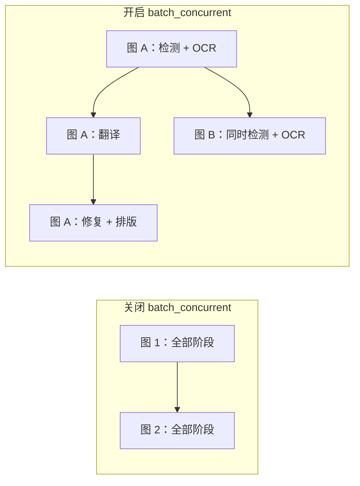
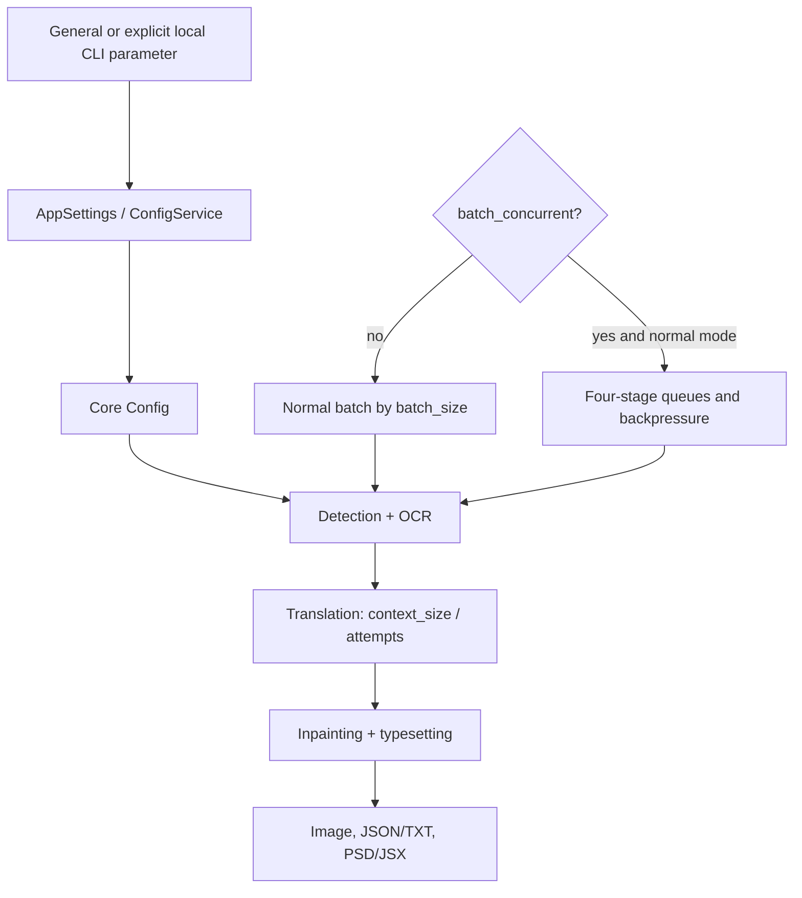

# CLI, Batch, and Output

This page covers the CLI, batching, and output fields in General settings and explicit overrides from the local `local` CLI. It does not cover API credentials, detection/OCR/translator/typesetting algorithms. Configuration and screenshots must be sanitized: never show real keys, tokens, usernames, private absolute paths, user images, or private prompts.

## Feature boundary {#feature-boundary}

This page includes logging, error isolation, GPU/ONNX, retries, translation context, batch/pipeline scheduling, format/quality/overwrite, text/JSON/TXT sidecars, source-directory output, PSD/JSX, the custom API-parameters file, and model cleanup after translation. `context_size` is actually in the Translation tab; workflow labels belong to the translation workspace, so this page records only their batch constraints.

## UI operations {#ui-operations}

Open Settings and select the General tab. Numeric values use line edits, booleans use toggles, and `format` uses a combo box. The General layout comes from `tab_custom_1` in `settings_tab_layout.json`. Changes update memory and are merged to disk; importing configuration or switching presets can rebuild rows. The `Edit` action beside `use_custom_api_params` opens a JSON file; it is not another core configuration value.

| UI call key | Actual `en_US` value | Actual `zh_CN` value | Control/field |
| --- | --- | --- | --- |
| `label_verbose` | Verbose Logging | 详细日志 | `cli.verbose` toggle |
| `label_attempts` | Retry Attempts | 重试次数 | `cli.attempts` integer |
| `label_ignore_errors` | Ignore Errors | 忽略错误 | `cli.ignore_errors` toggle |
| `label_use_gpu` | Use GPU | 使用 GPU | `cli.use_gpu` toggle |
| `label_disable_onnx_gpu` | Disable ONNX GPU Acceleration | 禁用 ONNX GPU 加速 | `cli.disable_onnx_gpu` toggle |
| `label_context_size` | Context Pages | 上下文页数 | `cli.context_size` integer |
| `label_format` | Output Format | 输出格式 | `cli.format` combo box |
| `label_overwrite` | Overwrite Existing Files | 覆盖已存在文件 | `cli.overwrite` toggle |
| `label_skip_no_text` | Skip Images Without Text | 跳过无文本图像 | `cli.skip_no_text` toggle |
| `label_save_text` | Editable Image | 图片可编辑 | `cli.save_text` toggle |
| `label_save_quality` | Image Save Quality | 图像保存质量 | `cli.save_quality` integer |
| `label_batch_size` | Batch Size | 批量大小 | `cli.batch_size` integer |
| `label_batch_concurrent` | Concurrent Batch Processing | 并发批量处理 | `cli.batch_concurrent` toggle |
| `label_export_editable_psd` | Export Editable PSD | 导出可编辑PSD | `cli.export_editable_psd` toggle |
| `label_psd_script_only` | Generate PSD Script Only | 仅生成PSD脚本 | `cli.psd_script_only` toggle |
| `label_save_to_source_dir` | Save to Source Directory | 输出到原图目录 | `cli.save_to_source_dir` toggle |
| `label_unload_models_after_translation` | Unload Models After Translation | 翻译完成后卸载模型 | `app.unload_models_after_translation` toggle |
| `label_use_custom_api_params` | Use Custom API Params | 使用自定义API参数 | root toggle + `Edit` |

The formal local CLI entry point is `manga_translator/args.py`: `python -m manga_translator local -i <sanitized input> [-o <sanitized output>]`. `-i/--input` accepts multiple values; `--config`, `-v/--verbose`, `--overwrite`, `--use-gpu`, `--disable-onnx-gpu`, `--format`, `--batch-size`, and `--attempts` can override configuration, but **an omitted value does not override it**. The formal top-level subcommands are `local`, `web`, `ws`, and `shared`; this page discusses only local input/output overrides.

## Option matrix {#option-matrix}

| Stored value | English | Simplified Chinese | Behavior |
| --- | --- | --- | --- |
| `不指定`/empty/`none` | Not Specified | 不指定 | Preserve the original extension |
| `png` | png | png | PNG |
| `jpg`/`jpeg`/`jfif` | jpg/jpeg/jfif | jpg/jpeg/jfif | JPEG (RGB conversion) |
| `webp` | webp | webp | Supports quality |
| `avif` | avif | avif | Requires Pillow codec support |
| `bmp` | bmp | bmp | BMP (RGB conversion) |
| `tiff`/`tif` | tiff/tif | tiff/tif | TIFF |
| `heic`/`heif` | heic/heif | heic/heif | HEIF; requires codec support |

Workflow strings were checked through the same source chain:

| UI call key | Actual `en_US` value | Actual `zh_CN` value | Field |
| --- | --- | --- | --- |
| `label_load_text` | Import Translation | 导入翻译 | `cli.load_text` |
| `label_translate_json_only` | Translate JSON Only | 仅翻译（JSON） | `cli.translate_json_only` |
| `label_template` | Export Original Text | 导出原文 | `cli.template` |
| `label_generate_and_export` | Export Translation | 导出翻译 | `cli.generate_and_export` |
| `label_replace_translation` | Replace Translation Mode | 替换翻译模式 | `cli.replace_translation` |
| `label_colorize_only` | Missing (not called by the settings label map) | 缺失（未在设置标签映射调用） | `cli.colorize_only` |
| `label_upscale_only` | Missing (not called by the settings label map) | 缺失（未在设置标签映射调用） | `cli.upscale_only` |
| `label_inpaint_only` | Missing (not called by the settings label map) | 缺失（未在设置标签映射调用） | `cli.inpaint_only` |

### Parameters and consumers

| Anchor/key | Defaults (core / Qt / release example) | Stage and effect | Final consumer; dependencies/conflicts |
| --- | --- | --- | --- |
| [`cli.verbose`](#cli-verbose) | `false / false / false` | Full-process logs and verbose debug artifacts | logger, `_result_path`; more disk I/O |
| [`cli.attempts`](#cli-attempts) | `-1 / -1 / 3` | Translation/API candidate retries; `-1` unlimited | `retry.py`, `api_key_rotation.py`; not HQ quality retry |
| [`cli.ignore_errors`](#cli-ignore-errors) | `false / false / false` | Per-image error isolation | core batch/concurrent queues; inspect the failure summary |
| [`cli.use_gpu`](#cli-use-gpu) | `true / true / true` | Model loading/inference | Torch and model loaders; driver/VRAM mismatch can fall back or fail |
| [`cli.disable_onnx_gpu`](#cli-disable-onnx-gpu) | `false / false / false` | ONNX sessions | ONNX provider; does not disable Torch CUDA |
| [`cli.context_size`](#cli-context-size) | `0 / 3 / 3` | Translation history context | Recent non-empty pages; more tokens/request body |
| [`cli.batch_size`](#cli-batch-size) | `1 / 1 / 3` | Translation batches, queue bound, memory peak | `manga_translator.py`, concurrent pipeline; special modes may force 1 |
| [`cli.batch_concurrent`](#cli-batch-concurrent) | `call-site / false / false` | Detection+OCR, translation, inpainting, rendering pipeline | Four executors/queues; special modes disable it |
| [`cli.format`](#cli-format) | `不指定 / 不指定 / 不指定` | Extension, Pillow encoder/color mode | `image_formats.py`/`save.py`; AVIF/HEIF need codecs |
| [`cli.overwrite`](#cli-overwrite) | `true / true / true` | Preflight existence check and save | Images and TXT/JSON workflows; disabled means skipped |
| [`cli.skip_no_text`](#cli-skip-no-text) | `false / false / false` | Skip after OCR when no text exists | Detection/OCR result; not exception handling |
| [`cli.save_text`](#cli-save-text) | `false / true / true` | JSON/TXT sidecar export | JSON serializer and text workflows; not just image save |
| [`cli.save_quality`](#cli-save-quality) | `100 / 100 / 100` | Image/inpaint/editor saves | Pillow/export service; some compatibility fallbacks read 95 |
| [`cli.save_to_source_dir`](#cli-save-to-source-dir) | `false / false / false` | Output path | `manga_translator_work/result` beside source; directory must be writable |
| [`cli.export_editable_psd`](#cli-export-editable-psd) | `false / false / false` | Final PSD/JSX export | Photoshop/export service; Photoshop is required |
| [`cli.psd_script_only`](#cli-psd-script-only) | `false / false / false` | PSD branch | Generate JSX without running Photoshop; script can contain paths |
| [`use_custom_api_params`](#use-custom-api-params) | `false / false / false` | API request parameter construction | `custom_api_params.json`; not credentials |
| [`app.unload_models_after_translation`](#app-unload-models-after-translation) | `false / false / false` | Cleanup after the batch | Desktop model unload; less resident memory, slower next load |

#### `cli.verbose` — 详细日志 / Verbose Logging {#cli-verbose}

- Control/override: General toggle; `-v/--verbose`. Stage: all logs and debug images. All three defaults are `false`. Consumers are the logger and `_result_path`; results are unchanged, but disk use increases.

#### `cli.attempts` — 重试次数 / Retry Attempts {#cli-attempts}

- Integer control; `--attempts N`. Core/Qt default `-1`, release example `3`; `-1` means unlimited. This is the translation/API layer, not a universal detector/OCR/render retry and not the HQ quality retry. Consumers are `manga_translator.py`, `utils/retry.py`, and `api_key_rotation.py`.

#### `cli.ignore_errors` — 忽略错误 / Ignore Errors {#cli-ignore-errors}

- Default `false/false/false`. When enabled, record a failed image and continue with other images; it does not turn failure into success or swallow cancellation. Consumers are core batch handling, `concurrent_pipeline.py`, and the desktop result summary.

#### `cli.use_gpu` — 使用 GPU / Use GPU {#cli-use-gpu}

- Default `true/true/true`; `--use-gpu` is an explicit override. It affects model loading/inference and requires compatible Torch/CUDA, VRAM, and model backends; not every implementation is guaranteed to use GPU.

#### `cli.disable_onnx_gpu` — 禁用 ONNX GPU 加速 / Disable ONNX GPU Acceleration {#cli-disable-onnx-gpu}

- Defaults are `false`; `--disable-onnx-gpu` is explicit. It forces ONNX to CPU only and does not disable Torch CUDA; it can avoid provider conflicts at a speed cost.

#### `cli.context_size` — 上下文页数 / Context Pages {#cli-context-size}

- Translation-tab integer; no formal local CLI option. Defaults are `0/3/3`. The translator uses recent non-empty history; `0` or a negative value disables it. More context increases tokens, and concurrent completion order affects available history.

#### `cli.batch_size` — 批量大小 / Batch Size {#cli-batch-size}

- `--batch-size N` explicitly overrides; defaults are `1/1/3`. It controls translation batch size, the concurrent translation queue bound, and memory peak; it is not the number of simultaneously running images. Special modes may force 1.

#### `cli.batch_concurrent` — 并发批量处理 / Concurrent Batch Processing {#cli-batch-concurrent}

- General toggle; local CLI also accepts `--concurrent`. Qt/release defaults are `false`. Four stage executors communicate through queues and backpressure. `load_text`, JSON-only, template+save_text, original/translation export, colorize/upscale/inpaint-only, and replacement translation disable it.

This does not mean every image sends API requests simultaneously; the queue and batch size provide backpressure, and special workflows disable the mode.

#### `cli.format` — 输出格式 / Output Format {#cli-format}

- Combo box/`--format`; all defaults are Not Specified. Not specified preserves the original extension; a specified value changes the basename extension. Supported values are png, jpg/jpeg/jfif, webp, avif, bmp, tiff/tif, and heic/heif. RGB formats require conversion; AVIF/HEIF require codecs.

#### `cli.overwrite` — 覆盖已存在文件 / Overwrite Existing Files {#cli-overwrite}

- All defaults are `true`; `--overwrite` can explicitly enable it. When disabled, existing images are skipped and TXT/JSON workflows check their corresponding files; results contain skipped items. Consumers are desktop `app_logic.py` and `mode/local.py`.

#### `cli.skip_no_text` — 跳过无文本图像 / Skip Images Without Text {#cli-skip-no-text}

- All defaults are `false`. After detection/OCR, an image with no translatable text is skipped as a normal branch, not an `ignore_errors` exception. The consumer is the core skip-state and output logic.

#### `cli.save_text` — 图片可编辑 / Editable Image {#cli-save-text}

- Defaults are `false/true/true` (core/Qt/release). It exports JSON containing regions, original/translated text, dimensions, and rendering fields; with template it exports original TXT. Files are `manga_translator_work/json/*_translations.json`, `originals/*_original.txt`, and `translations/*_translated.txt`.

#### `cli.save_quality` — 图像保存质量 / Image Save Quality {#cli-save-quality}

- All defaults are 100; some editor/inpainting compatibility paths read 95. It applies to Pillow image, inpaint, and editor saves; higher values generally increase file size and exact semantics depend on the encoder.

#### `cli.save_to_source_dir` — 输出到原图目录 / Save to Source Directory {#cli-save-to-source-dir}

- All defaults are `false`. When enabled, write beside the source under `manga_translator_work/result`; otherwise use the output directory and preserve relative structure when possible. The directory must be writable; clean adjacent artifacts before sharing.

#### `cli.export_editable_psd` — 导出可编辑PSD / Export Editable PSD {#cli-export-editable-psd}

- All defaults are `false`. The final stage creates Photoshop PSD/JSX; Photoshop is required to execute the script, and this is not an image-format switch.

#### `cli.psd_script_only` — 仅生成PSD脚本 / Generate PSD Script Only {#cli-psd-script-only}

- All defaults are `false`. It depends on the PSD branch and generates JSX without running Photoshop. The script can contain paths and must not be shared directly.

#### `use_custom_api_params` — 使用自定义API参数 / Use Custom API Params {#use-custom-api-params}

- General toggle plus `Edit` file action; all defaults are `false`. Reads `config/custom_api_params.json` for extra request parameters, not credentials or translator selection. JSON sections and model matching must be valid.

#### `app.unload_models_after_translation` — 翻译完成后卸载模型 / Unload Models After Translation {#app-unload-models-after-translation}

- All defaults are `false`. The desktop unloads models after completion, reducing resident memory at the cost of next-run loading time; this differs from service TTL and subprocess restart.

## Runtime behavior {#runtime-behavior}

UI/configuration file data goes through `AppSettings`/ConfigService, memory configuration, core `Config`, `MangaTranslator`, and export consumers. `local` in `mode/local.py` applies only explicitly supplied CLI values to `cli`; desktop `app_logic.py` additionally builds `save_info` with output directory, format, overwrite, and source-directory flags.

`batch_size` is the translation batch and concurrent translation queue bound; `batch_concurrent` is stage-pipeline parallelism, not an API concurrency count. TXT import, JSON-only, original/translation export, colorize/upscale/inpaint-only, and replacement translation disable it to preserve ordering and per-image file writes. `context_size` builds messages from recent non-empty pages; `attempts`, HQ quality retry, and API candidate rotation are separate layers; cancellation is not an ignorable error.

## Dependencies and conflicts {#dependencies-and-conflicts}

GPU backends require compatible drivers, Torch/CUDA, and ONNX providers. Larger batches, concurrency, more context, and high-quality output increase resource, token, or disk pressure; for OOM, lower batch size or disable concurrency before increasing retries. Disabled overwrite skips images/TXT/JSON. Template and JSON-only workflows require matching work-directory files. PSD execution requires Photoshop; JSX/JSON/TXT can expose paths and text, so sanitize before sharing. Format encoding depends on Pillow and platform codecs.

## Related files and formats {#related-files-and-formats}

| File/directory | Use | Risk |
| --- | --- | --- |
| `config/config.json` | General/CLI/App configuration | Unknown keys, wrong types, and private paths; never publish real config |
| `config/config-example.json` | Release-default reference | Differs from core/Qt defaults, especially attempts/batch_size |
| `config/custom_api_params.json` | Custom request parameters | JSON/model-section errors; never store real keys |
| `manga_translator_work/json/*_translations.json` | save_text region/text/render data | Maintained by serializer; do not casually remove compatibility flags |
| `manga_translator_work/originals/*_original.txt` | Original export/import | Filename, encoding, and order must match |
| `manga_translator_work/translations/*_translated.txt` | Translation export/import | Do not mix with original TXT |
| `manga_translator_work/result/` | Source-directory image output | Adjacent directory may contain user files |
| `result/` | Verbose logs/conditional debug artifacts | Not produced every run; sanitize before sharing |
| PSD/JSX | Photoshop layers/script | JSX may contain absolute paths |

## Mermaid, screenshots, and security boundary {#visual-and-security-boundary}

Mermaid diagrams express actual stage, queue, and output branches, with mirrored nodes and links in both languages. No headed run or screenshot was made for this task; future screenshots must use public samples and sanitized configuration, cropping usernames, private paths, keys/tokens, images, prompts, and task artifacts.

## Source evidence {#source-evidence}

| Layer | File | Checked |
| --- | --- | --- |
| UI layout | `desktop_qt_ui/ui/main_page/settings_tab_layout.json` | General field order; context_size belongs to Translation |
| UI/i18n | `desktop_qt_ui/app_logic.py`, `desktop_qt_ui/ui/main_page/dynamic_settings.py`, `desktop_qt_ui/locales/en_US.json`, `zh_CN.json` | Keys, actual labels, controls, and file-edit action |
| Configuration | `desktop_qt_ui/core/config_models.py`, `manga_translator/config.py`, `config/config-example.json` | Three default sources |
| CLI/execution | `manga_translator/args.py`, `manga_translator/mode/local.py`, `manga_translator/manga_translator.py` | Subcommands, overrides, batching, context, retry, save |
| Concurrency | `manga_translator/utils/concurrent_pipeline.py` | Four executors, queues, and backpressure |
| Output/files | `manga_translator/image_formats.py`, `save.py`, `desktop_qt_ui/services/export_service.py`, `desktop_qt_ui/services/workflow_service.py` | Format, quality, PSD, TXT/JSON |

## Verification {#verification}

| Item | Status | Notes |
| --- | --- | --- |
| BLUEPRINT/PAGE_GUIDELINES/TODO | Complete | Read in full before editing |
| Source, defaults, and UI/i18n three-column evidence | Complete | Static review completed; differences and missing keys are explicit |
| CLI `--help` | Complete | Formal `local/web/ws/shared` and local overrides checked |
| Runtime and screenshots | Pending future unified acceptance | No real credentials, user images, or private paths used |
| Static checks | Pending execution | Route mirror, source evidence, coverage, and VitePress build |
