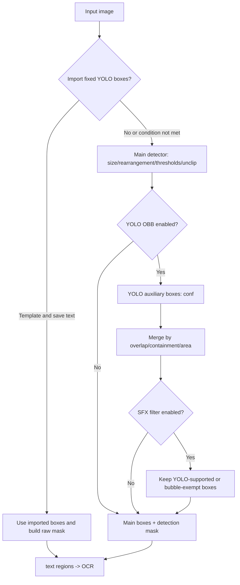
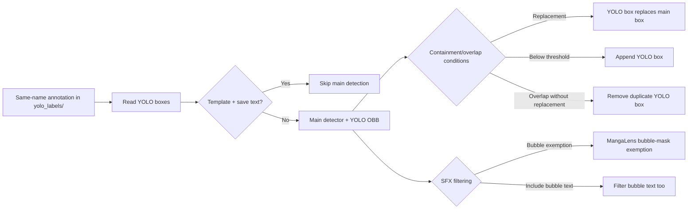

# Detection

This page covers converting an input image into text regions, a detection mask, and detection results for OCR. OCR, text-line merging, mask refinement, and inpainting belong to their respective settings pages. This page documents only the controls in the Detection tab, detection-stage behavior, and the annotation/debug files it actually uses.

## UI operations

In the desktop application, open “Settings” and select the “Detection” tab (the tab title is hard-coded in the layout and has no locale replacement). Basic items appear first; `Advanced` separates the size, threshold, and YOLO parameters. The dynamic settings page creates a combo box, toggle switch, or numeric input according to the current configuration type. Finishing an edit or changing a switch updates the in-memory configuration and schedules a merged config-file write.

| UI call key | English actual value | Simplified Chinese actual value |
| --- | --- | --- |
| `Detection` (layout title) | Detection | Detection (hard-coded; no locale replacement) |
| `label_detector` | Text Detector | 文本检测器 |
| `label_import_yolo_labels` | Import Fixed YOLO Boxes | 导入固定YOLO框 |
| `label_use_yolo_obb` | Enable YOLO Detection | 启用YOLO辅助检测 |
| `label_use_sfx_filter` | SFX Filter | 拟声词过滤 |
| `label_sfx_filter_include_bubble_text` | Include Bubble Text in SFX Filter | 气泡文本参与拟声词过滤 |
| `label_min_box_area_ratio` | Min Box Area Ratio | 最小检测框面积占比 |
| `label_detection_size` | Detection Size | 检测大小 |
| `label_det_rearrange_min_effective_short_side` | Long Image Rearrange Min Short Side | 长图重排最低有效短边 |
| `label_text_threshold` | Text Threshold | 文本阈值 |
| `label_box_threshold` | Box Generation Threshold | 边界框生成阈值 |
| `label_unclip_ratio` | Unclip Ratio | Unclip比例 |
| `label_yolo_obb_conf` | YOLO Confidence Threshold | YOLO置信度阈值 |
| `label_yolo_obb_overlap_threshold` | YOLO Overlap Removal Threshold | YOLO辅助检测重叠率删除阈值 |
| `Enabled` / `Disabled` (generic switch text) | Enabled / Disabled | 启用 / 禁用 |

Numeric inputs are submitted when they lose focus. Invalid numeric input does not become a valid core configuration value. Row labels are mapped by `app_logic.py` through the `label_*` keys above; configuration keys and environment-variable names must not be presented as UI labels.

## Option matrix

### `detector.detector` — Text Detector / 文本检测器 {#detector-detector}

| Stored value | English | Simplified Chinese |
| --- | --- | --- |
| `default` | default | default |
| `dbconvnext` | dbconvnext | dbconvnext |
| `ctd` | ctd | ctd |
| `craft` | craft | craft |
| `none` | none | none |

These enum values are displayed as their stored values in the current UI. Source comments identify `default` as DBNet+ResNet34, `ctd` as manga-oriented, and `craft` as general-purpose text detection. `paddle` was removed from the enum and dispatch table and is not listed as an option.

### Switch values

| Stored value | English | Simplified Chinese |
| --- | --- | --- |
| `true` | Enabled | 启用 |
| `false` | Disabled | 禁用 |

`import_yolo_labels`, `use_yolo_obb`, `use_sfx_filter`, and `sfx_filter_include_bubble_text` are ToggleSwitch controls; they do not have independent enum option lists.

## Parameters and runtime behavior

Each parameter below corresponds to one Detection-tab row and has an independent anchor. Core defaults, Qt `AppSettings` defaults, and the example release configuration are listed separately. The example file is public reference data; the user’s `config.json` is not read for this page.

#### `detector.detector` — Text Detector / 文本检测器 {#detector-detector-parameter}

- Control: combo box; location: Settings → Detection.
- Stored values: see the enum table above. Defaults: core `DetectorConfig.detector=default`; Qt `DetectorSettings.detector=default`; `config/config-example.json`=`default`.
- Effective stage: detection; consumer: the `DETECTORS` mapping in `manga_translator.detection.dispatch`, producing main boxes and a detection mask.
- Mechanism: selects the main detector instance. `none` returns no detections. With YOLO OBB enabled, this detector still runs first and its result enters hybrid merging.
- Dependencies/conflicts: the detector model and selected device must be available. A source comment explicitly discourages `craft` for manga. The `load_text` flow forcibly disables YOLO OBB.
- Performance/API cost: offline models are loaded and cached per device; detector choice changes speed, memory, and result distribution.
- Related files/debug artifacts: verbose detection may produce `bboxes_with_scores.png`, `mask_binary.png`, and a raw-mask debug image; it does not alter the input image.
- Diagram: no separate diagram; detector selection is represented in the detection branch diagram below.
- Source evidence: `desktop_qt_ui/ui/main_page/settings_tab_layout.json`; `desktop_qt_ui/app_logic.py`; `manga_translator/config.py`; `manga_translator/detection/__init__.py`.
- Verification: source, UI keys, and en/zh locales checked; runtime screenshots belong to future unified acceptance.

#### `detector.detection_size` — Detection Size / 检测大小 {#detector-detection-size}

- Control: integer input; defaults: core 2048; Qt 2048; example configuration 2048.
- Effective stage: detection preprocessing; consumers: the main detector and YOLO OBB `detect_size`.
- Mechanism: the detector scales the image using this size. Larger values generally retain more small-text detail, at the cost of computation and memory.
- Dependencies/conflicts: an excessive value can cause out-of-memory failures; together with the long-image minimum short side it determines effective resolution after rearrangement.
- Related files/debug artifacts: the debug directory name includes detection size; the long-image branch may write `rearrange_{n}.png` and `yolo_rearrange_{n}.png` only under its branch and verbose conditions.
- Diagram: required; see “Detection branches and outputs”.
- Source evidence: `config.py`, `manga_translator.py::_run_detection`, `detection/common.py`, and the rearrangement call chain.
- Verification: static check complete; runtime boundaries await unified acceptance.

#### `detector.det_rearrange_min_effective_short_side` — Long Image Rearrange Min Short Side / 长图重排最低有效短边 {#detector-rearrange-short-side}

- Control: integer input; defaults: core 341; Qt 341; example configuration 341.
- Effective stage: detection preprocessing; consumers: the long-image rearrangement path used by detectors.
- Mechanism: when a long image is rearranged or tiled for detection, this value constrains the minimum effective short-side resolution. Raising it keeps text clearer but costs more compute and memory.
- Dependencies/conflicts: it mainly affects the long-image rearrangement path; it does not replace `detection_size` or change OCR language or merging.
- Related files/debug artifacts: the branch may write `rearrange_{n}.png` and `yolo_rearrange_{n}.png`; these are conditional artifacts, not guaranteed on every run.
- Diagram: required; see “Detection branches and outputs”.
- Source evidence: `config.py::DetectorConfig`, `detection/common.py`, `detection/ctd.py`, and `detection/yolo_obb.py`.
- Verification: static check complete; long-image runtime screenshots await unified acceptance.

#### `detector.text_threshold` — Text Threshold / 文本阈值 {#detector-text-threshold}

- Control: floating-point input; defaults: core 0.5; Qt 0.5; example configuration 0.5.
- Effective stage: detection candidate generation; consumers: DBNet/CRAFT-family detectors and their binary-mask debug output.
- Mechanism: a higher text-confidence threshold is stricter and may miss text; lowering it retains weaker candidates and may add false positives. The main detector receives this value; the YOLO path uses the separate `yolo_obb_conf`.
- Dependencies/conflicts: keep it within the model’s supported probability range. It controls text response separately from `box_threshold`, so the two must not be conflated.
- Related files/debug artifacts: verbose mode may write `mask_binary.png` and a scored-box image.
- Diagram: required; see “Detection branches and outputs”.
- Source evidence: `config.py`, `detection/default.py`, `detection/craft.py`, and `detection/common.py`.
- Verification: static check complete.

#### `detector.box_threshold` — Box Generation Threshold / 边界框生成阈值 {#detector-box-threshold}

- Control: floating-point input; defaults: core 0.7; Qt 0.5; example configuration 0.5. These differ and must not be collapsed into one default.
- Effective stage: detection-box generation; consumers: DBNet/CRAFT/YOLO detector box representations.
- Mechanism: sets the confidence gate for turning response candidates into text boxes. Lower values generally retain more boxes; higher values are stricter. The YOLO OBB path also receives it for box filtering/IoU behavior.
- Dependencies/conflicts: tune it separately with `text_threshold` and `unclip_ratio`; too low a value sends noise to OCR.
- Related files/debug artifacts: changes box geometry/count, detection masks, and downstream text-region count.
- Diagram: required; see “Detection branches and outputs”.
- Source evidence: `manga_translator/config.py`, `detection/__init__.py`, and `detection/default_utils/dbnet_utils.py`.
- Verification: static check complete.

#### `detector.unclip_ratio` — Unclip Ratio / Unclip比例 {#detector-unclip-ratio}

- Control: floating-point input; defaults: core 2.3; Qt 2.5; example configuration 2.5.
- Effective stage: detection-box geometry; consumers: DBNet-family and other detectors using the common box representation.
- Mechanism: controls expansion from the text skeleton to a box. Larger values generally make boxes larger and can include more background or neighboring text.
- Dependencies/conflicts: coupled with detection size and thresholds; oversized boxes increase OCR and mask-coverage risks.
- Related files/debug artifacts: changes box geometry and its corresponding mask; it does not directly write user content.
- Diagram: no separate diagram needed; it has no independent state branch and its geometry effect is labeled in the detection flow.
- Source evidence: `config.py`, `detection/default_utils/dbnet_utils.py::unclip`, and `detection/ctd_utils/utils/db_utils.py::unclip`.
- Verification: static check complete.

#### `detector.import_yolo_labels` — Import Fixed YOLO Boxes / 导入固定 YOLO 框 {#detector-import-yolo-labels}

- Control: switch; defaults: core false; Qt false; example configuration false.
- Effective stage: detection input/result replacement; consumer: YOLO-label loading and mask construction in `manga_translator.py::_run_detection`.
- Mechanism: reads same-name annotations from `manga_translator_work/yolo_labels/`. In the template-plus-save-text path, imported boxes can bypass the main detector; in the normal path, available imported boxes replace detected boxes, and a raw mask is constructed if needed.
- Dependencies/conflicts: label files must match the image name and expected format. `load_text` changes the replacement conditions. Missing or invalid labels do not produce fabricated detections.
- Related files/debug artifacts: `yolo_labels/` and the raw mask built from imported boxes. Documentation and screenshots must not include user images or actual labels.
- Diagram: required; see “Imported labels and hybrid detection”.
- Source evidence: `manga_translator/manga_translator.py`, `manga_translator/utils/path_manager.py`, and `server/core/config_manager.py`.
- Verification: static check complete; sanitized runtime validation awaits unified acceptance.

#### `detector.use_yolo_obb` — Enable YOLO Detection / 启用 YOLO 辅助检测 {#detector-use-yolo-obb}

- Control: switch; defaults: core false; Qt false; example configuration true.
- Effective stage: detection-box merging; consumers: YOLO OBB assistance and `merge_detection_boxes` in `detection.dispatch`.
- Mechanism: runs the main detector first, then an oriented YOLO detector. Containment and overlap determine whether boxes are replaced, removed, or appended. If auxiliary detection fails, the main result is returned.
- Dependencies/conflicts: requires the YOLO model; `load_text` forcibly disables it. `use_sfx_filter` matters only when this switch is enabled and YOLO boxes exist.
- Related files/debug artifacts: verbose mode may write `hybrid_detection_boxes.png`; YOLO `other` labels can also support later merging.
- Diagram: required; see “Imported labels and hybrid detection”.
- Source evidence: `detection/__init__.py`, `detection/yolo_obb.py`, and `manga_translator.py::_run_detection`.
- Verification: static check complete.

#### `detector.yolo_obb_conf` — YOLO Confidence Threshold / YOLO 置信度阈值 {#detector-yolo-obb-conf}

- Control: floating-point input; defaults: core 0.4; Qt 0.4; example configuration 0.4.
- Effective stage: YOLO auxiliary candidate generation; consumer: the YOLO OBB detector confidence parameter.
- Mechanism: the auxiliary YOLO detector uses this as its text threshold. Raising it removes weak YOLO boxes; lowering it adds candidates and merging work.
- Dependencies/conflicts: effective only with `use_yolo_obb=true`; it does not replace the main detector’s `text_threshold`.
- Related files/debug artifacts: affects the hybrid detection box image when verbose.
- Diagram: no separate diagram needed; it is a candidate threshold without an additional state branch.
- Source evidence: `DetectorConfig`, `detection/__init__.py`, and `detection/yolo_obb.py`.
- Verification: static check complete.

#### `detector.yolo_obb_overlap_threshold` — YOLO Overlap Removal Threshold / YOLO 重叠率删除阈值 {#detector-yolo-obb-overlap-threshold}

- Control: floating-point input; defaults: core 0.1; Qt 0.1; example configuration 0.1.
- Effective stage: YOLO/main-box merging; consumer: AABB overlap and YOLO de-duplication logic in `merge_detection_boxes`.
- Mechanism: at or above the threshold, containment, area, and remaining-box conditions decide replacement/removal; below it, a YOLO box may be appended. Source clamps the effective threshold and prevents zero from making arbitrary boxes pass.
- Dependencies/conflicts: effective only with YOLO assistance; too low may replace/remove too much, while too high may retain duplicate boxes.
- Related files/debug artifacts: `hybrid_detection_boxes.png` when verbose and the auxiliary detector returns a debug image.
- Diagram: required; see “Imported labels and hybrid detection”.
- Source evidence: `detection/__init__.py::merge_detection_boxes`, `test/test_yolo_obb_sfx_filter.py`, and `test/test_yolo_obb_rearrange_edge_merge.py`.
- Verification: static check complete; runtime boundaries await unified acceptance.

#### `detector.use_sfx_filter` — SFX Filter / 拟声词过滤 {#detector-use-sfx-filter}

- Control: switch; defaults: core false; Qt false; example configuration false.
- Effective stage: hybrid detection-box merging; consumer: `_get_sfx_filtered_main_indices`.
- Mechanism: filters main-detector boxes that are neither fully wrapped by a YOLO `other` box nor overlapped by a non-`other` YOLO box at the configured threshold. The branch is skipped when disabled.
- Dependencies/conflicts: depends on `use_yolo_obb`. When bubble inclusion is disabled, a MangaLens bubble mask can exempt bubble text; if bubble detection fails, that exemption is unavailable.
- Related files/debug artifacts: may create an in-memory MangaLens bubble mask; user images must not be put in documentation.
- Diagram: required; see “Imported labels and hybrid detection”.
- Source evidence: `detection/__init__.py`, `utils/bubble.py`, and `test/test_yolo_obb_sfx_filter.py`.
- Verification: static check complete.

#### `detector.sfx_filter_include_bubble_text` — Include Bubble Text in SFX Filter / 气泡文本参与拟声词过滤 {#detector-sfx-filter-include-bubble-text}

- Control: switch; defaults: core false; Qt false; example configuration false.
- Effective stage: SFX filtering; consumer: `_get_sfx_filtered_main_indices`.
- Mechanism: when false, unsupported text inside a detected bubble remains protected by the bubble mask; when true, that exemption is skipped and bubble text is filtered too. This switch does not enable SFX filtering by itself.
- Dependencies/conflicts: affects output only when SFX filtering is enabled and YOLO assistance yields results; enabling it can remove bubble dialogue.
- Related files/debug artifacts: the MangaLens bubble mask is generated on demand only when an exemption is needed.
- Diagram: required; see “Imported labels and hybrid detection”.
- Source evidence: `detection/__init__.py`, `utils/bubble.py`, and the English/Chinese description locale entries.
- Verification: static check complete.

#### `detector.min_box_area_ratio` — Min Box Area Ratio / 最小检测框面积占比 {#detector-min-box-area-ratio}

- Control: floating-point input; defaults: core 0.0009 (0.09%); Qt 0.0009; example configuration 0 (area filtering disabled in the example).
- Effective stage: detection-result postprocessing; consumers: area filtering in `manga_translator.py` and the detection interface.
- Mechanism: compares each box’s area with total image pixels. When greater than 0, boxes at or below the threshold (and extremely tiny areas) are filtered; setting it to 0 disables this ratio filter.
- Dependencies/conflicts: too high a threshold loses small text; together with detection size, rearrangement, and OCR filtering it changes final text regions. It does not change the detector model.
- Related files/debug artifacts: changes OCR inputs and box debug output, without writing credentials.
- Diagram: no separate diagram needed; it is a single postprocessing threshold without an independent state machine.
- Source evidence: `manga_translator/config.py`, area filtering in `manga_translator/manga_translator.py`, and `detection/common.py`.
- Verification: static check complete.

## Runtime behavior

### Detection branches and outputs {#detection-flow}

Long-image rearrangement tiles the image for detection and maps coordinates back during preprocessing. It can increase detection time and memory use. Here `mask_raw` means the raw mask returned by the detector or built from imported boxes; later stages decide how OCR and mask refinement consume it.

### Imported labels and hybrid detection {#yolo-merge-flow}

The diagrams express only branches confirmed by source; they are not a complete workflow diagram. Screenshot boundary: this page does not fabricate screenshots. Future headed verification should use sanitized configuration and blank/public samples, hide user directories, images, tokens, and labels, and provide bilingual alt text/captions.

## Dependencies and conflicts

- The selected offline detector model must load on the selected device; GPU/ONNX backend issues affect detection but hardware installation is outside this page.
- YOLO OBB and SFX filtering require the auxiliary YOLO model. Without auxiliary results, the main detector result remains the fallback.
- `load_text` disables YOLO OBB. Imported labels can bypass the main detector under the template/save-text condition; in the normal flow they replace detector boxes and preserve or build a raw mask where possible.
- `text_threshold`, `box_threshold`, `unclip_ratio`, and area ratio belong to different postprocessing layers. Broad thresholds pass noise to OCR; strict thresholds can miss text.
- Long-image rearrangement, larger detection sizes, and YOLO assistance consume more resources. For OOM or missing-model errors, reduce size or disable assistance rather than sharing real credentials.

## Related files and formats

| File or directory | Use on this page | Format and cautions |
| --- | --- | --- |
| `config/config-example.json` | Public release configuration example | JSON; example defaults can differ from core/Qt defaults; never use a user config as documentation evidence |
| `config/config.json` | Application persistence location | JSON; document only the field boundary, never read or display user contents |
| `manga_translator_work/yolo_labels/` | Fixed YOLO-label input | Looked up by image name; label format and coordinates must match the importer; missing/invalid labels must not be fabricated |
| Per-image `result/` debug directory | Verbose detection artifacts | Conditional files include `rearrange_{n}.png`, `yolo_rearrange_{n}.png`, `bboxes_with_scores.png`, `mask_binary.png`, and `hybrid_detection_boxes.png`; share only sanitized artifacts |

Detection results become internal text regions and a mask. This page does not expand every translation-JSON field; workflow/editor pages own that format.

## Source evidence {#source-evidence}

| Layer | File | Checked content |
| --- | --- | --- |
| UI layout | `desktop_qt_ui/ui/main_page/settings_tab_layout.json` | Detection tab, parameter order, Advanced divider |
| UI construction/binding | `desktop_qt_ui/ui/main_page/dynamic_settings.py` | Boolean switches, numeric inputs, enum combo boxes, and submission timing |
| UI text mapping | `desktop_qt_ui/app_logic.py` | Parameter key to `label_*` i18n mapping and Detector options |
| Locale | `desktop_qt_ui/locales/en_US.json`, `zh_CN.json` | UI call keys, English/Simplified Chinese actual values, and descriptions |
| Qt configuration | `desktop_qt_ui/core/config_models.py` | `DetectorSettings` fields and defaults |
| Core configuration | `manga_translator/config.py` | `DetectorConfig` fields, defaults, semantics, and `Config.detector` |
| Dispatch/consumers | `manga_translator/manga_translator.py` | Parameter passing, imported labels, area filtering, debug artifacts |
| Detection implementation | `manga_translator/detection/__init__.py`, `common.py`, `default.py`, `yolo_obb.py` | Main/YOLO detection, merging, SFX filtering, and fallback |
| Regression evidence | `test/test_yolo_obb_sfx_filter.py`, `test/test_yolo_obb_rearrange_edge_merge.py` | Static coverage of SFX and long-image/edge merge behavior |

## Security review and verification {#verification}

- No real `.env`, user configuration, API keys/tokens, usernames, private absolute paths, user images, prompts, or task artifacts were read or displayed.
- Source review: complete. UI layout/binding: complete. en/zh locale matrix: complete. Default-value differences: complete.
- Static validation pending: `node doc/wiki/scripts/verify-route-mirror.mjs doc/wiki`, `node doc/wiki/scripts/verify-source-evidence.mjs doc/wiki`, `node doc/wiki/scripts/verify-wiki-coverage.mjs doc/wiki`, and `npm run docs:build --prefix doc/wiki`.
- Runtime screenshots, real-model inference, and Mermaid rendering belong to future unified acceptance and do not block this static正文.
