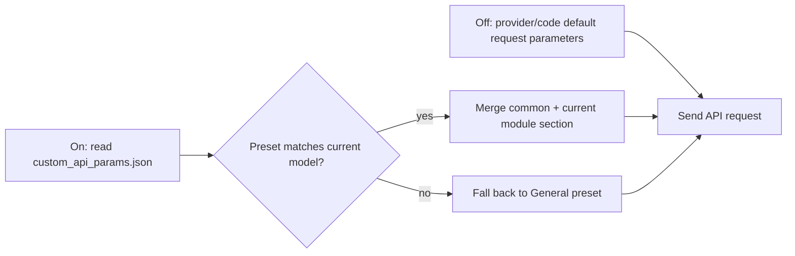
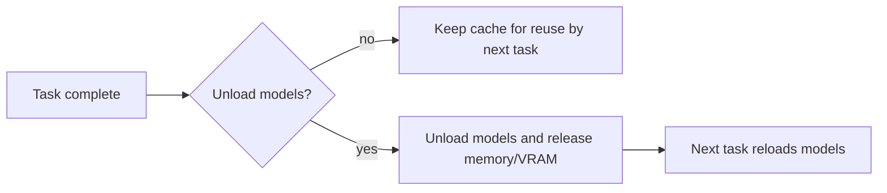
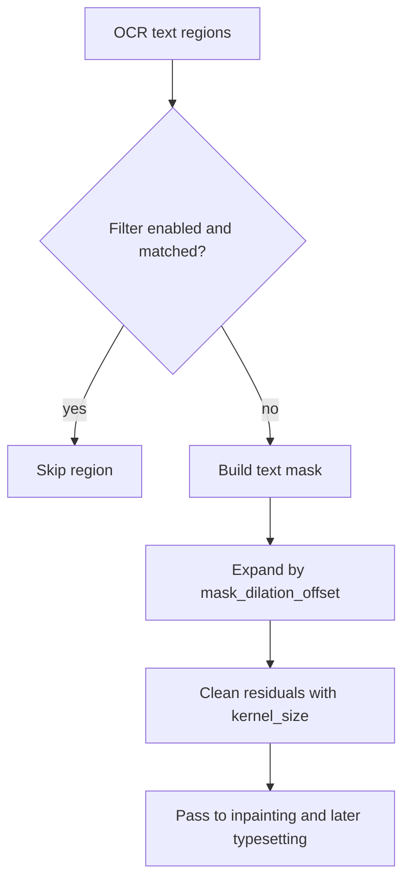

# General and Application Settings

This page covers the settings page’s “General” group and the application state it carries. It documents language, theme, the custom API-parameter file switch, the filter list, global mask parameters, model unloading, and editor preferences; specialized detection, OCR, translation, inpainting, typesetting, upscaling, and colorization parameters belong to their respective pages.

## UI operations {#ui-operations}

Open Settings and select “General”. Dynamic rows are generated from storage keys in the layout file; clicking a row shows its description in the right-hand description panel. Changing a toggle, number, or combo box updates the configuration immediately, after which the configuration service coalesces the disk write. Leaving a numeric field empty writes `null`, so the relevant consumer applies its default semantics.

### General UI call keys and actual labels

The table records only settings keys actually placed in the General layout. Dynamic labels go through the `labels` mapping in `app_logic.py` and then the two locale files; “Theme” and “Language” explicitly call `Theme:` / `Language:` in the layout code.

| UI call key / storage key | English actual value | Simplified Chinese actual value |
| --- | --- | --- |
| `Theme:` / `app.theme` | Theme: | 主题： |
| `Language:` / `app.ui_language` | Language: | 语言： |
| `label_verbose` / `cli.verbose` | Verbose Logging | 详细日志 |
| `label_ignore_errors` / `cli.ignore_errors` | Ignore Errors | 忽略错误 |
| `label_use_gpu` / `cli.use_gpu` | Use GPU | 使用 GPU |
| `label_disable_onnx_gpu` / `cli.disable_onnx_gpu` | Disable ONNX GPU Acceleration | 禁用 ONNX GPU 加速 |
| `label_format` / `cli.format` | Output Format | 输出格式 |
| `label_overwrite` / `cli.overwrite` | Overwrite Existing Files | 覆盖已存在文件 |
| `label_skip_no_text` / `cli.skip_no_text` | Skip Images Without Text | 跳过无文本图像 |
| `label_save_text` / `cli.save_text` | Editable Image | 图片可编辑 |
| `label_save_quality` / `cli.save_quality` | Image Save Quality | 图像保存质量 |
| `label_attempts` / `cli.attempts` | Retry Attempts | 重试次数 |
| `label_batch_size` / `cli.batch_size` | Batch Size | 批量大小 |
| `label_batch_concurrent` / `cli.batch_concurrent` | Concurrent Batch Processing | 并发批量处理 |
| `label_use_custom_api_params` / `use_custom_api_params` | Use Custom API Params | 使用自定义API参数 |
| `label_save_to_source_dir` / `cli.save_to_source_dir` | Save to Source Directory | 输出到原图目录 |
| `label_export_editable_psd` / `cli.export_editable_psd` | Export Editable PSD | 导出可编辑PSD |
| `label_psd_script_only` / `cli.psd_script_only` | Generate PSD Script Only | 仅生成PSD脚本 |
| `label_unload_models_after_translation` / `app.unload_models_after_translation` | Unload Models After Translation | 翻译完成后卸载模型 |

The “Use Custom API Params” row includes an “Edit” button that opens `config/custom_api_params.json`; this is a file-edit action, not JSON embedded in `AppSettings`. The filter-list row includes an “Edit Filter List” button for the filter-word file. The font-directory button is in Typesetting, not this page.

### Theme, language, and presets

- “Theme” options are generated from `THEME_OPTIONS` in `theme_registry.py`; selection emits a theme-change signal and immediately refreshes Qt styling.
- “Language” options come from `I18nManager.get_available_locales()`, not from guessing keys in `en_US.json` / `zh_CN.json`. Selection refreshes desktop text, Qt built-in widget translations, and navigation, then saves `app.ui_language`.
- The API preset toolbar displays the current API preset. Switching a preset refreshes API forms and credential slots; it does not change the translator or detector implementation. The current preset name is stored in `app.current_preset` and is application state rather than a normal dynamic settings row.

## Option matrix {#option-matrix}

### Enumerations and modes

| Stored value | English | Simplified Chinese | Use and limitations |
| --- | --- | --- | --- |
| `light` | Light | 浅色 | Fixed light theme |
| `dark` | Dark | 深色 | Fixed dark theme |
| `gray` | Gray | 灰色 | Fixed gray theme |
| `ocean` | Ocean | 海洋 | Fixed ocean theme |
| `forest` | Forest | 森林 | Fixed forest theme |
| `sunset` | Sunset | 落日 | Fixed sunset theme |
| `rose` | Rose | 玫瑰 | Fixed rose theme |
| `system` | Follow System | 跟随系统 | Selects a registered theme from the OS appearance |
| `auto` | Auto-detected language | 自动检测语言 | `app.ui_language` detects the system locale at startup; it is not a locale filename |
| `zh_CN` | Simplified Chinese | 简体中文 | Locale code registered by `I18nManager` |
| `zh_TW` | Traditional Chinese | 繁體中文 | Locale code registered by `I18nManager` |
| `en_US` | English | English | Locale code registered by `I18nManager` |
| `ja_JP` | Japanese | 日本語 | Locale code registered by `I18nManager` |
| `ko_KR` | Korean | 한국어 | Locale code registered by `I18nManager` |
| `es_ES` | Spanish | Español | Locale code registered by `I18nManager` |
| `不指定` | Not Specified | 不指定 | `cli.format` preserves input format; the options also include supported image formats |
| `PNG` / `JPG` / `JPEG` / `JFIF` / `WebP` / `AVIF` / `BMP` / `TIFF` / `TIF` / `HEIC` / `HEIF` | Same stored value | 同左 | `cli.format` forces that output format; the actual set comes from `OUTPUT_IMAGE_FORMATS` |

### Defaults, stages, and consumers

“Core default” comes from `manga_translator/config.py`’s `Config`; “Qt default” comes from `desktop_qt_ui/core/config_models.py`’s `AppSettings`; “release default” comes from `config/config-example.json`. A release default is a template, not the user’s current configuration, and no user paths or private values are reproduced here.

| Setting key (anchor) | Qt default | Core default | Release default | Effective stage | Final consumer and meaning |
| --- | ---: | ---: | ---: | --- | --- |
| `cli.verbose` {#cli-verbose} | `false` | `false` | `false` | Full pipeline/debug | Qt logs and `result/` debug artifacts; does not change translation output |
| `cli.ignore_errors` {#cli-ignore-errors} | `false` | `false` | `false` | Per-stage error boundaries | Whether a per-image failure lets later images continue |
| `cli.use_gpu` {#cli-use-gpu} | `true` | `true` | `true` | Model loading | Device selection; CPU/GPU dependencies must match, and GPU does not mean every backend uses GPU |
| `cli.disable_onnx_gpu` {#cli-disable-onnx-gpu} | `false` | `false` | `false` | ONNX model loading | Forces ONNX Runtime onto CPU; it can coexist with `use_gpu=true` |
| `cli.format` {#cli-format} | `不指定` | `不指定` | `不指定` | Export | Output-format selection in `save.py`/the image-saving layer |
| `cli.overwrite` {#cli-overwrite} | `true` | `true` | `true` | Export | When false, existing translated outputs are skipped |
| `cli.skip_no_text` {#cli-skip-no-text} | `false` | `false` | `false` | After detection | Images without text do not enter later stages |
| `cli.save_text` {#cli-save-text} | `true` | `true` | `true` | Export | Writes translation JSON for later editor changes |
| `cli.save_quality` {#cli-save-quality} | `100` | `100` | `100` | Export | Lossy image quality, constrained jointly by Pillow and the save implementation |
| `cli.attempts` {#cli-attempts} | `-1` | `-1` | `3` | API requests | `-1` means unlimited retries; ordinary retries are distinct from quality retries and candidate rotation |
| `cli.batch_size` {#cli-batch-size} | `1` | `1` | `3` | Translation | Number of images submitted at once; affects context, tokens, latency, and error surface |
| `cli.batch_concurrent` {#cli-batch-concurrent} | `false` | `false` | `false` | Pipeline scheduling | Enables concurrent processing; special workflows may force it off, as explained on the batch page |
| `use_custom_api_params` {#custom-api-params} | `false` | `false` | `true` | API request construction | Matches JSON presets by model and merges `common` with the current API module section |
| `cli.save_to_source_dir` {#cli-save-to-source-dir} | `false` | `false` | `false` | Export | Writes into a generated work-result subdirectory beside the source image |
| `cli.export_editable_psd` {#cli-export-editable-psd} | `false` | `false` | `false` | Export | Requires Photoshop and creates layered PSD output |
| `cli.psd_script_only` {#cli-psd-script-only} | `false` | `false` | `false` | Export | Creates JSX only; it does not start Photoshop or directly create a PSD |
| `app.unload_models_after_translation` {#app-unload-models} | `false` | N/A | `false` | Task completion | Releases model memory/VRAM; the next task reloads models |
| `filter_text_enabled` {#filter-text-enabled} | `true` | N/A | `false` | Post-OCR filtering | A matched filter word skips the text region; the button edits the filter-word file |
| `kernel_size` {#kernel-size} | `3` | `3` | `3` | Mask refinement/before inpainting | Convolution kernel for cleaning residual text; too large can damage line art or balloon borders |
| `mask_dilation_offset` {#mask-dilation-offset} | `70` | `20` | `50` | Mask refinement | Pixels by which the text mask expands; bubble restrictions further constrain it |

Editor preferences are part of `AppSection`, but the current `settings_tab_layout.json` does not place them among visible General dynamic rows. They remain in this page’s application-level boundary: `editor_snap_enabled=false`, `editor_center_scale_enabled=false`, `editor_rich_text_popup_enabled=true`, `editor_auto_export_on_switch=true`, and `editor_auto_rich_text_rules=true`. The editor view and toolbar consume these values; editor pages should document the actual controls rather than claiming they are visible in General.

### `app.ui_language` — 语言 / Language {#app-ui-language}

- Control: combo box; visible names come from `LocaleInfo.name`, while the stored value is the locale code.
- Defaults: `auto` in core, Qt, and release configuration.
- Effective stage: application startup and UI rebuild after switching language.
- Mechanism: `auto` detects the system language and falls back to `zh_CN` when it is not registered; an explicit switch refreshes the UI and saves the setting.
- Dependencies/conflicts: missing locale keys follow the i18n fallback rules; this does not change the translation target language.
- Related files: `desktop_qt_ui/locales/*.json`; it does not write translation images, translation JSON, or API credentials.
- Diagram: not needed; it changes display language only and no processing stage or output.

### `app.theme` — 主题 / Theme {#app-theme}

- Control: combo box; see the option table.
- Defaults: `light` in core, Qt, and release configuration.
- Effective stage: UI styling; it is not consumed by detection, translation, or export.
- Mechanism: the theme key is validated by the theme registry; legacy values migrate to registered themes and invalid values fall back to `light`.
- Dependencies/conflicts: `system` depends on OS appearance; theme affects UI only, not models or APIs.
- Diagram: not needed; it is a display preference without processing branches.

### `use_custom_api_params` — 使用自定义API参数 / Use Custom API Params {#custom-api-params}

- Control: toggle plus an “Edit” file-editor button.
- Defaults: `false` in core/Qt and `true` in the release template.
- Effective stage: request construction for translation, AI OCR, AI rendering, and AI colorization.
- Mechanism: when enabled, reads `config/custom_api_params.json`. The backend takes the model name used by the current API request and first looks for a top-level preset with exactly the same name; for example, model `gpt-4o` first selects the `gpt-4o` preset. Only when no same-named preset exists does it fall back to the `General` preset. After selecting a preset, it copies `common` first and merges only the current API module section: translation reads `translator`, AI OCR reads `ocr`, AI colorization reads `colorizer`, and AI rendering reads `render`; sections for other modules are not mixed into the request.
- Dependencies/conflicts: malformed JSON or structure makes custom parameters unavailable; this file does not store keys, bases, or models and does not perform API candidate rotation.
- Related format: JSON with module boundaries such as `common`, `translator`, `ocr`, `colorizer`, and `render`. Do not put keys, tokens, or private prompts in it.
- Diagram: required because the switch changes the request body; see below.

This switch changes only extra request fields; it does not change the translator or API credentials. The diagram contains no real request parameters.

### `app.unload_models_after_translation` — 翻译完成后卸载模型 / Unload Models After Translation {#unload-models}

- Control: toggle in the General group.
- Defaults: `false` in Qt/release; the core has no field with this name because it is a desktop task-lifecycle policy.
- Effective stage: cleanup after each image/task completes.
- Mechanism: the model-unload paths release memory and VRAM; the next task loads models on demand.
- Dependencies/conflicts: useful under low VRAM, but adds loading time to the next task; it is neither cancellation nor a configuration write operation.
- Diagram: required because the switch changes the resource lifecycle.

### `filter_text_enabled`, `kernel_size`, and `mask_dilation_offset` — 过滤与全局蒙版 / Filtering and global mask

- `filter_text_enabled` is a toggle plus “Edit Filter List”; Qt default is `true`, while the release template is `false`. When an OCR result contains a filter word, that text region is skipped; the filter-list editor owns the word file.
- `kernel_size` is an integer with default `3`. It controls the convolution kernel used for mask cleanup before inpainting; an excessive value can damage line art.
- `mask_dilation_offset` is an integer: Qt `70`, core `20`, release `50`. It expands the text mask by pixels to cover residual source pixels; `0` means no additional expansion, while bubble constraints are separate OCR/Inpainting options.

Disabling filtering does not disable mask refinement; mask parameters do not change OCR text itself. For bubble intersection, dilation limits, and inpainting-specific behavior, use the Inpainting/OCR pages.

## Runtime behavior and configuration lifecycle {#runtime}

The settings page builds dynamic controls from `ConfigService.get_config().model_dump()`. Each control change is sent through `MainAppLogic.update_single_config()` to the Pydantic `AppSettings`; translator and target-language changes additionally refresh the translation service, while `render.*` emits an editor-refresh signal. Language and theme use dedicated signals: language reloads locale/Qt translators, and theme reapplies styling.

At startup, the priority is code `AppSettings` defaults < the release template such as `config/config-example.json` < user `config/config.json`. The user configuration is synchronized with added/removed template keys. Ordinary settings are persisted to `config/config.json`; the service coalesces writes with a 250 ms debounce, while explicit save/switch operations flush pending writes. Explicit CLI arguments override `cli.*` only at the CLI entry point; an omitted argument is not an override.

General’s GPU, ONNX, batch, output, and retry settings ultimately enter core `Config.cli`; the CLI/batch page owns their complete workflow and concurrency explanation, while this page records their General controls and boundaries.

## Dependencies and conflicts {#dependencies}

- `cli.use_gpu` requires matching CUDA/hardware dependencies; `cli.disable_onnx_gpu` can disable only the ONNX GPU backend, so the two switches are not mutually exclusive.
- `cli.batch_concurrent` is constrained by special inputs/workflows and resource conditions; it does not guarantee simultaneous execution of every model or API request.
- `cli.export_editable_psd` requires Photoshop; with `cli.psd_script_only`, only the script is produced and a PSD must not be claimed.
- `use_custom_api_params` requires parseable JSON and a matching model configuration; it is separate from `.env` credentials, API bases, and API slot rotation.
- Excessive `mask_dilation_offset` or `kernel_size` can consume line art and balloon borders; bubble-mask limits require the OCR/Inpainting settings.
- Unloading models reduces resident VRAM but costs the next task’s load time; it does not guarantee that third-party processes immediately return all memory.

## Related files and formats {#files-and-formats}

| File/directory | Role for this page | Manual-edit/compatibility note |
| --- | --- | --- |
| `config/config-example.json` | Release template with defaults that may differ from Qt/core defaults | Use as evidence only; do not copy user paths or private values |
| `config/config.json` | User settings persistence | JSON must parse; synchronization handles template keys; do not share paths or user state |
| `config/custom_api_params.json` | File opened by the Edit action | Stores extra request parameter groups only; never put keys/tokens/private prompts here |
| `desktop_qt_ui/locales/en_US.json` | English labels and descriptions | Missing keys follow i18n fallback behavior |
| `desktop_qt_ui/locales/zh_CN.json` | Simplified Chinese labels and descriptions | Cross-check by the same i18n keys |
| `result/` | Verbose mode may write logs and intermediate debug files | Clean paths, usernames, tokens, and user images before sharing |

Translation JSON and editor workspaces are not expanded here; they belong to the editor import/export pages.

## Mermaid, screenshots, and security boundary {#visuals-and-security}

The Mermaid diagrams express actual branches caused by settings: custom API parameters change request construction, model unloading changes the model lifecycle, and filtering/mask settings change the post-OCR path. This static page does not fabricate runtime screenshots; future screenshots must use headed mode, sanitized configuration, and public samples, with usernames, private absolute paths, keys, tokens, user images, and private prompts removed. Configuration examples use only relative filenames.

## Source evidence {#source-evidence}

| Layer | File | Verified content |
| --- | --- | --- |
| General layout/UI | `desktop_qt_ui/ui/main_page/settings_tab_layout.json`, `desktop_qt_ui/ui/main_page/dynamic_settings.py` | General rows, control types, special Edit actions, theme/language signals, model-unloading row |
| UI labels | `desktop_qt_ui/app_logic.py`, `desktop_qt_ui/locales/en_US.json`, `desktop_qt_ui/locales/zh_CN.json` | Label mapping, actual English/Simplified Chinese values, description-panel text |
| Application model | `desktop_qt_ui/core/config_models.py` | Qt defaults, app state, General and editor fields |
| Theme/language | `desktop_qt_ui/theme_registry.py`, `desktop_qt_ui/ui/main_page/layout.py`, `desktop_qt_ui/services/i18n_service.py` | Theme options, locale codes, and LocaleInfo names |
| Persistence | `desktop_qt_ui/services/config_service.py`, `desktop_qt_ui/app_logic.py` | Configuration priority, Pydantic updates, 250 ms debounced writes |
| Core consumers | `manga_translator/config.py`, `manga_translator/manga_translator.py`, `manga_translator/mode/local.py`, `manga_translator/save.py` | CLI parameters, device/error handling, output, mask parameters, and PSD behavior |
| Editor consumers | `desktop_qt_ui/ui/editor/view.py`, `desktop_qt_ui/editor/editor_controller.py`, `desktop_qt_ui/editor/controller_document_service.py` | Editor preferences, auto-export, and rich-text-rule consumers |

## Verification {#verification}

| Check | Status | Notes |
| --- | --- | --- |
| Three writing specs and TODO | Complete | Read `BLUEPRINT.md`, `PAGE_GUIDELINES.md`, and `TODO.md` in full; scope limited to this page and its TODO line |
| UI layout, call keys, and locales | Complete | Static cross-check of General layout, `app_logic.py` mapping, and `en_US.json`/`zh_CN.json` |
| Defaults, stages, consumers, and formats | Complete | Static cross-check of Qt model, core Config, release template, persistence, and consumers |
| Mermaid/screenshot boundary and security review | Complete | Diagrams cover actual branches; no user paths, keys, tokens, or images were read into the page |
| Runtime UI/real screenshots | Deferred to unified acceptance | This task does not launch the app or fabricate visual verification |
| VitePress and static checks | To run | Run available route, source-evidence, and documentation build checks after writing |
