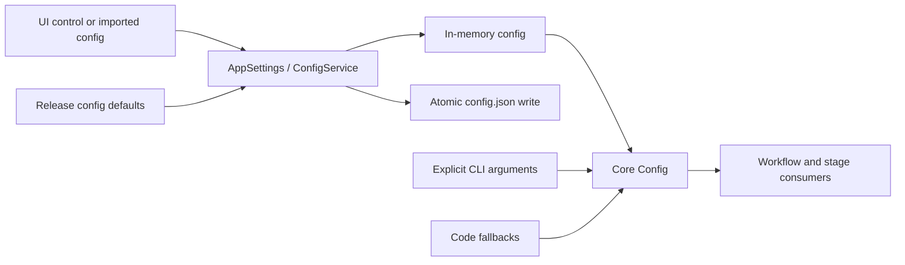

# Settings and Configuration Lifecycle

The Settings page adjusts the desktop translation pipeline and passes the edited values to the runtime configuration model. It owns tabs, parameter controls, import/export, and automatic saving; algorithm details belong to [General and app](./general-and-app.md), [CLI, batch, and output](./cli-batch-and-output.md), [Detection](./detection.md), [OCR, filtering, and merging](./ocr-filter-and-merge.md), [Translation](./translation.md), [Mask and inpainting](./mask-and-inpainting.md), [Typesetting and rendering](./typesetting-and-rendering.md), [Upscaling and colorization](./upscale-and-colorization.md), and [Mode-specific parameters](./mode-specific.md). It does not own API credential-slot rotation, prompt lists, editor project data, or the detailed execution of the nine workflows.

## What these settings control {#feature-boundary}

- The page reads seven UI groups from `settings_tab_layout.json`: General, OCR, Detection, Translation, Inpainting, Typesetting, and Mode Specific. `Advanced` and the other dividers are headings inside a tab, not separate tabs.
- The current layout contains 110 entries, of which 109 are visible parameters; one entry is not rendered by the current dynamic settings code. Internal state, workflow-controlled flags, and deprecated fields are not duplicated as ordinary rows.
- Configuration has three distinct sources: the Qt `AppSettings` model, the core `Config` processing model, and the release template `config/config-example.json`. They must not be collapsed into one default.
- This guide explains how the Settings page changes and saves configuration. Detection, OCR, translation, inpainting, typesetting, upscaling, and colorization consumers remain on their respective pages.

## Change it in the desktop app {#ui-operations}

Open Settings in the desktop application. The header shows “Settings” and “Adjust translation pipeline parameters. Changes are saved automatically.”, with “Export Config” and “Import Config” on the right. The left side contains segmented tabs, the center contains scrollable parameter rows, and the right side contains “Parameter Description”. Selecting a row or its control displays the configuration key and description.

### Tabs and parameter ownership

| UI tab | English actual value | Simplified Chinese actual value | Main contents |
| --- | --- | --- | --- |
| `General` | General | 通用 | Language, theme, logging/errors, GPU/ONNX, format, overwrite, retries, batches, output, and model unloading |
| `OCR` | OCR | 识别 | Primary/secondary OCR, hybrid OCR, AI OCR, filtering, bubble constraints, and merge thresholds |
| `Detection` | Detection | 检测 | Detector, YOLO, SFX, detection size, and detection thresholds |
| `Translation` | Translation | 翻译 | Translator, target/kept language, streaming, glossary, RPM, context, and post-processing conversion |
| `Inpainting` | Inpainting | 修复 | Inpainter, mask dilation, bubble intersection, solid bubbles, per-block processing, size, and precision |
| `Typesetting` | Typesetting | 排版 | Renderer, font, line breaking, direction, color, spacing, layout, and AI renderer concurrency |
| `Mode Specific` | Mode Specific | 模式相关 | Replace-translation alignment, upscale ratio/tile, and colorizer model/size/denoising |
| `Advanced` | Advanced | 高级 | An advanced divider inside OCR, Detection, or Inpainting; not a separate tab |

Steps:

1. Select a tab. The dynamic layout rebuilds rows in the order defined by `settings_tab_layout.json`.
2. Change a toggle, input, or combo box. Display values are mapped back to stored values through `AppLogic.get_display_mapping()`; fonts and prompts are runtime lists, not fixed enums.
3. Clearing an optional numeric input writes `null`, returning the consumer to its default/automatic semantics. Invalid numeric input also falls back to `null` and remains subject to model validation.
4. Select a row to inspect its right-hand description. The fixed AI OCR, AI renderer, and AI colorizer prompt rows are file-edit actions/resource paths; “Edit” opens the relevant editor instead of placing prompt text in an ordinary setting field.
5. Use “Edit” for the custom API parameter file, and the edit action beside the filter toggle for the filter-list editor. The font row provides “Open Directory”.
6. Use “Export Config” to choose an external JSON file. Use “Import Config” to load JSON; the service performs a per-key deep merge and Pydantic validation. Import can rebuild the whole page and refresh the description, API, and prompt controls.

Changing `app.ui_language` or the application language reloads tab labels, field labels, descriptions, and displayed combo values without changing stored values. There is no separate Apply button: normal edits update memory immediately and are then coalesced to disk by the configuration service.

## How the settings take effect {#runtime-behavior}

`ConfigService` creates `AppSettings()`, loads the release/default JSON, and then overlays the user `config.json`; precedence is user config > `config-example.json` > Qt model defaults. Core `Config()` still defines core fields and defaults. Explicit CLI arguments can override values as they enter core configuration; Web runtime overrides are a separate entry point.

A controller updates `AppSettings`; `update_config()` and imported per-key merges validate through Pydantic. API values update memory and `os.environ` immediately. Normal JSON and `.env` writes use a 250 ms debounce, a single writer, a temporary file, and atomic `os.replace`. Explicit exports wait for the write; shutdown flushes pending snapshots.

- Selecting a translator, OCR, colorizer, or renderer implementation refreshes the corresponding API groups. This chooses a provider; it is not candidate-slot rotation.
- Selecting `upscale.upscaler` repopulates the ratio control: ordinary models store integer 2/3/4, Real-CUGAN also stores `realcugan_model`, and MangaJaNai stores `x2`, `x4`, or `DAT2 x4`; “Not Use” stores `null`.
- `cli.batch_size` is the stage batch size; `cli.batch_concurrent` is image-level pipeline concurrency. They are different controls, and special workflows may override CLI flags.
- Fixed prompt editors write their respective YAML/compatible files. AI OCR, AI renderer, and AI colorizer have separate prompt consumers.

## Interactions and caveats {#dependencies-and-conflicts}

- OpenAI/Gemini translation, AI OCR, AI colorization, or AI rendering requires the relevant environment variables and a reachable API base. Hybrid OCR with an AI secondary OCR also needs that secondary OCR credential. Real values do not belong in this page.
- GPU, ONNX GPU, Torch inpainting precision, and model choices depend on hardware, installed dependency groups, and VRAM. `disable_onnx_gpu` is not the same as `use_gpu=false`.
- Hybrid OCR, AI concurrency, RPM, retries, and batch concurrency increase recognition/network pressure and possibly API cost.
- `upscale_ratio` depends on `upscaler`; template alignment and paste-mask dilation are meaningful only in replace-translation mode.
- Imported unknown keys do not become controls. Invalid values fall back to defaults and are logged. Do not hand-edit the same JSON or `.env` while the application has pending writes.
