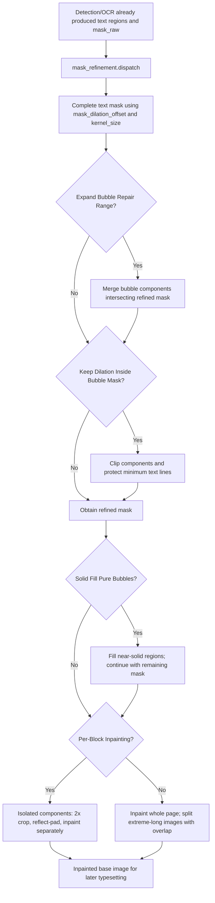

# Mask And Inpainting

This page covers the Settings “Inpainting” group: how detected and OCR-associated text regions become an inpainting mask, and how source text inside that mask is removed. It does not change detector output, OCR recognition, or text filtering, and it does not document translated-text layout, fonts, or AI renderers; those belong to the Detection, OCR, and Typesetting pages respectively.

## UI operations {#ui-operations}

Open Settings and select “Inpainting.” The layout shows the inpainting model, mask dilation, two bubble-range switches, solid filling, and per-block inpainting; after the “Advanced” divider it shows size, precision, kernel size, and the PyTorch-force switch. Dynamic setting rows use switches, integer inputs, or combo boxes. A change immediately updates in-memory `AppSettings`; the configuration service batches the configuration-file write after 250 ms. Numeric fields have no Apply button: their values are read when the next mask-refinement or inpainting stage runs.

The two bubble-related values are stored under the `ocr` configuration section, but deliberately appear on the Inpainting tab because they only affect the pre-inpainting mask. They neither recognize OCR text again nor filter it. The switches depend on MangaLens bubble results. If the cache cannot be read or detection fails, the code logs a warning and keeps the unmodified refined mask.

### UI call keys and actual labels

Labels are called through the `labels` mapping in `app_logic.py`; the tab and divider use the `Inpainting` and `Advanced` layout keys directly. This table covers every visible setting on this page. Both `English` and `Simplified Chinese` are actual locale values.

| UI call key / stored key | Actual English | Actual Simplified Chinese |
| --- | --- | --- |
| `Inpainting` | Inpainting | 修复 |
| `label_inpainter` / `inpainter.inpainter` | Inpainting Model | 修复模型 |
| `label_mask_dilation_offset` / `mask_dilation_offset` | Mask Dilation Offset | 遮罩扩张偏移 |
| `label_limit_mask_dilation_to_bubble_mask` / `ocr.limit_mask_dilation_to_bubble_mask` | Keep Dilation Inside Bubble Mask | 膨胀不超过气泡蒙版 |
| `label_use_model_bubble_repair_intersection` / `ocr.use_model_bubble_repair_intersection` | Expand Bubble Repair Range | 扩大气泡修复范围 |
| `label_solid_fill_pure_bubbles` / `inpainter.solid_fill_pure_bubbles` | Solid Fill Pure Bubbles | 纯色气泡直接填色 |
| `label_per_block_inpainting` / `inpainter.per_block_inpainting` | Per-Block Inpainting | 逐块修复 |
| `Advanced` | Advanced | 高级 |
| `label_inpainting_size` / `inpainter.inpainting_size` | Inpainting Size | 修复大小 |
| `label_inpainting_precision` / `inpainter.inpainting_precision` | Inpainting Precision | 修复精度 |
| `label_kernel_size` / `kernel_size` | Kernel Size | 卷积核大小 |
| `label_force_use_torch_inpainting` / `inpainter.force_use_torch_inpainting` | Force Use PyTorch Inpainting | 强制使用PyTorch修复 |

## Options, defaults, and consumers {#option-matrix}

“Core default” is from `manga_translator/config.py`; “Qt default” is from `desktop_qt_ui/core/config_models.py`; “release default” is from `config/config-example.json`. The release default is the shipped template, not any user’s configuration.

### Combo-box options

Dynamic combo-box options are built by `app_logic.py` from the `Inpainter` and `InpaintPrecision` enums. These enums have no display mapping, so their English and Simplified Chinese UI values are the storage values below, rather than invented translations of model names.

| Stored value | English | Simplified Chinese | Conditions and implementation |
| --- | --- | --- | --- |
| `default` | `default` | `default` | AOT implementation |
| `lama_large` | `lama_large` | `lama_large` | LaMa Large implementation; locale text calls it best quality and recommends it |
| `lama_mpe` | `lama_mpe` | `lama_mpe` | LaMa MPE implementation; locale text calls it fast |
| `sd` | `sd` | `sd` | Stable Diffusion inpainting; loading errors if optional dependencies are unavailable |
| `none` | `none` | `none` | Does not run a model; fills masked pixels white |
| `original` | `original` | `original` | Returns a copy of the original image and retains source text |
| `fp32` | `fp32` | `fp32` | Inpainting precision; locale text calls it most accurate and slowest |
| `fp16` | `fp16` | `fp16` | Inpainting precision; locale text calls it balanced |
| `bf16` | `bf16` | `bf16` | Inpainting precision; locale text recommends it |

### Parameter matrix

| Setting key (individual anchor) | Control and all stored values | Qt / core / release default | Effective stage | Final consumer |
| --- | --- | --- | --- | --- |
| `inpainter.inpainter` {#inpainter-inpainter} | Combo box: `default`, `lama_large`, `lama_mpe`, `sd`, `none`, `original` | `lama_mpe` / `lama_large` / `lama_large` | Inpainting | Implementation mapping in `inpainting.get_inpainter()` and `dispatch()` |
| `mask_dilation_offset` {#mask-dilation-offset} | Integer input | `70` / `20` / `50` | Mask refinement | `dilation_offset` of `mask_refinement.dispatch()` |
| `ocr.limit_mask_dilation_to_bubble_mask` {#limit-mask-dilation-to-bubble-mask} | Switch: `true`, `false` | `false` / `false` / `true` | Mask refinement | Bubble-mask clipping and text-line protection |
| `ocr.use_model_bubble_repair_intersection` {#use-model-bubble-repair-intersection} | Switch: `true`, `false` | `false` / `false` / `false` | Mask refinement | Merges bubble components intersecting the refined mask |
| `inpainter.solid_fill_pure_bubbles` {#solid-fill-pure-bubbles} | Switch: `true`, `false` | `false` / `false` / `false` | Before and during inpainting | `solid_fill_pure_bubbles()` |
| `inpainter.per_block_inpainting` {#per-block-inpainting} | Switch: `true`, `false` | `false` / `false` / `false` | Inpainting | `inpaint_regions_per_block()` and per-block `dispatch()` |
| `inpainter.inpainting_size` {#inpainting-size} | Integer input | `2048` / `2048` / `2048` | Inpainting | `inpaint(..., inpainting_size)` of each inpainter |
| `inpainter.inpainting_precision` {#inpainting-precision} | Combo box: `fp32`, `fp16`, `bf16` | `fp32` / `bf16` / `fp32` | Model loading/inpainting | `InpainterConfig` and LaMa backend |
| `kernel_size` {#kernel-size} | Integer input | `3` / `3` / `3` | Mask refinement | Kernel in `complete_mask()` |
| `inpainter.force_use_torch_inpainting` {#force-torch} | Switch: `true`, `false` | `false` / `false` / `false` | Inpainter loading | `OfflineInpainter.load(..., force_torch=...)` |

### `inpainter.inpainter` — Inpainting Model / 修复模型

- Behavior: the selection maps to AOT, LaMa Large, LaMa MPE, Stable Diffusion, white-fill, or original-image implementations. Inpainting dispatch first binarizes the mask, then uses overlapped splitting and compositing for an extreme aspect ratio above 3.
- Dependencies and conflicts: `sd` needs optional dependencies and explicitly becomes unavailable without them. `none` does not mean “do nothing”: it fills the mask white. `original` retains the source text. With an AI renderer selected, the main pipeline skips inpainting and uses the original work image as the rendering base.
- Diagram: required; the model value selects distinct implementations or bypass behavior.

### `mask_dilation_offset` and `kernel_size` — Mask Dilation Offset / 遮罩扩张偏移; Kernel Size / 卷积核大小 {#dilation-and-kernel}

- Behavior: text regions and the raw mask enter `complete_mask()`; `mask_dilation_offset` controls expansion to cover anti-aliasing and residual strokes, while `kernel_size` controls the cleanup kernel. If refinement throws in the inpaint-only workflow, a simple dilation with `mask_dilation_offset // kernel_size` iterations is the fallback.
- Dependencies and conflicts: excessive offset or kernel size can cover line art, bubble edges, or artwork. `limit_mask_dilation_to_bubble_mask` may clip components beyond bubbles, but it does not forcibly delete the mask when no bubble result exists. An offset of `0` means no extra expansion. Source code declares no additional enum range for these page fields; integer-widget and configuration validation jointly constrain values.
- Diagram: required; both numbers change mask coverage and fallback iterations.

### Bubble range — `ocr.limit_mask_dilation_to_bubble_mask` and `ocr.use_model_bubble_repair_intersection` {#bubble-range}

- `ocr.limit_mask_dilation_to_bubble_mask`: clips each refined-mask component against an eroded model bubble mask. Intersecting components keep only the intersection; non-intersecting components remain. It then restores pixels that already existed but were removed inside the minimum text-line protection area. It does not expand the mask.
- `ocr.use_model_bubble_repair_intersection`: retains bubble components that intersect the refined mask and ORs them into that mask, so it can expand the repair area. If no bubble is detected, the original refined mask remains.
- Defaults and stage: see the matrix. Both values are stored under OCR but read only by the mask-refinement consumer; neither changes OCR text, bubble filtering, nor translation.
- Dependencies and conflicts: both need MangaLens bubble results. If both are on, the repair range is merged first and then bubble-constrained clipping runs. This is not OCR’s `use_model_bubble_filter`, which belongs to the OCR-filter page.
- Diagram: required; the switches have opposite merge and clip directions.

### `inpainter.solid_fill_pure_bubbles` — Solid Fill Pure Bubbles / 纯色气泡直接填色

- Behavior: model-detected bubbles are matched to text regions; the bubble mask is proportionally shrunk and the expanded tight text mask is subtracted. If the remaining background is nearly solid, it is filled directly and removed from the pending inpainting mask. Model misses still go to the inpainter.
- Dependencies and conflicts: requires text regions and bubble-model output. If bubble detection fails, this optimization is skipped. It can be combined with per-block inpainting: solid fill runs first, then the remaining mask is processed per block. If the remaining mask is empty, model inpainting is skipped.
- Diagram: required; the switch determines whether near-solid regions bypass the model.

### `inpainter.per_block_inpainting` — Per-Block Inpainting / 逐块修复

- Behavior: the refined mask is divided into isolated connected components. Each gets a 2× crop, reflection-padding to a square, and an individual call to the same inpainter before write-back. Off sends the complete page to the model once. Square-padded blocks do not enter the extreme-long-image split path.
- Dependencies and conflicts: smaller crops may lower CPU inference pressure, but less context can worsen complex backgrounds. This path is enabled by this switch alone; an error in the per-block operation falls back to whole-page inpainting at the outer layer.
- Diagram: required; the switch changes work granularity and the long-image path.

### `inpainter.inpainting_size` and `inpainter.inpainting_precision` — Inpainting Size / 修复大小; Inpainting Precision / 修复精度 {#size-and-precision}

- Behavior: size is passed to each `inpaint()` call. Larger sizes generally improve quality but run slower and can cause OOM. Precision is the `fp32`, `fp16`, or `bf16` enum passed through the inpainter configuration.
- Dependencies and conflicts: available precision depends on hardware and backend. The core default `bf16` differs from the Qt and release `fp32`; they must not be collapsed into a single “default.” Large size or high precision raises memory/VRAM pressure; neither changes mask geometry.
- Diagram: required; size and precision jointly change model-resource behavior and OOM exposure.

### `inpainter.force_use_torch_inpainting` — Force Use PyTorch Inpainting / 强制使用PyTorch修复 {#force-torch}

- Behavior: the Boolean is passed as `force_torch` while an offline inpainter loads. Locale text says CPU normally prefers ONNX and PyTorch can be forced when ONNX has problems.
- Dependencies and conflicts: requires a loadable PyTorch backend and matching device dependencies. It is not the global GPU switch and does not affect implementations such as `none` or `original` that do not load an offline model.
- Diagram: required; the switch changes the offline-inpainter loading backend.

## Runtime behavior {#runtime}

The main pipeline calls mask refinement with `ctx.mask_raw`, text regions, and the global parameters; it then calls inpainting with the resulting `ctx.mask`. With no text regions or an empty mask, the inpainting stage is skipped and the original work image remains. If refinement raises, the inpaint-only workflow falls back to simple dilation; whether an inpainting failure continues is governed by general `cli.ignore_errors`. When an AI renderer is selected, the main pipeline explicitly skips inpainting and renders on the original image. This renderer boundary does not change how this page stores its settings.

## Dependencies and conflicts {#dependencies}

- Mask refinement needs text regions and a raw mask from an earlier stage; with no text regions, these switches have nothing to process.
- Both bubble-range switches depend on MangaLens output. Cache misses, no detections, or errors retain the refined mask. They must not be described as OCR re-detection or OCR filtering.
- Larger size, higher precision, and whole-page inpainting increase memory/VRAM pressure. Extreme-long images are divided along their long axis with overlap before compositing.
- Per-block inpainting trades context for smaller crops; it is not the same feature as extreme-long-image splitting.
- `none` white fill, `original` image retention, and AI-renderer inpainting skip yield different outputs and must not substitute for one another.

## Related files and formats {#files-and-formats}

| File or field | Actual relation on this page | Format, compatibility, and manual-editing risk |
| --- | --- | --- |
| `config/config-example.json` | Supplies release-template defaults for this page | JSON; use only as a default source, never copy user paths, credentials, or private configuration |
| `config/config.json` | Configuration service persists current settings | JSON; Pydantic models validate it. Manually changing unknown values or invalid enums can cause validation failure or fallback |
| Translation JSON `mask_raw` | May store the raw or refined mask | Optional base64 PNG; when `ctx.mask` is saved, `mask_is_refined=true` and loading may skip refinement |
| Translation JSON `mask_is_refined` | Marks whether `mask_raw` is already refined | Boolean; absence or `false` must not be treated as refined |
| Verbose `mask_bubble_clip_debug.png` | Bubble-constrained-dilation debug overlay | Exists only when verbose is on, the switch is enabled, and image writing succeeds. It contains run-image content and must be sanitized before sharing |

This page does not show, read, or request real keys, user configuration, private paths, images, or prompts.

## Source evidence {#source-evidence}

| Layer | File | Verified content |
| --- | --- | --- |
| UI layout | `desktop_qt_ui/ui/main_page/settings_tab_layout.json` | All ten Inpainting settings and the Advanced-divider order |
| UI labels and enums | `desktop_qt_ui/app_logic.py` | i18n label calls and `Inpainter`/`InpaintPrecision` option sources |
| Locales | `desktop_qt_ui/locales/en_US.json`, `desktop_qt_ui/locales/zh_CN.json` | Actual bilingual labels and descriptions for every UI call key |
| Qt defaults and persistence | `desktop_qt_ui/core/config_models.py`, `desktop_qt_ui/services/config_service.py` | Qt defaults, user/release/code priority, and 250-ms batched writes |
| Core definitions | `manga_translator/config.py` | Enums, core defaults, and field semantics |
| Mask consumers | `manga_translator/mask_refinement/__init__.py`, `manga_translator/manga_translator.py` | Dilation, bubble merge/clipping, fallback, and stage calls |
| Inpainting consumers | `manga_translator/inpainting/__init__.py`, `manga_translator/inpainting/none.py`, `manga_translator/inpainting/original.py` | Inpainter mapping, Torch loading, long-image splitting, white fill, and original-image behavior |
| Mask serialization | `manga_translator/manga_translator.py` | `mask_raw` base64 PNG and `mask_is_refined` output |

## Verification {#verification}

| Check | Status | Record |
| --- | --- | --- |
| Layout, controls, and i18n three-column evidence | Complete | Static verification of layout, `app_logic.py`, and actual `en_US`/`zh_CN` values |
| Parameter defaults, enums, and consumers | Complete | Static verification of Qt, core, release template, and mask/inpainting call chains |
| Live UI interaction and bubble-model output | Not run | Static source does not replace runtime validation; requires a sanitized test image and model environment |
| Each inpainter, precision, long-image, and per-block result | Not run | Requires reproducible sanitized runtime validation; no user image or output is shown |
| VitePress build | Pending this page build | See the build-command record in this commit |

## Sensitive-information review {#sensitive-information-review}

- Reviewed: this page contains no API keys, tokens, usernames, user `config.json`, private absolute paths, user images, or prompts.
- The page only names the conditional debug-file pattern and sanitization requirement; it embeds or links no actual run image.
