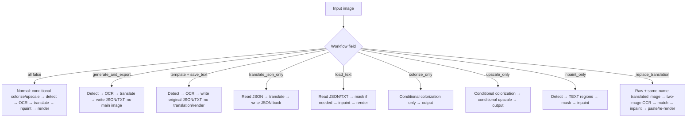
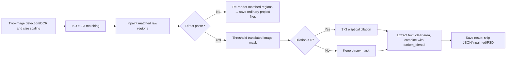

# Mode-Specific Workflows and Template Alignment

This page covers the nine workflows on the translation page and the template-alignment parameters under “Mode Specific → Replace Translation”. It does not repeat upscale/colorization fields (see [Upscale and Colorization](./upscale-and-colorization.md)) or general stage parameters. Workflow choices are `cli` branches; template alignment is a `render` branch. The GUI clears all eight workflow flags before setting the selected one, so selecting one mode is exclusive; manually combining flags is not a supported contract.

## UI operations

Choose a mode from the “Translation Workflow Mode:” combo box. The change is persisted immediately and refreshes the description and start button; existing output handling still follows “Overwrite Existing Files”. Replace Translation additionally requires a matching translated image.

| UI call key | English actual value | Simplified Chinese actual value |
| --- | --- | --- |
| `Translation Workflow Mode:` | Translation Workflow Mode: | 翻译流程模式： |
| `Normal Translation` | Normal Translation | 正常翻译流程 |
| `Export Translation` | Export Translation | 导出翻译 |
| `Export Original Text` | Export Original Text | 导出原文 |
| `Translate JSON Only` | Translate JSON Only | 仅翻译（JSON） |
| `Import Translation and Render` | Import Translation and Render | 导入翻译并渲染 |
| `Colorize Only` | Colorize Only | 仅上色 |
| `Upscale Only` | Upscale Only | 仅超分 |
| `Inpaint Only` | Inpaint Only | 仅修复 |
| `Replace Translation` | Replace Translation | 替换翻译 |
| `Start Translation` | Start Translation | 开始翻译 |
| `Generate Original Text Template` | Generate Original Text Template | 仅生成原文模板 |
| `Start JSON Translation` | Start JSON Translation | 开始仅翻译（JSON） |
| `Start Colorizing` | Start Colorizing | 开始上色 |
| `Start Upscaling` | Start Upscaling | 开始超分 |
| `Start Inpainting` | Start Inpainting | 开始修复 |
| `Start Replace Translation` | Start Replace Translation | 开始替换翻译 |
| `label_enable_template_alignment` | Enable Direct Paste Mode | 启用直接粘贴模式 |
| `label_paste_mask_dilation_pixels` | Paste Mode Mask Dilation Pixels | 粘贴模式蒙版膨胀大小 |

“Enable Direct Paste Mode” and “Paste Mode Mask Dilation Pixels” are under Settings → Mode Specific → Replace Translation. The first is a toggle; the second is an integer, with `0` disabling dilation. The workflow selector maintains `cli.generate_and_export`, `template`, `translate_json_only`, `load_text`, `colorize_only`, `upscale_only`, `inpaint_only`, and `replace_translation`.

## Nine workflows and boundaries

The usual order is conditional colorization → conditional upscaling → detection → OCR → text-line merging → translation → mask refinement → inpainting → typesetting/rendering.

| UI mode / stored value | Input and discovery | Output | Stages, skips, and conflicts |
| --- | --- | --- | --- |
| Normal Translation / all workflow fields `false` | Main image | Main image; JSON when `save_text=true`, and possibly inpainted/editor-base images | Full main chain; the only mode that can enter `batch_concurrent` |
| Export Translation / `cli.generate_and_export=true` | Main image and optional template | JSON and `<stem>_translated.<format>`; no main image | Runs through translation/mask refinement; skips inpainting/rendering; concurrency disabled |
| Export Original Text / `cli.template=true && save_text=true` | Main image and template | JSON and `<stem>_original.<format>` | Runs through OCR/merge/mask refinement; skips translation/inpainting/rendering; concurrency disabled |
| Translate JSON Only / `cli.translate_json_only=true` | Existing project JSON | Writes JSON back and deletes the original-text sidecar after success | Translates JSON only; skips image stages; concurrency disabled |
| Import Translation and Render / `cli.load_text=true` | JSON and matching original/translated TXT | Main image, updated JSON, and inpainted image when needed | Import → mask (if needed) → inpaint → render; skips detection/OCR/translation; YOLO import may provide a detection fallback |
| Colorize Only / `cli.colorize_only=true` | Main image | Main image and conditional editor-base image | Colorization only; skips upscaling and text chain; concurrency disabled |
| Upscale Only / `cli.upscale_only=true` | Main image | Main image and conditional editor-base image | Conditional colorization → conditional upscaling; skips text chain; does not automatically disable the selected colorizer; concurrency disabled |
| Inpaint Only / `cli.inpaint_only=true` | Main image and detector | Main image | Conditional preprocessing → detection → literal `TEXT` regions → merge → mask → inpaint; skips OCR/translation/rendering; concurrency disabled |
| Replace Translation / `cli.replace_translation=true` | Raw image and same-name translated image at `manga_translator_work/translated_images/<stem><ext>` | Main image; normal re-rendering may write JSON/inpainted image | Detect/OCR/merge both images → scale and match regions at IoU `0.3` → inpaint → paste or re-render; no translation service; concurrency disabled |

If `output_format` is missing or invalid, the template falls back to `json`; the new JSON work directory is preferred over the legacy image-directory location. Upscale Only does not automatically disable the colorizer, and Export Original Text additionally requires `save_text=true`.

## Parameters

#### `cli.generate_and_export` — Export Translation / 导出翻译 {#cli-generate-and-export}

- Control/storage: workflow combo index 1; boolean `true/false`.
- All options: `false` Normal Translation / 正常翻译流程; `true` Export Translation / 导出翻译.
- Defaults: core `false`; Qt `false`; release `false`.
- Stage/consumer: detection, OCR, merge, translation, optional mask refinement; the export branch in `manga_translator.py` and TXT/JSON writers.
- Mechanism: exports translation data without inpainting, typesetting, or saving the main image.
- Dependencies/conflicts: main image and template; conflicts with other workflows and `batch_concurrent`.
- Files/diagram: `work/json/`, `work/translations/`, and `translation_template.json`; see [Workflow branches](#workflow-branches).
- Source: `runtime.py`, `config_models.py`, `manga_translator.py`, and `path_manager.py`.

#### `cli.template` — Export Original Text / 导出原文 {#cli-template}

- Control/storage: workflow combo index 2; boolean `true/false`.
- All options: `false` Normal Translation / 正常翻译流程; `true` Export Original Text / 导出原文.
- Defaults: core `false`; Qt `false`; release `false`.
- Stage/consumer: detection, OCR, merge, optional mask refinement; template export and original-text writers.
- Mechanism: exports OCR text for manual translation; the branch requires `save_text=true` as well.
- Dependencies/conflicts: invalid template format falls back to `json`; skips translation, inpainting, rendering, and concurrency.
- Files/diagram: `work/originals/<stem>_original.<format>`, JSON, and the template; see the workflow diagram.
- Source: `runtime.py`, `config_models.py`, `manga_translator.py`, and `translation_template.py`.

#### `cli.translate_json_only` — Translate JSON Only / 仅翻译（JSON） {#cli-translate-json-only}

- Control/storage: index 3; boolean `true/false`.
- All options: `false` Normal Translation / 正常翻译流程; `true` Translate JSON Only / 仅翻译（JSON）.
- Defaults: core, Qt, and release all `false`.
- Stage/consumer: JSON read → translation → JSON write-back; all image stages are skipped.
- Mechanism: reads source text from `regions` or the legacy list payload, writes translations back, and deletes the matching original-text sidecar after success.
- Dependencies/conflicts: compatible JSON is required; conflicts with other modes and concurrency; JSON write-back is not controlled by `save_text`.
- Files/diagram: `work/json/<stem>_translations.json` and the original-text sidecar; see the workflow diagram.
- Source: `runtime.py`, `config_models.py`, the JSON branch in `manga_translator.py`, and `path_manager.py`.

#### `cli.load_text` — Import Translation and Render / 导入翻译并渲染 {#cli-load-text}

- Control/storage: index 4; boolean `true/false`.
- All options: `false` Normal Translation / 正常翻译流程; `true` Import Translation and Render / 导入翻译并渲染.
- Defaults: core, Qt, and release all `false`.
- Stage/consumer: TXT/JSON import, mask, inpainting, and typesetting; the import branch in `manga_translator.py`.
- Mechanism: reads JSON and TXT, preferring original text, reuses a refined mask when present, otherwise refines a mask before inpainting and rendering; detection/OCR/translation are skipped.
- Dependencies/conflicts: matching JSON is required; missing masks can trigger detection when YOLO import is enabled; concurrency is disabled.
- Files/diagram: `work/originals/`, `translations/`, `json/`, and `inpainted/`; see the workflow diagram.
- Source: `runtime.py`, `manga_translator.py`, `path_manager.py`, and `translation_template.py`.

#### `cli.colorize_only` — Colorize Only / 仅上色 {#cli-colorize-only}

- Control/storage: index 5; boolean `true/false`.
- All options: `false` Normal Translation / 正常翻译流程; `true` Colorize Only / 仅上色.
- Defaults: core, Qt, and release all `false`.
- Stage/consumer: conditional colorization and save; upscaling, detection, OCR, translation, mask, inpainting, and rendering are skipped.
- Mechanism: calls the selected colorizer; `colorizer=none` passes the image through unchanged.
- Dependencies/conflicts: AI colorization needs its API configuration; the mode does not force a non-`none` colorizer; concurrency is disabled.
- Files/diagram: result image and conditional `editor_base/`; see the workflow diagram.
- Source: `runtime.py`, colorization branches in `manga_translator.py`, and `colorization/`.

#### `cli.upscale_only` — Upscale Only / 仅超分 {#cli-upscale-only}

- Control/storage: index 6; boolean `true/false`.
- All options: `false` Normal Translation / 正常翻译流程; `true` Upscale Only / 仅超分.
- Defaults: core, Qt, and release all `false`.
- Stage/consumer: conditional colorization, upscaling, and save; `upscaling/` and the main dispatcher.
- Mechanism: the ratio comes from `upscale.upscale_ratio`; an empty ratio skips upscaling, while a selected colorizer may still run first.
- Dependencies/conflicts: model, device, ratio, and tile settings must be usable; concurrency is disabled.
- Files/diagram: result image and conditional `editor_base/`; see the workflow diagram and the upscale page.
- Source: `runtime.py`, preprocessing branches in `manga_translator.py`, `upscaling/`, and `config.py`.

#### `cli.inpaint_only` — Inpaint Only / 仅修复 {#cli-inpaint-only}

- Control/storage: index 7; boolean `true/false`.
- All options: `false` Normal Translation / 正常翻译流程; `true` Inpaint Only / 仅修复.
- Defaults: core, Qt, and release all `false`.
- Stage/consumer: detection, merge, mask refinement, and inpainting; OCR, translation, and rendering are skipped.
- Mechanism: detector lines are replaced with the literal `TEXT` as regions to erase; absent regions or masks return an unmodified result.
- Dependencies/conflicts: detector, mask, and inpainter are required; an AI renderer can skip the actual inpainting; concurrency is disabled.
- Files/diagram: result image and conditional `work/inpainted/`; see the workflow diagram.
- Source: `runtime.py`, `manga_translator.py`, `mask_refinement/`, and `inpainting/`.

#### `cli.replace_translation` — Replace Translation / 替换翻译 {#cli-replace-translation}

- Control/storage: index 8; boolean `true/false`.
- All options: `false` Normal Translation / 正常翻译流程; `true` Replace Translation / 替换翻译.
- Defaults: core, Qt, and release all `false`.
- Stage/consumer: two-image detection/OCR/merge, region matching, inpainting, paste or re-render; `utils/replace_translation.py`.
- Mechanism: scales same-name translated-image regions to the raw target and matches them by IoU `0.3`; no translation service is called. Runtime forces `disable_auto_wrap=true` and `layout_mode=strict`.
- Dependencies/conflicts: same-name image is required; concurrency is disabled; direct paste does not write JSON, inpainted image, or PSD.
- Files/diagram: paired image and result, plus JSON/inpainted output for ordinary rendering; see [paste branches](#paste-branches).
- Source: `runtime.py`, `manga_translator.py`, `utils/replace_translation.py`, and `utils/path_manager.py`.

#### `render.enable_template_alignment` — Enable Direct Paste Mode / 启用直接粘贴模式 {#render-enable-template-alignment}

- Control/storage: toggle; `true/false`.
- All options: `false` Normal rendering / 普通重新渲染; `true` Direct paste / 直接粘贴.
- Defaults: core, Qt, and release all `false`.
- Stage/consumer: final Replace Translation rendering; `replace_translation.py`.
- Mechanism: when enabled, extracts text pixels from the translated image using its mask, clears the repaired raw-image area, and combines with `darken_blend2`; when disabled, the common renderer re-typesets matched regions. Only Replace Translation consumes it.
- Dependencies/conflicts: falls back to the raw-image mask when the translated image has no raw mask; enabled mode skips JSON, inpainted-image, and PSD saves.
- Files/diagram: paired image, result, and conditional `debug_extracted_text.png`; see the paste diagram.
- Source: `config.py`, `config_models.py`, `dynamic_settings.py`, both locale files, and `replace_translation.py`.

#### `render.paste_mask_dilation_pixels` — Paste Mode Mask Dilation Pixels / 粘贴模式蒙版膨胀大小 {#render-paste-mask-dilation-pixels}

- Control/storage: integer input; integer value.
- All options: positive values dilate by pixels; `0` or a negative value performs no dilation; there is no UI enum.
- Defaults: core `10`; Qt `10`; release `10`.
- Stage/consumer: mask preprocessing in direct paste; OpenCV thresholding, 3×3 elliptical kernel, and compositing.
- Mechanism: thresholds first; positive values use `max(value // 3, 1)` iterations of a 3×3 elliptical kernel. Larger values widen the paste area.
- Dependencies/conflicts: consumed only when `replace_translation=true` and direct paste is enabled; other modes and ordinary re-rendering ignore it.
- Files/diagram: changes only the intermediate mask, extracted text, and result; see the paste diagram.
- Source: `config.py`, `config_models.py`, `dynamic_settings.py`, both locale files, and `replace_translation.py`.

## Runtime behavior {#workflow-branches}

### Direct paste and re-render {#paste-branches}

`batch_size` controls batch size in the non-concurrent entry point; `batch_concurrent` controls the cross-image concurrent pipeline. All special modes force concurrency off to preserve sidecar ordering, context isolation, and failure boundaries.

## Dependencies and conflicts

- The GUI makes workflow fields mutually exclusive; manually combined configuration has no simultaneous-execution contract.
- `save_text` is required by Export Original Text; JSON-only writes JSON unconditionally.
- `colorizer` and `upscale_ratio` are not rewritten by Colorize Only/Upscale Only; conditional preprocessing may still run.
- Replace Translation requires a same-name translated image; direct paste is not generic template import.
- Direct paste skips JSON, inpainted image, and PSD; ordinary re-rendering saves project files according to `save_text`.
- Replace Translation forces strict layout and disabled automatic wrapping; direct paste does not export PSD because it has no renderable text-region data.

## Related files and formats

| File/directory | Use | Format and cautions |
| --- | --- | --- |
| `config/config.json` | Persistent configuration | JSON; user values are not documented |
| `config/config-example.json` | Release defaults | JSON; `render.layout_mode=balloon_fill`, `upscale=mangajanai`, and `tile_size=400` can differ from core/Qt defaults |
| `config/translation_template.json` | TXT/JSON template | First valid `output_format` selects the extension; missing/invalid values fall back to `json` |
| `manga_translator_work/json/` | Project JSON | `<stem>_translations.json`; new location first, legacy location supported |
| `manga_translator_work/originals/` / `translations/` | Original/translated text | `<stem>_original.<format>` / `<stem>_translated.<format>` |
| `manga_translator_work/translated_images/` | Replace pair image | Same stem; same extension first, then supported image extensions |
| `manga_translator_work/inpainted/`, `editor_base/` | Conditional intermediates | Not produced on every run; direct paste skips inpainted output |
| Verbose result directory | Debugging | Direct paste can produce `debug_extracted_text.png`; sanitize before sharing |

Do not read or commit real configuration, environment variables, keys, tokens, usernames, private absolute paths, user images, or private prompts. Listed filenames describe public structure only and do not mean every run produces every artifact.

## Source evidence {#source-evidence}

| Layer | File | Checked content |
| --- | --- | --- |
| UI layout/binding | `desktop_qt_ui/ui/main_page/settings_tab_layout.json`, `runtime.py`, `dynamic_settings.py` | Tab rows, nine indices, mutual exclusion, and two parameter submissions |
| UI/i18n | `desktop_qt_ui/app_logic.py`, `desktop_qt_ui/locales/en_US.json`, `zh_CN.json` | UI call keys and actual display values |
| Defaults/definitions | `desktop_qt_ui/core/config_models.py`, `manga_translator/config.py`, `config/config-example.json` | Qt, core, and release defaults |
| Dispatch/consumers | `manga_translator/manga_translator.py`, `manga_translator/utils/replace_translation.py` | Special branches, skipped stages, matching, inpainting, paste, and concurrency |
| File formats | `manga_translator/utils/path_manager.py`, `translation_template.py` | Work directories, same-name matching, extensions, and template fallback |

## Verification and sensitive-information review {#verification}

- Specification, page boundary, source fields, UI/i18n three-column values, and three default sources: passed by static review.
- Mermaid: includes the nine actual workflow branches and direct-paste/re-render difference.
- Sensitive-information review: passed; no real keys, tokens, usernames, private absolute paths, user images, or private prompts are shown.
- Sanitized GUI/model runtime: not performed; no screenshot or runtime claim is fabricated.
- Route mirror, source-evidence, coverage checks, and VitePress production build: pending final verification.
