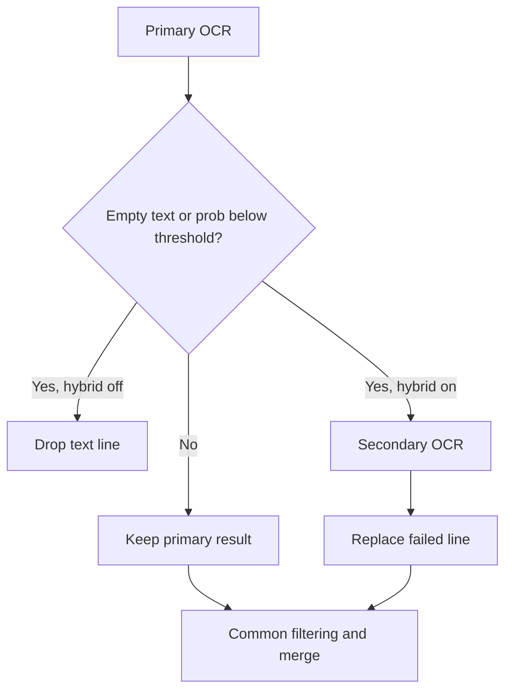
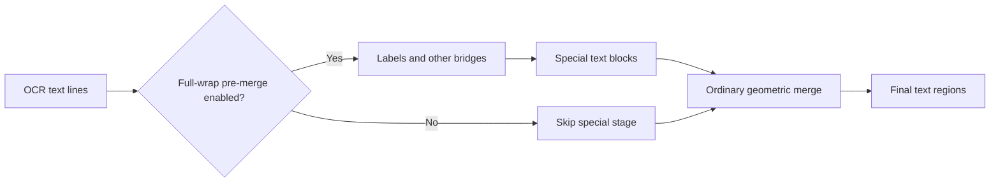
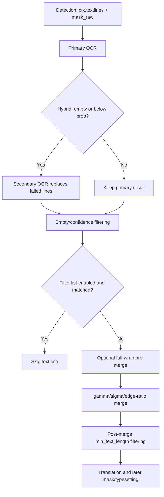

# OCR, Filtering, and Text-Line Merging

This page covers the “OCR” settings tab: recognition after detection, bubble and confidence filtering, the filter list, and constraints before and after text-line merging. It does not document how detectors create boxes (see [Detection settings](./detection.md)) or translation, inpainting, and typesetting parameters.

## Feature boundary {#feature-boundary}

The detector creates `ctx.textlines` and `mask_raw`; OCR writes text and probability for each box, OCR-stage filters remove invalid lines, and text lines are merged into text regions. Only then do regions enter translation. Bubble-repair options are documented here because they are related OCR settings, but their final consumer is mask refinement; detailed repair behavior belongs in [Mask and Inpainting](./mask-and-inpainting.md).

## UI operations {#ui-operations}

1. Open Settings and select “OCR”. Toggles, numeric fields, and combo boxes edit configuration directly; fields after the “Advanced” divider remain on this page but are advanced controls.
2. “OCR Model” selects the primary engine. After “Enable Hybrid OCR” is enabled, empty or low-confidence lines are sent to “Secondary OCR”. Changing an OCR engine, hybrid switch, or secondary engine also refreshes the desktop API groups required by that implementation.
3. “AI OCR Prompt” is a file-edit action, not an ordinary `OcrConfig` field. It opens the fixed AI OCR prompt editor. Do not put prompt contents or credentials in this page.
4. “PaddleOCR-VL Language Hint” matters only when `paddleocr_vl` is selected. A non-empty “PaddleOCR-VL Custom Prompt (Override)” replaces the built-in language/prompt mode.
5. “Edit Filter List” opens the filter-list editor. Its structured page has “Contains Filter” (one contains rule per line) and “Exact Filter” (one exact rule per line); “Raw Edit” edits JSON directly. Use “Refresh” to reload, “Cancel” to discard, and “Save” to validate and save.
6. Blank rules are discarded. The raw JSON root must be an object. Structured saves preserve unknown top-level fields; invalid JSON shows “JSON format error” and is not saved.

### UI call keys and actual labels

| UI call key | English actual value | Simplified-Chinese actual value |
| --- | --- | --- |
| `label_ocr` | OCR Model | OCR模型 |
| `label_use_hybrid_ocr` | Enable Hybrid OCR | 启用混合OCR |
| `label_secondary_ocr` | Secondary OCR | 备用OCR |
| `label_ai_ocr_prompt_path` | AI OCR Prompt | AI OCR 提示词 |
| `label_ai_ocr_concurrency` | AI OCR Concurrency | AI OCR 并发数 |
| `label_ocr_vl_language_hint` | PaddleOCR-VL Language Hint | PaddleOCR-VL 语言提示 |
| `label_ocr_vl_custom_prompt` | PaddleOCR-VL Custom Prompt (Override) | PaddleOCR-VL 自定义提示词（优先） |
| `label_use_model_bubble_filter` | Enable Model Bubble Filter | 启用模型气泡过滤 |
| `label_min_text_length` | Minimum Text Length | 最小文本长度 |
| `label_ignore_bubble` | Ignore Non-Bubble Text | 忽略非气泡文本 |
| `label_merge_special_require_full_wrap` | Require Full Wrap In Special Pre-Merge | 模型辅助合并 |
| `label_model_bubble_overlap_threshold` | Model Bubble Overlap Threshold | 模型气泡重叠阈值 |
| `label_filter_text_enabled` | Enable Filter List | 启用过滤列表 |
| `label_prob` | Text Region Min Probability | 文本区域最低概率 (prob) |
| `label_merge_gamma` | Merge Distance Tolerance | 合并-距离容忍度 |
| `label_merge_sigma` | Merge Outlier Tolerance | 合并-离群容忍度 |
| `label_merge_edge_ratio_threshold` | Merge Edge Ratio Threshold | 合并-边缘距离比例阈值 |
| `Edit Filter List` | Edit Filter List | 编辑过滤列表 |
| `Contains Filter` | Contains Filter | 包含过滤 |
| `Exact Filter` | Exact Filter | 精确过滤 |
| `Raw Edit` | Raw Edit | 原始编辑 |
| `Refresh` | Refresh | 刷新 |
| `Cancel` | Cancel | 取消 |
| `Save` | Save | 保存 |

## Option matrix {#option-matrix}

### OCR engines

| Stored value | English | Simplified Chinese | Condition |
| --- | --- | --- | --- |
| `32px` | 32px | 32px | Offline OCR |
| `48px` | 48px | 48px | Offline OCR |
| `48px_ctc` | 48px CTC | 48px CTC | Offline OCR |
| `mocr` | Manga OCR | Manga OCR | Lazily loaded Manga OCR |
| `paddleocr` | PaddleOCR | PaddleOCR | PaddleOCR |
| `paddleocr_korean` | PaddleOCR Korean | PaddleOCR Korean | Korean OCR |
| `paddleocr_latin` | PaddleOCR Latin | PaddleOCR Latin | Latin-script OCR |
| `paddleocr_thai` | PaddleOCR Thai | PaddleOCR Thai | Thai OCR |
| `paddleocr_vl` | PaddleOCR-VL | PaddleOCR-VL | VLM OCR |
| `openai_ocr` | OpenAI OCR | OpenAI OCR | Requires the corresponding API configuration |
| `gemini_ocr` | Gemini OCR | Gemini OCR | Requires the corresponding API configuration |

### PaddleOCR-VL language hints

| Stored value | English | Simplified Chinese |
| --- | --- | --- |
| `auto` | Auto | 自动 |
| `multilingual` | Multilingual | 多语言 |
| `Arabic` | Arabic | 阿拉伯语 |
| `Simplified Chinese` | Simplified Chinese | 简体中文 |
| `Traditional Chinese` | Traditional Chinese | 繁体中文 |
| `English` | English | 英语 |
| `Japanese` | Japanese | 日语 |
| `Korean` | Korean | 韩语 |
| `Spanish` | Spanish | 西班牙语 |
| `French` | French | 法语 |
| `German` | German | 德语 |
| `Russian` | Russian | 俄语 |
| `Portuguese` | Portuguese | 葡萄牙语 |
| `Italian` | Italian | 意大利语 |
| `Thai` | Thai | 泰语 |
| `Vietnamese` | Vietnamese | 越南语 |
| `Indonesian` | Indonesian | 印尼语 |
| `Turkish` | Turkish | 土耳其语 |
| `Polish` | Polish | 波兰语 |
| `Ukrainian` | Ukrainian | 乌克兰语 |

## Parameters, defaults, and consumers {#parameters}

Core defaults come from `manga_translator/config.py`, Qt defaults from `desktop_qt_ui/core/config_models.py`, and release defaults from `config/config-example.json`. An em dash means that layer has no same-named core field; `ocr.ai_ocr_prompt_path` is a file action rather than a core `OcrConfig` field.

| Parameter | Core default | Qt default | Release default | Stage | Final consumer | Dependency/conflict |
| --- | ---: | ---: | ---: | --- | --- | --- |
| `ocr.ocr` | `48px` | `48px` | `48px` | OCR | `ocr.dispatch`/model | Model or API group |
| `ocr.use_hybrid_ocr` | `false` | `true` | `false` | OCR fallback | `_run_ocr` | Secondary engine; extra cost |
| `ocr.secondary_ocr` | `48px` | `mocr` | `mocr` | OCR fallback | `ocr.dispatch` | Used only when hybrid is enabled |
| `ocr.min_text_length` | `0` | `0` | `0` | Post-merge filter | `manga_translator` | Does not prevent merging |
| `ocr.ignore_bubble` | `0.0` | `0.0` | `0.0` | OCR box filter | `ocr.common`/bubble | Can combine with model filter |
| `ocr.use_model_bubble_filter` | `false` | `false` | `false` | OCR box filter | `ocr.common`/MangaLens | Requires bubble result |
| `ocr.model_bubble_overlap_threshold` | `0.1` | `0.1` | `0.1` | OCR/repair | OCR and pure-bubble fill | Lower is more permissive |
| `ocr.use_model_bubble_repair_intersection` | `false` | `false` | `false` | Mask refinement | `mask_refinement` | Requires MangaLens mask |
| `ocr.limit_mask_dilation_to_bubble_mask` | `false` | `false` | `true` | Mask refinement | `mask_refinement` | Interacts with dilation |
| `filter_text_enabled` | — | `true` | `false` | Post-OCR filter | `text_filter`/main pipeline | Requires `filter_list.json` |
| `ocr.prob` | `None` | `0.1` | `0.1` | OCR fallback/post-filter | `_resolve_ocr_prob_threshold` | `None` falls back to 0.1 |
| `ocr.merge_gamma` | `0.8` | `0.8` | `0.8` | Text-line merge | `textline_merge` | Higher usually merges farther lines |
| `ocr.merge_sigma` | `2.5` | `2.5` | `2.5` | Text-line merge | `textline_merge` | Higher tolerates more outliers |
| `ocr.merge_edge_ratio_threshold` | `0.0` | `0.0` | `0.0` | Text-line merge | `textline_merge` | Zero disables protection |
| `ocr.merge_special_require_full_wrap` | `true` | `true` | `true` | Special pre-merge | `textline_merge.dispatch` | Requires detection labels |
| `ocr.ocr_vl_language_hint` | `auto` | `auto` | `Japanese` | VL OCR | PaddleOCR-VL | Only relevant to VL engine |
| `ocr.ocr_vl_custom_prompt` | `None` | `None` | `null` | VL OCR | PaddleOCR-VL | Non-empty value overrides hint |
| `ocr.ai_ocr_prompt_path` | — | File action | — | API OCR | Prompt loader | Not an ordinary core key |
| `ocr.ai_ocr_concurrency` | `1` | `1` | `10` | API OCR | OpenAI/Gemini OCR | Rate, quota, and memory limits |
| `ocr.ai_ocr_custom_prompt` | `None` | `None` | `null` | API OCR | API OCR backend | API OCR only |

#### `ocr.ocr` — OCR Model {#ocr-ocr}

The combo box selects an OCR enum. `ocr.dispatch` selects and caches the model; offline models load on the selected device, while API models use their API configuration. Models and credentials must be available, and detection boxes are unchanged. No separate diagram is needed because the engine matrix expresses the branches.

#### `ocr.use_hybrid_ocr` and `ocr.secondary_ocr` — Hybrid OCR {#hybrid-ocr}

When primary OCR returns empty text or a line below `prob`, hybrid mode calls the secondary engine and replaces the failed line; common filtering and merging still follow. The secondary model/API must be available, and loading, requests, and latency increase.

#### `ocr.prob` — Text Region Min Probability {#ocr-prob}

This nullable numeric field has core default `None` and Qt/release default `0.1`; `_resolve_ocr_prob_threshold` resolves `None` to `0.1`. It controls both hybrid fallback and per-line post-OCR filtering. It is not the detector’s `text_threshold`. A high value triggers more fallback and drops more text.

#### `ocr.ignore_bubble` — Ignore Non-Bubble Text {#ocr-ignore-bubble}

This is a 0–1 float field; zero disables it and higher values are stricter. OCR backends use `ocr.common` and bubble utilities before recognition to drop non-bubble boxes. It can combine with model bubble filtering, reducing OCR input without refining the mask.

#### `ocr.use_model_bubble_filter` and `ocr.model_bubble_overlap_threshold` — Model Bubble Filter {#model-bubble-filter}

MangaLens retains a text box when its overlap with a bubble box reaches the threshold; lower is more permissive. The same threshold is also used by pure-bubble filling. This requires MangaLens results and is not a detector threshold.

#### `ocr.min_text_length` — Minimum Text Length {#ocr-min-text-length}

This integer is zero by default, meaning no length deletion. It reads `region.text` after final merging, so short raw lines can still participate in merging. A large value may remove single-character text or sound effects.

#### `filter_text_enabled` — Enable Filter List {#filter-text-enabled}

This toggle has an “Edit Filter List” action; Qt default is true, release default is false, and there is no same-named core field. After blank and low-confidence lines are removed, exact and contains rules are matched case-insensitively. A match removes the line from merging, translation, repair, and typesetting. Disabling this switch does not disable probability, bubble, or minimum-length filtering.

#### `ocr.merge_gamma` and `ocr.merge_sigma` — Merge Tolerances {#merge-tolerances}

These float fields default to `0.8` and `2.5`. `gamma` relaxes the adjacent-line distance relative to font size; `sigma` relaxes the distance-outlier standard-deviation condition. Excessive values can merge text across bubbles.

#### `ocr.merge_edge_ratio_threshold` — Merge Edge Ratio Threshold {#merge-edge-ratio}

This float is disabled at zero. When enabled and a node has multiple neighbors, a longer edge is disconnected when its distance divided by the nearest distance exceeds the threshold. Too small a value fragments text; too large a value weakens the guard.

#### `ocr.merge_special_require_full_wrap` — Require Full Wrap In Special Pre-Merge {#special-pre-merge}

This toggle defaults to true. It first finds full-wrap relationships using strip/balloon labels; `other` boxes are bridges only and do not enter final text-block geometry, then remaining boxes use ordinary merging. Disabling it skips the special stage.

#### VL and AI OCR parameters {#ocr-vl-and-ai}

`ocr.ocr_vl_language_hint` defaults to `auto`, while the release example uses `Japanese`; a non-empty `ocr.ocr_vl_custom_prompt` overrides the built-in hint and applies only to `paddleocr_vl`. `ocr.ai_ocr_prompt_path` is a fixed-prompt file action; `ocr.ai_ocr_custom_prompt` defaults to empty; `ocr.ai_ocr_concurrency` is 1 in core/Qt and 10 in the release example. OpenAI/Gemini OCR use these resources and limit simultaneous API requests. API configuration is required; higher concurrency may trigger rate limits. No prompt or key is shown here.

## Runtime behavior {#runtime}

Post-OCR filtering occurs before merging, while minimum length is applied after merging. AI OCR concurrency limits OCR API requests only; it does not make the whole image pipeline concurrent.

## Dependencies and conflicts {#dependencies}

- Offline OCR requires its model and device backend; OpenAI/Gemini OCR requires credentials, address, and model in API Management.
- Hybrid OCR combined with a high `prob` causes more fallback inference/requests; an overly strict bubble threshold can miss text outside bubbles.
- Poor merge combinations cause cross-bubble over-merging or fragmentation. Bubble-repair intersection and dilation limits affect repair masks, not OCR text.
- AI OCR concurrency is constrained by API rate limits, quotas, network, and memory.

## Related files and formats {#files-and-formats}

| File/directory | Role | Manual-edit and safety note |
| --- | --- | --- |
| `config/config.json` | User settings persistence | Do not share user paths, credentials, or state |
| `config/config-example.json` | Release defaults template | Not the current user configuration |
| `config/filter_list.json` | `contains`/`exact` filter JSON | UTF-8 object; blank rules are removed |
| `config/filter_list.txt` | Legacy migration source | Migrated only when JSON is absent |
| `dict/ai_ocr_prompt.yaml` | Fixed AI OCR prompt resource | Prompt body and private prompts are not shown |
| `result/.../ocrs/` | OCR debug directory in verbose mode | May contain user images/text; sanitize before sharing |
| `result/.../mask_raw.png`, `bboxes_unfiltered*.png`, `bboxes.png` | Conditional debug images | Not produced on every run; user images are not included |
| `result/.../mask_bubble_clip_debug.png` | Bubble-constrained dilation debug image | May expose source-image content |

The minimal filter JSON is `{ "contains": [], "exact": [] }`. Matching is case-insensitive, exact rules are checked before contains rules, saving clears the runtime cache, structured editing preserves unknown top-level fields, and raw editing requires an object root.

## Mermaid, screenshots, and sensitive-information review {#visuals-and-security}

The Mermaid diagrams show the actual hybrid fallback, filtering, and two-level merge branches; no screenshot is fabricated. Future screenshots must use sanitized settings and public samples, with usernames, private absolute paths, keys, tokens, user images, and private prompts cropped or removed. None of these sensitive contents was read or shown here.

## Source evidence {#source-evidence}

| Layer | File | Checked content |
| --- | --- | --- |
| Settings layout | `desktop_qt_ui/ui/main_page/settings_tab_layout.json` | OCR tab, Advanced fields, and ownership |
| Dynamic UI/file actions | `desktop_qt_ui/ui/main_page/dynamic_settings.py` | Widget generation, filter list and AI OCR editors |
| Labels/options | `desktop_qt_ui/app_logic.py` | Setting keys to i18n keys and VL options |
| i18n | `desktop_qt_ui/locales/en_US.json`, `desktop_qt_ui/locales/zh_CN.json` | Actual three-column labels |
| Defaults/enums | `manga_translator/config.py`, `desktop_qt_ui/core/config_models.py`, `config/config-example.json` | Three defaults and OCR enum |
| OCR dispatch | `manga_translator/ocr/__init__.py`, `manga_translator/ocr/common.py`, `manga_translator/manga_translator.py` | Dispatch, bubble filtering, hybrid fallback, and confidence filtering |
| Filter list | `manga_translator/utils/text_filter.py`, `desktop_qt_ui/ui/secondary_pages/filter_list_editor.py` | JSON/TXT, matching, editing, validation, and cache |
| Merge/mask | `manga_translator/textline_merge/__init__.py`, `manga_translator/mask_refinement/__init__.py` | Special pre-merge, geometric merge, and bubble-mask consumers |

## Verification {#verification}

| Item | Status | Notes |
| --- | --- | --- |
| Three specifications and page boundary | Complete | Read BLUEPRINT, PAGE_GUIDELINES, and TODO; only this page is covered |
| UI, keys, en_US/zh_CN | Complete | Static check of layout, mapping, and locale values |
| Parameters, defaults, options, consumers | Complete | Static check of core, Qt, release template, and consumers |
| File formats, debug artifacts, security | Complete | Checked filter JSON/TXT and conditional artifacts; no sensitive information shown |
| Chinese-English mirror and Mermaid | Complete | Sections, explicit anchors, and diagrams mirror each other |
| Runtime UI/real screenshots | Pending unified acceptance | App was not started; no visual result was fabricated |
| VitePress and static checks | Pending | Run repository checks before committing |
