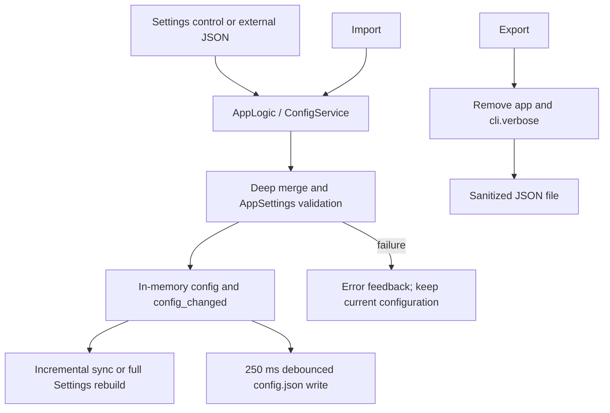

# Settings Shell, Descriptions, and Config Import/Export

This page describes how the desktop Settings page organizes groups, parameter rows, and the right-hand description panel, and how it exports or imports settings JSON. It does not explain the algorithmic meaning of detection, OCR, translation, inpainting, typesetting, upscaling, or colorization parameters; those belong to [Settings and configuration lifecycle](./index.md) and the corresponding parameter pages. It also does not own API credential slots, presets, prompt lists, or editor project files.

## Feature boundary {#feature-boundary}

- The Settings shell consists of a header, seven group tabs, a scrollable parameter list, and a right-hand description panel; the header also provides “Export Config” and “Import Config”.
- `settings_tab_layout.json` currently defines seven tabs: `General`, `OCR`, `Detection`, `Translation`, `Inpainting`, `Typesetting`, and `Mode Specific`. `Advanced`, `Replace Translation`, `Upscaling`, and `Colorization` are dividers inside tabs, not independent tabs.
- The dynamic settings code skips internal state, workflow-controlled fields, and deprecated fields. The Phase 0 inventory has 110 layout entries and 109 visible parameters; the entry count must not be presented as the number of visible rows.
- Export handles a JSON snapshot of the settings model and explicitly removes the temporary `app` state and `cli.verbose`; it is not an API-credential or whole-work-directory backup.
- Import deep-merges external JSON into the current settings, restores the current `app` section, and validates through `AppSettings`; it does not import `.env`, prompt contents, translation JSON, or user images.

## UI operations {#ui-operations}

### Settings shell and right-hand description {#settings-shell}

1. Open the desktop Settings page. The header shows the title and automatic-save hint, with configuration import/export buttons on the right.
2. Select a group tab. Rows are rebuilt in the order of `items` in `settings_tab_layout.json`; dividers only change visual grouping.
3. Change a toggle, input, or combo box. Ordinary edits update the in-memory configuration immediately and are then coalesced to disk by the configuration service; there is no separate Apply button.
4. Click a row, label, or its control. The right-hand “Parameter Description” panel shows the row name, a formatted configuration key, and the matching `desc_<section>_<key>` description. If no description exists, it shows “No description available.”
5. Clearing an optional numeric input or entering an unparseable number emits `null`; consumers interpret that as default/automatic semantics. An empty value is not saved as an empty numeric string.

### File-edit actions are not ordinary parameters {#file-edit-actions}

These rows remain in Settings, but their buttons open a resource editor or directory rather than placing file contents in an ordinary configuration value:

| UI call key | English actual value | Simplified Chinese actual value | Action |
| --- | --- | --- | --- |
| `Edit` | Edit | 编辑 | Open the fixed AI OCR, AI renderer, or AI colorizer prompt editor; also used for the custom API parameter file |
| `btn_open_filter_list` | Open Filter List | 打开过滤列表 | Open the filter-list editor |
| `Open Directory` | Open Directory | 打开目录 | Directory action for the font row or prompt directory |
| `label_ai_ocr_prompt_path` | AI OCR Prompt File | AI OCR 提示词文件 | File-edit action/resource path |
| `label_ai_renderer_prompt_path` | AI Renderer Prompt File | AI 渲染提示词文件 | File-edit action/resource path |
| `label_ai_colorizer_prompt_path` | AI Colorizer Prompt File | AI 上色提示词文件 | File-edit action/resource path |

The dedicated prompt pages document each prompt format and consumer; this page records only the Settings-shell action boundary.

### Export configuration {#export-config}

1. Click “Export Config” (`Export Config`).
2. In the native save dialog, choose a destination. The code supplies `manga_translator_config.json` as the default filename and filters for `JSON Files (*.json)`.
3. Canceling the dialog writes nothing and shows no success message.
4. On success, the UI shows “Export Success” and a sanitization note; on failure, it shows “Export Failed” with the error.

The snapshot starts from `AppSettings.model_dump()`. Before writing, export deletes the complete `app` section and removes `verbose` from `cli`; the exported JSON therefore does not contain application paths, favorites, current preset, or API keys. It may still contain non-credential pipeline parameters, so inspect it before sharing.

### Import configuration {#import-config}

1. Click “Import Config” (`Import Config`).
2. In the native open dialog, select a `JSON Files (*.json)` file; canceling leaves the current configuration unchanged.
3. The file is read as UTF-8 JSON and deep-merged into the current configuration.
4. The current `app` section is restored after the merge, so the imported file cannot replace local paths, theme, language, or other application state.
5. After `AppSettings.model_validate()` succeeds, the service updates memory, requests a save, and notifies the UI. The Settings page may rebuild, refreshing the description panel, API groups, and prompt-related controls.
6. Success shows “Import Success” and explicitly says that current API keys and sensitive information were preserved; parse, validation, or save errors show “Import Failed”.

The code has no dedicated “confirm overwrite” dialog for configuration import; import directly merges and saves. Whether the native save dialog asks before replacing an existing target is only statically known and has not been confirmed in headed runtime, so it must not be documented as an application guarantee.

## Option matrix {#option-matrix}

| UI call key / stored value | English | 简体中文 |
| --- | --- | --- |
| `Settings Page Title` | Settings | 参数设置 |
| `Settings Page Subtitle` | Adjust translation pipeline parameters. Changes are saved automatically. | 调整翻译流程的各项参数。修改后将自动保存。 |
| `Export Config` | Export Config | 导出配置 |
| `Import Config` | Import Config | 导入配置 |
| `Export Success` | Export Success | 导出成功 |
| `Export Failed` | Export Failed | 导出失败 |
| `Import Success` | Import Success | 导入成功 |
| `Import Failed` | Import Failed | 导入失败 |
| `Settings Desc Header` | Parameter Description | 参数说明 |
| `Settings Desc Placeholder` | Click any setting on the left to view details | 点击左侧任意设置项查看详细说明 |
| `Settings Desc Key` | Parameter Key: {config_key} | 参数键：{config_key} |
| `Settings Desc No Description` | No description available. | 暂无说明。 |
| `General` | General | 通用 |
| `OCR` | OCR | 文字识别 |
| `Detection` | Detection | 检测 |
| `Translation` | Translation | 翻译 |
| `Inpainting` | Inpainting | 修复 |
| `Typesetting` | Typesetting | 排版 |
| `Mode Specific` | Mode Specific | 模式相关 |
| `Advanced` | Advanced | 高级 |
| `Edit` | Edit | 编辑 |
| `Open Directory` | Open Directory | 打开目录 |
| `btn_open_filter_list` | Open Filter List | 打开过滤列表 |
| `Config exported successfully to:\n{path}\n\nNote: Sensitive information like API keys are not included.` | Config exported successfully to: … Note: Sensitive information like API keys are not included. | 配置已成功导出到：… 注意：API密钥等敏感信息未包含在导出文件中。 |
| `Config imported successfully!\n\nSource: {path}\n\nNote: Your API keys and sensitive information have been preserved.` | Config imported successfully! … Note: Your API keys and sensitive information have been preserved. | 配置已成功导入！… 注意：您的API密钥等敏感信息已保留，未被覆盖。 |
| `Error occurred while importing config:\n{error}\n\nPlease ensure the file format is correct.` | Error occurred while importing config: … Please ensure the file format is correct. | 导入配置时发生错误：… 请确保文件格式正确。 |

`{path}` and `{error}` are runtime placeholders; this page does not expose actual paths or error contents. Tab labels come from the locale files; the complete parameter enum matrix is in [Options and i18n matrix](../../reference/options-i18n-matrix.md).

## Runtime behavior {#runtime-behavior}

Normal setting events update `AppSettings` and notify UI listeners. At startup, `ConfigService` loads with precedence user config > default template > `AppSettings` code defaults. The import function starts from the current in-memory snapshot, deep-merges external keys, restores `app`, and then performs full Pydantic validation. Unknown keys do not create new setting rows; invalid external JSON must not be treated as trusted configuration.

Normal saves use a 250 ms debounce, a single writer, a temporary file, and atomic `os.replace`; explicit file saves flush. The import/export buttons connect to `AppLogic.export_config` and `AppLogic.import_config`, rather than making the Settings page read and write files directly.

## Dependencies and conflicts {#dependencies-and-conflicts}

- Imported files must be readable UTF-8 JSON. Syntax errors, type errors, or model violations can fail import or cause relevant values to fall back to defaults.
- Import does not update `.env` and cannot replace `app`; API credentials remain within the API-management dotenv boundary. Do not treat exported JSON as a credential backup.
- Ordinary edits depend on `AppSettings`, Pydantic validation, and the configuration writer. Pending writes or hand edits during shutdown can overwrite manual changes.
- Choosing a feature provider refreshes API sections; that is feature configuration linkage, not API candidate-slot rotation. Rotation belongs to API-management pages.
- File-edit actions depend on their resource files and editors. Prompt, filter-list, and font-directory actions are not ordinary setting values.
- After successful import, dynamic controls can be rebuilt and API groups and the description panel can briefly refresh; do not repeatedly edit a row during reconstruction.

## Related files and formats {#related-files-and-formats}

| File/format | Actual role on this page | Manual-edit and compatibility note |
| --- | --- | --- |
| `config/config.json` | User settings JSON; overlays the default template at startup | UTF-8; unknown/invalid fields may be synchronized or fall back; do not copy private paths |
| `config/config-example.json` | Default/release configuration template | May differ from code and Qt defaults |
| `.env` | API Key, Base, Model, and other sensitive environment entries | This page does not read or write real values; never screenshot or commit them |
| `config/custom_api_params.json` | Extra API request parameters when `use_custom_api_params` is enabled | Does not carry credentials or ordinary Settings import/export fields |
| `desktop_qt_ui/ui/main_page/settings_tab_layout.json` | Tab order, dividers, and parameter-key inventory | Layout changes alter the shell and require i18n/page updates |
| `dict/ai_ocr_prompt.yaml` | Resource file for the AI OCR fixed prompt editor | This page records the resource action; format belongs to prompt pages |
| `dict/ai_renderer_prompt.yaml` | Resource file for the AI renderer fixed prompt editor | Consumed separately from OCR and colorizer prompts |
| `dict/ai_colorizer_prompt.yaml` | Resource file for the AI colorizer fixed prompt editor | Consumed separately from OCR and renderer prompts |
| `config/filter_list.json` / `filter_list.txt` | Files associated with the filter-list editor | Format and processing phase belong to the OCR/filter page |

Export omits `app` and `cli.verbose` but can still contain pipeline parameters. Imported JSON must not contain real credentials, usernames, private absolute paths, user images, or private prompts. `manga_translator_work/`, translation JSON/TXT, PSD/JSX, and debug images are not formats handled by this page’s import/export actions.

## Screenshot and diagram boundary {#visual-boundary}

The Mermaid diagram expresses shell updates, import validation, and export sanitization; it is not a runtime screenshot. Future headed screenshots should cover all seven tabs, the scrollable rows, selected row and right-hand description including the config key, combo values, the three prompt-file actions, filter-list/custom-API edit actions, export success/failure, import success/failure, full rebuild, and an existing-target-file case. Use only sanitized test configuration and public samples; crop or replace usernames, private absolute paths, keys, tokens, user images, and private prompts. No screenshot was generated here; native-dialog overwrite behavior remains runtime-pending.

## Source evidence {#source-evidence}

| Layer | Absolute path | Checked content |
| --- | --- | --- |
| Page shell | `C:\\Users\\hgmzhn\\manga-image-translator\\manga-translator-ui-package\\desktop_qt_ui\\ui\\main_page\\pages\\settings_page.py` | Header, import/export buttons, seven-tab container, scrollable settings area, right description panel, and signal connections |
| Dynamic controls | `C:\\Users\\hgmzhn\\manga-image-translator\\manga-translator-ui-package\\desktop_qt_ui\\ui\\main_page\\dynamic_settings.py` | Layout rebuild, control types, optional numeric values, file actions, row activation, and config bindings |
| Layout | `C:\\Users\\hgmzhn\\manga-image-translator\\manga-translator-ui-package\\desktop_qt_ui\\ui\\main_page\\settings_tab_layout.json` | Seven tabs, parameter-key order, and in-tab dividers |
| UI refresh | `C:\\Users\\hgmzhn\\manga-image-translator\\manga-translator-ui-package\\desktop_qt_ui\\ui\\main_page\\view.py` | Language switching and right-hand name/key/description refresh |
| Import/export | `C:\\Users\\hgmzhn\\manga-image-translator\\manga-translator-ui-package\\desktop_qt_ui\\app_logic.py` | File dialogs, sanitized export, app-preserving deep-merge import, and success/failure feedback |
| Model and validation | `C:\\Users\\hgmzhn\\manga-image-translator\\manga-translator-ui-package\\desktop_qt_ui\\core\\config_models.py` | `AppSettings` fields, defaults, and `layout_mode` validation |
| Persistence | `C:\\Users\\hgmzhn\\manga-image-translator\\manga-translator-ui-package\\desktop_qt_ui\\services\\config_service.py` | Paths, precedence, per-key load validation, 250 ms debounce, atomic writes, and flush |
| i18n | `C:\\Users\\hgmzhn\\manga-image-translator\\manga-translator-ui-package\\desktop_qt_ui\\locales\\en_US.json` and `C:\\Users\\hgmzhn\\manga-image-translator\\manga-translator-ui-package\\desktop_qt_ui\\locales\\zh_CN.json` | Actual English and Simplified Chinese values for this page’s call keys |

## Security review {#security-review}

- This investigation did not read or display the local `.env`, user `config.json`, logs, task outputs, user images, or private prompts.
- Export deletes `app` and `cli.verbose` and tells the user that API keys are excluded; still inspect an export before sharing because pipeline configuration can contain internal addresses or other sensitive metadata.
- Import parses JSON, deep-merges it, and validates it with Pydantic; unknown keys do not render as controls. Import only from a trusted source and do not mistake arbitrary files for configuration.
- The source table uses repository file names and sanitized placeholders; no real key, token, username, private absolute path, user image, or private prompt is included.

## Verification {#verification}

| Check | Status | Note |
| --- | --- | --- |
| Settings shell, groups, rows, and right-hand description source | Complete | Static review of the page shell, dynamic controls, layout, and view |
| UI call key → English → Simplified Chinese | Complete | Checked `en_US.json` and `zh_CN.json`; placeholders remain `{path}`, `{error}`, and `{config_key}` |
| Import/export logic, validation, preserved fields, and persistence | Complete | Static review of `AppLogic`, `ConfigService`, and `AppSettings` |
| Headed UI, native-dialog overwrite prompt, and actual write | Pending runtime | No screenshot or runtime conclusion fabricated |
| Mermaid, route mirror, title/anchor, and source-field checks | Pending site-wide acceptance | This page has mirrored headings, explicit anchors, and evidence fields |
| VitePress production build | Pending execution | Run the site commands separately; this is not a blocker for the page’s source content |
| Sensitive-data review | Complete | No key, token, username, private absolute path, user image, or private prompt found |
