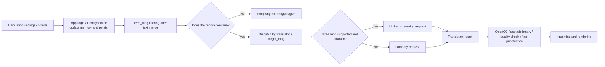

# Translation settings

## Feature boundary {#feature-boundary}

This page covers only the 11 rows on the “Translation” settings tab: translator, target/kept languages, streaming, terminology extraction, RPM, context, and the visible post-processing switches. It explains how those values enter the desktop configuration and the core translation stage.

It does not replace implementation selection in [Translator selection and languages](../translator/selection-and-languages.md), prompt content in [Context and prompts](../translator/context-and-prompts.md), or API keys, models, candidate slots, and rotation in API Management. `translator_chain`, `skip_lang`, the high-quality prompt path, and post-translation quality checks are fields accepted by core/API or CLI configuration but are not rows in the current settings layout; this page therefore does not represent them as UI controls.

## UI operations {#ui-operations}

Open “Settings” and select “Translation”. A combo box selects its stored value. When a switch or numeric editor changes, `AppLogic.update_single_config()` immediately updates the in-memory configuration and writes its configuration file. Changing “Translator” also updates the desktop translation service’s current implementation; changing “Target Language” updates its current target language. The remaining rows take effect when a later task reads the complete configuration.

1. Select “Translator” and “Target Language”. To continue processing only regions recognized as one source language, select “Keep Source Language”; otherwise select “No Filter”.
2. For a supported OpenAI/Gemini implementation, choose whether to “Enable Streaming”; use “Max Requests Per Minute” to cap request rate, where `0` means no limit.
3. Enable “Auto Extract Glossary” only when a matching high-quality prompt resource is available. “Don't Skip Target Lang” forces translation of text that appears already to be the target language.
4. Enable final-punctuation removal or one-way Chinese conversion as required. “Context Size” appears on the same tab but is stored in `cli.context_size`.

### UI invocation and actual labels {#ui-i18n}

| UI invocation key | English actual value | Simplified Chinese actual value |
| --- | --- | --- |
| `label_translator` | Translator | 翻译器 |
| `label_target_lang` | Target Language | 目标语言 |
| `label_keep_lang` | Keep Source Language | 保留源语言 |
| `label_enable_streaming` | Enable Streaming | 启用流式传输 |
| `label_no_text_lang_skip` | Don't Skip Target Lang | 不跳过目标语言文本 |
| `label_extract_glossary` | Auto Extract Glossary | 自动提取新术语 |
| `label_remove_trailing_period` | Auto Remove Final Period/Comma | 自动移除末尾句号逗号 |
| `label_convert_to_traditional` | Convert to Traditional Chinese | 简体转繁体 |
| `label_convert_to_simplified` | Convert to Simplified Chinese | 繁体转简体 |
| `label_context_size` | Context Size | 上下文大小 |
| `label_max_requests_per_minute` | Max Requests Per Minute | 每分钟最大请求数 |
| `lang_filter_disabled` | No Filter | 不过滤 |

### Enumerations and complete options {#option-matrix}

| Stored value | English | Simplified Chinese | Used by |
| --- | --- | --- | --- |
| `openai` | OpenAI | OpenAI | `translator.translator` |
| `openai_hq` | OpenAI High Quality | OpenAI高质量翻译 | `translator.translator` |
| `gemini` | Google Gemini | Google Gemini | `translator.translator` |
| `gemini_hq` | Gemini High Quality | Gemini高质量翻译 | `translator.translator` |
| `sakura` | Sakura | Sakura | `translator.translator` |
| `none` | None | 无 | `translator.translator` |
| `original` | Original | 原文 | `translator.translator` |
| `CHS`, `CHT`, `CSY`, `NLD`, `ENG`, `FRA`, `DEU`, `HUN`, `ITA`, `JPN`, `KOR`, `POL`, `PTB`, `ROM`, `RUS`, `ESP`, `TRK`, `UKR`, `VIN`, `ARA`, `SRP`, `HRV`, `THA`, `IND`, `FIL` | Simplified Chinese; Traditional Chinese; Czech; Dutch; English; French; German; Hungarian; Italian; Japanese; Korean; Polish; Portuguese (Brazil); Romanian; Russian; Spanish; Turkish; Ukrainian; Vietnamese; Arabic; Serbian; Croatian; Thai; Indonesian; Filipino (Tagalog) | 简体中文；繁体中文；捷克语；荷兰语；英语；法语；德语；匈牙利语；意大利语；日语；韩语；波兰语；葡萄牙语（巴西）；罗马尼亚语；俄语；西班牙语；土耳其语；乌克兰语；越南语；阿拉伯语；塞尔维亚语；克罗地亚语；泰语；印度尼西亚语；菲律宾语（他加禄语） | `translator.target_lang` |
| `none` and language codes supplied by `KEEP_LANGUAGES` | No Filter; corresponding language name | 不过滤；对应语言名 | `translator.keep_lang` |
| `true`, `false` | enabled, disabled | 启用，关闭 | every Boolean switch on this tab |
| non-negative integer; `0` | request count; no limit | 请求数；不限制 | `translator.max_requests_per_minute` |
| non-negative integer; `0` | page count; no history | 页数；不使用历史 | `cli.context_size` |

## Parameters {#parameters}

#### `translator.translator` — Translator / 翻译器 {#translator-translator}

- Control and values: combo box; see the complete enumerations above.
- Defaults: core `openai_hq`; Qt UI `openai_hq`; release example `openai`.
- Effective stage and final consumers: translation; `TranslatorConfig.translator_gen` or desktop `TranslationService` constructs a `TranslatorChain`, and the dispatcher runs the selected implementation.
- Dependencies and conflicts: online implementations require their API group; `none`/`original` do not perform ordinary online translation. This selects an implementation, not API-slot rotation or `translator_chain`.
- Diagram: required; the selection enters a different implementation.

#### `translator.target_lang` — Target Language / 目标语言 {#translator-target-lang}

- Control and values: combo box; see all 25 codes and display values above.
- Defaults: core `ENG`; Qt UI `CHS`; release example `CHS`.
- Effective stage and final consumers: translation; desktop code immediately calls `set_target_language`; core creates the translator chain with this code and passes it to prompts and requests.
- Dependencies and conflicts: the code must be supported by the service. When combined with Chinese conversion, conversion happens after the translation result.
- Diagram: required; it changes the requested target language and downstream output.

#### `translator.keep_lang` — Keep Source Language / 保留源语言 {#translator-keep-lang}

- Control and values: combo box; `none`/“No Filter” plus language codes from `KEEP_LANGUAGES`.
- Defaults: core, Qt UI, and release example are all `none`.
- Effective stage and final consumer: after text-line merge; `_run_textline_merge()` filters merged regions by language. A non-matching region is not inpainted, translated, or rendered.
- Dependencies and conflicts: it relies on language detection. Do not confuse it with invisible `skip_lang`, which removes OCR text lines before merge.
- Diagram: required; it changes which regions reach later stages.

#### `translator.enable_streaming` — Enable Streaming / 启用流式传输 {#translator-enable-streaming}

- Control and values: switch; `true` or `false`.
- Defaults: core and Qt UI `true`; release example `false`.
- Effective stage and final consumer: online translation request; common translator `parse_args()` sets `_enable_streaming`, and supported OpenAI/Gemini implementations, including HQ modes, select unified streaming or ordinary request transport.
- Dependencies and conflicts: only implementations supporting the transport have an observable difference. It is not the developer HTTP API streaming-frame protocol.
- Diagram: required; it changes the request transport branch.

#### `translator.no_text_lang_skip` — Don't Skip Target Lang / 不跳过目标语言文本 {#translator-no-text-lang-skip}

- Control and values: switch; `true` forces translation, while `false` can retain text equal to the target-language result.
- Defaults: core, Qt UI, and release example are all `false`.
- Effective stage and final consumer: translation; `_should_skip_identical_translation()` compares source text and plain translation text.
- Dependencies and conflicts: enabling it can increase requests and cost. It is not the region filter `keep_lang`.
- Diagram: not required: it only reverses one identical-text skip decision.

#### `translator.extract_glossary` — Auto Extract Glossary / 自动提取新术语 {#translator-extract-glossary}

- Control and values: switch; `true` or `false`.
- Defaults: core, Qt UI, and release example are all `false`.
- Effective stage and final consumers: high-quality OpenAI/Gemini request and response parsing; only when a custom high-quality prompt has loaded does it request and parse `new_terms`.
- Dependencies and conflicts: requires the high-quality prompt resource. This switch neither edits prompts nor exposes their content; prompt file format belongs to prompt pages.
- Diagram: required; a missing resource prevents the glossary branch.

#### `translator.max_requests_per_minute` — Max Requests Per Minute / 每分钟最大请求数 {#translator-max-requests-per-minute}

- Control and values: non-negative integer; `0` means no limit.
- Defaults: core, Qt UI, and release example are all `0`.
- Effective stage and final consumers: online translation; OpenAI/Gemini translators set their request-per-minute cap in `parse_args()`.
- Dependencies and conflicts: it proactively reduces rate-limit likelihood; it does not handle a server 429, retry count, or API-candidate switching.
- Diagram: required; `0` and a positive value use different throttling behavior.

#### `translator.remove_trailing_period` — Auto Remove Final Period/Comma / 自动移除末尾句号逗号 {#translator-remove-trailing-period}

- Control and values: switch; `true` or `false`.
- Defaults: core and Qt UI `false`; release example `true`.
- Effective stage and final consumer: post-translation processing; only where source text has no terminal punctuation, `remove_trailing_period_if_needed()` removes one removable final period/comma from the translation, preserving whitespace and closers without removing repeated punctuation.
- Dependencies and conflicts: it runs after terminology/dictionary handling and optional quality checking; it is unrelated to rendering line breaks.
- Diagram: not required: it is a single tail-character condition.

#### `cli.context_size` — Context Size / 上下文大小 {#cli-context-size}

- Control and values: non-negative integer; `0` means no history.
- Defaults: core, Qt UI, and release example are all `3`.
- Effective stage and final consumers: translation; `_build_prev_context()` takes up to this many recent non-empty translated pages before the current page, builds user/assistant history turns, and OpenAI/Gemini injects them as separate history messages.
- Dependencies and conflicts: it increases request context and cost; empty pages do not count. It is not `batch_size` and does not guarantee a concurrently processed page will be available as history.
- Diagram: required; it changes history-page selection and message construction.

#### `translator.convert_to_traditional` / `translator.convert_to_simplified` — Convert to Traditional Chinese / Convert to Simplified Chinese {#translator-chinese-conversion}

- Control and values: two switches; `true` or `false`.
- Defaults: core, Qt UI, and release example are all `false`.
- Effective stage and final consumer: post-translation processing; when either is true, `_apply_post_translation_processing()` uses OpenCC. When both are true, core gives `convert_to_traditional` and its `s2twp` conversion precedence; otherwise it runs `t2s`.
- Dependencies and conflicts: requires `opencc-python-reimplemented`; if unavailable, the system logs a warning and skips conversion. Select the target language first, then apply conversion; it is not a target-language selector.
- Diagram: required; the two switches have a priority order.

## Runtime behavior {#runtime-behavior}

Before the request, `context_size` additionally builds separate messages from recent non-empty history pages. `extract_glossary` requests extra terminology only when a custom high-quality prompt exists. The fixed core post-processing path also has bracket/quote handling, a post dictionary, optional quality checks, and this page’s final-punctuation handling; the quality-check fields are not in this UI layout.

## Related files and formats {#related-files-and-formats}

- `config/config.json`: persists this page’s settings. See the settings-shell page for import overwrite and unknown-key rules. Do not publish a real user configuration or absolute path.
- `config/config-example.json`: the release example, providing default evidence separate from core/UI defaults.
- `dict/prompt_example.yaml`: the release example’s high-quality prompt resource path; terminology/prompt structure belongs to prompt pages. This page does not show prompt content.
- No parameter here directly defines an API key, model, Base URL, or API slot; those belong to API Management.

## Source evidence {#source-evidence}

| Layer | File | Checked content |
| --- | --- | --- |
| Settings layout | `desktop_qt_ui/ui/main_page/settings_tab_layout.json` | 11 actual Translation-tab rows |
| UI mapping and saving | `desktop_qt_ui/app_logic.py` | i18n labels, immediate translator/target-language updates, saving |
| Qt defaults | `desktop_qt_ui/core/config_models.py` | `TranslatorSettings` and `CliSettings.context_size` |
| i18n | `desktop_qt_ui/locales/en_US.json`, `zh_CN.json` | this page’s keys and actual bilingual values |
| Core definitions | `manga_translator/config.py` | `TranslatorConfig`, `Translator`, `CliConfig` defaults, and chain boundary |
| Dispatch and processing | `manga_translator/manga_translator.py`, `manga_translator/translators/common.py` | filtering, context, streaming flag, and post-processing |
| Release defaults | `config/config-example.json` | release example configuration |

## Verification {#verification}

| Verification item | Status | Details |
| --- | --- | --- |
| Layout, configuration, consumers, and i18n | Complete | Static source and actual `en_US`/`zh_CN` values checked item by item |
| Runtime: streaming, API rate limiting, terminology, and context | Pending | Requires sanitized test credentials and controlled requests; no keys, prompts, or user data are shown |
| VitePress build | Complete | Passed `npm run docs:build --prefix doc/wiki` after this page change |
| Sensitive-information review | Complete | No real keys, user configuration, private paths, images, or prompts recorded |
