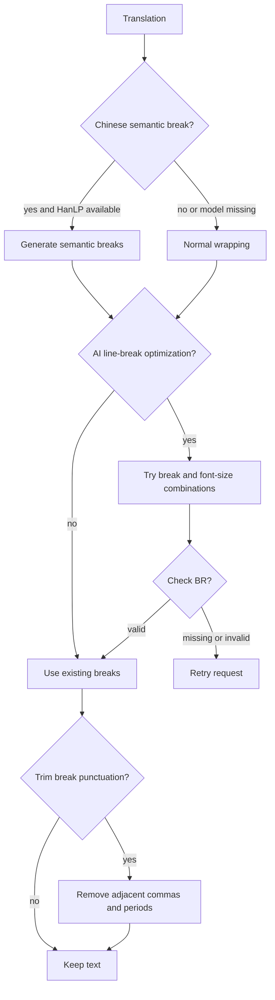
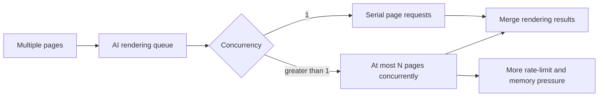
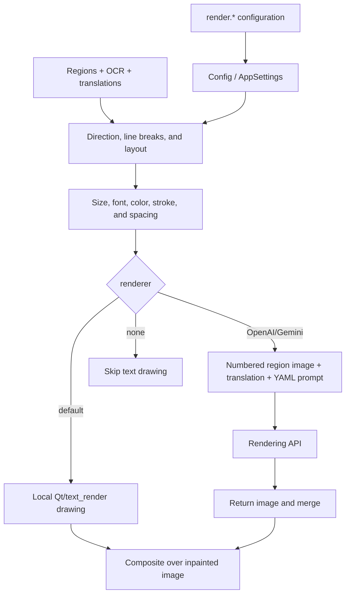

# Typesetting and Rendering

This page covers the `render.*` parameters in the “Typesetting” settings tab and the direct-paste parameters in “Mode Specific”. They control line breaking, font size, direction, color, stroke, spacing, and final text drawing. Detection, OCR, translation content, and inpainting belong to their respective settings pages. This page does not document API credentials; it explains how AI rendering consumes an already configured rendering API.

## Configure it in the UI

Open “Settings” → “Typesetting”. Each dynamic row shows a field label on the left and a selector, checkbox, numeric/text input, or an “Edit” file action on the right; the description panel shows the current field’s explanation. Changes update the in-memory configuration immediately, and a `render.*` change emits the render-settings-changed signal so the editor can refresh; the config service then writes the configuration file. Selecting `openai_renderer` or `gemini_renderer` requires the corresponding API candidates in API management before translation can start.

The “Font” dropdown lists operating-system fonts and `.ttf`, `.otf`, and `.ttc` files in the project `fonts/` directory. Add a font file there and reopen the dropdown to refresh it. The AI renderer prompt is a file-edit action: “Edit” opens the fixed YAML file directly; do not treat its path as an ordinary renderer enum.

## UI call keys and actual labels

The table preserves the UI call key and uses the actual locale values. Some renderer and font-list labels are hard-coded mappings in `app_logic.py`, so they are marked as code mappings without a locale key.

| UI call key | English actual value | Simplified Chinese actual value |
| --- | --- | --- |
| `label_renderer` | Renderer | 渲染器 |
| `label_font_family` | Font | 字体 |
| `label_ai_renderer_prompt_path` | AI Renderer Prompt | AI 渲染提示词 |
| `label_ai_renderer_concurrency` | AI Renderer Concurrency | AI 渲染并发数 |
| `label_alignment` | Alignment | 对齐方式 |
| `label_direction` | Text Direction | 文本方向 |
| `label_layout_mode` | Layout Mode | 排版模式 |
| `label_semantic_linebreak` | Chinese Semantic Line Break | 中文语义断句 |
| `label_disable_auto_wrap` | AI Line Breaking | AI 断句 |
| `label_optimize_line_breaks` | AI Line Break Auto Enlarge | AI断句自动扩大文字 |
| `label_check_br_and_retry` | AI Line Break Check | AI 断句检查 |
| `label_strict_smart_scaling` | Don't Expand Box on Auto Enlarge | 自动扩大文字时不扩展文本框 |
| `label_remove_linebreak_punctuation` | Trim Around Line Breaks | 去除换行符周围逗号句号 |
| `label_disable_font_border` | Disable Font Border | 禁用字体边框 |
| `label_stroke_width` | Stroke Width Ratio | 描边宽度比例 |
| `label_center_text_in_bubble` | Center in Bubble | 气泡内居中 |
| `label_font_size_offset` | Font Size Offset | 字体大小偏移量 |
| `label_font_size_minimum` | Minimum Font Size | 最小字体大小 |
| `label_max_font_size` | Maximum Font Size | 最大字体大小 |
| `label_font_scale_ratio` | Font Scale Ratio | 字体缩放比例 |
| `label_font_color` | Font Color | 字体颜色 |
| `label_line_spacing` | Line Spacing | 行间距 |
| `label_letter_spacing` | Letter Spacing | 字间距 |
| `label_font_size` | Font Size | 字体大小 |
| `label_uppercase` | Uppercase | 大写 |
| `label_lowercase` | Lowercase | 小写 |
| `label_no_hyphenation` | Disable Hyphenation | 禁用连字符 |
| `label_bubble_layout_english` | Bubble Layout (Force Horizontal) | 根据气泡排版(强制横排) |
| `label_rtl` | Right to Left | 从右到左 |
| `label_enable_template_alignment` | Enable Direct Paste Mode | 启用直接粘贴模式 |
| `label_paste_mask_dilation_pixels` | Paste Mode Mask Dilation Pixels | 粘贴模式蒙版膨胀像素 |
| `alignment_auto` (code mapping) | Auto | 自动 |
| `alignment_left` (code mapping) | Left | 左对齐 |
| `alignment_center` (code mapping) | Center | 居中 |
| `alignment_right` (code mapping) | Right | 右对齐 |
| `direction_auto` (code mapping) | Auto | 自动 |
| `direction_horizontal` (code mapping) | Horizontal | 横排 |
| `direction_vertical` (code mapping) | Vertical | 竖排 |
| renderer mapping (hard-coded) | Default / OpenAI Renderer / Gemini Renderer / None | Default / OpenAI Renderer / Gemini Renderer / 不翻译 |

## Option matrix

| Configuration key | Stored value | English | Simplified Chinese | Control and condition |
| --- | --- | --- | --- | --- |
| `render.renderer` | `default` | Default | Default | Local Qt renderer |
|  | `openai_renderer` | OpenAI Renderer | OpenAI Renderer | Requires OpenAI rendering API |
|  | `gemini_renderer` | Gemini Renderer | Gemini Renderer | Requires Gemini rendering API |
|  | `none` | None | 不翻译 | Skip text rendering |
| `render.alignment` | `auto` / `left` / `center` / `right` | Auto / Left / Center / Right | 自动 / 左对齐 / 居中 / 右对齐 | Selector; horizontal alignment |
| `render.direction` | `auto` / `h` / `v` | Auto / Horizontal / Vertical | 自动 / 横排 / 竖排 | Selector; overrides direction detection |
| `render.layout_mode` | `smart_scaling` / `strict` / `balloon_fill` | Smart Scaling / Strict Boundary / Smart Bubble | 智能缩放 / 严格边界 / 智能气泡 | Selector; text-box fitting algorithm |
| Boolean parameters | `true` / `false` | Enabled / Disabled | 开启 / 关闭 | See each parameter anchor; no implicit third value |
| `render.font_color` | empty, `RRGGBB`, or `RRGGBB:RRGGBB` | Auto / explicit foreground (and optional background) | 自动 / 指定前景色（可选背景色） | Text input; never put secrets here |
| `render.line_spacing`, `letter_spacing` | `0.1`–`5.0` | multiplier | 倍率 | Numeric input; default 1.0 |
| `render.font_size` | empty or positive integer | Auto / fixed size | 自动 / 固定大小 | Empty enables automatic sizing |
| `render.font_size_offset` | integer | signed offset | 有符号偏移 | Automatic-size adjustment |
| `render.font_size_minimum`, `max_font_size` | `0` or positive integer | limit (`0` means implementation-specific default/no upper limit) | 限制（`0` 为实现默认/无上限） | Works with automatic sizing |
| `render.font_scale_ratio` | positive float | scale ratio | 缩放倍率 | Overall ratio before layout |
| `render.stroke_width` | `0.0`–`1.0` | stroke ratio | 描边比例 | 0 disables stroke; usual default 0.07 |
| `render.ai_renderer_concurrency` | positive integer | maximum concurrent requests | 最大并发请求数 | OpenAI/Gemini/Vertex rendering only |
| `render.ai_renderer_prompt_path` | file path | fixed YAML prompt file | 固定 YAML 提示词文件 | Edit file action; read by AI rendering |

## Parameter reference

Each parameter has its own anchor below. Defaults are separated into core `manga_translator/config.py`, Qt `RenderSettings`, and release example `config/config-example.json`. The release example is not a user configuration and does not represent a saved private configuration.

#### `render.renderer` — 渲染器 / Renderer

- Control: selector; consumer: the typesetting stage in `manga_translator.manga_translator` or an AI renderer provider.
- Defaults: core `default`; Qt `default`; release example `default`.
- Stage: typesetting/rendering; `none` skips rendering.
- Dependencies/conflicts: API renderers require matching API candidates; local `default` needs no network. This is not translator selection and does not rotate API slots.
- Mechanism: selects the implementation receiving text regions and translations, either local drawing or a model image request; direct paste has a separate workflow restriction.
- Source: `manga_translator/config.py` `Renderer`; `manga_translator/manga_translator.py`; renderer mapping and saving in `desktop_qt_ui/app_logic.py`.

#### `render.font_family` — 字体 / Font

- Control: font selector; stored value: font family name or an empty string.
- Defaults: core `None`; Qt empty string; release example `Microsoft YaHei UI` (release configuration may vary by platform).
- Stage: typesetting/rendering and editable PSD text layers; consumers: Qt text renderer and PSD export.
- Dependencies/conflicts: the font must be available from the OS or `fonts/`; missing glyphs can trigger fallback and visual differences. Font files may have license restrictions.
- Related format: `fonts/*.ttf|*.otf|*.ttc`; document public font names, not user paths.
- Source: font listing in `desktop_qt_ui/app_logic.py`; `manga_translator/config.py`; locale descriptions.

#### `render.alignment` — 对齐方式 / Alignment

- Stored values/all options: `auto|left|center|right` → Auto/Left/Center/Right → 自动/左对齐/居中/右对齐.
- Defaults: core/Qt/release all `auto`; stage: typesetting; consumer: text layout in `manga_translator.rendering`.
- Mechanism: `auto` infers alignment from region and direction; other values constrain horizontal alignment without changing translation content.
- Dependencies/conflicts: vertical layout is primarily controlled by direction and column layout; alignment is not a direction switch.
- Source: `config.py` `Alignment`; `app_logic.py:get_display_mapping`; both locale files.

#### `render.direction` — 文本方向 / Text Direction

- Stored values/all options: `auto|h|v` → Auto/Horizontal/Vertical → 自动/横排/竖排.
- Defaults: core/Qt/release all `auto`; stage: typesetting, line breaking, text drawing, and region ordering; consumer: renderer/text_render.
- Mechanism: auto uses region/language detection; `h` and `v` force horizontal/vertical layout. Direction changes the wrapping axis, spacing interpretation, and alignment.
- Dependencies/conflicts: `bubble_layout_english=true` forces horizontal layout; RTL is reading order, not vertical layout.
- Source: `config.py` `Direction`; `rendering/__init__.py`; actual i18n values.

#### `render.layout_mode` — 排版模式 / Layout Mode

- Stored values/all options: `smart_scaling|strict|balloon_fill` → Smart Scaling/Strict Boundary/Smart Bubble → 智能缩放/严格边界/智能气泡.
- Defaults: core/Qt `smart_scaling`; release example `balloon_fill`. The core validator rejects other values.
- Stage: typesetting size and wrapping; consumer: text layout algorithm.
- Mechanism: `smart_scaling` balances readability and area fitting; `strict` stays within the region; `balloon_fill` fills the bubble shape.
- Dependencies/conflicts: fixed `font_size`, `max_font_size`, and `strict_smart_scaling` further constrain size; inpainting is unaffected.
- Source: `config.py` `VALID_LAYOUT_MODES` and validator; `config_models.py`; release example.

#### `render.font_color` — 字体颜色 / Font Color

- Stored values/all options: empty (automatic), `RRGGBB` (foreground), or `RRGGBB:RRGGBB` (foreground:background). The locale example includes `#`, while core parsing strips `#`.
- Defaults: core/Qt/release empty or `null`; stage: typesetting; consumer: color parsing and drawing.
- Mechanism: empty uses OCR/region color detection; explicit values override detection, and the value after `:` supplies the background.
- Dependencies/conflicts: invalid hex values can fail configuration or drawing; never put an API key or private text in this field.
- Source: `config.py` `font_color_fg/font_color_bg`; `config_models.py`; locale descriptions.

#### `render.stroke_width` / `render.disable_font_border` — 描边 / Stroke

- Stored values: stroke ratio `0.0–1.0`; switch `true|false`. Defaults are core/Qt/release `0.07/0.07/0.07` and `false/false/false`.
- Stage: text drawing; consumer: text renderer. The ratio is relative to font size; 0 or the disable switch removes the border.
- Dependencies/conflicts: excessive stroke intrudes on neighboring glyphs; the disable switch takes precedence over the ratio. Diagram: not needed; the values change only the drawn outline.
- Source: `config.py` field descriptions; `config_models.py`; `desc_render_stroke_width` and `desc_render_disable_font_border`.

#### `render.font_size`, `font_size_offset`, `font_size_minimum`, `max_font_size`, `font_scale_ratio` — 字号 / Font Size

- Stored values/all options: fixed size empty or positive integer; offset integer; lower/upper limits `0` or positive integers; ratio positive float.
- Defaults: core `font_size=null`, offset `0`, minimum `-1` (derived from image size), max `0` (unlimited), ratio `1.0`; Qt `null/0/0/0/1.0`; release example `null/0/0/0/1.0`.
- Stage: automatic measurement and layout; consumer: `text_render` measurement, wrapping, and drawing.
- Mechanism: fixed size bypasses automatic sizing; otherwise the renderer computes a fitting size, applies offset and scale ratio, then applies minimum/max limits. `max_font_size=0` means no upper limit; Qt minimum `0` differs from core `-1`.
- Dependencies/conflicts: AI auto-enlarge, strict mode, and disabled automatic wrapping change the search space; extreme values can overflow or crop.
- Source: `config.py:RenderConfig`; `config_models.py:RenderSettings`; `rendering/__init__.py`.

#### `render.line_spacing` / `render.letter_spacing` — 行距与字距 / Spacing

- Stored values/all options: nullable or `0.1–5.0` float multipliers; core/Qt/release default `1.0` (a core null falls back to renderer default).
- Stage: measurement and drawing; consumers: `calc_text_block_dimensions` and horizontal/vertical text rendering.
- Mechanism: line spacing changes baseline distance between lines/columns; letter spacing changes glyph advance. Horizontal and vertical modes use different base spacing. Empty falls back to the renderer default.
- Dependencies/conflicts: fixed size, direction, and line breaking jointly determine occupied geometry; extreme multipliers can exceed the region. Diagram: not needed; continuous multipliers change geometry only.
- Source: field comments in `config.py`; `manga_translator/rendering/__init__.py`; `rendering/text_render.py`.

#### `render.semantic_linebreak`, `disable_auto_wrap`, `optimize_line_breaks`, `strict_smart_scaling`, `check_br_and_retry`, `remove_linebreak_punctuation`, `no_hyphenation` — 断句 / Line Breaking

- Stored values/all options: each `true|false`; core defaults in order `false/false/false/false/false/false/false`, Qt defaults `false/true/false/false/false/false/false`, and release example matches core.
- Stage: after translation cleanup, during wrapping, and for AI requests; consumers: `rendering/chinese_linebreak.py`, renderer, and translator retry logic.
- Mechanism: `semantic_linebreak` uses local HanLP to insert semantic breaks for Chinese, falling back to normal wrapping when models are missing or text is not Chinese; `disable_auto_wrap` disables renderer wrapping (recommended with AI breaking); `optimize_line_breaks` searches break combinations and adjusts font size; `strict_smart_scaling` forbids box expansion and only shrinks text; `check_br_and_retry` checks AI `[BR]` output and retries when absent; `remove_linebreak_punctuation` trims commas/periods around breaks; `no_hyphenation` prevents splitting English words with hyphens.
- Dependencies/conflicts: AI optimization needs an OpenAI/Gemini translator; retry checking can loop and must be used cautiously; semantic breaking needs local HanLP models. `[BR]` is a text protocol marker, not a prompt secret.
- Diagram: this changes processing stages, shown below.
- Source: `config.py` docstrings; `rendering/chinese_linebreak.py`; both locale files.

#### `render.uppercase` / `render.lowercase` — 大小写 / Case

- Stored values/all options: `true|false`; core/Qt/release all disabled.
- Stage: text normalization before drawing; consumer: renderer. Enabling both is a conflicting configuration; final behavior follows implementation order, so do not enable both.
- Dependency: only languages with case distinctions change; Chinese is unaffected. Diagram: not needed; it is a text-only transformation.
- Source: `config.py`, `config_models.py`, and locale descriptions.

#### `render.bubble_layout_english` / `render.center_text_in_bubble` — 气泡布局 / Bubble Layout

- Stored values/all options: each `true|false`; core/Qt/release all disabled.
- Stage: bubble layout; consumers: bubble layout and renderer.
- Mechanism: `bubble_layout_english` applies bubble-shape layout to every language and forces horizontal rendering; `center_text_in_bubble` centers the text block inside the bubble. Release behavior for English can be overridden by release configuration.
- Dependencies/conflicts: if it conflicts with `direction=v`, the force-horizontal switch wins; valid bubble regions/masks are required.
- Source: `config.py` docstrings; locale descriptions; config model.

#### `render.rtl` — 从右到左 / Right to Left

- Stored values/all options: `true|false`; core/Qt/release all `true`.
- Stage: region ordering and reading order; consumer: renderer RTL sorting.
- Mechanism: controls right-to-left order for Arabic, Hebrew, and similar text; it is not `direction=v` and does not rotate glyphs.
- Dependencies/conflicts: choose it according to language and reading order; horizontal/vertical layout remains controlled by direction. Diagram: not needed; it changes ordering, not stages.
- Source: `config.py`, `config_models.py`, and `desc_render_rtl`.

#### `render.ai_renderer_prompt_path` — AI 渲染提示词 / AI Renderer Prompt

- Control: file-edit action; stored value: YAML file path; defaults: resolved by the application for core/Qt/release (no private absolute path is documented).
- Stage: AI rendering request construction; consumer: `rendering/model_api_renderer.py` and OpenAI/Gemini providers.
- Mechanism: reads a fixed YAML file and combines it with numbered region images and translations; it is not the general translation prompt or an API key.
- Dependencies/conflicts: used only by AI renderers; missing or invalid YAML fails the request. The file must not contain real keys, tokens, usernames, user images, or private prompts.
- Related format: `dict/ai_renderer_prompt.yaml`.
- Source: file-action binding in `desktop_qt_ui/app_logic.py`; locale descriptions; `model_api_renderer.py`.

#### `render.ai_renderer_concurrency` — AI 渲染并发数 / AI Renderer Concurrency

- Stored values/all options: positive integer (implementation clamps values below 1 to 1); core/Qt/release all `1`.
- Stage: batch AI rendering request queue; consumer: `model_api_renderer.py`.
- Mechanism: limits simultaneous page requests, not the number of regions in one page and not renderer selection. 1 is serial; larger values improve throughput but increase network, API rate-limit, memory, and GPU pressure.
- Dependencies/conflicts: only OpenAI/Gemini/Vertex renderers use it; no API renderer produces no requests. A special workflow may still impose its own concurrency limit.
- Diagram: concurrency changes queue state, shown below.
- Source: `config.py`; `desktop_qt_ui/core/config_models.py`; `rendering/model_api_renderer.py`; locale description.

#### `render.enable_template_alignment` / `paste_mask_dilation_pixels` — 直接粘贴 / Direct Paste

- Stored values/all options: switch `true|false`; dilation is a non-negative integer. Defaults core/Qt/release: `false` and `10`.
- Stage: typesetting/export only in Replace Translation; consumer: template-matching paste implementation.
- Mechanism: crops regions from the translated image by coordinate matching and pastes them onto the raw image, preserving the original font style. Dilation expands the mask before pasting; `0` disables it (core converts pixels to 3×3 iterations using integer division by 3).
- Dependencies/conflicts: other workflows ignore direct paste; excessive dilation can cover nearby content. It does not replace the ordinary renderer or change API credentials.
- Related format: Replace Translation images and region coordinates in translation JSON; see the corresponding workflow page for format details.
- Source: `config.py`; `settings_tab_layout.json`; locale description; workflow dispatcher.

## Runtime mechanism: configuration to final image

The normal path starts with detected regions, OCR text, translated text, and an inpainted image. Direction and language select the layout axis; line-breaking rules produce line boundaries; font size and layout mode measure text within the region; font, color, spacing, and stroke enter the text renderer; finally the drawing layer is composited onto the output. An AI renderer combines numbered region images and translations with the fixed YAML request, receives a rendered image, and merges it by page/region. `renderer=none` does not draw translations.

Configuration updates are written through `ConfigService`; the runtime core configuration is then passed to the processing pipeline. User configuration, Qt defaults, release examples, and core fallbacks are separate sources; explicit CLI parameters can override runtime values. API renderers additionally pass through API-management feature/provider selection and candidate resolution; candidate rotation does not change `render.renderer`.

## Dependencies, conflicts, and resources

- `openai_renderer` / `gemini_renderer` require matching API configuration, network access, and a valid model; higher concurrency is more likely to trigger rate limits.
- `semantic_linebreak` requires local HanLP models and should fall back to normal wrapping when absent.
- `optimize_line_breaks` and `check_br_and_retry` require a supported OpenAI/Gemini translator; retry checks need bounded conditions to prevent loops.
- System/project fonts, glyph coverage, licenses, and fallback affect final pixels; the release font name is only an example.
- Fixed size, strict boundaries, min/max size, disabled wrapping, and forced horizontal layout can constrain one another, causing shrinking, overflow, or cropping.
- Higher AI concurrency, large fonts, and complex regions increase CPU, memory, GPU, or network usage. Do not share intermediate requests or user images when cancelling or reporting a task.

## Related files and formats

| File/directory | Use on this page | Manual-edit and compatibility note |
| --- | --- | --- |
| `config/config.json` | Persists the `render` object | Edit only public fields; do not copy unknown keys or private paths |
| `config/config-example.json` | Release-default example | Keep separate from core/Qt defaults; it contains no user credentials |
| `dict/ai_renderer_prompt.yaml` | Fixed OpenAI/Gemini renderer prompt | Preserve YAML structure; never add real secrets or private prompts |
| `fonts/*.ttf`, `*.otf`, `*.ttc` | Project font resources | Check licensing and filenames; missing glyphs fall back |
| `*_translations.json` | Region direction, alignment, text, and style data | Document only fields actually serialized; never include user images or paths in samples |
| Replace Translation images/region coordinates | Direct-paste input | Consumed only by that mode; dilation affects coverage |

## Source evidence

| Layer | File | Verified content |
| --- | --- | --- |
| Core configuration | `manga_translator/config.py` | Renderer, Alignment, Direction, RenderConfig, defaults, ranges, and validator |
| Qt configuration | `desktop_qt_ui/core/config_models.py` | `RenderSettings` defaults, validation, and persistence model |
| UI layout | `desktop_qt_ui/ui/main_page/settings_tab_layout.json` | Typesetting row order and Mode Specific direct-paste fields |
| UI/i18n | `desktop_qt_ui/app_logic.py`, `desktop_qt_ui/locales/en_US.json`, `zh_CN.json` | Bindings, display mappings, and actual bilingual labels/descriptions |
| Rendering dispatch | `manga_translator/manga_translator.py`, `manga_translator/rendering/__init__.py` | Renderer selection, measurement, direction, spacing, and layout consumption |
| Line breaking | `manga_translator/rendering/chinese_linebreak.py` | HanLP semantic breaking and fallback |
| AI renderer | `manga_translator/rendering/model_api_renderer.py` | Prompt loading, request construction, and concurrency |
| Configuration writes | `desktop_qt_ui/app_logic.py`, `desktop_qt_ui/services/config_service.py` | In-memory updates, render refresh signal, and disk writes |

## Verification record

| Check | Status | Notes |
| --- | --- | --- |
| Blueprint, page guidelines, and TODO boundary | Complete | Read before editing; only this page pair and its TODO row are changed |
| UI layout and i18n | Complete | Checked 26 Typesetting items, 2 Mode Specific items, and actual en/zh values |
| Core/Qt/release defaults | Complete | Checked `config.py`, `config_models.py`, and `config-example.json`; differences are stated per parameter |
| Runtime mechanism and source evidence | Complete | Checked renderer, text rendering, HanLP breaking, and AI-renderer concurrency call paths |
| Sensitive-information review | Complete | No real keys, tokens, usernames, private absolute paths, user images, or private prompts included |
| Static validation | Pending | Run route/source/coverage Wiki checks |
| VitePress build | Pending | Run `npm run docs:build --prefix doc/wiki` |
