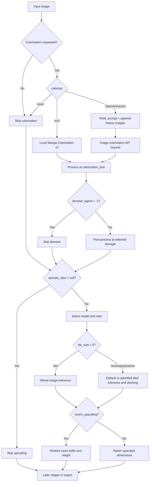

# Upscale and Colorization

## Feature boundary

This page covers the Upscaling and Colorization groups in the Mode Specific tab: image super-resolution, output-size restoration, local colorization, the AI colorizer prompt, and previous-page image context. It does not replace the nine-workflow matrix in [Mode Specific](./mode-specific.md), nor does it document translation, detection, OCR, inpainting, or typesetting parameters. Upscaling changes pixel dimensions; colorization changes color information; neither automatically enables detection, OCR, translation, or typesetting.

## UI operations

Open “Settings” and select “Upscaling” or “Colorization” under Mode Specific. The layout file determines row order; the dynamic settings page creates a combo box, toggle, or numeric input from the field type. After an edit, the in-memory configuration updates immediately and the config service schedules a merged write to `config/config.json`; numeric inputs submit on focus loss, and invalid input is not written as a valid configuration value.

### Upscaling

1. Choose a model in “Upscaling Model” (`label_upscaler`): `Waifu2x`, `ESRGAN`, `4x UltraSharp`, `Real-CUGAN`, or `MangaJaNai`.
2. Choose “Not Use” or a value offered by the current model in “Upscale Ratio” (`label_upscale_ratio`). A Real-CUGAN selection also writes its internal model field.
3. Enter a tile edge length in “Tile Size (0=No Split)”; `0` disables tiling, while an empty value uses the runtime default of 400.
4. Enable “Revert Upscaling” when the final output must retain the original width and height. This does not skip upscaling; it restores the final size.

### Colorization

1. Choose “None”, `Manga Colorization v2`, `OpenAI Colorizer`, or `Gemini Colorizer` in “Colorization Model” (`label_colorizer`).
2. Selecting an AI colorizer exposes the corresponding color API credential group in API management. A valid configuration is required; otherwise the UI may block start or the request may fail.
3. Use the edit action for “AI Colorizer Prompt” (`label_ai_colorizer_prompt_path`) to modify the fixed YAML file. It is a resource editor, not an ordinary JSON configuration field.
4. Adjust “Colorization Size” and “Denoise Strength”. For AI colorization, “AI Colorizer History Pages” attaches images of earlier completed colorized pages; `0` disables it.

“Colorize Only” shows “Start Colorizing”, while “Upscale Only” shows “Start Upscaling”; both skip detection, OCR, translation, and rendering. The other nine workflows’ forced overrides and input/output ownership belong to the Mode Specific page.

| UI call key | English actual value | Simplified Chinese actual value |
| --- | --- | --- |
| `Upscaling` | Upscaling | 超分 |
| `Colorization` | Colorization | 上色 |
| `label_upscaler` | Upscaling Model | 超分模型 |
| `label_upscale_ratio` | Upscale Ratio | 超分倍数 |
| `label_realcugan_model` | Real-CUGAN Model | Real-CUGAN模型 |
| `label_tile_size` | Tile Size (0=No Split) | 分块大小(0=不分割) |
| `label_revert_upscaling` | Revert Upscaling | 还原超分 |
| `label_colorizer` | Colorization Model | 上色模型 |
| `label_colorization_size` | Colorization Size | 上色大小 |
| `label_denoise_sigma` | Denoise Strength | 降噪强度 |
| `label_ai_colorizer_prompt_path` | AI Colorizer Prompt | AI 上色提示词 |
| `label_ai_colorizer_history_pages` | AI Colorizer History Pages | AI 上色历史页数 |
| `upscale_ratio_not_use` | Not Use | 不使用 |
| `Colorize Only` | Colorize Only | 仅上色 |
| `Upscale Only` | Upscale Only | 仅超分 |
| `Start Colorizing` | Start Colorizing | 开始上色 |
| `Start Upscaling` | Start Upscaling | 开始超分 |

## Option matrix

### Upscaling models and ratios

| Stored value | English | Simplified Chinese |
| --- | --- | --- |
| `waifu2x` | Waifu2x | Waifu2x |
| `esrgan` | ESRGAN | ESRGAN |
| `4xultrasharp` | 4x UltraSharp | 4x UltraSharp |
| `realcugan` | Real-CUGAN | Real-CUGAN |
| `mangajanai` | MangaJaNai | MangaJaNai |
| `null` | Not Use | 不使用 |
| `2` / `3` / `4` | 2 / 3 / 4 | 2 / 3 / 4 |
| `x2` / `x4` / `DAT2 x4` | x2 / x4 / DAT2 x4 | x2 / x4 / DAT2 x4 |

Ordinary models store an integer ratio or `null`; MangaJaNai stores a string tier; Real-CUGAN’s selector displays the complete model values below and also writes the parsed ratio. These names are displayed as stored values in the current UI.

### Real-CUGAN model tiers

| Stored value | English | Simplified Chinese |
| --- | --- | --- |
| `2x-conservative` | 2x-conservative | 2x-conservative |
| `2x-conservative-pro` | 2x-conservative-pro | 2x-conservative-pro |
| `2x-no-denoise` | 2x-no-denoise | 2x-no-denoise |
| `2x-denoise1x` | 2x-denoise1x | 2x-denoise1x |
| `2x-denoise2x` | 2x-denoise2x | 2x-denoise2x |
| `2x-denoise3x` | 2x-denoise3x | 2x-denoise3x |
| `2x-denoise3x-pro` | 2x-denoise3x-pro | 2x-denoise3x-pro |
| `3x-conservative` | 3x-conservative | 3x-conservative |
| `3x-conservative-pro` | 3x-conservative-pro | 3x-conservative-pro |
| `3x-no-denoise` | 3x-no-denoise | 3x-no-denoise |
| `3x-no-denoise-pro` | 3x-no-denoise-pro | 3x-no-denoise-pro |
| `3x-denoise3x` | 3x-denoise3x | 3x-denoise3x |
| `3x-denoise3x-pro` | 3x-denoise3x-pro | 3x-denoise3x-pro |
| `4x-conservative` | 4x-conservative | 4x-conservative |
| `4x-no-denoise` | 4x-no-denoise | 4x-no-denoise |
| `4x-denoise3x` | 4x-denoise3x | 4x-denoise3x |

### Colorization models

| Stored value | English | Simplified Chinese |
| --- | --- | --- |
| `none` | None | 不使用 |
| `mc2` | Manga Colorization v2 | Manga Colorization v2 |
| `openai_colorizer` | OpenAI Colorizer | OpenAI Colorizer |
| `gemini_colorizer` | Gemini Colorizer | Gemini Colorizer |

`colorization_size`, `denoise_sigma`, and `ai_colorizer_history_pages` are numeric inputs rather than enum combos; their special values and ranges appear in their parameter anchors. For `tile_size`, `0` disables tiling, while an empty value has the runtime-default meaning of `null`.

## Parameters and runtime behavior

#### `upscale.upscaler` — Upscaling Model / 超分模型 {#upscale-upscaler}

- Control/location: combo box; Settings → Mode Specific → Upscaling.
- Stored values: see the table above. Defaults: core `esrgan`; Qt `esrgan`; release `config/config-example.json` `mangajanai`.
- Effective stage/consumer: upscaling; the selected implementation and main dispatcher under `manga_translator/upscaling/`.
- Mechanism: selects the offline model; whether it runs and its ratio come from `upscale_ratio`.
- Dependencies/conflicts: model files, device, and backend must be available; MangaJaNai is the most resource-intensive. Workflow overrides belong to Mode Specific.
- Performance/files/diagram: changes memory, VRAM, speed, and output; see [Upscale and colorization branches](#upscale-colorization-flow).
- Source/verification: `settings_tab_layout.json`, `dynamic_settings.py`, `app_logic.py`, `config.py`, and upscaling implementations; static review complete, sanitized inference awaits unified acceptance.

#### `upscale.upscale_ratio` — Upscale Ratio / 超分倍数 {#upscale-upscale-ratio}

- Control/location: model-dependent combo box; Real-CUGAN also maintains `realcugan_model`.
- Stored values/defaults: ordinary models use `null` or integer `2/3/4`; MangaJaNai uses `null`, `x2`, `x4`, `DAT2 x4`; core, Qt, and release defaults are `null`.
- Effective stage/consumer: upscaling; ratio parsing and model loading.
- Mechanism: `null` skips upscaling; another value selects the ratio or MangaJaNai tier. It is not detection size.
- Dependencies/conflicts: options change with `upscaler`; switching models repopulates the list and clears incompatible values. Higher ratios increase pixels and resource use.
- Related files/diagram/evidence: output image and upscaling metadata; dynamic-option logic, `app_logic.py`, `config.py`, and upscaling consumer; the branch diagram is required.
- Verification: static review complete; actual dimensions per model await unified runtime validation.

#### `upscale.realcugan_model` — Real-CUGAN Model / Real-CUGAN模型 {#upscale-realcugan-model}

- Control/location: not a separate visible row; maintained by the Upscale Ratio selector. Stored as the full tier value; core, Qt, and release defaults are `null`.
- Effective stage/consumer: model resolution; Real-CUGAN loader.
- Mechanism: choosing a tier writes both model and parseable ratio; manually editing only this field can make the UI and tier disagree.
- Dependencies/conflicts: used only with `upscaler=realcugan`; conservative/no-denoise/denoise tiers affect quality and resources. No separate diagram is needed because the ratio branch covers it.
- Files/evidence/verification: JSON configuration field; `dynamic_settings.py`, `app_logic.py`, and `config.py`; static review complete.

#### `upscale.tile_size` — Tile Size / 分块大小 {#upscale-tile-size}

- Control/location: optional integer input; Settings → Mode Specific → Upscaling.
- Stored values/defaults: `0` means no tiling, a positive integer is the tile edge, and `null` uses the runtime default 400; core/Qt `null`, release `400`.
- Effective stage/consumer: upscaling preprocessing/inference; `upscaling/tile_utils.py` and model implementations.
- Mechanism: splits large images into tiles, infers them, and joins them; tiling lowers peak VRAM, while whole-image inference can be faster but more prone to OOM.
- Dependencies/conflicts: a large value can still OOM, while a small value increases boundary and stitching overhead; it does not alter ratio or restored size.
- Files/performance/diagram: only intermediate tiles and the final image change; memory and speed are affected; the branch diagram is required. Evidence: `config.py`, `config_models.py`, `dynamic_settings.py`, `upscaling/tile_utils.py`; static review complete, runtime pending.

#### `upscale.revert_upscaling` — Revert Upscaling / 还原超分 {#upscale-revert-upscaling}

- Control/stored values/defaults: toggle, `true`/`false`; core, Qt, and release defaults are `false`.
- Effective stage/consumer: post-upscale output sizing; main dispatcher and save/export path.
- Mechanism: `true` upscales first and then restores the final output to the input width and height; `false` retains the enlarged dimensions. It does not skip upscaling.
- Dependencies/conflicts: with Upscale Only it can still produce an original-sized output; complete workflow overrides belong to Mode Specific. It changes one resize and final dimensions, so the branch diagram is required.
- Source/files/verification: `config.py`, main dispatcher, and save consumer; static review complete, dimension regression awaits unified runtime validation.

#### `colorizer.colorizer` — Colorization Model / 上色模型 {#colorizer-colorizer}

- Control/location: combo box; Settings → Mode Specific → Colorization. Stored values: `none`, `mc2`, `openai_colorizer`, `gemini_colorizer`.
- Defaults: core, Qt, and release are all `none`.
- Effective stage/consumer: colorization; `colorization/manga_colorization_v2.py`, `model_api_colorizer.py`, and main dispatcher.
- Mechanism: `none` skips; `mc2` runs locally; the OpenAI/Gemini values build image requests and use the corresponding color API feature group.
- Dependencies/conflicts: AI values need the corresponding API key/base/model; network, authentication, and quota affect results. Translator choice and API slot rotation are outside this page. The branch diagram is required.
- Files/cost/verification: dedicated YAML, request images, and output images; AI incurs network cost; static review complete, sanitized runtime awaits acceptance.

#### `colorizer.ai_colorizer_prompt_path` — AI Colorizer Prompt / AI 上色提示词 {#colorizer-ai-colorizer-prompt-path}

- Control/location: fixed prompt YAML edit action; not an ordinary config row.
- Stored value/default: resource path and loader target; the layout has this field, but the Qt model and release template have no same-named persisted field, so no three-way numeric default is fabricated.
- Effective stage/consumer: AI colorizer request construction; OpenAI/Gemini prompt loader.
- Mechanism: edits the dedicated YAML; do not mix it with AI OCR, AI renderer, or translation prompts. A malformed file can break loading/request construction; no separate diagram is needed.
- Files/security/evidence/verification: `dict/ai_colorizer_prompt.yaml`; remove private prompts and paths before sharing; `dynamic_settings.py`, loader, and colorizer consumer; edit/recovery runtime pending.

#### `colorizer.ai_colorizer_history_pages` — AI Colorizer History Pages / AI 上色历史页数 {#colorizer-ai-colorizer-history-pages}

- Control/stored values/defaults: integer input; non-negative integer, `0` disables; core, Qt, and release are all `0`.
- Effective stage/consumer: AI colorizer request context; image-message builder.
- Mechanism: attaches images of earlier completed colorized pages before the current page; image-only context, not translation text history. If fewer pages exist, only existing pages are used.
- Dependencies/conflicts: only OpenAI/Gemini colorizers use it; task order and isolation limit available pages. Larger values increase upload, memory, latency, and cost, so the history-context diagram is required.
- Files/evidence/verification: completed colorized intermediate/output images; `config.py`, history selection, and request construction; static review complete, sanitized runtime pending.

#### `colorizer.colorization_size` — Colorization Size / 上色大小 {#colorizer-colorization-size}

- Control/stored values: integer input; positive values set processing size, `-1` requests original/full size. Defaults: core/Qt `576`; release `2048`.
- Effective stage/consumer: colorization resize and inference; MC2/AI colorizer.
- Mechanism: larger size usually preserves more detail but is slower; it is neither detection size nor upscale ratio. It depends on model and VRAM/network limits; the flow diagram is required.
- Files/performance/evidence/verification: before/after colorization images; `config.py`, `config_models.py`, and resize consumer; static review complete, actual output pending.

#### `colorizer.denoise_sigma` — Denoise Strength / 降噪强度 {#colorizer-denoise-sigma}

- Control/stored values/defaults: integer input, range `0–255`, `-1` disables; core, Qt, and release are all `30`.
- Effective stage/consumer: post-colorization; colorization denoise/blending step.
- Mechanism: larger values apply stronger smoothing, while `-1` skips it. It is neither a detection threshold nor a Real-CUGAN denoise tier. It only matters after colorization and excessive strength can erase detail; the flow diagram is required.
- Files/evidence/verification: colorization intermediate/final images; `config.py`, `config_models.py`, and post-processing consumer; static review complete, visual effect pending.

## Runtime behavior

### Upscale and colorization branches {#upscale-colorization-flow}

Colorize Only and Upscale Only export after their respective stage; the complete main chain and mutual exclusions for detection, OCR, translation, and rendering belong to the other pages.

## Dependencies and conflicts

- `upscale_ratio=null` skips upscaling; `tile_size=0` only disables tiling. They are not interchangeable.
- Ratio options depend on the model; Real-CUGAN tiers maintain the internal model field as well.
- `revert_upscaling` restores output dimensions but does not cancel upscaling.
- `colorizer=none` skips colorization; MC2 needs a local model, while AI values need the corresponding API configuration and network.
- History pages are AI colorization image context, not translator text context; larger values increase upload, memory, latency, and cost.
- Colorization size, tile size, and upscale ratio affect different stages.
- Colorize Only and Upscale Only skip detection, OCR, translation, and rendering; nine-workflow forced overrides belong to `mode-specific.md` and workflow pages.

## Related files and formats

| File/directory | Use | Format and cautions |
| --- | --- | --- |
| `config/config-example.json` | Release default template | JSON; defaults may differ from core/Qt; user config is not read |
| `config/config.json` | Application persistence | JSON; only field boundaries are documented, never user values |
| `dict/ai_colorizer_prompt.yaml` | Fixed AI colorizer prompt | YAML; the edit action modifies it directly; sanitize before sharing |
| `COLOR_OPENAI_*` / `COLOR_GEMINI_*` | AI colorizer connection group | Never show real keys, tokens, or configuration |
| Per-image result/debug directory | Conditional image artifacts | Exists only when the stage is triggered; share sanitized files only |

This page does not expand the translation JSON, mask, or overlay schema; those belong to workflow/editor pages.

## Source evidence {#source-evidence}

| Layer | File | Checked content |
| --- | --- | --- |
| UI layout | `desktop_qt_ui/ui/main_page/settings_tab_layout.json` | Both groups and row order |
| UI construction/submission | `desktop_qt_ui/ui/main_page/dynamic_settings.py` | Dynamic controls, ratio-dependent options, Real-CUGAN dual-field update, prompt editor |
| UI text | `desktop_qt_ui/app_logic.py` | Model mapping and options |
| Locale | `desktop_qt_ui/locales/en_US.json`, `zh_CN.json` | Actual values for the three-column matrix and descriptions |
| Qt/core defaults | `desktop_qt_ui/core/config_models.py`, `manga_translator/config.py` | Fields, special values, and code defaults |
| Release defaults | `config/config-example.json` | Template default differences |
| Persistence | `desktop_qt_ui/app_logic.py`, `desktop_qt_ui/services/config_service.py` | Update, merged write, and precedence |
| Final consumers | `manga_translator/upscaling/`, `manga_translator/colorization/`, main dispatcher | Models, ratios, tiles, sizes, denoise, and history images |
| Workflows | Locale files and mode/workflow dispatch source | Colorize Only/Upscale Only labels, tips, and skip boundary |

## Security review and verification {#verification}

- No real `.env`, user configuration, API keys/tokens, usernames, private absolute paths, user images, private prompts, or task artifacts were read or displayed.
- Source, UI layout/binding, en/zh locale values, and three-way default differences were checked.
- Mermaid expresses actual model, ratio, tile, history, denoise, and restored-size branches.
- Sanitized model/API runtime, history-page behavior, actual dimensions, and visual effects await unified acceptance; “should work” is not a runtime record.
- After this page is complete, run the route mirror, source-evidence, coverage scripts, and VitePress build.
