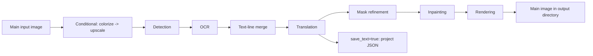

# Output Directory and Workflow

In the Translation Task card on the translation page, you can set the main output directory and choose a processing mode. This page covers the output path controls, the nine workflow choices, and their effects on outputs and processing stages. See [File List and Input](./file-list-and-input.md) for adding inputs and list states, and [Progress, Stop, and Task State](./progress-stop-and-task-state.md) for start, progress, and stop states.

## Feature boundary

This page covers:

- Entering, browsing for, and opening the output directory.
- The nine choices in “Translation Workflow Mode:” and the button and hint text shown after switching.
- Input discovery, output files, processing stages, skipped stages, and mutual-exclusion limits for each mode.

It does not define the algorithms of individual detectors, OCR engines, translators, inpainting models, or renderers. Workflow selection is not translator selection or API-candidate rotation. Manually setting multiple workflow fields is not a GUI-supported combination.

## UI operations

### Set the output directory

1. Enter a path in the field beside “Output Directory:”, or drag an output folder into it. Its placeholder is “Select or drag output folder...”.
2. Click “Browse...” to choose a directory.
3. Click “Open” to open the selected output directory with the operating system.
4. Select a workflow in “Translation Workflow Mode:” and click the start button for that mode.

The source connects the output field and the Browse/Open buttons to controller actions for selecting and opening a directory. The GUI was not launched for this static investigation, so the exact dialog text for missing, unwritable, or unopenable directories remains a runtime item. The output directory does not replace each image's work directory: JSON, TXT, and inpainted images still follow the per-image work-directory rules.

### Select a workflow

When the combo box changes, the GUI first clears all eight mutually exclusive CLI workflow fields, then sets and saves only the field for the selected mode. It also updates the title, hint, and start button; switching modes does not start a task.

| UI call key | English actual value | Simplified Chinese actual value |
| --- | --- | --- |
| `Output Directory:` | Output Directory: | 输出目录: |
| `Select or drag output folder...` | Select or drag output folder... | 选择或拖入输出文件夹... |
| `Browse...` | Browse... | 浏览... |
| `Open` | Open | 打开 |
| `Translation Workflow Mode:` | Translation Workflow Mode: | 翻译流程模式： |
| `Start Translation` | Start Translation | 开始翻译 |
| `Export Translation` | Export Translation | 导出翻译 |
| `Generate Original Text Template` | Generate Original Text Template | 仅生成原文模板 |
| `Start JSON Translation` | Start JSON Translation | 开始仅翻译（JSON） |
| `Import Translation and Render` | Import Translation and Render | 导入翻译并渲染 |
| `Start Colorizing` | Start Colorizing | 开始上色 |
| `Start Upscaling` | Start Upscaling | 开始超分 |
| `Start Inpainting` | Start Inpainting | 开始修复 |
| `Start Replace Translation` | Start Replace Translation | 开始替换翻译 |

After selection, the title shows the current mode and the subtitle shows its hint. For example, the Export Translation hint directs users to `manga_translator_work/translations/`; the Import Translation and Render hint says that TXT files are read from `manga_translator_work/originals/` or `translations/`, with `_original.txt` taking priority. These are program-displayed work-directory names, not private user paths.

## Option matrix

The combo box has no separate `userData`; the index is the mode value. Runtime code maps each index to the CLI field below. The table retains the three UI evidence columns required by the page contract.

| Stored value | English | Simplified Chinese | Workflow field written | Start button (English / Simplified Chinese) |
| --- | --- | --- | --- | --- |
| `0` | Normal Translation | 正常翻译流程 | all eight fields `false` | Start Translation / 开始翻译 |
| `1` | Export Translation | 导出翻译 | `generate_and_export=true` | Export Translation / 导出翻译 |
| `2` | Export Original Text | 导出原文 | `template=true` | Generate Original Text Template / 仅生成原文模板 |
| `3` | Translate JSON Only | 仅翻译（JSON） | `translate_json_only=true` | Start JSON Translation / 开始仅翻译（JSON） |
| `4` | Import Translation and Render | 导入翻译并渲染 | `load_text=true` | Import Translation and Render / 导入翻译并渲染 |
| `5` | Colorize Only | 仅上色 | `colorize_only=true` | Start Colorizing / 开始上色 |
| `6` | Upscale Only | 仅超分 | `upscale_only=true` | Start Upscaling / 开始超分 |
| `7` | Inpaint Only | 仅修复 | `inpaint_only=true` | Start Inpainting / 开始修复 |
| `8` | Replace Translation | 替换翻译 | `replace_translation=true` | Start Replace Translation / 开始替换翻译 |

### Output paths and work directories

`MangaTranslator._calculate_output_path()` determines the main output image. Normally, the output directory preserves the input folder name and relative hierarchy. With `save_to_source_dir=true`, output moves to `manga_translator_work/result/` beside the original. When `cli.format` is empty or `none`, the original extension is retained; otherwise the configured extension is used.

Each image's work directory uses its input `<stem>` without the extension:

| Resource | Path | Lookup/compatibility rule |
| --- | --- | --- |
| Translation project JSON | `manga_translator_work/json/<stem>_translations.json` | Prefer the new location; fall back to the image directory's `<stem>_translations.json` |
| Original export | `manga_translator_work/originals/<stem>_original.<template-format>` | Fall back to `json` when the template format is missing or unreadable |
| Translation export | `manga_translator_work/translations/<stem>_translated.<template-format>` | Same as above |
| Inpainted image | `manga_translator_work/inpainted/<stem>_inpainted.<original-ext>` | No other lookup location |
| Colorized/upscaled editor base | `manga_translator_work/editor_base/<original-filename>` | Compatible with an identically named file at the old work-directory root |
| Replace-translation pair image | `manga_translator_work/translated_images/<stem><ext>` | Try the same extension first, then supported image extensions |

The first `output_format:` line in `config/translation_template.json` determines the template/TXT extension. It must be a safe 1–32 character extension; missing or invalid values fall back to `json`. Template text is generated with `<original>` and `<translated>` placeholders.

## Runtime behavior

### Normal output chain

Normal Translation conditionally runs colorization and upscaling, then detection, OCR, text-line merging, translation, mask refinement, inpainting, and rendering. If there are no detection boxes or OCR text, the core may return the input or upscaled image early. Normal mode is the only one of the nine modes allowed to enter the `batch_concurrent` pipeline.

### Stages and outputs for the nine modes

| Workflow | Input/discovery | Output | Runtime stages | Skipped or special boundary |
| --- | --- | --- | --- | --- |
| Normal Translation | Main input image | Main output image; project JSON when `save_text=true`; inpainted image after inpainting; editor base when colorization/upscaling is enabled | Conditional colorization → upscaling → detection → OCR → merge → translation → mask → inpainting → rendering | May return early without boxes or OCR text; only mode using the concurrent pipeline |
| Export Translation | Main input image and an available template | Project JSON and `<stem>_translated.<template-format>`; no main output image | Conditional colorization → upscaling → detection → OCR → merge → translation; refine a mask when regions and an original mask exist | Skips inpainting, rendering, and main-image saving; `generate_and_export=true`; imported YOLO labels skip mask refinement and mask saving |
| Export Original Text | Main input image and an available template | Project JSON and `<stem>_original.<template-format>`; no main output image | Conditional colorization → upscaling → detection → OCR → merge; normally may refine a mask | Enters the export branch only when `template=true` and `save_text=true`; skips translation, inpainting, rendering, and main-image saving; same YOLO exception as Export Translation |
| Translate JSON Only | Must find a project JSON; accepts old region-list and new `regions` object structures | Writes the project JSON back; deletes the same-image original sidecar after success; no main output image | Load JSON → translate → write JSON back | Skips colorization, upscaling, detection, OCR, merge, mask, inpainting, and rendering; does not condition JSON saving on `save_text` |
| Import Translation and Render | Requires project JSON; original sidecar has priority over translation sidecar when both exist | Main output image and updated project JSON; inpainted image when needed | Read JSON/in-memory payload → reuse or refine mask → inpaint → render | Skips colorization, upscaling, detection, OCR, merge, and translation; missing JSON mask plus imported YOLO labels adds detection; existing inpainted images may be reused, and an AI renderer may skip real inpainting |
| Colorize Only | Main input image | Main output image; editor base when colorization is effective | Conditional colorization | Skips upscaling, detection, OCR, merge, translation, mask, inpainting, and rendering; does not force a colorizer, so `none` can leave the image unchanged |
| Upscale Only | Main input image; ratio comes from `upscale.upscale_ratio` | Main output image; editor base when colorization or a ratio is enabled | Conditional colorization → conditional upscaling | Skips detection, OCR, merge, translation, mask, inpainting, and rendering; does not force a ratio, so an empty ratio preserves the colorized result or original |
| Inpaint Only | Main input image | Main output image; branch clears `text_regions` and does not render translated text | Conditional colorization → upscaling → detection → fill detected lines with the literal `TEXT` → merge → mask → inpainting | Skips OCR, translation, and rendering; no detection lines, mask, or merged regions may return an un-inpainted image; an AI renderer skips actual inpainting and uses the work image |
| Replace Translation | Raw image; same-named translated image required in the work directory | Main output image; rerender branch may write inpainted image and JSON, while direct-paste branch writes neither or PSD | Conditional colorization → upscaling → detection → OCR → merge on both images → region pairing → inpaint/render, or direct text paste | Does not call translation; forces `disable_auto_wrap=true`, `layout_mode='strict'`; `enable_template_alignment=true` uses direct paste, and `paste_mask_dilation_pixels` is consumed only there |

The display name describes the goal but does not always enable the related model. Upscale Only does not force a ratio and source code may still colorize first when a colorizer is enabled; Colorize Only does not change `none` to a concrete colorizer.

### Workflow mutual exclusion and concurrency

When the GUI changes the selection, its eight Boolean fields are mutually exclusive. When synchronizing an existing configuration, source priority is Replace Translation, Inpaint Only, Upscale Only, Colorize Only, Import Translation and Render, Translate JSON Only, Export Original Text, Export Translation, then Normal Translation. Hand-edited JSON, service requests, or other entry points can provide combinations, but runtime dispatch follows fixed priority; there is no contract for simultaneous execution.

`batch_concurrent` is incompatible with Import Translation and Render, JSON-only, both exports, Colorize Only, Upscale Only, Inpaint Only, and Replace Translation. Both the desktop controller and core process these modes without the concurrent pipeline. A special mode does not become concurrent merely because the saved configuration still contains the concurrency setting.

## Dependencies and conflicts

- Main inputs must be images supported by the file service. Adding a folder searches recursively in natural order and skips directories named `manga_translator_work`. Archive and document extensions are recognized by the same service, but archive-sidecar pairing has not been runtime-verified.
- Export modes depend on a readable template. An invalid template format falls back to `json`. Import Translation and Render, JSON-only, and Replace Translation depend on the corresponding project JSON, TXT sidecars, or pair image.
- Before starting, `cli.overwrite` checks existing TXT sidecars, other mode-specific files, or the main image according to the selected mode. The exact overwrite dialog and the JSON-only missing-original-sidecar behavior remain runtime items.
- Qt/release defaults set `cli.save_text` to `true`; it also controls project JSON, inpainted images, and project writes in normal mode. Export Original Text requires it to enter the export branch. JSON-only writes JSON unconditionally.
- Model, VRAM, network, and API costs for colorization, upscaling, detection, OCR, inpainting, and rendering come from those stage parameters and are outside this page's scope.

## Related files and formats

Only workflow input/output and path-discovery files belong on this page:

- `config/translation_template.json`: controls original/translation export templates and `output_format`; do not place private paths or content in public samples.
- `manga_translator_work/json/*_translations.json`: project data; the old image-side JSON remains a fallback.
- `manga_translator_work/originals/*_original.<format>` and `translations/*_translated.<format>`: export/import sidecars whose names must match the input `<stem>`.
- `manga_translator_work/inpainted/`, `editor_base/`, and `translated_images/`: inpainted images, editor bases, and Replace Translation pair images.
- Main images in the output directory: calculated from relative hierarchy, `save_to_source_dir`, and `cli.format`.

Do not show real user configuration, keys, tokens, usernames, private absolute paths, user images, or task artifacts here. No real runtime screenshot is available for this page; a diagram must not be presented as a runtime screenshot.

## Diagrams and screenshots

The Mermaid diagram above expresses only the source-confirmed normal-stage order and JSON branch. Real GUI states for the nine modes, directory selection results, overwrite prompts, cancellation file retention, and error dialogs have not been runtime-checked. Future screenshots must use sanitized inputs and test configuration, with bilingual alt text and captions.

## Source evidence

| Layer | File | Verified content |
| --- | --- | --- |
| UI layout | `desktop_qt_ui/ui/main_page/pages/translation_page.py:64-110` | Translation Task card, output field, Browse/Open buttons, workflow combo, and start button |
| Workflow state | `desktop_qt_ui/ui/main_page/runtime.py:21-47` | Call keys for the nine mode titles and hints |
| Workflow writes | `desktop_qt_ui/ui/main_page/runtime.py:151-215` | Configuration sync, clearing eight fields, index mapping, and saving |
| Start button | `desktop_qt_ui/ui/main_page/runtime.py:218-238` | Mode-specific start button text |
| i18n | `desktop_qt_ui/locales/en_US.json:481-505`; `desktop_qt_ui/locales/zh_CN.json:479-503` | Actual bilingual values for controls, modes, buttons, and hints |
| Input/discovery | `desktop_qt_ui/services/file_service.py:31` | Supported extensions, recursion, natural sort, and work-directory exclusion |
| Controller | `desktop_qt_ui/app_logic.py:3094` | Output path handoff, overwrite checks, and special-mode concurrency disabling |
| Qt config | `desktop_qt_ui/core/config_models.py:123` | Workflow fields and `save_text` default |
| Core dispatch | `manga_translator/manga_translator.py:504,3399,4236,5206` | Output, special-mode priority, preprocessing, and normal postprocessing |
| Paths/template | `manga_translator/utils/path_manager.py:12`; `manga_translator/utils/translation_template.py:10` | Work directory, sidecar lookup, and template-format fallback |
| Replace Translation | `manga_translator/utils/replace_translation.py:128,726` | Pair lookup, region matching, direct paste, and output boundary |

## Verification

| Check | Status | Notes |
| --- | --- | --- |
| Source and research material | Complete | Cross-checked `workflow-matrix-source-evidence.md` and the listed UI, i18n, controller, and core sources |
| Three-column i18n evidence | Complete | Controls and all nine workflows record the call key, English actual value, and Simplified Chinese actual value |
| Route/page mirror | Pending | Run route mirror and source-evidence checks after completing the pages |
| GUI nine-mode and file-output run | Pending | Runtime checks explicitly listed by the research material are not complete; static conclusions are not presented as runtime results |
| Production build | Pending | Run `npm run docs:build --prefix doc/wiki` if needed |

- [ ] [In progress] Runtime confirmation remains: actual buttons, hints, output directories, overwrite/error feedback, and files retained after cancellation for all nine modes.
