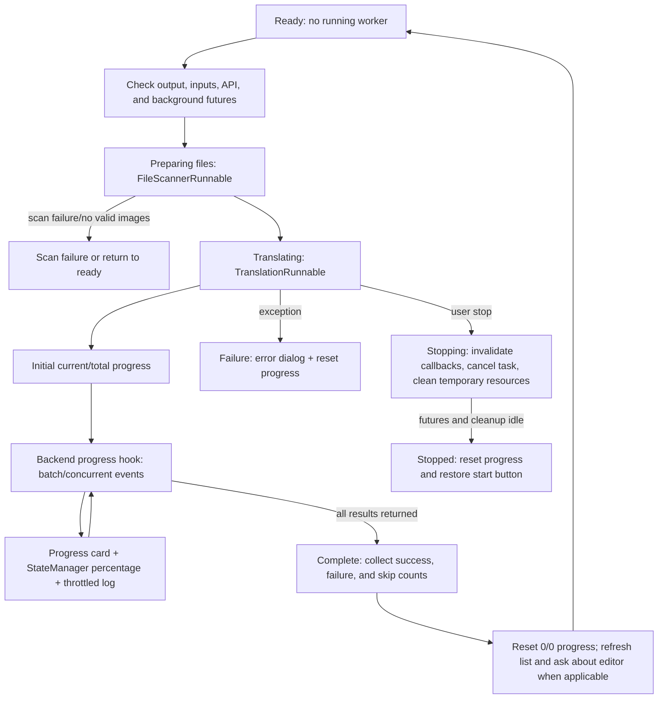

# Progress, Stop, and Task State

After the translation page has input files, a valid output directory, and passing API checks, this page explains the button states, file counts, percentages, stop request, and cleanup from start through completion, failure, or stopping. See [Output Directory and Workflow](./output-directory-and-workflow.md) for workflow inputs and outputs, and [File List and Input](./file-list-and-input.md) for adding, scanning, and empty-list states.

## Feature boundary

This page covers the desktop Qt translation workspace's:

- Start-button transitions through preparation, startup, running, stopping, and ready.
- How scanning, processed files, skipped files, failed files, and completed counts reach the progress display.
- The cancellation boundary, background cleanup, error feedback, and the post-completion editor prompt.

It does not define detector, OCR, translator, inpainting, or renderer algorithms, and it does not treat the progress bar as a server-side task protocol. Stage differences among the nine workflows remain on the workflow page.

## UI operations

### Start a task

1. Confirm that the output directory exists and is a directory, and leave at least one input item in the file list.
2. Choose a workflow and click that mode's start button. The controller checks again that no task is running, that the previous scan/translation/cleanup futures are idle, and that the selected configuration's API credentials are available.
3. After validation, the UI first enters “正在准备文件...”; a background scanner handles folders, archives, and exclusions. Only after scanning finishes does it create the translation worker and enter “正在翻译...”.
4. Once processing starts, the button briefly shows “Starting...” (this key is absent from the Chinese locale, so the actual fallback is the English key), and becomes clickable as “Stop Translation” after about two seconds. This avoids duplicate starts or an overly early stop request.

If scanning or translation cannot start, the state returns to non-running and records “任务启动失败”; no valid image returns to “就绪”. Invalid output, an empty file list, or failed API validation shows a blocking dialog before the task actually starts.

### Read progress

The progress card shows a detail line, a `current/total (percentage%)` counter, and a progress bar. `current` is the number of original inputs completed or skipped, while `total` is the original scanned count; therefore, existing outputs skipped with overwrite disabled still count toward the total. With no valid total, the display is `0/0 (0%)` rather than a fabricated percentage.

The detail can include “批量处理中” or “并发处理中”, average seconds per image, estimated remaining time, skipped count, and failed count. The controller also writes `[current/total] message` to the state manager. Log output is throttled to roughly once per second, while the first, final, and boundary progress events are logged.

### Stop a task

1. When the task is running and the delayed stop button is enabled, click “Stop Translation”.
2. The controller immediately sets the stop-request flag, changes the status message to “正在停止...”, disables the button, and displays “Stopping...”.
3. It increments both the scan request ID and task ID so late scan, progress, completion, or error callbacks become stale; `worker.stop()` clears its running flag and cancels the current asyncio task.
4. Only after scan, translation, and temporary archive cleanup futures are idle does the state become “任务已停止”; the progress card resets to `0/0 (0%)`, and the button returns to the current workflow's start text.

Stopping is cooperative cancellation. It cannot guarantee interruption of an already-issued network request, an uncancellable synchronous model call, or output already written to disk. While stopping, the button cannot be clicked again, and the UI cannot immediately return to start; it remains in the stopping state while background work finishes.

### Completion or failure

After completion, the controller collects returned saved paths, then sets status based on success, failure, and skipped counts and resets the progress card. For workflows whose results are meaningful in the editor, the main window refreshes the file snapshot and asks “Translation completed, {count} files saved.\n\nOpen results in editor?”. Export, JSON-only, Colorize Only, Upscale Only, and Inpaint Only do not show this editor prompt.

On failure, the state becomes “任务失败”, progress is reset, and a “Translation Error” dialog opens. The dialog shows a friendly error summary and offers “Open log folder”. A partially failed batch keeps successful results while reporting success and failure counts. When every input is skipped because an output already exists, this is not treated as an API translation failure; the warning suggests deleting same-named files or enabling overwrite.

## Option matrix

The following table lists the actual i18n keys used by the operations on this page. The start button depends on the selected mode; stored values and stage differences are documented on the workflow page.

| UI call key | English actual value | Simplified Chinese actual value |
| --- | --- | --- |
| `Start Translation` | Start Translation | 开始翻译 |
| `Stop Translation` | Stop Translation | 停止翻译 |
| `Starting...` | Missing (falls back to key) | Missing (falls back to key; code directly displays `Starting...`) |
| `Stopping...` | Stopping... | 停止中... |
| `Start Colorizing` | Start Colorizing | 开始上色 |
| `Start Upscaling` | Start Upscaling | 开始超分 |
| `Start Inpainting` | Start Inpainting | 开始修复 |
| `Start JSON Translation` | Start JSON Translation | 开始仅翻译（JSON） |
| `Import Translation and Render` | Import Translation and Render | 导入翻译并渲染 |
| `Generate Original Text Template` | Generate Original Text Template | 仅生成原文模板 |
| `Export Translation` | Export Translation | 导出翻译 |
| `Start Replace Translation` | Start Replace Translation | 开始替换翻译 |
| `Task Completed` | Task Completed | 任务完成 |
| `Translation completed, {count} files saved.\n\nOpen results in editor?` | Translation completed, {count} files saved.\n\nOpen results in editor? | 翻译完成，成功保存 {count} 个文件。\n\n是否在编辑器中打开结果？ |
| `Translation Error` | Translation Error | 翻译错误 |
| `Open log folder` | Open log folder | 打开日志文件夹 |
| `Warning` | Warning | 警告 |

The following status strings are written directly to the state manager rather than looked up through `_t()`, so they do not have locale values that can be invented: `正在准备文件...`, `正在翻译...`, `正在停止...`, `任务已停止`, `任务完成...`, `任务失败`, `就绪`, and scan/progress detail strings. Static source inspection confirms these are currently Chinese; runtime display has not been launched for confirmation.

## Runtime behavior

### State and progress flow

`TranslationWorker`'s progress hook parses backend `batch:start:end:total[:failed]` events. The controller adjusts current and total using the skipped offset, and `TranslationRunnable` sends the result through a queued Qt signal to `MainAppLogic.on_task_progress()`. That method bounds the state-manager percentage to 0–100 and updates the main-view progress bar. Both concurrent and ordinary batch processing use the original input total; the controller disables concurrency for special workflows.

### Stop and resource boundary

Stopping first invalidates callbacks and then asks the worker to cancel; it does not immediately set `is_translating` to false. `_cleanup_stopped_task_when_idle()` waits for scan, translation, and archive-cleanup futures, and only then calls `_finish_stop_task()`. `worker.stop()` also cancels the current asyncio task and performs full memory cleanup; model unloading depends on `app.unload_models_after_translation`.

## Dependencies and conflicts

- Starting depends on a valid output directory, a non-empty input list, credentials required by the selected translator, and no unfinished previous-task cleanup.
- Scanning is still represented by the translating state, so Add Files, Add Folder, Clear List, the file list, and API management are disabled.
- Stopping coordinates thread-pool work, the asyncio task, archive temporary directories, and model-memory cleanup; forcibly terminating the process can leave partial outputs or temporary files.
- With `cli.overwrite=false`, existing outputs count toward progress but are not processed. If all files are skipped, the task completes with an overwrite warning instead of calling the translation service.
- `batch_concurrent` applies only to the normal workflow; text/JSON import, exports, Colorize Only, Upscale Only, Inpaint Only, and Replace Translation run serially.
- Task IDs prevent late signals from an old task contaminating a new task, but cannot undo files already written to disk; the user must inspect the output directory if cleanup is needed.

## Related files and formats

- JSON, TXT, inpainted images, and Replace Translation pair images under `manga_translator_work/` are defined by the workflow page; here they matter only because they affect skip counts, completion results, and cleanup.
- Main output paths are jointly determined by the configured output directory, input-folder relative hierarchy, `cli.format`, `cli.overwrite`, and `save_to_source_dir`.
- Logs are written under the application's `result/` log directory. The error dialog only offers an Open log folder action; this page does not show real logs, paths, or task contents.
- Stopping cleans temporary archive extraction directories; a cleanup warning means the source cannot claim every temporary file was removed.
- Do not show real API keys, tokens, usernames, private absolute paths, user images, prompts, or task artifacts. There is no runtime screenshot for this page; the Mermaid diagram is a source-based flow diagram, not a runtime screenshot.

## Diagrams and screenshots

The state diagram above covers the source branches for starting, scanning, processing, progress, completion, failure, and stopping. As required by the blueprint, future headed screenshots should include startup, progress, stopping, and completion, using sanitized inputs and empty/placeholder credentials, with bilingual alt text and captions. The GUI was not launched for this task, so no runtime result is claimed for button delay, dialogs, or files retained after cancellation.

## Source evidence

| Layer | File | Verified content |
| --- | --- | --- |
| UI layout | `desktop_qt_ui/ui/main_page/view.py:163-188` | Progress card, detail text, `0/0 (0%)` counter, and progress bar |
| UI state | `desktop_qt_ui/ui/main_page/runtime.py:95-149` | Startup delay, stop button, disabled stopping state, and signal connections |
| Workflow buttons | `desktop_qt_ui/ui/main_page/runtime.py:218-245` | Start-button call keys for the nine modes |
| Task control | `desktop_qt_ui/app_logic.py:1715-1843` | Scanning, worker creation, task IDs, and startup states |
| Progress control | `desktop_qt_ui/app_logic.py:2062-2075`; `desktop_qt_ui/ui/main_page/runtime.py:55-92` | Counts, percentage, state message, and progress-bar updates |
| Completion/failure | `desktop_qt_ui/app_logic.py:1915-2009,2044-2057` | Success, skip, failure counts, reset, and signals |
| Stop/cleanup | `desktop_qt_ui/app_logic.py:2077-2140,2433-2447` | Callback invalidation, cancellation, idle cleanup, and temporary-resource/memory cleanup |
| State storage | `desktop_qt_ui/services/state_manager.py:11-18,45-183` | `is_translating`, progress, status message, and Qt signals |
| Completion dialogs | `desktop_qt_ui/ui/main_window.py:611-724` | Snapshot refresh, editor prompt, error and warning dialogs |
| i18n | `desktop_qt_ui/locales/en_US.json:157-169,481-505,1224`; `desktop_qt_ui/locales/zh_CN.json:157-169,479-503,1223` | Actual bilingual values for buttons, completion, error, warning, and missing key |
| Test evidence | `test/test_app_logic_file_sources.py:88-180` | Stopping remains active until worker and cleanup futures finish |

## Verification

| Check | Status | Notes |
| --- | --- | --- |
| Static source and i18n review | Complete | UI, runtime controller, state manager, workers, completion dialogs, and both locales were checked |
| Three-column UI-call-key evidence | Complete | Buttons, completion/error/warning, and stopping states record key, actual en_US, and actual zh_CN; missing `Starting...` is explicitly marked |
| Stop-state regression coverage | Existing test evidence | `test/test_app_logic_file_sources.py::test_stopping_state_remains_until_worker_and_cleanup_finish` covers not restoring early; no tests were added or changed |
| Headed GUI run | Not run | Desktop GUI was not launched; startup, dialogs, and runtime cancellation results are not claimed |
| Real translation task/file retention | Not run | No API, model, or user input was used to validate disk output or cancellation behavior |
| Page mirror, source evidence, and production build | Pending this task's static checks | Run the available Wiki checks and build after both pages are written |

Sensitive-information review: the body, tables, diagrams, and source evidence contain no real key, token, username, private absolute path, user image, or private prompt.
