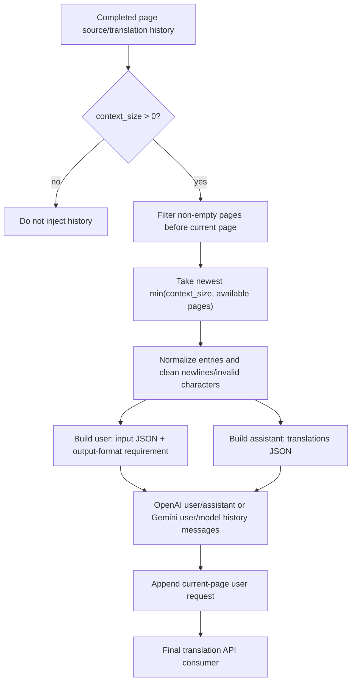
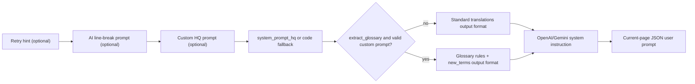

# Context and Prompts

Use this page when adjacent pages share names, terminology, tone, or formatting. It documents the history pages attached to translation requests and the system, custom, and line-break prompts consumed by translators. It does not cover translator/API selection or candidate slots (see [Translator selection](./selection-and-languages.md) and the API-management pages), nor the complete prompt-file CRUD workflow (see [Prompt list, apply, and preview](../prompts/list-apply-and-preview.md)).

## Feature boundary

- `cli.context_size` limits the number of most recent non-empty history pages used for joint translation; it is not a text-region count or an API-slot count.
- `translator.high_quality_prompt_path` is a translator resource path/file-edit action for a custom HQ prompt. This page never embeds private prompt text and does not describe AI OCR, AI colorizer, or AI renderer prompts as if they were one file.
- HQ system, output-format, glossary-extraction, and AI line-break prompts are loaded separately and combined in a fixed order; this page follows their translation-path consumers.

## UI operations

### Choose context and prompts in Settings

1. Open “Settings” (`Settings`) and select the “Translation” (`Translation`) group.
2. Enter a non-negative integer in “Context Pages” (`Context Pages`). The value is stored as `cli.context_size`; `0` means that history messages are not injected.
3. Use the file action on “Custom Prompt” (`Custom Prompt`) to choose or edit a prompt. The dynamic-settings control calls `get_hq_prompt_options()`, which scans `dict/` for `.yaml`, `.yml`, and `.json` files while excluding system-prompt stems.
4. Click “Edit” (`Edit`) to modify the file directly. Keep a parseable YAML/JSON structure. Rebuilding the settings page or reloading configuration refreshes the path and description panel.
5. “Enable Streaming” (`Enable Streaming`) changes response transport only; it does not change history selection or prompt composition.

### Inspect and apply a file in Prompt Management

Open “Prompt Management” (`Prompt Management`). The list contains user prompt files. Select one and use “Apply Selected Prompt” (`Apply Selected Prompt`) to write its path to translator configuration, or use “Prompt Preview” (`Prompt Preview`) and “Edit” (`Edit`) to inspect structured fields or Raw content.

| UI call key | English actual value | Simplified Chinese actual value |
| --- | --- | --- |
| `Settings` | Settings | 设置 |
| `Translation` | Translation | 翻译 |
| `label_context_size` | Context Pages | 上下文页数 |
| `label_high_quality_prompt_path` | Custom Prompt | 自定义提示词 |
| `Prompt Management` | Prompt Management | 提示词管理 |
| `Prompt List` | Prompt List | 提示词列表 |
| `Apply Selected Prompt` | Apply Selected Prompt | 应用所选提示词 |
| `Prompt Preview` | Prompt Preview | 提示词预览 |
| `Edit` | Edit | 编辑 |
| `System Prompt` | System Prompt | 系统提示词 |
| `Prompt Text` | Prompt Text | 提示词正文 |
| `New Prompt` | New Prompt | 新建提示词 |
| `Copy Prompt` | Copy Prompt | 复制提示词 |
| `Rename Prompt` | Rename Prompt | 重命名提示词 |
| `Delete` | Delete | 删除 |

When the list is empty, a file is missing, or parsing fails, the preview shows the corresponding empty/error state. Do not copy a local path from an error message into a public report.

## Parameters and options

#### `cli.context_size` — 上下文页数 / Context Pages {#cli-context-size}

- Control: integer input.
- Location: Settings → Translation; UI call key `label_context_size`.
- Stored value: non-negative integer; `0` disables history injection. Runtime also caps the value at completed pages containing valid source and translation text.
- Options: integer; there is no enum dropdown.
- Defaults: core `manga_translator/config.py#Config` parameter read fallback is `0`; Qt model `desktop_qt_ui/core/config_models.py#CliSettings.context_size` is `3`; release `config/config-example.json` is `3`. Do not collapse these into one default.
- Effective stages: pre-translation batch orchestration and translation-request construction.
- Mechanism: after a page finishes, its source/translation entries are retained. For the next page, earlier non-empty pages are filtered and the newest `context_size` pages are encoded as one `user` request plus one JSON `assistant` response per page, followed by the current `user` request.
- Dependencies/conflicts: ordered page completion is required. With `batch_concurrent` or special JSON/import workflows, available history depends on the scheduler. More pages increase prompt characters and token cost; empty pages do not consume a slot.
- Related files/debug artifacts: affects in-memory `all_page_translations`, `_original_page_texts`, and request messages only; it is not written as a prompt-history file. Long batches prune old history while retaining a `context_size + 5` buffer.
- Diagram: the real history-to-API data flow is shown in [History to messages](#history-to-messages).
- Source evidence: definitions/defaults in `manga_translator/config.py` and `desktop_qt_ui/core/config_models.py`; UI binding in `settings_tab_layout.json` and `app_logic.py#get_display_name`; orchestration/history in `manga_translator/manga_translator.py#_build_prev_context`; final consumers in the OpenAI/Gemini context-message builders.
- Verification: static source review complete; sanitized runtime verification is deferred to full desktop acceptance.

#### `translator.high_quality_prompt_path` — 自定义提示词 / Custom Prompt {#translator-high-quality-prompt-path}

- Control: prompt-file selection/edit action, not an ordinary text configuration field.
- Location: the Custom Prompt row in Settings → Translation, or the Apply button in Prompt Management.
- Stored value: relative or absolute resource path; a sanitized example is `dict/prompt_example.yaml`, never a real user path. YAML and JSON are supported; empty means no custom prompt is loaded.
- Options: discovered `.yaml`, `.yml`, and `.json` file names. System stems such as `system_prompt_hq`, `system_prompt_hq_format`, `system_prompt_line_break`, and `glossary_extraction_prompt` are excluded from the ordinary user list.
- Defaults: core `manga_translator/config.py#TranslatorSettings.high_quality_prompt_path` is `None`; Qt model `desktop_qt_ui/core/config_models.py#TranslatorSettings.high_quality_prompt_path` is `dict/prompt_example.yaml`; release `config/config-example.json` uses the same sanitized example path.
- Effective stages: translation-context preparation and system-prompt construction; when glossary extraction is enabled, returned `new_terms` may be merged back into this file.
- Mechanism: `_load_and_prepare_prompts()` resolves and parses the path into `Context.custom_prompt_json`; `_build_system_prompt()` flattens structured fields, replaces the target-language placeholder (written as a three-brace `target_lang` placeholder), and combines them with system and format prompts. Parse failures are logged as warnings/errors and are not treated as valid request content.
- Dependencies/conflicts: only OpenAI/Gemini implementations that support HQ/custom prompts consume this value. AI OCR, colorizer, and renderer have separate fixed prompt files. Glossary extraction requires a valid custom prompt and write access; longer prompts increase token and network cost.
- Related files/debug artifacts: `dict/prompt_example.yaml`, `dict/system_prompt_hq.yaml`, `dict/system_prompt_hq_format.yaml`, and `dict/glossary_extraction_prompt.yaml`. Encoding and YAML/JSON root structure must be valid. Never publish private prompt text from files, requests, or logs.
- Diagram: the real prompt-composition data flow is shown in [Prompt composition order](#prompt-composition-order).
- Source evidence: configuration in `manga_translator/config.py` and `desktop_qt_ui/core/config_models.py`; UI in `desktop_qt_ui/app_logic.py#get_hq_prompt_options`, `ui/main_page/dynamic_settings.py`, `ui/main_page/layout.py`, and `ui/secondary_pages/prompt_preview.py`; loading/parsing in `manga_translator/translators/prompt_loader.py`; composition/consumers in `manga_translator/translators/common.py`, `openai.py`, and `gemini.py`.
- Verification: static source/i18n review complete; runtime verification with real credentials or private files is intentionally deferred.

## Runtime behavior

### How history pages become context messages {#history-to-messages}

The processor uses only pages completed before the current page, skipping pages that do not contain both valid source and translated text. Both legacy history dictionaries and current list entries are normalized. Newlines are flattened and replacement characters removed before an input JSON with `id` values and a `translations` output JSON are generated. OpenAI receives `role=user`/`role=assistant` messages; Gemini receives `user`/`model` parts. Neither receives historical images.

After processing, history is pruned to avoid memory growth in long batches. It is process-local runtime state, not a persisted prompt archive. If a concurrent or import workflow has no strict completion order, do not assume every image sees the same history sequence.

### Prompt composition order {#prompt-composition-order}

On every retry the system prompt is rebuilt, with a retry hint first when applicable. The order then is AI line-break prompt (only when `render.disable_auto_wrap` is enabled and the file loads), custom HQ prompt, base HQ system prompt, and standard output-format prompt. When `translator.extract_glossary` is enabled with a valid custom prompt, glossary rules and an extended `new_terms` output format are appended after the base prompt.

The target-language placeholder (written as a three-brace `target_lang` placeholder) in custom fields is replaced with the full target-language name. The user prompt contains reading-order region JSON; with AI line breaking it also includes `original_region_count`, allowing final rendering checks to validate `[BR]` markers.

## Dependencies and conflicts

- Context quality depends on prior OCR text and successful translations; history does not automatically correct bad OCR.
- `context_size`, `batch_size`, and `batch_concurrent` are different layers: the first controls history-page count, while the latter two control region batches and image orchestration.
- A custom HQ prompt affects translation requests only. Fixed AI OCR/colorizer/renderer prompts have separate keys and consumers; do not interchange their files.
- OpenAI/Gemini requests are also affected by streaming, RPM, ordinary retries, and API candidate rotation. These mechanisms do not change history content; see the translation-settings and API-management pages.
- Prompt content may contain business text. Before sharing logs, request exports, or debug directories, remove request bodies, historical text, paths, and credentials.

## Related files and formats

| File/format | Actual role on this page | Manual-edit and compatibility note |
| --- | --- | --- |
| `config/config-example.json` | Release default `context_size: 3` and sanitized HQ path | Use sanitized examples only; importing user configuration overrides memory settings and unknown keys are validated |
| `config/config.json` | Runtime user-settings persistence | Never read or display a real user file; do not commit private absolute paths |
| `dict/prompt_example.yaml` | Default custom HQ prompt example | YAML root must parse and use fields supported by the prompt loader |
| `dict/system_prompt_hq.yaml` / `system_prompt_hq_format.yaml` | Base system prompt and output format | The base prompt has a code fallback if missing; a missing format prompt weakens output constraints |
| `dict/glossary_extraction_prompt.yaml` | Automatic glossary-extraction rules | Used only with a valid custom HQ prompt and enabled `extract_glossary` |
| `dict/system_prompt_line_break.yaml` | AI line-break prompt | Triggered by `render.disable_auto_wrap`; it is not context history |
| `.yaml` / `.yml` / `.json` | Prompt-editor input formats | Record structure and sanitized placeholders only, never private prompt bodies |

## Mermaid data-flow limits

The diagrams describe the source-confirmed data transformations and final OpenAI/Gemini consumers; they do not claim that every run has history or a network request. `context_size=0`, empty history, invalid files, non-HQ translators, and special workflows take their documented bypasses. No runtime screenshot or private task artifact has been fabricated.

## Source evidence {#source-evidence}

| Layer | File | What was checked |
| --- | --- | --- |
| Settings UI | `desktop_qt_ui/ui/main_page/settings_tab_layout.json`, `desktop_qt_ui/ui/main_page/dynamic_settings.py` | Translation group, integer control, and prompt-file edit action |
| UI/i18n | `desktop_qt_ui/app_logic.py`, `desktop_qt_ui/locales/en_US.json`, `zh_CN.json` | Key mapping and actual bilingual display values |
| Config models | `desktop_qt_ui/core/config_models.py`, `manga_translator/config.py` | Qt, release, and core defaults |
| Persistence/orchestration | `desktop_qt_ui/services/config_service.py`, `manga_translator/manga_translator.py` | Configuration writes, history filtering/pruning, and prompt preparation |
| Prompt loading/composition | `manga_translator/translators/prompt_loader.py`, `translators/common.py` | YAML/JSON parsing, placeholders, and system/format/glossary composition |
| Final consumers | `manga_translator/translators/openai.py`, `gemini.py` | History roles, current system/user request, and response format |

## Verification {#verification}

| Check | Status | Notes |
| --- | --- | --- |
| BLUEPRINT, PAGE_GUIDELINES, TODO | Complete | Read in full and followed the page contract |
| UI layout and calls | Complete | Statically checked settings layout, dynamic settings, and prompt-management/preview calls |
| `en_US` / `zh_CN` actual locales | Complete | The table records key, actual English, and actual Simplified Chinese values |
| Context and prompt runtime chain | Complete | Statically checked history construction, OpenAI/Gemini messages, and prompt composition |
| Sanitized runtime verification | Deferred | No real `.env`, user `config.json`, API key/token, username, user image, or private prompt was read |
| VitePress | Deferred | Coordinator should run `npm run docs:build --prefix doc/wiki` plus mirror/source checks before merge |