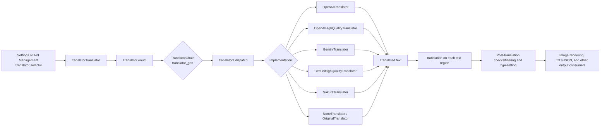
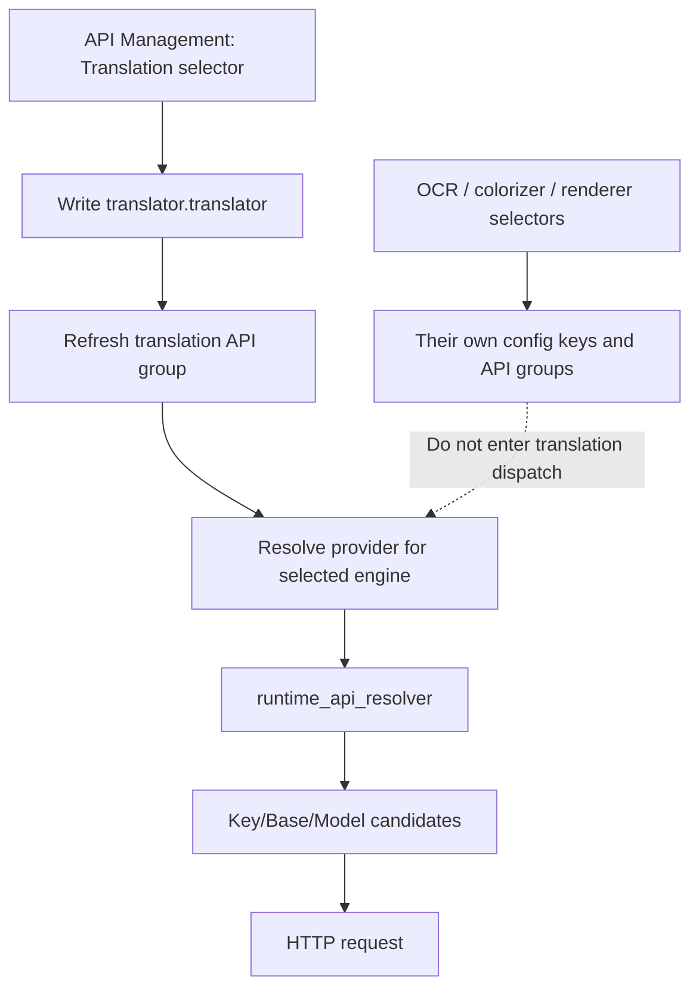

# Translator Engine Dispatch

Use this page when you need to know which implementation the Translator selector calls, when an API is required, or how multi-step translation is chained. It covers the boundary from `translator.translator` to a translator implementation and the final text consumers; target languages, skipped languages, context, prompts, streaming, and post-processing belong to [Translator selection and languages](./selection-and-languages.md) and the adjacent specialist pages.

## Feature boundary

- **In scope**: translator selection in the desktop Settings and API Management pages; mapping from the stored value to the `Translator` enum, `TranslatorChain`, and `dispatch`; the differences between regular and high-quality OpenAI/Gemini implementations, Sakura, no translation, and original text.
- **Out of scope**: OCR, colorizer, and renderer selectors; Key/Base/Model candidate rotation within one provider; prompt contents, context construction, and quality retries. Those belong to API Management or the other translator pages.
- The Translator selector in API Management is not just a view filter: it writes the same `translator.translator` setting and refreshes the translation API group. API slots themselves do not change the selected engine.

## UI operations

### Select an engine in Settings

1. Open **Settings**, enter the **Translation** group, and choose an implementation from **Translator**.
2. The combo box shows localized names but writes a stored value such as `openai_hq`. The dynamic settings layer emits a `translator.translator` change; `MainAppLogic.update_single_config()` updates the in-memory model, saves the config, and calls `TranslationService.set_translator()`.
3. The target language and other translation settings remain in the same group; changing the engine does not change the target language.
4. In **API Management**, open the Translation tab and use the same selector at the top. The page asynchronously rebuilds the credential/address/model group for the selected feature without changing OCR, colorizer, or renderer keys.

These are the actual UI values. API environment variable names are field bindings, not labels shown by the selector.

| UI call key | English actual value | Simplified Chinese actual value |
| --- | --- | --- |
| `label_translator` | Translator | 翻译器 |
| `Translator:` | Translator: | 翻译器： |
| `translator_openai_hq` | OpenAI High Quality | OpenAI高质量翻译 |
| `translator_gemini_hq` | Gemini High Quality | Gemini高质量翻译 |
| `translator_none` | None | 无 |
| `translator_original` | Original | 原文 |
| `desc_translator_translator` | Choose the translation engine. The current Qt UI offers OpenAI, Google Gemini, Sakura, High-Quality OpenAI, High-Quality Gemini, plus No Translation and Keep Original. High-Quality OpenAI is recommended. | 选择翻译引擎。当前 Qt UI 可选翻译器包括 OpenAI、Google Gemini、Sakura、高质量翻译 OpenAI、高质量翻译 Gemini，以及“不翻译”“保留原文”。推荐高质量翻译 OpenAI。 |
| `log_translator_switched` | Translator switched: '{value}' | 翻译器已切换: '{value}' |
| `No translation API required` | The current translator does not require an OpenAI/Gemini API key. | 当前翻译器不需要 OpenAI/Gemini API Key。 |

## Option matrix

The Settings combo obtains its values from `get_options_for_key("translator")`; the stored value is the `Translator` enum `.value`. `app_logic.py` creates the display mapping dynamically. The API Management Translation selector uses the same options and setting.

| Stored value | English | Simplified Chinese | Translation API required |
| --- | --- | --- | --- |
| `openai` | OpenAI | OpenAI | OpenAI-compatible API |
| `openai_hq` | OpenAI High Quality | OpenAI高质量翻译 | OpenAI-compatible API; high-quality prompt/structured handling |
| `gemini` | Google Gemini | Google Gemini | Gemini API |
| `gemini_hq` | Gemini High Quality | Gemini高质量翻译 | Gemini API; high-quality prompt/structured handling |
| `sakura` | Sakura | Sakura | Sakura service address/dictionary configuration |
| `none` | None | 无 | No translation request; translated text is empty |
| `original` | Original | 原文 | No translation request; source text is retained |

The locale also contains historical or generic labels such as `translator_google`, `translator_deepl`, `translator_papago`, `translator_gpt3`, and `translator_groq`. The current desktop `Translator` enum and dynamic selector do not offer those values, so their presence does not mean the current Qt UI supports them. `Translator._missing_()` only compatibility-maps legacy `gpt*`/`chatgpt` inputs to `openai`; it does not add UI options.

## Defaults and configuration lifecycle

| Source | Default `translator.translator` | Default `translator.target_lang` | Meaning |
| --- | --- | --- | --- |
| Core `manga_translator/config.py` | `openai_hq` | `ENG` | Pydantic fallback in `TranslatorConfig` |
| Qt `desktop_qt_ui/core/config_models.py` | `openai_hq` | `CHS` | Desktop model default on first creation |
| Current release configuration | `openai_hq` | `CHS` | Release configuration follows the Qt first-start default; saved user configuration takes precedence and must not be treated as every machine's effective value |

After changing the selector, `ConfigService` owns the Pydantic model and sanitized persistence. Do not copy a user's `config.json` or credential file to migrate a selection. Core configuration can also receive explicit CLI/Web overrides; the effective runtime value is the `Config` passed to the core.

## Runtime behavior: key to final consumer

1. If `selective_translation` and `translator_chain` are absent, `TranslatorConfig.translator_gen` constructs `TranslatorChain("<translator>:<target_lang>")`. Each chain component must be `enum-name:language`, and the language must be in `VALID_LANGUAGES`.
2. `translators.get_translator()` looks up `TRANSLATORS`. The stateless `none` and `original` implementations may be reused from `translator_cache`; other implementations are instantiated separately to avoid sharing request state.
3. `dispatch()` calls `parse_args(config)` for each chain node and then `translate('auto', target, queries, ...)`. High-quality implementations receive context; regular AI implementations can also receive context for AI line breaking. Empty queries return without an API request.
4. The core batch entry point explicitly constructs the four OpenAI/Gemini classes in `_batch_translate_texts()`; other enum values, including Sakura, none, and original, use the general `dispatch_translation()` path. `none` directly returns an empty string for each text.
5. Results return to each `text_regions` item's `translation` field and are then consumed by post-translation processing, the renderer, and save services. Selecting an engine does not directly write the final image.

### Regular, high-quality, and local branches

- `openai` and `gemini` are regular chat translation implementations and can use unified streaming and context.
- `openai_hq` and `gemini_hq` use dedicated high-quality classes; their prompt/structured handling and quality behavior must not be conflated with ordinary retries.
- `sakura` is an independent service implementation and is not automatically switched by OpenAI/Gemini API candidate rotation.
- `none` and `original` are not automatic fallbacks after an API failure. The former clears the translation; the latter retains the source text. They are explicit user-selected implementations.

## API feature-selector boundary

API Management has four feature selectors: Translation, OCR, Colorizer, and Renderer. Their specifications bind them to four real configuration keys:

| UI call key | Configuration key | Selector options | Refreshed API group |
| --- | --- | --- | --- |
| `label_translator` | `translator.translator` | `get_options_for_key("translator")` | `translation` |
| `label_ocr` | `ocr.ocr` | `get_options_for_key("ocr")` | `ocr` |
| `label_colorizer` | `colorizer.colorizer` | `get_options_for_key("colorizer")` | `colorizer` |
| `label_renderer` | `render.renderer` | `get_options_for_key("renderer")` | `renderer` |

Therefore changing the Translation selector to `gemini` in API Management really changes the translation engine and refreshes Gemini translation API fields; it is not merely changing a credential label. Conversely, multiple OpenAI Key, Base, or Model slots only affect runtime candidates within the selected OpenAI provider. Candidate resolution, `failover`/`round_robin`, cooldown, and recovery belong to API Management rather than this page.

### Dependencies and conflicts

- `openai*` requires at least one usable OpenAI or OpenAI-compatible credential/address/model; `gemini*` requires Gemini credentials. Real keys must stay in local environment or secure runtime overrides and are not shown in this page or screenshots.
- `sakura` depends on its Sakura service address and dictionary/service configuration. It is a different group from OpenAI/Gemini fields, so inspect the corresponding group after switching.
- `none` and `original` require no network API but have different downstream semantics: empty translation can render as empty, while original retains source text. Do not use either as automatic failover.
- `translator_chain`/`selective_translation` and the single `translator` are competing sources of the translation generator: when a chain or language selection is present, `translator_gen` constructs that chain first; every provider in the chain still needs its own credentials and language support.
- `batch_size` changes the number of texts submitted in one dispatch, while `batch_concurrent` changes the concurrent image pipeline. Neither changes the engine enum. Context and API request concurrency are documented on the Translation settings page.
- Target language is independent of UI language; `auto` is the source-language argument passed to an implementation, not automatic engine selection.

## Related files and formats

| File/format | Use on this page | Manual-edit/compatibility note |
| --- | --- | --- |
| Config JSON through `ConfigService` | Stores `translator.translator`, target language, and translation settings | Do not read or display user config; Pydantic validation governs unknown keys and migration |
| `config/custom_api_params.json` | Optional extra AI request parameters controlled by `use_custom_api_params` | Only changes supported request fields; it neither selects an engine nor stores API keys |
| `.env` | OpenAI/Gemini/Sakura and feature-specific API environment variables | Document only variable categories and redaction; never copy real values |
| `dict/prompt_example.yaml` or a custom high-quality prompt path | Prompt input for high-quality translation implementations | Preserve YAML/encoding/placeholders; do not paste prompt contents into the documentation |
| Translation JSON / TXT output | Stores source and `translation` fields for typesetting, editor, and later workflows | Filename matching, field compatibility, and overlays belong to workflow/editor pages |

## Source evidence

| Layer | File | Checked behavior |
| --- | --- | --- |
| Core configuration | `manga_translator/config.py` | `Translator` enum, `TranslatorConfig` defaults, `translator_gen`, chain/selective priority |
| Implementation registry | `manga_translator/translators/__init__.py` | `TRANSLATORS`, cache set, `get_translator()`, `dispatch()`, and `dispatch_batch()` |
| Qt config model | `desktop_qt_ui/core/config_models.py` | Qt `openai_hq`/`CHS` defaults and desktop fields |
| Settings UI | `desktop_qt_ui/ui/main_page/dynamic_settings.py` | Dynamic translator options, display mapping, setting changes, and API-group refresh |
| API Management UI | `desktop_qt_ui/ui/main_page/env_management.py` | Four feature selectors, their real keys, and refresh behavior |
| UI business layer | `desktop_qt_ui/app_logic.py` | `update_single_config()`, i18n display mapping, enum options, and translator state update |
| Runtime entry | `manga_translator/manga_translator.py` | `prepare_translation`, four AI implementation branches, and final batch translation call |
| API candidates | `manga_translator/runtime_api_resolver.py` | Feature/provider overrides, environment slot reads, default base/model, and candidate creation |
| Final consumers | Core translation pipeline, rendering/save/editor services | Region `translation`, rendered output, and TXT/JSON consumers |

## Verification

| Check | Status | Notes |
| --- | --- | --- |
| Page contract and bilingual mirror | Complete | Frontmatter, section order, anchors, and Mermaid branches mirror between Chinese and English |
| UI/i18n three-column evidence | Complete | Dynamic UI call keys and `en_US.json`/`zh_CN.json` values checked; historical locale keys versus current enum are explicitly called out |
| Core/Qt/release defaults | Complete (static) | Core and Qt defaults are from source; release default follows the Qt first-start default without reading user config |
| API/network runtime verification | Not run | Requires sanitized credentials and a controllable endpoint; documentation checks do not make real requests |
| Security review | Complete | No API key/token, username, private absolute path, user image, private prompt, or task artifact is included |
| VitePress build and static checks | Pending branch execution | Run `npm run docs:build --prefix doc/wiki`, route mirror, and source-evidence scripts |
