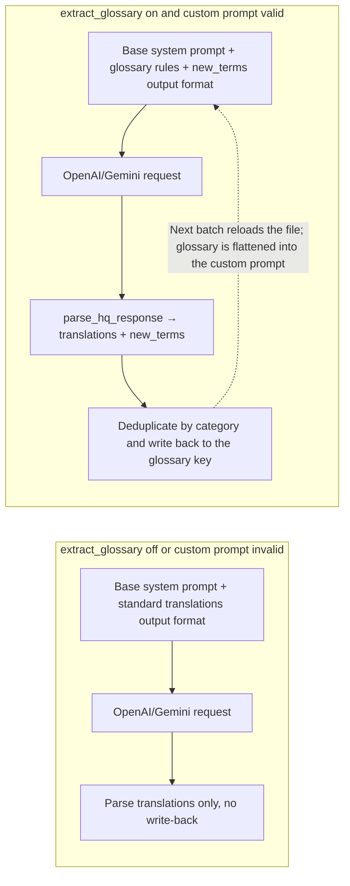
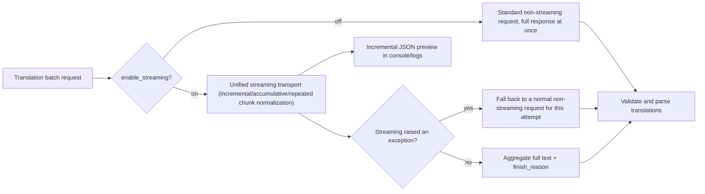

# Glossary, Streaming, and Line Breaking

Use this page when a long manga series must keep names, places, and skills consistent, when you want to see incremental output while a translation is in flight, or when translations should wrap according to the original line count. It documents automatic glossary extraction (`translator.extract_glossary`), streaming (`translator.enable_streaming`), and AI line breaking (`render.disable_auto_wrap`). Extracted terms are written back to the custom prompt file; streaming changes request transport only; AI line breaking uses a line-break prompt plus `original_region_count` so the model returns `[BR]` markers.

It does not cover translator or target-language selection (see [Translator selection](./selection-and-languages.md)), the full history and prompt-composition picture (see [Context and prompts](./context-and-prompts.md)), or renderer-side auto wrapping, semantic breaking, and punctuation trimming (see [Typesetting and rendering](../settings/typesetting-and-rendering.md)).

## Feature boundary

- There is no `translator.glossary` configuration key in the current config model; the glossary lives under a `glossary` key inside the custom HQ prompt file (`translator.high_quality_prompt_path`) and is written back by the auto-extraction feature.
- `translator.extract_glossary` is the automatic glossary-extraction switch; it enters the extraction branch only when the custom HQ prompt loads successfully, otherwise the switch alone still uses normal translation.
- `translator.enable_streaming` (the `translator.stream` shorthand in the task brief) changes request transport only for OpenAI/Gemini translators, including HQ modes; it does not change prompts, context, glossary extraction, or the final translation.
- `render.disable_auto_wrap` is displayed as “AI Line Breaking”. It drives both the translator-side line-break prompt and the renderer-side `[BR]` forced-wrap semantics; renderer auto wrapping itself is covered by the typesetting page.
- `OPENAI_GLOSSARY_PATH` (displayed as “Glossary Path”) is a legacy environment-variable-backed glossary path and is separate from the location where `extract_glossary` writes terms (the custom prompt file).

## UI operations

### Enable glossary extraction and streaming in Settings

1. Open “Settings” and select the “Translation” group.
2. Toggle “Auto Extract Glossary”. When enabled, the description panel shows “Auto-extract proper nouns (names, places) from translations to ensure consistency in long manga series.”
3. Toggle “Enable Streaming”. The description panel explains the difference between streaming and non-streaming requests.
4. Glossary extraction requires a parseable prompt file selected under “Custom Prompt”; without one, the switch does not produce the extraction branch.
5. Open “Settings” → “Typesetting” and toggle “AI Line Breaking” to enable the AI line-break prompt.

### Inspect the glossary in Prompt Preview

Open “Prompt Management”, select a custom prompt file, and click “Prompt Preview”. If the file contains a `glossary` key, the preview shows a “Glossary” section with a total entry count and per-category tabs for Person / Location / Org / Item / Skill / Creature; when empty it shows “No glossary entries”.

## Parameters and options

> For detailed parameter information (UI names, storage keys, default values, and effective stages) on this page, see [Developer Guide → Option matrix](#developer-guide) at the end.

#### Auto Extract Glossary {#translator-extract-glossary}

- Control: toggle.
- Location: Settings → Translation.
- Options: on or off.
- Default: `false`.
- Mechanism: when enabled, every attempt appends glossary-extraction rules and an extended output format that requires `new_terms`. Proper nouns such as names and places are extracted from the response, deduplicated by category (Person / Location / Org / Item / Skill / Creature), and written back under the `glossary` key of the custom prompt file; the next batch reloads the file, forming the “extract → write back → carried by the next request” feedback loop. The extraction branch runs only when a custom prompt loads successfully; otherwise the switch alone still uses normal translation. Write-back modifies the user prompt file, so sanitize it before sharing.



The switch only changes prompt content and write-back behavior; translation-count validation, retries, and candidate rotation still run as usual.

#### Enable Streaming {#translator-enable-streaming}

- Control: toggle.
- Location: Settings → Translation.
- Options: on or off.
- Default: `false`.
- Mechanism: when enabled, OpenAI/Gemini translators, including HQ modes, prefer the unified streaming transport to receive incremental responses in real time, with incremental previews in the console/logs; when disabled, they always use standard non-streaming requests. If a streaming request raises an exception (for example an endpoint that does not support streaming), this attempt automatically falls back to a normal non-streaming request without interrupting the task.



The fallback affects a single attempt only; if the endpoint keeps failing, retries and candidate rotation take over as usual.

#### AI Line Breaking {#render-disable-auto-wrap}

- Control: toggle.
- Location: Settings → Typesetting.
- Options: on or off.
- Default: `false`.
- Mechanism: when enabled, the translation side adds the line-break prompt to the system-prompt prefix and asks the model to output `[BR]` markers according to the original line count; the renderer treats `[BR]` as a forced wrap during typesetting. It interacts with options such as “AI Line Break Check”; the full behavior is in the typesetting-and-rendering page. Replace-translation mode forces AI line breaking and the strict layout. For single-line regions (N=1), if the model still returns `[BR]`/`<br>`/`【BR】`, the markers are automatically cleaned into a single line during line-break validation; this cleanup does not depend on the “AI Line Break Check” switch.

```mermaid
flowchart LR
    subgraph Off["disable_auto_wrap off"]
        O1["No line-break prompt loaded"] --> O2["User prompt without original_region_count"]
        O2 --> O3["Rendering: auto-wrap layout"]
    end
    subgraph On["disable_auto_wrap on"]
        A1["Load system_prompt_line_break.yaml"] --> A2["Line-break prompt enters the system-prompt prefix"]
        A1 --> A3["Attach original_region_count per region"]
        A2 --> A4["OpenAI/Gemini output [BR] markers"]
        A3 --> A4
        A4 --> A5["Rendering: forced wrap on [BR]"]
        A5 --> A6{"check_br_and_retry and region count ≥ 2?"}
        A6 -->|translation lacks [BR]| A7["Trigger retry"]
        A6 -->|ok| A8["Proceed to next stage"]
    end
```

The full renderer branches for auto wrapping, HanLP semantic breaking, and punctuation trimming are covered by the typesetting page; this page only explains how the line-break prompt enters the translation request.

## Runtime behavior

### Glossary extraction, merge, and feedback {#glossary-feedback-loop}

Glossary extraction relies on two facts: the extraction branch runs only when `custom_prompt_json` is non-empty and `extract_glossary` is on, and `merge_glossary_to_file()` writes new terms back to the custom prompt file (`high_quality_prompt_path`), not to the file pointed to by the `OPENAI_GLOSSARY_PATH` environment variable. The written `glossary` key is organized by standard categories and deduplicated by original text; the preview page shows these entries in per-category tabs. The feedback loop takes effect only after the next batch reloads the file; it never mutates an already-built request.

### Unified streaming transport and fallback {#streaming-transport}

`_run_unified_stream_transport()` supports OpenAI async iteration and Gemini sync iteration (the latter consumed in a thread), normalizing incremental, accumulative, and repeated chunk formats into “new text only”, with cancel polling and timeouts. The stream preview affects console/log output only; the aggregated full text still goes through the shared response validation and `parse_hq_response()`. A streaming failure does not switch translators or candidates; it only falls back to a normal request for that attempt.

### AI line-break prompt and `[BR]` markers {#ai-line-break}

The line-break prompt sits in the system-prompt prefix: retry hint → line-break prompt → custom prompt → base system prompt → output format. The user prompt carries `original_region_count`, which the renderer uses to judge whether the `[BR]` count in the translation matches the original line count; `check_br_and_retry` retries only translations with ≥2 regions that are missing `[BR]`. For single-line regions (`original_region_count=1`), even if the model returns `[BR]`/`<br>`/`【BR】`, `_validate_br_markers()` automatically cleans them into a single line; this cleanup depends only on `disable_auto_wrap`, not on the `check_br_and_retry` switch.

## Dependencies and conflicts

- `extract_glossary` is tightly coupled to `high_quality_prompt_path`: without a valid custom prompt there is no extraction branch and no term write-back.
- `enable_streaming` is independent of prompts, context, and glossary extraction; it changes transport only.
- `disable_auto_wrap` affects both translation and rendering stages; the full combination of `optimize_line_breaks`, `semantic_linebreak`, `remove_linebreak_punctuation`, and `check_br_and_retry` is on the typesetting page.
- Streaming, RPM, ordinary retries, and API candidate rotation stack on the same request path; they do not change glossary or line-break content.
- Glossary and prompt files may contain business text. Remove request bodies, glossary entries, paths, and credentials before sharing logs, request exports, or debug directories.

## Developer Guide {#developer-guide}

### Option matrix {#option-matrix}

#### UI call keys and actual labels

| UI call key | English actual value | Simplified Chinese actual value |
| --- | --- | --- |
| `Settings` | Settings | 设置 |
| `Translation` | Translation | 翻译 |
| `Typesetting` | Typesetting | 排版 |
| `label_extract_glossary` | Auto Extract Glossary | 自动提取新术语 |
| `desc_translator_extract_glossary` | Auto-extract proper nouns (names, places) from translations to ensure consistency in long manga series. | 自动从翻译结果中提取人名、地名等专有名词，确保长篇漫画翻译一致性。 |
| `label_enable_streaming` | Enable Streaming | 启用流式传输 |
| `desc_translator_enable_streaming` | When enabled, supported OpenAI/Gemini translators, including HQ modes, prefer the unified streaming transport for incremental responses. When disabled, they always use standard non-streaming requests. | 启用后，OpenAI/Gemini（含高质量模式）会优先使用统一流式传输层实时接收增量响应；关闭后始终使用普通非流式请求。 |
| `label_disable_auto_wrap` | AI Line Breaking | AI 断句 |
| `desc_render_disable_auto_wrap` | Disable auto line wrapping. Recommended when AI line breaking is enabled. | 禁用自动换行。启用 AI 断句时建议开启。 |
| `label_check_br_and_retry` | AI Line Break Check | AI 断句检查 |
| `desc_render_check_br_and_retry` | Check AI line break results, auto-retry if unsatisfactory. ⚠️ Warning: May cause infinite loops, use with caution. | 检查 AI 断句结果，不符合要求则自动重试。⚠️ 注意：可能会陷入无限循环，请谨慎使用。 |
| `label_optimize_line_breaks` | AI Line Break Auto Enlarge | AI断句自动扩大文字 |
| `label_semantic_linebreak` | Chinese Semantic Line Break | 中文语义断句 |
| `label_remove_linebreak_punctuation` | Trim Around Line Breaks | 去除换行符周围逗号句号 |
| `label_OPENAI_GLOSSARY_PATH` | Glossary Path | 术语表路径 |
| `Glossary` | Glossary | 术语词典 |
| `No glossary entries` | No glossary entries | 没有术语条目 |
| `Settings Desc Header` | Parameter Description | 参数说明 |
| `Settings Desc Placeholder` | Click any setting on the left to view details | 点击左侧任意设置项查看详细说明 |

The description panel to the right of a setting row is resolved by `_get_setting_description()` using `desc_{full_key}` (`.` replaced by `_`); when missing, it shows the placeholder text.

#### Parameter matrix

| Setting key | Control and all stored values | Default | Effective stage | Final consumer |
| --- | --- | --- | --- | --- |
| `translator.extract_glossary` | Toggle: `true`, `false` | `false` | Translation (system-prompt construction, response parsing, term write-back to the prompt file) | `_build_system_prompt_with_glossary()`, `parse_hq_response()`, `merge_glossary_to_file()` |
| `translator.enable_streaming` | Toggle: `true`, `false` | `false` | Translation (request transport) | `_run_unified_stream_transport()` and OpenAI/Gemini requests |
| `render.disable_auto_wrap` | Toggle: `true`, `false` | `false` | Translation (line-break prompt and `original_region_count`) and typesetting/rendering (`[BR]` forced wrapping) | `_load_and_prepare_prompts()`, `_build_system_prompt_prefix()`, `_build_unified_user_prompt()`, and renderer `[BR]` normalization |

#### `translator.extract_glossary` — Auto Extract Glossary / 自动提取新术语

- Control: toggle.
- Location: Settings → Translation; UI call key `label_extract_glossary`.
- Stored value: boolean; `true` enables automatic glossary extraction.
- Options: `true` / `false`; there is no enum dropdown.
- Defaults: core `manga_translator/config.py#TranslatorConfig.extract_glossary` is `false`; Qt model `desktop_qt_ui/core/config_models.py#TranslatorSettings.extract_glossary` is `false`; release `config/config-example.json` is `false`.
- Effective stages: translation (system-prompt construction, response parsing, and term write-back to the prompt file).
- Mechanism: on every attempt the translator computes `extract_glossary = bool(custom_prompt_json) and config.extract_glossary`; the extraction branch runs only when both hold. When enabled, `_build_system_prompt_with_glossary()` appends `dict/glossary_extraction_prompt.yaml` (proper-noun extraction rules) and the extended output format requiring `new_terms` after the base system prompt; `parse_hq_response()` returns `(translations, new_terms)`, `new_terms` are deduplicated and printed by `_emit_terms_from_list()`, and `merge_glossary_to_file(prompt_path, new_terms)` writes them back under the `glossary` key of the custom prompt file (categorized as Person / Location / Org / Item / Skill / Creature, deduplicated by original text). The prompt file is reloaded per batch, and `_flatten_prompt_data()` flattens the `glossary` content into the custom prompt text, forming the “extract → write back → carried by the next request” feedback loop.
- Dependencies/conflicts: requires `translator.high_quality_prompt_path` to point to a parseable YAML/JSON file; an unwritable or unparseable file only logs. It applies to OpenAI/Gemini translators (including HQ modes) only; Sakura and offline translators do not consume the switch. Write-back modifies the user prompt file; sanitize before sharing.
- Performance/API cost: the prompt gains extraction rules and the `new_terms` output format, slightly increasing tokens per request; write-back is a local file operation.
- Related files and debug artifacts: `dict/glossary_extraction_prompt.yaml`, `dict/system_prompt_hq_format.yaml`, the custom prompt file (for example `dict/prompt_example.yaml` or a user file), and the term output in console/logs.
- Source evidence: definitions `manga_translator/config.py`, `desktop_qt_ui/core/config_models.py`; UI binding `settings_tab_layout.json`, `app_logic.py`; consumers `manga_translator/translators/common.py`, `openai.py`, `gemini.py`; persistence `manga_translator/manga_translator.py#_load_and_prepare_prompts`, `prompt_loader.py`.

#### `translator.enable_streaming` — Enable Streaming / 启用流式传输

- Control: toggle.
- Location: Settings → Translation; UI call key `label_enable_streaming`.
- Stored value: boolean; `true` prefers the streaming transport.
- Options: `true` / `false`; there is no enum dropdown.
- Defaults: core `manga_translator/config.py#TranslatorConfig.enable_streaming` is `true`; Qt model `desktop_qt_ui/core/config_models.py#TranslatorSettings.enable_streaming` is `true`; release `config/config-example.json` is `false`.
- Effective stages: translation (request transport).
- Mechanism: `_is_streaming_enabled(ctx)` reads `ctx.config.translator.enable_streaming` first and falls back to the instance `_enable_streaming=True`. When enabled, OpenAI requests send `stream=true` and Gemini uses `generate_content_stream`; both are consumed by `_run_unified_stream_transport()`, which normalizes incremental/accumulative/repeated chunk formats, polls for cancellation, enforces first-chunk and idle 300-second timeouts, and emits incremental JSON previews (`_emit_stream_json_preview`). If the streaming request raises an exception (for example an endpoint without stream support), that attempt falls back to a normal non-streaming request; when disabled, standard non-streaming requests are always used.
- Dependencies/conflicts: applies to OpenAI/Gemini translators (including HQ modes) only. Streaming is orthogonal to API candidate-slot rotation — the whole send operation is wrapped by `_run_with_api_rotation()`, so candidate switching still applies; RPM throttling runs before each request regardless of streaming.
- Performance/API cost: streaming does not reduce token usage but surfaces incremental content sooner; endpoints without stream support fall back automatically without aborting the task.
- Related files and debug artifacts: `manga_translator/translators/common.py#_run_unified_stream_transport`, `openai.py`, `gemini.py`, `openai_hq.py`, `gemini_hq.py`; console/log stream previews.
- Source evidence: definitions `manga_translator/config.py`, `desktop_qt_ui/core/config_models.py`; UI binding `settings_tab_layout.json`, `app_logic.py`; consumers `manga_translator/translators/common.py`, `openai.py`, `gemini.py`.

#### `render.disable_auto_wrap` — AI Line Breaking / AI 断句

- Control: toggle.
- Location: Settings → Typesetting; UI call key `label_disable_auto_wrap`.
- Stored value: boolean; `true` enables AI line breaking.
- Options: `true` / `false`; there is no enum dropdown.
- Defaults: core `manga_translator/config.py#RenderConfig.disable_auto_wrap` is `false`; Qt model `desktop_qt_ui/core/config_models.py#RenderSettings.disable_auto_wrap` is `true`; release `config/config-example.json` is `false`.
- Effective stages: translation (line-break prompt and `original_region_count`) and typesetting/rendering (`[BR]` forced wrapping).
- Mechanism: two consumers activate together. On the translation side, `manga_translator.py#_load_and_prepare_prompts()` loads `dict/system_prompt_line_break.yaml` into `ctx.line_break_prompt_json`; `_build_system_prompt_prefix()` places it after the retry hint and before the custom prompt; `_build_unified_user_prompt()` adds `original_region_count` per region (line count from `text_regions[].lines`, falling back to newline counting in text-only mode). The line-break prompt gives `[BR]`-count guidance by N (N=1 none, N=2 exactly one, N≥3 N-1 or N segments) and requires `[BR]` only, never `\n`. On the rendering side, `[BR]` (plus `<br>` and `【BR】`) is normalized to a forced wrap; with `render.check_br_and_retry` enabled, translations of regions with ≥2 lines are checked for missing `[BR]` and retried, with the check skipped at deep split levels to avoid infinite loops. Single-line regions (region_count=1) whose translation still contains `[BR]`/`<br>`/`【BR】` are automatically cleaned into a single line by `_validate_br_markers()`; this cleanup depends only on `disable_auto_wrap`, not on the `check_br_and_retry` switch.
- Dependencies/conflicts: the line-break prompt matters only for OpenAI/Gemini translators (including HQ modes); the local renderer always honors `[BR]` markers. It interacts with `optimize_line_breaks`, `semantic_linebreak`, `remove_linebreak_punctuation`, and `check_br_and_retry`; the full behavior is in [Typesetting and rendering](../settings/typesetting-and-rendering.md). Replace-translation mode forces `disable_auto_wrap=true` and `layout_mode='strict'`.
- Performance/API cost: the line-break prompt and `original_region_count` lengthen the prompt; `check_br_and_retry` can trigger multiple retries.
- Related files and debug artifacts: `dict/system_prompt_line_break.yaml`, `manga_translator/translators/common.py`, `manga_translator/manga_translator.py`, `manga_translator/rendering/__init__.py`.
- Source evidence: definitions `manga_translator/config.py`, `desktop_qt_ui/core/config_models.py`; UI binding `settings_tab_layout.json`, `app_logic.py`; consumers `manga_translator/manga_translator.py#_load_and_prepare_prompts`, `manga_translator/translators/common.py`, `manga_translator/rendering/__init__.py`.

### Related files and formats

| File/format | Actual role on this page | Manual-edit and compatibility note |
| --- | --- | --- |
| `dict/glossary_extraction_prompt.yaml` | Automatic glossary-extraction rules | Used only with a valid custom prompt and enabled `extract_glossary` |
| `dict/system_prompt_hq_format.yaml` | Standard/extended output format (including `new_terms` rule placeholders) | If missing, output constraints weaken and `new_terms` rules are not injected |
| Custom prompt file (for example `dict/prompt_example.yaml`) | Write-back location for the `glossary` key and source for the next request | Write-back modifies the file; sanitize before sharing |
| `dict/system_prompt_line_break.yaml` | AI line-break prompt | Triggered by `render.disable_auto_wrap`; it constrains model output only and is not context history |
| `config/config-example.json` | Release defaults `enable_streaming: false`, `extract_glossary: false`, `disable_auto_wrap: false` | Record separately from core/Qt defaults; do not merge |
| `config/config.json` | Runtime user-settings persistence | Never read or display a real user file |
| `OPENAI_GLOSSARY_PATH` (`.env` variable) | Legacy glossary path (defined in `keys.py`) | Different from the `extract_glossary` write-back location; not consumed by the current translation path |

### Mermaid data-flow limits

The diagrams describe source-confirmed prompt assembly, request transport, and term write-back paths; they do not claim that every run enables glossary extraction or always streams. `extract_glossary` off, an invalid custom prompt, an endpoint without stream support, and `disable_auto_wrap` off each take their documented bypasses. No runtime screenshot or private task artifact has been fabricated.

### Source evidence {#source-evidence}

| Layer | File | What was checked |
| --- | --- | --- |
| Settings UI | `desktop_qt_ui/ui/main_page/settings_tab_layout.json`, `desktop_qt_ui/ui/main_page/dynamic_settings.py` | Translation/Typesetting groups, toggles, and description panel |
| UI/i18n | `desktop_qt_ui/app_logic.py`, `desktop_qt_ui/locales/en_US.json`, `zh_CN.json` | Key mapping and actual bilingual display values |
| Config models | `desktop_qt_ui/core/config_models.py`, `manga_translator/config.py` | Qt, release, and core defaults |
| Prompt loading/composition | `manga_translator/translators/prompt_loader.py`, `translators/common.py` | YAML/JSON parsing, system-prompt prefix, glossary and line-break branches |
| Translator consumers | `manga_translator/translators/openai.py`, `gemini.py`, `openai_hq.py`, `gemini_hq.py` | Streaming transport, `parse_hq_response`, and term write-back |
| Orchestration and rendering | `manga_translator/manga_translator.py`, `manga_translator/rendering/__init__.py` | `_load_and_prepare_prompts` and `[BR]` forced wrapping |
| Glossary preview | `desktop_qt_ui/ui/secondary_pages/prompt_preview.py` | `Glossary` section and category tabs |
